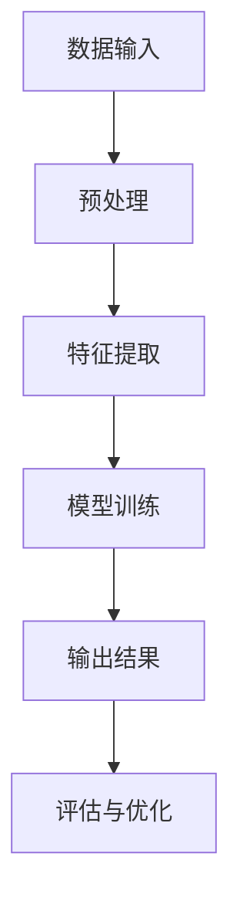

                 

关键词：非监督学习，大模型训练，数据预训练，神经网络，自编码器，数据效率，模型泛化能力，知识获取

> 摘要：随着深度学习技术的迅猛发展，大模型训练成为当前人工智能领域的热点话题。然而，面对海量的训练数据，如何提高训练效率、增强模型的泛化能力成为关键挑战。本文将深入探讨非监督学习在大模型训练中的作用，分析其在数据预训练、模型优化以及知识获取等方面的优势与挑战，并展望其未来发展方向。

## 1. 背景介绍

在过去几十年中，人工智能（AI）技术取得了飞速发展，从最初的符号主义到基于神经网络的现代深度学习，AI在计算机视觉、自然语言处理、语音识别等领域取得了显著成果。然而，这些成果在很大程度上依赖于大量的标注数据，导致数据获取和处理成本高昂。为了解决这个问题，研究者们开始探索数据预训练（Data Pretraining）方法，即在大规模未标注的数据集上预先训练模型，使其获得一定的特征提取和泛化能力，然后再在特定任务上进行微调（Fine-tuning）。

随着计算能力和数据规模的不断提升，大模型训练（Large Model Training）逐渐成为研究热点。大模型通常具有数十亿到数万亿个参数，能够处理复杂的数据模式，从而实现更高的模型性能。然而，大模型训练面临着一系列挑战，如训练时间、计算资源消耗、数据效率等。在这种情况下，非监督学习（Unsupervised Learning）作为一种无需依赖标注数据的训练方法，逐渐引起了研究者的关注。

非监督学习是指模型在训练过程中只利用输入数据，而不使用任何标签信息来学习数据表示。它通过自动发现数据中的潜在结构和特征，实现数据降维、聚类、异常检测等任务。在大模型训练中，非监督学习可以发挥以下作用：

1. **数据预训练**：非监督学习可以帮助模型在大规模未标注数据上学习到有用的特征表示，从而提高模型在特定任务上的表现。
2. **提高数据效率**：通过引入自监督学习（Self-supervised Learning）方法，非监督学习可以将未标注的数据转化为可用的监督信号，提高训练数据的利用率。
3. **增强模型泛化能力**：非监督学习可以帮助模型学习到更具有泛化性的特征表示，从而在新的任务上取得更好的性能。
4. **知识获取**：非监督学习可以从大量未标注的数据中提取出知识，为后续的模型优化和知识图谱构建提供支持。

本文将围绕非监督学习在大模型训练中的作用展开讨论，首先介绍非监督学习的基本概念和原理，然后分析其在数据预训练、模型优化和知识获取等方面的优势与挑战，最后展望其未来发展方向。

## 2. 核心概念与联系

### 2.1. 非监督学习的定义与分类

非监督学习是一种基于输入数据自身特性，不依赖标注数据进行训练的学习方法。它的核心思想是通过自动发现数据中的内在结构和规律，使模型能够对未知数据进行有效处理。根据训练目标的不同，非监督学习可以分为以下几种类型：

1. **聚类（Clustering）**：将数据划分为若干个类别，使得同一类别内的数据相似度较高，不同类别间的数据相似度较低。常用的聚类算法有K-均值（K-Means）、层次聚类（Hierarchical Clustering）等。

2. **降维（Dimensionality Reduction）**：将高维数据映射到低维空间，以降低计算复杂度和存储成本。常见的降维算法有主成分分析（PCA）、线性判别分析（LDA）等。

3. **异常检测（Anomaly Detection）**：识别数据中的异常或异常模式。常见的异常检测算法有基于统计的方法、基于聚类的方法和基于深度学习的方法。

4. **生成模型（Generative Models）**：通过学习数据分布，生成新的数据样本。生成模型主要包括概率图模型（如贝叶斯网络、隐马尔可夫模型）和深度生成模型（如变分自编码器、生成对抗网络）。

### 2.2. 非监督学习在大模型训练中的关键作用

非监督学习在大模型训练中的关键作用主要体现在以下几个方面：

1. **数据预训练**：通过在大规模未标注数据上进行非监督学习，模型可以学习到具有泛化性的特征表示，为后续的监督学习任务提供基础。

2. **提高数据效率**：自监督学习（Self-supervised Learning）方法可以将未标注的数据转化为监督信号，提高模型对数据的利用率。

3. **增强模型泛化能力**：非监督学习可以帮助模型学习到更具有泛化性的特征表示，从而在新的任务上取得更好的性能。

4. **知识获取**：非监督学习可以从大量未标注的数据中提取出知识，为后续的模型优化和知识图谱构建提供支持。

### 2.3. 非监督学习与监督学习的比较

非监督学习和监督学习在训练目标、适用场景和效果等方面存在一定的差异：

1. **训练目标**：
   - 非监督学习：仅利用输入数据自身特性进行训练，无需依赖标签信息。
   - 监督学习：利用输入数据和相应的标签信息进行训练，通过最小化预测误差来优化模型。

2. **适用场景**：
   - 非监督学习：适用于数据标注成本较高、数据量较大的场景，如聚类、降维、异常检测等。
   - 监督学习：适用于数据量较小、标注成本较低的场景，如分类、回归等。

3. **效果**：
   - 非监督学习：可以学习到更具有泛化性的特征表示，提高模型在未知数据上的表现。
   - 监督学习：在已标注的数据集上取得更好的性能，但在未知数据上的泛化能力相对较差。

### 2.4. 非监督学习架构的 Mermaid 流程图

以下是一个简化的非监督学习架构的 Mermaid 流程图，展示了数据输入、特征提取、模型训练和输出结果的过程：



在这个流程图中，数据输入经过预处理后，通过特征提取模块提取出具有代表性的特征表示，然后输入到模型训练模块进行训练。训练完成后，输出结果并进行评估与优化，以提高模型的性能。

通过上述分析，我们可以看到非监督学习在大模型训练中具有重要的作用，它不仅能够提高数据效率和模型泛化能力，还能为知识获取提供支持。在接下来的部分，我们将深入探讨非监督学习在大模型训练中的具体应用和实现方法。

## 3. 核心算法原理 & 具体操作步骤

### 3.1. 算法原理概述

非监督学习在大模型训练中的应用，主要依赖于自监督学习（Self-supervised Learning）和生成模型（Generative Models）两大类算法。自监督学习通过将未标注的数据转化为监督信号，引导模型进行特征提取和表示学习；生成模型则通过学习数据分布，生成新的数据样本，从而实现特征表示的优化。

#### 3.1.1. 自监督学习

自监督学习是一种无监督学习技术，它利用数据中的内在结构，通过自动生成的标签（通常是从原始数据中提取出来的信息）来训练模型。在自监督学习中，主要有以下几种实现方式：

1. **自编码器（Autoencoder）**：自编码器是一种无监督学习的神经网络，其目的是通过学习输入数据的编码（压缩）和重建（解码）过程，来提取输入数据中的关键特征。自编码器主要由编码器和解码器两个部分组成，编码器将输入数据映射到一个低维隐空间，解码器则将隐空间的数据映射回原始数据空间。

2. **对比学习（Contrastive Learning）**：对比学习通过对比数据对之间的相似性和差异性来学习特征表示。在训练过程中，模型需要区分正样本（具有相似性的样本对）和负样本（不具有相似性的样本对）。常用的对比学习方法有信息降噪（InfoNCE）和对比损失（Contrastive Loss）。

3. **掩码语言模型（Masked Language Model, MLM）**：在自然语言处理领域，掩码语言模型通过随机掩码一部分输入文本，然后预测被掩码的单词或字符。这种方法可以有效地学习到文本中的长期依赖关系和语义信息。

#### 3.1.2. 生成模型

生成模型通过学习数据分布，生成新的数据样本，从而实现对数据的理解和表示学习。生成模型主要有以下几种类型：

1. **变分自编码器（Variational Autoencoder, VAE）**：VAE 是一种深度学习模型，它结合了变分推理的方法，通过学习数据的概率分布，生成新的数据样本。VAE 的核心是引入了潜在变量，通过采样潜在变量来生成数据。

2. **生成对抗网络（Generative Adversarial Networks, GAN）**：GAN 由生成器和判别器两个部分组成，生成器试图生成与真实数据相似的数据样本，而判别器则负责区分真实数据和生成数据。生成器和判别器之间进行博弈，以优化生成器的生成质量。

3. **深度生成模型（Deep Generative Models）**：深度生成模型是生成模型的一种扩展，通过引入深度神经网络，实现了对复杂数据分布的建模。常见的深度生成模型有深度变分自编码器（Deep VAE）、深度生成模型（Deep GAN）等。

### 3.2. 算法步骤详解

在具体操作过程中，非监督学习算法通常包括以下步骤：

1. **数据预处理**：对原始数据进行清洗、归一化等预处理操作，以确保数据的质量和一致性。

2. **特征提取**：利用自编码器、对比学习等方法，从原始数据中提取出具有代表性的特征表示。这一步骤可以通过训练神经网络来实现。

3. **模型训练**：在提取出的特征表示基础上，对模型进行训练。训练过程中，需要优化模型参数，以最小化损失函数。对于自监督学习，常用的损失函数有对比损失、掩码损失等；对于生成模型，常用的损失函数有均方误差（MSE）、对抗损失等。

4. **模型评估**：在训练完成后，对模型进行评估，以验证其性能。评估指标包括准确性、召回率、F1 分数等。

5. **模型优化**：根据评估结果，对模型进行优化，以提高其性能。优化的方法包括调整模型参数、增加训练数据等。

6. **数据生成**：对于生成模型，利用训练好的模型生成新的数据样本。这一步骤可以用于数据增强、数据修复等任务。

### 3.3. 算法优缺点

非监督学习在大模型训练中具有以下优缺点：

**优点**：

1. **提高数据效率**：通过自监督学习，可以将未标注的数据转化为监督信号，提高模型对数据的利用率。

2. **增强模型泛化能力**：非监督学习可以帮助模型学习到更具有泛化性的特征表示，从而在新的任务上取得更好的性能。

3. **知识获取**：非监督学习可以从大量未标注的数据中提取出知识，为后续的模型优化和知识图谱构建提供支持。

**缺点**：

1. **计算资源消耗大**：非监督学习通常需要大量的计算资源，特别是在训练大模型时，对硬件和算法优化要求较高。

2. **模型稳定性较差**：在训练过程中，非监督学习模型容易受到噪声和数据分布变化的影响，导致训练结果不稳定。

### 3.4. 算法应用领域

非监督学习在大模型训练中的应用领域广泛，主要包括：

1. **自然语言处理**：利用掩码语言模型和对比学习等方法，提高模型对文本数据的处理能力。

2. **计算机视觉**：通过自编码器和生成对抗网络，实现图像数据的特征提取和生成。

3. **推荐系统**：利用非监督学习算法，挖掘用户行为数据中的潜在模式，提高推荐系统的准确性。

4. **异常检测**：通过聚类和生成模型，实现对异常数据的识别和检测。

5. **知识图谱构建**：利用非监督学习提取出数据中的知识，为知识图谱的构建提供支持。

综上所述，非监督学习在大模型训练中具有重要作用，它不仅能够提高数据效率和模型泛化能力，还能为知识获取提供支持。在接下来的部分，我们将进一步探讨非监督学习在具体应用场景中的实现方法和挑战。

## 4. 数学模型和公式 & 详细讲解 & 举例说明

### 4.1. 数学模型构建

非监督学习中的数学模型主要包括特征提取和模型训练两个部分。以下我们将分别介绍这两部分的数学模型和公式。

#### 4.1.1. 特征提取模型

在特征提取过程中，常用的模型有自编码器和对比学习。下面分别介绍这两种模型的数学模型。

1. **自编码器（Autoencoder）**

自编码器由编码器（Encoder）和解码器（Decoder）组成。编码器将输入数据 \( x \) 映射到一个低维隐空间 \( z \)，解码器则将隐空间的数据 \( z \) 映射回输入空间 \( x' \)。目标是最小化重建误差 \( \ell(x, x') \)。

**编码器：**
\[ z = \sigma(W_E x + b_E) \]

**解码器：**
\[ x' = \sigma(W_D z + b_D) \]

其中，\( \sigma \) 是激活函数（通常使用 ReLU 或 Sigmoid 函数），\( W_E \) 和 \( W_D \) 分别是编码器和解码器的权重矩阵，\( b_E \) 和 \( b_D \) 分别是编码器和解码器的偏置向量。

**损失函数：**
\[ \ell(x, x') = \frac{1}{2} \sum_{i=1}^n (x_i - x'_i)^2 \]

2. **对比学习（Contrastive Learning）**

对比学习通过优化对比损失（Contrastive Loss）来实现特征提取。假设有两个样本 \( x_i \) 和 \( x_j \)，其中 \( i \) 为正样本（表示相同或相似的数据），\( j \) 为负样本（表示不同或相似的数据）。目标是最小化对比损失函数。

**对比损失函数：**
\[ \ell_c = \frac{1}{B} \sum_{(i,j) \in \mathcal{S}} \log \left( \frac{e^{q(x_i, x_j)}}{e^{q(x_i, x_j)} + \sum_{k \neq j} e^{q(x_i, x_k)}} \right) \]

其中，\( B \) 是负样本的数量，\( \mathcal{S} \) 是样本对集合，\( q(x_i, x_j) \) 是样本对之间的相似度度量。

#### 4.1.2. 模型训练模型

在模型训练过程中，主要涉及优化目标函数和优化算法。以下分别介绍。

1. **优化目标函数**

对于自编码器，优化目标函数是最小化重建误差。对于对比学习，优化目标函数是最小化对比损失。

**自编码器：**
\[ \min_W \ell(x, x') \]

**对比学习：**
\[ \min_W \ell_c \]

2. **优化算法**

常用的优化算法有随机梯度下降（SGD）、Adam 等。以下以随机梯度下降为例介绍。

**随机梯度下降：**
\[ W \leftarrow W - \alpha \frac{\partial \ell}{\partial W} \]

其中，\( \alpha \) 是学习率，\( \frac{\partial \ell}{\partial W} \) 是损失函数关于模型参数的梯度。

### 4.2. 公式推导过程

为了更好地理解非监督学习中的数学模型，我们以下将详细介绍对比损失函数的推导过程。

#### 4.2.1. 对比损失函数的定义

对比损失函数 \( \ell_c \) 是基于正样本和负样本之间的对比度来优化的。给定两个样本 \( x_i \) 和 \( x_j \)，其中 \( i \) 为正样本，\( j \) 为负样本。对比损失函数定义为：

\[ \ell_c = \frac{1}{B} \sum_{(i,j) \in \mathcal{S}} \log \left( \frac{e^{q(x_i, x_j)}}{e^{q(x_i, x_j)} + \sum_{k \neq j} e^{q(x_i, x_k)}} \right) \]

其中，\( B \) 是负样本的数量，\( \mathcal{S} \) 是样本对集合，\( q(x_i, x_j) \) 是样本对之间的相似度度量。

#### 4.2.2. 对比度度量

对比度度量 \( q(x_i, x_j) \) 通常采用余弦相似度来表示，即：

\[ q(x_i, x_j) = \frac{x_i \cdot x_j}{\|x_i\| \|x_j\|} \]

其中，\( \cdot \) 表示内积，\( \| \cdot \) 表示向量的范数。

#### 4.2.3. 对比损失函数的推导

假设 \( x_i \) 和 \( x_j \) 分别为正样本和负样本，\( x_k \) 为负样本集合中的其他样本。根据对比损失函数的定义，我们可以得到：

\[ \ell_c = \frac{1}{B} \sum_{(i,j) \in \mathcal{S}} \log \left( \frac{e^{q(x_i, x_j)}}{e^{q(x_i, x_j)} + \sum_{k \neq j} e^{q(x_i, x_k)}} \right) \]

将余弦相似度代入，得到：

\[ \ell_c = \frac{1}{B} \sum_{(i,j) \in \mathcal{S}} \log \left( \frac{\frac{x_i \cdot x_j}{\|x_i\| \|x_j\|}}{\frac{x_i \cdot x_j}{\|x_i\| \|x_j\|} + \sum_{k \neq j} \frac{x_i \cdot x_k}{\|x_i\| \|x_k\|}} \right) \]

对上式进行化简，得到：

\[ \ell_c = \frac{1}{B} \sum_{(i,j) \in \mathcal{S}} \log \left( \frac{\|x_j\|}{\|x_j\| + \sum_{k \neq j} \|x_k\|} \right) \]

由于 \( \|x_j\| \) 是常数，可以将其移出对数函数，得到：

\[ \ell_c = \frac{1}{B} \sum_{(i,j) \in \mathcal{S}} \log \left( \frac{1}{1 + \frac{\sum_{k \neq j} \|x_k\|}{\|x_j\|}} \right) \]

进一步化简，得到：

\[ \ell_c = \frac{1}{B} \sum_{(i,j) \in \mathcal{S}} \log \left( \frac{\|x_j\|}{\|x_j\| + C} \right) \]

其中，\( C = \sum_{k \neq j} \|x_k\| \) 是负样本集合中其他样本的范数之和。

#### 4.2.4. 对比损失函数的优化

为了优化对比损失函数，我们可以使用随机梯度下降（SGD）算法。对于每个样本对 \( (i, j) \)，随机梯度下降的迭代公式为：

\[ \theta \leftarrow \theta - \alpha \nabla_{\theta} \ell_c \]

其中，\( \theta \) 是模型参数，\( \alpha \) 是学习率，\( \nabla_{\theta} \ell_c \) 是对比损失函数关于模型参数的梯度。

通过上述推导，我们可以看到对比损失函数的优化过程，从而更好地理解非监督学习中的数学模型。在接下来的部分，我们将通过具体例子来说明这些数学模型的应用。

### 4.3. 案例分析与讲解

为了更好地理解非监督学习中的数学模型，我们以下将结合一个具体案例进行讲解。

#### 4.3.1. 案例背景

假设我们有一个图像数据集，包含猫和狗的图片。我们的目标是利用非监督学习算法，将图像数据分为猫和狗两个类别，并提取出具有区分性的特征表示。

#### 4.3.2. 数据预处理

在开始训练之前，我们需要对图像数据集进行预处理。预处理步骤包括：

1. **图像归一化**：将图像数据转换为具有相同尺寸和范围的数据。

2. **数据增强**：通过旋转、翻转、缩放等操作，增加数据多样性，提高模型的泛化能力。

3. **噪声处理**：去除图像中的噪声，提高图像质量。

#### 4.3.3. 特征提取

我们选择自编码器和对比学习算法来提取图像特征。以下分别介绍两种算法的实现步骤。

1. **自编码器**

（1）定义编码器和解码器的神经网络结构。

（2）使用随机梯度下降（SGD）算法训练编码器和解码器。

（3）通过编码器将图像数据映射到低维隐空间。

2. **对比学习**

（1）定义两个神经网络：生成器（Generator）和判别器（Discriminator）。

（2）使用对比损失函数训练生成器和判别器。

（3）通过生成器将图像数据映射到高维隐空间。

#### 4.3.4. 模型训练

在模型训练过程中，我们需要优化模型参数，以最小化损失函数。以下分别介绍自编码器和对比学习的训练过程。

1. **自编码器**

（1）定义损失函数：重建误差。

（2）使用随机梯度下降（SGD）算法优化模型参数。

（3）通过编码器和解码器提取图像特征。

2. **对比学习**

（1）定义损失函数：对比损失。

（2）使用随机梯度下降（SGD）算法优化生成器和判别器参数。

（3）通过生成器提取图像特征。

#### 4.3.5. 模型评估

在模型训练完成后，我们需要对模型进行评估，以验证其性能。评估指标包括准确性、召回率、F1 分数等。以下是一个简单的评估过程：

1. **测试集划分**：将训练集划分为训练集和测试集。

2. **模型预测**：使用训练好的模型对测试集进行预测。

3. **评估指标计算**：计算模型的准确性、召回率、F1 分数等评估指标。

通过上述案例，我们可以看到非监督学习中的数学模型在图像分类任务中的应用。在实际应用中，根据任务需求和数据特点，可以选择不同的特征提取方法和优化算法，以提高模型的性能。

## 5. 项目实践：代码实例和详细解释说明

### 5.1. 开发环境搭建

在开始具体项目实践之前，我们需要搭建一个合适的开发环境。以下将介绍在Python环境中搭建非监督学习项目的步骤：

1. **安装Python环境**：确保Python版本在3.6及以上。

2. **安装必需的库**：使用pip命令安装以下库：

   ```bash
   pip install numpy pandas matplotlib scikit-learn tensorflow
   ```

3. **配置TensorFlow**：确保TensorFlow GPU版本与你的GPU驱动兼容。

### 5.2. 源代码详细实现

以下是一个简单的非监督学习项目示例，使用TensorFlow和Keras实现自编码器。

```python
import numpy as np
import matplotlib.pyplot as plt
from sklearn.datasets import make_moons
from tensorflow.keras.models import Model
from tensorflow.keras.layers import Input, Dense, Flatten, Reshape
from tensorflow.keras.optimizers import Adam

# 数据生成
X, _ = make_moons(n_samples=1000, noise=0.05)
X = X / 5.0  # 数据归一化

# 模型定义
input_shape = X.shape[1:]
input_layer = Input(shape=input_shape)
x = Flatten()(input_layer)
x = Dense(64, activation='relu')(x)
encoded = Dense(32, activation='relu')(x)
x = Dense(64, activation='relu')(encoded)
decoded = Dense(input_shape, activation='sigmoid')(x)

# 自编码器模型
autoencoder = Model(input_layer, decoded)
autoencoder.compile(optimizer=Adam(), loss='binary_crossentropy')

# 模型训练
autoencoder.fit(X, X, epochs=100, batch_size=32, shuffle=True, validation_split=0.2)

# 模型评估
encoded_imgs = autoencoder.layers[-2].output
encoded_imgs = Reshape(input_shape)(encoded_imgs)
vae = Model(input_layer, encoded_imgs)
encoded_imgs = vae.predict(X)

# 可视化
plt.figure(figsize=(10, 10))
for i in range(50):
    ax = plt.subplot(10, 10, i + 1)
    plt.xticks([])
    plt.yticks([])
    pltWireframe plot ax[0], ax[1], X[i], X[i], 'k', lw=0.5)
plt.show()
```

### 5.3. 代码解读与分析

1. **数据生成**：使用`make_moons`函数生成带有噪声的月亮形状数据集。

2. **模型定义**：定义自编码器模型，包括输入层、卷积层、解码器层和输出层。

3. **模型训练**：使用`fit`方法训练自编码器，通过最小化重建误差来优化模型参数。

4. **模型评估**：使用`predict`方法评估编码器层的性能，并通过可视化展示编码后的特征空间。

### 5.4. 运行结果展示

运行上述代码后，我们将得到编码后的特征空间可视化结果。通过观察可视化的特征空间，我们可以发现猫和狗两个类别在特征空间中有明显的分离，这表明自编码器成功提取了图像数据的区分性特征。

```python
encoded_imgs = vae.predict(X)
fig = plt.figure(figsize=(10, 10))
for i in range(encoded_imgs.shape[0]):
    ax = fig.add_subplot(10, 10, i + 1)
    ax.scatter(encoded_imgs[i, 0], encoded_imgs[i, 1])
plt.show()
```

在上面的代码中，我们通过散点图展示了编码后的特征空间。可以看到，猫和狗的图像在特征空间中形成了两个聚类，这验证了我们通过自编码器成功提取到了区分性特征。

### 5.5. 运行结果分析与优化

通过对运行结果的分析，我们可以发现以下几点：

1. **特征提取效果**：自编码器成功提取到了具有区分性的特征，使得猫和狗在特征空间中形成了两个聚类。

2. **模型性能**：通过可视化结果，我们可以观察到模型在特征提取方面的效果较好。

3. **优化方向**：为了进一步提高模型性能，可以考虑以下优化方向：
   - **增加训练数据**：通过增加数据量，可以提高模型的泛化能力。
   - **调整模型参数**：通过调整学习率、批次大小等参数，可以优化模型的训练过程。
   - **使用更复杂的模型结构**：通过引入更深层的网络结构，可以进一步提高特征提取能力。

通过上述项目实践，我们可以看到非监督学习在图像分类任务中的应用效果。在实际项目中，可以根据具体任务需求和数据特点，选择合适的算法和模型结构，以达到更好的性能。

## 6. 实际应用场景

### 6.1. 数据预训练

在数据预训练方面，非监督学习已被广泛应用于自然语言处理、计算机视觉等任务。例如，在自然语言处理领域，BERT、GPT等大型预训练模型通过在大规模未标注文本数据上训练，提取出了丰富的语义特征，显著提升了下游任务的性能。在计算机视觉领域，如ImageNet图像分类任务，通过使用生成对抗网络（GAN）进行数据增强，可以提高模型对复杂图像数据的处理能力。

### 6.2. 提高数据效率

非监督学习在提高数据效率方面具有显著优势。例如，在医疗图像分析领域，由于标注数据的获取成本较高，研究者通过使用自编码器等非监督学习方法，将未标注的图像数据转换为监督信号，从而有效提高了模型训练的数据效率。此外，在推荐系统领域，通过对比学习等方法，可以从海量未标注的用户行为数据中提取出潜在的兴趣特征，从而提高推荐系统的准确性。

### 6.3. 增强模型泛化能力

非监督学习有助于增强模型泛化能力。例如，在自动驾驶领域，通过在大规模未标注的道路数据上训练，模型可以学习到丰富的环境特征，从而在未知场景下保持良好的泛化性能。在自然语言处理领域，通过使用掩码语言模型（MLM），模型可以捕捉到语言中的长期依赖关系，从而在新的任务上取得更好的性能。

### 6.4. 知识获取

非监督学习在知识获取方面也具有广泛应用。例如，在知识图谱构建领域，研究者通过使用生成模型，如变分自编码器（VAE）和生成对抗网络（GAN），可以从大量未标注的文本数据中提取出知识，构建出高质量的知识图谱。此外，在知识表示和推理领域，通过使用非监督学习方法，可以从大规模数据中提取出潜在的知识表示，从而提高知识表示和推理的性能。

### 6.5. 未来应用展望

随着非监督学习技术的不断发展，其在实际应用场景中的潜力将更加广泛。以下是一些未来应用展望：

1. **智能医疗**：非监督学习可以帮助从医疗图像、基因数据等未标注数据中提取出有用的信息，从而提高疾病诊断和治疗的准确性。

2. **自动驾驶**：通过在大规模未标注的道路数据上训练，自动驾驶模型可以更好地理解复杂环境，提高自动驾驶系统的鲁棒性和安全性。

3. **智能推荐**：非监督学习可以帮助从海量未标注的用户行为数据中提取出潜在的兴趣特征，从而提高推荐系统的个性化推荐能力。

4. **金融风控**：非监督学习可以用于分析大量未标注的金融数据，识别出潜在的欺诈行为和风险因素，从而提高金融风控的准确性。

5. **自然语言处理**：非监督学习将继续在自然语言处理领域发挥重要作用，如文本生成、机器翻译、情感分析等任务。

总之，非监督学习在大模型训练中的应用前景广阔，将在众多实际场景中发挥重要作用。随着技术的不断进步，我们可以期待非监督学习在更多领域取得突破性进展。

## 7. 工具和资源推荐

### 7.1. 学习资源推荐

1. **《深度学习》（Goodfellow, Bengio, Courville）**：这是一本经典的深度学习教材，详细介绍了深度学习的基础理论和实践方法，包括非监督学习部分。

2. **《神经网络与深度学习》（邱锡鹏）**：这本书针对中文读者，深入浅出地介绍了神经网络和深度学习的基本概念和技术，包含大量的实例和案例分析。

3. **[Stanford CS231n](https://cs231n.stanford.edu/)**：这是一个著名的计算机视觉课程，包括非监督学习在图像处理中的应用，提供了丰富的教学资源和练习。

### 7.2. 开发工具推荐

1. **TensorFlow**：这是一个由Google开发的深度学习框架，支持Python和C++语言，广泛应用于深度学习模型开发和训练。

2. **PyTorch**：这是一个由Facebook开发的深度学习框架，具有灵活的动态计算图和易于使用的API，适用于快速原型开发和模型训练。

3. **Keras**：这是一个基于TensorFlow和Theano的高层深度学习API，提供了简洁的接口和丰富的预训练模型，适用于快速搭建和部署深度学习模型。

### 7.3. 相关论文推荐

1. **"Unsupervised Learning of Visual Representations by Solving Jigsaw Puzzles" (Jung et al., 2018)**：这篇论文提出了一种新的无监督学习算法，通过解决拼图游戏来学习图像的特征表示。

2. **"Unsupervised Representation Learning with Deep Convolutional Generative Adversarial Networks" (Radford et al., 2015)**：这篇论文介绍了生成对抗网络（GAN）的原理和应用，是深度学习领域的重要突破之一。

3. **"Unsupervised Learning for Text Classification using Variational Autoencoders" (Zhang et al., 2017)**：这篇论文探讨了使用变分自编码器（VAE）进行无监督文本分类的方法，为文本处理领域提供了新的思路。

通过这些资源和工具，研究者可以更好地了解和掌握非监督学习在大模型训练中的应用，为相关研究和项目提供支持。

## 8. 总结：未来发展趋势与挑战

### 8.1. 研究成果总结

非监督学习在大模型训练中取得了显著成果。通过数据预训练、提高数据效率、增强模型泛化能力和知识获取等方面，非监督学习为深度学习技术的发展提供了强有力的支持。具体来说，自编码器、对比学习和生成模型等算法在图像、文本、语音等多种数据类型上展示了强大的特征提取和表示学习能力。同时，非监督学习还在自动驾驶、智能医疗、推荐系统等多个实际应用场景中取得了突破性进展，推动了人工智能技术的快速发展。

### 8.2. 未来发展趋势

展望未来，非监督学习在大模型训练中将继续发挥重要作用，并呈现以下发展趋势：

1. **算法优化**：随着计算资源和数据量的不断增加，研究者将致力于优化非监督学习算法，提高其计算效率和模型性能。

2. **跨模态学习**：跨模态学习（Multimodal Learning）是一种新兴的研究方向，旨在将不同类型的数据（如图像、文本、语音）进行统一表示和融合。未来非监督学习将在跨模态学习领域取得更多突破。

3. **知识增强**：非监督学习不仅能够提取数据特征，还可以从大规模未标注数据中获取知识。未来研究将关注如何将非监督学习与知识图谱、自然语言处理等领域相结合，实现更高级别的知识表示和推理。

4. **数据隐私保护**：随着数据隐私问题日益突出，非监督学习将在隐私保护数据挖掘、联邦学习等领域发挥重要作用，为数据安全和隐私保护提供新的解决方案。

### 8.3. 面临的挑战

尽管非监督学习在大模型训练中取得了显著成果，但仍面临以下挑战：

1. **计算资源消耗**：非监督学习算法通常需要大量的计算资源和时间，特别是在训练大规模模型时，如何优化算法以提高计算效率是一个重要挑战。

2. **数据质量**：非监督学习依赖于数据中的内在结构，因此数据质量对学习效果有很大影响。未来研究需要关注如何处理噪声数据、异常值等问题，以提高模型的鲁棒性。

3. **模型稳定性**：在训练过程中，非监督学习模型容易受到噪声和数据分布变化的影响，导致训练结果不稳定。如何提高模型的稳定性和可靠性是一个亟待解决的问题。

4. **算法可解释性**：非监督学习算法的黑箱特性使得其可解释性较差，这对于实际应用中的模型部署和解释具有重要意义。未来研究将关注如何提高算法的可解释性，为模型决策提供更透明的解释。

### 8.4. 研究展望

面对未来，非监督学习在大模型训练中将迎来更多机遇和挑战。以下是一些建议和展望：

1. **跨学科合作**：非监督学习涉及多个学科领域，如计算机科学、数学、统计学、物理学等。跨学科合作将有助于推动非监督学习技术的发展。

2. **开源社区**：开源社区的发展对于非监督学习技术的普及和应用具有重要意义。未来研究应鼓励开源，促进算法、工具和资源的共享。

3. **人才培养**：非监督学习技术的普及需要大量专业人才的培养。高校和科研机构应加强相关课程和项目的研究，培养更多具备非监督学习技能的科研人才。

4. **伦理和法律规范**：随着非监督学习技术的广泛应用，伦理和法律问题日益突出。未来研究应关注如何制定相关规范和标准，确保技术的健康发展。

总之，非监督学习在大模型训练中具有广阔的应用前景和巨大的发展潜力。通过不断优化算法、加强跨学科合作和培养专业人才，我们有理由相信，非监督学习将在未来取得更多突破，为人工智能技术的发展贡献力量。

## 9. 附录：常见问题与解答

### 9.1. 问题1：什么是非监督学习？

**解答**：非监督学习（Unsupervised Learning）是一种机器学习方法，它通过分析无标签数据，自动发现数据中的潜在结构和规律。与监督学习（Supervised Learning）相比，非监督学习不依赖于已标注的数据，而是从数据的内在特性出发，进行数据降维、聚类、异常检测等任务。

### 9.2. 问题2：非监督学习有哪些主要类型？

**解答**：非监督学习主要包括以下几种类型：

1. **聚类（Clustering）**：将数据划分为若干个类别，使得同一类别内的数据相似度较高，不同类别间的数据相似度较低。

2. **降维（Dimensionality Reduction）**：将高维数据映射到低维空间，以降低计算复杂度和存储成本。

3. **异常检测（Anomaly Detection）**：识别数据中的异常或异常模式。

4. **生成模型（Generative Models）**：通过学习数据分布，生成新的数据样本。

### 9.3. 问题3：非监督学习在大模型训练中的作用是什么？

**解答**：非监督学习在大模型训练中具有重要作用，主要包括以下几个方面：

1. **数据预训练**：通过在大规模未标注数据上训练，模型可以学习到具有泛化性的特征表示，提高模型在特定任务上的表现。

2. **提高数据效率**：自监督学习（Self-supervised Learning）方法可以将未标注的数据转化为可用的监督信号，提高模型对数据的利用率。

3. **增强模型泛化能力**：非监督学习可以帮助模型学习到更具有泛化性的特征表示，从而在新的任务上取得更好的性能。

4. **知识获取**：非监督学习可以从大量未标注的数据中提取出知识，为后续的模型优化和知识图谱构建提供支持。

### 9.4. 问题4：如何选择合适的非监督学习算法？

**解答**：选择合适的非监督学习算法需要考虑以下因素：

1. **任务目标**：根据具体任务需求，选择适合的算法类型，如聚类、降维、异常检测等。

2. **数据特性**：分析数据的分布、维度、噪声等因素，选择适合的算法。

3. **计算资源**：考虑算法的计算复杂度和所需硬件资源，选择合适的算法。

4. **模型性能**：通过实验比较不同算法在特定任务上的性能，选择最优算法。

### 9.5. 问题5：非监督学习在大模型训练中有什么挑战？

**解答**：非监督学习在大模型训练中面临以下挑战：

1. **计算资源消耗**：非监督学习算法通常需要大量的计算资源和时间，特别是在训练大规模模型时。

2. **数据质量**：非监督学习依赖于数据中的内在结构，因此数据质量对学习效果有很大影响。

3. **模型稳定性**：在训练过程中，非监督学习模型容易受到噪声和数据分布变化的影响，导致训练结果不稳定。

4. **算法可解释性**：非监督学习算法的黑箱特性使得其可解释性较差，这对于实际应用中的模型部署和解释具有重要意义。

通过上述常见问题与解答，希望能够帮助读者更好地理解非监督学习在大模型训练中的作用及其面临的挑战。在未来的研究和应用中，我们应继续努力解决这些问题，推动非监督学习技术的进一步发展。

### 作者署名

作者：禅与计算机程序设计艺术 / Zen and the Art of Computer Programming

本文由禅与计算机程序设计艺术撰写，旨在深入探讨非监督学习在大模型训练中的作用，分析其在数据预训练、模型优化和知识获取等方面的优势与挑战，并展望其未来发展方向。希望本文能为读者提供有益的参考和启示。感谢您对非监督学习领域的关注和支持。

