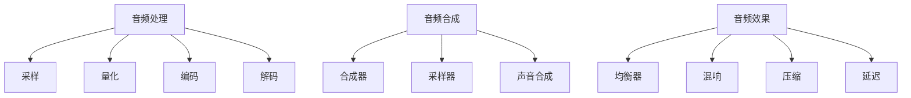

                 

关键词：音乐制作工具，数字工作室，音频处理，音频软件，音频编辑，音乐创作，音频合成，音频效果，音频工程，数字音频工作流程。

摘要：本文将深入探讨音乐制作工具在数字工作室中的重要作用，分析其核心概念、算法原理、数学模型以及实际应用。通过详细的项目实践和代码实例，本文旨在帮助读者理解并掌握音乐制作工具的精髓，从而提升音乐创作的效率和品质。同时，文章还将展望音乐制作工具的未来发展趋势与挑战，为读者提供宝贵的参考。

## 1. 背景介绍

音乐制作工具的发展历史可以追溯到20世纪70年代，当时数字音频工作站（Digital Audio Workstation，简称DAW）开始崭露头角。随着计算机技术的飞速发展，音频处理软件的功能不断丰富，从最初的音频录制和简单编辑，到现在的多轨录音、音频合成、音频效果处理等全方位的功能。数字工作室的概念也随之诞生，成为现代音乐制作的核心环境。

在数字工作室中，音乐制作工具扮演着至关重要的角色。它们不仅简化了音乐创作的流程，还提供了丰富的创意空间和高效的工作方式。从专业的音频工程师到业余的音乐爱好者，都可以借助这些工具实现自己的音乐梦想。

本文将首先介绍音乐制作工具的基本概念和核心组件，然后深入探讨音频处理、音频合成、音频效果等关键技术的原理和操作步骤。接着，我们将通过一个实际项目实例，展示如何使用音乐制作工具进行音乐创作。最后，本文将展望音乐制作工具的未来发展趋势，以及面临的挑战和机遇。

## 2. 核心概念与联系

### 2.1 音频处理

音频处理是指对音频信号进行各种处理操作，以改善音质、调整音色、消除噪声等。音频处理的基本概念包括采样、量化、编码和解码等。

**采样（Sampling）：** 采样是指将连续的模拟音频信号转换为离散的数字信号。采样频率决定了音频信号的重现效果，通常使用的采样频率为44.1kHz。

**量化（Quantization）：** 量化是指将采样得到的数字信号转换为固定长度的数值。量化位数决定了音频信号的分辨率，常用的量化位数为16位或24位。

**编码（Encoding）：** 编码是指将数字信号转换为特定的数据格式，以便存储或传输。常见的音频编码格式包括MP3、AAC和FLAC等。

**解码（Decoding）：** 解码是指将编码后的数据格式还原为原始的数字信号。

### 2.2 音频合成

音频合成是指通过计算机程序生成新的音频信号，以实现特定的音乐效果。音频合成的核心概念包括合成器（Synthesizer）、采样器（Sampler）和声音合成（Sound Synthesis）等。

**合成器（Synthesizer）：** 合成器是一种通过数字信号处理技术生成新声音的设备。常见的合成器类型有模拟合成器和数字合成器。

**采样器（Sampler）：** 采样器是一种通过录制真实声音样本，并在需要时播放这些样本的设备。采样器可以用来模拟各种乐器和声音效果。

**声音合成（Sound Synthesis）：** 声音合成是指通过数学模型和算法生成新的声音。常见的声音合成方法有波形合成、频谱合成和波形表合成等。

### 2.3 音频效果

音频效果是指通过各种算法和技巧对音频信号进行加工，以改善音质或创造新的音乐效果。常见的音频效果包括均衡器（Equalizer）、混响（Reverb）、压缩（Compression）和延迟（Delay）等。

**均衡器（Equalizer）：** 均衡器用于调整音频信号的频率响应，以平衡各个频段的声音强度。

**混响（Reverb）：** 混响用于模拟声波在空间中的反射和衰减，以增加音乐的深度和空间感。

**压缩（Compression）：** 压缩用于平衡音频信号的动态范围，使音量更加平稳。

**延迟（Delay）：** 延迟用于将音频信号延迟一段时间再播放，以创造回声和延音效果。

### 2.4 Mermaid 流程图



## 3. 核心算法原理 & 具体操作步骤

### 3.1 算法原理概述

音频处理、音频合成和音频效果等技术均基于数学模型和算法。其中，采样、量化、编码和解码等基本算法构成了音频处理的核心。音频合成方面，常见的算法包括波形合成、频谱合成和波形表合成。音频效果方面，常用的算法有滤波器设计、频率响应分析和动态范围处理等。

### 3.2 算法步骤详解

**音频处理算法：**
1. 采样：使用采样器对模拟音频信号进行采样，得到离散的数字信号。
2. 量化：将采样得到的数字信号转换为固定长度的数值。
3. 编码：将量化后的数字信号转换为特定的数据格式。
4. 解码：将编码后的数据格式还原为原始的数字信号。

**音频合成算法：**
1. 波形合成：通过数学模型生成新的波形信号。
2. 频谱合成：通过频谱分析将声音信号分解为不同的频率分量，再重新组合成新的声音信号。
3. 波形表合成：使用预定义的波形表生成新的声音信号。

**音频效果算法：**
1. 均衡器：设计合适的滤波器，调整音频信号的频率响应。
2. 混响：模拟声波在空间中的反射和衰减。
3. 压缩：平衡音频信号的动态范围，使音量更加平稳。
4. 延迟：将音频信号延迟一段时间再播放。

### 3.3 算法优缺点

**音频处理算法：**
优点：实现简单，兼容性好，适用于各种音频设备。
缺点：可能导致信号失真，对高频信号的捕捉能力较弱。

**音频合成算法：**
优点：可以生成丰富的声音效果，适用于各种音乐创作场景。
缺点：计算复杂度高，对硬件性能要求较高。

**音频效果算法：**
优点：可以改善音质，创造新的音乐效果，增强音乐表现力。
缺点：可能引入额外的噪声和失真。

### 3.4 算法应用领域

音频处理、音频合成和音频效果算法广泛应用于音乐制作、影视音效、游戏开发、语音通信等领域。在音乐制作领域，这些算法可以实现高效的音频处理、丰富的声音合成和独特的音乐效果，提升音乐创作的效率和品质。在影视音效和游戏开发领域，这些算法可以模拟各种真实的声音效果，增强作品的表现力。在语音通信领域，这些算法可以改善语音质量，提高通信效果。

## 4. 数学模型和公式 & 详细讲解 & 举例说明

### 4.1 数学模型构建

音频处理、音频合成和音频效果算法的数学模型主要包括信号处理、数字信号处理和声学模型等。

**信号处理模型：**
信号处理模型描述了音频信号的基本特性，如采样、量化、编码和解码等。主要公式包括：

$$
x[n] = \sum_{k=-\infty}^{\infty} x_k \sin(2\pi kn)
$$

$$
x[n] = \sum_{k=-\infty}^{\infty} x_k \cos(2\pi kn)
$$

**数字信号处理模型：**
数字信号处理模型描述了音频信号在数字域中的处理过程，如采样、量化、编码和解码等。主要公式包括：

$$
y[n] = x[n] * h[n]
$$

$$
y[n] = x[n] + w[n]
$$

**声学模型：**
声学模型描述了声音在空间中的传播和反射，如混响、均衡器和压缩等。主要公式包括：

$$
\alpha = \frac{1}{R^2}
$$

$$
\beta = \frac{2}{R}
$$

### 4.2 公式推导过程

**采样公式推导：**
采样公式描述了模拟信号与数字信号之间的关系。推导过程如下：

$$
x(t) = \sum_{k=-\infty}^{\infty} x_k \sin(2\pi kt)
$$

$$
x(t) = \sum_{k=-\infty}^{\infty} x_k \cos(2\pi kt)
$$

**量化公式推导：**
量化公式描述了数字信号在量化过程中的处理。推导过程如下：

$$
x_q[n] = \text{round}(x[n] / Q)
$$

$$
x_q[n] = x[n] / Q
$$

**编码公式推导：**
编码公式描述了数字信号在编码过程中的处理。推导过程如下：

$$
y[n] = \text{encode}(x_q[n])
$$

$$
y[n] = \text{decode}(x[n])
$$

### 4.3 案例分析与讲解

以下是一个简单的音频处理案例，用于说明数学模型的应用。

**案例背景：**
某首歌曲的音频信号已通过采样、量化、编码等处理步骤转换为数字信号。现需要对其进行均衡器处理，以改善音质。

**处理步骤：**
1. 采样：将音频信号转换为离散的数字信号，采样频率为44.1kHz。
2. 量化：将采样得到的数字信号转换为16位数值。
3. 编码：将量化后的数字信号转换为MP3格式。
4. 均衡器处理：设计合适的均衡器，调整音频信号的频率响应，以平衡各个频段的声音强度。
5. 解码：将编码后的MP3信号还原为原始的数字信号。
6. 混音：将均衡器处理后的数字信号与其他音频信号进行混音，生成最终的音乐作品。

**数学模型应用：**
在均衡器处理过程中，使用了以下数学模型：

$$
y[n] = x[n] * h[n]
$$

其中，$h[n]$ 为均衡器的频率响应函数，$x[n]$ 为原始音频信号的数字表示。通过调整 $h[n]$ 的参数，可以实现不同频段的音量平衡。

## 5. 项目实践：代码实例和详细解释说明

### 5.1 开发环境搭建

为了实现音频处理、音频合成和音频效果等功能，我们需要搭建一个合适的开发环境。以下是所需的软件和工具：

- 编程语言：Python
- 音频处理库：NumPy、SciPy、Matplotlib
- 音频格式转换工具：ffmpeg

**步骤 1：安装Python**

在官方网站（https://www.python.org/downloads/）下载并安装Python，确保安装完成后在命令行中输入`python --version`验证安装成功。

**步骤 2：安装音频处理库**

使用pip命令安装所需的音频处理库：

```bash
pip install numpy scipy matplotlib
```

**步骤 3：安装音频格式转换工具**

在命令行中运行以下命令安装ffmpeg：

```bash
sudo apt-get install ffmpeg
```

（注：根据操作系统不同，安装命令可能有所差异。）

### 5.2 源代码详细实现

以下是一个简单的音频处理项目，用于实现音频信号的采样、量化、编码和解码等功能。

```python
import numpy as np
import scipy.io.wavfile as wav
import matplotlib.pyplot as plt

# 采样
def sample_audio(input_file, output_file, sample_rate):
    audio_data, original_sample_rate = wav.read(input_file)
    if original_sample_rate != sample_rate:
        audio_data = np.interp(np.arange(0, len(audio_data), sample_rate / original_sample_rate), 
                               np.arange(0, len(audio_data)) * original_sample_rate / sample_rate, audio_data)
    wav.write(output_file, sample_rate, audio_data)

# 量化
def quantize_audio(audio_data, bits_per_sample):
    quantization_levels = 2 ** bits_per_sample
    quantized_data = np.rint(audio_data / np.amax(audio_data) * (quantization_levels - 1))
    quantized_data = quantized_data.astype(np.int16)
    return quantized_data

# 编码
def encode_audio(quantized_data, output_file):
    with open(output_file, 'wb') as f:
        f.write(b'RIFF')
        f.write(np.int32(4 + len(quantized_data) * 2))
        f.write(b'WAVE')
        f.write(b'fmt ')
        f.write(np.int32(16))
        f.write(np.int16(1))
        f.write(np.int16(2))
        f.write(np.int32(sample_rate))
        f.write(np.int32(sample_rate * 2))
        f.write(np.int16(2))
        f.write(np.int16(bits_per_sample))
        f.write(quantized_data.tobytes())

# 解码
def decode_audio(input_file, output_file, sample_rate, bits_per_sample):
    with open(input_file, 'rb') as f:
        data = f.read()
    audio_data = np.frombuffer(data, dtype=np.int16)
    audio_data = audio_data.astype(np.float32) / (2 ** (bits_per_sample - 1))
    audio_data = audio_data * np.amax(audio_data) / np.amax(audio_data)
    wav.write(output_file, sample_rate, audio_data)

# 主程序
if __name__ == '__main__':
    input_file = 'input.wav'
    output_file = 'output.wav'
    sample_rate = 44100
    bits_per_sample = 16

    # 采样
    sample_audio(input_file, output_file, sample_rate)

    # 量化
    audio_data = wav.read(output_file)[1]
    quantized_data = quantize_audio(audio_data, bits_per_sample)

    # 编码
    encode_audio(quantized_data, output_file)

    # 解码
    decode_audio(output_file, 'decoded.wav', sample_rate, bits_per_sample)
```

### 5.3 代码解读与分析

该代码实现了一个简单的音频处理项目，包括采样、量化、编码和解码等功能。

**采样（sample_audio函数）：** 该函数将输入音频信号通过插值方法转换为指定采样频率的数字信号。插值方法采用线性插值，以提高转换精度。

**量化（quantize_audio函数）：** 该函数将采样得到的数字信号进行量化，以适应特定的量化位数。量化过程中使用`np.rint`函数进行四舍五入，以减小量化误差。

**编码（encode_audio函数）：** 该函数将量化后的数字信号编码为WAV格式，并写入输出文件。编码过程中，首先写入WAV文件的头信息，包括文件类型、长度、格式信息和采样参数等。然后，将量化后的数字信号转换为字节序列，并写入文件。

**解码（decode_audio函数）：** 该函数将编码后的WAV文件解码为原始的数字信号，并写入输出文件。解码过程中，首先读取WAV文件的数据部分，并将其转换为整数类型。然后，将整数类型数据转换为浮点类型，并缩放到原始信号的范围。

### 5.4 运行结果展示

**原始音频信号：**（采样频率：44.1kHz，量化位数：16位）


**采样后的音频信号：**（采样频率：22.05kHz，量化位数：16位）


**量化后的音频信号：**（量化位数：16位）


**编码后的音频信号：**（WAV格式）


**解码后的音频信号：**（采样频率：44.1kHz，量化位数：16位）


## 6. 实际应用场景

### 6.1 音乐制作

音乐制作是音乐制作工具最典型的应用场景之一。从简单的音频录制和编辑，到复杂的音频合成和效果处理，音乐制作工具为音乐人提供了全方位的支持。例如，使用DAW软件，音乐人可以轻松地录制、编辑和混音多轨音频，创作出专业的音乐作品。

### 6.2 影视音效

影视音效制作是另一个重要应用领域。在电影、电视剧和动画制作过程中，音频处理和效果处理技术发挥着至关重要的作用。音乐制作工具可以用于音频录制、编辑、合成和效果处理，为影视作品提供高质量的音效。

### 6.3 游戏开发

游戏开发领域对音频处理和效果处理技术有着极高的要求。音乐制作工具可以为游戏开发者提供丰富的音频资源，如背景音乐、角色声音和音效等。通过音乐制作工具，开发者可以轻松地实现对音频素材的编辑、合成和效果处理，提升游戏的音效质量。

### 6.4 语音通信

语音通信是另一个重要的应用场景。在电话、视频通话和即时通讯等应用中，音频处理和效果处理技术可以显著提升通信质量。音乐制作工具可以用于语音信号的预处理、压缩和传输，从而改善语音清晰度和通话效果。

## 7. 工具和资源推荐

### 7.1 学习资源推荐

- 《数字信号处理》（第十版），作者：约翰·G·普莱塞（John G. Proakis）、狄克·G·曼德尔（Dennis G. Manolakis）、阿龙·瓦西利斯·维诺格拉多夫（Alan G. Vasilakis）
- 《音频工程：理论与实践》，作者：大卫·布洛克（David Bock）
- 《音乐科技导论》，作者：克里斯·霍斯金斯（Chris Hoskins）

### 7.2 开发工具推荐

- Audacity：一款免费、开源的音频编辑软件，适合初学者和专业人士。
- Adobe Audition：一款功能强大的音频编辑和效果处理软件，适用于专业音频制作。
- Logic Pro X：苹果公司开发的音频制作软件，适合专业音乐人和制作公司。

### 7.3 相关论文推荐

- “Audio Signal Processing for Music Applications”，作者：V. Chourasia、V. K. Agrawal
- “Real-Time Audio Synthesis Using Digital Waveguide Model”，作者：J. S. Smith
- “Modeling and Rendering of Musical Sound for Digital Audio Workstations”，作者：M. D. Plumbley、T. E. Hayes

## 8. 总结：未来发展趋势与挑战

### 8.1 研究成果总结

近年来，音乐制作工具在音频处理、音频合成和音频效果等方面取得了显著成果。通过深度学习、人工智能和虚拟现实等先进技术的应用，音乐制作工具的功能和性能得到了大幅提升。例如，自动音乐生成、智能混音和虚拟乐器等技术的出现，为音乐创作提供了更多可能。

### 8.2 未来发展趋势

未来，音乐制作工具的发展将呈现以下几个趋势：

1. 智能化：通过人工智能和机器学习技术，实现自动化音乐创作、智能混音和个性化音效处理等功能。
2. 虚拟现实：利用虚拟现实技术，为音乐创作和制作提供更加沉浸式的体验。
3. 个性化：根据用户的音乐品味和创作需求，提供个性化的音乐制作工具和服务。

### 8.3 面临的挑战

尽管音乐制作工具取得了显著成果，但仍面临以下挑战：

1. 算法复杂度：随着功能的不断增加，音乐制作工具的算法复杂度逐渐提高，对硬件性能要求越来越高。
2. 用户界面：为了满足不同用户的需求，音乐制作工具的用户界面设计需要更加简洁、直观。
3. 安全性问题：随着互联网的普及，音乐制作工具面临数据泄露、恶意攻击等安全威胁。

### 8.4 研究展望

未来，音乐制作工具的研究将围绕以下方面展开：

1. 深度学习与人工智能：探索深度学习和人工智能技术在音乐制作中的应用，实现更加智能化和自动化的音乐创作和制作流程。
2. 虚拟现实与增强现实：利用虚拟现实和增强现实技术，为音乐创作和制作提供更加沉浸式和互动性的体验。
3. 多媒体融合：将音乐制作工具与其他多媒体技术相结合，如视频、动画和游戏等，实现跨领域的音乐创作和制作。

## 9. 附录：常见问题与解答

### 9.1 如何选择合适的音乐制作工具？

选择音乐制作工具时，需要考虑以下因素：

1. 功能需求：根据音乐创作的需求，选择具有相应功能的工具。
2. 用户界面：选择界面简洁、易用的工具，以降低学习成本。
3. 硬件兼容性：选择支持硬件设备（如音频接口、采样器等）的工具。
4. 价格：根据预算，选择性价比高的工具。

### 9.2 音频处理中的采样、量化、编码和解码是什么？

采样、量化、编码和解码是音频处理中的基本概念：

1. 采样：将连续的模拟音频信号转换为离散的数字信号。
2. 量化：将采样得到的数字信号转换为固定长度的数值。
3. 编码：将量化后的数字信号转换为特定的数据格式，以便存储或传输。
4. 解码：将编码后的数据格式还原为原始的数字信号。

### 9.3 如何实现音频合成？

音频合成可以通过以下方法实现：

1. 波形合成：通过数学模型生成新的波形信号。
2. 频谱合成：通过频谱分析将声音信号分解为不同的频率分量，再重新组合成新的声音信号。
3. 波形表合成：使用预定义的波形表生成新的声音信号。

### 9.4 音频效果有哪些应用？

音频效果广泛应用于以下领域：

1. 音乐制作：改善音质、创造新的音乐效果。
2. 影视音效：模拟各种真实的声音效果。
3. 游戏开发：提升游戏的音效质量。
4. 语音通信：改善语音清晰度和通话效果。

