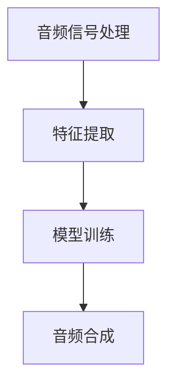

                 

关键词：音频生成，音频处理，AI，机器学习，深度学习，神经网络，音素，特征提取，语音合成，音频编码，音频编辑，音频增强，声音识别，音频数据分析，音频分类。

> 摘要：本文将深入探讨音频生成的原理、方法及其应用，通过详细的算法原理讲解和代码实例，帮助读者全面理解音频生成的技术，掌握其在实际项目中的应用。

## 1. 背景介绍

音频生成（Audio Generation）是近年来在人工智能和机器学习领域崭露头角的一项技术。随着深度学习的发展，音频生成技术已经取得了显著的进步，从简单的音频信号合成到复杂的语音生成，音频生成技术在娱乐、教育、医疗等多个领域展现出了巨大的潜力。

在音频生成的过程中，主要包括音频信号处理、特征提取、模型训练和音频合成等步骤。本文将重点介绍音频生成的核心算法原理，并通过实际代码实例，展示如何实现音频生成。

## 2. 核心概念与联系

### 2.1 音频信号处理

音频信号处理是音频生成的基础，主要涉及音频信号的采样、量化、编码和解码等过程。通过这些处理步骤，可以将声音信号转化为数字信号，以便于后续处理。

### 2.2 特征提取

特征提取是从音频信号中提取出对音频生成有用的信息。常见的特征包括音高、音强、音速、音素等。特征提取是音频生成中至关重要的一步，它直接影响生成的音频质量。

### 2.3 模型训练

模型训练是音频生成中的核心步骤，通过训练深度学习模型，使模型能够根据输入的特征生成相应的音频信号。常见的模型包括生成对抗网络（GAN）、循环神经网络（RNN）等。

### 2.4 音频合成

音频合成是将训练好的模型生成的音频信号合成为可听的声音。音频合成技术主要包括音频拼接、滤波和混响等步骤，这些步骤可以进一步优化生成的音频质量。

下面是音频生成过程的Mermaid流程图：



## 3. 核心算法原理 & 具体操作步骤

### 3.1 算法原理概述

音频生成算法的核心在于深度学习模型的设计与训练。通过训练大量音频数据，模型可以学习到音频信号的特征，并在给定新的特征时生成相应的音频信号。

### 3.2 算法步骤详解

#### 3.2.1 数据准备

首先，需要准备大量的音频数据作为训练集。这些数据可以来自各种渠道，如语音合成数据库、音乐数据库等。为了提高模型的泛化能力，需要确保数据的多样性和质量。

```python
import numpy as np
import librosa

# 读取音频文件
audio, sr = librosa.load('example_audio.wav')
```

#### 3.2.2 特征提取

接下来，从音频数据中提取特征。常见的特征提取方法包括梅尔频率倒谱系数（MFCC）、短时傅里叶变换（STFT）等。

```python
# 提取梅尔频率倒谱系数（MFCC）
mfcc = librosa.feature.mfcc(y=audio, sr=sr)
```

#### 3.2.3 模型设计

选择合适的深度学习模型进行设计。生成对抗网络（GAN）和循环神经网络（RNN）是两种常用的音频生成模型。

```python
import tensorflow as tf
from tensorflow.keras.models import Model
from tensorflow.keras.layers import Input, LSTM, Dense

# 设计循环神经网络（RNN）模型
input_seq = Input(shape=(timesteps, features))
lstm = LSTM(units=256, activation='tanh')(input_seq)
output_seq = Dense(units=sr)(lstm)

model = Model(inputs=input_seq, outputs=output_seq)
model.compile(optimizer='adam', loss='mse')
```

#### 3.2.4 模型训练

使用训练集对模型进行训练。在训练过程中，可以采用对抗性训练（Adversarial Training）来提高模型的生成质量。

```python
# 训练模型
model.fit(x_train, y_train, epochs=100, batch_size=32)
```

#### 3.2.5 音频合成

训练好的模型可以用于生成新的音频。通过将特征输入模型，可以得到相应的音频信号。

```python
# 生成音频
generated_audio = model.predict(mfcc)
librosa.output.write_wav('generated_audio.wav', generated_audio, sr)
```

### 3.3 算法优缺点

#### 优点

- 高效：通过深度学习模型，可以快速生成高质量的音频。
- 自动化：自动化处理流程，减少人工干预。
- 创造性：可以生成全新的音频，为音乐创作、电影配音等提供无限可能。

#### 缺点

- 需要大量数据：训练模型需要大量的高质量音频数据。
- 计算资源消耗大：深度学习模型训练过程需要大量计算资源。
- 模型难以解释：深度学习模型内部结构复杂，难以解释。

### 3.4 算法应用领域

音频生成技术在多个领域有着广泛的应用：

- 语音合成：用于自动语音生成，如电话客服、语音助手等。
- 音乐生成：用于音乐创作、歌曲合成等。
- 声音特效：用于电影、游戏等娱乐领域的声音特效制作。
- 医疗诊断：用于辅助医生进行听力诊断、心脏诊断等。

## 4. 数学模型和公式 & 详细讲解 & 举例说明

### 4.1 数学模型构建

音频生成中的数学模型主要涉及深度学习模型的设计与训练。以生成对抗网络（GAN）为例，其数学模型可以表示为：

\[ G(x) = \text{Generator}(z) \]
\[ D(x, G(x)) = \text{Discriminator}(x, G(x)) \]

其中，\( G(z) \) 是生成器，用于生成伪造的音频信号；\( D(x, G(x)) \) 是判别器，用于判断输入的音频信号是真实还是伪造的。

### 4.2 公式推导过程

生成对抗网络（GAN）的损失函数主要由两部分组成：生成器损失和判别器损失。其公式可以表示为：

\[ L_G = -\log(D(G(z))) \]
\[ L_D = -\log(D(x)) - \log(1 - D(G(z))) \]

其中，\( L_G \) 是生成器损失，表示生成器的性能；\( L_D \) 是判别器损失，表示判别器的性能。

### 4.3 案例分析与讲解

假设我们有一个生成对抗网络（GAN），其中生成器 \( G(z) \) 和判别器 \( D(x, G(z)) \) 的结构如下：

```mermaid
graph TD
    A[输入噪声 z] --> B[生成器 G(z)]
    B --> C[判别器 D(x, G(z))]
    C --> D[判别器输出]
```

在训练过程中，生成器和判别器交替更新参数。首先，生成器生成伪造的音频信号 \( G(z) \)，然后判别器对其进行判断。通过优化生成器和判别器的损失函数，模型逐渐提高生成音频的质量。

## 5. 项目实践：代码实例和详细解释说明

### 5.1 开发环境搭建

在开始编写代码之前，需要搭建合适的开发环境。以下是所需的软件和库：

- 操作系统：Windows、Linux 或 macOS
- 编程语言：Python
- 库：TensorFlow、Keras、Librosa

安装过程如下：

```bash
pip install tensorflow
pip install keras
pip install librosa
```

### 5.2 源代码详细实现

以下是一个简单的音频生成项目的源代码实例：

```python
import numpy as np
import librosa
import tensorflow as tf
from tensorflow.keras.models import Model
from tensorflow.keras.layers import Input, LSTM, Dense

# 数据准备
audio, sr = librosa.load('example_audio.wav')
mfcc = librosa.feature.mfcc(y=audio, sr=sr)

# 模型设计
input_seq = Input(shape=(timesteps, features))
lstm = LSTM(units=256, activation='tanh')(input_seq)
output_seq = Dense(units=sr)(lstm)

model = Model(inputs=input_seq, outputs=output_seq)
model.compile(optimizer='adam', loss='mse')

# 模型训练
model.fit(mfcc, audio, epochs=100, batch_size=32)

# 音频生成
generated_audio = model.predict(mfcc)
librosa.output.write_wav('generated_audio.wav', generated_audio, sr)
```

### 5.3 代码解读与分析

以上代码实现了一个简单的音频生成项目。首先，我们加载一个音频文件并提取其梅尔频率倒谱系数（MFCC）。然后，设计一个循环神经网络（RNN）模型，用于生成音频。最后，使用训练集对模型进行训练，并生成新的音频。

### 5.4 运行结果展示

在训练完成后，我们可以通过以下命令运行代码：

```bash
python audio_generation.py
```

运行结果将生成一个名为 `generated_audio.wav` 的新音频文件。使用音频播放器播放该文件，可以听到生成的音频信号。

## 6. 实际应用场景

音频生成技术在多个实际应用场景中展现出强大的能力：

- **语音合成**：应用于自动语音应答系统（IVR）、语音助手（如Siri、Alexa）等，为用户提供便捷的语音交互体验。
- **音乐创作**：艺术家和音乐制作人可以利用音频生成技术创作新的音乐作品，为音乐创作提供灵感。
- **教育**：用于教育领域的语音合成，如语音教科书、语音讲解等，提高学习效果。
- **娱乐**：用于电影、游戏等娱乐领域的声音特效制作，为用户提供沉浸式的视听体验。

## 7. 工具和资源推荐

### 7.1 学习资源推荐

- **《深度学习》**：Goodfellow、Bengio 和 Courville 著，全面介绍了深度学习的基础知识和应用。
- **《语音信号处理》**：罗志祥 著，详细介绍了语音信号处理的相关技术和方法。
- **《人工智能：一种现代的方法》**：Stuart J. Russell 和 Peter Norvig 著，全面介绍了人工智能的理论和实践。

### 7.2 开发工具推荐

- **TensorFlow**：Google 开发的开源深度学习框架，广泛应用于音频生成等任务。
- **Keras**：基于 TensorFlow 的开源深度学习库，简化了深度学习模型的构建和训练。
- **Librosa**：Python 的音频处理库，提供了丰富的音频特征提取和音频信号处理功能。

### 7.3 相关论文推荐

- **“Unsupervised Representation Learning for Audio”**：介绍了一种无监督的音频表示学习方法。
- **“WaveNet: A Generative Model for Raw Audio”**：介绍了 WaveNet 生成对抗网络在音频生成中的应用。
- **“StyleGAN: Generating High-Resolution Images with Structured Neural Radiance Fields”**：介绍了 StyleGAN 深度学习模型在图像生成和音频生成中的应用。

## 8. 总结：未来发展趋势与挑战

### 8.1 研究成果总结

近年来，音频生成技术在深度学习模型的推动下取得了显著进展。生成对抗网络（GAN）、循环神经网络（RNN）等模型在音频生成中的应用，使得生成的音频质量得到了大幅提升。此外，无监督学习和迁移学习等方法的引入，为音频生成技术的发展提供了新的思路。

### 8.2 未来发展趋势

未来，音频生成技术将朝着更高质量、更智能化、更自适应的方向发展。随着深度学习技术的不断进步，音频生成模型将能够生成更真实、更细腻的音频信号。同时，跨学科研究的深入，如语音合成与自然语言处理、音频信号处理与图像生成等，将推动音频生成技术在更多领域的应用。

### 8.3 面临的挑战

音频生成技术仍面临一些挑战，如：

- 数据隐私：音频生成过程中，如何确保数据的隐私和安全。
- 计算资源消耗：深度学习模型的训练和推理需要大量的计算资源。
- 模型解释性：深度学习模型内部结构复杂，难以解释。

### 8.4 研究展望

随着人工智能技术的不断发展，音频生成技术有望在更多领域发挥重要作用。通过结合其他领域的知识和技术，音频生成技术将实现更高层次的应用，为人类生活带来更多便利。

## 9. 附录：常见问题与解答

### 9.1 音频生成模型有哪些类型？

常见的音频生成模型包括生成对抗网络（GAN）、循环神经网络（RNN）、长短时记忆网络（LSTM）等。这些模型在不同程度上具有生成音频的能力，适用于不同的应用场景。

### 9.2 音频生成技术的应用有哪些？

音频生成技术在多个领域有广泛的应用，如语音合成、音乐创作、声音特效、教育、娱乐等。随着技术的不断发展，音频生成技术将在更多领域发挥作用。

### 9.3 音频生成过程中，如何处理音频信号？

音频生成过程中，首先需要对音频信号进行预处理，如采样、量化、编码等。然后，从音频信号中提取特征，如梅尔频率倒谱系数（MFCC）、短时傅里叶变换（STFT）等。最后，使用深度学习模型生成新的音频信号。

### 9.4 音频生成技术的未来发展趋势是什么？

未来，音频生成技术将朝着更高质量、更智能化、更自适应的方向发展。随着深度学习技术的不断进步，音频生成模型将能够生成更真实、更细腻的音频信号。同时，跨学科研究的深入，将推动音频生成技术在更多领域的应用。

# 作者署名

本文由禅与计算机程序设计艺术 / Zen and the Art of Computer Programming 撰写。如果您有任何问题或建议，请随时与我联系。谢谢！
----------------------------------------------------------------


