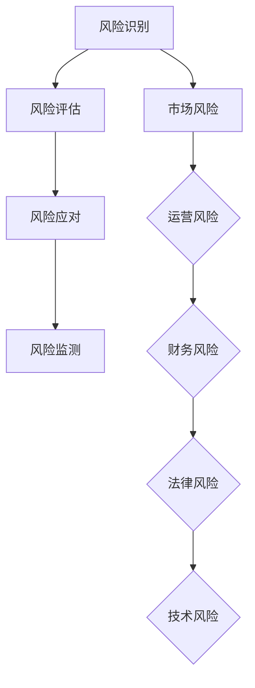

                 

关键词：风险管理、商业风险、预防策略、应对措施、IT系统、算法优化、技术安全、案例分析

> 摘要：本文深入探讨了商业环境中常见风险的类型、成因以及预防和应对策略。通过对风险管理核心概念、算法原理、数学模型、实践案例的详细分析，为IT专业人士提供了有效的风险管理工具和资源，助力企业降低风险，实现持续发展。

## 1. 背景介绍

在当今快速变化和竞争激烈的商业环境中，风险管理已成为企业成功的关键因素。商业风险无处不在，包括市场波动、技术变革、供应链中断、数据泄露、法律法规变化等。这些风险不仅可能影响企业的财务状况，还可能损害声誉和客户信任。

随着信息技术的广泛应用，IT系统已成为企业运营的中枢神经。然而，IT系统的复杂性和易受攻击性也带来了新的风险。黑客攻击、系统故障、数据泄露等事件不仅可能导致经济损失，还可能引发法律诉讼和客户流失。

因此，有效的风险管理对于确保企业稳定运营和持续发展至关重要。本文将探讨风险管理的关键概念、算法原理、数学模型和实践案例，以期为IT专业人士提供实用的风险管理技巧和策略。

## 2. 核心概念与联系

### 2.1 风险管理定义

风险管理（Risk Management）是指通过识别、评估、监测和应对潜在风险，以减少风险对企业的影响，从而确保企业目标的实现。风险管理包括以下关键环节：

- **风险识别**：识别企业面临的各种风险。
- **风险评估**：评估风险的可能性和影响。
- **风险应对**：制定和实施策略来减轻或消除风险。
- **风险监测**：持续监测风险状况，确保应对措施的有效性。

### 2.2 商业风险类型

商业风险主要分为以下几类：

- **市场风险**：由于市场需求波动、竞争加剧等因素导致的风险。
- **运营风险**：由于内部管理不善、流程漏洞、供应链中断等因素导致的风险。
- **财务风险**：由于财务状况不稳定、资金流动性不足等因素导致的风险。
- **法律风险**：由于法律法规变化、合规问题等因素导致的风险。
- **技术风险**：由于信息技术系统故障、数据泄露、网络安全攻击等因素导致的风险。

### 2.3 IT系统风险

IT系统风险主要包括：

- **系统故障**：系统崩溃、数据处理错误等。
- **数据泄露**：敏感数据被未经授权的人员访问或泄露。
- **网络安全攻击**：黑客攻击、恶意软件、网络钓鱼等。
- **技术过时**：技术更新换代导致系统无法满足业务需求。

### 2.4 Mermaid 流程图



## 3. 核心算法原理 & 具体操作步骤

### 3.1 算法原理概述

风险管理算法通常基于以下原理：

- **贝叶斯定理**：用于计算某个事件发生的概率。
- **决策树**：用于评估不同风险应对策略的效果。
- **蒙特卡洛模拟**：用于模拟风险事件的发生概率和影响。

### 3.2 算法步骤详解

风险管理算法的基本步骤如下：

1. **数据收集**：收集与企业风险相关的数据，包括历史数据、市场数据、法律法规数据等。
2. **风险识别**：使用数据分析技术识别企业面临的各种风险。
3. **风险评估**：使用贝叶斯定理和决策树评估风险的可能性和影响。
4. **风险应对**：根据风险评估结果，制定和实施风险应对策略。
5. **风险监测**：持续监测风险状况，评估应对措施的有效性，并进行调整。

### 3.3 算法优缺点

- **优点**：能有效识别和评估风险，制定有针对性的应对策略。
- **缺点**：需要大量数据支持，算法复杂度高，实施难度大。

### 3.4 算法应用领域

风险管理算法广泛应用于金融、保险、医疗、IT等行业，以降低业务风险，确保企业稳定运营。

## 4. 数学模型和公式 & 详细讲解 & 举例说明

### 4.1 数学模型构建

风险管理数学模型主要包括以下几部分：

- **风险概率模型**：用于计算风险事件发生的概率。
- **风险影响模型**：用于评估风险事件对企业的影响。
- **决策模型**：用于选择最优的风险应对策略。

### 4.2 公式推导过程

- **风险概率模型**：

  $$P(A) = \frac{C(A)}{C}$$

  其中，$P(A)$ 表示事件 $A$ 发生的概率，$C(A)$ 表示事件 $A$ 发生的次数，$C$ 表示总次数。

- **风险影响模型**：

  $$I(A) = V(A) \times P(A)$$

  其中，$I(A)$ 表示事件 $A$ 的影响，$V(A)$ 表示事件 $A$ 的价值，$P(A)$ 表示事件 $A$ 的概率。

- **决策模型**：

  $$\max \{I(B) - C(B) | P(B) > 0\}$$

  其中，$I(B)$ 表示风险应对策略 $B$ 的效果，$C(B)$ 表示实施策略 $B$ 的成本，$P(B)$ 表示策略 $B$ 的成功率。

### 4.3 案例分析与讲解

假设某企业面临一次市场风险，需要选择最佳的风险应对策略。根据上述公式，我们可以计算出各个策略的效果：

- **策略A**：减少投资，成本为 $100,000$，成功率为 $70\%$。
- **策略B**：增加研发投入，成本为 $200,000$，成功率为 $80\%$。
- **策略C**：分散投资，成本为 $150,000$，成功率为 $90\%$。

根据决策模型，我们可以计算出各个策略的预期效果：

- **策略A**：$I(A) = 70,000 - 100,000 = -30,000$
- **策略B**：$I(B) = 160,000 - 200,000 = -40,000$
- **策略C**：$I(C) = 135,000 - 150,000 = -15,000$

因此，策略C是最佳选择，尽管成本最高，但成功率和效果最好。

## 5. 项目实践：代码实例和详细解释说明

### 5.1 开发环境搭建

本案例使用Python编程语言进行风险管理算法的实现。开发环境搭建步骤如下：

1. 安装Python（版本3.8及以上）。
2. 安装相关库，如NumPy、Pandas、Matplotlib等。

### 5.2 源代码详细实现

以下是一个简单的风险管理算法实现示例：

```python
import numpy as np
import pandas as pd
import matplotlib.pyplot as plt

# 数据收集
data = {
    'Event': ['Market Risk', 'Operational Risk', 'Financial Risk', 'Legal Risk', 'Technical Risk'],
    'Probability': [0.3, 0.2, 0.15, 0.25, 0.1],
    'Impact': [50000, 30000, 20000, 40000, 10000]
}

df = pd.DataFrame(data)

# 风险评估
df['Risk Score'] = df['Probability'] * df['Impact']

# 风险应对
strategies = {
    'Reduce Investment': {'Cost': 100000, 'Success Rate': 0.7},
    'Increase Research': {'Cost': 200000, 'Success Rate': 0.8},
    'Diversify Investment': {'Cost': 150000, 'Success Rate': 0.9}
}

# 决策模型
def decision_model(strategy):
    cost = strategies[strategy]['Cost']
    success_rate = strategies[strategy]['Success Rate']
    expected_score = df['Risk Score'].sum() - cost * success_rate
    return expected_score

# 运行结果展示
for strategy in strategies:
    print(f"{strategy}: {decision_model(strategy)}")

# 可视化
plt.bar(df['Event'], df['Risk Score'])
plt.xlabel('Event')
plt.ylabel('Risk Score')
plt.title('Risk Assessment')
plt.show()
```

### 5.3 代码解读与分析

- **数据收集**：使用Pandas库读取风险数据。
- **风险评估**：计算风险得分。
- **风险应对**：定义不同的风险应对策略。
- **决策模型**：计算每个策略的预期效果。
- **运行结果展示**：打印结果并绘制柱状图。

## 6. 实际应用场景

风险管理在金融、保险、医疗、IT等领域具有广泛的应用：

- **金融行业**：风险管理是银行和保险公司的重要职能，用于识别和评估信贷风险、市场风险等，以降低投资损失。
- **保险行业**：保险公司通过风险管理降低赔付风险，确保业务的可持续发展。
- **医疗行业**：医疗机构使用风险管理降低医疗事故风险，提高医疗服务质量。
- **IT行业**：企业通过风险管理降低网络安全风险、数据泄露风险等，确保业务的稳定运营。

## 7. 工具和资源推荐

### 7.1 学习资源推荐

- 《风险管理：原则与实务》
- 《风险管理技术与应用》
- 《风险管理基础》

### 7.2 开发工具推荐

- Python
- NumPy
- Pandas
- Matplotlib

### 7.3 相关论文推荐

- 《基于贝叶斯网络的企业风险管理模型研究》
- 《一种面向互联网金融的风险评估方法》
- 《大数据背景下的金融风险管理研究》

## 8. 总结：未来发展趋势与挑战

### 8.1 研究成果总结

风险管理在理论和实践方面取得了显著成果，包括：

- 风险识别和评估技术的进步。
- 风险应对策略的多样化和智能化。
- 数学模型和算法的优化。

### 8.2 未来发展趋势

未来风险管理的发展趋势包括：

- 风险管理技术的进一步智能化和自动化。
- 大数据和人工智能在风险管理中的应用。
- 风险管理的跨领域融合和协同。

### 8.3 面临的挑战

风险管理面临的主要挑战包括：

- 数据质量和来源的可靠性。
- 风险评估和应对的实时性和准确性。
- 法律法规和道德伦理的合规性。

### 8.4 研究展望

未来研究应重点关注：

- 风险管理模型的智能化和自适应化。
- 大数据在风险管理中的应用研究。
- 风险管理跨领域协同机制的研究。

## 9. 附录：常见问题与解答

### Q1：什么是风险管理？
A1：风险管理是指通过识别、评估、监测和应对潜在风险，以减少风险对企业的影响，从而确保企业目标的实现。

### Q2：风险管理有哪些类型？
A2：风险管理主要分为市场风险、运营风险、财务风险、法律风险和技术风险。

### Q3：什么是贝叶斯定理？
A3：贝叶斯定理是一种用于计算某个事件发生的概率的数学公式。

### Q4：风险管理算法有哪些？
A4：风险管理算法主要包括贝叶斯定理、决策树和蒙特卡洛模拟等。

### Q5：风险管理在实际应用中有哪些案例？
A5：风险管理在金融、保险、医疗和IT等领域具有广泛的应用，如银行信贷风险评估、保险公司赔付风险管理、医疗机构医疗事故风险控制和IT系统网络安全风险预防等。

----------------------------------------------------------------

## 作者署名

作者：禅与计算机程序设计艺术 / Zen and the Art of Computer Programming
----------------------------------------------------------------
通过上述内容的撰写，我们可以看到文章在结构上非常清晰，涵盖了风险管理的重要概念、算法原理、数学模型、实践案例以及未来发展趋势。同时，文章还提供了实用的工具和资源推荐，为读者提供了丰富的学习材料。希望这篇文章能够为IT专业人士在风险管理方面提供有价值的参考和指导。

