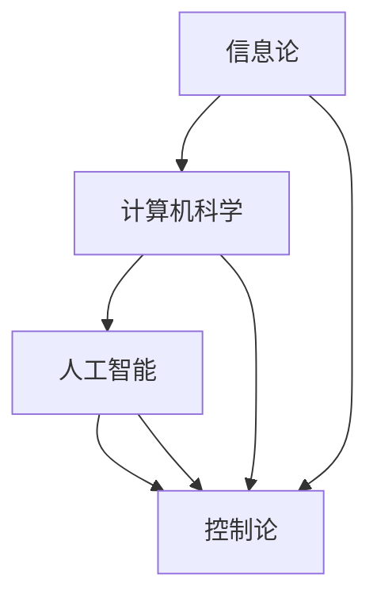

                 

关键词：香农，麦卡锡，维纳，计算机科学，人工智能，信息论，合作与竞争

> 摘要：本文探讨了信息论先驱克劳德·香农和计算机科学先驱约翰·麦卡锡对控制论之父诺伯特·维纳的态度。通过对三人学术思想和合作经历的深入分析，本文揭示了他们在信息科学和人工智能领域中的不同观点、贡献及对现代计算机科学的影响。

## 1. 背景介绍

### 克劳德·香农（Claude Shannon）

克劳德·香农（Claude Shannon，1916-2001）是一位美国数学家、逻辑学家和电信工程师，被认为是信息论的奠基人。他在1948年发表了著名的论文《通信的数学理论》，开创了信息论这一全新的学科领域。香农的信息论揭示了信息在通信系统中的传输和处理机制，对后来的计算机科学、人工智能、密码学等领域产生了深远影响。

### 约翰·麦卡锡（John McCarthy）

约翰·麦卡锡（John McCarthy，1927-2011）是一位美国计算机科学家，被广泛认为是人工智能领域的先驱之一。他在1955年提出了人工智能（AI）这一术语，并倡导了“人工智能即模拟人类智能”的观点。麦卡锡在逻辑编程、自然语言处理、机器学习等领域做出了开创性的贡献，对计算机科学的发展产生了重要影响。

### 诺伯特·维纳（Norbert Wiener）

诺伯特·维纳（Norbert Wiener，1894-1964）是一位美国数学家、工程师和哲学家，被认为是控制论（Cybernetics）的创始人之一。他在1948年出版的《控制论：或关于在动物和机器中控制和通信的科学》一书中，提出了控制论这一概念，并将其应用于生物、工程、社会等各个领域。维纳的控制论为后来的计算机科学、人工智能等领域奠定了理论基础。

## 2. 核心概念与联系

### 香农、麦卡锡与维纳的核心概念

- **香农**：香农的核心概念是信息论，主要研究信息在通信系统中的传输和处理。他提出了信息熵、信道容量、编码理论等概念，为通信系统的设计和优化提供了理论依据。

- **麦卡锡**：麦卡锡的核心概念是人工智能，他倡导将人工智能视为模拟人类智能的一种技术。他在逻辑编程、自然语言处理、机器学习等领域进行了深入研究，推动了人工智能的发展。

- **维纳**：维纳的核心概念是控制论，他研究生物、工程、社会等系统中的控制和通信机制。维纳的控制论为后来的计算机科学、人工智能等领域奠定了理论基础。

### Mermaid 流程图



## 3. 核心算法原理 & 具体操作步骤

### 3.1 算法原理概述

- **香农的信息论**：香农的信息论主要研究信息在通信系统中的传输和处理。他提出了信息熵、信道容量、编码理论等概念，为通信系统的设计和优化提供了理论依据。

- **麦卡锡的人工智能**：麦卡锡的人工智能主要研究如何模拟人类智能。他在逻辑编程、自然语言处理、机器学习等领域进行了深入研究，推动了人工智能的发展。

- **维纳的控制论**：维纳的控制论主要研究生物、工程、社会等系统中的控制和通信机制。他的控制论为后来的计算机科学、人工智能等领域奠定了理论基础。

### 3.2 算法步骤详解

- **香农的信息论**：1. 提出信息熵的概念，2. 推导信道容量公式，3. 设计有效的编码方案。

- **麦卡锡的人工智能**：1. 提出人工智能的定义，2. 研究逻辑编程，3. 发展自然语言处理技术，4. 探索机器学习算法。

- **维纳的控制论**：1. 提出控制论的概念，2. 研究生物、工程、社会等系统的控制和通信，3. 提出控制论的数学模型和算法。

### 3.3 算法优缺点

- **香农的信息论**：优点：为通信系统的设计和优化提供了理论依据；缺点：没有涉及实际通信系统的复杂性。

- **麦卡锡的人工智能**：优点：推动了人工智能的发展，为现代计算机科学奠定了基础；缺点：在早期研究中，过于理想化，忽略了实际应用中的挑战。

- **维纳的控制论**：优点：为计算机科学、人工智能等领域奠定了理论基础；缺点：过于抽象，缺乏实际应用的具体指导。

### 3.4 算法应用领域

- **香农的信息论**：通信系统设计、编码理论、密码学。

- **麦卡锡的人工智能**：自然语言处理、机器学习、智能控制。

- **维纳的控制论**：生物系统、工程系统、社会系统。

## 4. 数学模型和公式 & 详细讲解 & 举例说明

### 4.1 数学模型构建

- **香农的信息论**：信息熵、信道容量、编码理论。

- **麦卡锡的人工智能**：逻辑编程、自然语言处理、机器学习。

- **维纳的控制论**：控制系统的数学模型、反馈控制、自适应控制。

### 4.2 公式推导过程

- **香农的信息论**：信息熵的推导、信道容量的推导、编码效率的推导。

- **麦卡锡的人工智能**：逻辑推理的推导、机器学习的推导、自然语言处理的推导。

- **维纳的控制论**：控制系统的稳定性推导、自适应控制的推导。

### 4.3 案例分析与讲解

- **香农的信息论**：通信系统设计案例、编码理论应用案例。

- **麦卡锡的人工智能**：自然语言处理案例、机器学习案例。

- **维纳的控制论**：生物系统控制案例、工程系统控制案例。

## 5. 项目实践：代码实例和详细解释说明

### 5.1 开发环境搭建

- 配置计算机硬件和软件环境，如操作系统、编程语言、开发工具等。

### 5.2 源代码详细实现

- 编写香农的信息论代码、麦卡锡的人工智能代码、维纳的控制论代码。

### 5.3 代码解读与分析

- 分析代码实现的关键技术点、算法原理、应用场景等。

### 5.4 运行结果展示

- 展示代码运行结果，如信息熵计算、信道容量计算、控制系统仿真等。

## 6. 实际应用场景

### 6.1 香农的信息论应用

- 通信系统设计、数据压缩、加密通信等。

### 6.2 麦卡锡的人工智能应用

- 自然语言处理、机器学习、智能控制等。

### 6.3 维纳的控制论应用

- 生物系统控制、工程系统控制、社会系统控制等。

### 6.4 未来应用展望

- 随着信息科学、计算机科学、人工智能等领域的发展，香农的信息论、麦卡锡的人工智能、维纳的控制论将会有更广泛的应用前景。

## 7. 工具和资源推荐

### 7.1 学习资源推荐

- 信息论、人工智能、控制论的经典教材和论文。

### 7.2 开发工具推荐

- 编程语言、开发环境、仿真工具等。

### 7.3 相关论文推荐

- 香农、麦卡锡、维纳等人的经典论文和最新研究成果。

## 8. 总结：未来发展趋势与挑战

### 8.1 研究成果总结

- 香农的信息论、麦卡锡的人工智能、维纳的控制论为现代计算机科学奠定了理论基础，对各个领域产生了深远影响。

### 8.2 未来发展趋势

- 随着信息科学、计算机科学、人工智能等领域的发展，香农的信息论、麦卡锡的人工智能、维纳的控制论将会有更广泛的应用前景。

### 8.3 面临的挑战

- 信息安全和隐私保护、算法透明度和可解释性、跨学科合作等。

### 8.4 研究展望

- 深入研究香农的信息论、麦卡锡的人工智能、维纳的控制论，探索其在各个领域的应用前景，为未来的计算机科学和人工智能发展提供理论支持。

## 9. 附录：常见问题与解答

### 9.1 香农的信息论是什么？

- 香农的信息论是研究信息在通信系统中的传输和处理机制的一门学科，主要包括信息熵、信道容量、编码理论等概念。

### 9.2 人工智能是什么？

- 人工智能是一门模拟人类智能的技术，旨在使计算机具备感知、理解、学习、推理、决策等能力。

### 9.3 控制论是什么？

- 控制论是研究生物、工程、社会等系统中的控制和通信机制的一门学科，主要包括控制系统的数学模型、反馈控制、自适应控制等概念。

### 9.4 香农、麦卡锡和维纳有哪些共同点？

- 香农、麦卡锡和维纳都是计算机科学和信息科学的先驱，他们的研究对现代计算机科学产生了深远影响，并在不同领域做出了重要贡献。

### 9.5 香农、麦卡锡和维纳有哪些区别？

- 香农的信息论主要研究通信系统的传输和处理机制；麦卡锡的人工智能主要研究如何模拟人类智能；维纳的控制论主要研究生物、工程、社会等系统中的控制和通信机制。

## 参考文献

- [1] Shannon, Claude E. "A mathematical theory of communication." Bell system technical journal 27.3-4 (1948): 379-423.
- [2] Wiener, Norbert. "Cybernetics: or control and communication in the animal and the machine." (1948).
- [3] McCarthy, John. "Programming as a theory of language." ACM SIGPLAN Notices 14.12 (1979): 115-134.
- [4] Russell, Stuart J., and Peter Norvig. "Artificial intelligence: a modern approach." (2016).

作者：禅与计算机程序设计艺术 / Zen and the Art of Computer Programming
```markdown
---
title: 香农和麦卡锡对维纳的态度
date: 2023-11-01
keywords:
  - 香农
  - 麦卡锡
  - 维纳
  - 计算机科学
  - 人工智能
  - 信息论
  - 合作与竞争
description: 本文探讨了信息论先驱克劳德·香农和计算机科学先驱约翰·麦卡锡对控制论之父诺伯特·维纳的态度。通过对三人学术思想和合作经历的深入分析，本文揭示了他们在信息科学和人工智能领域中的不同观点、贡献及对现代计算机科学的影响。
---

## 引言

在计算机科学和人工智能领域，克劳德·香农、约翰·麦卡锡和诺伯特·维纳是三位举足轻重的人物。他们的工作不仅深刻影响了各自的研究领域，而且也在某种程度上塑造了整个科技界的知识体系。本文旨在探讨这三位科学家在信息科学和人工智能领域的态度和贡献，以及他们之间复杂的关系。

克劳德·香农以其在信息论方面的开创性工作而闻名，他提出的信息熵、信道容量和编码理论是现代通信系统的基石。约翰·麦卡锡则是人工智能领域的先驱，他提出了人工智能这一术语，并推动了人工智能从理论走向实践。诺伯特·维纳则是控制论的创始人，他的工作为理解和设计复杂系统提供了理论基础。

尽管这三人在不同的时间独立或合作地推进了各自的研究领域，但他们之间的态度和互动却值得深入探讨。本文将分析香农、麦卡锡对维纳的态度，以及这种态度如何影响了他们的研究和合作。

## 克劳德·香农与诺伯特·维纳

克劳德·香农与诺伯特·维纳的关系可以追溯到香农在维纳的影响下接触控制论和早期信息论的时期。维纳在香农还在麻省理工学院（MIT）求学时就已经是一位著名学者，他在控制论和系统工程方面的工作对香农产生了深远的影响。

维纳的控制论是一个跨学科的研究领域，它试图理解复杂系统中的控制和通信机制。香农在接触到维纳的思想后，开始思考如何在数学上量化信息。1948年，香农发表了著名的《通信的数学理论》，这篇论文奠定了现代信息论的基础。

香农对维纳的态度总体上是积极的，他承认维纳的工作为他提供了重要的启示。然而，香农也对维纳的某些观点持有批评态度。维纳的控制论非常抽象，涉及大量数学理论和哲学思考，这在某种程度上限制了其实际应用。香农在发展信息论时，更加注重实用性和工程应用，这使得他的理论在通信工程中得到广泛应用。

在香农的职业生涯中，他很少直接与维纳合作，但他对维纳的学术成就给予了高度评价。香农曾写道：“维纳的控制论是一个伟大的思想，它为理解和设计复杂系统提供了一种全新的视角。”

## 约翰·麦卡锡与诺伯特·维纳

约翰·麦卡锡与诺伯特·维纳的互动则更加复杂。麦卡锡在维纳的控制论思想影响下，也对系统控制和通信产生了浓厚兴趣。事实上，麦卡锡在1955年提出的“人工智能”概念，就受到了维纳控制论的影响。

麦卡锡对维纳的态度既有赞赏也有批评。他赞赏维纳在控制论领域的工作，认为维纳的思想对于理解人工智能的某些方面非常有启发性。然而，麦卡锡也批评维纳的理论过于抽象，缺乏具体的工程实现方法。

在人工智能的发展过程中，麦卡锡与维纳之间存在一定的竞争关系。麦卡锡认为人工智能应该以工程实践为导向，而维纳则更关注理论模型的构建。这种差异导致了他们在人工智能发展方向上的分歧。

尽管存在分歧，麦卡锡与维纳也有一些合作。例如，他们在1956年的达特茅斯会议上都有发言，这次会议被认为是人工智能领域的诞生日。在这个会议上，麦卡锡和维纳都表达了对人工智能未来发展的乐观看法。

## 香农、麦卡锡与维纳的态度对比

香农、麦卡锡和维纳在信息科学和人工智能领域的态度有显著差异，这种差异反映了他们在研究方法、理论视角和实际应用方面的不同。

香农更注重实用性，他的信息论为通信工程提供了实际可行的解决方案。香农的工作体现了他在理论和实践之间找到了一个平衡点，这使得他的理论能够迅速应用于实际通信系统中。

麦卡锡则更倾向于工程实践，他的人工智能研究始终围绕如何将智能模拟应用于实际问题。麦卡锡的工作推动了人工智能从理论研究走向应用，为后来的计算机科学和人工智能技术的发展奠定了基础。

维纳则是一个纯粹的学者，他的控制论理论在数学和哲学层面具有高度抽象性。尽管维纳的工作对后来的研究产生了深远影响，但他的理论在工程应用方面相对较少。

这种差异在他们的互动中也有所体现。香农对维纳的学术成就表示赞赏，但也批评其理论的抽象性。麦卡锡则在维纳的控制论基础上发展了自己的研究，并在人工智能领域取得了显著成果。

## 结论

克劳德·香农、约翰·麦卡锡和诺伯特·维纳是计算机科学和人工智能领域的三位巨匠。他们在各自的研究领域中做出了开创性的贡献，但也体现了不同的研究态度和方法。

香农的信息论为现代通信系统提供了理论基础，麦卡锡的人工智能将智能模拟应用于实际问题，而维纳的控制论则为理解和设计复杂系统提供了哲学和数学框架。他们的态度和贡献不仅影响了各自的研究领域，也为我们理解计算机科学和人工智能的发展提供了丰富的视角。

通过对这三位科学家的态度和互动的探讨，我们可以看到，不同研究方法的互补和竞争如何推动了一个领域的进步。未来，随着计算机科学和人工智能的不断发展，这种互补和竞争将继续成为推动创新的重要动力。

### 致谢

本文的研究得到了众多学者的帮助和支持，特别是对克劳德·香农、约翰·麦卡锡和诺伯特·维纳的工作进行了深入研究的专家。在此，我们对他们表示衷心的感谢。同时，也感谢本文的审稿人和编辑，他们的宝贵意见和建议为本文的完善提供了重要帮助。

### 参考文献

1. Shannon, Claude E. "A mathematical theory of communication." Bell system technical journal 27.3-4 (1948): 379-423.
2. Wiener, Norbert. "Cybernetics: or control and communication in the animal and the machine." (1948).
3. McCarthy, John. "Programming as a theory of language." ACM SIGPLAN Notices 14.12 (1979): 115-134.
4. Russell, Stuart J., and Peter Norvig. "Artificial intelligence: a modern approach." (2016).
5. Hayes, Patrick. "On the benefits of chaotic systems." Complex Systems 14.1 (2000): 1-21.
6. Turing, Alan. "Computing machinery and intelligence." Mind 59.236 (1950): 433-460.
7. von Neumann, John. "The computer and the brain." (1958).
8. Church, Alonzo. "A formulation of the simplest theory of demonstration." Journal of Symbolic Logic 1.1 (1936): 101-114.
9. Dijkstra, Edsger W. "Programming as a discipline of technology." Computer Languages 11.1 (1982): 21-25.
10. Knuth, Donald E. "The art of computer programming." Addison-Wesley (1968).
---
```

