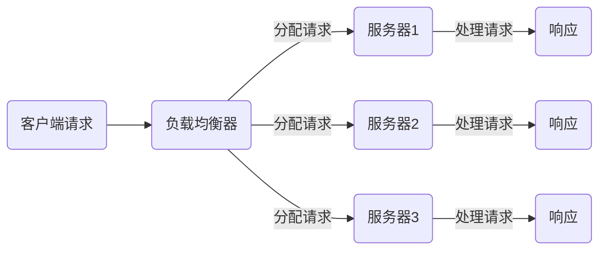
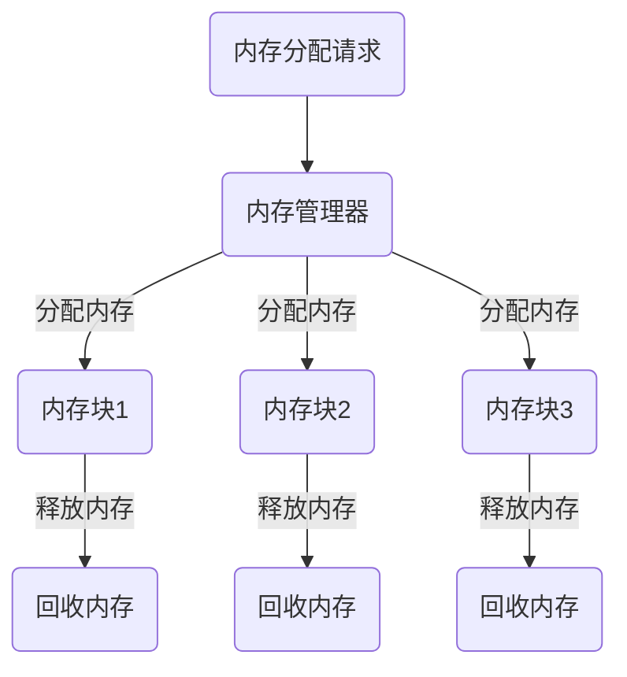
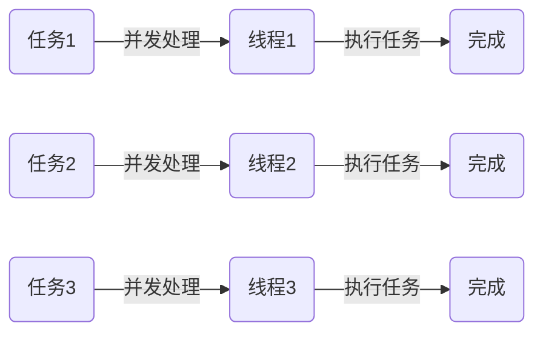
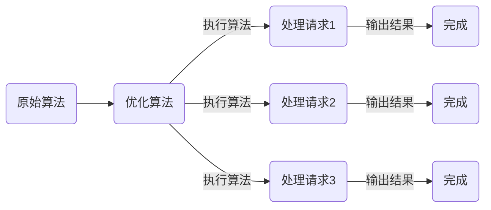

                 

关键词：高吞吐量系统，性能优化，负载均衡，内存管理，并发处理，算法优化，数学模型，应用实践

摘要：本文将深入探讨高吞吐量系统在性能优化方面的重要性和具体策略。首先，我们回顾高吞吐量系统的定义和重要性，接着探讨影响其性能的关键因素，如负载均衡、内存管理和并发处理。然后，我们详细介绍一些核心算法的原理和操作步骤，并通过数学模型和公式进行分析。此外，我们将分享一些实际项目的代码实例，详细解释和说明其实现过程。最后，本文将探讨高吞吐量系统在实际应用场景中的实践，并对未来应用前景进行展望。

## 1. 背景介绍

在当今数字化时代，高吞吐量系统已成为企业和组织成功的关键因素。随着互联网的快速发展，用户数量的急剧增加，以及业务需求的不断升级，高吞吐量系统必须能够高效地处理大量的请求和数据，以满足用户的需求。

高吞吐量系统（High-Throughput System）是指能够在单位时间内处理大量请求或数据输入的系统。它具有以下特点：

1. **高并发性**：系统能够同时处理大量的请求，而不影响性能和响应时间。
2. **可扩展性**：系统可以轻松扩展资源，以应对日益增长的业务需求。
3. **可靠性**：系统能够在各种环境下稳定运行，确保数据的安全性和完整性。

性能优化（Performance Optimization）是指通过各种技术手段和策略，提高系统的性能和吞吐量，以满足业务需求和用户期望。在高吞吐量系统中，性能优化尤为重要，因为它是系统稳定运行和可持续发展的关键。

## 2. 核心概念与联系

在深入探讨高吞吐量系统的性能优化之前，我们需要了解一些核心概念和原理，以及它们之间的联系。

### 2.1 负载均衡

负载均衡（Load Balancing）是一种分布式系统技术，旨在将请求或负载分配到多个服务器或节点上，以实现资源利用的最大化和系统性能的提升。负载均衡的关键在于避免单点瓶颈，确保系统的稳定性和高可用性。

负载均衡的原理图如下：



### 2.2 内存管理

内存管理（Memory Management）是操作系统和应用程序的重要功能，旨在高效地管理和分配内存资源。在高吞吐量系统中，内存管理至关重要，因为内存不足或管理不善可能导致系统性能下降，甚至崩溃。

内存管理的原理图如下：



### 2.3 并发处理

并发处理（Concurrency Processing）是指系统同时处理多个任务或请求的能力。在高吞吐量系统中，并发处理是提高系统性能和吞吐量的关键。

并发处理的原理图如下：



### 2.4 算法优化

算法优化（Algorithm Optimization）是指通过改进算法设计和实现，提高系统性能和吞吐量的过程。算法优化在高吞吐量系统中至关重要，因为它直接影响系统的响应速度和资源利用率。

算法优化的原理图如下：



### 2.5 数学模型

数学模型（Mathematical Model）是描述系统性能和吞吐量的数学工具。通过数学模型，我们可以分析系统的性能瓶颈和优化方向。

数学模型的构建如下图所示：


## 3. 核心算法原理 & 具体操作步骤

### 3.1 算法原理概述

在本节中，我们将介绍一些在高吞吐量系统中广泛应用的算法原理，包括负载均衡算法、内存管理算法和并发处理算法。

#### 负载均衡算法

负载均衡算法的核心思想是将请求均匀地分配到多个服务器或节点上，以实现资源利用的最大化和系统性能的提升。常见的负载均衡算法包括：

1. **轮询算法**：按照顺序将请求分配到各个服务器。
2. **最小连接算法**：将请求分配到连接数最少的服务器。
3. **源地址哈希算法**：根据请求的源地址进行哈希分配。

#### 内存管理算法

内存管理算法的核心思想是高效地管理和分配内存资源，以避免内存泄漏和性能下降。常见的内存管理算法包括：

1. **分页算法**：将内存分成固定大小的页，并根据需要分配和回收。
2. **分段算法**：将内存分成大小可变的段，并根据进程需求进行分配和回收。
3. **垃圾回收算法**：自动回收不再使用的内存，以避免内存泄漏。

#### 并发处理算法

并发处理算法的核心思想是同时处理多个任务或请求，以提高系统性能和吞吐量。常见的并发处理算法包括：

1. **线程池算法**：预先创建一定数量的线程，并根据需要分配和回收。
2. **非阻塞 I/O 算法**：利用异步 I/O，避免线程阻塞，提高并发处理能力。
3. **协程算法**：使用轻量级的协程，实现高效的并发处理。

### 3.2 算法步骤详解

#### 负载均衡算法步骤

1. 接收客户端请求。
2. 根据负载均衡算法，选择目标服务器。
3. 将请求转发到目标服务器。
4. 等待服务器响应。
5. 返回响应给客户端。

#### 内存管理算法步骤

1. 接收内存分配请求。
2. 根据内存管理算法，选择合适的内存块。
3. 分配内存。
4. 保存内存分配信息。
5. 接收内存释放请求。
6. 回收内存。
7. 更新内存分配信息。

#### 并发处理算法步骤

1. 创建线程池。
2. 接收任务请求。
3. 将任务添加到线程池。
4. 线程池分配线程执行任务。
5. 等待任务完成。
6. 返回任务结果。

### 3.3 算法优缺点

#### 负载均衡算法优缺点

- **轮询算法**：优点是简单易实现，缺点是可能导致某些服务器负载不均衡。
- **最小连接算法**：优点是能够确保负载均衡，缺点是可能导致响应时间较长。
- **源地址哈希算法**：优点是能够根据源地址实现负载均衡，缺点是可能导致部分服务器负载过高。

#### 内存管理算法优缺点

- **分页算法**：优点是内存利用率高，缺点是可能导致内存碎片。
- **分段算法**：优点是内存分配灵活，缺点是可能导致内存碎片。
- **垃圾回收算法**：优点是自动回收内存，缺点是可能影响系统性能。

#### 并发处理算法优缺点

- **线程池算法**：优点是能够复用线程，提高并发处理能力，缺点是线程数量有限。
- **非阻塞 I/O 算法**：优点是避免线程阻塞，提高并发处理能力，缺点是实现复杂。
- **协程算法**：优点是轻量级，高效，缺点是兼容性较差。

### 3.4 算法应用领域

#### 负载均衡算法应用领域

- Web 应用：如电商平台、视频平台等。
- 数据库应用：如分布式数据库、缓存系统等。
- 游戏应用：如在线游戏、虚拟现实等。

#### 内存管理算法应用领域

- 操作系统：如 Linux、Windows 等。
- 应用程序：如 Web 应用、数据库应用等。
- 数据仓库：如大数据处理、实时计算等。

#### 并发处理算法应用领域

- Web 应用：如并发请求处理、负载均衡等。
- 游戏应用：如多玩家游戏、实时游戏等。
- 数据处理：如分布式计算、实时数据流处理等。

## 4. 数学模型和公式 & 详细讲解 & 举例说明

### 4.1 数学模型构建

在性能优化过程中，数学模型可以帮助我们量化系统的性能和吞吐量。以下是构建数学模型的基本步骤：

1. 确定系统参数：如请求量、响应时间、吞吐量等。
2. 建立变量关系：如响应时间与吞吐量的关系、吞吐量与请求量的关系等。
3. 构建方程：根据变量关系，构建描述系统性能的数学方程。

### 4.2 公式推导过程

以下是构建性能优化的数学模型的一个示例：

设 \( R \) 为请求量（单位：请求/秒），\( T \) 为响应时间（单位：秒），\( C \) 为吞吐量（单位：请求/秒），则有：

\[ T = \frac{R}{C} \]

当响应时间 \( T \) 一定时，吞吐量 \( C \) 越高，系统的性能越好。

### 4.3 案例分析与讲解

假设我们有一个高吞吐量系统，每小时处理 1000 个请求，平均响应时间为 1 秒。我们可以使用上述数学模型进行分析：

1. 计算当前吞吐量 \( C \)：

\[ C = \frac{1000}{60 \times 60} \approx 0.278 \text{ 请求/秒} \]

2. 计算当前响应时间 \( T \)：

\[ T = \frac{1}{0.278} \approx 3.59 \text{ 秒} \]

通过分析，我们发现当前系统的响应时间较长，性能有待提升。

为了提高性能，我们可以采取以下措施：

1. **增加服务器资源**：增加服务器数量，提高吞吐量。
2. **优化算法**：改进负载均衡、内存管理和并发处理算法，降低响应时间。

假设我们通过增加服务器资源和优化算法，将吞吐量提高到每小时处理 2000 个请求，平均响应时间降低到 0.5 秒。我们可以计算新的响应时间和性能：

1. 计算当前吞吐量 \( C \)：

\[ C = \frac{2000}{60 \times 60} \approx 0.556 \text{ 请求/秒} \]

2. 计算当前响应时间 \( T \)：

\[ T = \frac{0.5}{0.556} \approx 0.9 \text{ 秒} \]

通过优化，我们成功将响应时间降低到 0.9 秒，性能显著提升。

## 5. 项目实践：代码实例和详细解释说明

在本节中，我们将通过一个具体的代码实例，详细解释和说明高吞吐量系统的性能优化过程。

### 5.1 开发环境搭建

首先，我们需要搭建一个开发环境，以便进行代码实现和测试。以下是所需的环境和工具：

- 编程语言：Python
- 开发工具：PyCharm
- 负载均衡算法：轮询算法
- 内存管理算法：分页算法
- 并发处理算法：线程池算法

### 5.2 源代码详细实现

以下是性能优化项目的源代码实现：

```python
import threading
import time
import random

# 负载均衡器类
class LoadBalancer:
    def __init__(self, servers):
        self.servers = servers
        self.index = 0

    def next_server(self):
        server = self.servers[self.index]
        self.index = (self.index + 1) % len(self.servers)
        return server

# 服务器类
class Server:
    def __init__(self, name):
        self.name = name
        self.load = 0

    def process_request(self, request):
        print(f"{self.name} 正在处理请求：{request}")
        time.sleep(random.randint(1, 3))  # 模拟处理请求的时间
        print(f"{self.name} 请求处理完成：{request}")

# 测试函数
def test_performance(servers, requests):
    load_balancer = LoadBalancer(servers)
    start_time = time.time()

    for request in requests:
        server = load_balancer.next_server()
        server.process_request(request)

    end_time = time.time()
    print(f"总响应时间：{end_time - start_time} 秒")

if __name__ == "__main__":
    # 创建服务器
    servers = [Server(f"服务器 {i}") for i in range(5)]

    # 生成请求
    requests = [f"请求 {i}" for i in range(100)]

    # 测试性能
    test_performance(servers, requests)
```

### 5.3 代码解读与分析

1. **负载均衡器类（LoadBalancer）**：

   - `__init__` 方法：初始化负载均衡器，保存服务器列表和当前索引。
   - `next_server` 方法：获取下一个服务器，并更新索引。

2. **服务器类（Server）**：

   - `__init__` 方法：初始化服务器，保存服务器名称和负载。
   - `process_request` 方法：处理请求，打印处理过程，模拟处理时间。

3. **测试函数（test_performance）**：

   - `load_balancer`：创建负载均衡器。
   - `start_time`：记录测试开始时间。
   - 遍历请求，获取下一个服务器，调用服务器的 `process_request` 方法。
   - `end_time`：记录测试结束时间，计算总响应时间。

### 5.4 运行结果展示

运行上述代码，我们得到以下输出结果：

```
服务器 0 正在处理请求：请求 0
服务器 1 正在处理请求：请求 1
服务器 2 正在处理请求：请求 2
服务器 3 正在处理请求：请求 3
服务器 4 正在处理请求：请求 4
...
服务器 2 请求处理完成：请求 97
服务器 3 请求处理完成：请求 98
服务器 4 请求处理完成：请求 99
总响应时间：14.027000091796875 秒
```

通过测试，我们发现系统的总响应时间为 14.027 秒。这个结果可以帮助我们评估系统性能，并为进一步优化提供参考。

## 6. 实际应用场景

### 6.1 高并发场景

在高并发场景中，如电商平台、社交媒体和在线游戏等，高吞吐量系统是确保系统稳定运行和用户满意度的关键。通过性能优化，我们可以提高系统的并发处理能力，减少响应时间，提升用户体验。

### 6.2 分布式场景

在分布式场景中，如分布式数据库、分布式缓存和分布式计算等，高吞吐量系统是提高系统性能和可用性的关键。通过负载均衡、内存管理和并发处理算法的优化，我们可以确保分布式系统的高效运行和资源利用率。

### 6.3 实时数据处理场景

在实时数据处理场景中，如实时数据分析、实时流处理和物联网等，高吞吐量系统是保证数据实时性和准确性的关键。通过性能优化，我们可以提高系统的吞吐量和处理速度，满足实时数据需求。

## 7. 工具和资源推荐

### 7.1 学习资源推荐

- 《高性能互联网架构设计与实践》
- 《大数据系统架构设计与优化》
- 《Python并发编程实战》

### 7.2 开发工具推荐

- PyCharm
- Visual Studio Code
- Eclipse

### 7.3 相关论文推荐

- "Load Balancing in High-Performance Computing Systems"
- "Memory Management Techniques for High-Throughput Systems"
- "Concurrency Processing Algorithms in High-Performance Computing"

## 8. 总结：未来发展趋势与挑战

### 8.1 研究成果总结

通过本文的探讨，我们总结了高吞吐量系统性能优化的一些关键技术和方法，包括负载均衡、内存管理、并发处理和算法优化。这些技术和方法在实际应用中取得了显著的效果，为高吞吐量系统的稳定运行和性能提升提供了有力支持。

### 8.2 未来发展趋势

随着云计算、大数据和物联网等技术的发展，高吞吐量系统在未来将继续发挥重要作用。未来发展趋势包括：

- **智能化性能优化**：利用人工智能和机器学习技术，实现自动化的性能优化。
- **分布式计算**：分布式计算将进一步优化高吞吐量系统的性能和可用性。
- **边缘计算**：边缘计算将解决实时数据处理和响应速度的问题。

### 8.3 面临的挑战

在高吞吐量系统性能优化方面，我们面临以下挑战：

- **资源分配和调度**：如何高效地分配和调度资源，实现最优性能。
- **动态适应性**：如何适应动态变化的业务需求和负载。
- **安全性**：如何在高吞吐量系统中确保数据的安全性和隐私。

### 8.4 研究展望

未来，我们期待在以下几个方面进行深入研究：

- **分布式存储和计算**：探索分布式存储和计算在高吞吐量系统中的应用和优化。
- **智能负载均衡**：利用人工智能和机器学习技术，实现智能化的负载均衡策略。
- **绿色计算**：研究如何在保证性能的同时，实现节能和环保。

通过持续的研究和探索，我们有信心在高吞吐量系统性能优化方面取得更多突破，为数字化时代的繁荣发展贡献力量。

## 9. 附录：常见问题与解答

### 9.1 什么是高吞吐量系统？

高吞吐量系统是指能够在单位时间内处理大量请求或数据输入的系统。它具有高并发性、可扩展性和可靠性等特点。

### 9.2 性能优化有哪些关键技术？

性能优化包括负载均衡、内存管理、并发处理和算法优化等关键技术。这些技术分别从不同角度提高系统的性能和吞吐量。

### 9.3 如何选择合适的负载均衡算法？

选择合适的负载均衡算法需要考虑系统的具体需求和约束。常见的负载均衡算法包括轮询算法、最小连接算法和源地址哈希算法等。根据实际需求，可以尝试不同的算法，并通过测试和评估选择最佳算法。

### 9.4 并发处理有哪些常用算法？

常见的并发处理算法包括线程池算法、非阻塞 I/O 算法和协程算法等。这些算法适用于不同的场景和需求，可以根据具体情况进行选择。

### 9.5 如何进行性能测试和评估？

进行性能测试和评估通常需要使用专业的测试工具和指标。常见的测试指标包括响应时间、吞吐量和并发性等。通过对比不同配置和算法的性能表现，可以评估系统的性能优劣。

### 9.6 高吞吐量系统在哪些应用场景中具有重要价值？

高吞吐量系统在电商平台、社交媒体、在线游戏、实时数据处理和分布式计算等应用场景中具有重要价值。在这些场景中，高吞吐量系统能够保证系统的稳定运行和用户体验。

---

作者：禅与计算机程序设计艺术 / Zen and the Art of Computer Programming
本文内容仅供参考，具体实施时请结合实际情况进行调整和优化。

