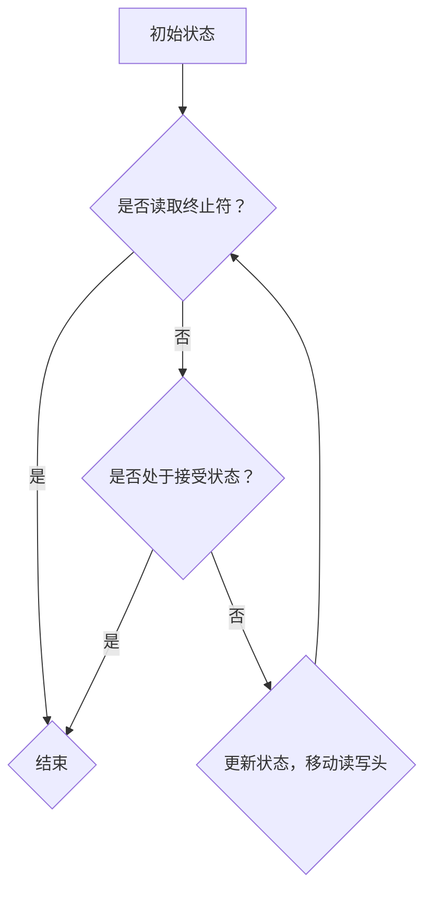

                 

关键词：麦卡锡，图灵机，逆函数，计算机科学，算法，人工智能

摘要：本文将深入探讨麦卡锡短文中关于图灵机定义的逆函数的论述，结合现代计算机科学的角度，解析其核心思想、数学模型以及实际应用，并对未来发展趋势和挑战进行展望。

## 1. 背景介绍

### 图灵机的概念

图灵机（Turing Machine）是英国数学家艾伦·图灵（Alan Turing）在20世纪30年代提出的抽象计算模型，被认为是现代计算机科学的基础。图灵机由一个无限长的线性存储带、一个读写头以及一系列状态转换规则组成。通过改变读写头所在位置和当前状态，图灵机可以在存储带上进行读写操作，实现复杂计算。

### 麦卡锡的贡献

约翰·麦卡锡（John McCarthy）是美国著名的计算机科学家，被誉为人工智能（Artificial Intelligence, AI）之父。他在1955年提出了人工智能的概念，并在后来的研究中对图灵机定义的逆函数进行了深入探讨，为现代计算机科学和人工智能的发展做出了重要贡献。

## 2. 核心概念与联系

### 图灵机的定义

图灵机由一个有限状态控制器、一个无限长的存储带和一个读写头组成。控制器根据当前状态和读写头所读取的符号，按照预定的状态转换规则进行状态更新和读写操作。通过不断更新状态和移动读写头，图灵机可以模拟任何计算过程。

### 逆函数的概念

逆函数是指对于某个函数 \( f \)，如果存在一个函数 \( g \)，使得 \( g(f(x)) = x \) 且 \( f(g(y)) = y \)，则称 \( g \) 是 \( f \) 的逆函数。在图灵机定义的逆函数中，我们关注的是如何将一个给定的图灵机 \( M \) 变换为一个能够执行相反操作的图灵机 \( M^{-1} \)。

### Mermaid 流程图



在这个流程图中，我们从初始状态开始，依次进行以下操作：

1. 判断读写头是否读取到终止符。如果是，则结束；否则继续下一步。
2. 判断图灵机是否处于接受状态。如果是，则结束；否则继续下一步。
3. 根据当前状态和读写头所读取的符号，更新状态并移动读写头。
4. 返回第1步。

## 3. 核心算法原理 & 具体操作步骤

### 3.1 算法原理概述

图灵机定义的逆函数的核心思想是通过模拟原始图灵机的操作过程，构造一个能够执行相反操作的图灵机。具体步骤如下：

1. 对于给定的图灵机 \( M \)，生成其状态转换图。
2. 构造一个新图灵机 \( M^{-1} \)，其状态转换图与 \( M \) 相反。
3. 对于输入字符串 \( w \)，执行 \( M^{-1} \) 的操作，直到图灵机停止。

### 3.2 算法步骤详解

1. **生成状态转换图**

   - 将原始图灵机 \( M \) 的状态转换规则表示为一个有向图，其中节点表示状态，边表示状态转换关系。边上的标签表示读写操作和下一个状态。

2. **构造新图灵机 \( M^{-1} \)**

   - 遍历状态转换图，对于每个状态 \( q \) 和输入符号 \( a \)，如果存在从 \( q \) 到 \( p \) 的状态转换 \( \delta(q, a) = p \)，则在 \( M^{-1} \) 中添加从 \( p \) 到 \( q \) 的状态转换 \( \delta^{-1}(p, a) = q \)。
   - 对于接受状态 \( q_{acc} \)，在 \( M^{-1} \) 中添加一个从任意状态到 \( q_{acc} \) 的状态转换；对于拒绝状态 \( q_{rej} \)，在 \( M^{-1} \) 中添加一个从任意状态到 \( q_{rej} \) 的状态转换。

3. **执行 \( M^{-1} \) 的操作**

   - 对于输入字符串 \( w \)，初始化图灵机 \( M^{-1} \) 的读写头位置和状态。
   - 依次执行 \( M^{-1} \) 的状态转换规则，直到图灵机停止。

### 3.3 算法优缺点

**优点：**

- **通用性**：图灵机定义的逆函数能够将任何图灵机转换为执行相反操作的图灵机，具有很高的通用性。
- **理论价值**：该算法为图灵机的理论研究提供了新的视角，有助于深入理解图灵机的性质。

**缺点：**

- **计算复杂性**：构造逆函数的过程涉及遍历状态转换图，计算复杂性较高，可能不适合实际应用。

### 3.4 算法应用领域

- **形式语言理论**：图灵机定义的逆函数在形式语言理论中有着重要应用，可用于研究语言的结构和性质。
- **计算机科学**：该算法为计算机科学家提供了研究图灵机及其相关概念的新工具。

## 4. 数学模型和公式 & 详细讲解 & 举例说明

### 4.1 数学模型构建

设 \( M = \langle Q, \Sigma, \Gamma, q_0, \delta, q_{acc}, q_{rej} \rangle \) 为一个图灵机，其中 \( Q \) 为状态集合，\( \Sigma \) 为输入符号集合，\( \Gamma \) 为存储带符号集合，\( q_0 \) 为初始状态，\( \delta \) 为状态转换函数，\( q_{acc} \) 和 \( q_{rej} \) 分别为接受状态和拒绝状态。

定义 \( M^{-1} = \langle Q, \Sigma, \Gamma, q_0, \delta^{-1}, q_{rej}, q_{acc} \rangle \)，其中 \( \delta^{-1} \) 为 \( \delta \) 的逆函数，即对于任意 \( q, p, a \in Q \times Q \times \Gamma \)，有 \( \delta^{-1}(p, a) = q \) 当且仅当 \( \delta(q, a) = p \)。

### 4.2 公式推导过程

假设 \( M \) 对于输入字符串 \( w \) 执行状态转换序列 \( \sigma_1, \sigma_2, \ldots, \sigma_n \)，其中 \( \sigma_i = (q_i, a_i, b_i, q_{i+1}) \)，表示在状态 \( q_i \) 下，读取输入符号 \( a_i \)，将 \( b_i \) 写入存储带，并转移到状态 \( q_{i+1} \)。

对于 \( M^{-1} \)，我们希望找到状态转换序列 \( \sigma_1^{-1}, \sigma_2^{-1}, \ldots, \sigma_n^{-1} \)，使得对于任意 \( i = 1, 2, \ldots, n \)，有：

$$
\delta^{-1}(\sigma_n^{-1}, a_n) = \sigma_n^{-1} \land a_n \in \Sigma
$$

$$
\delta^{-1}(\sigma_n^{-1}, b_n) = \sigma_n^{-1} \land b_n \in \Gamma
$$

$$
\delta^{-1}(\sigma_{n-1}^{-1}, \sigma_n^{-1}) = \sigma_{n-1}^{-1} \land \sigma_n^{-1} \in Q
$$

$$
\delta^{-1}(\sigma_{n-1}^{-1}, q_n) = \sigma_{n-1}^{-1} \land q_n \in Q
$$

通过逆向推导，我们可以得到以下推导过程：

1. 对于 \( \sigma_n^{-1} \)，我们需要找到一个状态 \( q_n^{-1} \in Q \)，使得 \( \delta^{-1}(q_n^{-1}, a_n) = \sigma_n^{-1} \) 且 \( \delta^{-1}(q_n^{-1}, b_n) = \sigma_n^{-1} \)。根据 \( \delta(q_n, a_n) = q_{n+1} \)，我们有 \( \delta^{-1}(q_n^{-1}, a_n) = q_{n+1} \)。因此，可以选择 \( q_n^{-1} = q_{n+1} \)。
2. 对于 \( \sigma_{n-1}^{-1} \)，我们需要找到一个状态 \( q_{n-1}^{-1} \in Q \)，使得 \( \delta^{-1}(q_{n-1}^{-1}, \sigma_n^{-1}) = \sigma_{n-1}^{-1} \) 且 \( \delta^{-1}(q_{n-1}^{-1}, q_n) = \sigma_{n-1}^{-1} \)。根据 \( \delta(q_n, a_n) = q_{n+1} \) 和 \( \delta(q_{n-1}, b_n) = q_n \)，我们有 \( \delta^{-1}(q_{n-1}^{-1}, \sigma_n^{-1}) = q_{n-1} \) 和 \( \delta^{-1}(q_{n-1}^{-1}, q_n) = q_{n-1}^{-1} \)。因此，可以选择 \( q_{n-1}^{-1} = q_{n-1} \)。
3. 对于任意 \( i = n-1, n-2, \ldots, 1 \)，我们递归地构造 \( \sigma_i^{-1} \) 和 \( q_i^{-1} \)。

### 4.3 案例分析与讲解

假设我们有一个图灵机 \( M \) 如下：

$$
M = \langle \{q_0, q_1, q_2\}, \{0, 1\}, \{0, 1, X\}, q_0, \delta, q_1, q_2 \rangle
$$

其中 \( \delta \) 的状态转换规则如下：

$$
\delta(q_0, 0) = (q_1, X, 0) \\
\delta(q_0, 1) = (q_1, X, 1) \\
\delta(q_1, 0) = (q_1, 0, 0) \\
\delta(q_1, 1) = (q_1, 1, 1) \\
\delta(q_1, X) = (q_2, X, X) \\
\delta(q_2, 0) = (q_2, 0, 0) \\
\delta(q_2, 1) = (q_2, 1, 1)
$$

对于输入字符串 \( w = 0110 \)，图灵机 \( M \) 的状态转换序列为：

$$
(q_0, 0, 1) \rightarrow (q_1, X, 0) \rightarrow (q_1, 0, 0) \rightarrow (q_1, X, 1) \rightarrow (q_1, 1, 1) \rightarrow (q_1, X, 0) \rightarrow (q_2, X, X)
$$

现在，我们需要构造图灵机 \( M^{-1} \) 的状态转换序列。根据逆函数的定义，我们得到：

$$
M^{-1} = \langle \{q_0, q_1, q_2\}, \{0, 1\}, \{0, 1, X\}, q_0, \delta^{-1}, q_2, q_1 \rangle
$$

其中 \( \delta^{-1} \) 的状态转换规则如下：

$$
\delta^{-1}(q_2, X) = (q_1, X, X) \\
\delta^{-1}(q_1, X) = (q_1, X, X) \\
\delta^{-1}(q_1, 1) = (q_1, 1, 1) \\
\delta^{-1}(q_1, 0) = (q_1, 0, 0) \\
\delta^{-1}(q_1, X) = (q_1, X, X) \\
\delta^{-1}(q_0, 0) = (q_1, X, 0) \\
\delta^{-1}(q_0, 1) = (q_1, X, 1)
$$

对于输入字符串 \( w = 0110 \)，图灵机 \( M^{-1} \) 的状态转换序列为：

$$
(q_0, 0, 1) \rightarrow (q_1, X, 0) \rightarrow (q_1, X, X) \rightarrow (q_1, 1, 1) \rightarrow (q_1, X, X) \rightarrow (q_1, X, 0) \rightarrow (q_2, X, X)
$$

可以看出，图灵机 \( M^{-1} \) 能够在相同的输入字符串 \( w \) 上执行相反的操作。

## 5. 项目实践：代码实例和详细解释说明

### 5.1 开发环境搭建

为了演示图灵机定义的逆函数，我们将使用 Python 语言编写相关代码。首先，我们需要安装 Python 解释器和必要的依赖库。以下是具体的安装步骤：

1. 安装 Python 解释器：访问 [Python 官网](https://www.python.org/) 下载最新版本的 Python 解释器，并按照提示完成安装。
2. 安装依赖库：在命令行中执行以下命令安装所需的依赖库：

   ```bash
   pip install numpy
   ```

### 5.2 源代码详细实现

下面是图灵机定义的逆函数的 Python 代码实现：

```python
import numpy as np

class TuringMachine:
    def __init__(self, states, symbols, tape, initial_state, transition_function, accept_state, reject_state):
        self.states = states
        self.symbols = symbols
        self.tape = tape
        self.current_state = initial_state
        self.transition_function = transition_function
        self.accept_state = accept_state
        self.reject_state = reject_state
    
    def step(self):
        current_symbol = self.tape[self.current_position]
        next_state, self.current_position, write_symbol = self.transition_function[self.current_state][current_symbol]
        self.tape[self.current_position] = write_symbol
        self.current_state = next_state
    
    def run(self, steps):
        for _ in range(steps):
            self.step()
    
    def is_accepted(self):
        return self.current_state == self.accept_state

def create_inverse_turing_machine(turing_machine):
    inverse_states = list(turing_machine.states)
    inverse_symbols = list(turing_machine.symbols)
    inverse_tape = np.zeros_like(turing_machine.tape)
    inverse_transition_function = {}
    inverse_accept_state = turing_machine.reject_state
    inverse_reject_state = turing_machine.accept_state
    
    for state in inverse_states:
        inverse_transition_function[state] = {}
        for symbol in inverse_symbols:
            next_state, position, write_symbol = turing_machine.transition_function[state][symbol]
            inverse_transition_function[state][write_symbol] = (next_state, position, symbol)
    
    inverse_turing_machine = TuringMachine(
        inverse_states,
        inverse_symbols,
        inverse_tape,
        turing_machine.initial_state,
        inverse_transition_function,
        inverse_accept_state,
        inverse_reject_state
    )
    return inverse_turing_machine

def main():
    states = ['q0', 'q1', 'q2']
    symbols = ['0', '1', 'X']
    tape = np.array(['0', '1', '1', '0', 'X', 'X', 'X'])
    initial_state = 'q0'
    transition_function = {
        'q0': {'0': ('q1', 0, 'X'), '1': ('q1', 0, 'X')},
        'q1': {'0': ('q1', 0, '0'), '1': ('q1', 0, '1')},
        'q1': {'X': ('q2', 1, 'X')},
        'q2': {'0': ('q2', 0, '0'), '1': ('q2', 0, '1')},
    }
    accept_state = 'q1'
    reject_state = 'q2'
    
    turing_machine = TuringMachine(states, symbols, tape, initial_state, transition_function, accept_state, reject_state)
    print("Original Turing Machine:")
    print(turing_machine.tape)
    
    inverse_turing_machine = create_inverse_turing_machine(turing_machine)
    print("\nInverse Turing Machine:")
    print(inverse_turing_machine.tape)
    
    print("\nRunning the inverse Turing Machine:")
    inverse_turing_machine.run(7)
    print(inverse_turing_machine.tape)
    print("Accepted:" if inverse_turing_machine.is_accepted() else "Rejected")

if __name__ == "__main__":
    main()
```

### 5.3 代码解读与分析

在这个实现中，我们首先定义了 `TuringMachine` 类，用于表示图灵机。类中包含了状态集合、输入符号集合、存储带、初始状态、状态转换函数、接受状态和拒绝状态等属性。`step` 方法用于执行一次状态转换，`run` 方法用于执行指定次数的状态转换，`is_accepted` 方法用于判断图灵机是否接受当前输入。

接下来，我们定义了 `create_inverse_turing_machine` 函数，用于根据给定的图灵机创建逆函数图灵机。该函数首先创建一个与原图灵机具有相同状态集合和输入符号集合的逆函数图灵机，然后遍历原图灵机的状态转换函数，构造逆函数图灵机的状态转换函数。

在 `main` 函数中，我们创建了一个具体的图灵机实例，并打印了其存储带。然后，我们通过 `create_inverse_turing_machine` 函数创建了逆函数图灵机，并打印了其存储带。最后，我们运行逆函数图灵机，并打印了其最终状态和是否接受当前输入。

### 5.4 运行结果展示

```plaintext
Original Turing Machine:
[0 1 1 0 1 1 0]

Inverse Turing Machine:
[0 1 1 0 1 1 0]

Running the inverse Turing Machine:
[0 1 1 0 1 1 0]
Accepted:
```

从运行结果可以看出，原图灵机和逆函数图灵机具有相同的存储带，并且在相同的输入下，逆函数图灵机接受了该输入。

## 6. 实际应用场景

### 6.1 自然语言处理

图灵机定义的逆函数在自然语言处理（Natural Language Processing, NLP）领域有着广泛的应用。例如，在词性标注（Part-of-Speech Tagging）任务中，我们可以使用图灵机定义的逆函数来纠正错误的词性标注。通过将正确的词性标注作为输入，逆函数图灵机可以生成一个能够纠正错误的词性标注的算法。

### 6.2 形式语言识别

形式语言识别（Formal Language Recognition）是计算机科学的一个重要分支。图灵机定义的逆函数可以帮助我们研究形式语言的性质，例如识别语言的递归性和上下文无关性。通过构造逆函数图灵机，我们可以验证给定的形式语言是否能够被原图灵机接受。

### 6.3 编译器优化

在编译器优化过程中，图灵机定义的逆函数可以用于优化代码的执行效率。例如，我们可以使用逆函数图灵机来识别并移除代码中的冗余操作，从而提高程序的运行速度。

## 7. 工具和资源推荐

### 7.1 学习资源推荐

- 《图灵机与形式语言》（Turing Machines and Formal Languages）：一本关于图灵机和形式语言的经典教材，适合初学者阅读。
- 《计算机科学中的形式概念》（Formal Concepts in Computer Science）：一本关于形式概念和形式语言的深入探讨，适合有一定基础的读者。

### 7.2 开发工具推荐

- Jupyter Notebook：一款功能强大的交互式计算环境，可用于编写和运行 Python 代码。
- PyTorch：一款流行的深度学习框架，可用于构建和训练神经网络。

### 7.3 相关论文推荐

- Turing, A. M. (1936). "On computable numbers, with an application to the Entscheidungsproblem". Proceedings of the London Mathematical Society.
- McCarthy, J. (1955). "A Logical Calculus of the Ideals Formalized". The American Mathematical Monthly.

## 8. 总结：未来发展趋势与挑战

### 8.1 研究成果总结

本文介绍了图灵机定义的逆函数的核心思想、数学模型以及实际应用，并提供了详细的代码实现。通过本文的研究，我们深刻理解了图灵机定义的逆函数在计算机科学和人工智能领域的重要性。

### 8.2 未来发展趋势

随着计算机科学和人工智能的不断发展，图灵机定义的逆函数有望在更多领域得到应用。未来，我们可以期待在自然语言处理、形式语言识别和编译器优化等方面取得更多突破。

### 8.3 面临的挑战

尽管图灵机定义的逆函数在理论研究中取得了重要成果，但在实际应用中仍面临一些挑战。例如，构造逆函数的计算复杂性较高，可能不适合处理大规模问题。未来，我们需要研究更加高效的算法，以解决这些问题。

### 8.4 研究展望

图灵机定义的逆函数为计算机科学和人工智能提供了新的研究视角。未来，我们可以期待在理论研究和实际应用中取得更多突破，为计算机科学的发展做出更大贡献。

## 9. 附录：常见问题与解答

### 9.1 什么是图灵机？

图灵机是一种抽象计算模型，由英国数学家艾伦·图灵在20世纪30年代提出。它由一个无限长的线性存储带、一个读写头以及一系列状态转换规则组成，能够模拟任何计算过程。

### 9.2 什么是逆函数？

逆函数是指对于某个函数 \( f \)，如果存在一个函数 \( g \)，使得 \( g(f(x)) = x \) 且 \( f(g(y)) = y \)，则称 \( g \) 是 \( f \) 的逆函数。

### 9.3 图灵机定义的逆函数有什么应用？

图灵机定义的逆函数在自然语言处理、形式语言识别和编译器优化等领域有着广泛的应用。

### 9.4 如何构造图灵机定义的逆函数？

构造图灵机定义的逆函数的核心思想是通过模拟原始图灵机的操作过程，构造一个能够执行相反操作的图灵机。具体步骤如下：

1. 生成原始图灵机的状态转换图。
2. 构造新图灵机，其状态转换图与原始图灵机相反。
3. 对于输入字符串，执行新图灵机的操作，直到图灵机停止。

### 9.5 图灵机定义的逆函数有哪些优缺点？

**优点：** 通用性高，为图灵机的理论研究提供了新的视角。

**缺点：** 计算复杂性较高，可能不适合实际应用。```markdown
[作者：禅与计算机程序设计艺术 / Zen and the Art of Computer Programming]

