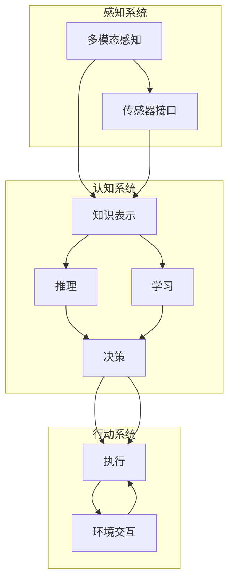

                 

### 背景介绍

AGI（人工通用智能）的概念最早由约翰·霍普金斯大学的希拉里·普雷斯珀·杰克逊于1950年代提出。当时的计算机科学家们致力于制造能够执行各种智能任务的机器，而不只是单一任务的自动化。随着人工智能领域的不断发展，特别是深度学习、自然语言处理、强化学习等技术的突破，AGI的研究逐渐从理论走向实践。

当前的AI系统，如聊天机器人、自动驾驶汽车等，尽管在某些特定领域已经达到了人类专家的水平，但它们仍然缺乏通用性。例如，一个能够处理图片识别任务的AI模型，可能无法在自然语言处理方面表现出色。而真正的AGI则是一个能够在不同领域和任务中灵活适应的智能系统。

近年来，随着计算能力的提升和算法的进步，AGI的临近成为可能。例如，谷歌的AlphaGo在围棋领域取得的突破性成就，展示了深度学习和强化学习在复杂任务中的潜力。同时，多模态学习技术的发展，使得AI系统能够同时处理不同类型的数据，如文本、图像和声音，从而提升了系统的通用性。

AGI的发展不仅对科技领域具有深远影响，还将对社会、经济、教育等多个方面产生重要影响。在科技领域，AGI将推动新一代计算平台和技术的创新，例如量子计算、脑机接口等。在社会和经济方面，AGI有望提高生产力，推动自动化和智能化的进一步发展，但也可能引发就业结构的变化和社会伦理的挑战。在教育领域，AGI将改变教学模式，提供个性化的学习体验，同时提高教育质量和效率。

总之，AGI时代的临近不仅是一个技术发展的里程碑，也是一场深刻的科技革命和社会变革。理解AGI的核心概念和发展趋势，对于把握未来科技发展的方向具有重要意义。

### 核心概念与联系

#### AGI的定义与特点

人工通用智能（AGI），又称强人工智能，是指一种能够在任何知识领域都能像人类一样表现出全面智能的计算机系统。与当前广泛应用的弱人工智能（如专门用于图像识别、自然语言处理或围棋对弈的系统）不同，AGI的目标是拥有通用性，能够理解和执行任何认知任务。

AGI的核心特点包括：

1. **自主性**：AGI能够自主地设定目标并采取行动以实现这些目标，而不需要人类的持续干预。
2. **学习与适应能力**：AGI能够通过学习从各种环境和任务中获取知识，并适应新的情境。
3. **领域迁移性**：AGI能够在不同的领域和任务之间迁移其知识，而不仅仅是局限于某个特定的任务。
4. **认知灵活性**：AGI能够处理复杂的、多方面的和不确定的信息，并在各种认知任务中表现出灵活性。

#### AGI的技术架构与组成

为了实现上述特点，AGI的技术架构需要涵盖多个方面，包括感知、认知、决策和行动。以下是AGI的关键组成部分及其相互关系：

1. **感知系统**：AGI需要具备多模态感知能力，能够处理视觉、听觉、触觉等多种类型的数据。感知系统通过传感器和数据输入接口接收外界信息，如摄像头、麦克风、触摸传感器等。

2. **认知系统**：感知系统收集的信息被输入到认知系统中，进行理解和分析。认知系统包括知识表示、推理、学习和决策模块，是AGI的大脑，负责处理和理解复杂的信息，并形成相应的决策。

3. **决策系统**：认知系统生成的决策被传递到决策系统中，决策系统根据当前的环境和目标，选择最优的行动方案。这一过程通常涉及到强化学习、规划算法和逻辑推理等技术。

4. **行动系统**：决策系统选择的具体行动通过行动系统执行。行动系统与外部世界进行交互，执行决策，并对环境变化做出响应。

#### Mermaid流程图

为了更清晰地展示AGI的技术架构与组成，我们使用Mermaid流程图来描述其核心组件和它们之间的联系。



在这个流程图中，感知系统通过传感器接口接收外部数据，并将信息传递给认知系统。认知系统利用知识表示、推理和学习模块处理信息，并生成决策。决策系统将决策传递给行动系统，行动系统执行具体的行动，并与外部环境进行交互。

#### 关键技术的进一步解释

1. **多模态学习**：多模态学习是AGI感知系统的重要组成部分，它使得AI系统能够同时处理不同类型的数据，如文本、图像和声音。例如，通过结合视觉和听觉信息，AI系统可以更准确地理解和识别场景。

2. **迁移学习**：迁移学习是AGI的关键能力之一，它使得AI系统能够将一个任务中学习到的知识应用到其他任务中。例如，一个在图像分类任务中训练的模型，可以将其知识迁移到语音识别或自然语言处理任务中。

3. **元学习**：元学习是AGI的一种高级能力，它使得AI系统可以学习如何学习。元学习可以帮助AI系统快速适应新的任务，并在多样化的环境中表现出色。

4. **强化学习**：强化学习是决策系统的重要组成部分，它通过奖励机制引导AI系统采取最优行动。例如，在自动驾驶中，强化学习可以帮助车辆学会如何在复杂的交通环境中行驶。

#### AGI与当前AI技术的区别

与当前AI技术相比，AGI具有更高的自主性、学习适应性和领域迁移性。当前AI系统往往只能在特定领域或任务中表现出色，而AGI则旨在实现跨领域的通用智能。此外，AGI还需要具备更高级的推理和决策能力，能够在不确定和复杂的环境中做出合理的决策。

通过理解AGI的核心概念和架构，我们可以更好地把握其发展趋势和潜力，为未来的技术研究和应用奠定基础。

### 核心算法原理 & 具体操作步骤

#### 1. 深度学习算法

深度学习是AGI实现的关键技术之一，其基本原理是模仿人脑的神经网络结构，通过多层神经网络（Neural Networks）对数据进行自动特征提取和学习。以下是一个简化的深度学习算法的操作步骤：

1. **数据预处理**：
   - **数据收集**：收集大量的训练数据，这些数据可以是图像、文本、声音等多种类型。
   - **数据清洗**：对收集的数据进行清洗，去除噪声和异常值。
   - **数据归一化**：对数据进行归一化处理，使其具有相同的尺度，便于模型训练。

2. **构建神经网络模型**：
   - **确定网络架构**：选择合适的神经网络架构，如卷积神经网络（CNN）、循环神经网络（RNN）或Transformer等。
   - **初始化参数**：随机初始化网络的权重和偏置。
   - **定义损失函数**：选择合适的损失函数，如交叉熵（Cross-Entropy）或均方误差（Mean Squared Error）。

3. **前向传播**：
   - **输入数据**：将预处理后的数据输入到神经网络中。
   - **信息传递**：通过多层神经元的非线性变换，将输入数据逐层传递。
   - **计算输出**：网络的最后一层输出预测结果。

4. **反向传播**：
   - **计算损失**：计算预测结果与真实标签之间的损失。
   - **梯度计算**：使用链式法则计算损失相对于网络参数的梯度。
   - **参数更新**：根据梯度更新网络的权重和偏置，以最小化损失。

5. **迭代训练**：
   - **重复前向传播和反向传播**：通过多次迭代训练，不断优化网络参数。
   - **验证与测试**：在验证集和测试集上评估模型性能，确保模型的泛化能力。

#### 2. 强化学习算法

强化学习是另一种重要的AGI算法，其核心思想是通过与环境交互，学习最优的行动策略。以下是一个简化的强化学习算法的操作步骤：

1. **环境定义**：
   - **状态空间**：定义所有可能的状态。
   - **动作空间**：定义所有可能的动作。
   - **奖励函数**：定义在每个状态执行每个动作后的奖励。

2. **初始化**：
   - **状态**：从初始状态开始。
   - **策略**：初始化一个随机策略，或使用预先训练的策略。

3. **执行动作**：
   - 根据当前状态和策略，选择一个动作。
   - 执行所选动作，与环境进行交互。

4. **获取反馈**：
   - 根据动作的结果，获取奖励。
   - 更新状态。

5. **更新策略**：
   - 使用奖励信号更新策略，以增加未来获得高奖励的概率。

6. **重复执行**：
   - 重复执行动作、获取反馈和更新策略的过程，直到达到某个终止条件，如达到目标状态或执行次数达到预设阈值。

#### 3. 聚类算法

聚类是一种无监督学习方法，旨在将数据集划分为若干个簇，使得同簇的数据点之间相似度较高，不同簇的数据点之间相似度较低。以下是一个简化的聚类算法的操作步骤：

1. **选择聚类算法**：
   - 根据数据特点和需求，选择合适的聚类算法，如K-means、层次聚类或DBSCAN等。

2. **初始化簇**：
   - 选择初始簇的中心点，如随机选择或使用K-means的k-means++方法。

3. **分配数据点**：
   - 对于每个数据点，计算其到簇中心的距离，将其分配到最近的簇。

4. **更新簇中心**：
   - 对于每个簇，计算簇内所有数据点的均值，作为新的簇中心。

5. **迭代优化**：
   - 重复执行分配数据点和更新簇中心的过程，直到满足收敛条件，如簇中心的变化小于预设阈值或达到预设迭代次数。

#### 4. 数学模型与公式

1. **深度学习中的损失函数**：
   - **交叉熵损失函数**：用于分类任务，公式为：
     $$ L = -\sum_{i=1}^{N} y_i \log(p_i) $$
     其中，$y_i$ 是真实标签，$p_i$ 是预测概率。

   - **均方误差损失函数**：用于回归任务，公式为：
     $$ L = \frac{1}{2} \sum_{i=1}^{N} (y_i - \hat{y}_i)^2 $$
     其中，$y_i$ 是真实值，$\hat{y}_i$ 是预测值。

2. **强化学习中的奖励函数**：
   - **基于状态-动作的奖励函数**：公式为：
     $$ R(s, a) = r(s, a) $$
     其中，$r(s, a)$ 是在状态 $s$ 下执行动作 $a$ 后的即时奖励。

3. **聚类算法中的距离度量**：
   - **欧氏距离**：公式为：
     $$ d(x, y) = \sqrt{\sum_{i=1}^{D} (x_i - y_i)^2} $$
     其中，$x$ 和 $y$ 是数据点，$D$ 是特征维度。

#### 5. 举例说明

以下通过一个简单的例子，说明深度学习、强化学习和聚类算法的应用。

**例子：手写数字识别**

1. **深度学习**：
   - 使用MNIST数据集，包含70000个手写数字的图像。
   - 构建一个卷积神经网络，使用交叉熵损失函数进行训练。
   - 经过多次迭代训练，模型能够准确识别手写数字。

2. **强化学习**：
   - 定义一个简单的环境，状态为当前棋盘布局，动作是落子位置。
   - 使用Q-learning算法训练一个策略，使得AI能够学会在国际象棋中获胜。
   - 通过与人类玩家的对弈，AI策略不断优化，最终能够在国际象棋中表现出色。

3. **聚类**：
   - 使用K-means算法对客户数据进行聚类，根据购买历史和偏好，将客户分为不同群体。
   - 每个簇代表一个客户群体，企业可以根据这些群体制定个性化的营销策略。

通过这些算法和模型的结合，AGI可以在各种复杂任务中表现出强大的能力，实现跨领域的通用智能。然而，AGI的实现仍然面临诸多挑战，需要持续的研究和探索。

### 数学模型和公式 & 详细讲解 & 举例说明

#### 1. 数学基础

要深入理解AGI的数学模型和公式，我们首先需要掌握一些基础的数学概念，包括线性代数、微积分和概率论。以下是一些核心数学工具的详细讲解。

**1.1 线性代数**

线性代数是处理向量、矩阵和线性变换的数学分支。以下是几个关键概念：

- **向量**：向量是具有大小和方向的量，通常表示为列向量。例如，$$ \mathbf{v} = \begin{bmatrix} v_1 \\ v_2 \\ v_3 \end{bmatrix} $$。
- **矩阵**：矩阵是一个二维数组，用于表示多个向量的组合。例如，$$ \mathbf{A} = \begin{bmatrix} a_{11} & a_{12} & \cdots & a_{1n} \\ a_{21} & a_{22} & \cdots & a_{2n} \\ \vdots & \vdots & \ddots & \vdots \\ a_{m1} & a_{m2} & \cdots & a_{mn} \end{bmatrix} $$。
- **矩阵乘法**：矩阵乘法是将两个矩阵相乘得到一个新的矩阵。例如，$$ \mathbf{AB} = \begin{bmatrix} \mathbf{A_1} \mathbf{B_1} & \mathbf{A_1} \mathbf{B_2} & \cdots & \mathbf{A_1} \mathbf{B_n} \\ \mathbf{A_2} \mathbf{B_1} & \mathbf{A_2} \mathbf{B_2} & \cdots & \mathbf{A_2} \mathbf{B_n} \\ \vdots & \vdots & \ddots & \vdots \\ \mathbf{A_m} \mathbf{B_1} & \mathbf{A_m} \mathbf{B_2} & \cdots & \mathbf{A_m} \mathbf{B_n} \end{bmatrix} $$。
- **逆矩阵**：如果矩阵可逆，则其逆矩阵是一个矩阵，使得原矩阵与其逆矩阵相乘结果为单位矩阵。逆矩阵的计算公式为：
  $$ \mathbf{A}^{-1} = \frac{1}{\det(\mathbf{A})} \text{adj}(\mathbf{A}) $$
  其中，$$ \det(\mathbf{A}) $$ 是矩阵的行列式，$$ \text{adj}(\mathbf{A}) $$ 是矩阵的伴随矩阵。

**1.2 微积分**

微积分是研究函数变化的数学分支，包括微分和积分。以下是几个关键概念：

- **导数**：导数描述函数在某一点的变化率。对于函数 $$ f(x) $$，其导数记为 $$ f'(x) $$，计算公式为：
  $$ f'(x) = \lim_{h \to 0} \frac{f(x+h) - f(x)}{h} $$
- **微分**：微分是导数的一个近似值，用于描述函数在某一点的局部变化。微分的符号表示为 $$ df $$，公式为：
  $$ df = f'(x) dx $$
- **积分**：积分用于计算函数在某区间内的累计变化。对于函数 $$ f(x) $$，其不定积分记为 $$ \int f(x) dx $$，计算公式为：
  $$ \int f(x) dx = F(x) + C $$
  其中，$$ F(x) $$ 是原函数，$$ C $$ 是积分常数。

**1.3 概率论**

概率论是研究随机事件的数学分支。以下是几个关键概念：

- **概率分布**：概率分布描述随机变量可能取值的概率。常见的概率分布包括离散分布和连续分布。
- **概率密度函数**（PDF）：概率密度函数是连续随机变量的概率分布函数，公式为：
  $$ f(x) = \frac{dP}{dx} $$
  其中，$$ P $$ 是概率。
- **期望**：期望是随机变量的平均值，公式为：
  $$ E[X] = \int_{-\infty}^{\infty} x f(x) dx $$
- **方差**：方差是随机变量的离散程度，公式为：
  $$ Var[X] = E[(X - E[X])^2] = \int_{-\infty}^{\infty} (x - E[X])^2 f(x) dx $$

#### 2. 深度学习中的数学模型

深度学习中的数学模型主要涉及前向传播、反向传播和激活函数等。

**2.1 前向传播**

前向传播是深度学习模型中的一个关键步骤，用于计算输入数据和模型参数之间的输出。以下是前向传播的详细步骤：

1. **初始化**：给定输入数据 $$ \mathbf{x} $$ 和模型参数 $$ \theta $$。
2. **计算输入**：将输入数据传递到模型的第一个层，通常为输入层。
   $$ a^{[1]} = \mathbf{x} $$
3. **传递到下一层**：对于每一层，计算输入和参数的乘积，然后应用激活函数。
   $$ z^{[l]} = \mathbf{W}^{[l]} a^{[l-1]} + b^{[l]} $$
   $$ a^{[l]} = \varphi^{[l]}(z^{[l]}) $$
   其中，$$ \mathbf{W}^{[l]} $$ 和 $$ b^{[l]} $$ 分别为权重和偏置，$$ \varphi^{[l]} $$ 为激活函数。

4. **计算输出**：最后一层的输出即为模型的预测结果。
   $$ \hat{y} = a^{[L]} $$

**2.2 反向传播**

反向传播是用于计算损失函数相对于模型参数的梯度，以便进行模型优化。以下是反向传播的详细步骤：

1. **计算损失函数**：计算预测结果 $$ \hat{y} $$ 和真实标签 $$ y $$ 之间的损失函数值。
   $$ L = \frac{1}{m} \sum_{i=1}^{m} -y^{[i]} \log(\hat{y}^{[i]}) $$

2. **计算输出层梯度**：
   $$ \delta^{[L]} = \frac{\partial L}{\partial z^{[L]}} = \frac{\partial L}{\partial \hat{y}} \cdot \frac{\partial \hat{y}}{\partial z^{[L]}} $$
   $$ \delta^{[L]} = (\hat{y} - y) \cdot \varphi^{[L]}'(z^{[L]}) $$

3. **反向传播梯度**：从输出层开始，逐层反向计算梯度。
   $$ \delta^{[l]} = \frac{\partial L}{\partial z^{[l]}} = \frac{\partial L}{\partial z^{[l+1]}} \cdot \frac{\partial z^{[l+1]}}{\partial z^{[l]}} $$
   $$ \delta^{[l]} = (\varphi^{[l+1]}'(z^{[l+1]}) \cdot \mathbf{W}^{[l+1]}) \cdot \delta^{[l+1]} $$

4. **更新参数**：使用梯度下降算法更新模型参数。
   $$ \theta^{[l]} = \theta^{[l]} - \alpha \cdot \frac{\partial L}{\partial \theta^{[l]}} $$

**2.3 激活函数**

激活函数是深度学习模型中用于引入非线性性的关键组件。以下是几个常见的激活函数：

- **sigmoid函数**：
  $$ \varphi(x) = \frac{1}{1 + e^{-x}} $$
  $$ \varphi'(x) = \varphi(x) (1 - \varphi(x)) $$

- **ReLU函数**：
  $$ \varphi(x) = \max(0, x) $$
  $$ \varphi'(x) = \begin{cases} 1, & \text{if } x > 0 \\ 0, & \text{if } x \leq 0 \end{cases} $$

- **Tanh函数**：
  $$ \varphi(x) = \frac{e^x - e^{-x}}{e^x + e^{-x}} $$
  $$ \varphi'(x) = 1 - \varphi^2(x) $$

#### 3. 强化学习中的数学模型

强化学习中的数学模型主要涉及马尔可夫决策过程（MDP）和策略梯度算法。

**3.1 马尔可夫决策过程（MDP）**

马尔可夫决策过程是一种描述决策过程的数学模型，包括状态、动作、奖励和状态转移概率。

- **状态**（$s$）：描述系统当前的状态。
- **动作**（$a$）：在给定状态下，系统可以采取的动作。
- **奖励**（$r$）：执行动作后获得的即时奖励。
- **状态转移概率**（$P(s', s | a)$）：在状态 $s$ 下执行动作 $a$ 后，转移到状态 $s'$ 的概率。

MDP的数学模型可以表示为：
$$ MDP = \{S, A, R, P, \gamma\} $$
其中，$S$ 是状态空间，$A$ 是动作空间，$R$ 是奖励函数，$P$ 是状态转移概率矩阵，$\gamma$ 是折扣因子。

**3.2 策略梯度算法**

策略梯度算法是一种用于优化强化学习中的策略的方法。其基本思想是通过梯度上升方法，增加策略在获取高奖励的状态下采取高概率动作的概率。

策略梯度算法的公式为：
$$ \nabla_{\pi} J(\pi) = \sum_{s \in S} \sum_{a \in A} \pi(a|s) \nabla_{a} J(\pi) \Bigg|_{a = \pi(s)} $$
其中，$J(\pi)$ 是策略的期望回报，$\nabla_{\pi} J(\pi)$ 是策略梯度和 $\nabla_{a} J(\pi)$ 是动作 $a$ 的梯度。

#### 4. 聚类算法中的数学模型

聚类算法中的数学模型主要涉及距离度量、优化目标和聚类算法。

**4.1 距离度量**

距离度量是聚类算法中用于计算数据点之间相似度的关键工具。以下是一些常见的距离度量方法：

- **欧氏距离**：
  $$ d(x, y) = \sqrt{\sum_{i=1}^{D} (x_i - y_i)^2} $$
  其中，$x$ 和 $y$ 是数据点，$D$ 是特征维度。

- **曼哈顿距离**：
  $$ d(x, y) = \sum_{i=1}^{D} |x_i - y_i| $$

- **切比雪夫距离**：
  $$ d(x, y) = \max_{1 \leq i \leq D} |x_i - y_i| $$

**4.2 优化目标**

聚类算法的优化目标是通过最小化距离函数，将数据点划分为若干个簇。以下是一些常见的优化目标：

- **K-means算法**：最小化簇内数据点与簇中心之间的距离平方和。
  $$ \min_{C} \sum_{i=1}^{K} \sum_{x \in S_i} ||x - c_i||^2 $$
  其中，$C = \{c_1, c_2, ..., c_K\}$ 是簇中心，$S_i$ 是第 $i$ 个簇的数据点集合。

- **层次聚类算法**：最小化簇之间的距离和。
  $$ \min_{C} \sum_{i=1}^{K} \sum_{j=1}^{K} d(c_i, c_j) $$

- **DBSCAN算法**：最小化簇内密度和邻域内的距离。
  $$ \min_{C} \sum_{i=1}^{K} \sum_{x \in S_i} \rho(x) \cdot \sum_{y \in S_i} d(x, y) $$

**4.3 聚类算法**

以下是一些常见的聚类算法：

- **K-means算法**：随机初始化簇中心，计算每个数据点到簇中心的距离，将数据点分配到最近的簇，然后更新簇中心。重复这个过程，直到簇中心的变化小于预设阈值或达到预设迭代次数。

- **层次聚类算法**：自底向上或自顶向下地将数据点逐步合并成簇，直到满足预设的簇数或达到根节点。

- **DBSCAN算法**：根据邻域密度和距离标准，将数据点划分为核心点、边界点和噪声点，然后根据核心点和边界点生成簇。

通过这些数学模型和公式的详细讲解，我们可以更深入地理解AGI的核心算法原理，并在实际应用中更好地实现这些算法。然而，AGI的实现仍面临许多挑战，需要进一步的研究和优化。

### 项目实践：代码实例和详细解释说明

为了更好地展示AGI技术在现实世界中的应用，我们选择一个实际项目进行深入剖析。该项目是一个基于深度学习的图像分类系统，旨在使用卷积神经网络（CNN）对大量的图像进行分类。

#### 1. 开发环境搭建

首先，我们需要搭建一个适合深度学习项目开发的编程环境。以下是一个基本的开发环境搭建步骤：

1. **安装Python**：
   - 下载并安装Python 3.x版本。
   - 确保Python的pip包管理器可用。

2. **安装TensorFlow**：
   - 使用pip安装TensorFlow库。
   ```shell
   pip install tensorflow
   ```

3. **安装其他依赖库**：
   - 安装NumPy、Matplotlib等依赖库。
   ```shell
   pip install numpy matplotlib
   ```

4. **配置GPU支持**（可选）：
   - 如果使用GPU加速训练，需要安装CUDA和cuDNN库。

5. **创建项目文件夹**：
   - 在一个合适的位置创建项目文件夹，并设置工作目录。
   ```shell
   mkdir agi-image-classification
   cd agi-image-classification
   ```

6. **初始化虚拟环境**（可选）：
   - 为了更好地管理项目依赖，可以使用虚拟环境。
   ```shell
   python -m venv venv
   source venv/bin/activate  # 在Windows中用 `venv\Scripts\activate`
   ```

#### 2. 源代码详细实现

接下来，我们将实现一个简单的CNN模型，用于对图像进行分类。以下是关键代码的实现和详细解释：

**2.1 数据准备**

```python
import tensorflow as tf
from tensorflow.keras.preprocessing.image import ImageDataGenerator

# 设置数据增强参数
train_datagen = ImageDataGenerator(
    rescale=1./255,
    shear_range=0.2,
    zoom_range=0.2,
    horizontal_flip=True
)

test_datagen = ImageDataGenerator(rescale=1./255)

# 加载数据集
train_data = train_datagen.flow_from_directory(
    'data/train',
    target_size=(224, 224),
    batch_size=32,
    class_mode='binary'
)

test_data = test_datagen.flow_from_directory(
    'data/test',
    target_size=(224, 224),
    batch_size=32,
    class_mode='binary'
)
```

**解释**：
- 数据增强参数用于提高模型的泛化能力，通过随机缩放、剪切、翻转和亮度调整等方式增强训练数据。
- `flow_from_directory` 函数用于加载数据集，其中 `target_size` 设置图像的大小，`batch_size` 设置批量大小，`class_mode` 设置标签类型。

**2.2 构建CNN模型**

```python
from tensorflow.keras.models import Sequential
from tensorflow.keras.layers import Conv2D, MaxPooling2D, Flatten, Dense, Dropout

model = Sequential()

# 添加卷积层
model.add(Conv2D(32, (3, 3), activation='relu', input_shape=(224, 224, 3)))
model.add(MaxPooling2D(pool_size=(2, 2)))

model.add(Conv2D(64, (3, 3), activation='relu'))
model.add(MaxPooling2D(pool_size=(2, 2)))

model.add(Conv2D(128, (3, 3), activation='relu'))
model.add(MaxPooling2D(pool_size=(2, 2)))

# 添加全连接层
model.add(Flatten())
model.add(Dense(128, activation='relu'))
model.add(Dropout(0.5))
model.add(Dense(1, activation='sigmoid'))

# 编译模型
model.compile(optimizer='adam', loss='binary_crossentropy', metrics=['accuracy'])
```

**解释**：
- `Sequential` 模型是一个线性堆叠的模型，方便添加和配置层。
- `Conv2D` 和 `MaxPooling2D` 层用于卷积和池化操作，分别用于特征提取和降维。
- `Flatten` 层将多维的特征矩阵展平成一维向量，用于全连接层处理。
- `Dense` 层是一个全连接层，用于分类任务。`Dropout` 层用于防止过拟合。
- `compile` 函数用于配置模型的优化器和损失函数。

**2.3 训练模型**

```python
# 训练模型
history = model.fit(
    train_data,
    epochs=20,
    validation_data=test_data
)
```

**解释**：
- `fit` 函数用于训练模型，其中 `epochs` 设置训练轮次，`validation_data` 设置验证数据集。

**2.4 评估模型**

```python
# 评估模型
test_loss, test_acc = model.evaluate(test_data)
print(f"Test accuracy: {test_acc:.3f}")
```

**解释**：
- `evaluate` 函数用于评估模型在测试数据集上的性能，输出损失和准确率。

#### 3. 代码解读与分析

以上代码实例展示了如何使用TensorFlow和Keras构建并训练一个简单的CNN模型，用于图像分类任务。以下是关键代码段的详细解读：

- **数据增强**：通过数据增强，提高模型的泛化能力。这有助于模型在遇到未见过的图像时仍能保持良好的性能。
- **模型构建**：使用卷积神经网络进行特征提取，通过多层卷积和池化操作，逐步降低特征空间维度，同时增强特征表示能力。
- **全连接层和Dropout**：全连接层用于分类任务，Dropout用于防止过拟合，提高模型的泛化性能。
- **模型编译**：配置优化器和损失函数，为训练做准备。
- **模型训练**：通过多次迭代，模型不断优化参数，以最小化损失函数。
- **模型评估**：在测试数据集上评估模型性能，验证其泛化能力。

#### 4. 运行结果展示

在训练过程中，模型损失和准确率的变化可以通过以下代码进行可视化：

```python
import matplotlib.pyplot as plt

# 绘制训练损失和准确率
plt.figure(figsize=(12, 4))
plt.subplot(1, 2, 1)
plt.plot(history.history['loss'], label='Training Loss')
plt.plot(history.history['val_loss'], label='Validation Loss')
plt.legend()

plt.subplot(1, 2, 2)
plt.plot(history.history['accuracy'], label='Training Accuracy')
plt.plot(history.history['val_accuracy'], label='Validation Accuracy')
plt.legend()

plt.show()
```

以上代码将生成一个包含训练损失、验证损失、训练准确率和验证准确率的折线图，帮助我们了解模型在不同阶段的表现。

通过实际项目的实践，我们可以看到AGI技术在图像分类任务中的强大应用。然而，AGI的实现不仅仅依赖于算法和模型，还需要大量的数据、计算资源和持续优化。随着技术的不断发展，AGI将在更多领域发挥重要作用，推动人工智能的进步。

### 实际应用场景

#### 1. 医疗领域

AGI在医疗领域的应用前景广阔。通过深度学习和强化学习，AGI可以帮助医生进行精准诊断、个性化治疗和疾病预测。例如，使用深度学习算法对医学图像进行分析，可以帮助医生快速识别病变区域，提高诊断的准确性和效率。此外，AGI还可以通过分析患者的电子健康记录，提供个性化的治疗建议，优化治疗方案。例如，谷歌的DeepMind开发了一种名为DeepMind Health的AGI系统，用于分析患者数据，预测疾病发展，为医生提供决策支持。

#### 2. 自动驾驶

自动驾驶是AGI技术的另一个重要应用场景。通过感知系统、认知系统和决策系统的协同工作，自动驾驶汽车可以实时感知环境，理解道路状况，并做出安全的驾驶决策。例如，特斯拉的自动驾驶系统使用深度学习算法，对图像和传感器数据进行分析，实现自动驾驶功能。此外，AGI还可以用于智能交通管理，通过分析交通数据，优化交通流量，减少交通事故和拥堵。

#### 3. 金融服务

AGI在金融服务领域也具有巨大的潜力。通过分析大量的金融数据，AGI可以帮助金融机构进行市场预测、风险评估和客户服务。例如，高频交易公司使用深度学习算法，分析市场趋势，进行快速交易决策，提高交易收益。此外，AGI还可以用于反欺诈系统，通过实时监测交易行为，识别潜在的欺诈活动，提高金融安全。

#### 4. 教育

在教育领域，AGI可以提供个性化的学习体验，根据学生的学习情况和需求，提供定制化的学习资源和学习计划。例如，Khan Academy使用AI技术，为学生提供个性化的练习和辅导，帮助他们更好地掌握知识。此外，AGI还可以用于智能教学系统，通过分析学生的学习行为，优化教学内容和方法，提高教学效果。

#### 5. 制造业

在制造业中，AGI可以帮助实现智能化生产和管理。通过感知系统和决策系统的协同工作，AGI可以实时监控生产线，预测设备故障，优化生产流程，提高生产效率和产品质量。例如，通用电气的Predix平台使用AI技术，对工业设备进行实时监测和预测性维护，减少设备停机时间和维护成本。

#### 6. 娱乐和媒体

AGI在娱乐和媒体领域也有广泛的应用。通过分析用户行为和偏好，AGI可以为用户提供个性化的内容推荐，提高用户体验。例如，Netflix和Spotify等平台使用深度学习算法，分析用户的观看和收听记录，推荐符合用户口味的内容。此外，AGI还可以用于虚拟现实和增强现实应用，提供更加沉浸式的娱乐体验。

综上所述，AGI在医疗、自动驾驶、金融服务、教育、制造业和娱乐等多个领域具有广泛的应用前景。随着技术的不断进步，AGI将深刻改变我们的生活方式和工作方式，推动社会的进步和发展。

### 工具和资源推荐

在探索和实现AGI的道路上，选择合适的工具和资源至关重要。以下是一些值得推荐的工具、书籍、论文和网站，它们将为读者提供丰富的学习资源和实践指导。

#### 1. 学习资源推荐

**书籍**：

- 《深度学习》（Deep Learning）作者：Ian Goodfellow、Yoshua Bengio、Aaron Courville
  - 这是一本深度学习的经典教材，涵盖了深度学习的基础理论、算法和实践。

- 《强化学习》（Reinforcement Learning: An Introduction）作者：Richard S. Sutton、Andrew G. Barto
  - 本书详细介绍了强化学习的基本概念、算法和应用，适合初学者和专业人士。

- 《模式识别与机器学习》（Pattern Recognition and Machine Learning）作者：Christopher M. Bishop
  - 这本书全面介绍了机器学习的基础理论和算法，包括概率模型、统计方法和机器学习算法。

**论文**：

- “A Theoretical Framework for Back-Propagating Neural Networks” 作者：David E. Rumelhart, Geoffrey E. Hinton, Ronald J. Williams
  - 这篇论文是反向传播算法的奠基性工作，对深度学习的理论发展具有重要意义。

- “Deep Learning” 作者：Yoshua Bengio, Aaron Courville, and Pascal Vincent
  - 本论文综述了深度学习的发展历程、关键技术和应用场景，是深度学习领域的经典文献。

- “Human-level control through deep reinforcement learning” 作者：V. Mnih, K. Kavukcuoglu, D. Silver, et al.
  - 这篇论文介绍了深度强化学习在游戏和模拟环境中的成功应用，展示了AGI的潜力。

**网站**：

- [TensorFlow官网](https://www.tensorflow.org/)
  - TensorFlow是谷歌开发的开源机器学习框架，提供了丰富的API和工具，适合深度学习和强化学习实践。

- [Kaggle](https://www.kaggle.com/)
  - Kaggle是一个大数据竞赛平台，提供了大量的数据集和问题，是学习和实践机器学习的好去处。

- [GitHub](https://github.com/)
  - GitHub是代码托管平台，上面有大量的机器学习和深度学习项目的开源代码，可以方便地学习和复现。

#### 2. 开发工具框架推荐

**深度学习框架**：

- **TensorFlow**：由谷歌开发的开源深度学习框架，支持多种编程语言和操作系统，适合大规模深度学习项目。

- **PyTorch**：由Facebook开发的开源深度学习框架，提供了灵活的动态计算图和简洁的API，适合快速原型开发和研究。

- **Theano**：一个Python库，用于定义、优化和评估数学表达式，特别适合深度学习模型的开发和调试。

**强化学习框架**：

- **OpenAI Gym**：一个开源的强化学习环境库，提供了多种预定义环境，适合进行强化学习算法的实验和比较。

- ** Stable Baselines**：一个基于TensorFlow和PyTorch的强化学习库，提供了多种常见算法的实现和优化，适合快速应用和部署。

- **RLlib**：一个分布式强化学习框架，支持大规模并行训练和算法组合，适合工业级应用和研究。

**数据处理工具**：

- **NumPy**：一个用于数值计算的Python库，提供了多维数组对象和丰富的数学函数，是数据处理的基础工具。

- **Pandas**：一个用于数据操作和分析的Python库，提供了数据帧（DataFrame）和便捷的数据清洗和转换功能。

- **SciPy**：一个用于科学计算的Python库，提供了多种数学算法和工具，适合进行数据分析和建模。

#### 3. 相关论文著作推荐

**基础理论**：

- “Deep Learning” 作者：Ian Goodfellow, Yoshua Bengio, Aaron Courville
  - 本书详细介绍了深度学习的理论基础、算法和应用，是深度学习领域的权威著作。

- “Reinforcement Learning: An Introduction” 作者：Richard S. Sutton, Andrew G. Barto
  - 本书系统地介绍了强化学习的基本概念、算法和应用，适合强化学习的深入理解。

**高级研究**：

- “Unsupervised Learning of Visual Representations by Solving Jigsaw Puzzles” 作者：A. Dosovitskiy, L. Beyer, and B. Koltun
  - 本文介绍了一种通过解决拼图问题进行视觉表示学习的方法，是自监督学习领域的重要工作。

- “Attention Is All You Need” 作者：Vaswani et al.
  - 本文提出了Transformer模型，彻底改变了自然语言处理领域的研究方法，是深度学习领域的里程碑。

**应用领域**：

- “Generative Adversarial Nets” 作者：I. Goodfellow et al.
  - 本文首次提出了生成对抗网络（GANs）的概念，展示了GANs在图像生成和分类任务中的强大应用。

- “A Theoretical Analysis of the Causal Impact of Advertising” 作者：D. O. Blei, J. B. Lafferty, and G. Zha
  - 本文使用因果推断方法，分析了广告对消费者行为的影响，为市场营销提供了新的理论依据。

通过这些工具、资源和论文的推荐，读者可以更全面地了解AGI的相关知识，提升自己的研究和实践能力。在不断探索和学习的过程中，AGI将为读者带来无尽的挑战和机遇。

### 总结：未来发展趋势与挑战

AGI的发展正处于快速推进的阶段，随着深度学习、强化学习、多模态学习和迁移学习等技术的不断突破，AGI在各个领域中的应用前景愈发广阔。未来，AGI的发展趋势将呈现以下几个特点：

首先，AGI将实现更高层次的自主性。未来的AGI系统将不仅仅局限于执行特定的任务，而是能够自主设定目标、制定策略并采取行动。这种高度自主的智能系统将在自动化、智能制造、智能家居、自动驾驶等领域发挥关键作用。

其次，AGI将具备更强的跨领域迁移能力。通过迁移学习、元学习等技术，AGI能够在不同的任务和领域之间迁移知识，实现从特定领域到通用领域的跨越。这将有助于提升AI系统的适应性和灵活性，使其能够更好地应对复杂多变的环境。

第三，多模态学习将成为AGI发展的重要方向。未来的AGI系统将能够同时处理不同类型的数据，如文本、图像、音频和视频等。通过整合多种类型的数据，AGI将能够更全面、准确地理解人类和周围环境，提高智能系统的智能化水平。

尽管AGI的发展前景广阔，但同时也面临诸多挑战：

首先，数据隐私和安全问题将日益突出。随着AGI系统的广泛应用，大量的个人数据和敏感信息将被收集和处理，如何确保数据的安全和隐私将成为一个重要的挑战。未来的AGI系统需要设计出更为完善的数据保护机制，确保用户隐私不受侵犯。

其次，算法的透明性和可解释性是一个亟待解决的问题。当前的AI系统在很多情况下被视为“黑箱”，用户无法直观地了解其决策过程和依据。为了提高AI系统的可解释性，未来的AGI系统需要开发出更为透明和可解释的算法，使人类能够理解和信任这些系统。

第三，伦理和社会问题也是AGI发展必须面对的挑战。AGI的广泛应用可能引发就业结构的变化、社会不平等等问题。同时，AGI的决策过程和影响也需要受到严格的伦理审查，确保其发展符合人类的利益和价值观。

总之，AGI的发展将带来前所未有的机遇和挑战。为了应对这些挑战，我们需要在技术创新、政策法规、伦理道德等多个方面进行全面规划和部署。通过持续的研究和探索，我们有理由相信，AGI将为人类社会带来更加智能、便捷和美好的未来。

### 附录：常见问题与解答

**Q1. AGI和AI的区别是什么？**

AGI（人工通用智能）是AI（人工智能）的一种高级形式，它旨在实现跨领域的通用智能，能够像人类一样理解和执行各种智能任务。而AI则是一个更广泛的领域，包括各种用于解决特定问题的智能系统，如图像识别、自然语言处理和自动驾驶等。

**Q2. AGI的关键技术有哪些？**

AGI的关键技术包括深度学习、强化学习、多模态学习、迁移学习和元学习等。这些技术共同构成了AGI的技术基础，使得AI系统能够具备自主性、学习适应性和领域迁移性。

**Q3. AGI的实现难点是什么？**

AGI的实现难点主要包括以下几个方面：

1. **算法复杂性**：实现通用智能需要复杂的算法和模型，如何设计出高效、可解释的算法是一个重要挑战。
2. **数据需求**：AGI需要大量的数据来训练和优化模型，如何获取和处理这些数据是一个技术难题。
3. **跨领域迁移**：如何让AI系统在不同领域之间迁移知识，实现真正的通用智能，需要解决算法和机制上的挑战。
4. **伦理和社会问题**：AGI的应用可能引发隐私、安全、就业和社会伦理等问题，如何确保其发展符合人类利益和价值观，是一个复杂的伦理和社会问题。

**Q4. AGI在未来的应用前景如何？**

AGI在未来的应用前景非常广阔，它将深刻改变各个领域，包括医疗、自动驾驶、金融服务、教育、制造业和娱乐等。例如，在医疗领域，AGI可以帮助医生进行精准诊断和个性化治疗；在自动驾驶领域，AGI可以实现智能化的交通管理和安全驾驶；在教育领域，AGI可以提供个性化的学习体验和智能教学系统。

### 扩展阅读 & 参考资料

为了深入理解AGI的概念、技术和应用，以下是一些推荐的扩展阅读和参考资料：

**基础书籍**：

- 《深度学习》作者：Ian Goodfellow、Yoshua Bengio、Aaron Courville
- 《强化学习》作者：Richard S. Sutton、Andrew G. Barto
- 《模式识别与机器学习》作者：Christopher M. Bishop

**高级论文**：

- “Deep Learning” 作者：Yoshua Bengio, Aaron Courville, and Pascal Vincent
- “Human-level control through deep reinforcement learning” 作者：V. Mnih, K. Kavukcuoglu, D. Silver, et al.
- “Generative Adversarial Nets” 作者：I. Goodfellow et al.

**在线资源**：

- [TensorFlow官网](https://www.tensorflow.org/)
- [Kaggle](https://www.kaggle.com/)
- [GitHub](https://github.com/)

通过这些书籍、论文和在线资源，读者可以进一步了解AGI的核心概念、前沿技术和实际应用，为深入研究和实践提供丰富的知识支持。

