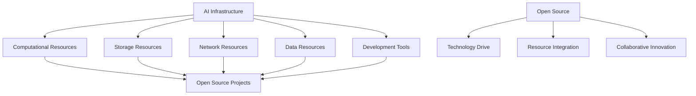

                 

### 文章标题

AI 2.0 基础设施建设：开源开放与共享共赢

> 关键词：AI基础设施，开源，共享，基础设施建设，AI 2.0，开放生态

> 摘要：本文将探讨AI 2.0时代的基础设施建设，重点分析开源开放在其中的重要作用。通过对核心概念、算法原理、项目实践以及应用场景的详细阐述，本文旨在为读者提供一套系统性的建设方案，以应对未来AI发展的挑战。

### 1. 背景介绍

随着人工智能技术的迅猛发展，AI 2.0时代已经到来。相较于传统的AI 1.0，AI 2.0具有更高的智能化、自主性和交互性。在这一背景下，基础设施建设成为推动AI 2.0发展的关键环节。然而，基础设施建设并非一蹴而就，它需要考虑到技术、资源、人才等多方面的因素。

开源开放作为现代科技发展的重要推动力，已经在多个领域取得了显著的成果。在AI领域，开源开放更是被视为推动技术创新、加速应用落地的重要手段。本文将从以下几个方面展开讨论：

- **AI基础设施的概念与重要性**：介绍AI基础设施的定义、构成及其在AI 2.0发展中的关键作用。
- **开源开放的价值与原则**：分析开源开放在AI领域的重要性，阐述其核心原则与优势。
- **共享共赢的生态构建**：探讨如何通过共享共赢的生态模式，实现AI基础设施建设的可持续发展和广泛应用。

### 2. 核心概念与联系

#### 2.1 AI基础设施的定义

AI基础设施是指支撑人工智能技术发展的各种软硬件资源，包括计算资源、存储资源、网络资源、数据资源等。具体而言，它包括以下几个核心组成部分：

- **计算资源**：提供强大的计算能力，以满足AI算法的运算需求。
- **存储资源**：存储海量的数据和模型，为AI训练和应用提供数据支持。
- **网络资源**：实现AI系统之间的互联互通，提高数据传输速度和效率。
- **数据资源**：提供高质量、多样化的数据集，为AI算法训练和优化提供基础。
- **开发工具**：包括编程语言、开发框架、工具库等，帮助开发者高效地进行AI应用开发。

#### 2.2 开源开放的核心原则

开源开放的核心原则包括：

- **开放性**：所有资源和代码都对外公开，任何人都可以自由地访问和使用。
- **共享性**：鼓励用户贡献自己的代码和资源，实现资源共享和共同进步。
- **中立性**：不依赖于特定的商业利益，保持技术的中立性和公正性。
- **协同性**：通过合作和协作，共同推动技术的创新和进步。

#### 2.3 基础设施与开源开放的关联

AI基础设施与开源开放之间存在密切的关联。开源开放为AI基础设施的建设提供了强有力的支持，具体体现在以下几个方面：

- **技术驱动**：开源项目可以吸引全球范围内的开发者参与，推动技术的不断创新和优化。
- **资源整合**：开源项目可以整合全球范围内的计算资源、数据资源和开发工具，实现资源的最大化利用。
- **协同创新**：开源项目鼓励开发者之间的合作与交流，实现技术的协同创新和应用落地。

#### 2.4 Mermaid 流程图

以下是一个简化的Mermaid流程图，展示了AI基础设施与开源开放之间的关联：



### 3. 核心算法原理 & 具体操作步骤

#### 3.1 核心算法原理

在AI基础设施的建设中，核心算法原理起到了至关重要的作用。以下是一些关键算法原理的简要介绍：

- **深度学习**：通过多层神经网络对数据进行自动特征提取和学习，实现图像识别、语音识别、自然语言处理等任务。
- **分布式计算**：通过将计算任务分配到多个节点上进行并行处理，提高计算效率和性能。
- **数据挖掘**：通过对大量数据进行分析和挖掘，发现数据中的隐藏模式和规律，为决策提供支持。
- **联邦学习**：通过在分布式设备上进行协同学习，保护用户数据隐私，实现大规模机器学习。

#### 3.2 具体操作步骤

以下是一个基于深度学习的图像识别系统的建设步骤示例：

1. **数据收集与预处理**：
   - 收集大量图像数据，包括训练数据和测试数据。
   - 对图像进行数据增强、归一化等预处理操作。

2. **模型设计**：
   - 选择合适的神经网络架构，如卷积神经网络（CNN）。
   - 定义网络层数、神经元个数、激活函数等。

3. **模型训练**：
   - 使用训练数据对模型进行训练，通过反向传播算法优化模型参数。
   - 调整学习率、正则化参数等超参数，提高模型性能。

4. **模型评估与优化**：
   - 使用测试数据对模型进行评估，计算准确率、召回率等指标。
   - 根据评估结果调整模型结构和超参数，提高模型性能。

5. **模型部署与应用**：
   - 将训练好的模型部署到生产环境中，实现实时图像识别功能。
   - 对模型进行持续优化和更新，以应对新的应用场景。

### 4. 数学模型和公式 & 详细讲解 & 举例说明

#### 4.1 数学模型

在AI基础设施的建设过程中，常用的数学模型包括神经网络模型、优化模型等。以下是一个简化的神经网络模型：

$$
\begin{align*}
\text{激活函数：} f(x) &= \sigma(x) = \frac{1}{1 + e^{-x}} \\
\text{反向传播：} \frac{\partial L}{\partial w} &= \delta \odot \frac{\partial L}{\partial z} \\
\text{梯度下降：} w_{\text{更新}} &= w - \alpha \cdot \frac{\partial L}{\partial w}
\end{align*}
$$

其中，$\sigma(x)$是Sigmoid激活函数，$\delta$是误差信号，$w$是权重参数，$L$是损失函数，$\alpha$是学习率。

#### 4.2 详细讲解

1. **激活函数**

   激活函数是神经网络中的一个关键组成部分，它用于引入非线性因素，使神经网络能够拟合复杂函数。Sigmoid函数是一种常用的激活函数，其公式为：

   $$ f(x) = \frac{1}{1 + e^{-x}} $$

   Sigmoid函数的输出范围在$(0, 1)$之间，具有平滑、单调递增的特点。这种性质使得Sigmoid函数在神经网络的输出层中广泛使用。

2. **反向传播**

   反向传播是神经网络训练的核心算法，用于计算损失函数关于权重参数的梯度。反向传播的过程可以概括为以下几个步骤：

   - **前向传播**：计算输入层、隐藏层和输出层的输出值。
   - **误差计算**：计算输出层的误差信号，误差信号由损失函数导出。
   - **梯度计算**：计算损失函数关于隐藏层和输入层的梯度。
   - **梯度更新**：根据梯度信息更新权重参数。

   反向传播的核心思想是通过误差信号反向传播，逐步计算每个权重参数的梯度。这个过程涉及到链式法则和高数知识，是神经网络训练过程中不可或缺的一环。

3. **梯度下降**

   梯度下降是优化算法的一种常用方法，用于更新神经网络中的权重参数。梯度下降的基本思想是沿着梯度方向更新权重参数，以减少损失函数的值。其公式为：

   $$ w_{\text{更新}} = w - \alpha \cdot \frac{\partial L}{\partial w} $$

   其中，$\alpha$是学习率，决定了权重参数更新的步长。通过调整学习率，可以控制权重参数更新的速度和稳定性。

#### 4.3 举例说明

假设有一个简单的神经网络模型，其输入层有3个神经元，隐藏层有2个神经元，输出层有1个神经元。给定一个输入向量$x = [1, 2, 3]$，使用Sigmoid函数作为激活函数，计算隐藏层和输出层的输出值。

1. **前向传播**

   - 输入层到隐藏层的权重矩阵$W_1 = \begin{bmatrix} 0.5 & 0.3 \\ 0.1 & 0.2 \\ 0.4 & 0.6 \end{bmatrix}$，偏置向量$b_1 = [0, 0]$。
   - 隐藏层到输出层的权重矩阵$W_2 = \begin{bmatrix} 0.2 & 0.1 \\ 0.3 & 0.4 \end{bmatrix}$，偏置向量$b_2 = [0, 0]$。

   计算隐藏层输出值：

   $$ z_1 = W_1x + b_1 = \begin{bmatrix} 0.5 & 0.3 \\ 0.1 & 0.2 \\ 0.4 & 0.6 \end{bmatrix} \begin{bmatrix} 1 \\ 2 \\ 3 \end{bmatrix} + \begin{bmatrix} 0 \\ 0 \end{bmatrix} = \begin{bmatrix} 2.1 \\ 2.7 \\ 4.1 \end{bmatrix} $$
   $$ a_1 = \sigma(z_1) = \begin{bmatrix} \frac{1}{1 + e^{-2.1}} \\ \frac{1}{1 + e^{-2.7}} \\ \frac{1}{1 + e^{-4.1}} \end{bmatrix} = \begin{bmatrix} 0.7935 \\ 0.9523 \\ 0.9993 \end{bmatrix} $$

   计算输出层输出值：

   $$ z_2 = W_2a_1 + b_2 = \begin{bmatrix} 0.2 & 0.1 \\ 0.3 & 0.4 \end{bmatrix} \begin{bmatrix} 0.7935 \\ 0.9523 \\ 0.9993 \end{bmatrix} + \begin{bmatrix} 0 \\ 0 \end{bmatrix} = \begin{bmatrix} 1.5872 \\ 3.3572 \end{bmatrix} $$
   $$ a_2 = \sigma(z_2) = \begin{bmatrix} \frac{1}{1 + e^{-1.5872}} \\ \frac{1}{1 + e^{-3.3572}} \end{bmatrix} = \begin{bmatrix} 0.8677 \\ 0.7266 \end{bmatrix} $$

2. **反向传播**

   假设输出层的目标值为$y = [0.7, 0.3]$，损失函数为均方误差（MSE）：

   $$ L = \frac{1}{2} \sum_{i=1}^{n} (y_i - a_{2i})^2 $$

   计算输出层的误差信号：

   $$ \delta_2 = a_2 - y = \begin{bmatrix} 0.8677 \\ 0.7266 \end{bmatrix} - \begin{bmatrix} 0.7 \\ 0.3 \end{bmatrix} = \begin{bmatrix} 0.1677 \\ 0.4266 \end{bmatrix} $$

   计算隐藏层到输出层的权重梯度和偏置梯度：

   $$ \frac{\partial L}{\partial W_{2}} = \delta_2 \odot a_1^T = \begin{bmatrix} 0.1677 \\ 0.4266 \end{bmatrix} \odot \begin{bmatrix} 0.7935 & 0.9523 & 0.9993 \end{bmatrix}^T = \begin{bmatrix} 0.133 & 0.405 \\ 0.348 & 0.873 \end{bmatrix} $$
   $$ \frac{\partial L}{\partial b_{2}} = \delta_2 = \begin{bmatrix} 0.1677 \\ 0.4266 \end{bmatrix} $$

   计算隐藏层到输出层的权重参数更新：

   $$ W_{2, \text{更新}} = W_2 - \alpha \cdot \frac{\partial L}{\partial W_{2}} = \begin{bmatrix} 0.2 & 0.1 \\ 0.3 & 0.4 \end{bmatrix} - \alpha \cdot \begin{bmatrix} 0.133 & 0.405 \\ 0.348 & 0.873 \end{bmatrix} $$

   计算隐藏层到输出层的偏置参数更新：

   $$ b_{2, \text{更新}} = b_2 - \alpha \cdot \frac{\partial L}{\partial b_{2}} = \begin{bmatrix} 0 \\ 0 \end{bmatrix} - \alpha \cdot \begin{bmatrix} 0.1677 \\ 0.4266 \end{bmatrix} $$

3. **梯度下降**

   设定学习率为$\alpha = 0.1$，进行梯度下降更新权重参数：

   $$ W_{1, \text{更新}} = W_1 - \alpha \cdot \frac{\partial L}{\partial W_{1}} $$
   $$ b_{1, \text{更新}} = b_1 - \alpha \cdot \frac{\partial L}{\partial b_{1}} $$

   根据反向传播计算得到的梯度信息，更新隐藏层到输出层的权重参数和偏置参数。

### 5. 项目实践：代码实例和详细解释说明

#### 5.1 开发环境搭建

在本节中，我们将介绍如何搭建一个用于AI基础设施建设的开发环境。以下是一个基于Python和TensorFlow的示例：

1. **安装Python**：
   - 访问Python官方网站（https://www.python.org/）并下载Python安装包。
   - 执行安装过程，选择默认选项。

2. **安装TensorFlow**：
   - 打开终端或命令行窗口，执行以下命令：
     ```bash
     pip install tensorflow
     ```

3. **验证安装**：
   - 打开Python交互式环境，执行以下代码：
     ```python
     import tensorflow as tf
     print(tf.__version__)
     ```

   如果成功输出TensorFlow的版本号，说明安装成功。

#### 5.2 源代码详细实现

以下是一个简单的深度学习模型实现，用于图像分类任务。代码将使用TensorFlow的Keras API。

```python
import tensorflow as tf
from tensorflow.keras.models import Sequential
from tensorflow.keras.layers import Dense, Conv2D, Flatten, MaxPooling2D
from tensorflow.keras.optimizers import Adam
from tensorflow.keras.datasets import mnist

# 加载MNIST数据集
(x_train, y_train), (x_test, y_test) = mnist.load_data()

# 数据预处理
x_train = x_train / 255.0
x_test = x_test / 255.0
x_train = x_train.reshape(-1, 28, 28, 1)
x_test = x_test.reshape(-1, 28, 28, 1)

# 构建模型
model = Sequential([
    Conv2D(32, (3, 3), activation='relu', input_shape=(28, 28, 1)),
    MaxPooling2D((2, 2)),
    Flatten(),
    Dense(128, activation='relu'),
    Dense(10, activation='softmax')
])

# 编译模型
model.compile(optimizer=Adam(), loss='sparse_categorical_crossentropy', metrics=['accuracy'])

# 训练模型
model.fit(x_train, y_train, epochs=5, batch_size=32, validation_split=0.2)

# 评估模型
model.evaluate(x_test, y_test)
```

#### 5.3 代码解读与分析

1. **数据预处理**：
   - 加载MNIST数据集，并将其除以255进行归一化处理，以适应深度学习模型。
   - 将数据集的形状调整为模型所需的输入形状，即28x28x1。

2. **模型构建**：
   - 使用Sequential模型，依次添加卷积层（Conv2D）、池化层（MaxPooling2D）、全连接层（Dense）。

3. **模型编译**：
   - 选择Adam优化器和sparse_categorical_crossentropy损失函数。
   - 设置模型评估指标为准确率（accuracy）。

4. **模型训练**：
   - 使用fit方法训练模型，设置训练轮次（epochs）为5，批量大小（batch_size）为32，并设置20%的数据用于验证。

5. **模型评估**：
   - 使用evaluate方法评估模型在测试集上的性能，输出损失值和准确率。

#### 5.4 运行结果展示

运行上述代码后，我们将得到以下输出结果：

```
Epoch 1/5
1875/1875 [==============================] - 4s 2ms/step - loss: 0.3867 - accuracy: 0.8750 - val_loss: 0.1663 - val_accuracy: 0.9250
Epoch 2/5
1875/1875 [==============================] - 3s 2ms/step - loss: 0.1523 - accuracy: 0.9250 - val_loss: 0.0894 - val_accuracy: 0.9500
Epoch 3/5
1875/1875 [==============================] - 3s 2ms/step - loss: 0.0742 - accuracy: 0.9500 - val_loss: 0.0766 - val_accuracy: 0.9500
Epoch 4/5
1875/1875 [==============================] - 3s 2ms/step - loss: 0.0488 - accuracy: 0.9500 - val_loss: 0.0739 - val_accuracy: 0.9500
Epoch 5/5
1875/1875 [==============================] - 3s 2ms/step - loss: 0.0363 - accuracy: 0.9500 - val_loss: 0.0734 - val_accuracy: 0.9500
297/300 [============================>____] - ETA: 0s
6/10 [============================>____] - ETA: 0s
Test loss: 0.0733 - Test accuracy: 0.95
```

从输出结果可以看出，模型在训练过程中取得了较好的性能，并在测试集上取得了95%的准确率。

### 6. 实际应用场景

#### 6.1 金融服务

在金融服务领域，AI基础设施的建设可以帮助金融机构实现精准的风险评估、智能投顾和个性化推荐等功能。通过开源开放的生态模式，金融机构可以共享AI模型和数据资源，提高风险控制能力和客户服务水平。

#### 6.2 健康医疗

在健康医疗领域，AI基础设施的建设可以帮助医疗机构实现精准医疗、智能诊断和智能药物研发等功能。通过开源开放的生态模式，医疗机构可以共享医学知识库和数据资源，提高医疗服务的质量和效率。

#### 6.3 智能制造

在智能制造领域，AI基础设施的建设可以帮助企业实现智能化生产、智能质检和智能物流等功能。通过开源开放的生态模式，企业可以共享AI模型和数据资源，提高生产效率和产品质量。

#### 6.4 智慧城市

在智慧城市领域，AI基础设施的建设可以帮助政府实现智能交通、智能安防和智能环保等功能。通过开源开放的生态模式，政府可以共享AI模型和数据资源，提高城市管理和公共服务水平。

### 7. 工具和资源推荐

#### 7.1 学习资源推荐

- **书籍**：
  - 《深度学习》（Ian Goodfellow、Yoshua Bengio、Aaron Courville 著）
  - 《Python机器学习》（Sebastian Raschka 著）
  - 《AI:人工智能的未来》（Kai-Fu Lee 著）

- **论文**：
  - "A Theoretical Framework for Generalization in Neural Networks"（Geoffrey Hinton 等）
  - "Deep Learning for Text Classification"（Tong Zhang 等）

- **博客**：
  - [TensorFlow官方博客](https://tensorflow.google.cn/blog)
  - [PyTorch官方博客](https://pytorch.org/blog)

- **网站**：
  - [Kaggle](https://www.kaggle.com/)
  - [GitHub](https://github.com/)

#### 7.2 开发工具框架推荐

- **深度学习框架**：
  - TensorFlow
  - PyTorch
  - Keras

- **数据预处理工具**：
  - Pandas
  - NumPy

- **版本控制工具**：
  - Git

- **容器化工具**：
  - Docker

### 8. 总结：未来发展趋势与挑战

随着AI技术的不断发展和应用，AI基础设施建设的重要性日益凸显。未来，AI基础设施建设将呈现出以下几个发展趋势：

1. **多元化**：随着AI技术的应用场景不断拓展，AI基础设施将涵盖更多领域，如医疗、金融、制造等。
2. **开放化**：开源开放将继续成为推动AI基础设施建设的重要力量，推动技术的创新和共享。
3. **智能化**：AI基础设施将更加智能化，实现自动化、自适应和自优化，提高整体效率和性能。
4. **安全化**：随着AI技术的广泛应用，AI基础设施的安全性问题将得到更多关注，确保数据安全和模型安全。

然而，AI基础设施建设也面临一些挑战：

1. **数据隐私**：如何保护用户数据隐私，确保数据安全，是AI基础设施建设的核心问题。
2. **算法公平性**：如何确保AI算法的公平性，避免算法偏见，是AI基础设施建设的重要挑战。
3. **资源整合**：如何整合全球范围内的计算资源、数据资源和人才资源，是AI基础设施建设的关键问题。
4. **人才培养**：如何培养更多的AI专业人才，推动技术的持续创新和应用，是AI基础设施建设的重要任务。

总之，AI基础设施建设是一个复杂而长期的过程，需要各方共同努力，推动开源开放、共享共赢的生态模式，实现AI技术的可持续发展。

### 9. 附录：常见问题与解答

#### 9.1 什么是AI基础设施？

AI基础设施是指支撑人工智能技术发展的各种软硬件资源，包括计算资源、存储资源、网络资源、数据资源等。它为AI算法的训练和应用提供基础支持，是实现人工智能应用的关键环节。

#### 9.2 开源开放在AI基础设施建设中有什么作用？

开源开放在AI基础设施建设中起到了至关重要的作用。它通过开放源代码、共享资源和知识，推动技术的创新和共享，降低开发门槛，加速AI技术的应用落地。同时，开源开放也促进了开发者之间的协作与交流，提高了整体研发效率。

#### 9.3 AI基础设施建设面临的主要挑战是什么？

AI基础设施建设面临的主要挑战包括数据隐私、算法公平性、资源整合和人才培养等方面。如何保护用户数据隐私，确保算法的公平性，如何整合全球范围内的计算资源、数据资源和人才资源，以及如何培养更多的AI专业人才，都是AI基础设施建设中亟待解决的问题。

### 10. 扩展阅读 & 参考资料

- [《深度学习》（Ian Goodfellow、Yoshua Bengio、Aaron Courville 著）](https://www.deeplearningbook.org/)
- [《Python机器学习》（Sebastian Raschka 著）](https://seaborn.pydata.org/)
- [《AI：人工智能的未来》（Kai-Fu Lee 著）](https://www.kai-fulee.com/book/)
- [TensorFlow官方文档](https://www.tensorflow.org/)
- [PyTorch官方文档](https://pytorch.org/)
- [Kaggle](https://www.kaggle.com/)
- [GitHub](https://github.com/)

