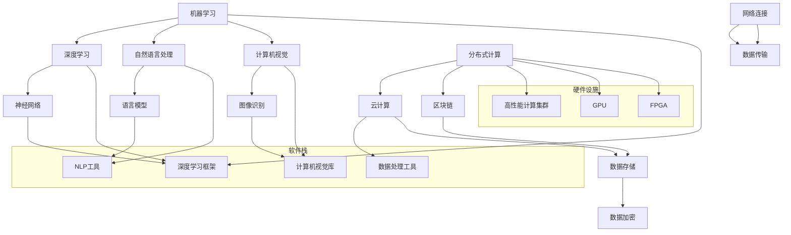

                 

### 背景介绍

#### AI 2.0 基础设施建设的概念

AI 2.0，即第二代人工智能，是对传统人工智能（AI 1.0）的继承和升华。与AI 1.0主要依赖于规则和符号逻辑不同，AI 2.0强调机器学习、深度学习以及数据驱动的智能化。AI 2.0的基础设施建设，指的是构建支撑这一新型人工智能发展所需的硬件、软件和网络等基础设施。

基础设施建设的目标在于提高计算能力、数据存储和处理能力，以及提升人工智能系统的可扩展性和安全性。这包括以下几个方面：

1. **硬件设施**：如高性能计算集群、图形处理单元（GPU）、现场可编程门阵列（FPGA）等。
2. **数据存储**：分布式存储系统、云存储服务等，用于存储和检索大规模数据集。
3. **数据处理**：高效的数据清洗、转换和分析工具。
4. **网络**：高带宽、低延迟的网络连接，确保数据在各个环节间的快速流通。
5. **软件栈**：包括深度学习框架、自然语言处理工具、计算机视觉库等。

#### 社会影响

AI 2.0基础设施建设不仅对技术领域产生深远影响，也对整个社会产生重大影响。首先，它推动了各行业的数字化转型，提升了生产效率和服务质量。例如，在医疗领域，AI 2.0可以帮助医生进行精确诊断和个性化治疗；在金融领域，AI 2.0可以实现精准的风险评估和智能投顾。

其次，AI 2.0基础设施建设对社会伦理提出了挑战。人工智能的决策可能基于大量数据，但如何确保数据的公平性和透明性是一个重要议题。此外，人工智能的普及可能导致部分工作岗位的流失，从而引发就业压力和社会不稳定。

#### 伦理思考

在AI 2.0基础设施建设过程中，伦理问题不容忽视。首先，隐私保护成为关键挑战。人工智能系统往往需要处理大量个人数据，如何确保这些数据的安全和隐私，防止数据泄露和滥用，是一个亟待解决的问题。

其次，人工智能系统的决策过程可能存在偏见。数据集中的偏见可能导致人工智能系统在特定群体中的表现不佳，甚至加剧社会不平等。因此，在AI 2.0基础设施建设过程中，如何消除偏见，确保系统的公平性和可解释性，是一个重要的伦理议题。

最后，人工智能的普及也可能影响人类价值观和社会结构。例如，自动化和智能化的普及可能导致部分人类工作的消失，引发社会对工作的重新定义和对人类价值的反思。

### AI 2.0 基础设施建设的关键要素

#### 硬件设施

硬件设施是AI 2.0基础设施建设的核心。高性能计算集群可以提供强大的计算能力，支持大规模机器学习任务的执行。GPU和FPGA等硬件加速器，可以显著提高神经网络训练和推理的效率。此外，分布式存储系统和云存储服务，可以提供海量数据的存储和快速检索能力。

#### 数据存储

数据存储是AI 2.0基础设施建设的另一个关键要素。分布式存储系统可以提高数据的可靠性和可用性，同时提供高效的存储空间。云存储服务则可以提供灵活的存储方案，支持大规模数据存储和实时访问。此外，数据加密和访问控制机制，可以确保数据的隐私和安全。

#### 数据处理

数据处理是AI 2.0基础设施建设的核心环节。高效的数据清洗、转换和分析工具，可以确保数据的质量和一致性，为机器学习模型提供可靠的数据输入。此外，分布式数据处理框架，如Apache Hadoop和Spark，可以处理大规模数据集，提高数据处理效率。

#### 网络

网络是AI 2.0基础设施建设的通信基础。高带宽、低延迟的网络连接，可以确保数据在各个环节间的快速流通，支持实时数据处理和交互。此外，网络协议的优化和安全性，可以提升数据传输的效率和安全性。

#### 软件栈

软件栈是AI 2.0基础设施建设的软件核心。深度学习框架，如TensorFlow和PyTorch，提供了丰富的神经网络构建和训练工具。自然语言处理工具，如NLTK和spaCy，支持文本数据的处理和分析。计算机视觉库，如OpenCV和TensorFlow Object Detection API，提供了图像处理和分析的工具。

### 总结

AI 2.0基础设施建设是一项复杂而庞大的工程，涉及到硬件、数据、网络和软件等多个方面。它不仅对社会技术进步产生深远影响，也对社会伦理提出新的挑战。在接下来的部分，我们将深入探讨AI 2.0基础设施建设的具体技术原理、实现步骤和应用场景，帮助读者全面了解这一领域的最新进展。

---

# AI 2.0 基础设施建设：社会影响与伦理思考

> 关键词：人工智能，基础设施，社会影响，伦理思考

## 摘要

本文旨在探讨AI 2.0基础设施建设的重要性和其对社会和伦理的深远影响。AI 2.0，作为新一代人工智能，依赖于强大的硬件设施、高效的数据存储和处理能力、稳定的网络连接以及丰富的软件工具。这些基础设施的建设不仅推动了各行业的数字化转型，也引发了隐私保护、社会不平等和价值观重构等伦理问题。本文将详细分析AI 2.0基础设施建设的核心要素，讨论其在社会中的应用，并探讨相关的伦理挑战和未来发展方向。

## 1. 背景介绍

### AI 2.0 基础设施建设的概念

AI 2.0，即第二代人工智能，是对传统人工智能（AI 1.0）的继承和升华。AI 1.0主要依赖于规则和符号逻辑，而AI 2.0则强调机器学习、深度学习以及数据驱动的智能化。AI 2.0的基础设施建设，指的是构建支撑这一新型人工智能发展所需的硬件、软件和网络等基础设施。

基础设施建设的目标在于提高计算能力、数据存储和处理能力，以及提升人工智能系统的可扩展性和安全性。这包括以下几个方面：

1. **硬件设施**：如高性能计算集群、图形处理单元（GPU）、现场可编程门阵列（FPGA）等。
2. **数据存储**：分布式存储系统、云存储服务等，用于存储和检索大规模数据集。
3. **数据处理**：高效的数据清洗、转换和分析工具。
4. **网络**：高带宽、低延迟的网络连接，确保数据在各个环节间的快速流通。
5. **软件栈**：包括深度学习框架、自然语言处理工具、计算机视觉库等。

### 社会影响

AI 2.0基础设施建设不仅对技术领域产生深远影响，也对整个社会产生重大影响。首先，它推动了各行业的数字化转型，提升了生产效率和服务质量。例如，在医疗领域，AI 2.0可以帮助医生进行精确诊断和个性化治疗；在金融领域，AI 2.0可以实现精准的风险评估和智能投顾。

其次，AI 2.0基础设施建设对社会伦理提出了挑战。人工智能的决策可能基于大量数据，但如何确保数据的公平性和透明性是一个重要议题。此外，人工智能的普及可能导致部分工作岗位的流失，从而引发就业压力和社会不稳定。

### 伦理思考

在AI 2.0基础设施建设过程中，伦理问题不容忽视。首先，隐私保护成为关键挑战。人工智能系统往往需要处理大量个人数据，如何确保这些数据的安全和隐私，防止数据泄露和滥用，是一个亟待解决的问题。

其次，人工智能系统的决策过程可能存在偏见。数据集中的偏见可能导致人工智能系统在特定群体中的表现不佳，甚至加剧社会不平等。因此，在AI 2.0基础设施建设过程中，如何消除偏见，确保系统的公平性和可解释性，是一个重要的伦理议题。

最后，人工智能的普及也可能影响人类价值观和社会结构。例如，自动化和智能化的普及可能导致部分人类工作的消失，引发社会对工作的重新定义和对人类价值的反思。

## 2. 核心概念与联系

### 核心概念

在AI 2.0基础设施建设中，以下几个核心概念至关重要：

1. **机器学习（Machine Learning）**：机器学习是一种通过数据学习模式的计算机算法。它包括监督学习、无监督学习和强化学习等不同类型。
2. **深度学习（Deep Learning）**：深度学习是机器学习的一个子领域，它利用多层神经网络进行复杂的数据分析。
3. **自然语言处理（Natural Language Processing, NLP）**：NLP旨在使计算机理解和解释人类语言。
4. **计算机视觉（Computer Vision）**：计算机视觉使计算机能够理解和解析视觉信息。
5. **分布式计算（Distributed Computing）**：分布式计算通过多个计算节点协同工作，提高数据处理和存储能力。
6. **云计算（Cloud Computing）**：云计算提供可扩展的计算和存储资源，支持大规模数据处理和存储。
7. **区块链（Blockchain）**：区块链是一种分布式数据库技术，用于存储和验证数据，提高数据的安全性和透明性。

### 联系与架构

为了更好地理解AI 2.0基础设施建设，我们使用Mermaid流程图来展示这些核心概念之间的联系和架构。

该流程图展示了AI 2.0基础设施建设中的核心概念和它们之间的联系。硬件设施提供了计算和存储资源，软件栈提供了实现机器学习、深度学习、自然语言处理和计算机视觉的工具。分布式计算、云计算和区块链则用于提升数据处理和存储的安全性和效率。网络连接确保了数据的快速流通和交互。

### 关键角色

在AI 2.0基础设施建设中，多个关键角色共同协作：

1. **数据科学家**：负责设计、实现和优化机器学习模型。
2. **软件工程师**：负责开发和维护AI系统的软件框架和工具。
3. **系统架构师**：负责设计和构建AI系统的整体架构，确保系统的可扩展性和安全性。
4. **网络安全专家**：负责确保AI系统的数据安全和网络安全性。
5. **伦理学家**：负责评估AI系统的社会和伦理影响，提供伦理指导。

### 核心概念与联系的详细解释

1. **机器学习**：机器学习是一种通过数据学习模式的计算机算法。它包括监督学习、无监督学习和强化学习等不同类型。监督学习使用标记数据进行模型训练，无监督学习不使用标记数据，而是通过发现数据中的模式进行学习，强化学习则通过奖励机制来改善决策。

2. **深度学习**：深度学习是机器学习的一个子领域，它利用多层神经网络进行复杂的数据分析。深度学习在图像识别、语音识别和自然语言处理等领域取得了显著成果。

3. **自然语言处理**：自然语言处理旨在使计算机理解和解释人类语言。NLP技术包括词向量表示、语言模型、命名实体识别和机器翻译等。

4. **计算机视觉**：计算机视觉使计算机能够理解和解析视觉信息。计算机视觉技术包括图像识别、目标检测、图像分割和姿态估计等。

5. **分布式计算**：分布式计算通过多个计算节点协同工作，提高数据处理和存储能力。分布式计算可以显著降低计算成本，提高系统的可扩展性和容错性。

6. **云计算**：云计算提供可扩展的计算和存储资源，支持大规模数据处理和存储。云计算使组织能够快速部署和管理AI系统，同时降低IT成本。

7. **区块链**：区块链是一种分布式数据库技术，用于存储和验证数据，提高数据的安全性和透明性。区块链技术可以确保数据的不可篡改性和去中心化，适用于需要高度安全性和透明性的应用场景。

### 关键角色的工作职责

1. **数据科学家**：数据科学家负责设计、实现和优化机器学习模型。他们需要从数据中提取有价值的信息，并使用这些信息来构建和训练AI模型。数据科学家还需要进行模型评估和优化，以确保模型在实际应用中的性能。

2. **软件工程师**：软件工程师负责开发和维护AI系统的软件框架和工具。他们需要编写高质量的代码，确保AI系统的稳定性和可扩展性。软件工程师还需要进行系统集成和测试，确保AI系统能够在不同的环境中正常运行。

3. **系统架构师**：系统架构师负责设计和构建AI系统的整体架构，确保系统的可扩展性和安全性。他们需要分析系统的需求，设计合理的系统架构，并确保系统能够满足性能、可维护性和安全性等方面的要求。

4. **网络安全专家**：网络安全专家负责确保AI系统的数据安全和网络安全性。他们需要识别潜在的安全威胁，并采取相应的措施来保护系统和数据。网络安全专家还需要进行安全测试和评估，确保系统的安全性和合规性。

5. **伦理学家**：伦理学家负责评估AI系统的社会和伦理影响，提供伦理指导。他们需要分析AI系统可能带来的社会影响，并制定相应的伦理准则和规范，确保AI系统的发展符合社会价值观和伦理标准。

### 核心概念与联系的意义

核心概念与联系在AI 2.0基础设施建设中具有重要意义。首先，这些概念和联系为AI系统的设计和实现提供了理论基础和工具支持。通过理解这些概念，开发人员可以更好地设计AI系统，提高系统的性能和可扩展性。

其次，核心概念与联系有助于理解AI系统的整体架构和运作原理。通过了解不同概念之间的联系，可以更好地协调各个部分的协同工作，提高系统的整体效率。

最后，核心概念与联系为AI系统的应用提供了广泛的可能性。通过深入理解这些概念，可以探索新的应用场景，推动AI技术的创新和发展。

### 总结

核心概念与联系是AI 2.0基础设施建设的基础。通过理解这些概念和它们之间的联系，可以更好地设计、实现和应用AI系统。在接下来的章节中，我们将进一步探讨AI 2.0基础设施建设的具体技术原理、实现步骤和应用场景，帮助读者全面了解这一领域的最新进展。

## 3. 核心算法原理 & 具体操作步骤

在AI 2.0基础设施建设中，核心算法原理是确保系统高效运行的关键。以下我们将详细介绍几种关键算法的原理，包括机器学习算法、深度学习算法以及自然语言处理（NLP）算法，并探讨其具体操作步骤。

### 3.1 机器学习算法

机器学习算法是AI 2.0基础设施建设的基石。机器学习算法通过从数据中学习规律，使计算机能够做出预测或决策。以下是几种常见的机器学习算法及其基本原理：

1. **线性回归（Linear Regression）**：
   - **原理**：线性回归是一种通过拟合一条直线来预测连续值的算法。它通过最小化预测值与实际值之间的误差平方和来优化模型参数。
   - **操作步骤**：
     1. 准备数据集，并进行特征工程，提取输入特征和目标变量。
     2. 使用最小二乘法（Least Squares Method）计算最佳拟合直线的参数。
     3. 训练模型，通过多次迭代优化模型参数。
     4. 评估模型性能，使用均方误差（Mean Squared Error, MSE）等指标进行评估。

2. **逻辑回归（Logistic Regression）**：
   - **原理**：逻辑回归是一种用于预测二分类结果的算法。它通过拟合逻辑函数（Logistic Function）来计算概率。
   - **操作步骤**：
     1. 准备数据集，并进行特征工程。
     2. 使用最小化对数似然函数的方法（Maximum Likelihood Estimation, MLE）计算模型参数。
     3. 训练模型，通过迭代优化参数。
     4. 评估模型性能，使用准确率（Accuracy）、召回率（Recall）、精确率（Precision）等指标进行评估。

3. **决策树（Decision Tree）**：
   - **原理**：决策树通过一系列规则来对数据进行分类或回归。每个节点代表一个特征，每个分支代表特征的取值。
   - **操作步骤**：
     1. 准备数据集，并进行特征工程。
     2. 选择最优分割标准，如信息增益（Information Gain）或基尼不纯度（Gini Impurity）。
     3. 递归地构建决策树，直到满足停止条件（如最大树深度或最小叶节点大小）。
     4. 评估模型性能，使用交叉验证（Cross-Validation）等方法进行评估。

### 3.2 深度学习算法

深度学习算法在AI 2.0基础设施中扮演着重要角色，尤其在图像识别、自然语言处理等领域表现出色。以下是几种关键深度学习算法的原理和操作步骤：

1. **卷积神经网络（Convolutional Neural Networks, CNN）**：
   - **原理**：CNN通过卷积层、池化层和全连接层来提取图像的特征。
   - **操作步骤**：
     1. 数据预处理，将图像转换为固定大小并归一化。
     2. 构建CNN模型，定义卷积层、池化层和全连接层。
     3. 使用反向传播算法（Backpropagation）训练模型。
     4. 评估模型性能，使用准确率、交

