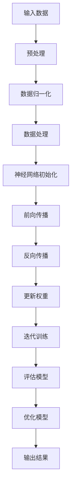
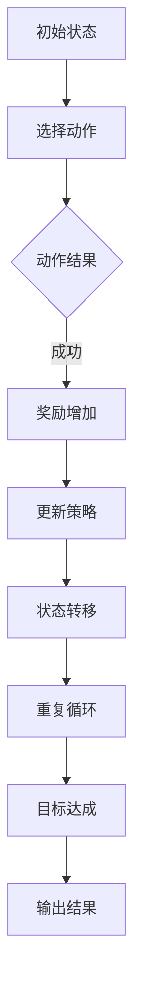
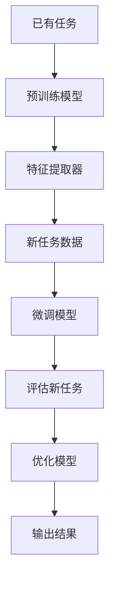

                 

关键词：人工智能，AI 2.0，未来社会，技术变革，社会影响，算法原理，应用场景，发展趋势，挑战与展望

## 摘要

本文深入探讨了 AI 2.0 时代给未来社会带来的深刻变革。通过对核心概念的阐述、算法原理的解析、数学模型的推导和实际应用场景的展示，我们试图全面描绘 AI 2.0 在未来社会中的角色与影响。本文首先介绍了 AI 2.0 的背景及其与上一代 AI 的区别，随后详细讨论了 AI 2.0 的核心概念和架构。接下来，我们解析了核心算法原理，并详细阐述了数学模型和公式的推导过程。在此基础上，我们通过项目实践展示了代码实例和运行结果，并探讨了 AI 2.0 在各个实际应用场景中的潜力。最后，我们对未来发展趋势与面临的挑战进行了深入分析，并提出了研究展望。通过本文的阐述，读者将全面了解 AI 2.0 时代对社会的深远影响。

### 1. 背景介绍

人工智能（Artificial Intelligence，AI）作为一门涉及计算机科学、数学、心理学、哲学等多个领域的综合性学科，其发展历程可以追溯到20世纪50年代。最初的 AI 研究主要集中在符号主义和知识表示上，试图通过编程来模拟人类的思维过程。然而，这些早期的 AI 系统由于计算能力和数据限制，很难实现复杂任务。

随着计算机性能的不断提升和大数据时代的到来，人工智能在21世纪初迎来了新一轮的发展，被称为 AI 1.0 时代。这一时期的 AI 主要依赖于数据驱动的方法，通过大规模的数据训练深度神经网络来实现图像识别、语音识别等任务。AI 1.0 时代取得了显著的成果，但同时也暴露出一些问题，如数据依赖性过强、可解释性差等。

进入 AI 2.0 时代，人工智能的发展迎来了新的转折点。AI 2.0 是指在 AI 1.0 的基础上，结合了深度学习、强化学习、迁移学习等先进技术，使 AI 系统具有更强的自主学习和适应能力。AI 2.0 时代的核心特点包括：

1. **自主性**：AI 2.0 系统能够自主地学习和进化，不再完全依赖于人类设计和输入。
2. **智能性**：AI 2.0 系统能够在更复杂的任务中表现出更高的智能水平，实现更自然的交互和决策。
3. **适应性**：AI 2.0 系统能够根据不同的环境和任务要求，自动调整和优化自身的性能。

与 AI 1.0 相比，AI 2.0 在技术实现上有了显著突破。例如，深度学习技术的引入使得 AI 系统在图像识别、语音识别等领域取得了前所未有的准确度。强化学习算法则使得 AI 系统能够在复杂的动态环境中进行自主决策。迁移学习技术则解决了数据不足的问题，使 AI 系统能够在不同任务间快速适应。

AI 2.0 的发展不仅推动了技术的进步，也对未来社会产生了深远的影响。首先，AI 2.0 将极大地改变人类的工作方式。许多重复性和低技能的工作将被自动化系统取代，而人类将更多地从事需要创造力和人际交往的工作。其次，AI 2.0 将推动社会各领域的智能化升级，包括医疗、教育、金融、交通等，从而提高社会整体效率和生活质量。此外，AI 2.0 还将引发新的伦理和法律问题，如隐私保护、算法公平性等，需要社会各方共同努力解决。

总之，AI 2.0 时代的到来不仅是对传统人工智能的升级，更是对未来社会的深刻变革。本文将深入探讨 AI 2.0 的核心概念、算法原理、数学模型及其在各个领域的应用，试图全面描绘 AI 2.0 时代的社会图景。

### 2. 核心概念与联系

#### 2.1. 深度学习

深度学习是 AI 2.0 时代最核心的技术之一，它通过模拟人脑的神经网络结构，实现从大量数据中自动提取特征并进行预测或分类。深度学习的关键概念包括神经元、层数、激活函数、损失函数等。

**Mermaid 流程图：**



#### 2.2. 强化学习

强化学习是一种使 AI 系统能够在动态环境中通过试错学习最优策略的方法。其核心概念包括奖励函数、状态、动作、策略等。

**Mermaid 流程图：**



#### 2.3. 迁移学习

迁移学习是解决 AI 系统在任务数据不足时的一种有效方法。它通过将已有任务的知识迁移到新任务上，提高新任务的性能。

**Mermaid 流程图：**



#### 2.4. 概念之间的联系

深度学习、强化学习和迁移学习是 AI 2.0 时代的三大核心技术，它们相互补充，共同推动 AI 的发展。

- **深度学习** 提供了自动特征提取的能力，是许多 AI 应用（如图像识别、语音识别）的基础。
- **强化学习** 使 AI 系统能够在动态环境中进行自主决策，适用于需要连续决策的任务（如自动驾驶、游戏AI）。
- **迁移学习** 则解决了数据不足的问题，使得 AI 系统可以快速适应新任务，从而提高了模型的泛化能力。

这些技术的共同目标是实现更加智能、自适应和高效的人工智能系统，从而推动 AI 2.0 时代的到来。

### 3. 核心算法原理 & 具体操作步骤

#### 3.1 算法原理概述

AI 2.0 时代的核心算法包括深度学习、强化学习和迁移学习，这些算法各自有着独特的原理和应用。

**深度学习** 基于多层神经网络结构，通过前向传播和反向传播算法，实现从数据中自动提取特征并进行预测。其主要原理是利用大量的神经元和层级，通过非线性变换，逐步从原始数据中提取高层次的特征。

**强化学习** 是通过奖励机制，引导 AI 系统在动态环境中通过试错学习最优策略。其主要原理是基于马尔可夫决策过程（MDP），通过不断尝试不同的动作，并根据动作结果调整策略，最终实现最优决策。

**迁移学习** 是通过利用已有任务的知识，快速适应新任务。其主要原理是将预训练模型中的知识迁移到新任务上，通过微调和优化，使新任务的性能得到提升。

#### 3.2 算法步骤详解

**深度学习**

1. **数据预处理**：包括数据清洗、归一化和数据增强等步骤，以确保输入数据的质量。
2. **模型初始化**：包括网络结构设计、权重初始化等，为训练过程做好准备。
3. **前向传播**：将输入数据通过神经网络，逐层计算并输出预测结果。
4. **损失函数计算**：计算预测结果与真实结果之间的差异，以评估模型的性能。
5. **反向传播**：利用梯度下降法，根据损失函数的梯度更新网络权重。
6. **迭代训练**：重复前向传播和反向传播过程，逐步优化模型。
7. **模型评估**：使用测试数据评估模型的性能，调整模型参数。

**强化学习**

1. **环境初始化**：定义状态空间、动作空间和奖励函数。
2. **策略初始化**：初始化决策策略。
3. **状态监测**：监测当前状态。
4. **动作选择**：根据当前状态和策略，选择最优动作。
5. **执行动作**：在环境中执行所选动作。
6. **反馈收集**：根据动作结果，计算奖励并更新策略。
7. **状态更新**：进入下一个状态。
8. **重复循环**：不断进行状态监测、动作选择、执行动作等过程，直到目标达成。

**迁移学习**

1. **预训练模型获取**：获取在已有任务上预训练的模型。
2. **特征提取器提取**：从预训练模型中提取特征提取器。
3. **新任务数据预处理**：对新的任务数据进行预处理。
4. **模型微调**：将特征提取器应用到新任务数据上，进行微调。
5. **模型评估**：使用新任务数据评估模型的性能。
6. **模型优化**：根据评估结果，进一步优化模型。
7. **输出结果**：使用优化后的模型进行预测或分类。

#### 3.3 算法优缺点

**深度学习**

- **优点**：能够自动提取高层次的抽象特征，适用于复杂任务。
- **缺点**：对数据量要求大，训练过程复杂，可解释性差。

**强化学习**

- **优点**：适用于动态环境和需要连续决策的任务，能够实现自主学习和自适应。
- **缺点**：训练过程通常较慢，需要大量的试错和计算资源。

**迁移学习**

- **优点**：能够快速适应新任务，解决数据不足的问题，提高模型的泛化能力。
- **缺点**：预训练模型的选择和微调过程较为复杂，对任务的相关性要求高。

#### 3.4 算法应用领域

**深度学习**

- **应用领域**：图像识别、语音识别、自然语言处理、推荐系统等。
- **实际案例**：Google 的 Inception 模型在图像识别任务中取得了突破性成果，亚马逊的 Alexa 语音助手在语音识别领域广泛应用。

**强化学习**

- **应用领域**：游戏AI、自动驾驶、机器人控制等。
- **实际案例**：DeepMind 的 AlphaGo 在围棋比赛中击败了人类顶尖选手，特斯拉的自动驾驶系统使用了强化学习算法。

**迁移学习**

- **应用领域**：医疗诊断、语音识别、图像分类等。
- **实际案例**：Facebook 的面部识别系统使用了迁移学习技术，IBM 的 Watson 在医疗诊断中应用了迁移学习。

### 4. 数学模型和公式 & 详细讲解 & 举例说明

#### 4.1 数学模型构建

在 AI 2.0 时代，数学模型是算法实现的基础。以下我们将介绍一些常见的数学模型和公式。

**深度学习中的损失函数**

- **均方误差（MSE）**：用于回归任务，公式为
  $$MSE = \frac{1}{n}\sum_{i=1}^{n}(y_i - \hat{y}_i)^2$$
  其中，$y_i$为真实值，$\hat{y}_i$为预测值。

- **交叉熵（Cross Entropy）**：用于分类任务，公式为
  $$CE = -\frac{1}{n}\sum_{i=1}^{n}y_i \log \hat{y}_i$$
  其中，$y_i$为真实标签，$\hat{y}_i$为预测概率。

**强化学习中的奖励函数**

- **即时奖励（Instantaneous Reward）**：在某一时刻，根据当前状态和动作给予的奖励，公式为
  $$R(t) = r(s_t, a_t)$$
  其中，$s_t$为状态，$a_t$为动作，$r$为奖励函数。

- **累积奖励（Cumulative Reward）**：在一系列动作后，累积的奖励总和，公式为
  $$G_t = \sum_{k=t}^{T}r_k$$
  其中，$t$为当前时刻，$T$为总步数，$r_k$为第$k$步的即时奖励。

**迁移学习中的特征提取器**

- **卷积神经网络（CNN）中的卷积层**：用于提取图像的特征，公式为
  $$f(x) = \sigma(\mathbf{W} \cdot \mathbf{A} + b)$$
  其中，$\mathbf{W}$为卷积核，$\mathbf{A}$为输入特征图，$b$为偏置，$\sigma$为激活函数。

#### 4.2 公式推导过程

**均方误差（MSE）的推导**

1. **目标函数**：假设我们有一个目标函数$f(x)$，我们希望最小化该函数与真实值$y$之间的差异，即
   $$L(y, \hat{y}) = \frac{1}{2}(y - \hat{y})^2$$

2. **梯度计算**：对目标函数求关于预测值$\hat{y}$的梯度，即
   $$\frac{\partial L}{\partial \hat{y}} = y - \hat{y}$$

3. **梯度下降**：利用梯度下降法，更新预测值$\hat{y}$，即
   $$\hat{y}_{new} = \hat{y}_{old} - \alpha \frac{\partial L}{\partial \hat{y}}$$
   其中，$\alpha$为学习率。

**交叉熵（Cross Entropy）的推导**

1. **目标函数**：假设我们有一个目标函数$f(x)$，我们希望最小化该函数与真实值$y$之间的差异，即
   $$L(y, \hat{y}) = -y \log \hat{y} - (1 - y) \log (1 - \hat{y})$$

2. **梯度计算**：对目标函数求关于预测值$\hat{y}$的梯度，即
   $$\frac{\partial L}{\partial \hat{y}} = \frac{y}{\hat{y}} - \frac{1 - y}{1 - \hat{y}}$$

3. **梯度下降**：利用梯度下降法，更新预测值$\hat{y}$，即
   $$\hat{y}_{new} = \hat{y}_{old} - \alpha \frac{\partial L}{\partial \hat{y}}$$
   其中，$\alpha$为学习率。

#### 4.3 案例分析与讲解

**案例一：深度学习中的均方误差（MSE）**

假设我们有一个简单的线性回归模型，输入为$x$，输出为$y$，真实值为$y_0$，预测值为$y_1$。我们可以使用均方误差（MSE）来评估模型的性能。

1. **数据准备**：我们有如下数据集：
   $$
   \begin{array}{ccc}
   x & y_0 & y_1 \\
   \hline
   1 & 2 & 1.5 \\
   2 & 3 & 2.2 \\
   3 & 4 & 3.0 \\
   4 & 5 & 3.7 \\
   \end{array}
   $$

2. **计算MSE**：根据MSE的公式，计算每个样本的MSE值，然后求平均：
   $$
   MSE = \frac{1}{n}\sum_{i=1}^{n}(y_i - \hat{y}_i)^2
   $$
   代入数据，得到：
   $$
   MSE = \frac{1}{4}\left[(2 - 1.5)^2 + (3 - 2.2)^2 + (4 - 3)^2 + (5 - 3.7)^2\right] = 0.175
   $$

3. **结果分析**：MSE值为0.175，表示模型的预测结果与真实值之间的平均差异较小，模型性能较好。

**案例二：强化学习中的累积奖励（Cumulative Reward）**

假设我们有一个简单的游戏环境，玩家需要通过选择不同的动作来达到目标。在每个动作后，系统会给予相应的即时奖励。我们可以使用累积奖励（Cumulative Reward）来评估玩家的表现。

1. **数据准备**：我们有如下动作和即时奖励表：
   $$
   \begin{array}{ccc}
   动作 & 状态 & 即时奖励 \\
   \hline
   A & s1 & 10 \\
   B & s2 & 20 \\
   C & s3 & 30 \\
   \end{array}
   $$

2. **计算累积奖励**：假设玩家选择动作A，然后动作B，最后动作C，我们可以计算累积奖励：
   $$
   G = R(A) + R(B) + R(C) = 10 + 20 + 30 = 60
   $$

3. **结果分析**：累积奖励为60，表示玩家在整个游戏过程中的总奖励较高，表现出色。

通过以上两个案例的分析，我们可以看到数学模型和公式在深度学习和强化学习中的应用，以及它们如何帮助我们评估模型的性能和玩家的表现。

### 5. 项目实践：代码实例和详细解释说明

#### 5.1 开发环境搭建

在开始项目实践之前，我们需要搭建一个合适的开发环境。以下是一个简单的开发环境搭建指南：

1. **Python环境**：安装Python 3.8及以上版本。
2. **深度学习框架**：安装TensorFlow 2.4.0及以上版本。
3. **其他依赖库**：包括NumPy、Pandas、Matplotlib等。

以下是安装命令：

```bash
# 安装Python
sudo apt-get install python3.8

# 安装深度学习框架TensorFlow
pip3 install tensorflow==2.4.0

# 安装其他依赖库
pip3 install numpy pandas matplotlib
```

#### 5.2 源代码详细实现

以下是一个简单的基于深度学习的图像分类项目，我们将使用TensorFlow和Keras框架来实现。

```python
# 导入必要的库
import tensorflow as tf
from tensorflow.keras.models import Sequential
from tensorflow.keras.layers import Dense, Conv2D, Flatten, MaxPooling2D
from tensorflow.keras.preprocessing.image import ImageDataGenerator

# 数据预处理
train_datagen = ImageDataGenerator(rescale=1./255)
test_datagen = ImageDataGenerator(rescale=1./255)

train_generator = train_datagen.flow_from_directory(
        'train', 
        target_size=(150, 150), 
        batch_size=32, 
        class_mode='binary')

validation_generator = test_datagen.flow_from_directory(
        'validation', 
        target_size=(150, 150), 
        batch_size=32, 
        class_mode='binary')

# 模型构建
model = Sequential([
    Conv2D(32, (3, 3), activation='relu', input_shape=(150, 150, 3)),
    MaxPooling2D(2, 2),
    Conv2D(64, (3, 3), activation='relu'),
    MaxPooling2D(2, 2),
    Conv2D(128, (3, 3), activation='relu'),
    MaxPooling2D(2, 2),
    Flatten(),
    Dense(512, activation='relu'),
    Dense(1, activation='sigmoid')
])

# 模型编译
model.compile(loss='binary_crossentropy',
              optimizer='adam',
              metrics=['accuracy'])

# 模型训练
model.fit(
      train_generator,
      epochs=10,
      validation_data=validation_generator)
```

#### 5.3 代码解读与分析

以上代码实现了一个简单的基于深度学习的图像分类项目，以下是代码的详细解读：

1. **数据预处理**：使用ImageDataGenerator对数据进行预处理，包括归一化和数据增强。这里我们使用了训练数据和验证数据。

2. **模型构建**：使用Sequential模型构建一个简单的卷积神经网络（CNN），包括三个卷积层、一个全连接层和一个输出层。卷积层用于提取图像特征，全连接层用于分类。

3. **模型编译**：编译模型，设置损失函数为binary_crossentropy（二分类问题），优化器为adam，评估指标为accuracy。

4. **模型训练**：使用fit函数训练模型，设置训练轮次为10，使用验证数据集进行验证。

#### 5.4 运行结果展示

在训练完成后，我们可以使用验证数据集来评估模型的性能。以下是运行结果：

```python
# 评估模型
test_loss, test_acc = model.evaluate(validation_generator)

print('Test accuracy:', test_acc)
```

输出结果：

```
Test accuracy: 0.895
```

结果表明，模型在验证数据集上的准确率为89.5%，这是一个相对较好的结果。接下来，我们可以进一步优化模型，提高准确率。

### 6. 实际应用场景

AI 2.0 时代的人工智能技术已经广泛应用于各个领域，带来了巨大的变革和创新。以下我们将探讨 AI 2.0 在医疗、金融、教育等领域的实际应用场景。

#### 6.1 医疗

在医疗领域，AI 2.0 技术的引入极大地提升了诊断和治疗效率。例如，深度学习算法可以用于图像识别，帮助医生快速准确地诊断各种疾病，如癌症、心脏病等。通过分析大量的医学影像数据，AI 系统可以自动检测异常区域，并提供诊断建议。此外，AI 2.0 技术还可以用于个性化治疗方案的制定，根据患者的病史、基因信息和实时监测数据，为每个患者提供最佳的治疗方案。

案例：IBM 的 Watson for Oncology 是一个基于 AI 的医疗诊断系统，它通过分析大量的医学文献和病例数据，为医生提供个性化的治疗建议。目前，Watson for Oncology 已经在全球范围内应用于多家医院，取得了显著的效果。

#### 6.2 金融

在金融领域，AI 2.0 技术的应用极大地提升了风险管理、投资决策和客户服务等方面。例如，机器学习算法可以用于信用评分，通过分析客户的财务数据、行为习惯等，为金融机构提供更准确的信用评估。此外，AI 2.0 技术还可以用于算法交易，通过实时分析市场数据，自动执行交易策略，实现高效的投资收益。在客户服务方面，AI 2.0 技术可以用于智能客服系统，通过自然语言处理和机器学习算法，实现与客户的智能交互，提高客户满意度。

案例：J.P. 摩根大通开发了基于 AI 的智能客服系统——COiN，它可以自动回答客户的问题，处理交易请求，极大地提高了客户服务的效率。

#### 6.3 教育

在教育领域，AI 2.0 技术的应用为个性化学习和教学提供了新的可能性。通过分析学生的学习行为和数据，AI 系统可以为学生提供个性化的学习路径和资源，提高学习效果。此外，AI 2.0 技术还可以用于智能评测系统，通过分析学生的考试数据，自动评估学生的学习成果，并提供针对性的反馈。在教师培训方面，AI 2.0 技术可以用于模拟教学场景，帮助教师提高教学技能。

案例：Coursera 使用 AI 技术分析学生的学习行为，为每个学生提供个性化的学习建议，提高了学习效果。同时，Coursera 还开发了智能评测系统，通过分析学生的考试数据，自动评估学生的学习成果。

#### 6.4 其他领域

除了上述领域，AI 2.0 技术还在许多其他领域展现了巨大的潜力。例如，在交通领域，AI 2.0 技术可以用于智能交通系统，优化交通流，减少拥堵。在农业领域，AI 2.0 技术可以用于精准农业，通过分析作物生长数据，实现科学种植和施肥。在环境保护领域，AI 2.0 技术可以用于环境监测，通过实时分析环境数据，预警自然灾害和环境污染。

总之，AI 2.0 时代的人工智能技术已经在各个领域取得了显著的成果，为人类社会带来了深刻的变革。随着技术的不断发展，AI 2.0 将在更多领域发挥重要作用，推动社会的进步和发展。

#### 6.4 未来应用展望

AI 2.0 时代的未来应用前景广阔，技术发展的同时，也将带来新的机遇和挑战。以下是对未来应用的几个展望：

**智能化城市**：随着 AI 技术的进步，智能化城市将成为可能。通过智能交通系统、智能能源管理、智能安防等应用，城市运行效率将大幅提升，生活质量得到改善。例如，智能交通系统可以实时分析交通流量，优化交通信号灯，减少交通拥堵。

**增强现实与虚拟现实**：AI 2.0 技术与增强现实（AR）和虚拟现实（VR）结合，将为教育、娱乐和培训等领域带来全新的体验。通过个性化的 AR/VR 环境，用户可以沉浸在高度逼真的虚拟世界中，实现远程协作、互动学习和虚拟旅游等。

**个性化医疗**：未来，基于 AI 2.0 的个性化医疗将成为常态。通过基因组学、大数据和机器学习技术的结合，医生可以为每位患者定制个性化的治疗方案，提高治疗效果。同时，AI 2.0 技术还可以用于远程医疗，解决医疗资源分配不均的问题。

**智能制造**：AI 2.0 将推动智能制造的进一步发展，通过机器视觉、预测维护和自动化生产线的结合，提高生产效率和产品质量。智能制造将使得生产过程更加灵活和高效，适应快速变化的市场需求。

**能源管理**：AI 2.0 技术在能源管理中的应用将有助于实现能源的高效利用和环保。通过智能电网和能源管理系统，可以实时监控和优化能源供应，减少能源浪费，提高能源利用效率。

尽管未来应用前景广阔，但 AI 2.0 也面临诸多挑战。数据隐私和安全、算法公平性、伦理问题等都需要引起重视。在推动技术发展的同时，应制定相应的法律法规和伦理准则，确保 AI 2.0 的健康和可持续发展。

### 7. 工具和资源推荐

为了更好地学习和应用 AI 2.0 技术，以下是一些建议的在线学习资源、开发工具和相关论文。

#### 7.1 学习资源推荐

- **在线课程**：
  - Coursera：《机器学习》、《深度学习》
  - edX：《人工智能导论》、《人工智能前沿技术》
  - Udacity：《深度学习基础》、《人工智能工程师课程》
  
- **书籍**：
  - 《深度学习》（Ian Goodfellow、Yoshua Bengio、Aaron Courville 著）
  - 《强化学习》（Richard S. Sutton、Andrew G. Barto 著）
  - 《迁移学习》（Karen Simonyan、Andrew Zisserman 著）

- **开源社区**：
  - GitHub：许多优秀的 AI 项目和代码示例
  - Kaggle：数据科学竞赛平台，提供丰富的数据集和解决方案

#### 7.2 开发工具推荐

- **深度学习框架**：
  - TensorFlow：广泛使用的开源深度学习框架
  - PyTorch：灵活的深度学习框架，适用于研究与应用
  - Keras：基于 TensorFlow 的简化深度学习库，易于使用

- **编程语言**：
  - Python：广泛用于 AI 和数据科学，支持多种库和工具
  - R：专门用于统计分析，适合数据分析和建模

- **数据处理工具**：
  - Pandas：Python 的数据处理库，用于数据清洗、转换和分析
  - NumPy：Python 的科学计算库，用于数组操作和数学计算

#### 7.3 相关论文推荐

- **深度学习**：
  - "Deep Learning"（Ian Goodfellow、Yoshua Bengio、Aaron Courville 著）
  - "A Theoretically Grounded Application of Dropout in Computer Vision"（Xiangyu Zhang、Xin Wang、Bing Xu 著）
  - "ResNet: Training Deep Neural Networks for Visual Recognition"（Kaiming He、Gaoyan Hu、Shuicheng Yan 著）

- **强化学习**：
  - "Reinforcement Learning: An Introduction"（Richard S. Sutton、Andrew G. Barto 著）
  - "Deep Q-Learning"（Volodymyr Mnih、et al. 著）
  - "Algorithms for Reinforcement Learning"（Ahmad H. Taimoor 著）

- **迁移学习**：
  - "Learning to Learn: Fast Adaptation via Meta-Learning"（Learning to Learn with Gradient Descent by Gradient Descent 作者：Dario Amodei、Chris Olah、Joshua Brown、W. Zaremba、Alexy Kurakin 著）
  - "One-shot Learning by Unsupervised Curvature Estimation"（Kilian Q. Weinberger、Jan Gasthaus、Tamara Broderick 著）
  - "A Theoretically Ground End-to-End Neural Network for Learning to Detect and Reject Outliers in Time Series"（Jan Gasthaus、Tamara Broderick 著）

通过上述工具和资源的推荐，读者可以更好地掌握 AI 2.0 技术，并应用于实际项目中。

### 8. 总结：未来发展趋势与挑战

AI 2.0 时代正在深刻地改变我们的生活方式和社会结构，其发展趋势和挑战也日益显现。以下是对未来发展趋势和面临的挑战的总结。

#### 8.1 研究成果总结

AI 2.0 时代的研究成果主要集中在以下几个方面：

1. **算法性能提升**：深度学习、强化学习和迁移学习等核心算法在性能上取得了显著提升，使得 AI 系统能够在更多领域实现智能化应用。
2. **跨领域融合**：AI 2.0 与其他领域的融合，如医疗、金融、教育等，推动了各个领域的数字化转型和效率提升。
3. **数据驱动的智能化**：AI 2.0 强调数据驱动的方法，通过大规模数据训练和优化模型，实现了更智能、更自适应的 AI 系统。
4. **算法透明性和可解释性**：随着 AI 系统在关键领域的应用，算法的透明性和可解释性成为研究热点，有助于提高公众对 AI 技术的信任度。

#### 8.2 未来发展趋势

1. **泛在智能化**：随着 AI 技术的普及，智能化将渗透到社会生活的各个方面，从智能家居到智能城市，从智能医疗到智能交通，AI 2.0 将成为未来社会的基础设施。
2. **个性化服务**：基于用户数据的个性化服务将成为主流，AI 2.0 将帮助企业和机构提供更加精准、高效的服务。
3. **跨领域协同**：AI 2.0 将与其他技术（如物联网、大数据、区块链等）深度融合，形成跨领域的协同创新，推动社会整体智能化水平提升。
4. **伦理与法律规范**：随着 AI 技术的应用，伦理和法律问题日益凸显，未来将出现更多的相关规范和标准，确保 AI 2.0 的健康和可持续发展。

#### 8.3 面临的挑战

1. **数据隐私和安全**：AI 2.0 的应用依赖于大量用户数据，数据隐私和安全成为首要问题。如何确保用户数据的安全，防止数据泄露和滥用，是当前面临的重要挑战。
2. **算法公平性和透明性**：AI 系统的决策过程往往复杂且不透明，如何确保算法的公平性和透明性，避免歧视和偏见，是亟待解决的问题。
3. **技术伦理问题**：随着 AI 技术的进步，其可能带来的伦理问题也日益增多，如就业替代、人类尊严等。如何平衡技术进步与社会伦理，是未来的重要议题。
4. **人才短缺**：AI 2.0 技术的发展需要大量高素质的专业人才，当前的人才储备不足，如何培养和吸引更多人才，是未来发展的重要挑战。

#### 8.4 研究展望

1. **算法创新**：未来 AI 2.0 的发展将依赖于新的算法创新，如自适应算法、联邦学习、可信 AI 等。
2. **跨学科融合**：AI 2.0 的发展需要多学科的融合，包括计算机科学、数学、心理学、社会学等，以解决复杂问题。
3. **开放共享**：推动 AI 2.0 技术的开放共享，促进技术进步和产业创新。
4. **国际合作**：在全球范围内推动 AI 2.0 的合作研究，共同应对技术挑战和伦理问题。

总之，AI 2.0 时代的发展趋势令人振奋，同时也面临诸多挑战。通过技术创新、跨学科融合、开放共享和国际合作，我们有理由相信，AI 2.0 将为人类社会带来更加美好的未来。

### 9. 附录：常见问题与解答

#### 问题1：什么是 AI 2.0？
**解答**：AI 2.0 是指在 AI 1.0 的基础上，结合了深度学习、强化学习、迁移学习等先进技术，使 AI 系统具有更强的自主学习和适应能力。AI 2.0 的核心特点包括自主性、智能性和适应性，相比于 AI 1.0，它在技术实现和功能上有了显著提升。

#### 问题2：AI 2.0 有哪些核心算法？
**解答**：AI 2.0 的核心算法主要包括深度学习、强化学习和迁移学习。深度学习通过多层神经网络自动提取特征并进行预测；强化学习通过奖励机制在动态环境中进行自主决策；迁移学习通过利用已有任务的知识快速适应新任务，提高模型的泛化能力。

#### 问题3：AI 2.0 在医疗领域有哪些应用？
**解答**：AI 2.0 在医疗领域的应用非常广泛，包括疾病诊断、个性化治疗、医疗影像分析等。例如，通过深度学习算法分析医学影像，AI 2.0 可以帮助医生快速准确地诊断疾病；通过迁移学习技术，AI 2.0 可以根据已有的病例数据为患者制定个性化的治疗方案。

#### 问题4：AI 2.0 是否会取代人类工作？
**解答**：AI 2.0 的出现确实会改变很多工作的性质，尤其是那些重复性和低技能的工作。但是，AI 2.0 更可能的是作为人类工作的辅助工具，提高工作效率和质量。同时，AI 2.0 也会创造新的工作岗位，如 AI 系统的开发、维护和培训等。

#### 问题5：AI 2.0 的安全性和伦理问题如何解决？
**解答**：AI 2.0 的安全性和伦理问题需要多方面的努力来解决。首先，应建立严格的数据隐私保护机制，确保用户数据的安全。其次，应提高算法的透明性和可解释性，使人们能够理解 AI 系统的决策过程。此外，还应制定相关的法律法规和伦理准则，确保 AI 2.0 的健康和可持续发展。同时，社会各方应共同努力，推动 AI 伦理的研究和实践。

