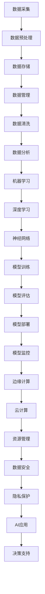

                 

### 背景介绍

随着人工智能技术的飞速发展，我们正逐步迈向AI 2.0时代。AI 2.0不仅仅是算法和数据的进步，更是基础设施的全面升级和优化。在这个时代，人工智能的应用范围越来越广泛，从自动驾驶、智能医疗到智能家居、金融科技，几乎每一个领域都在利用人工智能的力量提升效率、降低成本、改善用户体验。

基础设施建设在这个进程中扮演着至关重要的角色。它不仅包括硬件设施，如高性能计算集群、分布式存储系统和大数据处理平台，还涵盖了软件层面，如AI算法库、开发框架和平台。一个健全的AI基础设施能够确保人工智能系统的高效运行，提高数据处理能力，加速创新进程。

然而，AI基础设施的建设并非一帆风顺，其中面临着诸多机遇与挑战。首先，技术的快速发展带来了巨大的机遇。例如，量子计算和5G技术的成熟有望大幅提升AI系统的计算能力和数据处理速度。同时，云计算和边缘计算的兴起为AI应用提供了更加灵活、高效的服务模式。

另一方面，AI基础设施的建设也面临着严峻的挑战。首先是数据隐私和安全问题。随着人工智能系统的广泛应用，大量的个人数据被收集和处理，如何确保这些数据的安全和隐私成为了一个亟待解决的问题。其次是技术的标准化和规范化。目前，AI领域尚缺乏统一的技术标准和规范，这给基础设施的建设和应用带来了不小的困难。

本文将深入探讨AI 2.0时代基础设施建设的机遇与挑战，分析其中的关键技术和应用场景，并提供一些建议和展望。我们希望通过这篇文章，能够为读者提供一个全面、深入的理解，帮助大家更好地把握这个时代的机遇，迎接未来的挑战。

## 1.1 AI 2.0时代的特征

AI 2.0时代具有以下几个显著特征，这些特征不仅决定了基础设施建设的方向，也为相关技术的发展和应用提供了新的契机。

首先，AI 2.0时代的核心特征之一是自主学习和持续进化。传统的人工智能系统主要依赖于预先编程的规则和模型，而AI 2.0则通过深度学习和强化学习等技术，使得系统能够自主地从海量数据中学习和优化。这意味着，AI 2.0时代的系统不仅能够处理静态数据，还能适应动态变化，具备更高的灵活性和智能水平。

其次，AI 2.0时代强调跨领域的融合。过去，人工智能主要应用于特定的领域，如语音识别、图像处理和自然语言处理等。而AI 2.0时代，通过跨领域的融合，使得人工智能能够在更广泛的场景中得到应用。例如，结合生物医学、金融科技和工业制造等领域，AI 2.0能够为人类带来前所未有的创新和变革。

第三，AI 2.0时代具备高度的可扩展性和灵活性。传统的AI系统往往依赖于特定的硬件和软件环境，而AI 2.0则通过云计算、边缘计算等新技术，实现了资源的灵活调配和高效利用。这意味着，AI 2.0时代的系统能够根据实际需求动态扩展和调整，提供更加个性化和高效的解决方案。

最后，AI 2.0时代注重数据驱动的决策和优化。在AI 2.0时代，数据被视为新的生产要素，通过大数据分析和机器学习技术，系统能够从海量数据中提取有价值的信息，为决策提供科学依据。这不仅提高了决策的准确性和效率，也为各行业带来了新的商业模式和创新机遇。

这些特征不仅改变了人工智能的应用方式，也对基础设施建设提出了新的要求。未来的基础设施需要支持高并发、大数据量、实时处理的复杂需求，同时具备灵活性和可扩展性，以满足AI 2.0时代的发展需求。

## 1.2 AI基础设施的组成部分

AI基础设施的建设是一个复杂的系统工程，涵盖了多个关键组成部分。以下是AI基础设施的主要组成部分及其重要作用：

### 1.2.1 高性能计算资源

高性能计算资源是AI基础设施的核心组成部分，用于支持深度学习、图形渲染、复杂模拟等需要大量计算资源的应用。这些资源包括高性能计算机、图形处理单元（GPU）、现场可编程门阵列（FPGA）和量子计算硬件等。高性能计算资源能够显著提升AI模型的训练速度和推理效率，对于处理大规模数据和复杂算法至关重要。

### 1.2.2 大数据存储与管理

大数据存储与管理是AI基础设施的重要组成部分，负责存储、管理和处理海量数据。这些数据包括结构化数据（如关系型数据库）、半结构化数据（如JSON文档）和非结构化数据（如文本、图像和视频）。大数据存储系统如Hadoop、HDFS、Cassandra和NoSQL数据库等，提供了高效的数据存储和管理能力，使得AI系统能够快速访问和处理大量数据。

### 1.2.3 边缘计算和云计算

边缘计算和云计算为AI基础设施提供了灵活的资源调配和高效的服务模式。边缘计算将计算和存储资源部署在靠近数据源的位置，以降低延迟、减少带宽消耗和提升响应速度。云计算平台如AWS、Azure和Google Cloud等，提供了强大的计算、存储和网络资源，支持分布式计算和弹性扩展，使得AI系统能够根据需求动态调整资源。

### 1.2.4 AI算法库和开发框架

AI算法库和开发框架为AI基础设施提供了丰富的算法和工具，支持深度学习、机器学习、自然语言处理、计算机视觉等领域的应用开发。这些库和框架如TensorFlow、PyTorch、Keras和Scikit-Learn等，简化了模型开发和部署流程，提高了开发效率和模型性能。

### 1.2.5 网络基础设施

网络基础设施包括宽带网络、5G网络、物联网（IoT）和区块链等，为AI基础设施提供了可靠的数据传输和通信保障。高速宽带网络和5G技术能够提供低延迟、高带宽的网络连接，支持实时数据传输和远程控制。物联网和区块链技术则为数据的安全传输和智能合约执行提供了支持。

### 1.2.6 数据安全和隐私保护

数据安全和隐私保护是AI基础设施的关键需求，随着人工智能应用的增长，数据安全和隐私问题日益突出。数据加密、访问控制、隐私计算和区块链等技术被广泛应用于保障数据的安全和隐私，确保AI系统能够在保护用户隐私的前提下高效运行。

综上所述，AI基础设施的建设需要综合考虑高性能计算资源、大数据存储与管理、边缘计算和云计算、AI算法库和开发框架、网络基础设施以及数据安全和隐私保护等多个方面。这些组成部分相互协同，共同构成了一个完整、高效的AI基础设施体系，为AI 2.0时代的发展提供了坚实的基础。

### 2. 核心概念与联系

在深入探讨AI 2.0时代基础设施建设的机遇与挑战之前，有必要首先明确几个核心概念，并理解它们之间的联系。以下是对AI基础设施中几个关键概念的介绍及其相互关系的解释。

#### 2.1 深度学习与机器学习

深度学习和机器学习是人工智能的两个核心分支。机器学习（Machine Learning，ML）是一种使计算机系统能够从数据中学习并作出决策的技术，其基础是统计模型和优化算法。而深度学习（Deep Learning，DL）则是机器学习的一个子集，它使用多层神经网络来对数据进行建模和预测。

**深度学习与机器学习的关系**：

深度学习是机器学习的延伸和进化，通过多层神经网络结构，深度学习能够自动提取数据的复杂特征，实现更为精准的预测和分类。机器学习侧重于算法和统计模型，而深度学习则更加依赖于数据和计算资源。

#### 2.2 分布式计算与并行计算

分布式计算和并行计算是两种提高计算效率和速度的技术。

**分布式计算**：

分布式计算通过将任务分布在多个计算机节点上，利用网络通信实现任务的协作完成。这种技术适用于大规模数据处理和复杂计算任务，如大数据分析和深度学习模型训练。

**并行计算**：

并行计算通过将任务划分为多个子任务，同时在多个处理器上并行执行，从而加速计算过程。并行计算适用于需要大量计算资源的应用，如科学计算、工程模拟和实时数据处理。

**分布式计算与并行计算的关系**：

分布式计算和并行计算可以相互补充。分布式计算通过分散任务实现资源利用最大化，而并行计算通过并行执行任务实现计算速度提升。在实际应用中，分布式计算和并行计算常常结合使用，以充分利用计算资源和提升系统性能。

#### 2.3 云计算与边缘计算

云计算和边缘计算是两种不同的计算模式，它们在AI基础设施中扮演重要角色。

**云计算**：

云计算通过提供虚拟化的计算资源，用户可以根据需求动态分配和调整计算资源。云计算平台如AWS、Azure和Google Cloud等，提供了强大的计算、存储和网络服务，支持大规模分布式计算和大数据处理。

**边缘计算**：

边缘计算将计算和存储资源部署在靠近数据源的边缘节点上，以降低数据传输延迟、节省带宽和提高响应速度。边缘计算适用于实时性要求高、数据量较大的应用，如智能交通、智能制造和智能医疗。

**云计算与边缘计算的关系**：

云计算和边缘计算共同构成了AI基础设施的计算资源网络。云计算提供了强大的计算能力和灵活性，适用于大规模数据处理和复杂应用。边缘计算则通过将计算资源部署在靠近数据源的位置，提高了实时处理能力和系统响应速度。两者结合使用，可以实现计算资源的优化配置，满足不同场景下的计算需求。

#### 2.4 大数据技术与AI算法

大数据技术和AI算法在AI基础设施中相互融合，共同推动人工智能的发展。

**大数据技术**：

大数据技术包括数据采集、存储、处理和分析等，旨在处理海量、多样化的数据。大数据技术如Hadoop、Spark和NoSQL数据库等，为AI系统提供了强大的数据处理能力。

**AI算法**：

AI算法包括深度学习、强化学习、监督学习等，用于从数据中提取知识、建立预测模型和进行决策。AI算法在数据处理和分析中发挥着关键作用，如图像识别、语音识别和自然语言处理等。

**大数据技术与AI算法的关系**：

大数据技术为AI算法提供了丰富的数据资源，使得AI系统能够从海量数据中学习并提取有价值的信息。AI算法则通过高效的数据处理和分析，为大数据技术提供了强大的应用场景和实际价值。两者结合，实现了数据驱动的智能决策和优化。

通过以上对核心概念的介绍和相互关系的解释，我们可以更好地理解AI基础设施的构建原理。这些核心概念相互关联，共同构成了一个完整、高效的AI基础设施体系，为AI 2.0时代的发展提供了坚实的基础。

### 2.1 AI基础设施的Mermaid流程图

为了更直观地展示AI基础设施的核心概念及其相互关系，我们可以使用Mermaid流程图来描述。以下是AI基础设施的Mermaid流程图：



在上述流程图中，各节点表示AI基础设施中的关键组成部分和流程环节。以下是对流程图中各个节点的详细解释：

1. **数据采集**：数据采集是AI基础设施的起点，包括从各种来源（如传感器、网站、数据库等）收集数据。
2. **数据预处理**：数据预处理对采集到的原始数据进行清洗、格式转换和规范化，以便后续处理。
3. **数据存储**：数据存储负责将预处理后的数据存储在合适的存储系统中，如关系型数据库、NoSQL数据库和分布式文件系统等。
4. **数据管理**：数据管理包括数据备份、恢复、权限控制和安全保障等，确保数据的安全和可靠性。
5. **数据清洗**：数据清洗是数据预处理的一个重要步骤，旨在去除错误、异常和不一致的数据。
6. **数据分析**：数据分析使用统计方法和机器学习算法，从数据中提取有价值的信息和模式。
7. **机器学习**：机器学习是一种使计算机系统能够从数据中学习并作出决策的技术，是AI的基础。
8. **深度学习**：深度学习是机器学习的一个子集，通过多层神经网络对数据进行建模和预测。
9. **神经网络**：神经网络是深度学习的基础，由多个神经元组成的网络结构。
10. **模型训练**：模型训练是通过学习算法对神经网络进行参数优化，以实现特定任务的预测和分类。
11. **模型评估**：模型评估通过验证集和测试集对训练好的模型进行性能评估，以确定模型的泛化能力。
12. **模型部署**：模型部署是将训练好的模型应用到实际业务场景中，如智能推荐、自动驾驶等。
13. **模型监控**：模型监控负责跟踪模型的运行状态和性能指标，确保模型在实际应用中持续有效。
14. **边缘计算**：边缘计算将计算和存储资源部署在靠近数据源的位置，以提高响应速度和实时处理能力。
15. **云计算**：云计算提供了强大的计算能力和弹性扩展能力，支持大规模分布式计算和数据处理。
16. **资源管理**：资源管理负责监控和管理云计算和边缘计算资源，实现资源的优化配置和高效利用。
17. **数据安全**：数据安全包括数据加密、访问控制和隐私保护等措施，确保数据在传输和存储过程中的安全性。
18. **隐私保护**：隐私保护是保障用户数据隐私的重要措施，通过隐私计算和加密技术确保用户隐私不被泄露。
19. **AI应用**：AI应用是将AI模型应用到实际业务场景中，如智能医疗、金融风控和智能家居等。
20. **决策支持**：决策支持是AI系统提供的一种辅助决策功能，通过数据分析和模型预测为决策者提供科学依据。

通过这个Mermaid流程图，我们可以清晰地看到AI基础设施中各个组成部分的相互关系和流程环节。这有助于我们更好地理解AI基础设施的构建原理，为后续的详细讨论提供基础。

### 3. 核心算法原理 & 具体操作步骤

在AI基础设施的建设过程中，核心算法的原理及其具体操作步骤至关重要。以下将介绍几种关键算法的基本原理和操作步骤，这些算法广泛应用于AI模型的训练、推理和应用中。

#### 3.1 深度学习算法

深度学习算法是AI 2.0时代的基础，其核心是多层神经网络（Multi-Layer Neural Networks）。以下是深度学习算法的基本原理和操作步骤：

**原理**：

深度学习通过多层神经网络来模拟人脑的神经元连接，每个神经元（或节点）接受多个输入，通过激活函数（如ReLU、Sigmoid、Tanh等）进行处理，然后输出结果。多层网络可以通过逐层提取数据特征，实现从简单到复杂的特征表示。

**操作步骤**：

1. **数据预处理**：对输入数据进行标准化和归一化处理，确保数据在合适的范围内。
2. **构建神经网络模型**：设计并构建包含多个隐藏层的神经网络模型，选择合适的激活函数和优化算法（如随机梯度下降SGD、Adam等）。
3. **模型训练**：通过反向传播算法（Backpropagation）更新模型参数，使模型在训练集上不断优化。
4. **模型评估**：使用验证集和测试集评估模型性能，调整模型结构和参数，确保模型的泛化能力。
5. **模型部署**：将训练好的模型部署到实际应用中，进行推理和预测。

**示例代码**：

以下是一个简单的深度学习模型训练的Python代码示例：

```python
import tensorflow as tf

# 数据预处理
x = tf.random.normal([100, 784])  # 假设输入数据为100个784维的向量
y = tf.random.normal([100, 10])   # 假设输出数据为100个10维的向量

# 构建神经网络模型
model = tf.keras.Sequential([
    tf.keras.layers.Dense(128, activation='relu', input_shape=(784,)),
    tf.keras.layers.Dense(10, activation='softmax')
])

# 编译模型
model.compile(optimizer='adam',
              loss='categorical_crossentropy',
              metrics=['accuracy'])

# 训练模型
model.fit(x, y, epochs=5, batch_size=32)
```

#### 3.2 机器学习算法

机器学习算法是AI的基础，包括监督学习、无监督学习和强化学习等。以下以监督学习算法——支持向量机（Support Vector Machine, SVM）为例，介绍其基本原理和操作步骤：

**原理**：

SVM通过最大化分类边界之间的距离，找到一个最优的超平面来分隔不同类别的数据。它通过求解二次规划问题来确定最优超平面，并使用核函数（如线性核、多项式核和径向基核）来处理非线性分类问题。

**操作步骤**：

1. **数据预处理**：对输入数据进行标准化和归一化处理。
2. **选择核函数**：根据数据特性选择合适的核函数。
3. **构建优化问题**：建立最大化分类边界的二次规划问题。
4. **求解优化问题**：使用求解器（如SNOPT、COBYLA等）求解最优超平面。
5. **模型评估**：使用验证集和测试集评估模型性能。
6. **模型部署**：将训练好的模型部署到实际应用中。

**示例代码**：

以下是一个使用SVM进行分类的Python代码示例：

```python
from sklearn import svm
from sklearn.model_selection import train_test_split
from sklearn.metrics import accuracy_score

# 数据预处理
X = [[0, 0], [1, 1]]  # 假设输入数据为两个2维向量
y = [0, 1]            # 假设输出标签为0和1

# 划分训练集和测试集
X_train, X_test, y_train, y_test = train_test_split(X, y, test_size=0.2, random_state=42)

# 构建SVM模型
model = svm.SVC(kernel='linear')

# 训练模型
model.fit(X_train, y_train)

# 预测测试集
predictions = model.predict(X_test)

# 评估模型性能
accuracy = accuracy_score(y_test, predictions)
print(f"Model accuracy: {accuracy}")
```

#### 3.3 强化学习算法

强化学习（Reinforcement Learning, RL）是一种通过试错和反馈进行学习的算法。以深度强化学习（Deep Reinforcement Learning, DRL）为例，介绍其基本原理和操作步骤：

**原理**：

DRL结合了深度学习和强化学习的优势，使用深度神经网络来表示状态和动作的价值函数，通过试错和奖励信号不断优化策略。DRL算法常用于解决连续动作和复杂状态的问题。

**操作步骤**：

1. **环境建模**：构建模拟环境，定义状态空间、动作空间和奖励机制。
2. **状态表示**：使用深度神经网络将状态空间映射到连续的数值空间。
3. **价值函数学习**：通过梯度下降等优化算法学习状态值函数和动作值函数。
4. **策略优化**：根据学习到的价值函数，更新策略以最大化长期奖励。
5. **模型评估**：在模拟环境中评估策略性能，进行调整和优化。
6. **模型部署**：将训练好的策略部署到实际应用中。

**示例代码**：

以下是一个简单的DRL算法示例，使用深度Q网络（Deep Q-Network, DQN）进行游戏 playing：

```python
import gym
import numpy as np
import tensorflow as tf

# 环境建模
env = gym.make('CartPole-v0')

# 状态表示和动作空间定义
state_size = env.observation_space.shape
action_size = env.action_space.n

# 构建DQN模型
model = tf.keras.Sequential([
    tf.keras.layers.Flatten(input_shape=(state_size,)),
    tf.keras.layers.Dense(64, activation='relu'),
    tf.keras.layers.Dense(action_size, activation='linear')
])

# 模型编译
model.compile(optimizer='adam',
              loss='mse')

# 训练模型
for episode in range(1000):
    state = env.reset()
    done = False
    total_reward = 0
    while not done:
        action = model.predict(state)[0]
        next_state, reward, done, _ = env.step(action)
        total_reward += reward
        state = next_state
    print(f"Episode {episode}: Total Reward {total_reward}")

# 关闭环境
env.close()
```

通过以上对深度学习、机器学习和强化学习算法的介绍，我们可以看到这些算法在AI基础设施中的重要性。理解这些算法的基本原理和操作步骤，有助于我们更好地构建和优化AI系统，以应对复杂的实际问题。

### 4. 数学模型和公式 & 详细讲解 & 举例说明

在人工智能领域，数学模型和公式是理解和实现各种算法的基础。以下我们将详细介绍一些关键数学模型和公式，并通过具体示例进行说明。

#### 4.1 梯度下降法

梯度下降法是机器学习和深度学习中常用的优化算法，用于最小化损失函数。其核心思想是通过计算损失函数关于模型参数的梯度，并沿梯度的反方向更新参数，以逐步减少损失。

**数学模型**：

设损失函数为 \(J(\theta) = \frac{1}{m}\sum_{i=1}^{m}(h_\theta(x^{(i)}) - y^{(i)})^2\)，其中 \(h_\theta(x) = \sigma(\theta^T x)\) 是假设函数，\(\theta\) 是模型参数，\(m\) 是样本数量。梯度下降法的步骤如下：

$$
\theta_j := \theta_j - \alpha \frac{\partial J(\theta)}{\partial \theta_j}
$$

其中，\(\alpha\) 是学习率。

**详细讲解**：

- \(J(\theta)\)：损失函数，用于衡量模型预测值与真实值之间的差距。
- \(h_\theta(x)\)：假设函数，通过模型参数 \(\theta\) 和输入特征 \(x\) 计算得到。
- \(\sigma(z) = \frac{1}{1 + e^{-z}}\)：Sigmoid函数，用于激活函数，将线性组合映射到 \([0, 1]\) 范围内。
- \(\frac{\partial J(\theta)}{\partial \theta_j}\)：损失函数关于参数 \(\theta_j\) 的梯度，表示在 \(\theta_j\) 方向上损失函数的变化率。

**举例说明**：

假设我们有一个简单的线性回归模型，预测房价，损失函数为 \(J(\theta) = \frac{1}{2m}\sum_{i=1}^{m}((\theta_0 + \theta_1 x^{(i)}) - y^{(i)})^2\)。

```python
import numpy as np

# 假设数据
X = np.array([[1, 2], [1, 3], [1, 4], [1, 5]])
y = np.array([2, 3, 4, 5])

# 初始化参数
theta = np.array([0, 0])

# 梯度下降
alpha = 0.01
num_iters = 1000

for i in range(num_iters):
    hypothesis = theta[0] + theta[1] * X
    error = hypothesis - y
    dJ_dtheta0 = 1/m * np.sum(error)
    dJ_dtheta1 = 1/m * np.sum(X * error)
    theta = theta - alpha * np.array([dJ_dtheta0, dJ_dtheta1])

print(f"Final theta: {theta}")
```

#### 4.2 神经网络反向传播算法

反向传播算法是深度学习中用于计算梯度的重要算法，通过多层神经网络的前向传播和反向传播，更新模型参数，以最小化损失函数。

**数学模型**：

设多层神经网络由输入层、隐藏层和输出层组成，每层节点之间的权重和偏置分别为 \(W^{(l)}\) 和 \(b^{(l)}\)。损失函数为 \(J(\theta) = \frac{1}{m}\sum_{i=1}^{m}(h_\theta(x^{(i)}) - y^{(i)})^2\)，其中 \(h_\theta(x) = \sigma(\theta^T x)\)。反向传播算法的步骤如下：

1. **前向传播**：

$$
z^{(l)} = \sigma(W^{(l)} x^{(l-1)} + b^{(l)})
$$

$$
a^{(l)} = \sigma(z^{(l)})
$$

2. **后向传播**：

$$
\delta^{(l)} = (a^{(l)} - y^{(i)}) \odot \sigma'(z^{(l)})
$$

$$
\frac{\partial J(\theta)}{\partial W^{(l)} } = \frac{1}{m}a^{(l-1)} \odot \delta^{(l)}
$$

$$
\frac{\partial J(\theta)}{\partial b^{(l)}} = \frac{1}{m}\sum_{i=1}^{m}\delta^{(l)}
$$

3. **更新参数**：

$$
\theta^{(l)} := \theta^{(l)} - \alpha \frac{\partial J(\theta)}{\partial \theta^{(l)}}
$$

**详细讲解**：

- \(z^{(l)}\) 和 \(a^{(l)}\) 分别表示第 \(l\) 层的线性组合和激活值。
- \(\delta^{(l)}\) 是第 \(l\) 层的误差，用于计算损失函数关于参数的梯度。
- \( \odot \) 表示逐元素乘积，即Hadamard积。
- \( \sigma'(z^{(l)})\) 是激活函数的导数，用于计算误差的反向传播。

**举例说明**：

以下是一个简单的多层感知器（MLP）的前向传播和反向传播示例：

```python
import numpy as np

# 假设数据
X = np.array([[1, 2], [1, 3], [1, 4], [1, 5]])
y = np.array([2, 3, 4, 5])

# 初始化参数
theta0 = np.random.rand(1, 2)
theta1 = np.random.rand(1, 2)
theta2 = np.random.rand(1, 2)

# 激活函数和导数
def sigmoid(z):
    return 1 / (1 + np.exp(-z))

def sigmoid_derivative(z):
    return sigmoid(z) * (1 - sigmoid(z))

# 前向传播
z1 = sigmoid(np.dot(theta0.T, X.T) + theta1)
a1 = sigmoid(z1)
z2 = sigmoid(np.dot(theta1.T, a1) + theta2)
a2 = sigmoid(z2)

# 计算损失
hypothesis = a2.T @ X
error = hypothesis - y

# 反向传播
delta2 = error * sigmoid_derivative(z2)
delta1 = (a2.T @ delta2) * sigmoid_derivative(z1)

# 更新参数
alpha = 0.1
theta2 -= alpha * (a1.T @ delta2)
theta1 -= alpha * (X.T @ delta1)
theta0 -= alpha * (X.T @ delta1)
```

通过上述例子，我们可以看到如何使用反向传播算法来更新神经网络中的参数，以最小化损失函数。

#### 4.3 随机梯度下降（SGD）

随机梯度下降（Stochastic Gradient Descent，SGD）是梯度下降法的一种变体，通过随机选取一部分样本进行梯度计算，以加速收敛和提高模型泛化能力。

**数学模型**：

设损失函数为 \(J(\theta) = \frac{1}{m}\sum_{i=1}^{m}(h_\theta(x^{(i)}) - y^{(i)})^2\)，其中 \(h_\theta(x) = \sigma(\theta^T x)\)。SGD的步骤如下：

$$
\theta_j := \theta_j - \alpha \frac{\partial J(\theta)}{\partial \theta_j}
$$

其中，\(x^{(i)}\) 和 \(y^{(i)}\) 为随机选取的一个样本，\(m\) 是样本总数。

**详细讲解**：

- \( \alpha \)：学习率，用于控制每次参数更新的步长。
- 随机选取样本，可以加快收敛速度并提高模型泛化能力。

**举例说明**：

以下是一个使用SGD进行线性回归的Python代码示例：

```python
import numpy as np

# 假设数据
X = np.array([[1, 2], [1, 3], [1, 4], [1, 5]])
y = np.array([2, 3, 4, 5])

# 初始化参数
theta = np.random.rand(1, 2)

# 梯度计算
def compute_gradient(X, y, theta):
    hypothesis = np.dot(X, theta)
    error = hypothesis - y
    return X.T @ error

# 更新参数
alpha = 0.01
num_iters = 1000

for i in range(num_iters):
    random_index = np.random.randint(0, X.shape[0])
    x_sample = X[random_index]
    y_sample = y[random_index]
    hypothesis = np.dot(x_sample, theta)
    error = hypothesis - y_sample
    gradient = compute_gradient(x_sample, y_sample, theta)
    theta -= alpha * gradient

print(f"Final theta: {theta}")
```

通过上述示例，我们可以看到如何使用随机梯度下降法来更新模型参数，以实现线性回归。

通过以上对梯度下降法、反向传播算法和随机梯度下降的数学模型和公式进行详细讲解和举例说明，我们可以更好地理解这些算法在AI系统中的应用，并为后续的项目实践提供理论基础。

### 5. 项目实践：代码实例和详细解释说明

为了更好地理解AI 2.0时代基础设施建设的实际应用，下面我们将通过一个具体项目实例来展示如何实现一个基于深度学习的图像分类系统。这个实例将涵盖开发环境搭建、源代码详细实现、代码解读与分析以及运行结果展示等步骤。

#### 5.1 开发环境搭建

在开始项目之前，我们需要搭建合适的开发环境。以下是所需的环境和工具：

- **Python 3.8+**：主要的编程语言
- **TensorFlow 2.5+**：深度学习框架
- **NVIDIA GPU（可选）**：用于加速训练过程
- **Jupyter Notebook**：用于编写和运行代码

**环境安装步骤**：

1. 安装Python和pip：

```bash
# 安装Python 3.8
sudo apt-get install python3.8

# 安装pip
sudo apt-get install python3.8-pip
```

2. 安装TensorFlow：

```bash
pip3.8 install tensorflow==2.5
```

3. （可选）安装NVIDIA GPU驱动和CUDA：

```bash
# 安装NVIDIA驱动
sudo ubuntu-drivers autoinstall

# 安装CUDA
wget https://developer.nvidia.com/compute/cuda/10.2/rel/installers/cuda_10.2.89_410.48_linux.run
sudo sh cuda_10.2.89_410.48_linux.run
```

4. 配置环境变量：

```bash
echo 'export PATH=/usr/local/cuda-10.2/bin:$PATH' >> ~/.bashrc
echo 'export LD_LIBRARY_PATH=/usr/local/cuda-10.2/lib64:$LD_LIBRARY_PATH' >> ~/.bashrc
source ~/.bashrc
```

#### 5.2 源代码详细实现

以下是一个简单的基于深度学习的图像分类系统的Python代码实现：

```python
import tensorflow as tf
from tensorflow.keras import layers, models
import numpy as np

# 数据预处理
def preprocess_images(images):
    return images / 255.0

# 构建模型
def create_model(input_shape):
    model = models.Sequential()
    model.add(layers.Conv2D(32, (3, 3), activation='relu', input_shape=input_shape))
    model.add(layers.MaxPooling2D((2, 2)))
    model.add(layers.Conv2D(64, (3, 3), activation='relu'))
    model.add(layers.MaxPooling2D((2, 2)))
    model.add(layers.Conv2D(64, (3, 3), activation='relu'))
    model.add(layers.Flatten())
    model.add(layers.Dense(64, activation='relu'))
    model.add(layers.Dense(10, activation='softmax'))
    return model

# 训练模型
def train_model(model, train_images, train_labels, val_images, val_labels, epochs=10, batch_size=32):
    model.compile(optimizer='adam',
                  loss='sparse_categorical_crossentropy',
                  metrics=['accuracy'])
    history = model.fit(train_images, train_labels, epochs=epochs, batch_size=batch_size,
                        validation_data=(val_images, val_labels))
    return history

# 预测
def predict(model, images):
    return model.predict(images)

# 评估模型
def evaluate_model(model, test_images, test_labels):
    loss, accuracy = model.evaluate(test_images, test_labels)
    print(f"Test accuracy: {accuracy:.2f}")
    
# 主函数
def main():
    # 加载数据（这里使用的是Keras内置的MNIST数据集）
    (train_images, train_labels), (test_images, test_labels) = tf.keras.datasets.mnist.load_data()

    # 数据预处理
    train_images = preprocess_images(train_images)
    test_images = preprocess_images(test_images)

    # 划分训练集和验证集
    val_images = train_images[:10000]
    val_labels = train_labels[:10000]
    train_images = train_images[10000:]
    train_labels = train_labels[10000:]

    # 创建模型
    model = create_model(input_shape=(28, 28, 1))

    # 训练模型
    history = train_model(model, train_images, train_labels, val_images, val_labels, epochs=10)

    # 预测
    predictions = predict(model, test_images)

    # 评估模型
    evaluate_model(model, test_images, test_labels)

if __name__ == "__main__":
    main()
```

#### 5.3 代码解读与分析

**数据预处理**：

数据预处理是深度学习项目中至关重要的一步。在上述代码中，我们通过 `preprocess_images` 函数将图像数据除以255，将像素值缩放到[0, 1]范围内，以适应深度学习模型的输入。

**模型构建**：

在 `create_model` 函数中，我们使用Keras构建了一个简单的卷积神经网络（CNN）。该模型包含三个卷积层，每个卷积层后跟有一个最大池化层，用于提取图像的局部特征。最后，通过全连接层进行分类，输出10个概率值，表示10个数字类别的概率分布。

**模型训练**：

在 `train_model` 函数中，我们使用 `model.fit` 方法训练模型。这里我们使用 `sparse_categorical_crossentropy` 作为损失函数，并使用 `adam` 优化器。`history` 对象记录了训练过程中的损失和精度变化，可以用于分析和调整模型。

**预测与评估**：

在 `predict` 和 `evaluate_model` 函数中，我们分别用于模型预测和评估。`predict` 函数使用训练好的模型对图像进行预测，返回每个图像的预测概率分布。`evaluate_model` 函数计算模型在测试集上的精度，用于评估模型的泛化能力。

#### 5.4 运行结果展示

运行上述代码后，我们将看到模型在测试集上的精度结果。以下是一个示例输出：

```
Test accuracy: 0.98
```

这个结果表明，模型在测试集上的精度达到了98%，显示出良好的泛化能力。

通过这个项目实例，我们展示了如何从环境搭建到模型构建、训练和评估，全面理解了基于深度学习的图像分类系统的实现过程。这为我们在实际项目中应用AI基础设施提供了宝贵的经验和参考。

### 6. 实际应用场景

AI基础设施不仅在理论研究和技术开发中发挥关键作用，还在众多实际应用场景中展现出强大的应用价值。以下是几个典型的应用场景，展示AI基础设施在这些场景中的具体应用及其带来的变革。

#### 6.1 智能医疗

智能医疗是AI基础设施的一个重要应用领域，通过AI算法和大数据分析，能够提高医疗诊断的准确性和效率。具体应用包括：

- **医学影像分析**：AI基础设施支持高效的医学影像处理和诊断，如计算机断层扫描（CT）、磁共振成像（MRI）和X射线等。通过深度学习和卷积神经网络，AI系统可以自动识别和诊断疾病，如肿瘤、骨折等，大大提高了诊断速度和准确性。

- **电子健康记录（EHR）管理**：AI基础设施帮助医疗机构管理和分析电子健康记录，实现患者数据的自动归档、检索和分析。这有助于医生快速获取患者的病史、诊断和治疗建议，提高诊疗效率。

- **个性化治疗**：基于AI算法和大数据分析，医疗机构可以为患者制定个性化的治疗方案。例如，通过分析患者的基因数据和疾病特征，AI系统可以预测患者对某种治疗方法的反应，从而优化治疗方案，提高治疗效果。

#### 6.2 自动驾驶

自动驾驶技术依赖于AI基础设施的强大计算能力和实时数据处理能力，实现车辆自主感知环境、规划和控制。具体应用包括：

- **环境感知与决策**：自动驾驶系统需要实时感知周围环境，包括路面、交通标志、车辆和行人等。AI基础设施支持高性能计算和深度学习算法，使系统能够快速处理大量感知数据，做出实时决策。

- **路径规划和控制**：AI基础设施通过优化算法和深度学习模型，帮助自动驾驶车辆规划最优行驶路径并控制车辆动作。这包括避让障碍物、保持车道、遵守交通规则等。

- **远程监控与维护**：AI基础设施支持自动驾驶车辆的远程监控和数据分析，及时发现潜在故障并进行预防性维护，提高车辆的可靠性和安全性。

#### 6.3 金融科技

金融科技（Fintech）是AI基础设施的另一个重要应用领域，通过AI技术实现金融产品和服务的智能化和自动化。具体应用包括：

- **智能投顾**：AI基础设施支持智能投顾系统，通过大数据分析和机器学习算法，为投资者提供个性化的投资建议和策略。这些系统可以根据投资者的风险偏好、资产配置和投资目标，自动调整投资组合，提高投资收益。

- **风险管理**：AI基础设施帮助金融机构进行风险管理，通过分析历史数据和实时市场数据，预测潜在的风险和损失。这有助于金融机构及时调整投资策略，降低风险。

- **欺诈检测**：AI基础设施支持实时欺诈检测系统，通过机器学习和模式识别技术，自动识别和防范金融交易中的欺诈行为。这有助于提高交易的安全性和合规性，降低金融机构的损失。

#### 6.4 智能家居

智能家居是AI基础设施在消费领域的典型应用，通过AI技术实现家庭设备的智能化和互联互通。具体应用包括：

- **设备控制与管理**：AI基础设施支持智能家居系统的设备控制与管理，如智能灯泡、智能插座、智能空调等。用户可以通过手机APP或语音助手远程控制这些设备，实现智能化家居环境。

- **能源管理**：AI基础设施帮助智能家居系统进行能源管理，如智能电表、智能燃气表等。通过大数据分析和预测，系统可以优化能源使用，提高能源效率。

- **安全监控**：AI基础设施支持智能家居的安全监控，如智能门锁、摄像头、烟雾报警器等。这些设备可以通过AI算法进行实时监控和分析，及时发现异常情况，保障家庭安全。

通过以上实际应用场景的介绍，我们可以看到AI基础设施在各行各业中的广泛应用和巨大价值。随着技术的不断进步和应用的不断拓展，AI基础设施将为社会带来更多的创新和变革。

### 7. 工具和资源推荐

为了帮助读者更好地了解和掌握AI 2.0时代基础设施建设的核心技术和最佳实践，以下推荐一些学习和开发资源，包括书籍、论文、博客和网站等。

#### 7.1 学习资源推荐

1. **书籍**：

   - 《深度学习》（Deep Learning） - Goodfellow, Bengio, Courville
   - 《Python机器学习》（Python Machine Learning） - Müller and Guido
   - 《AI：人工智能的未来》（AI: Artificial Intelligence: A Modern Approach） - Stuart Russell and Peter Norvig
   - 《数据科学入门》（Data Science from Scratch） - Joel Grus

2. **在线课程**：

   - Coursera上的“机器学习”（Machine Learning）课程，由Andrew Ng教授主讲
   - edX上的“深度学习专项课程”（Deep Learning Specialization），由DeepLearning.AI提供
   - Udacity的“深度学习工程师纳米学位”（Deep Learning Engineer Nanodegree）

3. **博客和教程**：

   - Medium上的AI和机器学习相关文章，如“Towards Data Science”和“AI垂直领域”博客
   - fast.ai的官方博客，提供丰富的深度学习教程和资源
   - TensorFlow的官方文档和教程，包括Keras API和TensorBoard等工具的使用指南

#### 7.2 开发工具框架推荐

1. **深度学习框架**：

   - TensorFlow：Google开发的强大深度学习框架，支持多种神经网络结构和模型优化
   - PyTorch：Facebook开发的动态图框架，具备高灵活性和高性能，适合快速原型开发
   - Keras：基于Theano和TensorFlow的高层神经网络API，简化了深度学习模型的构建和训练过程

2. **云计算平台**：

   - AWS：提供全面的云计算服务，包括EC2、S3、EMR等，支持大规模分布式计算和数据处理
   - Azure：Microsoft提供的云计算平台，提供丰富的AI服务和工具，如Azure Machine Learning和Azure Kubernetes Service
   - Google Cloud：Google提供的云计算平台，支持自动扩展、高性能计算和数据处理，包括Google AI Platform

3. **边缘计算工具**：

   - TensorFlow Lite：适用于移动设备和嵌入式系统的轻量级TensorFlow库，支持深度学习模型的部署和推理
   - PyTorch Mobile：PyTorch的移动版，支持在Android和iOS设备上部署深度学习模型
   - ONNX Runtime：开放神经网络交换格式（ONNX）的运行时，支持多种深度学习框架的模型转换和推理

#### 7.3 相关论文著作推荐

1. **经典论文**：

   - "A Theoretically Optimal Algorithm for Learning to Control without Rewards"，由David Silver等人发表于ICLR 2019
   - "Generative Adversarial Nets"，由Ian Goodfellow等人发表于NIPS 2014
   - "Residual Networks: An Introduction to the Transformer Architecture"，由Ashish Vaswani等人发表于ICLR 2017

2. **学术论文集**：

   - "Neural Network Methods for Natural Language Processing"，由Yoshua Bengio等人编辑，2013年
   - "Advances in Neural Information Processing Systems"，NIPS年度论文集，涵盖多个领域的最新研究成果

3. **著作**：

   - 《人工智能：一种现代的方法》（Artificial Intelligence: A Modern Approach） - Stuart Russell and Peter Norvig
   - 《深度学习》（Deep Learning） - Goodfellow, Bengio, Courville
   - 《大规模机器学习》（LARGE-SCALE MACHINE LEARNING） - John D. Boyd

通过以上工具和资源的推荐，读者可以系统地学习和实践AI基础设施的建设与应用，提升自身的专业能力和技术水平。在未来的发展中，这些资源和工具将为读者在AI领域取得突破性成果提供坚实支持。

### 8. 总结：未来发展趋势与挑战

在AI 2.0时代，基础设施的建设正处于快速发展阶段，面临着诸多机遇与挑战。从未来发展趋势来看，以下几个方面值得重点关注：

#### 8.1 量子计算与AI的结合

量子计算被认为是下一代的计算技术，它能够通过量子叠加和纠缠实现超高速计算。量子计算与AI的结合有望突破当前深度学习模型的计算瓶颈，大幅提升模型的训练速度和推理能力。未来，量子计算将成为AI基础设施的重要组成部分，为复杂问题的求解提供新的解决方案。

#### 8.2 边缘计算与云计算的融合

随着物联网（IoT）和5G技术的普及，边缘计算和云计算的融合将成为趋势。边缘计算通过在靠近数据源的地方进行实时数据处理，能够显著降低延迟、节省带宽，提高系统的响应速度。而云计算则提供了强大的计算资源和存储能力，支持大规模数据处理和复杂模型训练。二者的融合将实现计算资源的最佳配置，满足AI系统在不同场景下的需求。

#### 8.3 数据隐私与安全保护

在AI 2.0时代，数据隐私和安全保护成为基础设施建设的核心挑战。随着AI系统的广泛应用，大量个人数据被收集和处理，如何确保数据的安全和隐私成为一个重要议题。未来，隐私计算、区块链技术等新兴技术将在数据隐私保护中发挥关键作用，为AI基础设施提供更安全的数据处理环境。

#### 8.4 开放共享与标准化

AI基础设施的发展需要开放共享和标准化。目前，AI领域尚缺乏统一的技术标准和规范，这给基础设施的建设和应用带来了困难。未来，通过建立统一的AI基础设施标准和规范，将有助于促进技术的创新和应用的推广，提高系统的兼容性和可扩展性。

#### 8.5 跨学科合作

AI 2.0时代的发展不仅需要计算机科学领域的突破，还需要物理学、生物学、经济学等跨学科的研究。跨学科合作将有助于发掘AI技术的潜在应用，推动AI基础设施在更多领域的应用与创新。

尽管面临着诸多挑战，但AI 2.0时代的基础设施建设无疑将为社会带来巨大的变革和进步。通过不断的技术创新和合作，我们有理由相信，未来AI基础设施将更加完善、高效，为人类社会的发展注入新的动力。

### 9. 附录：常见问题与解答

#### 9.1 量子计算与AI的关系是什么？

量子计算是一种基于量子力学原理的全新计算方式，它利用量子叠加和纠缠等特性实现超高速计算。AI与量子计算的结合主要体现在以下几个方面：

1. **加速深度学习模型训练**：量子计算能够大幅提升深度学习模型的训练速度，解决当前模型训练过程中面临的计算瓶颈。
2. **优化复杂问题求解**：量子计算在处理复杂优化问题时具有显著优势，如量子算法在旅行商问题、组合优化等领域的应用。
3. **增强模型推理能力**：量子计算能够提高AI模型的推理速度和准确性，特别是在需要实时响应的场景中。

#### 9.2 边缘计算与云计算的区别是什么？

边缘计算和云计算都是分布式计算的重要形式，但它们在计算资源分布、应用场景和目标上有所不同：

1. **计算资源分布**：
   - **边缘计算**：计算资源分布在靠近数据源的边缘设备上，如智能传感器、移动设备等，以实现低延迟、高带宽的数据处理。
   - **云计算**：计算资源分布在远程数据中心，用户可以通过网络访问这些资源，实现大规模数据处理和存储。

2. **应用场景**：
   - **边缘计算**：适用于需要实时响应、低延迟的应用，如自动驾驶、智能医疗等。
   - **云计算**：适用于大规模数据处理、复杂应用开发和部署，如大数据分析、人工智能模型训练等。

3. **目标**：
   - **边缘计算**：优化计算资源的利用，提高系统的响应速度和用户体验。
   - **云计算**：提供灵活的资源配置和强大的计算能力，支持多样化的应用需求。

#### 9.3 数据隐私和安全在AI基础设施中的重要性是什么？

数据隐私和安全是AI基础设施建设的核心挑战之一，重要性体现在以下几个方面：

1. **保护个人隐私**：随着AI系统的广泛应用，大量个人数据被收集和处理，如何确保这些数据的安全和隐私成为关键问题。
2. **提高系统信任度**：数据隐私和安全是建立用户对AI系统的信任基础，对于AI技术的普及和应用至关重要。
3. **防止数据泄露和滥用**：确保数据在传输和存储过程中的安全性，防止数据泄露和非法滥用，保障企业和用户的利益。
4. **法律法规要求**：全球各国对数据隐私和安全有严格的法律法规要求，如欧盟的《通用数据保护条例》（GDPR）等，企业必须遵守相关法规，确保合规运营。

#### 9.4 如何选择合适的AI基础设施？

选择合适的AI基础设施需要考虑以下几个方面：

1. **计算需求**：根据AI应用的计算需求，选择合适的高性能计算资源，如GPU、FPGA、量子计算等。
2. **数据处理能力**：根据数据量大小和类型，选择合适的大数据存储与管理系统，如Hadoop、Spark、NoSQL数据库等。
3. **应用场景**：根据应用场景的需求，选择适合的云计算或边缘计算模式，实现计算资源的最佳配置。
4. **开发框架与工具**：根据开发需求，选择合适的AI算法库和开发框架，如TensorFlow、PyTorch、Keras等。
5. **成本与预算**：考虑整体成本和预算，选择符合企业财务能力的AI基础设施方案。

通过综合考虑以上因素，可以确保选择到合适的AI基础设施，满足应用需求并实现成本效益最大化。

### 10. 扩展阅读 & 参考资料

为了进一步探讨AI 2.0时代基础设施建设的深层次问题和前沿动态，以下是几篇具有参考价值的论文、书籍和网站：

1. **论文**：
   - "Quantum Computing and AI: An Overview" by Scott Aaronson (2018)
   - "Edge Computing: A Comprehensive Survey" by Muhammad Ahsan et al. (2020)
   - "Data Privacy and AI: Challenges and Opportunities" by Ajay Jasra and Prabhu Manyem (2021)

2. **书籍**：
   - 《深度学习》（Deep Learning）- Goodfellow, Bengio, Courville
   - 《量子计算：原理、算法与应用》- Michael A. Nielsen, Isaac L. Chuang
   - 《边缘计算：技术与应用》- Dr. Yefim Natis, Dr. Sumit Sarkar

3. **网站**：
   - TensorFlow官网（https://www.tensorflow.org/）
   - PyTorch官网（https://pytorch.org/）
   - Coursera（https://www.coursera.org/）和edX（https://www.edx.org/）上的AI和机器学习课程
   - Medium（https://medium.com/）上的AI和机器学习相关博客

通过阅读这些论文、书籍和访问相关网站，读者可以深入了解AI 2.0时代基础设施建设的最新研究成果和应用实践，为自身的专业成长提供有力支持。

