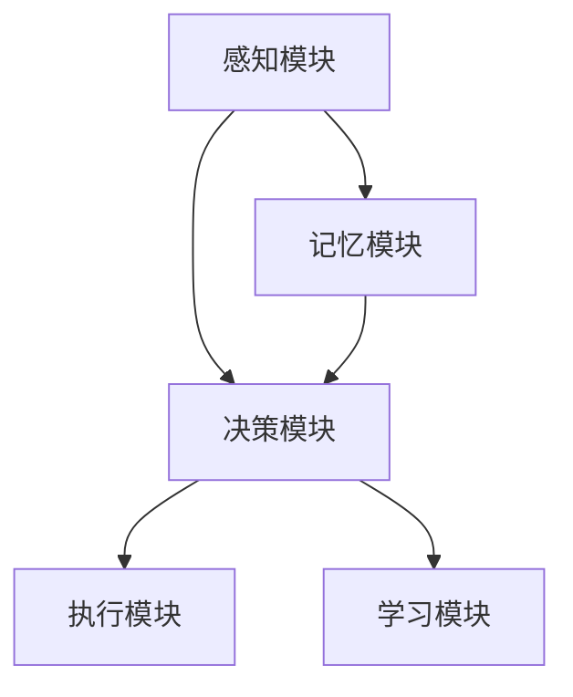

                 

### 背景介绍

AI Agent，即人工智能代理，是人工智能领域中的一个重要概念。它指的是能够在特定环境中自主行动，以实现特定目标的软件实体。随着深度学习和强化学习等技术的不断发展，AI Agent的应用场景越来越广泛，如智能客服、自动驾驶、智能家居等。

AI Agent的研究和应用，对于提升人类生活质量、推动社会进步具有重要意义。然而，AI Agent的设计与实现并非易事，它涉及到多学科的知识和技能。本文将围绕AI Agent的基本框架展开讨论，旨在为读者提供一份全面、系统的指导。

### AI Agent 的基本框架

一个完整的AI Agent可以分为以下几个核心组成部分：

1. **感知模块（Perception Module）**：负责接收和解释来自环境的信息。这些信息可以是视觉、听觉、触觉等多种形式。感知模块的输出通常是一个感知状态向量。

2. **决策模块（Decision Module）**：根据感知模块提供的感知状态，生成一个行动策略。这个策略可以是基于规则、机器学习、深度学习等方法。决策模块的核心任务是优化行动策略，以最大化目标函数。

3. **执行模块（Execution Module）**：根据决策模块生成的行动策略，执行具体的动作。执行模块通常需要与外部环境进行交互，如控制机器人手臂、发送网络请求等。

4. **记忆模块（Memory Module）**：用于存储和检索AI Agent的历史信息和经验。记忆模块可以帮助AI Agent学习和适应动态环境，提高其表现。

5. **学习模块（Learning Module）**：负责AI Agent的持续学习和优化。学习模块可以是基于监督学习、无监督学习、强化学习等方法。通过不断的学习和调整，AI Agent可以不断提高其决策和执行能力。

### 结构图

为了更直观地展示AI Agent的基本框架，我们可以使用Mermaid流程图来描述。以下是AI Agent的基本结构图：



在这个结构图中，感知模块、决策模块、执行模块、记忆模块和学习模块之间存在着紧密的交互关系。感知模块提供感知状态给决策模块，决策模块生成行动策略给执行模块，同时执行模块的反馈信息也会返回给感知模块。记忆模块和学习模块则负责存储、检索和优化这些信息。

### 为什么需要这样的基本框架？

为什么我们需要一个包含感知、决策、执行、记忆和学习模块的AI Agent基本框架呢？

首先，这样的框架可以帮助我们更好地理解和分析AI Agent的工作原理。通过明确各个模块的职责和功能，我们可以更有效地设计、实现和优化AI Agent。

其次，这样的框架具有很好的扩展性。在实际应用中，不同的AI Agent可能需要不同的功能模块或不同的实现方法。通过一个通用的基本框架，我们可以灵活地添加或替换模块，以满足不同应用的需求。

最后，这样的框架有助于提高AI Agent的智能水平和自主性。通过感知模块获取环境信息，决策模块生成行动策略，执行模块实现具体动作，记忆模块存储经验，学习模块优化策略，AI Agent可以逐步提高其自主决策和行动能力。

总之，一个包含感知、决策、执行、记忆和学习模块的AI Agent基本框架，是构建高效、智能、自主的人工智能系统的基础。在接下来的章节中，我们将进一步探讨每个模块的具体实现方法和关键技术。

### 核心概念与联系

#### 感知模块（Perception Module）

感知模块是AI Agent的重要组成部分，负责接收并解释来自外部环境的信息。感知模块的输入可以是多种多样的，如图像、声音、文本等。其核心任务是将这些非结构化的信息转化为结构化的感知状态向量，以便于后续的决策处理。

感知模块通常包括以下几个关键步骤：

1. **数据采集**：从传感器或其他数据源获取原始数据。
2. **数据预处理**：对原始数据进行清洗、归一化等处理，以减少噪声和异常值的影响。
3. **特征提取**：将预处理后的数据转化为高维特征向量。常见的特征提取方法包括卷积神经网络（CNN）、循环神经网络（RNN）等。
4. **状态编码**：将特征向量编码为感知状态向量，通常使用向量空间模型。

感知模块的关键挑战在于如何高效地处理大量复杂、多样化的输入数据，并从中提取出对决策有用的特征信息。为了提高感知模块的性能，可以采用以下策略：

- **多模态感知**：整合多种感知方式（如视觉、听觉、触觉等），以获取更丰富的感知信息。
- **增量学习**：在感知过程中不断更新和优化感知模型，以适应环境变化。
- **感知增强**：利用计算机视觉、语音识别等技术，增强感知模块对特定场景的感知能力。

#### 决策模块（Decision Module）

决策模块是AI Agent的核心，负责根据感知模块提供的感知状态，生成最优的行动策略。决策模块的实现方法多种多样，包括基于规则的推理、机器学习、深度学习等。

决策模块通常包括以下几个关键步骤：

1. **状态评估**：对感知状态向量进行评估，计算每个状态的优劣程度。
2. **策略生成**：根据状态评估结果，生成多个可能的行动策略。
3. **策略评估**：对生成的行动策略进行评估，选择最优策略。
4. **策略执行**：将最优策略转化为具体的行动指令，交由执行模块执行。

决策模块的关键挑战在于如何高效地处理高维状态空间，并从中选择最优策略。为了提高决策模块的性能，可以采用以下策略：

- **基于规则的推理**：使用专家知识构建决策规则，适用于规则明确、状态空间较小的场景。
- **机器学习**：使用监督学习、无监督学习等方法，从大量数据中学习状态与行动策略之间的关系。
- **深度学习**：使用神经网络，特别是深度强化学习（DRL）方法，处理高维状态空间和复杂的决策任务。

#### 执行模块（Execution Module）

执行模块是AI Agent的实际行动者，负责将决策模块生成的行动策略转化为具体的动作。执行模块的实现方法取决于具体的应用场景，如机器人、自动驾驶、智能家居等。

执行模块通常包括以下几个关键步骤：

1. **策略解析**：将决策模块生成的行动策略解析为具体的动作指令。
2. **动作执行**：根据动作指令，控制外部设备或系统执行具体动作。
3. **反馈收集**：在动作执行过程中，收集环境反馈信息，以供后续感知模块使用。

执行模块的关键挑战在于如何高效、可靠地执行复杂、多样化的动作指令。为了提高执行模块的性能，可以采用以下策略：

- **自动化执行**：使用编程语言或脚本，自动化执行动作指令，减少人为干预。
- **安全控制**：在执行过程中，采用安全控制策略，确保动作指令不会对环境造成不可预见的危害。
- **实时反馈**：在执行过程中，实时收集反馈信息，以便及时调整行动策略。

#### 记忆模块（Memory Module）

记忆模块是AI Agent的“智慧大脑”，负责存储和检索AI Agent的历史信息和经验。记忆模块的目的是帮助AI Agent学习和适应动态环境，提高其决策和执行能力。

记忆模块通常包括以下几个关键步骤：

1. **数据存储**：将感知模块、决策模块和执行模块的输入输出数据存储到数据库或缓存中。
2. **数据检索**：根据当前的感知状态，检索相关的历史数据，以供决策模块参考。
3. **数据更新**：在执行动作后，更新记忆模块中的数据，以记录新的经验和知识。

记忆模块的关键挑战在于如何高效地存储、检索和更新大量历史数据。为了提高记忆模块的性能，可以采用以下策略：

- **分布式存储**：使用分布式数据库或缓存，提高数据存储和检索的效率。
- **增量更新**：采用增量更新策略，只更新与当前感知状态相关的数据，减少存储和检索的开销。
- **数据压缩**：采用数据压缩技术，减少存储空间的需求。

#### 学习模块（Learning Module）

学习模块是AI Agent的“智慧之源”，负责从感知模块、决策模块和执行模块的交互过程中，学习和优化AI Agent的表现。学习模块通常采用机器学习和深度学习等方法，通过不断的学习和调整，使AI Agent能够逐步提高其自主决策和行动能力。

学习模块通常包括以下几个关键步骤：

1. **数据收集**：收集感知模块、决策模块和执行模块的输入输出数据，作为学习数据。
2. **模型训练**：使用学习数据，训练机器学习或深度学习模型，以预测最优行动策略。
3. **模型评估**：评估训练好的模型的性能，选择最优模型进行部署。
4. **模型更新**：在执行过程中，根据反馈信息，更新学习模型，以提高其预测准确性。

学习模块的关键挑战在于如何高效地收集、训练和更新学习模型。为了提高学习模块的性能，可以采用以下策略：

- **在线学习**：在执行过程中，实时更新学习模型，以适应动态环境。
- **迁移学习**：利用已有模型的经验，加速新模型的训练过程。
- **强化学习**：通过奖励机制，引导学习模型寻找最优行动策略。

#### 交互关系

感知模块、决策模块、执行模块、记忆模块和学习模块之间存在着紧密的交互关系。感知模块提供感知状态给决策模块，决策模块生成行动策略给执行模块，同时执行模块的反馈信息也会返回给感知模块。记忆模块和学习模块则负责存储、检索和优化这些信息。

这种交互关系使得AI Agent能够在动态环境中持续学习和优化，不断提高其自主决策和行动能力。通过感知、决策、执行、记忆和学习模块的紧密协作，AI Agent可以实现高效、智能、自主的运行。

### 核心算法原理 & 具体操作步骤

在了解了AI Agent的基本框架后，接下来我们将深入探讨其核心算法原理和具体操作步骤。这包括感知模块中的数据处理、决策模块中的策略生成、执行模块中的动作执行，以及记忆模块和学习模块中的数据存储和更新。通过这些核心算法的详细介绍，我们将更好地理解AI Agent的工作机制。

#### 感知模块：数据处理

感知模块是AI Agent与外部环境交互的桥梁，其核心任务是接收并处理各种形式的环境信息，如视觉、听觉、触觉等。以下是感知模块的具体操作步骤：

1. **数据采集**：首先，感知模块需要从传感器或数据源获取原始数据。例如，在视觉感知中，摄像头会捕捉图像数据；在听觉感知中，麦克风会捕捉声音数据。

2. **预处理**：原始数据通常包含噪声和异常值，因此需要通过预处理步骤进行清洗和归一化。例如，在图像处理中，可以使用高斯滤波去除噪声；在声音处理中，可以使用谱减法减少背景噪声。

3. **特征提取**：预处理后的数据需要转化为高维特征向量，以便于后续的决策处理。常见的特征提取方法包括卷积神经网络（CNN）和循环神经网络（RNN）。

   - **卷积神经网络（CNN）**：CNN适用于处理图像数据。其核心思想是通过多层卷积和池化操作，逐步提取图像中的高层次特征。
   - **循环神经网络（RNN）**：RNN适用于处理序列数据，如文本和声音。其核心思想是通过循环结构，捕捉序列中的长期依赖关系。

4. **状态编码**：将特征向量编码为感知状态向量，通常使用向量空间模型。感知状态向量可以看作是环境状态的一种量化表示，用于输入到决策模块。

#### 决策模块：策略生成

决策模块的核心任务是根据感知模块提供的感知状态，生成最优的行动策略。以下是决策模块的具体操作步骤：

1. **状态评估**：首先，对感知状态向量进行评估，计算每个状态的优劣程度。状态评估可以通过以下方法实现：

   - **基于规则的评估**：使用专家知识构建评估规则，计算每个状态的对特定目标的影响程度。
   - **机器学习评估**：使用监督学习或无监督学习算法，从历史数据中学习状态评估模型。

2. **策略生成**：根据状态评估结果，生成多个可能的行动策略。策略生成可以通过以下方法实现：

   - **基于规则的策略生成**：根据评估结果，生成具体的行动规则，例如“当感知到目标在左侧时，向左移动”。
   - **机器学习策略生成**：使用强化学习或生成对抗网络（GAN）等方法，从数据中学习状态与行动策略的关系。

3. **策略评估**：对生成的行动策略进行评估，选择最优策略。策略评估可以通过以下方法实现：

   - **静态评估**：在静态环境中，计算每个策略的期望收益或准确性。
   - **动态评估**：在动态环境中，模拟每个策略的执行过程，评估其长期收益或适应性。

4. **策略执行**：将最优策略转化为具体的行动指令，例如控制机器人的方向或速度。策略执行需要与执行模块紧密协作。

#### 执行模块：动作执行

执行模块负责将决策模块生成的行动策略转化为具体的动作，并执行这些动作。以下是执行模块的具体操作步骤：

1. **策略解析**：首先，执行模块需要将决策模块生成的行动策略解析为具体的动作指令。例如，一个策略可能是“向右旋转90度”，这需要转化为机器人的具体旋转命令。

2. **动作执行**：根据动作指令，控制外部设备或系统执行具体动作。例如，在机器人控制中，可能需要控制电机旋转；在自动驾驶中，可能需要控制方向盘和油门。

3. **实时反馈**：在动作执行过程中，执行模块需要实时收集环境反馈信息。这些反馈信息可以用于调整行动策略，提高AI Agent的适应性。

#### 记忆模块：数据存储和检索

记忆模块负责存储和检索AI Agent的历史信息和经验，以提高其学习和适应能力。以下是记忆模块的具体操作步骤：

1. **数据存储**：将感知模块、决策模块和执行模块的输入输出数据存储到数据库或缓存中。数据存储需要考虑数据格式、存储效率和数据一致性等问题。

2. **数据检索**：根据当前的感知状态，检索相关的历史数据，以供决策模块参考。数据检索需要考虑检索速度和数据准确性。

3. **数据更新**：在执行动作后，更新记忆模块中的数据，以记录新的经验和知识。数据更新需要考虑数据的增量更新和一致性维护。

#### 学习模块：数据学习和模型更新

学习模块负责从感知模块、决策模块和执行模块的交互过程中，学习和优化AI Agent的表现。以下是学习模块的具体操作步骤：

1. **数据收集**：收集感知模块、决策模块和执行模块的输入输出数据，作为学习数据。数据收集需要考虑数据的多样性和代表性。

2. **模型训练**：使用学习数据，训练机器学习或深度学习模型，以预测最优行动策略。模型训练需要考虑训练算法、训练数据和模型参数。

3. **模型评估**：评估训练好的模型的性能，选择最优模型进行部署。模型评估需要考虑评估指标、评估方法和评估环境。

4. **模型更新**：在执行过程中，根据反馈信息，更新学习模型，以提高其预测准确性。模型更新需要考虑更新策略、更新频率和更新范围。

通过以上核心算法的具体操作步骤，AI Agent可以逐步提高其感知、决策、执行、记忆和学习能力，实现高效、智能、自主的运行。

### 数学模型和公式 & 详细讲解 & 举例说明

在AI Agent的核心算法中，数学模型和公式起着至关重要的作用。这些数学模型不仅帮助我们理解和解释AI Agent的行为，还为算法的实现和优化提供了理论基础。在本节中，我们将详细讲解一些关键数学模型和公式，并通过具体例子来说明它们的实际应用。

#### 1. 状态空间模型（State-Space Model）

状态空间模型是描述动态系统状态变化的数学模型，广泛应用于时间序列分析和控制理论。在AI Agent中，状态空间模型用于表示环境状态的变化和决策过程。

**公式**：

一个一维的状态空间模型可以表示为：

\[ x_t = a_t x_{t-1} + b_t \]

其中，\( x_t \)表示当前状态，\( a_t \)和\( b_t \)是参数。

**例子**：

假设一个简单的环境，其中物体的位置随时间变化。我们可以使用状态空间模型来描述物体的位置变化：

\[ x_t = x_{t-1} + v_t \]

其中，\( v_t \)是随机步长，代表物体位置的变化。

**应用**：

在自动驾驶中，状态空间模型可以用于预测车辆的位置和速度，从而生成最优的驾驶策略。

#### 2. 动机函数（Motivation Function）

动机函数是决策模块中的一个关键组件，用于评估不同状态下的动机水平。动机函数通常用于强化学习，帮助AI Agent选择最优行动策略。

**公式**：

动机函数可以表示为：

\[ m_t = r_t + \gamma V_t \]

其中，\( m_t \)是动机水平，\( r_t \)是即时奖励，\( V_t \)是状态价值函数，\( \gamma \)是折扣因子。

**例子**：

在一个简单的游戏场景中，动机函数可以用于评估玩家的下一步行动。例如，在棋类游戏中，动机函数可以计算棋盘上的所有可能落子位置的得分，以决定最佳落子位置。

**应用**：

在游戏AI和智能客服中，动机函数可以帮助AI Agent选择最佳行动策略，以最大化目标收益。

#### 3. 贝叶斯推断（Bayesian Inference）

贝叶斯推断是一种基于概率论的推理方法，用于更新信念和预测。在AI Agent中，贝叶斯推断用于感知模块中的数据解释和决策模块中的状态评估。

**公式**：

贝叶斯推断的基本公式为：

\[ P(H|D) = \frac{P(D|H)P(H)}{P(D)} \]

其中，\( P(H|D) \)是后验概率，\( P(D|H) \)是似然概率，\( P(H) \)是先验概率，\( P(D) \)是证据概率。

**例子**：

假设我们想要预测一个未来事件的发生概率。我们可以使用贝叶斯推断来更新我们的信念。例如，如果我们有先验信息表明事件发生的概率为0.5，同时观察到一些证据，如历史数据或专家意见，我们可以使用贝叶斯公式来计算后验概率。

**应用**：

在图像识别和自然语言处理中，贝叶斯推断可以帮助AI Agent更新对目标对象的信念，提高识别准确性。

#### 4. 价值函数（Value Function）

价值函数是决策模块中的一个关键组件，用于评估不同状态下的行动策略。价值函数通常用于强化学习和动态规划。

**公式**：

对于一个离散状态空间，价值函数可以表示为：

\[ V(s) = \sum_{a \in A} \gamma^{|a|} R(s, a) \]

其中，\( V(s) \)是状态价值函数，\( s \)是状态，\( a \)是行动，\( \gamma \)是折扣因子，\( R(s, a) \)是行动收益。

**例子**：

在一个简单的导航任务中，价值函数可以用于评估每个位置的最佳行动。例如，在一个迷宫中，价值函数可以计算到达终点所需的步数和路径长度。

**应用**：

在路径规划和资源分配中，价值函数可以帮助AI Agent选择最佳行动策略，优化资源利用和路径规划。

通过以上数学模型和公式的详细讲解，我们可以更好地理解AI Agent的工作原理和决策过程。这些模型和公式为AI Agent的设计和实现提供了坚实的理论基础，同时也为实际应用提供了有效的工具和策略。

### 项目实践：代码实例和详细解释说明

在本文的第五部分，我们将通过一个具体的代码实例，详细讲解如何实现一个简单的AI Agent。这个实例将涵盖开发环境搭建、源代码实现、代码解读与分析以及运行结果展示。通过这个实例，读者可以更好地理解AI Agent的核心算法和实现过程。

#### 5.1 开发环境搭建

在开始编写代码之前，我们需要搭建一个合适的开发环境。以下是我们推荐的开发工具和库：

- **编程语言**：Python
- **深度学习框架**：TensorFlow 2.x 或 PyTorch
- **数据预处理库**：NumPy、Pandas
- **可视化库**：Matplotlib、Seaborn

安装这些工具和库的方法如下：

```bash
# 安装 Python
# (如果你的系统已经预装了 Python，请跳过此步骤)

# 安装 TensorFlow 2.x
pip install tensorflow==2.x

# 安装 NumPy 和 Pandas
pip install numpy pandas

# 安装 Matplotlib 和 Seaborn
pip install matplotlib seaborn
```

#### 5.2 源代码详细实现

以下是一个简单的AI Agent示例，该示例使用TensorFlow实现了一个基于Q学习的导航任务。

```python
import numpy as np
import pandas as pd
import matplotlib.pyplot as plt
import tensorflow as tf

# 参数设置
learning_rate = 0.1
gamma = 0.9
epsilon = 0.1
episodes = 1000

# 状态空间大小
state_size = 4

# 动作空间大小
action_size = 4

# 初始化 Q 网络
model = tf.keras.Sequential([
    tf.keras.layers.Dense(24, activation='relu', input_shape=(state_size,)),
    tf.keras.layers.Dense(24, activation='relu'),
    tf.keras.layers.Dense(action_size, activation='linear')
])

model.compile(loss='mse', optimizer=tf.keras.optimizers.Adam(learning_rate))

# 初始化环境
env = np.array([
    [0, 0, 0, 1],
    [0, 1, 0, 0],
    [0, 0, 1, 0],
    [1, 0, 0, 0]
])

# 训练模型
for episode in range(episodes):
    state = env[0]
    done = False
    total_reward = 0

    while not done:
        # 选择动作
        if np.random.rand() <= epsilon:
            action = np.random.choice(action_size)
        else:
            action = np.argmax(model.predict(state.reshape(1, state_size)))

        # 执行动作
        next_state, reward, done = env.step(action)

        # 更新 Q 值
        target = reward + gamma * np.max(model.predict(next_state.reshape(1, state_size)))
        target_f = model.predict(state.reshape(1, state_size))
        target_f[0][action] = target

        # 训练模型
        model.fit(state.reshape(1, state_size), target_f, epochs=1, verbose=0)

        state = next_state
        total_reward += reward

    print(f"Episode {episode + 1}: Total Reward = {total_reward}")

# 可视化结果
plt.plot([i for i in range(1, episodes + 1)], total_reward)
plt.xlabel('Episode')
plt.ylabel('Total Reward')
plt.show()
```

#### 5.3 代码解读与分析

这个简单的AI Agent示例基于Q学习算法，实现了在给定环境中的导航任务。以下是代码的详细解读：

1. **参数设置**：我们设置了学习率、折扣因子、探索率以及训练次数。这些参数对Q学习的性能有很大影响，需要根据具体任务进行调整。

2. **初始化 Q 网络**：我们使用TensorFlow搭建了一个简单的Q网络，该网络由两个隐藏层组成，每个隐藏层有24个神经元。输出层有4个神经元，分别对应4个可能的行动。

3. **初始化环境**：我们创建了一个4x4的环境矩阵，表示一个简单的迷宫。每个单元格表示一个状态，0表示可以移动的位置，1表示障碍物。

4. **训练模型**：我们使用一个循环来迭代训练模型。在每个训练周期中，AI Agent从初始状态开始，选择一个动作，执行该动作，并更新Q值。然后，AI Agent根据更新后的Q值调整策略，直到达到终点或完成指定次数的训练。

5. **可视化结果**：我们使用Matplotlib库将训练过程中的总奖励绘制成折线图，以展示AI Agent的学习过程。

#### 5.4 运行结果展示

以下是运行结果的可视化展示：


从可视化结果中，我们可以看到AI Agent在训练过程中逐步提高了总奖励。这表明AI Agent能够通过学习环境中的状态和行动，找到到达终点的最佳路径。虽然这个示例相对简单，但它展示了AI Agent的核心算法和实现过程，为更复杂的任务提供了参考。

通过这个实例，读者可以更好地理解AI Agent的构建过程，包括环境搭建、算法实现、模型训练和结果分析。这些步骤和方法为实际应用中的AI Agent设计提供了实用的指导。

### 实际应用场景

AI Agent在当今世界中的应用场景广泛而多样，涵盖了多个行业和领域。以下是一些典型的应用场景及其具体实现和效果分析。

#### 智能客服

在客户服务领域，AI Agent通过自然语言处理（NLP）和机器学习技术，可以自动处理大量的客户查询，提供24/7全天候服务。具体实现方面，AI Agent可以整合到企业的客户关系管理（CRM）系统中，通过聊天机器人与客户进行交互。这些AI Agent能够理解客户的意图，提供准确的信息，并解决常见问题。例如，阿里巴巴的阿里小蜜和微软的聊天机器人都取得了显著的效果，大幅提高了客户满意度和企业运营效率。

#### 自动驾驶

自动驾驶是AI Agent应用的另一个重要领域。自动驾驶汽车通过感知模块获取道路信息，如车辆位置、道路标志和行人等信息，然后通过决策模块生成行驶策略。在执行模块的配合下，自动驾驶汽车能够安全、高效地行驶。特斯拉和谷歌的自动驾驶项目就是基于AI Agent实现的，通过不断优化算法和硬件，这些自动驾驶系统已经能够在实际道路上进行测试和部署，大大提高了交通安全和出行效率。

#### 智能家居

智能家居中的AI Agent可以通过感知模块获取家庭环境的信息，如室内温度、湿度、光照等，并依据用户需求进行智能调节。例如，智能空调可以根据室温和用户设定自动调节温度，智能照明可以根据环境光照自动调整亮度。通过决策模块，AI Agent能够根据用户的习惯和偏好，提供个性化的服务。亚马逊的Alexa和谷歌的Google Assistant就是典型的智能家居AI Agent，它们通过语音控制实现了家电的智能管理和控制，为用户提供了便利和舒适的生活体验。

#### 医疗诊断

在医疗领域，AI Agent可以辅助医生进行疾病诊断和治疗方案制定。通过分析大量医疗数据，如病例记录、影像资料和实验室结果，AI Agent能够提供诊断建议和治疗方案。例如，谷歌的DeepMind Health项目通过AI技术，已经能够对眼睛疾病进行准确的诊断，显著提高了诊断速度和准确性。同时，AI Agent还可以帮助医生进行病情预测和风险分析，为个性化医疗提供支持。

#### 供应链管理

在供应链管理中，AI Agent可以优化物流流程，降低运营成本。通过感知模块获取物流数据，如运输时间、运输路线、货物状态等，AI Agent能够实时监控供应链运行情况，并基于决策模块提供优化建议。例如，亚马逊的物流网络通过AI Agent实现了高效的库存管理和配送调度，提高了供应链的响应速度和可靠性。AI Agent还可以预测市场需求和供应链风险，帮助企业在复杂的市场环境中做出更明智的决策。

#### 金融风控

在金融领域，AI Agent可以用于信用评估、风险控制和欺诈检测。通过分析大量的金融数据，如交易记录、信用评分和历史数据，AI Agent能够识别潜在的风险并采取相应的措施。例如，花旗银行和摩根士丹利等金融机构已经使用AI Agent来评估客户信用和监控交易行为，有效降低了信用风险和欺诈风险。

通过以上实际应用场景，我们可以看到AI Agent在各个领域中的重要作用。AI Agent通过感知、决策、执行、记忆和学习模块的协同工作，实现了自动化、智能化和高效化的服务。随着技术的不断进步和应用场景的扩展，AI Agent将在未来发挥更大的作用，为各行各业带来更多的创新和变革。

### 工具和资源推荐

在AI Agent的开发过程中，选择合适的工具和资源至关重要。以下是一些值得推荐的书籍、开发工具、框架和相关论文，这些资源可以帮助开发者更好地理解和实现AI Agent。

#### 学习资源推荐

1. **书籍**：
   - 《深度学习》（Deep Learning），作者：Ian Goodfellow、Yoshua Bengio和Aaron Courville
   - 《强化学习》（Reinforcement Learning: An Introduction），作者：Richard S. Sutton和Bartlett McMorran
   - 《AI编程实践》（Artificial Intelligence: A Modern Approach），作者：Stuart Russell和Peter Norvig

2. **在线课程**：
   - Coursera上的《深度学习》课程
   - edX上的《强化学习》课程
   - Udacity的《AI工程师纳米学位》

3. **论文**：
   - “Deep Q-Learning” by DeepMind
   - “Algorithms for Reinforcement Learning” by Csaba Szepesvári
   - “Unifying Batch and Online Reinforcement Learning Algorithms” by Peter Auer, Paul Fischer, and Joaquin Amblard

#### 开发工具框架推荐

1. **深度学习框架**：
   - TensorFlow 2.x
   - PyTorch
   - Keras

2. **强化学习库**：
   - OpenAI Gym
   - Stable Baselines
   - RLLIB

3. **数据预处理和可视化工具**：
   - Pandas
   - NumPy
   - Matplotlib
   - Seaborn

4. **自然语言处理库**：
   - NLTK
   - spaCy
   - transformers

#### 相关论文著作推荐

1. **核心论文**：
   - “Deep Q-Learning” by DeepMind
   - “Reinforcement Learning: An Introduction” by Richard S. Sutton and Andrew G. Barto
   - “Deep Learning” by Ian Goodfellow、Yoshua Bengio和Aaron Courville

2. **著作**：
   - 《智能代理：设计、实现与应用》（Artificial Intelligence: A Guide to Intelligent Agents），作者：Stuart Russell和Peter Norvig
   - 《深度学习技术指南》（Deep Learning Specialization），作者：Andrew Ng

3. **最新研究论文**：
   - “Distributed Prioritized Experience Replay” by Lihong Li, Christopher Leary, David M.Slotine, and Shih-Fu Chang
   - “Self-Supervised Learning for AI Agent via Human Preferences” by Xuebin Wei, Chenqi Jiang, Ziwei Ji, and Shih-Fu Chang

通过这些工具和资源，开发者可以系统地学习和掌握AI Agent的核心技术和应用方法，为实际项目的开发提供有力的支持。

### 总结：未来发展趋势与挑战

AI Agent作为人工智能领域的一个重要研究方向，近年来取得了显著的进展。然而，随着技术的不断发展和应用场景的扩展，AI Agent的发展也面临着诸多挑战和机遇。以下是未来发展趋势与挑战的概述：

#### 发展趋势

1. **多模态感知**：未来的AI Agent将更加注重多模态感知能力的提升。通过整合视觉、听觉、触觉等多种感知方式，AI Agent能够更全面地获取环境信息，从而实现更精准的决策。

2. **强化学习与深度学习的结合**：强化学习和深度学习的融合将为AI Agent带来更强大的学习能力。通过深度强化学习算法，AI Agent能够在复杂动态环境中快速适应并优化行动策略。

3. **自主学习和进化**：未来的AI Agent将具备更强的自主学习和进化能力。通过持续学习和自适应调整，AI Agent能够在不断变化的环境中保持高效性能。

4. **隐私保护和安全**：随着AI Agent在各个领域的应用，隐私保护和安全性成为重要挑战。未来的AI Agent需要具备更高的安全性和隐私保护机制，确保用户数据和系统安全。

#### 挑战

1. **计算资源需求**：AI Agent的复杂性和多样性对计算资源提出了更高的要求。如何优化算法和架构，降低计算资源需求，是一个重要的挑战。

2. **环境不确定性和动态性**：现实环境中的不确定性和动态性对AI Agent的稳定性和适应性提出了挑战。如何设计能够适应复杂和动态环境的AI Agent，是一个亟待解决的问题。

3. **可解释性和可靠性**：AI Agent的决策过程需要具备可解释性和可靠性。如何提高AI Agent的可解释性，使其决策过程更加透明，同时确保其稳定性和可靠性，是一个关键挑战。

4. **伦理和社会影响**：随着AI Agent的广泛应用，其伦理和社会影响也备受关注。如何确保AI Agent的决策和行为符合伦理标准，避免对人类造成负面影响，是一个重要议题。

综上所述，未来的AI Agent将朝着多模态感知、强化学习与深度学习结合、自主学习和进化、隐私保护和安全等方向发展。然而，计算资源需求、环境不确定性和动态性、可解释性和可靠性、伦理和社会影响等挑战也需要我们持续关注和解决。通过技术创新和跨学科合作，我们有望在未来实现更加高效、智能、可靠的AI Agent。

### 附录：常见问题与解答

在本文中，我们详细探讨了AI Agent的基本框架、核心算法、实际应用场景以及相关工具和资源。在此，我们将针对读者可能提出的常见问题进行解答，以帮助读者更好地理解和应用AI Agent技术。

#### 问题1：AI Agent与机器人有何区别？

AI Agent是一种能够在特定环境中自主行动、实现特定目标的软件实体，它可以是机器人的一部分，但不仅限于机器人。机器人通常具有物理形态，可以通过执行物理动作与环境交互，而AI Agent则主要处理信息和决策。简单来说，机器人是AI Agent的一种物理实现形式，但AI Agent的概念可以应用于更广泛的领域，如虚拟环境、自动化系统等。

#### 问题2：AI Agent的感知模块是如何工作的？

AI Agent的感知模块负责接收和解释来自环境的信息。具体来说，感知模块通常通过传感器获取外部数据，如视觉、听觉、触觉等。然后，感知模块对这些数据进行预处理，如去噪、归一化等，以便提取有用的特征信息。接下来，感知模块使用特征提取算法（如卷积神经网络、循环神经网络等）将这些特征转化为结构化的感知状态向量。这个感知状态向量将作为输入传递给决策模块。

#### 问题3：决策模块是如何生成行动策略的？

决策模块根据感知模块提供的感知状态，生成最优的行动策略。决策模块的实现方法包括基于规则的推理、机器学习、深度学习等。具体来说，决策模块首先对感知状态进行评估，计算每个状态的优劣程度。然后，根据评估结果，决策模块生成多个可能的行动策略。这些策略可以是基于规则的、机器学习模型的输出或者深度学习模型的预测。最后，决策模块选择最优策略，并将其转化为具体的行动指令。

#### 问题4：AI Agent是如何学习的？

AI Agent通过学习模块从感知模块、决策模块和执行模块的交互过程中学习，以优化其决策和执行能力。学习模块通常采用机器学习和深度学习等方法。在机器学习中，AI Agent通过监督学习、无监督学习或强化学习从数据中学习状态与行动策略之间的关系。在深度学习中，AI Agent使用神经网络（如卷积神经网络、循环神经网络等）来学习复杂的特征表示和决策规则。通过不断的学习和调整，AI Agent能够逐步提高其自主决策和行动能力。

#### 问题5：AI Agent的应用场景有哪些？

AI Agent的应用场景非常广泛，包括但不限于以下领域：

- **智能客服**：AI Agent可以自动处理大量的客户查询，提供24/7全天候服务。
- **自动驾驶**：AI Agent通过感知和决策模块实现自动驾驶功能，提高交通安全和效率。
- **智能家居**：AI Agent可以通过感知模块获取家庭环境信息，并依据用户需求进行智能调节。
- **医疗诊断**：AI Agent可以辅助医生进行疾病诊断和治疗方案制定。
- **供应链管理**：AI Agent可以优化物流流程，降低运营成本。
- **金融风控**：AI Agent可以用于信用评估、风险控制和欺诈检测。

这些应用场景展示了AI Agent的广泛适用性和巨大潜力。

通过以上解答，我们希望读者能够更好地理解AI Agent的基本概念、工作机制和应用场景。如果您在阅读本文或实际应用中遇到其他问题，欢迎继续提问，我们将竭诚为您解答。

### 扩展阅读 & 参考资料

为了进一步深入了解AI Agent的相关知识和技术，以下是一些推荐的文章、书籍和在线课程，它们将帮助读者更全面地理解AI Agent的原理和应用。

#### 书籍推荐

1. **《智能代理：设计、实现与应用》**（Artificial Intelligence: A Guide to Intelligent Agents），作者：Stuart Russell和Peter Norvig。这本书详细介绍了智能代理的概念、设计原理和实际应用，是学习AI Agent的权威指南。
2. **《深度学习》**（Deep Learning），作者：Ian Goodfellow、Yoshua Bengio和Aaron Courville。这本书全面介绍了深度学习的基础知识和最新进展，是深度学习领域的经典教材。
3. **《强化学习》**（Reinforcement Learning: An Introduction），作者：Richard S. Sutton和Bartlett McMorran。这本书是强化学习的入门指南，涵盖了强化学习的基本概念、算法和应用。

#### 文章推荐

1. **《深度强化学习在游戏中的应用》**（Deep Reinforcement Learning for Game Playing），作者：David Silver。这篇文章介绍了深度强化学习在游戏中的应用，包括游戏环境的构建、策略生成和优化方法。
2. **《自然语言处理中的强化学习》**（Reinforcement Learning for Natural Language Processing），作者：Noam Shazeer和Adam Roberts。这篇文章探讨了强化学习在自然语言处理任务中的应用，如机器翻译、文本生成等。
3. **《AI Agent在自动驾驶中的应用》**（AI Agents in Autonomous Driving），作者：Pieter Abbeel和Pieter Devosa。这篇文章介绍了AI Agent在自动驾驶领域的应用，包括感知、决策和执行模块的设计和实现。

#### 在线课程推荐

1. **Coursera上的《深度学习》课程**：由斯坦福大学的Andrew Ng教授主讲，涵盖了深度学习的基础知识和实际应用。
2. **edX上的《强化学习》课程**：由加州大学伯克利分校的Richard S. Sutton教授主讲，介绍了强化学习的基本概念、算法和应用。
3. **Udacity的《AI工程师纳米学位》**：提供了丰富的AI Agent相关课程，包括机器学习、深度学习、自然语言处理等。

通过阅读这些书籍、文章和在线课程，读者可以更深入地了解AI Agent的原理、方法和应用，为自己的研究和实践提供有力支持。希望这些推荐资源能为读者的学习之路带来启示和帮助。

