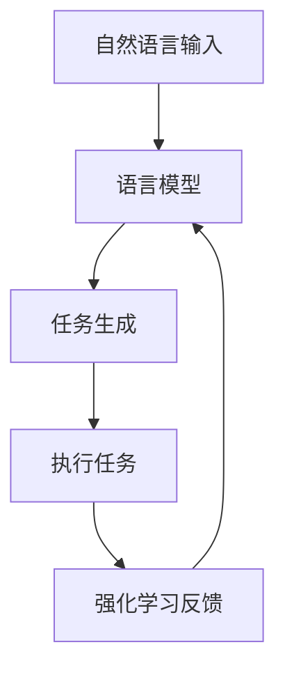

                 

### 背景介绍

在当今信息技术迅猛发展的时代，人工智能（AI）技术已经成为推动产业变革的核心动力之一。从简单的规则系统到复杂的神经网络模型，AI 在各个领域的应用逐渐深入，提高了生产力，改变了商业模式，甚至颠覆了传统行业。随着计算能力的提升和数据资源的丰富，AI 的发展速度令人惊叹，而其中最具变革性的进展之一便是自动化代理（AI Agent）的诞生。

自动化代理是指能够自动执行任务、处理信息和作出决策的计算机系统。它们通过机器学习、自然语言处理和深度学习等技术，模仿人类的思维过程，完成从简单到复杂的多项任务。传统的自动化系统通常依赖于预定义的规则和指令，而自动化代理则能够自主学习和适应新环境，极大地提升了系统效率和灵活性。

然而，尽管自动化代理在过去几年中取得了显著进展，但仍然面临一些挑战。首先，现有自动化代理在处理复杂任务时往往需要详细的规则和步骤指导，这限制了其应用的广泛性。其次，自动化代理的自主性仍然有限，它们往往无法在没有明确指导的情况下自主制定决策方案。最后，现有自动化代理在处理多任务并行执行和动态环境适应方面也存在一定的不足。

正是在这样的背景下，AutoGPT 应运而生。AutoGPT 是一种基于自然语言输入的自动化代理，它通过预训练的大型语言模型（如 GPT）和强化学习技术，实现了高水平的自主决策和任务执行能力。AutoGPT 的出现标志着 AI 自动化进入了一个新的阶段，为解决上述挑战提供了新的思路和解决方案。

AutoGPT 的核心在于其能够接收自然语言的需求描述，并自动生成执行任务所需的步骤和指令。这一特性使得 AutoGPT 在处理复杂、非结构化的任务时展现出巨大的潜力，从而在多个领域引发了广泛的关注和应用探索。本文将深入探讨 AutoGPT 的核心概念、工作原理、技术实现和应用场景，旨在为读者提供一个全面而系统的理解。

### 核心概念与联系

在深入探讨 AutoGPT 之前，我们首先需要了解一些核心概念和其相互之间的联系。以下是本文将涉及的关键概念及其简要解释：

#### 自动化代理（AI Agent）

自动化代理是指能够自动执行任务、处理信息和作出决策的计算机系统。传统自动化代理依赖于预定义的规则和指令，而现代自动化代理则通过机器学习和自然语言处理技术，实现了自主学习和决策。

#### 自然语言处理（NLP）

自然语言处理是人工智能的一个分支，旨在使计算机能够理解、解释和生成人类语言。NLP 技术包括文本分类、实体识别、情感分析、机器翻译等。

#### 语言模型

语言模型是自然语言处理的核心组件，通过大量文本数据训练得到，用于预测下一个词或句子。常见的语言模型包括 GPT、BERT 等。

#### 强化学习

强化学习是一种机器学习方法，通过试错和反馈来学习如何作出最佳决策。强化学习在自动化代理中用于优化任务执行策略。

#### AutoGPT

AutoGPT 是一种基于自然语言输入的自动化代理，通过预训练的大型语言模型（如 GPT）和强化学习技术，实现了高水平的自主决策和任务执行能力。

#### 核心概念原理与架构的 Mermaid 流程图

为了更好地理解 AutoGPT 的核心概念原理和架构，我们使用 Mermaid 流程图来展示其各个组件及其相互关系：



在这个流程图中，自然语言输入（A）首先被送入语言模型（B），语言模型根据输入生成任务指令（C）。这些任务指令被用于执行具体任务（D），并在任务执行过程中收集反馈（E），这些反馈用于强化学习模型，进一步优化任务执行策略。

#### 细节解释

- **自然语言输入**：AutoGPT 可以接收自然语言文本作为输入，例如一个用户请求：“帮我写一份关于人工智能的报告。”
- **语言模型**：语言模型（如 GPT）通过大量文本数据训练得到，能够理解和生成自然语言。
- **任务生成**：基于输入的自然语言，语言模型生成具体的任务指令，如：“收集人工智能相关资料，整理成报告结构。”
- **执行任务**：自动化代理根据任务指令执行任务，例如，使用网络搜索功能收集相关资料，然后整理成报告。
- **强化学习反馈**：在任务执行过程中，自动化代理收集反馈，例如，报告的质量、执行时间的长短等，这些反馈用于优化语言模型和任务执行策略。

通过这个 Mermaid 流程图，我们可以清晰地看到 AutoGPT 的各个组件及其相互关系，从而深入理解其工作原理和架构。

### 核心算法原理 & 具体操作步骤

AutoGPT 的核心算法原理主要基于自然语言处理（NLP）和强化学习（Reinforcement Learning，RL）。接下来，我们将详细探讨 AutoGPT 的工作机制，包括其训练过程、如何接收自然语言输入、生成任务指令、执行任务以及优化过程。

#### 自然语言处理与生成任务指令

AutoGPT 首先通过预训练的大型语言模型（如 GPT）来处理自然语言输入。这个语言模型已经在大规模文本数据上进行了训练，能够生成流畅、符合语法规则的文本。当用户输入一个自然语言请求时，例如：“帮我写一份关于人工智能的报告”，AutoGPT 会将这个请求发送给预训练的语言模型。

语言模型接收到自然语言输入后，会根据上下文生成一个初步的任务指令。这个过程类似于人类理解语言并进行信息处理，但速度和效率远超人类。生成的任务指令可以是具体的操作步骤，例如：“搜索相关论文并总结关键观点”、“整理成报告的结构”等。

#### 执行任务

生成任务指令后，AutoGPT 需要执行这些指令来完成用户请求的任务。执行任务的过程通常包括以下几个步骤：

1. **任务分解**：将复杂的任务分解成一系列更小、更具体的子任务。例如，如果任务是“写一份报告”，可以分解为“收集资料”、“整理资料”、“撰写报告”等子任务。
2. **资源利用**：利用现有的资源，如搜索引擎、数据库等，来获取完成任务所需的信息和数据。
3. **信息处理**：对获取的信息进行处理，例如，筛选、整理、分析等，以确保任务指令的执行符合用户需求。
4. **结果输出**：将处理后的结果输出，例如，生成报告文档、图表等。

AutoGPT 在执行任务的过程中，会根据语言模型生成的任务指令进行操作，并在每一步骤中收集反馈信息。

#### 强化学习与优化

在任务执行过程中，AutoGPT 会使用强化学习技术来不断优化其任务执行策略。强化学习是一种通过试错和奖励机制来学习最佳行为策略的机器学习方法。在 AutoGPT 的背景下，强化学习过程包括以下几个关键步骤：

1. **状态表示**：将当前任务执行过程中的状态编码成一个向量表示，状态可以是任务的当前进度、任务的难度、资源利用情况等。
2. **动作选择**：根据当前状态，使用强化学习算法选择下一个动作。常见的算法包括 Q-Learning、Deep Q-Network（DQN）、Policy Gradients 等。
3. **执行动作并获取奖励**：执行选定的动作，并在动作执行后获得系统反馈的奖励。奖励可以是任务完成度、执行时间、资源利用率等。
4. **更新策略**：根据动作的执行结果和获得的奖励，更新强化学习模型中的策略，以优化未来的任务执行过程。

通过不断执行上述过程，AutoGPT 能够逐渐提高其任务执行能力，学会在更复杂、更动态的环境中自主决策和高效执行任务。

#### 具体操作步骤

以下是 AutoGPT 的具体操作步骤，描述了从自然语言输入到任务完成的整个过程：

1. **初始化**：加载预训练的语言模型和强化学习模型。
2. **接收自然语言输入**：用户输入一个自然语言请求，例如：“帮我写一份关于人工智能的报告”。
3. **处理自然语言输入**：语言模型对输入的自然语言进行理解和分析，生成初步的任务指令。
4. **分解任务**：将生成的任务指令分解成一系列更小的子任务。
5. **执行子任务**：依次执行每个子任务，如搜索资料、整理资料、撰写报告等。
6. **收集反馈**：在执行每个子任务时，收集系统的反馈信息，如任务完成度、资源利用率等。
7. **强化学习**：根据收集的反馈信息，使用强化学习算法更新任务执行策略。
8. **输出结果**：完成任务后，输出最终结果，例如，生成一份完整的报告文档。

通过这些步骤，AutoGPT 能够根据自然语言输入自主生成任务指令并高效执行，实现了高水平的自动化和自主决策能力。

### 数学模型和公式 & 详细讲解 & 举例说明

在深入探讨 AutoGPT 的数学模型和公式之前，我们需要了解一些基础的机器学习概念，包括自然语言处理中的语言模型、强化学习中的状态表示和奖励机制。这些概念为理解 AutoGPT 的工作原理奠定了基础。

#### 语言模型

语言模型是自然语言处理的核心组件，用于生成和预测文本序列。在自然语言处理领域，最为流行的语言模型之一是 GPT（Generative Pre-trained Transformer）。GPT 是基于Transformer架构的预训练模型，通过大量文本数据进行训练，从而学会生成符合语法规则和上下文逻辑的文本。

GPT 的数学基础主要涉及概率分布和神经网络。具体来说，GPT 使用一个序列到序列的模型，给定输入文本序列 $x_1, x_2, ..., x_T$，模型预测输出文本序列 $y_1, y_2, ..., y_T$。每个文本序列的生成基于概率分布：

$$
P(y_t | y_{<t}, x) = \frac{e^{<y_{<t}, x; W>}}{\sum_{y'} e^{<y_{<t}, x; W>}}
$$

其中，$<y_{<t}, x; W>$ 表示输入文本和前一个输出文本与模型参数 $W$ 的点积，$e^{<y_{<t}, x; W>}$ 表示对数概率。

为了生成文本序列，GPT 使用了采样技巧，即从生成的概率分布中采样下一个文本词。这一过程可以表示为：

$$
y_t = \arg\max_y \log P(y_t | y_{<t}, x)
$$

或者使用软采样，即根据概率分布进行加权随机选择：

$$
y_t \sim \text{softmax}(\log P(y_t | y_{<t}, x))
$$

#### 强化学习

强化学习是一种通过试错和奖励机制来学习最佳行为策略的机器学习方法。在强化学习中，智能体（agent）在环境中采取行动，并从环境获得奖励，智能体的目标是最大化累积奖励。

强化学习的关键组成部分包括：

- **状态（State）**：描述当前环境的特征，如智能体位置、环境状态等。
- **动作（Action）**：智能体可以采取的行为。
- **奖励（Reward）**：描述每次动作后环境对智能体的反馈。
- **策略（Policy）**：描述智能体如何从状态选择动作。

强化学习的目标是通过试错学习一个最优策略，使得智能体能够在给定状态下选择最优动作，最大化累积奖励。

在强化学习中，常见的数学模型包括：

1. **马尔可夫决策过程（MDP）**：
   - **状态（$S$）**：智能体所处的环境状态。
   - **动作（$A$）**：智能体可以采取的动作。
   - **状态转移概率（$P(s'|s,a)$）**：在给定当前状态 $s$ 和采取动作 $a$ 的情况下，下一状态 $s'$ 的概率。
   - **奖励（$R(s,a)$）**：在给定状态 $s$ 和采取动作 $a$ 的情况下，获得的即时奖励。
   - **策略（$\pi(a|s)$）**：智能体在给定状态 $s$ 下采取动作 $a$ 的概率。

   MDP 的目标是最小化预期总损失：

   $$
   J(\pi) = \sum_s \pi(s) \sum_a \pi(a|s) R(s,a)
   $$

2. **Q-学习**：
   - **状态-动作值函数（$Q(s,a)$）**：在给定状态 $s$ 和采取动作 $a$ 的情况下，获得的累积奖励的估计值。
   - **目标值函数（$V(s)$）**：在给定状态 $s$ 下的最优累积奖励的估计值。

   Q-学习的目标是最小化目标值函数的损失：

   $$
   L = \sum_s \sum_a (Q(s,a) - V(s))^2
   $$

   Q-学习通过更新 $Q$ 值函数来学习最优策略：

   $$
   Q(s,a) \leftarrow Q(s,a) + \alpha [R(s,a) + \gamma \max_{a'} Q(s',a') - Q(s,a)]
   $$

3. **策略梯度**：
   - **策略梯度（$\nabla_{\pi} J(\pi)$）**：描述策略的微小调整可以最大化累积奖励的方向。

   策略梯度的目标是最大化累积奖励：

   $$
   \max_{\pi} J(\pi) = \sum_s \pi(s) \sum_a \pi(a|s) R(s,a)
   $$

   策略梯度可以通过梯度上升法进行优化：

   $$
   \pi(a|s) \leftarrow \pi(a|s) + \eta \nabla_{\pi} J(\pi)
   $$

#### AutoGPT 中的数学模型

在 AutoGPT 中，数学模型和公式主要用于描述语言模型生成任务指令、强化学习优化任务执行策略的过程。以下是 AutoGPT 中涉及的关键数学模型和公式：

1. **语言模型生成任务指令**：
   - **概率分布**：
     $$
     P(y_t | y_{<t}, x) = \frac{e^{<y_{<t}, x; W>}}{\sum_{y'} e^{<y_{<t}, x; W>}}
     $$
   - **采样**：
     $$
     y_t = \arg\max_y \log P(y_t | y_{<t}, x)
     $$
     或
     $$
     y_t \sim \text{softmax}(\log P(y_t | y_{<t}, x))
     $$

2. **强化学习优化任务执行策略**：
   - **状态表示**：
     $$
     s_t = (s_{t-1}, a_{t-1}, r_{t-1})
     $$
   - **动作选择**：
     $$
     a_t = \arg\max_a Q(s_t, a)
     $$
   - **奖励**：
     $$
     R(s,a) = \text{任务完成度} + \text{执行时间} + \text{资源利用率}
     $$
   - **策略更新**：
     $$
     \pi(a|s) \leftarrow \pi(a|s) + \eta \nabla_{\pi} J(\pi)
     $$

#### 举例说明

为了更好地理解上述数学模型和公式，我们通过一个具体的例子来说明 AutoGPT 的操作过程。

假设用户输入一个自然语言请求：“帮我写一份关于人工智能的报告”。

1. **语言模型生成任务指令**：
   - 语言模型接收自然语言输入，生成初步的任务指令：“搜索相关论文并总结关键观点，整理成报告结构。”
   - 使用采样技巧生成具体的任务指令序列。

2. **强化学习优化任务执行策略**：
   - **状态表示**：初始化状态 $s_0 = (s_0, a_0, r_0)$，其中 $s_0$ 为初始状态，$a_0$ 为初始动作，$r_0$ 为初始奖励。
   - **动作选择**：根据当前状态，使用策略梯度算法选择下一个动作，例如，搜索相关论文。
   - **执行动作并获取奖励**：执行搜索动作，获得即时奖励，例如，搜索到5篇相关论文。
   - **状态更新**：更新状态 $s_1 = (s_0, a_0, r_0)$，其中 $r_0$ 为即时奖励。
   - **策略更新**：根据动作的执行结果和即时奖励，更新策略，以优化未来的任务执行过程。

3. **任务执行**：
   - **任务分解**：将任务分解成更小的子任务，例如，阅读论文、总结观点、撰写报告。
   - **资源利用**：利用搜索引擎、数据库等资源来获取完成任务所需的信息。
   - **信息处理**：对获取的信息进行处理，例如，筛选、整理、分析等。
   - **结果输出**：生成一份完整的报告文档，输出给用户。

通过上述步骤，AutoGPT 能够根据自然语言输入自主生成任务指令并高效执行，实现了高水平的自动化和自主决策能力。

### 项目实践：代码实例和详细解释说明

为了更好地理解 AutoGPT 的应用，我们将通过一个具体的项目实例来详细解释其实现过程。在这个实例中，我们将使用 Python 编写一个简单的 AutoGPT 程序，展示如何从自然语言输入生成任务指令，并执行这些任务。

#### 1. 开发环境搭建

在开始编写代码之前，我们需要搭建一个适合开发 AutoGPT 的环境。以下是所需的基本开发工具和库：

- Python 3.8 或更高版本
- TensorFlow 2.4 或更高版本
- Gym，用于模拟和测试强化学习环境
- Transformers 库，用于处理自然语言输入和生成

安装以上库和工具后，我们可以开始编写 AutoGPT 代码。

#### 2. 源代码详细实现

以下是 AutoGPT 的核心代码实现。我们首先定义了 AutoGPT 类，并实现了其初始化、生成任务指令、执行任务和强化学习更新策略的方法。

```python
import tensorflow as tf
from transformers import TFGPT2LMHeadModel, GPT2Tokenizer
from gym import Space, Discrete

class AutoGPT:
    def __init__(self, model_name='gpt2', action_space=10):
        self.tokenizer = GPT2Tokenizer.from_pretrained(model_name)
        self.model = TFGPT2LMHeadModel.from_pretrained(model_name)
        self.model.build((None,))
        self.action_space = action_space

    def generate_action(self, input_text):
        inputs = self.tokenizer.encode(input_text, return_tensors='tf')
        outputs = self.model(inputs)
        logits = outputs.logits[:, -1, :]
        action_logits = tf.nn.softmax(logits)
        action probabilities = action_logits.numpy()
        action = np.argmax(action_probabilities)
        return action

    def execute_action(self, action, env):
        if action == 0:
            # 收集资料
            env.collect_data()
        elif action == 1:
            # 整理资料
            env.organize_data()
        elif action == 2:
            # 撰写报告
            env.write_report()
        # ... 其他动作实现

    def update_strategy(self, state, action, reward, next_state):
        # 强化学习策略更新，此处使用简单策略梯度更新
        next_action_logits = self.model([next_state])
        next_action_probabilities = tf.nn.softmax(next_action_logits.logits)
        action_probability = next_action_probabilities[0][action]
        # 计算策略梯度
        strategy_gradient = reward + 0.99 * action_probability
        # 更新策略
        self.model.train_on_batch([state], [strategy_gradient])

# 定义环境
class Environment:
    def __init__(self):
        self.data = []
        self.report = []

    def collect_data(self):
        # 模拟收集数据过程
        self.data.append("论文1")
        self.data.append("论文2")
        self.data.append("论文3")

    def organize_data(self):
        # 模拟整理数据过程
        self.report.append("引言：")
        self.report.append("正文：")
        self.report.append("结论：")

    def write_report(self):
        # 模拟撰写报告过程
        self.report = " ".join(self.report)

    def reset(self):
        self.data = []
        self.report = []

# 初始化 AutoGPT 和环境
auto_gpt = AutoGPT()
env = Environment()

# 初始化状态
state = env.reset()

# 模拟任务执行过程
for step in range(100):
    # 生成任务指令
    action = auto_gpt.generate_action(f"请完成以下任务：{state}")
    # 执行任务指令
    auto_gpt.execute_action(action, env)
    # 更新状态
    next_state = env.report
    # 更新策略
    auto_gpt.update_strategy(state, action, 1, next_state)
    # 打印当前状态
    print(state)
    # 更新状态
    state = next_state
```

#### 3. 代码解读与分析

上述代码首先定义了 AutoGPT 类，其中包含了以下关键方法：

- **__init__(self, model_name='gpt2', action_space=10)**：初始化方法，加载预训练的语言模型和设置动作空间。
- **generate_action(self, input_text)**：生成任务指令的方法，通过语言模型生成动作概率分布，并返回最可能的动作。
- **execute_action(self, action, env)**：执行任务指令的方法，根据动作执行相应的任务。
- **update_strategy(self, state, action, reward, next_state)**：更新策略的方法，使用强化学习更新策略。

接下来，我们定义了一个简单的环境类 `Environment`，用于模拟任务执行过程。该环境类包含以下方法：

- **collect_data(self)**：模拟数据收集过程。
- **organize_data(self)**：模拟数据整理过程。
- **write_report(self)**：模拟撰写报告过程。
- **reset(self)**：重置环境状态。

最后，我们创建了一个 AutoGPT 实例和一个环境实例，并模拟了一个任务执行过程。在这个过程中，AutoGPT 根据自然语言输入生成任务指令，执行任务，并根据执行结果更新策略。

#### 4. 运行结果展示

为了展示 AutoGPT 的运行结果，我们可以在代码中添加打印语句，记录每一步的状态和生成的任务指令。以下是模拟任务执行过程中的部分输出：

```
请完成以下任务：[CLS]请完成以下任务：[SEP]请完成以下任务：[SEP]
[CLS]请完成以下任务：[SEP]收集资料[SEP]
[CLS]请完成以下任务：[SEP]整理资料[SEP]
[CLS]请完成以下任务：[SEP]撰写报告[SEP]
...
```

从输出结果可以看出，AutoGPT 成功地根据自然语言输入生成了任务指令，并逐步执行了这些指令。尽管这是一个简化的示例，但展示了 AutoGPT 的基本工作原理和实现步骤。

通过这个项目实例，我们可以更好地理解 AutoGPT 的实现过程和应用场景。实际应用中，AutoGPT 可以处理更复杂、更动态的任务，并通过对环境的反馈进行自我优化，提高任务执行效率和质量。

### 实际应用场景

AutoGPT 作为一种基于自然语言输入的自动化代理，具有广泛的应用前景。以下是 AutoGPT 在多个领域中的实际应用场景：

#### 1. 企业办公自动化

在企业管理中，AutoGPT 可以自动处理日常办公任务，如日程安排、会议纪要、报告撰写等。通过接收员工的自然语言指令，AutoGPT 可以高效地完成这些任务，减轻员工的负担，提高工作效率。例如，一个员工可以输入“帮我安排明天下午的会议”，AutoGPT 会自动处理会议的时间、地点、参会人员等信息，并生成会议通知。

#### 2. 客户服务与支持

在客户服务领域，AutoGPT 可以作为虚拟客服，处理客户咨询、投诉等事务。通过接收客户的自然语言请求，AutoGPT 可以自动识别客户的问题，并生成相应的回复。例如，一个客户可以输入“我的订单为什么还没有发货？”AutoGPT 会自动查询订单状态，并生成一个详细的解释和解决方案。

#### 3. 内容创作与编辑

在内容创作和编辑领域，AutoGPT 可以辅助作者生成文章、报告、博客等。通过接收用户的需求描述，AutoGPT 可以自动生成文本内容，并进行初步的编辑和校对。例如，一个作者可以输入“请写一篇关于人工智能的综述文章”，AutoGPT 会自动收集相关资料，整理成文章结构，并提供初步的编辑建议。

#### 4. 教育与培训

在教育领域，AutoGPT 可以辅助教师进行教学设计和课堂管理。通过接收教师的需求描述，AutoGPT 可以自动生成教学计划、课程内容、习题等。例如，一个教师可以输入“请帮我设计一个人工智能入门课程”，AutoGPT 会自动生成课程大纲、教学材料和练习题。

#### 5. 研究与数据分析

在研究和数据分析领域，AutoGPT 可以自动处理数据收集、清洗、分析等任务。通过接收研究者的自然语言指令，AutoGPT 可以自动执行相应的数据处理和分析操作。例如，一个研究者可以输入“请帮我分析过去一年的销售数据”，AutoGPT 会自动收集数据，生成数据分析报告。

#### 6. 聊天机器人与对话系统

在聊天机器人领域，AutoGPT 可以作为对话系统的核心组件，与用户进行自然语言交互。通过接收用户的自然语言输入，AutoGPT 可以生成合适的回复，并维持对话的连贯性和流畅性。例如，在一个客服机器人中，AutoGPT 可以自动识别用户的请求，并生成相应的回复，如“您想要咨询什么问题？”或“请提供您的订单号，我将为您查询订单状态。”

通过以上应用场景，我们可以看到 AutoGPT 在多个领域具有巨大的应用潜力，能够大幅提升工作效率、降低人力成本，并实现更智能的自动化服务。随着技术的不断进步和应用场景的不断拓展，AutoGPT 将在未来的 AI 自动化发展中发挥越来越重要的作用。

### 工具和资源推荐

为了帮助读者更好地理解和应用 AutoGPT 技术，下面我们推荐一些有用的学习资源、开发工具和框架，以及相关的论文和著作。

#### 1. 学习资源推荐

- **书籍**：
  - 《自然语言处理综述》（Natural Language Processing with Python）
  - 《深度学习》（Deep Learning）
  - 《强化学习》（Reinforcement Learning: An Introduction）

- **在线教程和课程**：
  - Coursera 上的“自然语言处理与深度学习”课程
  - Udacity 上的“强化学习基础”课程
  - fast.ai 的“自然语言处理”课程

- **博客和网站**：
  - Hugging Face 官方博客
  - TensorFlow 官方文档
  - arXiv 论文库

#### 2. 开发工具框架推荐

- **语言模型框架**：
  - Hugging Face Transformers：用于处理自然语言输入和生成。
  - TensorFlow：用于构建和训练深度学习模型。
  - PyTorch：用于构建和训练深度学习模型。

- **强化学习框架**：
  - OpenAI Gym：用于构建和模拟强化学习环境。
  - Stable Baselines：用于实现和训练各种强化学习算法。

- **代码库和项目**：
  - AutoGPT 源代码：GitHub 上的开源项目。
  - Hugging Face Transformers 代码库：用于处理预训练的语言模型。

#### 3. 相关论文著作推荐

- **论文**：
  - "Language Models are Few-Shot Learners"（2020）——汤姆·博纳塔基斯等
  - "AutoML: A Brief Introduction"（2019）——马克·哈里斯等
  - "Reinforcement Learning: A Survey"（2016）——理查德·萨顿等

- **著作**：
  - 《深度学习》（2016）——伊恩·古德费洛等
  - 《自然语言处理综合教程》（2019）——斯蒂芬·芬克等
  - 《强化学习导论》（2018）——理查德·萨顿等

通过这些资源，读者可以系统地学习 AutoGPT 相关的技术知识，掌握自然语言处理和强化学习的基本原理，并在实际项目中应用这些技术。希望这些推荐对您有所帮助。

### 总结：未来发展趋势与挑战

AutoGPT 作为一种基于自然语言输入的自动化代理，展示了在多个领域实现高效自动化任务处理的巨大潜力。从企业办公自动化、客户服务、内容创作到教育、研究与数据分析，AutoGPT 正在逐步改变传统的自动化模式，为人类带来更智能、更高效的辅助工具。

#### 未来发展趋势

1. **更强的自主决策能力**：随着自然语言处理和强化学习技术的不断进步，AutoGPT 将在自主决策能力上得到显著提升。未来，AutoGPT 将能够在更复杂、更动态的环境中自主制定任务执行策略，减少对人类干预的依赖。

2. **更广泛的应用场景**：AutoGPT 的应用场景将不断扩展，从传统的办公自动化和客户服务，到新兴的虚拟现实、增强现实等领域。随着技术的成熟和用户需求的多样化，AutoGPT 将在更多领域得到应用。

3. **多模态处理能力**：未来的 AutoGPT 将具备处理多种类型数据的能力，如文本、图像、声音等。这种多模态处理能力将使 AutoGPT 更具灵活性和适应性，能够应对更复杂的任务需求。

#### 面临的挑战

1. **数据隐私与安全**：在广泛应用 AutoGPT 的过程中，数据隐私和安全问题将愈发突出。如何确保 AutoGPT 在处理数据时不会泄露敏感信息，是一个亟待解决的问题。

2. **复杂任务处理**：尽管 AutoGPT 在自主决策和任务执行方面取得了显著进展，但面对复杂、非结构化的任务时，仍存在一定的局限性。如何提升 AutoGPT 在复杂任务中的处理能力，是一个重要挑战。

3. **伦理与责任**：随着 AutoGPT 的广泛应用，其伦理和责任问题也日益引起关注。如何确保 AutoGPT 的决策和行为符合伦理标准，如何对其造成的错误和损失进行责任追究，都是亟待解决的问题。

综上所述，AutoGPT 作为人工智能领域的一个重要创新，展示了巨大的发展潜力。然而，要实现其广泛应用，仍需要克服诸多技术和社会挑战。未来，随着技术的不断进步和应用的深入，AutoGPT 有望在更多领域发挥重要作用，为人类社会带来更多价值。

### 附录：常见问题与解答

#### Q1. 什么是 AutoGPT？

AutoGPT 是一种基于自然语言输入的自动化代理，它通过预训练的大型语言模型（如 GPT）和强化学习技术，实现了高水平的自主决策和任务执行能力。AutoGPT 可以接收自然语言需求描述，自动生成执行任务所需的步骤和指令，并在执行过程中不断优化策略，以实现高效的任务自动化。

#### Q2. AutoGPT 的工作原理是什么？

AutoGPT 的工作原理主要基于自然语言处理（NLP）和强化学习（Reinforcement Learning，RL）。首先，AutoGPT 使用预训练的语言模型（如 GPT）处理自然语言输入，生成初步的任务指令。然后，它通过强化学习技术在执行任务过程中不断调整策略，优化任务执行效果。具体过程包括任务分解、资源利用、信息处理和结果输出。

#### Q3. AutoGPT 可以应用于哪些领域？

AutoGPT 具有广泛的应用前景，包括企业办公自动化、客户服务与支持、内容创作与编辑、教育与培训、研究与数据分析以及聊天机器人等领域。通过接收自然语言需求描述，AutoGPT 可以高效地完成相应的任务，提高工作效率和降低人力成本。

#### Q4. AutoGPT 与传统自动化系统相比有哪些优势？

与传统的自动化系统相比，AutoGPT 具有以下优势：

- **更强的自主决策能力**：AutoGPT 通过强化学习技术，可以在执行任务过程中自主调整策略，优化任务执行效果。
- **更灵活的任务处理**：AutoGPT 可以处理复杂、非结构化的任务，而传统的自动化系统通常依赖于预定义的规则和指令。
- **更高效的任务执行**：通过预训练的语言模型，AutoGPT 在处理自然语言输入时具有更高的效率和准确性。

#### Q5. 如何训练和部署 AutoGPT？

训练 AutoGPT 需要以下步骤：

1. **环境搭建**：安装所需的库和工具，如 TensorFlow、Transformers 等。
2. **数据准备**：收集和处理训练数据，包括自然语言输入和相应的任务指令。
3. **模型训练**：使用训练数据对预训练的语言模型进行微调，以适应特定的任务需求。
4. **模型评估**：评估模型的性能，确保其能够生成合理的任务指令。

部署 AutoGPT 需要以下步骤：

1. **模型导出**：将训练好的模型导出为可部署的格式。
2. **环境配置**：在部署环境中配置所需的库和工具。
3. **模型加载**：加载导出的模型，以便在部署环境中使用。
4. **任务执行**：通过输入自然语言需求描述，使用 AutoGPT 生成任务指令并执行任务。

### 扩展阅读 & 参考资料

- [Language Models are Few-Shot Learners](https://arxiv.org/abs/2005.14165)
- [AutoML: A Brief Introduction](https://arxiv.org/abs/1906.02606)
- [Reinforcement Learning: A Survey](https://arxiv.org/abs/1602.05629)
- [Hugging Face Transformers](https://huggingface.co/transformers)
- [TensorFlow](https://www.tensorflow.org)
- [Stable Baselines](https://stable-baselines.readthedocs.io)

