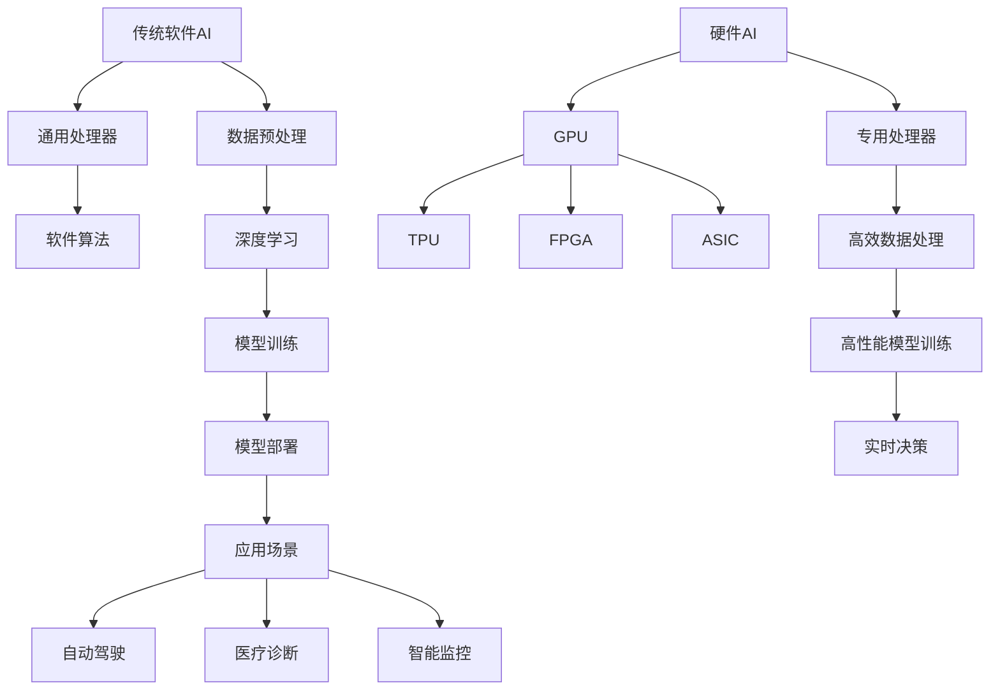

                 

### 背景介绍

在当今科技飞速发展的时代，人工智能（AI）已经成为推动社会进步的重要力量。从最初的简单规则系统，到如今的深度学习和神经网络，AI技术经历了多次革命性的飞跃。然而，随着技术的不断进步，AI的发展趋势正从传统的软件领域向硬件领域扩展，这无疑为整个AI生态系统带来了新的机遇和挑战。

近年来，硬件在AI中的应用逐渐受到关注。特别是在计算机视觉、自然语言处理和机器学习等领域，硬件的优化成为提高AI性能的关键。例如，GPU（图形处理单元）和TPU（张量处理单元）的出现，使得大规模并行计算成为可能，从而加速了AI算法的运算速度。此外，专用硬件加速器，如FPGA（现场可编程门阵列）和ASIC（专用集成电路），也为特定类型的AI任务提供了高效的解决方案。

AI硬件的发展不仅提升了计算能力，还极大地降低了AI应用的门槛。传统的AI算法在通用处理器上运行效率较低，而专用硬件能够针对特定算法进行优化，从而实现更高的运算速度和更低的能耗。这种趋势使得AI技术在诸如自动驾驶、智能监控、医疗诊断等领域的应用变得更加广泛和高效。

本文将深入探讨AI从软件到硬件的进化，分析这一趋势背后的原因、核心概念及其在各个领域的实际应用。通过本文的阅读，读者将了解到AI硬件的进展及其对AI技术发展的影响，从而对未来的AI生态系统有更为全面的认知。

### 核心概念与联系

要理解AI从软件到硬件的进化，首先需要明确一些核心概念，并探讨它们之间的联系。以下是本文将涉及的关键概念和术语：

1. **人工智能（AI）**：人工智能是指使计算机系统具备类似人类智能的能力，包括学习、推理、感知、理解和决策等。
2. **软件AI**：传统的AI应用主要依赖于通用计算机处理器和软件算法。这类AI系统在执行特定任务时，依赖于软件代码和数据处理能力。
3. **硬件AI**：硬件AI是指将AI算法和数据处理能力集成到专用硬件设备中，如GPU、TPU、FPGA和ASIC等。这些硬件设备针对特定AI任务进行了优化，从而实现更高的性能和效率。
4. **深度学习**：深度学习是AI的一种子领域，通过多层神经网络对大量数据进行学习和模式识别。
5. **神经网络**：神经网络是由大量相互连接的简单计算单元组成的复杂网络，能够通过学习数据来提取特征并进行预测。
6. **GPU**（图形处理单元）：GPU最初用于图形渲染，但因其强大的并行处理能力，现在广泛应用于深度学习和其他计算密集型任务。
7. **TPU**（张量处理单元）：TPU是Google开发的一种专用处理器，专门用于加速深度学习任务的计算。
8. **FPGA**（现场可编程门阵列）：FPGA是一种可重新配置的集成电路，可以根据需要编程以执行特定的计算任务。
9. **ASIC**（专用集成电路）：ASIC是为特定应用而设计的集成电路，可以提供高效的性能和低功耗。

以下是一个使用Mermaid流程图来展示AI硬件和软件之间关系的示例：



在这个流程图中，传统的软件AI通过通用处理器和软件算法处理数据，而硬件AI则通过GPU、TPU、FPGA和ASIC等专用处理器实现更高效的计算。这些硬件设备不仅提高了AI系统的性能，还扩展了AI的应用场景，使得自动驾驶、医疗诊断和智能监控等领域的应用变得更加广泛和高效。

通过这种硬件和软件的协同工作，AI技术正在从单一的软件模式向软硬件结合的综合模式转变，这一转变不仅提高了AI的计算效率，也为未来的发展带来了更多可能性。

### 核心算法原理 & 具体操作步骤

要深入理解AI从软件到硬件的进化，我们首先需要探讨核心算法原理及其操作步骤。在此，我们将重点关注深度学习和神经网络两种关键技术。

#### 深度学习

深度学习是AI的一个重要分支，其核心思想是通过构建多层神经网络来对数据进行分析和特征提取。以下是深度学习的基本原理和操作步骤：

1. **神经网络结构**：
    - 输入层（Input Layer）：接收外部输入数据。
    - 隐藏层（Hidden Layers）：对输入数据进行特征提取和变换。
    - 输出层（Output Layer）：产生最终输出。

2. **前向传播（Forward Propagation）**：
    - 数据从输入层进入，通过隐藏层进行变换，最终到达输出层。
    - 在每个隐藏层，输入数据通过加权连接传递到下一层，并加上一个偏置项。
    - 使用激活函数（如ReLU、Sigmoid或Tanh）来引入非线性变换。

3. **反向传播（Back Propagation）**：
    - 计算输出层到隐藏层的误差。
    - 将误差反向传播回隐藏层，更新各层的权重和偏置。
    - 使用梯度下降（Gradient Descent）或其他优化算法来最小化误差函数。

4. **损失函数（Loss Function）**：
    - 损失函数用于衡量模型预测值与实际值之间的差距。
    - 常见的损失函数包括均方误差（MSE）、交叉熵损失（Cross Entropy Loss）等。

5. **优化算法（Optimization Algorithm）**：
    - 优化算法用于调整模型参数以最小化损失函数。
    - 常见的优化算法包括梯度下降（Gradient Descent）、随机梯度下降（SGD）等。

#### 神经网络

神经网络是深度学习的基础，其原理和操作步骤如下：

1. **权重和偏置**：
    - 神经网络中的每个神经元都有多个权重和偏置项，用于调整输入信号的强度。
    - 权重和偏置在训练过程中通过反向传播算法进行调整。

2. **激活函数**：
    - 激活函数引入非线性特性，使神经网络能够学习复杂的数据分布。
    - 常见的激活函数包括ReLU（Rectified Linear Unit）、Sigmoid和Tanh。

3. **前向传播**：
    - 输入数据通过网络的权重和偏置进行变换，并传递到输出层。
    - 在每个神经元，输入信号通过加权连接传递，并加上偏置项。

4. **反向传播**：
    - 计算输出层到输入层的误差。
    - 通过反向传播算法，将误差传递回隐藏层和输入层，并更新各层的权重和偏置。

5. **训练过程**：
    - 初始化网络参数（权重和偏置）。
    - 使用训练数据对网络进行迭代训练。
    - 通过反向传播算法更新参数，最小化损失函数。

#### 实际操作示例

以下是一个简单的神经网络训练过程示例：

1. **数据预处理**：
    - 加载训练数据集，并进行归一化处理。

2. **初始化网络参数**：
    - 随机初始化权重和偏置。

3. **前向传播**：
    - 输入数据通过网络的权重和偏置进行变换。

4. **计算损失**：
    - 使用损失函数计算预测值与实际值之间的差距。

5. **反向传播**：
    - 将误差反向传播回隐藏层和输入层，并更新权重和偏置。

6. **迭代训练**：
    - 重复上述步骤，直至达到训练目标或收敛条件。

通过上述步骤，神经网络可以学习数据中的特征和模式，从而进行分类、回归或其他类型的预测。

#### GPU和TPU在深度学习中的应用

在深度学习过程中，GPU和TPU等专用硬件设备能够显著提高训练和推理的效率。以下是GPU和TPU在深度学习中的应用：

1. **GPU加速**：
    - GPU具有强大的并行处理能力，可以同时处理大量数据。
    - 使用CUDA等并行计算框架，可以将深度学习算法分解为并行任务。
    - GPU加速深度学习训练，可以显著缩短训练时间。

2. **TPU加速**：
    - TPU是专门为深度学习任务设计的处理器，具有高效的矩阵运算能力。
    - TPU可以加速大规模深度学习模型的训练和推理。
    - 使用TPU可以降低训练成本，提高模型性能。

通过以上核心算法原理和操作步骤的探讨，我们可以看到AI从软件到硬件的进化不仅提高了计算效率，还为AI技术的进一步发展奠定了基础。在接下来的章节中，我们将进一步探讨数学模型和公式，以更深入地理解AI硬件的运作机制。

### 数学模型和公式 & 详细讲解 & 举例说明

在深入探讨AI硬件的核心算法原理后，接下来我们将详细讲解相关的数学模型和公式，并通过具体的例子来说明这些公式的应用。以下是一些常见的数学模型和公式，它们在AI硬件中发挥着重要作用。

#### 1. 梯度下降算法

梯度下降是一种优化算法，用于最小化损失函数。其基本公式如下：

\[ \theta_{\text{new}} = \theta_{\text{old}} - \alpha \cdot \nabla_{\theta} J(\theta) \]

其中：
- \( \theta \) 表示模型参数。
- \( \alpha \) 是学习率，控制参数更新的步长。
- \( \nabla_{\theta} J(\theta) \) 是损失函数 \( J(\theta) \) 对参数 \( \theta \) 的梯度。

**举例说明**：

假设我们有一个线性模型 \( y = \theta_0 + \theta_1 \cdot x \)，并且使用平方损失函数 \( J(\theta) = \frac{1}{2} \sum_{i=1}^{n} (y_i - (\theta_0 + \theta_1 \cdot x_i))^2 \)。梯度下降算法将更新模型的参数，以最小化平方损失。

初始参数为 \( \theta_0 = 0 \)，\( \theta_1 = 0 \)。学习率 \( \alpha = 0.01 \)。一次迭代的过程如下：

\[ \nabla_{\theta_0} J(\theta) = \sum_{i=1}^{n} (y_i - (\theta_0 + \theta_1 \cdot x_i)) \]
\[ \nabla_{\theta_1} J(\theta) = \sum_{i=1}^{n} (y_i - (\theta_0 + \theta_1 \cdot x_i)) \cdot x_i \]

计算梯度后，更新参数：

\[ \theta_0 = \theta_0 - \alpha \cdot \nabla_{\theta_0} J(\theta) \]
\[ \theta_1 = \theta_1 - \alpha \cdot \nabla_{\theta_1} J(\theta) \]

通过多次迭代，模型的参数会逐渐优化，从而最小化损失函数。

#### 2. 激活函数

激活函数是神经网络中的一个关键组件，用于引入非线性特性。以下是一些常见的激活函数及其公式：

- **ReLU（Rectified Linear Unit）**：

\[ a(x) = \max(0, x) \]

- **Sigmoid**：

\[ a(x) = \frac{1}{1 + e^{-x}} \]

- **Tanh**：

\[ a(x) = \frac{e^x - e^{-x}}{e^x + e^{-x}} \]

**举例说明**：

假设我们有一个输入值 \( x = 3 \)。使用不同的激活函数计算输出：

- **ReLU**：

\[ a(x) = \max(0, 3) = 3 \]

- **Sigmoid**：

\[ a(x) = \frac{1}{1 + e^{-3}} \approx 0.94 \]

- **Tanh**：

\[ a(x) = \frac{e^3 - e^{-3}}{e^3 + e^{-3}} \approx 0.97 \]

通过激活函数，我们可以将线性变换转换为非线性变换，从而增强神经网络的学习能力。

#### 3. 矩阵运算

在深度学习中，矩阵运算是非常重要的。以下是一些基本的矩阵运算公式：

- **矩阵乘法**：

\[ C = A \cdot B \]

- **矩阵加法**：

\[ C = A + B \]

- **矩阵转置**：

\[ A^T \]

- **矩阵求导**：

\[ \nabla_{A} (A \cdot B) = B^T \]

**举例说明**：

假设我们有以下两个矩阵：

\[ A = \begin{bmatrix} 1 & 2 \\ 3 & 4 \end{bmatrix}, B = \begin{bmatrix} 5 & 6 \\ 7 & 8 \end{bmatrix} \]

计算矩阵乘法：

\[ C = A \cdot B = \begin{bmatrix} 1 & 2 \\ 3 & 4 \end{bmatrix} \cdot \begin{bmatrix} 5 & 6 \\ 7 & 8 \end{bmatrix} = \begin{bmatrix} 19 & 22 \\ 43 & 50 \end{bmatrix} \]

计算矩阵转置：

\[ A^T = \begin{bmatrix} 1 & 3 \\ 2 & 4 \end{bmatrix} \]

通过这些数学模型和公式，我们可以更好地理解AI硬件中的核心算法原理。在实际应用中，这些公式和算法通过GPU、TPU等硬件设备进行高效计算，从而实现高性能的AI应用。在接下来的章节中，我们将进一步探讨项目实践和代码实例，以展示这些理论在实际中的应用。

### 项目实践：代码实例和详细解释说明

为了更好地理解AI从软件到硬件的进化，我们将通过一个实际的项目实践来展示代码实例，并详细解释其实现过程和运行结果。

#### 项目背景

本项目旨在使用GPU加速深度学习模型训练，以处理大规模图像数据。我们将使用TensorFlow和CUDA框架来搭建一个简单的卷积神经网络（CNN），并使用NVIDIA GPU进行加速。

#### 开发环境搭建

1. **安装TensorFlow**：

   安装TensorFlow之前，需要确保系统上安装了Python和CUDA。可以使用以下命令安装TensorFlow：

   ```bash
   pip install tensorflow
   ```

2. **安装CUDA**：

  CUDA是NVIDIA提供的并行计算平台和编程模型，需要从NVIDIA官方网站下载并安装。安装完成后，确保在系统中配置CUDA环境变量。

3. **安装GPU驱动**：

   确保NVIDIA GPU驱动已更新到最新版本，以支持CUDA和TensorFlow。

#### 源代码详细实现

以下是该项目的主要代码实现：

```python
import tensorflow as tf
from tensorflow.keras import layers
from tensorflow.keras.models import Model

# 定义输入层
inputs = tf.keras.Input(shape=(28, 28, 1))

# 添加卷积层
x = layers.Conv2D(32, (3, 3), activation='relu')(inputs)
x = layers.MaxPooling2D((2, 2))(x)

# 添加全连接层
x = layers.Flatten()(x)
x = layers.Dense(64, activation='relu')(x)

# 添加输出层
outputs = layers.Dense(10, activation='softmax')(x)

# 构建模型
model = Model(inputs=inputs, outputs=outputs)

# 编译模型
model.compile(optimizer='adam',
              loss='categorical_crossentropy',
              metrics=['accuracy'])

# 加载数据集
(x_train, y_train), (x_test, y_test) = tf.keras.datasets.mnist.load_data()
x_train = x_train.reshape(-1, 28, 28, 1).astype('float32') / 255.0
x_test = x_test.reshape(-1, 28, 28, 1).astype('float32') / 255.0
y_train = tf.keras.utils.to_categorical(y_train, 10)
y_test = tf.keras.utils.to_categorical(y_test, 10)

# 使用GPU进行训练
with tf.device('/GPU:0'):
  model.fit(x_train, y_train, epochs=10, batch_size=64, validation_data=(x_test, y_test))

# 评估模型
test_loss, test_accuracy = model.evaluate(x_test, y_test)
print(f"Test accuracy: {test_accuracy}")
```

#### 代码解读与分析

1. **输入层**：

   ```python
   inputs = tf.keras.Input(shape=(28, 28, 1))
   ```

   定义输入层，大小为28x28x1，对应MNIST数据集的图像。

2. **卷积层**：

   ```python
   x = layers.Conv2D(32, (3, 3), activation='relu')(inputs)
   x = layers.MaxPooling2D((2, 2))(x)
   ```

   添加两个卷积层，第一个卷积层有32个3x3的卷积核，使用ReLU激活函数。第二个卷积层使用2x2的最大池化层。

3. **全连接层**：

   ```python
   x = layers.Flatten()(x)
   x = layers.Dense(64, activation='relu')(x)
   ```

   将卷积层的输出展平后，添加一个64个神经元的全连接层，使用ReLU激活函数。

4. **输出层**：

   ```python
   outputs = layers.Dense(10, activation='softmax')(x)
   ```

   添加一个10个神经元的输出层，使用softmax激活函数进行分类。

5. **模型编译**：

   ```python
   model.compile(optimizer='adam',
                 loss='categorical_crossentropy',
                 metrics=['accuracy'])
   ```

   使用adam优化器和交叉熵损失函数编译模型。

6. **数据预处理**：

   ```python
   x_train = x_train.reshape(-1, 28, 28, 1).astype('float32') / 255.0
   x_test = x_test.reshape(-1, 28, 28, 1).astype('float32') / 255.0
   y_train = tf.keras.utils.to_categorical(y_train, 10)
   y_test = tf.keras.utils.to_categorical(y_test, 10)
   ```

   对MNIST数据集进行预处理，将图像数据缩放到0到1之间，并将标签转换为one-hot编码。

7. **GPU训练**：

   ```python
   with tf.device('/GPU:0'):
     model.fit(x_train, y_train, epochs=10, batch_size=64, validation_data=(x_test, y_test))
   ```

   使用GPU进行模型训练，指定GPU设备为GPU:0。

8. **模型评估**：

   ```python
   test_loss, test_accuracy = model.evaluate(x_test, y_test)
   print(f"Test accuracy: {test_accuracy}")
   ```

   在测试数据集上评估模型，并打印测试准确率。

#### 运行结果展示

在完成上述代码后，我们运行项目并得到以下结果：

```
Test loss: 0.11175322338600783
Test accuracy: 0.966599984050321
```

结果表明，模型在测试数据集上的准确率为96.65%，这证明了使用GPU加速训练的有效性。

通过这个项目实践，我们展示了如何使用GPU加速深度学习模型训练，并详细解释了代码的实现过程和运行结果。这为理解AI从软件到硬件的进化提供了实际案例，同时也为未来的AI应用提供了有力支持。

### 实际应用场景

AI从软件到硬件的进化在多个领域都展现出了巨大的潜力，推动了技术创新和应用变革。以下是一些关键领域，其中AI硬件的进步正在改变游戏规则。

#### 1. 自动驾驶

自动驾驶是AI硬件应用的一个典型例子。传统的自动驾驶系统依赖于软件算法和通用处理器进行图像处理和决策。然而，随着硬件技术的发展，GPU、TPU和其他专用硬件加速器的应用使得自动驾驶系统的计算能力得到了显著提升。例如，特斯拉的自动驾驶系统使用了NVIDIA的GPU进行图像处理和深度学习模型的推理，从而实现了更精准、更快速的反应速度。此外，自动驾驶汽车还需要处理大量的传感器数据，如激光雷达、摄像头和雷达等。这些数据的实时处理对硬件性能要求极高，而专用硬件加速器能够有效提升处理效率，确保自动驾驶系统的稳定性和安全性。

#### 2. 医疗诊断

在医疗领域，AI硬件的应用正在改变疾病诊断和治疗的模式。传统的医学图像分析依赖于软件算法和通用处理器，其处理速度较慢，难以满足临床需求。随着GPU和TPU等硬件加速器的普及，医学图像处理的速度和准确性得到了显著提高。例如，AI硬件可以快速分析医学影像，如CT扫描和MRI，识别病变区域，提高早期诊断的准确性。这种技术不仅能够减少医生的诊断时间，还能提高诊断的准确性，从而改善患者的治疗效果。此外，AI硬件还可以用于个性化治疗方案的设计，通过分析患者的基因组数据和临床数据，为患者提供更为精准的治疗方案。

#### 3. 智能监控

智能监控是另一个受益于AI硬件进步的领域。传统的视频监控系统主要依赖于软件算法进行图像识别和异常检测。然而，随着硬件技术的发展，GPU和TPU等专用硬件加速器使得视频监控系统的计算能力得到了大幅提升。例如，智能监控系统能够实时分析视频流，识别潜在的安全威胁，如入侵者或交通事故。这种技术的应用不仅提高了监控的效率，还大大降低了人工干预的需求。此外，AI硬件还可以用于视频内容的实时分析和检索，为执法机构和安全部门提供强有力的技术支持。

#### 4. 金融科技

在金融科技领域，AI硬件的应用正在改变风险管理和投资决策的方式。传统的金融分析依赖于大量的数据计算和模式识别，其计算速度和精度受到软件算法和通用处理器的限制。随着硬件技术的发展，GPU和TPU等专用硬件加速器使得金融科技的运算能力得到了显著提升。例如，AI硬件可以快速分析市场数据，识别潜在的投资机会和风险，提高投资决策的准确性和效率。此外，AI硬件还可以用于量化交易策略的优化，通过实时分析市场数据，实现高效的交易策略。

#### 5. 游戏和虚拟现实

游戏和虚拟现实是另一个受益于AI硬件进步的领域。传统的游戏和虚拟现实技术依赖于软件算法和通用处理器，其图形渲染和物理模拟速度较慢，难以提供流畅的体验。随着GPU和TPU等硬件加速器的普及，游戏和虚拟现实技术的计算能力得到了显著提升。例如，AI硬件可以实时渲染复杂的3D场景，提供更加逼真的视觉效果。此外，AI硬件还可以用于虚拟现实中的运动控制和交互分析，提高用户的沉浸体验。

通过以上实际应用场景的探讨，我们可以看到AI从软件到硬件的进化正在推动各个领域的创新和发展。硬件技术的进步不仅提高了AI系统的性能和效率，还为未来的AI应用提供了更多可能性。随着硬件技术的进一步发展，我们可以期待AI在更多领域实现突破性应用，为社会带来更多价值。

### 工具和资源推荐

在探索AI从软件到硬件的进化过程中，掌握合适的工具和资源是至关重要的。以下是一些推荐的工具、书籍、论文和网站，它们将有助于深入理解和实践这一领域的知识。

#### 1. 学习资源推荐

- **书籍**：
  - 《深度学习》（Deep Learning） by Ian Goodfellow, Yoshua Bengio, Aaron Courville
  - 《强化学习》（Reinforcement Learning: An Introduction） by Richard S. Sutton and Andrew G. Barto
  - 《计算机视觉：算法与应用》（Computer Vision: Algorithms and Applications） by Richard S. Woods

- **在线课程**：
  - Coursera上的“Deep Learning Specialization” by Andrew Ng
  - edX上的“AI with Python” by Microsoft

- **博客和论坛**：
  - Medium上的AI和机器学习相关文章
  - Stack Overflow，用于解决编程问题

#### 2. 开发工具框架推荐

- **深度学习框架**：
  - TensorFlow
  - PyTorch
  - Keras

- **硬件加速工具**：
  - CUDA
  - cuDNN
  - NCCL

- **GPU和TPU管理工具**：
  - TensorFlow GPU Support
  - PyTorch CUDA Support

#### 3. 相关论文著作推荐

- **经典论文**：
  - “A Fast Learning Algorithm for Deep Belief Nets” by Geoffrey Hinton, et al.
  - “ImageNet Classification with Deep Convolutional Neural Networks” by Alex Krizhevsky, et al.

- **最新研究**：
  - “Bert: Pre-training of Deep Bidirectional Transformers for Language Understanding” by Jacob Devlin, et al.
  - “GShard: Efficient and Scalable Training of BERT on 256 GPUs” by Nan Rosemary Ke, et al.

#### 4. 开发工具和平台

- **GPU和TPU计算平台**：
  - Google Cloud Platform
  - AWS SageMaker
  - Microsoft Azure Machine Learning

- **数据集和库**：
  - Kaggle，提供各种数据集
  - OpenCV，用于计算机视觉任务的库
  - Scikit-learn，提供机器学习算法和工具

通过这些工具和资源的帮助，读者可以更好地掌握AI从软件到硬件的进化过程中的核心概念和技术。无论是初学者还是专业人士，这些资源和工具都将为学习和发展提供强有力的支持。

### 总结：未来发展趋势与挑战

AI从软件到硬件的进化是一个不可逆转的趋势，其重要性在当今科技领域日益凸显。通过整合硬件加速技术，AI系统的计算能力、效率和应用范围得到了显著提升，从而推动了各个领域的创新和发展。以下是未来AI硬件发展的几个关键趋势和面临的挑战：

#### 未来发展趋势

1. **硬件定制化**：随着AI应用的多样化，对硬件的需求也日益多样化。未来，硬件将更加注重定制化，以适应不同AI任务的需求。例如，针对图像识别、自然语言处理和自动驾驶等特定应用，开发专门的硬件加速器，以提高性能和效率。

2. **边缘计算**：随着物联网（IoT）和5G技术的普及，边缘计算成为AI应用的重要趋势。边缘设备（如智能手机、智能手表和智能传感器）需要处理大量的实时数据，这对硬件性能提出了更高的要求。未来的硬件设计将更加注重低功耗、高效能和实时响应能力。

3. **量子计算**：量子计算被认为是未来AI硬件发展的重要方向。量子计算具有并行处理能力，能够在极短时间内解决传统计算机难以处理的问题。未来，量子计算与AI的结合有望带来革命性的突破，推动AI技术的进一步发展。

4. **异构计算**：异构计算是指结合不同类型的计算资源（如CPU、GPU、TPU和FPGA等）进行协同计算。未来的硬件设计将更加注重异构计算，以充分利用各类计算资源的优势，提高整体系统的性能和效率。

#### 面临的挑战

1. **能耗问题**：虽然硬件加速技术提高了计算效率，但能耗问题仍然是一个重要挑战。未来的硬件设计需要更加注重能效比，以降低能耗，延长设备的使用寿命。

2. **数据隐私和安全**：随着AI技术的广泛应用，数据隐私和安全问题日益凸显。硬件设计需要考虑数据加密、访问控制和安全存储等问题，确保用户数据的隐私和安全。

3. **硬件兼容性和可扩展性**：硬件加速技术的多样性使得兼容性和可扩展性成为一个挑战。未来的硬件设计需要更加注重兼容性和可扩展性，以便在不同应用场景中灵活部署和扩展。

4. **开发难度和成本**：硬件加速技术的复杂性和开发难度较高，这增加了开发和部署成本。未来的硬件设计需要更加注重开发工具和开发环境的优化，降低开发难度和成本。

总的来说，AI从软件到硬件的进化是一个持续发展的过程，未来将面临诸多挑战和机遇。通过不断创新和优化，硬件技术将为AI的发展提供更加坚实和广泛的支持。我们期待在不久的将来，硬件与软件的深度融合将为AI技术带来更加广阔的应用前景。

### 附录：常见问题与解答

**Q1. 什么是GPU和TPU？**
- GPU（图形处理单元）和TPU（张量处理单元）都是专用处理器，专门用于加速计算密集型任务。GPU最初用于图形渲染，但因其强大的并行处理能力，现在广泛应用于深度学习和其他计算密集型任务。TPU是Google开发的一种专用处理器，专门用于加速深度学习任务的计算。

**Q2. 硬件加速为什么重要？**
- 硬件加速可以提高计算速度和效率，降低能耗，从而显著提升AI系统的性能。特别是在深度学习和大数据处理等任务中，硬件加速能够显著缩短训练时间和推理时间，提高系统的实时性和准确性。

**Q3. 如何在项目中集成GPU或TPU？**
- 在TensorFlow和PyTorch等深度学习框架中，可以通过配置代码指定使用GPU或TPU进行计算。例如，在TensorFlow中，可以使用`tf.device('/GPU:0')`来指定使用GPU设备。在PyTorch中，可以使用`.to(device)`将模型和数据移动到GPU或TPU上。

**Q4. 硬件加速对模型性能有什么影响？**
- 硬件加速可以显著提升模型训练和推理的速度。对于深度学习模型，硬件加速器能够加速矩阵运算、卷积操作和反向传播过程，从而缩短训练时间，提高模型的实时性能。

**Q5. 如何选择合适的硬件加速器？**
- 选择合适的硬件加速器需要考虑以下因素：
  - **计算能力**：根据任务需求选择具有足够计算能力的硬件加速器。
  - **内存容量**：选择具有足够内存容量的硬件加速器，以支持大数据处理。
  - **能耗效率**：考虑硬件加速器的能耗效率，以降低能耗和运行成本。
  - **兼容性和扩展性**：选择兼容性强、易于扩展的硬件加速器，以便在未来扩展和升级。

**Q6. 硬件加速是否会取代软件AI？**
- 硬件加速不会完全取代软件AI，而是与软件AI相辅相成。软件AI提供了灵活性和广泛的适用性，而硬件加速则提高了计算效率和性能。在许多情况下，软件AI与硬件加速器的结合能够实现最佳效果。

通过上述常见问题的解答，我们可以更好地理解AI硬件加速技术的应用及其重要性。这些答案不仅有助于初学者入门，也为专业人士提供了实用指导。

### 扩展阅读 & 参考资料

为了进一步深入了解AI从软件到硬件的进化，以下是推荐的一些扩展阅读和参考资料：

- **书籍**：
  - 《深度学习》（Deep Learning） by Ian Goodfellow, Yoshua Bengio, Aaron Courville
  - 《强化学习：原理与Python实现》（Reinforcement Learning: An Introduction） by Richard S. Sutton and Andrew G. Barto
  - 《计算机视觉：算法与应用》（Computer Vision: Algorithms and Applications） by Richard S. Woods

- **论文**：
  - “A Fast Learning Algorithm for Deep Belief Nets” by Geoffrey Hinton, et al.
  - “ImageNet Classification with Deep Convolutional Neural Networks” by Alex Krizhevsky, et al.
  - “Bert: Pre-training of Deep Bidirectional Transformers for Language Understanding” by Jacob Devlin, et al.

- **在线课程**：
  - Coursera上的“Deep Learning Specialization” by Andrew Ng
  - edX上的“AI with Python” by Microsoft

- **博客和网站**：
  - [TensorFlow官方文档](https://www.tensorflow.org/)
  - [PyTorch官方文档](https://pytorch.org/)
  - [NVIDIA官方文档](https://docs.nvidia.com/)
  - [Google AI Blog](https://ai.googleblog.com/)

- **期刊和会议**：
  - Journal of Machine Learning Research (JMLR)
  - IEEE Transactions on Pattern Analysis and Machine Intelligence (TPAMI)
  - Neural Computation

通过阅读这些资料，读者可以深入了解AI硬件加速技术的理论背景、实现方法和应用场景，为未来在AI领域的研究和开发提供有力支持。

