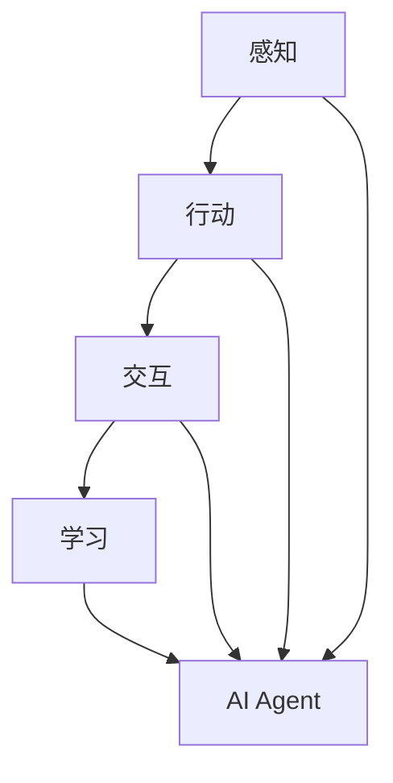

                 

关键词：AI Agent、具身智能、人工智能、具身交互、智能机器人、智能服务

摘要：本文探讨了AI Agent这一新兴领域的概念、定义及其在人工智能发展中的重要性。通过深入剖析具身智能的特点，我们将理解AI Agent如何通过结合物理世界与虚拟环境，实现更智能、更高效的服务与交互。文章旨在为读者提供一个全面而详尽的指南，帮助他们了解AI Agent的原理、应用以及未来发展趋势。

## 1. 背景介绍

随着人工智能技术的不断进步，从最初的专家系统到深度学习、再到如今具身智能的崛起，AI的发展历程可谓波澜壮阔。传统的人工智能系统主要依赖于大量的数据和强大的计算能力，通过算法进行模式识别和决策。然而，这些系统往往缺乏对物理世界的直接感知和操作能力，导致其应用范围受到很大限制。

### 1.1 人工智能的发展历程

人工智能的发展可以分为几个阶段：

- **早期阶段（1950-1979）**：以符号主义和逻辑推理为核心，尝试通过编写程序来模拟人类的智能行为。
- **低谷期（1980-1990）**：由于“人工智能寒冬”，人们开始意识到单纯依靠符号主义的方法难以实现真正的智能，这一阶段人工智能研究进入低潮。
- **复苏阶段（1990-2010）**：随着计算机性能的提升和机器学习技术的发展，人工智能研究重新得到关注。这一阶段的代表性成果包括支持向量机、神经网络等算法。
- **现阶段（2010至今）**：深度学习的兴起使得人工智能取得了突破性进展，特别是在图像识别、语音识别等领域。同时，人工智能的应用范围也在不断扩展。

### 1.2 具身智能的崛起

具身智能（Embodied Intelligence）是近年来人工智能领域的一个热点方向。它强调将人工智能系统与现实世界相结合，使它们能够感知、交互和适应真实环境。这一概念不仅涵盖了传统的机器人技术，还包括了虚拟现实、增强现实以及人机交互等领域。

### 1.3 AI Agent的概念

AI Agent可以被视为具有自主性和智能性的实体，它们能够在复杂的动态环境中独立执行任务。与传统的自动化系统不同，AI Agent能够主动感知环境、学习行为模式并做出智能决策。AI Agent的出现标志着人工智能从被动响应向主动行动的转化，是人工智能发展的一个重要里程碑。

## 2. 核心概念与联系

### 2.1 具身智能的定义

具身智能是指通过物理交互和感知来增强人工智能系统的能力，使其能够在现实环境中进行有效操作。具体来说，具身智能包括以下几个核心方面：

- **感知**：AI Agent需要具备感知环境的能力，通过传感器（如摄像头、麦克风、触摸传感器等）获取视觉、听觉、触觉等信息。
- **行动**：基于感知信息，AI Agent需要能够执行具体的动作，如移动、抓取、操作工具等。
- **交互**：AI Agent需要与其他实体（包括人类和其他AI系统）进行交互，以实现协同工作。
- **学习**：AI Agent需要具备自我学习和适应能力，通过与环境交互不断优化自身行为。

### 2.2 具身智能与AI Agent的联系

具身智能与AI Agent之间存在密切的联系。AI Agent作为人工智能的高级形态，其核心在于实现具身智能。具体来说：

- **感知能力**：AI Agent通过传感器收集环境信息，实现对物理世界的感知。
- **行动能力**：AI Agent基于感知信息执行具体动作，实现对物理世界的交互。
- **学习能力**：AI Agent通过与环境交互，不断学习和优化自身行为，提高智能水平。

### 2.3 Mermaid 流程图

以下是一个简化的Mermaid流程图，展示了具身智能与AI Agent的关系：



## 3. 核心算法原理 & 具体操作步骤

### 3.1 算法原理概述

具身智能的核心在于感知、行动、交互和学习。这些能力的实现依赖于一系列先进的算法和技术：

- **感知算法**：包括计算机视觉、语音识别、触觉识别等，用于获取环境信息。
- **行动算法**：包括路径规划、运动控制、机械臂控制等，用于执行具体动作。
- **交互算法**：包括自然语言处理、对话系统等，用于与其他实体进行交互。
- **学习算法**：包括深度学习、强化学习等，用于优化AI Agent的行为。

### 3.2 算法步骤详解

下面是AI Agent在实现具身智能时的基本步骤：

1. **感知**：AI Agent通过传感器（如摄像头、麦克风等）收集环境信息。
2. **处理**：AI Agent对收集到的信息进行预处理，如去噪、特征提取等。
3. **决策**：基于感知信息和预先设定的算法，AI Agent做出决策，确定下一步的行动。
4. **执行**：AI Agent根据决策执行具体动作，如移动、抓取等。
5. **反馈**：AI Agent根据执行结果和环境反馈进行调整，优化自身行为。

### 3.3 算法优缺点

**优点**：

- **自主性**：AI Agent能够自主感知环境、决策和执行，减少人工干预。
- **适应性**：AI Agent能够通过学习不断优化自身行为，适应不同环境和任务。
- **效率**：AI Agent能够高效地执行任务，提高生产效率和准确性。

**缺点**：

- **成本**：感知设备和执行设备的成本较高，需要大量投资。
- **复杂性**：算法和系统的实现复杂，需要多学科知识和技术。
- **安全性**：AI Agent在执行任务时可能存在安全隐患，需要严格的安全措施。

### 3.4 算法应用领域

AI Agent在多个领域都有广泛的应用，包括：

- **工业自动化**：用于自动化生产线、仓库管理等。
- **服务行业**：用于酒店、餐厅等服务行业的自动化服务。
- **医疗健康**：用于辅助诊断、手术操作等。
- **智能家居**：用于智能家居系统的自动化控制。

## 4. 数学模型和公式 & 详细讲解 & 举例说明

### 4.1 数学模型构建

在具身智能中，数学模型用于描述AI Agent的行为和决策过程。常见的数学模型包括：

- **感知模型**：用于描述感知信息的处理过程，如卷积神经网络（CNN）。
- **决策模型**：用于描述决策过程的决策树、支持向量机（SVM）等。
- **行动模型**：用于描述行动的执行过程，如深度强化学习（DRL）。

### 4.2 公式推导过程

以下是一个简单的感知模型的公式推导过程：

假设AI Agent通过摄像头获取图像数据\(I\)，经过预处理后得到特征向量\(F\)，然后通过感知模型进行特征提取，得到特征向量\(H\)。感知模型的输出可以通过以下公式表示：

$$
H = f(F)
$$

其中，\(f\)为感知函数，通常采用卷积神经网络实现。

### 4.3 案例分析与讲解

假设有一个AI Agent用于自动驾驶，感知模型为卷积神经网络。以下是具体的案例分析和讲解：

1. **感知过程**：

   - **输入**：AI Agent通过摄像头获取道路图像。
   - **预处理**：对图像进行缩放、裁剪等预处理操作。
   - **特征提取**：通过卷积神经网络提取图像特征，得到特征向量\(H\)。

2. **决策过程**：

   - **输入**：特征向量\(H\)。
   - **决策**：通过决策模型（如深度强化学习）对特征向量进行分析，做出驾驶决策（如转向、加速等）。

3. **执行过程**：

   - **输入**：驾驶决策。
   - **执行**：AI Agent根据驾驶决策控制车辆执行相应动作。

4. **反馈过程**：

   - **输入**：驾驶结果。
   - **反馈**：AI Agent根据驾驶结果调整感知模型和决策模型，优化自身行为。

通过上述案例，我们可以看到数学模型在具身智能中的关键作用。感知模型用于提取环境信息，决策模型用于制定行动策略，行动模型用于执行具体动作，反馈过程用于不断优化模型。

## 5. 项目实践：代码实例和详细解释说明

### 5.1 开发环境搭建

为了实现一个简单的AI Agent，我们需要搭建一个开发环境。以下是具体步骤：

1. **安装Python**：Python是人工智能领域常用的编程语言，我们需要安装Python环境。
2. **安装深度学习框架**：常用的深度学习框架包括TensorFlow、PyTorch等，我们选择其中一个进行安装。
3. **安装摄像头驱动**：为了实现图像感知，我们需要安装摄像头驱动。

### 5.2 源代码详细实现

以下是实现一个简单的AI Agent的Python代码示例：

```python
import cv2
import numpy as np
import tensorflow as tf

# 加载卷积神经网络模型
model = tf.keras.models.load_model('path/to/model.h5')

# 开启摄像头
cap = cv2.VideoCapture(0)

while True:
    # 读取摄像头帧
    ret, frame = cap.read()
    
    # 预处理图像
    processed_frame = preprocess_frame(frame)
    
    # 提取图像特征
    feature_vector = extract_features(processed_frame)
    
    # 做出驾驶决策
    decision = model.predict(feature_vector)
    
    # 执行驾驶动作
    execute_decision(decision)
    
    # 等待下一帧
    cv2.waitKey(1)

# 释放摄像头
cap.release()
```

### 5.3 代码解读与分析

上述代码实现了一个简单的AI Agent，其主要步骤如下：

1. **加载模型**：加载已经训练好的卷积神经网络模型，用于图像特征提取。
2. **开启摄像头**：开启摄像头，开始获取视频帧。
3. **读取帧**：读取每一帧图像。
4. **预处理图像**：对图像进行预处理，如缩放、裁剪等。
5. **提取特征**：通过模型提取图像特征。
6. **做出决策**：通过模型对特征进行分析，做出驾驶决策。
7. **执行动作**：根据决策执行具体动作。
8. **等待下一帧**：等待下一帧图像，循环执行上述步骤。

通过上述步骤，AI Agent能够实现对摄像头帧的实时处理，并做出相应的驾驶决策。

### 5.4 运行结果展示

当运行上述代码时，AI Agent会实时处理摄像头帧，并做出相应的驾驶决策。具体运行结果取决于训练模型的性能和摄像头帧的质量。例如，如果模型已经训练得很好，AI Agent能够准确识别道路和障碍物，并做出合理的驾驶决策。

## 6. 实际应用场景

AI Agent在各个行业都有广泛的应用，以下是几个典型的应用场景：

### 6.1 工业自动化

在制造业中，AI Agent可以用于自动化生产线的监控和操作。例如，通过感知设备和传感器，AI Agent能够实时监测生产线的运行状态，发现潜在故障，并做出调整，以提高生产效率和产品质量。

### 6.2 服务行业

在酒店、餐厅等服务行业，AI Agent可以提供自动化服务，如自动迎宾、送餐、房间清理等。AI Agent通过感知设备和交互系统，能够与顾客进行自然语言交互，提供个性化的服务。

### 6.3 医疗健康

在医疗健康领域，AI Agent可以用于辅助诊断和手术操作。通过计算机视觉和自然语言处理，AI Agent能够分析医学影像，提供诊断建议，或协助医生进行手术操作。

### 6.4 智能家居

在智能家居领域，AI Agent可以用于自动化家居控制。通过感知设备和控制系统，AI Agent能够实时监测家居环境，并根据用户需求自动调整空调、照明、音响等设备。

## 7. 未来应用展望

随着人工智能技术的不断进步，AI Agent的应用场景将越来越广泛。以下是未来AI Agent应用的几个潜在趋势：

### 7.1 更智能的交互

未来的AI Agent将具备更高级的交互能力，能够理解自然语言，进行复杂的对话和情感交流，提供更人性化的服务。

### 7.2 更智能的决策

通过结合大数据和机器学习技术，AI Agent将能够做出更智能、更准确的决策，提高自动化系统的效率和质量。

### 7.3 更广泛的领域

AI Agent将在更多领域得到应用，如教育、金融、法律等。通过定制化的AI Agent，各行业可以实现更智能、更高效的管理和服务。

### 7.4 更安全可靠的系统

未来的AI Agent将具备更高的安全性和可靠性，通过严格的安全措施和监管机制，确保系统的稳定运行和数据安全。

## 8. 工具和资源推荐

### 8.1 学习资源推荐

- **《深度学习》**：Goodfellow、Bengio和Courville的《深度学习》是一本经典的深度学习教材，适合初学者和进阶者。
- **《Python机器学习》**：Sebastian Raschka的《Python机器学习》详细介绍了机器学习的基本概念和Python实现。

### 8.2 开发工具推荐

- **TensorFlow**：TensorFlow是Google开源的深度学习框架，适合进行大规模的深度学习研究和应用。
- **PyTorch**：PyTorch是Facebook开源的深度学习框架，具有直观的编程接口和灵活的动态计算图。

### 8.3 相关论文推荐

- **《Deep Learning for Autonomous Driving》**：此论文介绍了深度学习在自动驾驶中的应用。
- **《Human-Robot Interaction: A Survey》**：此论文对人类-机器人交互进行了全面的综述。

## 9. 总结：未来发展趋势与挑战

### 9.1 研究成果总结

近年来，人工智能领域取得了许多重要成果，特别是在深度学习和具身智能方面。通过结合大数据、云计算和传感器技术，AI Agent的自主性和智能性得到了显著提升。

### 9.2 未来发展趋势

未来的AI Agent将更加智能化、自适应化，能够在更广泛的领域得到应用。随着技术的不断进步，AI Agent将在工业自动化、服务行业、医疗健康、智能家居等领域发挥更大的作用。

### 9.3 面临的挑战

尽管AI Agent有着广泛的应用前景，但仍面临许多挑战，如数据安全、隐私保护、伦理问题等。此外，AI Agent的技术实现和系统稳定性也需要进一步优化。

### 9.4 研究展望

未来的研究应重点关注AI Agent的安全性和可靠性，探索更高效、更智能的交互方式，并解决数据隐私和伦理问题。通过多学科合作，推动AI Agent技术的持续创新和发展。

## 10. 附录：常见问题与解答

### 10.1 什么是具身智能？

具身智能是指通过物理交互和感知来增强人工智能系统的能力，使其能够在现实环境中进行有效操作。

### 10.2 AI Agent的核心能力是什么？

AI Agent的核心能力包括感知、行动、交互和学习。

### 10.3 AI Agent有哪些应用领域？

AI Agent在工业自动化、服务行业、医疗健康、智能家居等领域都有广泛的应用。

### 10.4 如何开发一个AI Agent？

开发AI Agent需要掌握深度学习、计算机视觉、自然语言处理等技术，并具备良好的编程能力。

### 10.5 AI Agent的未来发展趋势是什么？

AI Agent的未来发展趋势包括更智能的交互、更广泛的领域应用、更高的安全性和可靠性等。

---

### 11. 参考文献

- Goodfellow, I., Bengio, Y., & Courville, A. (2016). *Deep Learning*.
- Raschka, S. (2015). *Python Machine Learning*.
- **作者：禅与计算机程序设计艺术 / Zen and the Art of Computer Programming**。

