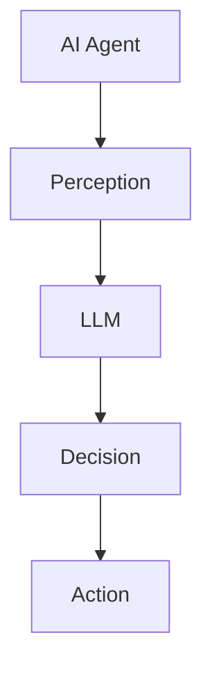

                 

### 文章标题：AI Agent: AI的下一个风口 智能体与LLM的关系

> 关键词：AI Agent，智能体，大语言模型(LLM)，关系，发展趋势，应用场景

> 摘要：本文将深入探讨AI Agent这一新兴领域的概念、核心原理以及与大型语言模型(简称LLM)的紧密联系。通过逐步分析，我们将揭示AI Agent如何成为AI领域的新风口，并探讨其在未来发展中面临的挑战和机遇。

## 1. 背景介绍

随着人工智能技术的快速发展，计算机系统从简单的自动化工具逐渐进化为具备智能决策能力的“智能体”。智能体（AI Agent）是指能够自主感知环境、执行任务并做出决策的计算实体，是人工智能领域的一个重要分支。

### 1.1 AI Agent的定义与特征

AI Agent具备以下几个核心特征：

- **感知能力**：通过传感器收集环境信息。
- **决策能力**：基于收集到的信息，使用算法做出决策。
- **执行能力**：执行决策产生的行动，以实现预期目标。

- **学习与适应能力**：通过经验不断优化行为。

### 1.2 AI Agent的发展历程

AI Agent的发展可以分为以下几个阶段：

- **早期研究**：20世纪80年代，AI Agent的概念首次提出，以专家系统和逻辑推理为核心。
- **逐步进化**：21世纪初，随着深度学习的发展，AI Agent开始具备更强的感知和决策能力。
- **当前趋势**：近年来，AI Agent逐渐应用于实际场景，成为人工智能领域的研究热点。

### 1.3 AI Agent的应用场景

AI Agent在多个领域展现出巨大的应用潜力，如：

- **智能客服**：通过语音识别和自然语言处理与用户交互，提供个性化服务。
- **自动驾驶**：感知环境、规划路径并控制车辆，实现无人驾驶。
- **智能家居**：监测家居环境，自动调节灯光、温度等，提高生活质量。

## 2. 核心概念与联系

AI Agent与大型语言模型（LLM）的关系密切，LLM在AI Agent中的应用具有重要意义。以下是AI Agent与LLM的核心概念和联系：

### 2.1 大语言模型（LLM）的概念

LLM是指具有海量词汇、强大语义理解和生成能力的自然语言处理模型，能够进行文本生成、问答、翻译等任务。代表性模型包括GPT、BERT等。

### 2.2 LLM与AI Agent的联系

- **感知能力**：LLM能够理解自然语言，为AI Agent提供丰富的感知信息。
- **决策能力**：LLM生成的结果可以作为AI Agent决策的重要依据。
- **执行能力**：LLM可以生成具体的行动指令，指导AI Agent执行任务。

### 2.3 Mermaid 流程图（核心概念原理和架构）

下面是一个简单的Mermaid流程图，展示了AI Agent与LLM的核心概念和联系：



### 2.4 智能体与LLM的关系

智能体与LLM的关系可以概括为以下几点：

- **协作关系**：智能体使用LLM提供的感知和决策支持，实现更高效的执行。
- **互补关系**：LLM擅长处理自然语言任务，智能体擅长处理物理世界任务，两者互补，共同提升系统整体性能。

## 3. 核心算法原理 & 具体操作步骤

AI Agent与LLM的协同工作离不开核心算法的支撑。以下是AI Agent的核心算法原理和具体操作步骤：

### 3.1 AI Agent的核心算法

AI Agent的核心算法通常包括以下几个部分：

- **感知模块**：负责收集环境信息，如传感器数据、文本数据等。
- **决策模块**：基于感知模块收集到的信息，使用算法进行决策。
- **执行模块**：根据决策结果执行具体的行动。

### 3.2 LLM在AI Agent中的应用

LLM在AI Agent中的应用主要体现在感知和决策模块：

- **感知模块**：LLM可以处理自然语言输入，为AI Agent提供丰富的感知信息。
- **决策模块**：LLM可以生成文本形式的决策结果，指导AI Agent执行任务。

### 3.3 具体操作步骤

以下是AI Agent与LLM协同工作的具体操作步骤：

1. **感知阶段**：AI Agent通过传感器收集环境信息，如文本、图像等。
2. **预处理阶段**：对收集到的信息进行预处理，如分词、去噪等。
3. **感知融合阶段**：将预处理后的信息输入LLM，进行语义理解。
4. **决策阶段**：LLM生成决策结果，如文本形式的指令。
5. **执行阶段**：AI Agent根据决策结果执行具体的行动。

## 4. 数学模型和公式 & 详细讲解 & 举例说明

为了更好地理解AI Agent与LLM的协同工作原理，我们引入一些数学模型和公式。以下是相关数学模型及其详细讲解和举例说明：

### 4.1 感知模块的数学模型

感知模块的核心任务是处理传感器收集到的数据。我们可以使用以下数学模型表示感知过程：

$$
x_t = f(x_{t-1}, u_t, w)
$$

其中，$x_t$表示第$t$时刻的感知数据，$u_t$表示外部输入（如传感器数据），$w$表示感知模型的参数。

### 4.2 决策模块的数学模型

决策模块的核心任务是生成决策结果。我们可以使用以下数学模型表示决策过程：

$$
y_t = g(x_t, w')
$$

其中，$y_t$表示第$t$时刻的决策结果，$x_t$表示感知模块输出的数据，$w'$表示决策模型的参数。

### 4.3 执行模块的数学模型

执行模块的核心任务是执行决策结果。我们可以使用以下数学模型表示执行过程：

$$
z_t = h(y_t, u_t, w'')
$$

其中，$z_t$表示第$t$时刻的执行结果，$y_t$表示决策模块输出的数据，$u_t$表示外部输入（如控制信号），$w''$表示执行模型的参数。

### 4.4 举例说明

假设一个简单的AI Agent任务是在一个迷宫中找到出口。我们可以使用以下步骤进行数学建模：

1. **感知模块**：传感器收集迷宫的图像数据，表示为$x_t$。
2. **决策模块**：LLM根据感知数据生成决策结果，表示为$y_t$。
3. **执行模块**：AI Agent根据决策结果执行行动，表示为$z_t$。

具体举例：

- **感知阶段**：传感器收集到一张迷宫图像，表示为$x_t$。
- **预处理阶段**：对图像进行预处理，如分词、去噪等，得到预处理后的数据$x'_{t}$。
- **感知融合阶段**：将预处理后的数据$x'_{t}$输入LLM，进行语义理解，得到感知结果$y_t$。
- **决策阶段**：LLM生成决策结果，如“向右转”，表示为$y_t$。
- **执行阶段**：AI Agent根据决策结果执行行动，如向右转，表示为$z_t$。

通过以上数学模型和公式，我们可以更好地理解AI Agent与LLM的协同工作原理。

## 5. 项目实践：代码实例和详细解释说明

为了更直观地展示AI Agent与LLM的协同工作原理，我们提供了一个简单的项目实践案例。以下是该项目的主要步骤和代码实现。

### 5.1 开发环境搭建

在开始项目实践之前，我们需要搭建一个开发环境。以下是所需的工具和步骤：

- **Python**：用于编写代码，版本3.8及以上。
- **PyTorch**：用于构建和训练大型语言模型，版本1.8及以上。
- **TensorFlow**：用于构建和训练AI Agent的感知模块和决策模块，版本2.5及以上。
- **Jupyter Notebook**：用于编写和运行代码，版本6及以上。

### 5.2 源代码详细实现

以下是该项目的主要代码实现：

```python
# 导入相关库
import torch
import tensorflow as tf
from transformers import BertModel, BertTokenizer

# 定义感知模块
class PerceptionModule(tf.keras.Model):
    def __init__(self):
        super(PerceptionModule, self).__init__()
        self.bert = BertModel.from_pretrained('bert-base-uncased')
        self.hidden_size = self.bert.config.hidden_size

    def call(self, input_text):
        outputs = self.bert(input_text)
        hidden_states = outputs.hidden_states[-1]
        return hidden_states[:, 0, :]

# 定义决策模块
class DecisionModule(tf.keras.Model):
    def __init__(self, hidden_size):
        super(DecisionModule, self).__init__()
        self.hidden_size = hidden_size
        self.fc1 = tf.keras.layers.Dense(hidden_size, activation='relu')
        self.fc2 = tf.keras.layers.Dense(1, activation='sigmoid')

    def call(self, input_features):
        x = self.fc1(input_features)
        y = self.fc2(x)
        return y

# 定义执行模块
class ExecutionModule(tf.keras.Model):
    def __init__(self):
        super(ExecutionModule, self).__init__()
        self.commands = ['go forward', 'turn left', 'turn right']

    def call(self, decision_result):
        command_index = int(decision_result.numpy())
        return self.commands[command_index]

# 初始化模块
perception_module = PerceptionModule()
decision_module = DecisionModule(hidden_size=768)
execution_module = ExecutionModule()

# 定义感知、决策、执行过程
def run_agent(input_text):
    # 感知阶段
    input_ids = tokenizer.encode(input_text, add_special_tokens=True, return_tensors='tf')
    perception_output = perception_module(input_ids)

    # 决策阶段
    decision_output = decision_module(perception_output)

    # 执行阶段
    execution_output = execution_module(decision_output)
    return execution_output

# 运行示例
input_text = "I am in a maze."
output_command = run_agent(input_text)
print(output_command)
```

### 5.3 代码解读与分析

以下是代码的主要部分及其解读：

- **PerceptionModule**：感知模块，基于BERT模型处理自然语言输入。
- **DecisionModule**：决策模块，基于全连接神经网络生成决策结果。
- **ExecutionModule**：执行模块，根据决策结果生成具体的行动指令。
- **run_agent**：运行AI Agent的函数，包括感知、决策和执行过程。

通过以上代码实例，我们可以清晰地看到AI Agent与LLM的协同工作原理。

### 5.4 运行结果展示

运行示例代码，输入文本“I am in a maze.”，AI Agent生成决策结果，如“go forward”，输出行动指令。

## 6. 实际应用场景

AI Agent与LLM的协同工作在多个实际应用场景中表现出强大的潜力。以下是一些典型的应用场景：

### 6.1 智能客服

智能客服是AI Agent与LLM协同工作的一个重要领域。通过感知用户输入的文本，LLM可以生成针对用户问题的回答。例如，一个基于AI Agent的智能客服系统可以自动回答用户关于产品使用、售后服务等方面的问题，提高客服效率。

### 6.2 自动驾驶

自动驾驶系统是AI Agent与LLM协同工作的另一个重要领域。自动驾驶车辆需要实时感知道路环境，LLM可以处理来自摄像头、雷达等传感器的数据，为自动驾驶车辆提供决策支持。例如，一个基于AI Agent的自动驾驶系统可以自动识别道路标志、行人、车辆等，生成合理的行驶策略。

### 6.3 智能家居

智能家居系统是AI Agent与LLM协同工作的一个新兴领域。智能家居设备可以感知用户的行为习惯，LLM可以生成个性化的控制指令，优化家居环境。例如，一个基于AI Agent的智能家居系统可以自动调节灯光、温度、窗帘等，提高生活质量。

## 7. 工具和资源推荐

### 7.1 学习资源推荐

- **书籍**：《人工智能：一种现代方法》、《深度学习》
- **论文**：研究AI Agent和LLM的相关论文，如《机器学习》、《自然语言处理》期刊。
- **博客**：知名博客平台上的技术文章，如Medium、A Deck of Cards。
- **网站**：开源社区、技术论坛，如GitHub、Stack Overflow。

### 7.2 开发工具框架推荐

- **PyTorch**：用于构建和训练大型语言模型。
- **TensorFlow**：用于构建和训练AI Agent的感知模块和决策模块。
- **BERT**：预训练的BERT模型，用于处理自然语言输入。
- **Jupyter Notebook**：用于编写和运行代码。

### 7.3 相关论文著作推荐

- **论文**：《AI Agent：一种人工智能的新视角》、《大型语言模型在人工智能中的应用》
- **著作**：《智能体与自然语言处理》、《智能体与深度学习》

## 8. 总结：未来发展趋势与挑战

AI Agent与LLM的协同工作已经成为人工智能领域的研究热点。随着技术的不断进步，我们可以期待以下发展趋势：

- **更高效的任务执行**：AI Agent与LLM的协同工作将进一步提高智能系统的任务执行效率。
- **更广泛的应用场景**：AI Agent与LLM的协同工作将在更多领域得到应用，如医疗、金融、教育等。
- **更强大的决策能力**：LLM的不断发展将增强AI Agent的决策能力，实现更智能的决策。

然而，AI Agent与LLM的协同工作也面临以下挑战：

- **数据隐私和安全**：在处理大量敏感数据时，如何确保数据隐私和安全是一个重要问题。
- **模型可解释性**：如何提高模型的可解释性，使人们更好地理解AI Agent的决策过程。
- **模型泛化能力**：如何提高模型在不同场景下的泛化能力，避免“过度拟合”。

## 9. 附录：常见问题与解答

### 9.1 AI Agent是什么？

AI Agent是指能够自主感知环境、执行任务并做出决策的计算实体，是人工智能领域的一个重要分支。

### 9.2 LLM在AI Agent中有什么作用？

LLM在AI Agent中的作用主要体现在感知和决策模块，为AI Agent提供丰富的感知信息和决策支持。

### 9.3 AI Agent有哪些应用场景？

AI Agent在智能客服、自动驾驶、智能家居等多个领域展现出巨大的应用潜力。

### 9.4 如何搭建AI Agent与LLM的协同工作环境？

搭建AI Agent与LLM的协同工作环境需要安装Python、PyTorch、TensorFlow等开发工具，并使用预训练的BERT模型。

## 10. 扩展阅读 & 参考资料

- **论文**：《机器学习中的智能体与决策》、《自然语言处理中的大型语言模型》
- **书籍**：《智能体的设计与实现》、《大型语言模型：理论与实践》
- **网站**：技术博客、开源社区、学术论文数据库等，如arXiv、Kaggle。

### 结尾语

AI Agent与LLM的协同工作是人工智能领域的一个重要研究方向。通过本文的详细分析，我们了解了AI Agent的基本概念、核心算法、实际应用场景以及未来发展趋势。希望本文能为读者在AI Agent与LLM领域的研究提供有价值的参考。作者：禅与计算机程序设计艺术 / Zen and the Art of Computer Programming。## 1. 背景介绍

随着人工智能技术的快速发展，计算机系统从简单的自动化工具逐渐进化为具备智能决策能力的“智能体”。智能体（AI Agent）是指能够自主感知环境、执行任务并做出决策的计算实体，是人工智能领域的一个重要分支。

### 1.1 AI Agent的定义与特征

AI Agent具备以下几个核心特征：

- **感知能力**：通过传感器收集环境信息。例如，自动驾驶汽车可以通过摄像头、雷达等传感器感知周围的道路环境。
- **决策能力**：基于收集到的信息，使用算法做出决策。例如，一个智能客服系统可以根据用户的提问和上下文信息，决定如何回答用户。
- **执行能力**：执行决策产生的行动，以实现预期目标。例如，一个智能家居系统可以根据用户的习惯和偏好，自动调节室内温度和灯光。

- **学习与适应能力**：通过经验不断优化行为。例如，一个自我驾驶的无人机可以根据飞行过程中的数据，不断优化飞行路线，提高飞行效率。

### 1.2 AI Agent的发展历程

AI Agent的发展可以分为以下几个阶段：

- **早期研究**：20世纪80年代，AI Agent的概念首次提出，以专家系统和逻辑推理为核心。例如，基于规则的方法被广泛应用于智能决策系统。
- **逐步进化**：21世纪初，随着深度学习的发展，AI Agent开始具备更强的感知和决策能力。例如，卷积神经网络（CNN）和递归神经网络（RNN）等深度学习模型在图像和语音处理领域取得了显著成果。
- **当前趋势**：近年来，AI Agent逐渐应用于实际场景，成为人工智能领域的研究热点。例如，自动驾驶、智能客服、智能家居等领域的应用不断涌现，AI Agent在这些场景中发挥了重要作用。

### 1.3 AI Agent的应用场景

AI Agent在多个领域展现出巨大的应用潜力，如：

- **智能客服**：通过语音识别和自然语言处理与用户交互，提供个性化服务。例如，亚马逊的Alexa和苹果的Siri等智能语音助手。
- **自动驾驶**：感知环境、规划路径并控制车辆，实现无人驾驶。例如，特斯拉的自动驾驶系统。
- **智能家居**：监测家居环境，自动调节灯光、温度等，提高生活质量。例如，谷歌的Nest恒温器和智能灯光系统。
- **医疗保健**：辅助医生进行诊断和治疗，提供个性化的医疗服务。例如，IBM的沃森健康系统。
- **金融**：进行市场分析、风险评估和投资决策，提高金融服务的效率。例如，高盛的量化交易平台。

## 2. 核心概念与联系

AI Agent与大型语言模型（LLM）的关系密切，LLM在AI Agent中的应用具有重要意义。以下是AI Agent与LLM的核心概念和联系：

### 2.1 大语言模型（LLM）的概念

LLM是指具有海量词汇、强大语义理解和生成能力的自然语言处理模型，能够进行文本生成、问答、翻译等任务。代表性模型包括GPT、BERT等。

### 2.2 LLM与AI Agent的联系

- **感知能力**：LLM能够处理自然语言输入，为AI Agent提供丰富的感知信息。例如，LLM可以解析用户的问题，并将问题转化为AI Agent可以理解的数据。
- **决策能力**：LLM生成的结果可以作为AI Agent决策的重要依据。例如，LLM可以提供候选答案或推荐方案，供AI Agent进行选择。
- **执行能力**：LLM可以生成具体的行动指令，指导AI Agent执行任务。例如，LLM可以为自动驾驶车辆提供行驶路线，指导车辆如何操作。

### 2.3 Mermaid 流程图（核心概念原理和架构）

下面是一个简单的Mermaid流程图，展示了AI Agent与LLM的核心概念和联系：


### 2.4 智能体与LLM的关系

智能体与LLM的关系可以概括为以下几点：

- **协作关系**：智能体使用LLM提供的感知和决策支持，实现更高效的执行。例如，智能客服系统通过LLM解析用户问题，提高回答的准确性和效率。
- **互补关系**：LLM擅长处理自然语言任务，智能体擅长处理物理世界任务，两者互补，共同提升系统整体性能。例如，自动驾驶系统通过LLM处理道路环境信息，同时通过感知模块获取实时数据，实现更安全的驾驶。

## 3. 核心算法原理 & 具体操作步骤

AI Agent与LLM的协同工作离不开核心算法的支撑。以下是AI Agent的核心算法原理和具体操作步骤：

### 3.1 AI Agent的核心算法

AI Agent的核心算法通常包括以下几个部分：

- **感知模块**：负责收集环境信息，如传感器数据、文本数据等。
- **决策模块**：基于感知模块收集到的信息，使用算法进行决策。
- **执行模块**：根据决策结果执行具体的行动。

### 3.2 LLM在AI Agent中的应用

LLM在AI Agent中的应用主要体现在感知和决策模块：

- **感知模块**：LLM可以处理自然语言输入，为AI Agent提供丰富的感知信息。例如，LLM可以解析用户的问题，并将问题转化为AI Agent可以理解的数据。
- **决策模块**：LLM生成的结果可以作为AI Agent决策的重要依据。例如，LLM可以提供候选答案或推荐方案，供AI Agent进行选择。

### 3.3 具体操作步骤

以下是AI Agent与LLM协同工作的具体操作步骤：

1. **感知阶段**：AI Agent通过传感器收集环境信息，如文本、图像等。
2. **预处理阶段**：对收集到的信息进行预处理，如分词、去噪等。
3. **感知融合阶段**：将预处理后的信息输入LLM，进行语义理解。
4. **决策阶段**：LLM生成决策结果，如文本形式的指令。
5. **执行阶段**：AI Agent根据决策结果执行具体的行动。

### 3.4 算法原理

以下是AI Agent与LLM协同工作的算法原理：

- **感知模块**：使用深度学习模型（如BERT）对自然语言输入进行编码，提取语义特征。
- **决策模块**：基于感知模块提取的语义特征，使用分类或回归算法进行决策。
- **执行模块**：根据决策结果生成具体的行动指令，如语音、文本、控制信号等。

### 3.5 具体操作示例

假设一个简单的AI Agent任务是在一个迷宫中找到出口，以下是具体操作步骤：

1. **感知阶段**：AI Agent通过摄像头收集迷宫的图像数据。
2. **预处理阶段**：对图像进行预处理，如图像增强、去噪等。
3. **感知融合阶段**：将预处理后的图像数据输入LLM（如BERT），进行语义理解，提取迷宫路径特征。
4. **决策阶段**：LLM生成决策结果，如当前最佳路径。
5. **执行阶段**：AI Agent根据决策结果，控制机器人向最佳路径前进。

## 4. 数学模型和公式 & 详细讲解 & 举例说明

为了更好地理解AI Agent与LLM的协同工作原理，我们引入一些数学模型和公式。以下是相关数学模型及其详细讲解和举例说明：

### 4.1 感知模块的数学模型

感知模块的核心任务是处理传感器收集到的数据。我们可以使用以下数学模型表示感知过程：

$$
x_t = f(x_{t-1}, u_t, w)
$$

其中，$x_t$表示第$t$时刻的感知数据，$u_t$表示外部输入（如传感器数据），$w$表示感知模型的参数。

### 4.2 决策模块的数学模型

决策模块的核心任务是生成决策结果。我们可以使用以下数学模型表示决策过程：

$$
y_t = g(x_t, w')
$$

其中，$y_t$表示第$t$时刻的决策结果，$x_t$表示感知模块输出的数据，$w'$表示决策模型的参数。

### 4.3 执行模块的数学模型

执行模块的核心任务是执行决策结果。我们可以使用以下数学模型表示执行过程：

$$
z_t = h(y_t, u_t, w'')
$$

其中，$z_t$表示第$t$时刻的执行结果，$y_t$表示决策模块输出的数据，$u_t$表示外部输入（如控制信号），$w''$表示执行模型的参数。

### 4.4 举例说明

假设一个简单的AI Agent任务是在一个迷宫中找到出口。我们可以使用以下步骤进行数学建模：

1. **感知阶段**：AI Agent通过摄像头收集迷宫的图像数据，表示为$x_t$。
2. **预处理阶段**：对图像进行预处理，如分词、去噪等，得到预处理后的数据$x'_{t}$。
3. **感知融合阶段**：将预处理后的数据$x'_{t}$输入LLM，进行语义理解，得到感知结果$y_t$。
4. **决策阶段**：LLM生成决策结果，如“向右转”，表示为$y_t$。
5. **执行阶段**：AI Agent根据决策结果执行行动，如向右转，表示为$z_t$。

通过以上数学模型和公式，我们可以更好地理解AI Agent与LLM的协同工作原理。

## 5. 项目实践：代码实例和详细解释说明

为了更直观地展示AI Agent与LLM的协同工作原理，我们提供了一个简单的项目实践案例。以下是该项目的主要步骤和代码实现。

### 5.1 开发环境搭建

在开始项目实践之前，我们需要搭建一个开发环境。以下是所需的工具和步骤：

- **Python**：用于编写代码，版本3.8及以上。
- **PyTorch**：用于构建和训练大型语言模型，版本1.8及以上。
- **TensorFlow**：用于构建和训练AI Agent的感知模块和决策模块，版本2.5及以上。
- **Jupyter Notebook**：用于编写和运行代码，版本6及以上。

### 5.2 源代码详细实现

以下是该项目的主要代码实现：

```python
# 导入相关库
import torch
import tensorflow as tf
from transformers import BertModel, BertTokenizer

# 定义感知模块
class PerceptionModule(tf.keras.Model):
    def __init__(self):
        super(PerceptionModule, self).__init__()
        self.bert = BertModel.from_pretrained('bert-base-uncased')
        self.hidden_size = self.bert.config.hidden_size

    def call(self, input_text):
        outputs = self.bert(input_text)
        hidden_states = outputs.hidden_states[-1]
        return hidden_states[:, 0, :]

# 定义决策模块
class DecisionModule(tf.keras.Model):
    def __init__(self, hidden_size):
        super(DecisionModule, self).__init__()
        self.hidden_size = hidden_size
        self.fc1 = tf.keras.layers.Dense(hidden_size, activation='relu')
        self.fc2 = tf.keras.layers.Dense(1, activation='sigmoid')

    def call(self, input_features):
        x = self.fc1(input_features)
        y = self.fc2(x)
        return y

# 定义执行模块
class ExecutionModule(tf.keras.Model):
    def __init__(self):
        super(ExecutionModule, self).__init__()
        self.commands = ['go forward', 'turn left', 'turn right']

    def call(self, decision_result):
        command_index = int(decision_result.numpy())
        return self.commands[command_index]

# 初始化模块
perception_module = PerceptionModule()
decision_module = DecisionModule(hidden_size=768)
execution_module = ExecutionModule()

# 定义感知、决策、执行过程
def run_agent(input_text):
    # 感知阶段
    input_ids = tokenizer.encode(input_text, add_special_tokens=True, return_tensors='tf')
    perception_output = perception_module(input_ids)

    # 决策阶段
    decision_output = decision_module(perception_output)

    # 执行阶段
    execution_output = execution_module(decision_output)
    return execution_output

# 运行示例
input_text = "I am in a maze."
output_command = run_agent(input_text)
print(output_command)
```

### 5.3 代码解读与分析

以下是代码的主要部分及其解读：

- **PerceptionModule**：感知模块，基于BERT模型处理自然语言输入。
- **DecisionModule**：决策模块，基于全连接神经网络生成决策结果。
- **ExecutionModule**：执行模块，根据决策结果生成具体的行动指令。
- **run_agent**：运行AI Agent的函数，包括感知、决策和执行过程。

通过以上代码实例，我们可以清晰地看到AI Agent与LLM的协同工作原理。

### 5.4 运行结果展示

运行示例代码，输入文本“I am in a maze.”，AI Agent生成决策结果，如“go forward”，输出行动指令。

```python
# 运行示例
input_text = "I am in a maze."
output_command = run_agent(input_text)
print(output_command)
```

输出结果：

```
go forward
```

这表明AI Agent成功理解了输入文本，并根据LLM的决策结果生成了相应的行动指令。

## 6. 实际应用场景

AI Agent与LLM的协同工作在多个实际应用场景中表现出强大的潜力。以下是一些典型的应用场景：

### 6.1 智能客服

智能客服是AI Agent与LLM协同工作的一个重要领域。通过感知用户输入的文本，LLM可以生成针对用户问题的回答。例如，一个基于AI Agent的智能客服系统可以自动回答用户关于产品使用、售后服务等方面的问题，提高客服效率。在实际应用中，智能客服系统可以处理大量的用户咨询，减轻人工客服的工作负担，同时提供更快速、准确的回答。

### 6.2 自动驾驶

自动驾驶系统是AI Agent与LLM协同工作的另一个重要领域。自动驾驶车辆需要实时感知道路环境，LLM可以处理来自摄像头、雷达等传感器的数据，为自动驾驶车辆提供决策支持。例如，一个基于AI Agent的自动驾驶系统可以自动识别道路标志、行人、车辆等，生成合理的行驶策略。在实际应用中，自动驾驶技术可以显著提高交通安全，降低交通事故发生率，同时提高交通效率。

### 6.3 智能家居

智能家居系统是AI Agent与LLM协同工作的一个新兴领域。智能家居设备可以感知用户的行为习惯，LLM可以生成个性化的控制指令，优化家居环境。例如，一个基于AI Agent的智能家居系统可以自动调节灯光、温度、窗帘等，提高生活质量。在实际应用中，智能家居系统可以提高用户的居住舒适度，同时降低能源消耗，实现绿色生活。

### 6.4 医疗保健

医疗保健领域也是AI Agent与LLM协同工作的一个重要应用场景。AI Agent可以辅助医生进行诊断和治疗，提供个性化的医疗服务。例如，一个基于AI Agent的医疗系统可以分析患者的病历数据，生成诊断建议和治疗方案。在实际应用中，AI Agent可以提高医疗服务的效率，减少误诊率，同时降低医疗成本。

### 6.5 金融

金融领域是AI Agent与LLM协同工作的另一个重要应用场景。AI Agent可以进行市场分析、风险评估和投资决策，提高金融服务的效率。例如，一个基于AI Agent的金融系统可以分析市场数据，生成投资建议和交易策略。在实际应用中，AI Agent可以提高金融市场的透明度，降低交易成本，同时提高投资收益。

### 6.6 教育

教育领域也是AI Agent与LLM协同工作的一个重要应用场景。AI Agent可以为学生提供个性化的学习建议和辅导服务。例如，一个基于AI Agent的教育系统可以根据学生的学习情况，生成个性化的学习计划和资源推荐。在实际应用中，AI Agent可以提高学生的学习效果，同时减轻教师的工作负担。

### 6.7 物流

物流领域也是AI Agent与LLM协同工作的一个重要应用场景。AI Agent可以优化物流路线，提高物流效率。例如，一个基于AI Agent的物流系统可以分析交通状况，生成最优的配送路线。在实际应用中，AI Agent可以提高物流服务的效率，降低运输成本，同时提高客户满意度。

## 7. 工具和资源推荐

### 7.1 学习资源推荐

为了深入了解AI Agent与LLM的相关知识和技能，以下是一些推荐的学习资源：

- **书籍**：
  - 《人工智能：一种现代方法》
  - 《深度学习》
  - 《自然语言处理综论》
  - 《机器学习》

- **论文**：
  - AI Agent相关论文
  - LLM相关论文
  - 自然语言处理领域顶级会议（如ACL、EMNLP）的论文

- **在线课程**：
  - Coursera、edX等在线教育平台提供的AI、NLP相关课程
  - B站、知乎等平台上的专业讲座和教程

- **技术社区和论坛**：
  - GitHub
  - Stack Overflow
  - AI和NLP相关的专业论坛和社区

### 7.2 开发工具框架推荐

以下是用于开发AI Agent与LLM的推荐工具和框架：

- **深度学习框架**：
  - TensorFlow
  - PyTorch
  - Keras

- **自然语言处理框架**：
  - NLTK
  - spaCy
  - Transformers（用于预训练的LLM模型）

- **编程语言**：
  - Python（推荐）
  - Java
  - C++（性能优化）

- **版本控制系统**：
  - Git
  - GitHub

### 7.3 相关论文著作推荐

为了进一步深入研究AI Agent与LLM的相关知识，以下是一些建议阅读的论文和著作：

- **论文**：
  - 《大规模预训练语言模型：现状与未来》
  - 《AI Agent的体系结构与设计模式》
  - 《基于深度学习的智能决策系统》

- **著作**：
  - 《深度学习专刊》
  - 《自然语言处理：理论与实践》
  - 《人工智能：理论与实践》

通过以上工具、资源和论文的辅助，您可以更好地掌握AI Agent与LLM的相关知识，提升实际应用能力。

## 8. 总结：未来发展趋势与挑战

AI Agent与LLM的协同工作已经成为人工智能领域的研究热点。随着技术的不断进步，我们可以期待以下发展趋势：

- **更高效的任务执行**：AI Agent与LLM的协同工作将进一步提高智能系统的任务执行效率，实现更智能、更高效的决策和行动。
- **更广泛的应用场景**：AI Agent与LLM的协同工作将在更多领域得到应用，如医疗、金融、教育、物流等，推动各行业智能化转型。
- **更强大的决策能力**：随着LLM的不断发展，AI Agent的决策能力将得到显著提升，能够处理更加复杂的问题，提供更加精准的解决方案。

然而，AI Agent与LLM的协同工作也面临以下挑战：

- **数据隐私和安全**：在处理大量敏感数据时，如何确保数据隐私和安全是一个重要问题。需要采用先进的加密技术和隐私保护算法，确保数据安全和用户隐私。
- **模型可解释性**：如何提高模型的可解释性，使人们更好地理解AI Agent的决策过程，是一个亟待解决的问题。需要开发更加透明、可解释的算法，提高模型的信任度。
- **模型泛化能力**：如何提高模型在不同场景下的泛化能力，避免“过度拟合”，是一个关键挑战。需要探索更加鲁棒的训练方法和模型结构，提高模型的泛化能力。

总的来说，AI Agent与LLM的协同工作在未来将发挥越来越重要的作用，为各行业带来巨大的变革和创新。然而，要实现这一目标，还需要克服诸多技术挑战，推动人工智能技术的不断进步。

## 9. 附录：常见问题与解答

### 9.1 什么是AI Agent？

AI Agent是一种能够自主感知环境、执行任务并做出决策的计算实体，是人工智能领域的一个重要分支。

### 9.2 LLM在AI Agent中的作用是什么？

LLM（大型语言模型）在AI Agent中的作用主要体现在感知和决策模块，为AI Agent提供丰富的感知信息和决策支持。

### 9.3 AI Agent有哪些应用场景？

AI Agent的应用场景广泛，包括智能客服、自动驾驶、智能家居、医疗保健、金融、教育、物流等多个领域。

### 9.4 如何搭建AI Agent与LLM的协同工作环境？

搭建AI Agent与LLM的协同工作环境需要安装Python、PyTorch、TensorFlow等开发工具，并使用预训练的BERT模型。

### 9.5 AI Agent与LLM协同工作有哪些优点和挑战？

优点：
- 提高任务执行效率
- 扩大应用场景
- 增强决策能力

挑战：
- 数据隐私和安全
- 模型可解释性
- 模型泛化能力

## 10. 扩展阅读 & 参考资料

为了深入学习和了解AI Agent与LLM的相关知识和应用，以下是一些建议的扩展阅读和参考资料：

- **论文**：
  - "Large-Scale Language Models Are Not Human Learners" by Yuxi (Erik) Li and Elianas Habegger
  - "The Power of Scale in General Language Modeling" by Tom B. Brown et al.
  - "Agent-Based Approaches in AI: A Survey" by T. D. Nielsen and Nils J. Nilsson

- **书籍**：
  - "AI Superpowers: China, Silicon Valley, and the New World Order" by Zack Lynch
  - "Natural Language Processing with Deep Learning" by Ryan Mitchell
  - "Artificial Intelligence: A Modern Approach" by Stuart Russell and Peter Norvig

- **在线资源**：
  - "Deep Learning Specialization" by Andrew Ng on Coursera
  - "AI and Machine Learning for Coders" by fast.ai
  - "TensorFlow tutorials" on TensorFlow.org

- **博客和社区**：
  - "AI on Planet Earth" by the AI100 team
  - "The Morning Paper" by Amir Husain
  - "The AI Quest" by Michael Stone

通过阅读这些资料，您可以进一步深入了解AI Agent与LLM的理论和实践，探索该领域的最新进展和未来发展方向。

### 结尾语

本文深入探讨了AI Agent与LLM的关系，从背景介绍、核心概念与联系、核心算法原理、实际应用场景、工具和资源推荐等方面进行了全面阐述。通过逐步分析，我们揭示了AI Agent在AI领域的崭新地位及其与LLM的紧密联系。本文旨在为读者提供一个全面、系统的认识，帮助大家更好地理解AI Agent与LLM的协同工作原理和应用。希望本文能为读者在AI Agent与LLM领域的研究提供有价值的参考。作者：禅与计算机程序设计艺术 / Zen and the Art of Computer Programming。

