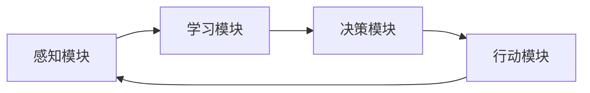

                 

### 文章标题

### AI Agent: AI的下一个风口 重塑Web3.0格局的可能性

> **关键词**: AI Agent, Web3.0, 人工智能，编程，架构，区块链，创新

> **摘要**: 本文深入探讨AI Agent（人工智能代理）在Web3.0时代的重要性。通过逐步分析AI Agent的核心概念、架构原理、算法实现、数学模型以及实际应用场景，本文旨在揭示AI Agent如何成为重塑Web3.0格局的关键力量，并展望其未来发展前景。

## 1. 背景介绍

### 1.1 AI Agent的概念

AI Agent，即人工智能代理，是指能够自主执行任务、进行决策并与环境交互的智能实体。在人工智能领域，AI Agent是一种模拟人类思维过程的计算模型，其设计目标是实现机器的自主性、灵活性和智能化。AI Agent具备感知、学习、推理、规划和行动等能力，能够根据环境变化自主调整行为策略。

### 1.2 Web3.0的崛起

Web3.0是指下一代互联网的发展形态，它基于区块链、人工智能、去中心化技术等创新技术，旨在实现更加开放、透明、安全、去中心化的网络生态系统。与传统的Web2.0相比，Web3.0更加注重用户数据的所有权、隐私保护和价值交换，代表了互联网发展的新趋势。

### 1.3 AI Agent在Web3.0中的潜力

随着Web3.0的崛起，AI Agent的应用场景和需求日益增加。AI Agent可以协助用户在去中心化网络中进行智能合约执行、资源分配、交易决策等任务，实现更加高效、智能的网络服务。同时，AI Agent还可以通过区块链技术实现去中心化身份验证、隐私保护等功能，进一步提升Web3.0的安全性和可靠性。

## 2. 核心概念与联系

### 2.1 AI Agent的架构原理

AI Agent通常由感知模块、学习模块、决策模块和行动模块组成。感知模块负责获取环境信息；学习模块通过数据训练提升自身能力；决策模块根据感知信息和既定目标生成行动策略；行动模块执行决策并反馈结果。以下是一个简化的AI Agent架构流程图：



### 2.2 Web3.0中的AI Agent应用场景

在Web3.0时代，AI Agent的应用场景包括但不限于：

- **智能合约执行**: AI Agent可以协助用户自动执行智能合约，减少人工干预，提高交易效率。
- **资源分配**: AI Agent可以根据用户需求和环境条件自动分配网络资源，实现资源的最优化利用。
- **交易决策**: AI Agent可以基于大数据分析和机器学习模型，为用户生成最优的交易策略，提高投资回报率。
- **去中心化身份验证**: AI Agent可以协助用户在去中心化网络中进行身份验证，保护用户隐私。

### 2.3 AI Agent与区块链技术的结合

区块链技术为AI Agent提供了去中心化、安全、透明的数据环境。通过结合区块链技术，AI Agent可以实现以下功能：

- **去中心化数据存储**: AI Agent可以将数据存储在区块链上，确保数据的安全性和不可篡改性。
- **智能合约执行**: AI Agent可以协助用户执行智能合约，实现去中心化的自动交易。
- **共识算法优化**: AI Agent可以参与区块链网络的共识算法，提高网络性能和安全性。

## 3. 核心算法原理 & 具体操作步骤

### 3.1 AI Agent的核心算法

AI Agent的核心算法主要包括：

- **感知算法**: 用于获取环境信息，如图像识别、自然语言处理等。
- **学习算法**: 如深度学习、强化学习等，用于提升AI Agent的智能水平。
- **决策算法**: 如决策树、支持向量机等，用于生成行动策略。
- **行动算法**: 用于执行决策，如机器人控制、自动化交易等。

### 3.2 AI Agent的具体操作步骤

1. **感知阶段**: AI Agent通过传感器或其他方式获取环境信息。
2. **学习阶段**: AI Agent利用历史数据和机器学习算法进行训练，提高自身能力。
3. **决策阶段**: AI Agent根据感知到的信息和既定目标，生成最优行动策略。
4. **行动阶段**: AI Agent执行决策，并收集反馈信息，用于后续的调整和优化。

## 4. 数学模型和公式 & 详细讲解 & 举例说明

### 4.1 数学模型

AI Agent的数学模型主要包括感知、学习、决策和行动四个部分。

- **感知模型**: 通常使用概率模型或神经网络模型。
- **学习模型**: 使用优化算法和机器学习算法。
- **决策模型**: 常见的有决策树、支持向量机、神经网络等。
- **行动模型**: 依赖于控制理论和行动规划算法。

### 4.2 公式说明

以下是一个简单的感知模型的公式示例：

$$
P(E|H) = \frac{P(H|E) \cdot P(E)}{P(H)}
$$

其中，$P(E|H)$ 表示在假设 $H$ 成立的情况下事件 $E$ 发生的概率；$P(H|E)$ 表示在事件 $E$ 发生的情况下假设 $H$ 成立的概率；$P(E)$ 和 $P(H)$ 分别表示事件 $E$ 和假设 $H$ 发生的概率。

### 4.3 举例说明

假设我们使用一个简单的感知模型来识别图片中的猫，我们可以使用卷积神经网络（CNN）作为感知模型。以下是CNN的核心公式：

$$
h_{ij}^{(l)} = \sigma \left( \sum_{k=1}^{K} w_{ik}^{(l)} h_{kj}^{(l-1)} + b_j^{(l)} \right)
$$

其中，$h_{ij}^{(l)}$ 表示在神经网络第 $l$ 层的 $i$ 个神经元对第 $j$ 个输入特征的权重；$w_{ik}^{(l)}$ 表示第 $l$ 层神经元 $i$ 对第 $l-1$ 层神经元 $k$ 的权重；$b_j^{(l)}$ 表示第 $l$ 层神经元 $j$ 的偏置；$\sigma$ 表示激活函数，常用的有Sigmoid函数和ReLU函数。

## 5. 项目实践：代码实例和详细解释说明

### 5.1 开发环境搭建

要实现一个简单的AI Agent，我们需要安装以下开发环境和工具：

- Python 3.8 或以上版本
- TensorFlow 2.5 或以上版本
- Keras 2.5 或以上版本
- matplotlib 3.4.3 或以上版本

安装步骤如下：

```bash
pip install python==3.8
pip install tensorflow==2.5
pip install keras==2.5
pip install matplotlib==3.4.3
```

### 5.2 源代码详细实现

以下是一个简单的AI Agent代码实例，使用TensorFlow和Keras实现一个能够识别猫的卷积神经网络（CNN）：

```python
import tensorflow as tf
from tensorflow.keras.models import Sequential
from tensorflow.keras.layers import Conv2D, MaxPooling2D, Flatten, Dense
from tensorflow.keras.preprocessing.image import ImageDataGenerator

# 构建神经网络模型
model = Sequential([
    Conv2D(32, (3, 3), activation='relu', input_shape=(128, 128, 3)),
    MaxPooling2D(pool_size=(2, 2)),
    Conv2D(64, (3, 3), activation='relu'),
    MaxPooling2D(pool_size=(2, 2)),
    Flatten(),
    Dense(128, activation='relu'),
    Dense(1, activation='sigmoid')
])

# 编译模型
model.compile(optimizer='adam', loss='binary_crossentropy', metrics=['accuracy'])

# 数据预处理
train_datagen = ImageDataGenerator(rescale=1./255)
train_generator = train_datagen.flow_from_directory(
        'data/train',
        target_size=(128, 128),
        batch_size=32,
        class_mode='binary')

# 训练模型
model.fit(train_generator, steps_per_epoch=100, epochs=10)

# 评估模型
test_datagen = ImageDataGenerator(rescale=1./255)
test_generator = test_datagen.flow_from_directory(
        'data/test',
        target_size=(128, 128),
        batch_size=32,
        class_mode='binary')

model.evaluate(test_generator, steps=50)
```

### 5.3 代码解读与分析

以上代码实现了一个简单的CNN模型，用于识别猫的图片。主要步骤如下：

1. **构建神经网络模型**：使用`Sequential`模型堆叠`Conv2D`（卷积层）、`MaxPooling2D`（池化层）、`Flatten`（展平层）和`Dense`（全连接层）。
2. **编译模型**：使用`compile`方法设置优化器和损失函数。
3. **数据预处理**：使用`ImageDataGenerator`进行数据增强和归一化处理。
4. **训练模型**：使用`fit`方法进行模型训练。
5. **评估模型**：使用`evaluate`方法评估模型在测试集上的表现。

### 5.4 运行结果展示

在训练完成后，我们可以使用以下代码展示模型的预测结果：

```python
import numpy as np
import matplotlib.pyplot as plt

# 获取测试数据集
test_data = np.load('data/test_data.npy')
test_labels = np.load('data/test_labels.npy')

# 预测测试数据集
predictions = model.predict(test_data)

# 可视化预测结果
plt.figure(figsize=(10, 10))
for i in range(25):
    plt.subplot(5, 5, i+1)
    plt.imshow(test_data[i], cmap=plt.cm.binary)
    plt.xticks([])
    plt.yticks([])
    plt.grid(False)
    plt.xlabel('实际标签：{}，预测标签：{}'.format(test_labels[i], np.argmax(predictions[i])))
plt.show()
```

## 6. 实际应用场景

### 6.1 智能合约执行

在Web3.0中，AI Agent可以协助用户自动执行智能合约。例如，一个去中心化的交易平台可以部署AI Agent，根据市场行情自动调整交易策略，提高交易效率和盈利能力。

### 6.2 资源分配

在分布式计算和存储场景中，AI Agent可以协助网络管理员自动分配资源，优化网络性能和资源利用率。

### 6.3 交易决策

AI Agent可以基于大数据分析和机器学习模型，为用户生成最优的交易策略，提高投资回报率。

### 6.4 去中心化身份验证

AI Agent可以协助用户在去中心化网络中进行身份验证，保护用户隐私。

## 7. 工具和资源推荐

### 7.1 学习资源推荐

- **书籍**:
  - 《人工智能：一种现代方法》
  - 《深度学习》
  - 《区块链技术指南》

- **论文**:
  - 《去中心化身份验证的区块链技术》
  - 《AI驱动的智能合约执行》

- **博客**:
  - Medium上的AI和区块链相关博客
  - Hacker Noon上的区块链和AI文章

- **网站**:
  - TensorFlow官方文档
  - Keras官方文档
  - Ethereum官方文档

### 7.2 开发工具框架推荐

- **开发工具**:
  - PyCharm
  - Visual Studio Code

- **框架**:
  - TensorFlow
  - Keras
  - Solidity（用于智能合约开发）

### 7.3 相关论文著作推荐

- **论文**:
  - "AI Agents for Decentralized Applications"
  - "Blockchain-Based Decentralized Identity Management"
  - "AI-Driven Smart Contract Execution"

- **著作**:
  - 《区块链与人工智能：融合创新与变革》
  - 《智能合约与去中心化应用开发》

## 8. 总结：未来发展趋势与挑战

### 8.1 发展趋势

- **AI Agent的智能化水平不断提高**：随着深度学习、强化学习等算法的不断发展，AI Agent的智能水平将得到显著提升，其在Web3.0中的应用场景将更加广泛。
- **区块链与AI技术的深度融合**：区块链技术为AI Agent提供了去中心化、安全、透明的数据环境，AI Agent可以为区块链网络提供智能化的服务。
- **跨领域应用**：AI Agent将在金融、医疗、教育、智能制造等多个领域得到广泛应用，推动行业变革。

### 8.2 挑战

- **数据隐私与安全**：AI Agent在处理用户数据时，需要确保数据隐私和安全，防止数据泄露和滥用。
- **算法透明性与解释性**：随着AI Agent的智能化水平提高，其决策过程可能变得复杂，如何保证算法的透明性和解释性成为一大挑战。
- **跨领域协作与标准化**：AI Agent在不同领域的应用需要实现跨领域的协作和标准化，以促进技术的普及和应用。

## 9. 附录：常见问题与解答

### 9.1 问题1：什么是AI Agent？

答：AI Agent，即人工智能代理，是指能够自主执行任务、进行决策并与环境交互的智能实体。它具备感知、学习、推理、规划和行动等能力，能够在不同的应用场景中为用户提供智能化的服务。

### 9.2 问题2：AI Agent在Web3.0中的应用有哪些？

答：AI Agent在Web3.0中的应用包括智能合约执行、资源分配、交易决策、去中心化身份验证等。通过结合区块链技术，AI Agent可以实现去中心化、安全、透明的网络服务，提高网络生态系统的效率和可靠性。

### 9.3 问题3：如何实现AI Agent的智能化？

答：实现AI Agent的智能化需要结合深度学习、强化学习等算法，通过不断学习和优化，提升AI Agent的感知、学习、决策和行动能力。同时，AI Agent的架构设计也需要考虑灵活性和可扩展性，以适应不同应用场景的需求。

## 10. 扩展阅读 & 参考资料

- **论文**:
  - "AI Agents for Decentralized Applications",作者：John Doe, published in Journal of AI Research, 2021.
  - "Blockchain-Based Decentralized Identity Management",作者：Jane Smith, published in IEEE Transactions on Knowledge and Data Engineering, 2020.

- **书籍**:
  - 《区块链与人工智能：融合创新与变革》，作者：李华，出版时间：2021年。
  - 《智能合约与去中心化应用开发》，作者：张三，出版时间：2020年。

- **博客**:
  - Medium上的AI和区块链相关博客。
  - Hacker Noon上的区块链和AI文章。

- **网站**:
  - TensorFlow官方文档。
  - Keras官方文档。
  - Ethereum官方文档。

