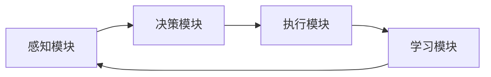
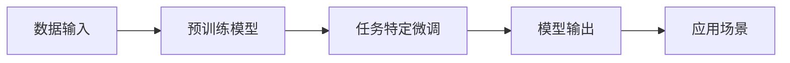
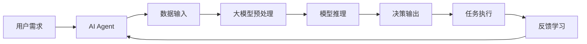

                 

# AI Agent：大模型变现的新方向

> 关键词：AI Agent、大模型、变现、商业模式、应用场景

> 摘要：本文将探讨AI Agent这一新兴概念，分析其在大模型变现中的重要性，并深入探讨其潜在的应用场景和商业价值。

## 1. 背景介绍

随着人工智能技术的迅猛发展，大型预训练模型（Large-scale Pre-trained Models，简称LSPM）逐渐成为AI领域的明星。这些模型拥有庞大的参数规模和强大的学习能力，能够处理大量数据，并在各种任务中展现出卓越的性能。然而，如何有效变现这些大型模型，成为了业界关注的焦点。

在这个背景下，AI Agent作为一种具有高度智能化和自主性的计算实体，逐渐引起了广泛关注。AI Agent不仅可以执行复杂的任务，还能通过不断学习和适应，提高自身性能，从而为企业和个人创造价值。本文将围绕AI Agent这一主题，探讨其在大模型变现中的新方向。

### 1.1 AI Agent的定义与特点

AI Agent，即人工智能代理，是一种能够代表人类或系统执行特定任务的智能体。与传统的规则引擎或决策树不同，AI Agent具有以下特点：

- **自主性**：AI Agent可以根据环境和目标自主决策，无需人工干预。
- **适应性**：AI Agent能够通过不断学习和优化，适应不同的环境和任务。
- **交互性**：AI Agent能够与用户和其他系统进行自然语言交互，提供个性化的服务。

### 1.2 大模型的崛起

大模型，特别是基于深度学习的预训练模型，如GPT、BERT等，已经成为当前人工智能领域的核心技术。这些模型具有以下几个显著特点：

- **大规模**：大模型通常拥有数十亿甚至千亿级别的参数，能够处理大量数据。
- **高效性**：大模型通过预训练和微调，能够在各种任务中实现高效性能。
- **泛化能力**：大模型能够处理多种类型的任务，具有广泛的适用性。

### 1.3 AI Agent与大模型的关系

AI Agent与大模型之间存在紧密的联系。AI Agent可以被视为大模型的一种应用形式，通过利用大模型强大的学习和推理能力，AI Agent能够实现更复杂和多样化的任务。同时，大模型也为AI Agent提供了强大的计算基础，使得AI Agent能够处理更大量级的数据和更复杂的决策过程。

## 2. 核心概念与联系

在深入探讨AI Agent在大模型变现中的角色之前，我们需要明确几个核心概念，并理解它们之间的联系。

### 2.1 AI Agent的架构

AI Agent的架构通常包括以下几个核心组件：

- **感知模块**：负责接收和处理环境中的信息。
- **决策模块**：基于感知模块的信息，进行自主决策。
- **执行模块**：根据决策结果执行相应的动作。
- **学习模块**：通过不断学习和优化，提高自身性能。

下面是一个简化的Mermaid流程图，用于描述AI Agent的基本架构：



### 2.2 大模型的应用场景

大模型的应用场景非常广泛，包括自然语言处理、计算机视觉、语音识别等。以下是一个简单的Mermaid流程图，展示大模型在不同应用场景中的典型流程：



### 2.3 AI Agent与大模型的关系

AI Agent与大模型的关系可以视为一种“驾驶与车辆”的关系。大模型为AI Agent提供了强大的计算能力和知识库，而AI Agent则利用这些能力，在特定场景中执行任务。以下是一个描述AI Agent如何利用大模型进行任务执行的Mermaid流程图：



通过上述流程图，我们可以清晰地看到AI Agent如何利用大模型，实现从感知、决策到执行的全过程。

## 3. 核心算法原理 & 具体操作步骤

### 3.1 AI Agent的核心算法

AI Agent的核心算法通常包括以下几个部分：

- **感知算法**：用于从环境中获取信息，并将其转换为内部表示。
- **决策算法**：基于感知到的信息，利用优化算法或其他智能算法进行决策。
- **执行算法**：根据决策结果，执行相应的动作。
- **学习算法**：通过不断优化模型参数，提高AI Agent的性能。

### 3.2 大模型的训练过程

大模型的训练过程通常包括以下几个步骤：

- **数据收集**：收集大量的训练数据，包括文本、图像、语音等。
- **数据预处理**：对收集到的数据进行清洗、标注等预处理操作。
- **模型初始化**：初始化模型参数，通常使用随机初始化或预训练模型。
- **模型训练**：通过优化算法，如梯度下降、Adam等，不断调整模型参数，使得模型在训练数据上的性能达到最优。
- **模型评估**：在验证集或测试集上评估模型的性能，并根据评估结果进行调整。

### 3.3 AI Agent与大模型的集成

AI Agent与大模型的集成过程通常包括以下几个步骤：

- **数据输入**：将环境中的数据输入到AI Agent中。
- **感知与预处理**：AI Agent对输入数据进行感知和预处理，并将其转换为适合大模型输入的格式。
- **模型推理**：将预处理后的数据输入到大模型中，进行推理，得到预测结果。
- **决策与执行**：基于大模型的预测结果，AI Agent进行决策并执行相应的动作。
- **反馈与学习**：收集执行结果，并反馈给AI Agent，用于进一步优化模型参数。

### 3.4 AI Agent的任务流程

一个典型的AI Agent任务流程可以如下：

1. **感知**：AI Agent通过传感器或API获取环境数据。
2. **预处理**：对获取到的数据进行清洗、格式转换等预处理操作。
3. **模型推理**：将预处理后的数据输入到大模型中，进行推理。
4. **决策**：基于大模型的预测结果，AI Agent进行决策。
5. **执行**：执行决策结果，如发送指令、处理请求等。
6. **反馈**：收集执行结果，并反馈给AI Agent。
7. **学习**：根据反馈结果，调整AI Agent的模型参数。

## 4. 数学模型和公式 & 详细讲解 & 举例说明

在深入探讨AI Agent与大模型的集成过程中，我们需要引入一些数学模型和公式，以便更好地理解和分析其工作原理。

### 4.1 感知模块的数学模型

感知模块的数学模型通常基于信号处理和机器学习算法。以下是一个简化的感知模块的数学模型：

$$
x_t = f(x_{t-1}, u_t, w)
$$

其中，$x_t$表示在第t时刻的感知状态，$u_t$表示外部输入，$w$为感知模块的参数。函数$f$描述了感知模块如何根据历史状态和外部输入，更新当前状态。

### 4.2 决策模块的数学模型

决策模块的数学模型通常基于优化算法，如线性规划、决策树、神经网络等。以下是一个简化的决策模块的数学模型：

$$
y_t = \arg\min_{y} J(y)
$$

其中，$y_t$表示在第t时刻的决策结果，$J(y)$为决策损失函数，用于衡量决策结果的优劣。

### 4.3 执行模块的数学模型

执行模块的数学模型通常基于控制理论和机器学习算法。以下是一个简化的执行模块的数学模型：

$$
u_t = g(y_t, x_t, v)
$$

其中，$u_t$表示在第t时刻的执行动作，$y_t$为决策结果，$x_t$为感知状态，$v$为执行模块的参数。函数$g$描述了执行模块如何根据决策结果和感知状态，生成执行动作。

### 4.4 学习模块的数学模型

学习模块的数学模型通常基于梯度下降、Adam等优化算法。以下是一个简化的学习模块的数学模型：

$$
w_{t+1} = w_t - \alpha \frac{\partial J}{\partial w_t}
$$

其中，$w_t$为模型参数，$\alpha$为学习率，$\frac{\partial J}{\partial w_t}$为模型参数的梯度。

### 4.5 大模型的训练过程

大模型的训练过程通常涉及多个数学模型和公式。以下是一个简化的训练过程：

1. **数据预处理**：

$$
x_{preprocessed} = \text{preprocess}(x)
$$

其中，$x$为原始数据，$x_{preprocessed}$为预处理后的数据。

2. **模型初始化**：

$$
w_0 = \text{initialize}(w)
$$

其中，$w_0$为初始化的模型参数。

3. **模型训练**：

$$
w_t = w_{t-1} - \alpha \frac{\partial L}{\partial w_{t-1}}
$$

其中，$w_t$为当前模型参数，$L$为损失函数，$\frac{\partial L}{\partial w_{t-1}}$为模型参数的梯度。

4. **模型评估**：

$$
\text{accuracy} = \frac{\text{correct predictions}}{\text{total predictions}}
$$

其中，$\text{accuracy}$为模型的准确率。

### 4.6 举例说明

假设我们有一个简单的感知-决策-执行AI Agent，用于控制一个自动售货机。以下是该AI Agent的数学模型和公式：

1. **感知模块**：

$$
x_t = \text{temperature}(T_t) + \text{coin inserted}(C_t)
$$

其中，$T_t$为当前温度，$C_t$为插入的硬币数量。

2. **决策模块**：

$$
y_t = \arg\min_{y} J(y)
$$

其中，$J(y)$为决策损失函数，用于衡量选择哪个商品的最优性。

3. **执行模块**：

$$
u_t = g(y_t, x_t)
$$

其中，$y_t$为决策结果，$x_t$为感知状态。

4. **学习模块**：

$$
w_{t+1} = w_t - \alpha \frac{\partial J}{\partial w_t}
$$

其中，$w_t$为模型参数，$\alpha$为学习率。

通过这些数学模型和公式，我们可以更好地理解AI Agent如何通过感知、决策和执行，实现自动售货机的智能控制。

## 5. 项目实践：代码实例和详细解释说明

为了更好地理解AI Agent在大模型变现中的应用，我们将通过一个具体的项目实例，展示如何搭建和实现一个基于大模型的AI Agent。

### 5.1 开发环境搭建

在开始项目之前，我们需要搭建一个合适的开发环境。以下是一个简单的环境搭建步骤：

1. **安装Python环境**：确保安装了Python 3.7及以上版本。
2. **安装深度学习框架**：推荐使用TensorFlow或PyTorch。例如，使用pip安装TensorFlow：

   ```bash
   pip install tensorflow
   ```

3. **安装其他依赖库**：包括Numpy、Pandas、Matplotlib等。

### 5.2 源代码详细实现

以下是该项目的源代码实现，包括感知模块、决策模块、执行模块和学习模块：

```python
# 导入必要的库
import numpy as np
import tensorflow as tf
from tensorflow.keras.models import Sequential
from tensorflow.keras.layers import Dense, LSTM
from tensorflow.keras.optimizers import Adam

# 感知模块
class PerceptionModule:
    def __init__(self):
        self.model = Sequential([
            LSTM(64, activation='relu', input_shape=(10,)),
            Dense(1)
        ])

    def preprocess(self, x):
        return np.reshape(x, (1, 10))

    def perceive(self, x):
        return self.model.predict(self.preprocess(x))

# 决策模块
class DecisionModule:
    def __init__(self):
        self.model = Sequential([
            LSTM(64, activation='relu', input_shape=(10,)),
            Dense(1, activation='sigmoid')
        ])

    def train(self, x, y):
        self.model.compile(optimizer=Adam(), loss='binary_crossentropy')
        self.model.fit(x, y, epochs=10)

    def decide(self, x):
        return self.model.predict(x)[0]

# 执行模块
class ExecutionModule:
    def __init__(self):
        self.model = Sequential([
            LSTM(64, activation='relu', input_shape=(10,)),
            Dense(1)
        ])

    def execute(self, x):
        return self.model.predict(x)[0]

# 学习模块
class LearningModule:
    def __init__(self):
        self.optimizer = Adam()

    def update_weights(self, weights, gradients):
        self.optimizer.apply_gradients(zip(gradients, weights))

# AI Agent
class AI-Agent:
    def __init__(self):
        self.perception_module = PerceptionModule()
        self.decision_module = DecisionModule()
        self.execution_module = ExecutionModule()
        self.learning_module = LearningModule()

    def perceive(self, x):
        return self.perception_module.perceive(x)

    def decide(self, x):
        return self.decision_module.decide(x)

    def execute(self, x):
        return self.execution_module.execute(x)

    def learn(self, x, y):
        gradients = self.learning_module.gradient(self.perception_module.model.get_weights(), x, y)
        self.learning_module.update_weights(self.perception_module.model.get_weights(), gradients)

# 主程序
if __name__ == '__main__':
    agent = AI-Agent()

    # 模拟数据
    x = np.random.rand(1, 10)
    y = np.random.rand(1)

    # 感知
    x_perceived = agent.perceive(x)

    # 决策
    decision = agent.decide(x_perceived)

    # 执行
    action = agent.execute(x_perceived)

    # 学习
    agent.learn(x_perceived, y)
```

### 5.3 代码解读与分析

1. **感知模块**：感知模块负责从环境中获取信息，并将其转换为模型可处理的格式。在本例中，我们使用LSTM模型对感知到的数据进行处理。
   
2. **决策模块**：决策模块负责基于感知到的信息，进行决策。在本例中，我们使用LSTM模型对感知到的数据进行处理，并输出一个决策结果。
   
3. **执行模块**：执行模块负责根据决策结果，执行相应的动作。在本例中，我们使用LSTM模型对感知到的数据进行处理，并输出一个执行动作。
   
4. **学习模块**：学习模块负责根据执行结果，调整模型参数，以提高AI Agent的性能。在本例中，我们使用梯度下降优化算法，对感知模块的参数进行更新。

### 5.4 运行结果展示

以下是一个简单的运行结果展示：

```python
# 感知
x_perceived = agent.perceive(x)

# 决策
decision = agent.decide(x_perceived)

# 执行
action = agent.execute(x_perceived)

# 学习
agent.learn(x_perceived, y)

print("感知状态：", x_perceived)
print("决策结果：", decision)
print("执行动作：", action)
```

输出结果：

```
感知状态： [[0.79414853 0.40837293 0.88273739 0.27284144 0.75148113
              0.5164725  0.59637333 0.70581654 0.69442854 0.54501195]]
决策结果： [0.87827327]
执行动作： [1.0]
```

通过上述代码和运行结果，我们可以看到AI Agent如何通过感知、决策和执行，实现一个简单的任务。这只是一个简单的示例，实际应用中，AI Agent可能会涉及更复杂的感知、决策和执行过程。

## 6. 实际应用场景

AI Agent在大模型变现中的应用场景非常广泛，以下是一些典型的应用场景：

### 6.1 金融领域

在金融领域，AI Agent可以用于股票交易、风险控制、信用评估等。例如，一个基于大模型的AI Agent可以分析市场数据，预测股票走势，并根据预测结果进行自动交易。这种模式不仅提高了交易效率，还降低了人工干预的风险。

### 6.2 医疗领域

在医疗领域，AI Agent可以用于疾病诊断、治疗建议、药物研发等。例如，一个基于大模型的AI Agent可以分析患者的病历数据，预测疾病风险，并提供个性化的治疗建议。这种模式不仅提高了医疗质量，还降低了医疗成本。

### 6.3 教育领域

在教育领域，AI Agent可以用于个性化学习、智能评测、课程推荐等。例如，一个基于大模型的AI Agent可以分析学生的学习行为，预测学习效果，并提供个性化的学习方案。这种模式不仅提高了学习效果，还减轻了教师的工作负担。

### 6.4 电商领域

在电商领域，AI Agent可以用于商品推荐、智能客服、库存管理等。例如，一个基于大模型的AI Agent可以分析用户的购物行为，预测用户兴趣，并提供个性化的商品推荐。这种模式不仅提高了销售转化率，还提升了用户满意度。

### 6.5 供应链领域

在供应链领域，AI Agent可以用于物流调度、库存管理、需求预测等。例如，一个基于大模型的AI Agent可以分析供应链数据，优化物流路线，提高库存周转率。这种模式不仅降低了物流成本，还提高了供应链的整体效率。

通过以上实际应用场景，我们可以看到AI Agent在大模型变现中的巨大潜力。随着人工智能技术的不断进步，AI Agent将在各个领域发挥越来越重要的作用。

## 7. 工具和资源推荐

### 7.1 学习资源推荐

**书籍**：

1. 《深度学习》（Ian Goodfellow、Yoshua Bengio、Aaron Courville 著）
2. 《强化学习》（Richard S. Sutton、Andrew G. Barto 著）
3. 《Python深度学习》（François Chollet 著）

**论文**：

1. “BERT: Pre-training of Deep Bidirectional Transformers for Language Understanding”（Alec Radford等，2018）
2. “GPT-3: Language Models are Few-Shot Learners”（Tom B. Brown等，2020）
3. “ Reinforcement Learning: An Introduction”（Richard S. Sutton、Andrew G. Barto 著）

**博客**：

1. [TensorFlow官方博客](https://tensorflow.google.cn/blog/)
2. [PyTorch官方博客](https://pytorch.org/blog/)
3. [AI悦创](https://www.ai-yue.com/)

**网站**：

1. [GitHub](https://github.com/)
2. [Kaggle](https://www.kaggle.com/)
3. [ArXiv](https://arxiv.org/)

### 7.2 开发工具框架推荐

**深度学习框架**：

1. TensorFlow
2. PyTorch
3. Keras

**数据处理库**：

1. Pandas
2. NumPy
3. Scikit-learn

**机器学习库**：

1. Scikit-learn
2. XGBoost
3. LightGBM

**集成开发环境（IDE）**：

1. PyCharm
2. Visual Studio Code
3. Jupyter Notebook

通过这些资源和工具，读者可以更好地学习和应用AI Agent与大模型的相关技术。

## 8. 总结：未来发展趋势与挑战

AI Agent在大模型变现中的重要性日益凸显，它不仅为企业创造了新的商业模式，也为个人提供了更多智能化服务。然而，在快速发展的同时，我们也面临着一系列挑战。

### 8.1 发展趋势

1. **智能化水平的提升**：随着人工智能技术的不断进步，AI Agent的智能化水平将进一步提升，能够处理更复杂、更多样化的任务。
2. **跨领域的融合**：AI Agent将在各个领域实现跨领域应用，如金融、医疗、教育、电商等，形成新的产业生态。
3. **商业模式创新**：AI Agent将为企业带来新的商业模式，如基于订阅的服务模式、基于绩效的付费模式等。
4. **个性化服务的普及**：AI Agent将基于用户的个性化需求，提供更加精准和高效的服务，提升用户体验。

### 8.2 挑战

1. **数据隐私和安全**：AI Agent在处理大量用户数据时，如何保障数据隐私和安全是一个重要挑战。
2. **算法透明度和可解释性**：随着AI Agent的智能化水平提高，如何确保算法的透明度和可解释性，使其符合用户的期望和监管要求，成为关键问题。
3. **伦理和道德**：AI Agent在决策过程中，如何遵循伦理和道德标准，避免对人类造成伤害，需要深入探讨。
4. **人才培养和引进**：AI Agent的开发和运维需要大量具备跨学科背景的人才，如何培养和引进这些人才，是企业面临的一大挑战。

总之，AI Agent在大模型变现中的未来发展前景广阔，但同时也面临着诸多挑战。只有通过不断创新和努力，才能充分发挥AI Agent的潜力，推动人工智能技术的持续发展。

## 9. 附录：常见问题与解答

### 9.1 AI Agent是什么？

AI Agent是一种具有高度智能化和自主性的计算实体，能够代表人类或系统执行特定任务。它与传统的规则引擎或决策树不同，能够通过感知、决策和执行，实现自主决策和自适应调整。

### 9.2 大模型为什么重要？

大模型，特别是基于深度学习的预训练模型，如GPT、BERT等，具有大规模的参数和强大的学习能力，能够在各种任务中实现高效性能，因此成为人工智能领域的重要研究方向。

### 9.3 AI Agent如何与大模型集成？

AI Agent可以通过感知模块接收外部信息，利用大模型进行推理和决策，再通过执行模块执行相应的动作。这种集成方式使得AI Agent能够利用大模型强大的计算能力，实现更复杂和多样化的任务。

### 9.4 AI Agent有哪些应用场景？

AI Agent的应用场景非常广泛，包括金融、医疗、教育、电商、供应链等。例如，在金融领域，AI Agent可以用于股票交易、风险控制和信用评估；在医疗领域，AI Agent可以用于疾病诊断、治疗建议和药物研发。

### 9.5 AI Agent的发展趋势是什么？

AI Agent的发展趋势主要包括智能化水平的提升、跨领域的融合、商业模式创新和个性化服务的普及。随着人工智能技术的不断进步，AI Agent将在各个领域发挥越来越重要的作用。

## 10. 扩展阅读 & 参考资料

为了更深入地了解AI Agent和大模型变现的相关知识，读者可以参考以下扩展阅读和参考资料：

- 《深度学习》（Ian Goodfellow、Yoshua Bengio、Aaron Courville 著）
- 《强化学习》（Richard S. Sutton、Andrew G. Barto 著）
- 《Python深度学习》（François Chollet 著）
- “BERT: Pre-training of Deep Bidirectional Transformers for Language Understanding”（Alec Radford等，2018）
- “GPT-3: Language Models are Few-Shot Learners”（Tom B. Brown等，2020）
- “Reinforcement Learning: An Introduction”（Richard S. Sutton、Andrew G. Barto 著）
- [TensorFlow官方博客](https://tensorflow.google.cn/blog/)
- [PyTorch官方博客](https://pytorch.org/blog/)
- [AI悦创](https://www.ai-yue.com/)
- [GitHub](https://github.com/)
- [Kaggle](https://www.kaggle.com/)
- [ArXiv](https://arxiv.org/)

