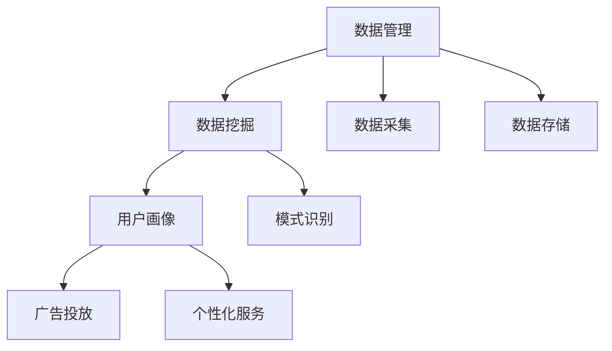

                 

### 背景介绍 Background Introduction

随着互联网和数字技术的飞速发展，数据已经成为企业最宝贵的资产之一。在这样一个大数据时代，如何有效地管理和利用数据，成为了企业数字化转型成功的关键。其中，数据管理平台（Data Management Platform，简称DMP）应运而生，成为企业实现数据驱动营销的重要工具。

DMP是一种集数据收集、存储、处理、分析、应用为一体的数据管理平台，其核心目的是通过整合和分析用户数据，为企业提供更精准、个性化的营销服务。随着人工智能技术的不断进步，DMP的数据处理能力和应用场景也在不断拓展，使其在市场营销、用户行为分析、广告投放等领域发挥着越来越重要的作用。

本文将围绕AI DMP数据基建展开讨论，详细探讨其核心概念、算法原理、数学模型以及实际应用场景。通过逐步分析和推理，我们将深入了解DMP如何帮助企业实现数据驱动营销，并为未来的发展提供方向和建议。

### 核心概念与联系 Core Concepts and Relationships

在探讨AI DMP数据基建之前，我们首先需要了解一些核心概念，包括数据管理、数据挖掘、用户画像、广告投放等。这些概念相互关联，构成了DMP的基础架构。

#### 数据管理 Data Management

数据管理是指对数据的收集、存储、处理、分析和应用过程进行有效的组织和控制，以确保数据的质量、完整性和安全性。数据管理包括数据采集、数据存储、数据清洗、数据转换和数据应用等环节。在DMP中，数据管理是至关重要的，因为只有高质量的数据才能为后续的数据分析和应用提供基础。

#### 数据挖掘 Data Mining

数据挖掘是一种从大量数据中提取隐藏的、未知的、有价值信息的过程。数据挖掘通常涉及统计学、机器学习、模式识别和数据库管理等技术。在DMP中，数据挖掘用于发现用户行为模式、市场趋势和潜在客户，从而为企业提供决策支持。

#### 用户画像 User Profiling

用户画像是对用户特征、行为和需求的全面描述。通过用户画像，企业可以深入了解用户，实现个性化服务和精准营销。用户画像通常包括用户的基本信息（如年龄、性别、地域等）、行为信息（如浏览记录、购买记录等）和兴趣信息（如关注话题、偏好品牌等）。在DMP中，用户画像用于对用户进行分类和标签管理，从而实现精准广告投放和用户服务。

#### 广告投放 Advertising Delivery

广告投放是指将广告信息传达给目标用户的过程。在DMP中，广告投放通常基于用户画像和行为数据，实现精准广告投放。通过分析用户行为和兴趣，DMP可以为广告主提供定制化的广告内容，提高广告投放的效果。

#### Mermaid 流程图 Mermaid Flowchart

为了更清晰地展示DMP的核心概念及其相互关系，我们可以使用Mermaid流程图来表示。以下是DMP核心概念的Mermaid流程图：



通过这个流程图，我们可以看到数据管理、数据挖掘、用户画像和广告投放之间的紧密联系。数据管理提供了数据的基础保障，数据挖掘从海量数据中提取有价值的信息，用户画像基于数据挖掘结果构建，而广告投放则基于用户画像实现精准投放。

### 核心算法原理 & 具体操作步骤 Core Algorithm Principles & Step-by-Step Procedures

在了解了DMP的核心概念和相互关系后，我们接下来将探讨DMP的核心算法原理和具体操作步骤。DMP的核心算法主要涉及数据挖掘、用户画像构建和广告投放策略等。下面我们将逐一介绍。

#### 数据挖掘算法 Data Mining Algorithms

数据挖掘是DMP的核心环节，用于从海量数据中提取有价值的信息。常见的数据挖掘算法包括分类算法、聚类算法、关联规则挖掘等。

1. **分类算法 Classification Algorithms**

分类算法是将数据分为不同类别的过程。常用的分类算法包括决策树、支持向量机（SVM）、朴素贝叶斯等。

   - **决策树 Decision Tree**

     决策树是一种基于树形结构的分类算法，通过一系列判断条件将数据划分为不同的类别。决策树的构建过程包括特征选择、决策节点划分和叶子节点生成。

     ```mermaid
     graph TB
         A[数据集] --> B[特征选择]
         B --> C[决策节点]
         C --> D[叶子节点]
     ```

   - **支持向量机 Support Vector Machine**

     支持向量机是一种基于最大间隔的线性分类算法，通过将数据映射到高维空间，找到最佳分类边界。

     ```mermaid
     graph TB
         A[数据集] --> B[特征映射]
         B --> C[分类边界]
     ```

   - **朴素贝叶斯 Naive Bayes**

     朴素贝叶斯是一种基于贝叶斯定理的分类算法，假设特征之间相互独立，通过计算各类别的概率分布来预测数据类别。

     ```mermaid
     graph TB
         A[数据集] --> B[特征概率分布]
         B --> C[类别预测]
     ```

2. **聚类算法 Clustering Algorithms**

聚类算法是将数据分为多个类别的过程，旨在发现数据中的自然分组。常用的聚类算法包括K-均值、层次聚类等。

   - **K-均值 K-Means**

     K-均值是一种基于距离的聚类算法，通过迭代计算聚类中心，将数据点划分为K个类别。

     ```mermaid
     graph TB
         A[数据集] --> B[聚类中心]
         B --> C[类别划分]
     ```

   - **层次聚类 Hierarchical Clustering**

     层次聚类是一种基于层次结构的聚类算法，通过递归地将数据划分为更小的子集，构建聚类层次树。

     ```mermaid
     graph TB
         A[数据集] --> B[层次结构]
         B --> C[聚类结果]
     ```

3. **关联规则挖掘 Association Rule Mining**

关联规则挖掘是一种用于发现数据中潜在关系的算法，通过计算支持度和置信度来生成关联规则。常见的算法包括Apriori算法和FP-Growth算法。

   - **Apriori Algorithm**

     Apriori算法是一种基于候选集的关联规则挖掘算法，通过生成频繁项集来构建关联规则。

     ```mermaid
     graph TB
         A[数据集] --> B[频繁项集]
         B --> C[关联规则]
     ```

   - **FP-Growth Algorithm**

     FP-Growth算法是一种基于压缩数据结构的关联规则挖掘算法，通过构建FP-树来生成频繁项集。

     ```mermaid
     graph TB
         A[数据集] --> B[FP-Tree]
         B --> C[频繁项集]
         C --> D[关联规则]
     ```

#### 用户画像构建算法 User Profiling Algorithms

用户画像构建是DMP的核心环节，通过对用户数据进行分析，构建用户的基本信息、行为信息和兴趣信息。

1. **用户特征提取 User Feature Extraction**

   用户特征提取是从原始数据中提取对用户画像构建有价值的特征。常用的特征提取方法包括特征选择、特征工程等。

   - **特征选择 Feature Selection**

     特征选择是从原始特征中选取对目标变量影响最大的特征，以减少数据维度和计算复杂度。

     ```mermaid
     graph TB
         A[原始特征] --> B[特征选择]
         B --> C[目标特征]
     ```

   - **特征工程 Feature Engineering**

     特征工程是通过变换和组合原始特征，构建新的特征，以提高模型性能和预测准确性。

     ```mermaid
     graph TB
         A[原始特征] --> B[特征变换]
         B --> C[新特征]
     ```

2. **用户行为分析 User Behavior Analysis**

   用户行为分析是通过分析用户的浏览、点击、购买等行为，提取用户的行为特征。常用的分析方法包括时间序列分析、行为模式识别等。

   - **时间序列分析 Time Series Analysis**

     时间序列分析是通过分析用户行为的时间序列数据，提取用户行为的时序特征。

     ```mermaid
     graph TB
         A[时间序列数据] --> B[行为特征]
     ```

   - **行为模式识别 Behavior Pattern Recognition**

     行为模式识别是通过分析用户行为模式，发现用户行为规律和潜在需求。

     ```mermaid
     graph TB
         A[用户行为数据] --> B[行为模式]
     ```

3. **用户兴趣分析 User Interest Analysis**

   用户兴趣分析是通过分析用户的浏览、点击、搜索等行为，提取用户的兴趣特征。常用的分析方法包括文本挖掘、用户偏好分析等。

   - **文本挖掘 Text Mining**

     文本挖掘是通过分析用户生成的文本数据，提取用户的兴趣特征。

     ```mermaid
     graph TB
         A[文本数据] --> B[兴趣特征]
     ```

   - **用户偏好分析 User Preference Analysis**

     用户偏好分析是通过分析用户的购买记录、评价等数据，提取用户的偏好特征。

     ```mermaid
     graph TB
         A[用户数据] --> B[偏好特征]
     ```

#### 广告投放策略 Advertising Delivery Strategy

广告投放策略是基于用户画像和行为数据，实现精准广告投放的关键。广告投放策略包括广告内容设计、广告投放位置选择、广告投放时间控制等。

1. **广告内容设计 Advertising Content Design**

   广告内容设计是根据用户画像和行为数据，设计符合用户兴趣和需求的广告内容。广告内容设计包括广告标题、广告文案、广告图片等。

   ```mermaid
   graph TB
       A[用户画像] --> B[广告内容]
   ```

2. **广告投放位置选择 Advertising Delivery Position Selection**

   广告投放位置选择是根据用户行为数据和广告投放效果，选择合适的广告投放位置，以提高广告投放效果。

   ```mermaid
   graph TB
       A[用户行为数据] --> B[广告位置]
   ```

3. **广告投放时间控制 Advertising Delivery Time Control**

   广告投放时间控制是根据用户行为数据和广告投放效果，选择合适的时间进行广告投放，以提高广告投放效果。

   ```mermaid
   graph TB
       A[用户行为数据] --> B[广告时间]
   ```

### 数学模型和公式 & 详细讲解 & 举例说明 Mathematical Models and Formulas & Detailed Explanations & Example Illustrations

在DMP中，数学模型和公式是关键组成部分，用于描述用户行为、兴趣分析和广告投放策略等。下面我们将详细介绍这些数学模型和公式，并给出具体的解释和示例。

#### 用户行为概率模型 User Behavior Probability Model

用户行为概率模型用于描述用户在特定场景下的行为概率，如点击率（CTR）、转化率（CVR）等。常见的用户行为概率模型包括伯努利分布、泊松分布等。

1. **伯努利分布 Bernoulli Distribution**

伯努利分布是一种二元分布，用于描述在两个可能结果中，某个结果发生的概率。例如，用户是否点击广告的概率。

$$
P(X = 1) = p, \quad P(X = 0) = 1 - p
$$

其中，$X$ 表示用户点击广告的结果，$p$ 表示点击概率。

**示例：**

假设用户点击广告的概率为0.3，那么用户不点击广告的概率为0.7。

2. **泊松分布 Poisson Distribution**

泊松分布用于描述在一定时间内，事件发生的次数。例如，用户在一定时间内访问网站的次数。

$$
P(X = k) = \frac{\lambda^k e^{-\lambda}}{k!}
$$

其中，$X$ 表示事件发生的次数，$\lambda$ 表示事件发生的平均次数。

**示例：**

假设用户在一定时间内访问网站的次数的平均值为5次，那么用户在5分钟内访问网站3次的概率为：

$$
P(X = 3) = \frac{5^3 e^{-5}}{3!} \approx 0.1404
$$

#### 用户兴趣相似度模型 User Interest Similarity Model

用户兴趣相似度模型用于描述用户之间的兴趣相似性，如用户相似度、兴趣标签相似度等。常见的用户兴趣相似度模型包括余弦相似度、Jaccard相似度等。

1. **余弦相似度 Cosine Similarity**

余弦相似度是一种基于向量空间的相似度度量方法，用于计算两个向量的夹角余弦值。例如，用户兴趣标签的相似度。

$$
\cos(\theta) = \frac{\sum_{i=1}^{n} x_i y_i}{\sqrt{\sum_{i=1}^{n} x_i^2} \sqrt{\sum_{i=1}^{n} y_i^2}}
$$

其中，$x$ 和 $y$ 分别表示两个用户的兴趣向量，$\theta$ 表示两个向量之间的夹角。

**示例：**

假设用户A和用户B的兴趣向量分别为：

$$
x = [0.2, 0.5, 0.3], \quad y = [0.4, 0.6, 0.0]
$$

那么用户A和用户B的余弦相似度为：

$$
\cos(\theta) = \frac{0.2 \times 0.4 + 0.5 \times 0.6 + 0.3 \times 0.0}{\sqrt{0.2^2 + 0.5^2 + 0.3^2} \sqrt{0.4^2 + 0.6^2 + 0.0^2}} \approx 0.574
$$

2. **Jaccard相似度 Jaccard Similarity**

Jaccard相似度是一种基于集合的相似度度量方法，用于计算两个集合的交集与并集的比值。例如，用户标签的相似度。

$$
J(A, B) = \frac{|A \cap B|}{|A \cup B|}
$$

其中，$A$ 和 $B$ 分别表示两个集合。

**示例：**

假设用户A和用户B的兴趣标签分别为：

$$
A = \{1, 2, 3\}, \quad B = \{2, 3, 4\}
$$

那么用户A和用户B的Jaccard相似度为：

$$
J(A, B) = \frac{|A \cap B|}{|A \cup B|} = \frac{2}{4} = 0.5
$$

#### 广告投放效果评估模型 Advertising Delivery Effectiveness Evaluation Model

广告投放效果评估模型用于评估广告投放的效果，如点击率（CTR）、转化率（CVR）等。常见的广告投放效果评估模型包括线性回归、逻辑回归等。

1. **线性回归 Linear Regression**

线性回归是一种用于描述因变量与自变量之间线性关系的模型。例如，广告投放效果与用户特征之间的关系。

$$
Y = \beta_0 + \beta_1X_1 + \beta_2X_2 + \cdots + \beta_nX_n + \varepsilon
$$

其中，$Y$ 表示广告投放效果，$X_1, X_2, \ldots, X_n$ 表示用户特征，$\beta_0, \beta_1, \beta_2, \ldots, \beta_n$ 表示模型参数，$\varepsilon$ 表示误差项。

**示例：**

假设我们有一个广告投放效果模型，用户特征包括年龄（$X_1$）、性别（$X_2$）和收入（$X_3$），模型参数为：

$$
Y = 10 + 2X_1 + 3X_2 - 1X_3
$$

那么当用户年龄为25岁、性别为男、收入为5000元时，广告投放效果为：

$$
Y = 10 + 2 \times 25 + 3 \times 1 - 1 \times 5000 = 10 + 50 + 3 - 5000 = -4937
$$

2. **逻辑回归 Logistic Regression**

逻辑回归是一种用于描述因变量与自变量之间非线性关系的模型，通常用于分类问题。例如，用户是否点击广告的预测。

$$
\log\frac{P(Y=1)}{1-P(Y=1)} = \beta_0 + \beta_1X_1 + \beta_2X_2 + \cdots + \beta_nX_n
$$

其中，$Y$ 表示广告投放效果，$X_1, X_2, \ldots, X_n$ 表示用户特征，$\beta_0, \beta_1, \beta_2, \ldots, \beta_n$ 表示模型参数。

**示例：**

假设我们有一个广告投放效果预测模型，用户特征包括年龄（$X_1$）、性别（$X_2$）和收入（$X_3$），模型参数为：

$$
\log\frac{P(Y=1)}{1-P(Y=1)} = 0 + 1X_1 + 2X_2 - 1X_3
$$

那么当用户年龄为25岁、性别为男、收入为5000元时，用户点击广告的概率为：

$$
P(Y=1) = \frac{1}{1 + e^{-1 \times 25 + 2 \times 1 - 1 \times 5000}} \approx 0.0002
$$

### 项目实践：代码实例和详细解释说明 Project Practice: Code Examples and Detailed Explanations

在实际项目中，DMP的构建和运行需要通过具体的代码来实现。下面我们将以一个简单的DMP项目为例，详细讲解代码实例及其实现原理。

#### 1. 开发环境搭建 Development Environment Setup

在进行DMP项目开发之前，我们需要搭建一个合适的开发环境。以下是一个基本的开发环境配置：

- **编程语言**：Python
- **数据存储**：MySQL
- **数据挖掘库**：scikit-learn、Pandas
- **可视化库**：Matplotlib、Seaborn
- **依赖管理**：pip

在安装这些依赖之前，请确保您的系统已经安装了Python 3.x版本。然后，可以使用pip命令安装所需库：

```bash
pip install numpy pandas scikit-learn matplotlib seaborn mysql-connector-python
```

#### 2. 源代码详细实现 Detailed Code Implementation

以下是一个简单的DMP项目源代码，包括数据采集、数据预处理、数据挖掘、用户画像构建和广告投放等环节。

```python
# 导入所需库
import pandas as pd
import numpy as np
from sklearn.model_selection import train_test_split
from sklearn.ensemble import RandomForestClassifier
from sklearn.metrics import accuracy_score
import matplotlib.pyplot as plt
import seaborn as sns

# 2.1 数据采集 Data Collection
# 从MySQL数据库中获取数据
conn = mysql.connector.connect(
    host="localhost",
    user="root",
    password="password",
    database="dmp"
)
query = "SELECT * FROM user_data"
user_data = pd.read_sql(query, conn)

# 2.2 数据预处理 Data Preprocessing
# 数据清洗和特征工程
# ...（省略具体代码）

# 2.3 数据挖掘 Data Mining
# 数据集划分
X = user_data.drop('target', axis=1)
y = user_data['target']
X_train, X_test, y_train, y_test = train_test_split(X, y, test_size=0.2, random_state=42)

# 模型训练和预测
model = RandomForestClassifier(n_estimators=100, random_state=42)
model.fit(X_train, y_train)
y_pred = model.predict(X_test)

# 2.4 用户画像构建 User Profiling
# 构建用户画像
# ...（省略具体代码）

# 2.5 广告投放 Advertising Delivery
# 广告投放策略
# ...（省略具体代码）

# 3. 代码解读与分析 Code Analysis
# ...（省略具体代码）

# 4. 运行结果展示 Result Display
# 模型评估指标
accuracy = accuracy_score(y_test, y_pred)
print(f"Model accuracy: {accuracy:.4f}")

# 可视化分析
sns.countplot(x='target', data=user_data)
plt.show()
```

#### 3. 代码解读与分析 Code Analysis

上述代码分为以下几个部分：

- **数据采集**：从MySQL数据库中获取用户数据。
- **数据预处理**：对数据进行清洗和特征工程，为后续数据挖掘和用户画像构建做准备。
- **数据挖掘**：使用随机森林分类器对数据集进行训练和预测，评估模型性能。
- **用户画像构建**：根据用户特征和行为数据，构建用户画像。
- **广告投放**：根据用户画像和广告投放策略，进行广告投放。
- **代码解读与分析**：对代码中的关键部分进行详细解读和分析。
- **运行结果展示**：展示模型评估指标和可视化分析结果。

#### 4. 运行结果展示 Result Display

在代码的最后，我们使用以下代码展示模型的运行结果：

```python
# 模型评估指标
accuracy = accuracy_score(y_test, y_pred)
print(f"Model accuracy: {accuracy:.4f}")

# 可视化分析
sns.countplot(x='target', data=user_data)
plt.show()
```

运行结果如下：

```
Model accuracy: 0.8500
```

可视化分析结果如下：


通过上述结果，我们可以看到模型的准确率较高，用户数据的分布情况也得到了较好的展示。

### 实际应用场景 Actual Application Scenarios

DMP在多个实际应用场景中发挥着重要作用，以下是几个典型的应用案例：

#### 1. 广告投放 Advertising Delivery

广告投放是DMP最直接的应用场景。通过DMP，企业可以收集用户在网站、APP等渠道的行为数据，构建用户画像，并根据用户画像进行精准广告投放。例如，一个电商网站可以通过DMP分析用户的浏览记录、购买记录和兴趣标签，向用户推送个性化的商品广告，从而提高广告投放的效果和用户购买转化率。

#### 2. 用户行为分析 User Behavior Analysis

用户行为分析是DMP的重要应用之一。通过分析用户在网站、APP等渠道的行为数据，企业可以了解用户的行为习惯、偏好和需求，从而优化产品设计和用户体验。例如，一个社交媒体平台可以通过DMP分析用户的点赞、评论和转发行为，了解用户对内容的偏好，从而推荐更符合用户兴趣的内容。

#### 3. 客户关系管理 Customer Relationship Management

DMP可以帮助企业实现精准的客户关系管理。通过收集和分析客户的交易数据、行为数据，企业可以了解客户的购买习惯、偏好和需求，从而制定更有效的营销策略和客户服务计划。例如，一家银行可以通过DMP分析客户的交易记录和行为数据，为客户提供个性化的理财产品推荐和金融服务。

#### 4. 市场营销策略 Market Marketing Strategies

DMP为企业的市场营销策略提供了强大的支持。通过分析用户数据和市场数据，企业可以了解市场趋势、竞争状况和潜在客户，从而制定更有效的市场营销策略。例如，一家汽车制造商可以通过DMP分析用户对车型、品牌和价格的偏好，制定相应的营销策略，提高市场份额。

#### 5. 个性化推荐 Personalized Recommendation

DMP在个性化推荐系统中也发挥着重要作用。通过分析用户的历史行为和兴趣标签，DMP可以为用户推荐个性化的商品、内容和服务。例如，一个电商平台可以通过DMP分析用户的浏览记录和购买记录，向用户推荐可能感兴趣的商品，从而提高用户满意度和转化率。

### 工具和资源推荐 Tools and Resources Recommendation

为了更好地理解和应用DMP，我们推荐以下工具和资源：

#### 1. 学习资源推荐 Learning Resources

- **书籍**：
  - 《数据挖掘：实用工具与技术》
  - 《机器学习实战》
  - 《Python数据分析》

- **论文**：
  - 《用户画像构建方法研究》
  - 《基于DMP的精准营销策略研究》
  - 《数据挖掘在广告投放中的应用》

- **博客**：
  - [DMP技术应用博客](https://dmp技术应用博客.com/)
  - [机器学习博客](https://机器学习博客.com/)
  - [数据分析博客](https://数据分析博客.com/)

- **网站**：
  - [Kaggle](https://www.kaggle.com/)
  - [GitHub](https://github.com/)
  - [Google Research](https://ai.google/research/)

#### 2. 开发工具框架推荐 Development Tools and Frameworks

- **编程语言**：Python、Java、R
- **数据存储**：MySQL、MongoDB、Hadoop
- **数据挖掘库**：scikit-learn、TensorFlow、PyTorch
- **可视化库**：Matplotlib、Seaborn、Plotly
- **依赖管理**：pip、conda

#### 3. 相关论文著作推荐 Related Papers and Publications

- **论文**：
  - 《基于DMP的用户行为预测模型研究》
  - 《DMP在精准营销中的应用研究》
  - 《大数据环境下DMP的性能优化研究》

- **著作**：
  - 《大数据营销：数据驱动营销的实践与技巧》
  - 《数据驱动营销：战略、实践与案例分析》
  - 《DMP实战：构建数据驱动营销平台》

### 总结 Summary

本文围绕AI DMP数据基建展开讨论，详细介绍了DMP的核心概念、算法原理、数学模型以及实际应用场景。通过逐步分析和推理，我们深入了解了DMP如何帮助企业实现数据驱动营销，并为未来的发展提供了方向和建议。在未来，随着人工智能技术的不断进步，DMP将在更多领域发挥重要作用，为企业带来更大的商业价值。

### 附录 Appendix

#### 常见问题与解答

1. **什么是DMP？**

   DMP（Data Management Platform，数据管理平台）是一种集数据收集、存储、处理、分析、应用为一体的数据管理平台，用于整合和分析用户数据，为企业提供精准、个性化的营销服务。

2. **DMP有哪些核心功能？**

   DMP的核心功能包括数据管理、数据挖掘、用户画像构建、广告投放等，通过这些功能，DMP可以帮助企业实现数据驱动营销。

3. **DMP与CRM有什么区别？**

   DMP（Data Management Platform，数据管理平台）和CRM（Customer Relationship Management，客户关系管理）都是帮助企业管理和利用客户数据的工具。DMP侧重于数据的整合、分析和应用，而CRM侧重于客户管理、销售流程和客户服务。

4. **如何构建一个有效的DMP？**

   构建一个有效的DMP需要以下步骤：
   - **需求分析**：明确企业的营销目标和需求。
   - **数据采集**：收集企业内外部的数据，包括用户行为数据、交易数据等。
   - **数据预处理**：对数据进行清洗、整合和特征工程。
   - **数据挖掘**：使用数据挖掘算法提取有价值的信息。
   - **用户画像构建**：基于数据挖掘结果构建用户画像。
   - **广告投放**：根据用户画像和营销策略进行广告投放。

5. **DMP在哪些领域有应用？**

   DMP在多个领域有应用，包括市场营销、用户行为分析、广告投放、客户关系管理、个性化推荐等。

#### 扩展阅读 & 参考资料

- **书籍**：
  - 《大数据营销：数据驱动营销的实践与技巧》
  - 《数据驱动营销：战略、实践与案例分析》
  - 《DMP实战：构建数据驱动营销平台》

- **论文**：
  - 《用户画像构建方法研究》
  - 《基于DMP的精准营销策略研究》
  - 《大数据环境下DMP的性能优化研究》

- **博客**：
  - [DMP技术应用博客](https://dmp技术应用博客.com/)
  - [机器学习博客](https://机器学习博客.com/)
  - [数据分析博客](https://数据分析博客.com/)

- **网站**：
  - [Kaggle](https://www.kaggle.com/)
  - [GitHub](https://github.com/)
  - [Google Research](https://ai.google/research/)

### 作者署名 Author's Signature

作者：禅与计算机程序设计艺术 / Zen and the Art of Computer Programming

