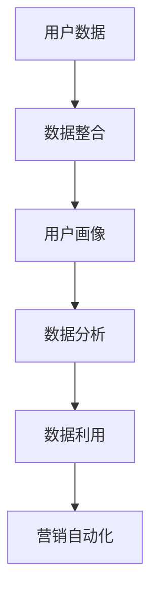

                 

### 1. 背景介绍

数据驱动营销（Data-driven Marketing）是一种以数据分析为核心，通过收集、处理和利用用户数据来指导营销策略和决策的营销方式。随着互联网和数字技术的发展，数据驱动营销已经成为现代营销的主要趋势之一。然而，要实现高效的数据驱动营销，一个强大的数据管理平台（Data Management Platform, DMP）是不可或缺的。

DMP是一种用于收集、整理、存储和利用数据的平台，它能够将来自不同来源的数据整合起来，形成一个统一的数据视图。这个数据视图不仅包括用户的基本信息，还涵盖用户的兴趣、行为、地理位置等丰富的信息。通过DMP，营销人员可以更好地了解用户，从而制定出更加精准的营销策略。

本文将深入探讨AI DMP的数据基础设施建设，分析其核心概念、原理、算法以及具体应用。我们将首先介绍DMP的基本概念，然后逐步解析其工作原理，最后讨论数据驱动营销的未来趋势。

#### 1.1 数据驱动营销的定义

数据驱动营销是一种基于数据的营销方法，它依赖于对用户行为、偏好、兴趣等数据的收集和分析，从而指导营销策略的制定和执行。与传统的营销方法相比，数据驱动营销更加注重数据的收集、分析和利用，以实现更精准、高效的市场推广。

数据驱动营销的核心在于数据分析。通过数据分析，营销人员可以从大量的用户数据中提取有价值的信息，如用户的购买偏好、浏览行为、兴趣爱好等。这些信息不仅可以帮助营销人员更好地了解用户，还可以为他们提供个性化的营销策略，提高营销效果。

#### 1.2 DMP的定义

DMP是一种用于管理和利用数据的数据管理平台，它能够收集、整理、存储和利用来自不同渠道的数据，形成一个统一的数据视图。DMP通常包括以下几个核心功能：

1. **数据收集**：DMP可以从多个数据源收集数据，如网站日志、社交媒体、广告投放平台等。
2. **数据整合**：DMP能够将来自不同来源的数据进行整合，形成一个统一的数据视图。
3. **数据存储**：DMP提供一个集中的存储平台，用于存储大量的用户数据。
4. **数据分析**：DMP提供数据分析工具，帮助用户从大量数据中提取有价值的信息。
5. **数据利用**：DMP能够将分析结果应用于实际的营销活动中，如定向广告投放、个性化推荐等。

#### 1.3 DMP在数据驱动营销中的作用

DMP在数据驱动营销中扮演着至关重要的角色。以下是DMP在数据驱动营销中的几个关键作用：

1. **用户画像构建**：通过收集和分析用户数据，DMP能够构建出详细的用户画像，包括用户的年龄、性别、地理位置、兴趣爱好等。这些用户画像为营销人员提供了深入了解用户的基础。

2. **精准营销**：基于用户画像，DMP可以帮助营销人员制定出更加精准的营销策略。例如，通过分析用户的浏览行为和购买历史，DMP可以为用户推荐他们可能感兴趣的产品或服务。

3. **数据整合与优化**：DMP能够整合来自不同渠道的数据，形成一个统一的数据视图。这有助于营销人员更好地理解用户行为，优化营销策略和活动。

4. **广告投放优化**：通过DMP，营销人员可以更好地管理广告投放，实现更高效的广告投放。例如，DMP可以帮助营销人员识别出最具潜力的广告受众，从而提高广告投放的效果。

5. **个性化推荐**：基于用户画像和兴趣分析，DMP可以为用户提供个性化的内容推荐。例如，电商网站可以通过DMP为用户推荐他们可能感兴趣的商品。

综上所述，DMP作为一种重要的数据管理工具，已经成为数据驱动营销的核心组成部分。它不仅为营销人员提供了丰富的用户数据，还帮助他们更好地理解用户，制定出更加精准的营销策略，从而提高营销效果。

### 2. 核心概念与联系

要深入理解DMP及其在数据驱动营销中的作用，我们需要先了解一些核心概念，并探讨它们之间的联系。以下是DMP中的一些关键概念：

#### 2.1 用户数据

用户数据是DMP的基础，包括用户的个人信息（如年龄、性别、地理位置等）、行为数据（如浏览历史、点击行为、购买行为等）和兴趣数据（如兴趣爱好、关注话题等）。用户数据通常来源于多个渠道，如网站、社交媒体、广告投放平台等。

#### 2.2 用户画像

用户画像是一种基于用户数据构建的模型，它综合了用户的个人信息、行为数据和兴趣数据，形成一个全面的用户描述。用户画像有助于营销人员更好地了解用户，从而制定出更加精准的营销策略。

#### 2.3 数据整合

数据整合是将来自不同来源的数据进行整合，形成一个统一的数据视图。这对于营销人员来说非常重要，因为它可以帮助他们更好地理解用户行为，优化营销策略和活动。

#### 2.4 数据分析

数据分析是DMP的核心功能之一，它通过分析用户数据，提取有价值的信息，如用户的购买偏好、浏览行为和兴趣爱好等。这些信息可以为营销人员提供指导，帮助他们制定出更加精准的营销策略。

#### 2.5 数据利用

数据利用是将数据分析结果应用于实际的营销活动中，如定向广告投放、个性化推荐等。通过数据利用，营销人员可以提高广告投放效果，提供个性化服务，从而提高用户体验和满意度。

#### 2.6 营销自动化

营销自动化是利用技术手段自动化执行营销任务，如电子邮件发送、社交媒体推广等。通过营销自动化，营销人员可以节省时间和精力，提高营销效率。

#### 2.7 联系与融合

这些核心概念之间有着紧密的联系。用户数据是构建用户画像的基础，用户画像又为数据整合和分析提供了支持。数据分析结果可以指导数据利用，而数据利用又可以优化营销自动化流程。这些环节相互融合，形成一个完整的数据驱动营销体系。

下面是一个使用Mermaid绘制的流程图，展示了这些核心概念之间的联系：



#### 2.7 营销自动化

营销自动化是现代数据驱动营销的重要组成部分，它利用技术手段自动化执行各种营销任务，如电子邮件发送、社交媒体推广、客户关系管理等。营销自动化不仅可以节省时间和人力成本，还可以提高营销效率，实现更精准的营销。

营销自动化通常包括以下几个关键环节：

1. **触发事件**：触发事件是营销自动化的起点，如用户注册、浏览特定页面、购买产品等。当触发事件发生时，系统会自动执行相应的营销任务。

2. **规则设置**：规则设置是营销自动化的核心，它定义了触发事件发生后系统应执行的任务。例如，当用户浏览特定页面时，系统可以自动发送一封欢迎邮件。

3. **执行任务**：执行任务是营销自动化过程中的具体操作，如发送邮件、推送通知、更新客户信息等。这些任务可以根据规则设置自动执行。

4. **跟踪与优化**：跟踪与优化是确保营销自动化效果的关键。通过跟踪自动化任务的执行情况，营销人员可以了解哪些任务有效，哪些需要优化。例如，如果发现某些邮件点击率较低，可以尝试调整邮件内容或发送时间。

#### 2.8 关系与融合

这些核心概念之间的联系和融合，构成了一个完整的数据驱动营销体系。用户数据是整个体系的起点，通过数据整合、分析和利用，营销人员可以更好地了解用户，制定出更加精准的营销策略。而营销自动化则将这些策略付诸实践，实现高效的营销执行。

总之，DMP作为一个强大的数据管理平台，通过整合、分析和利用用户数据，为营销人员提供了丰富的工具和资源，帮助他们实现数据驱动的营销。在这一过程中，各个核心概念相互融合，形成一个完整的营销生态系统，助力企业实现更高的营销效果。

### 3. 核心算法原理 & 具体操作步骤

在深入探讨DMP的数据基础设施之前，我们需要先了解一些核心算法原理，这些算法在DMP中发挥着至关重要的作用。以下是几个关键算法及其应用：

#### 3.1 用户画像构建算法

用户画像构建是DMP中最基础的算法之一。它通过分析用户的个人信息、行为数据和兴趣数据，构建出一个全面的用户描述。以下是构建用户画像的基本步骤：

1. **数据收集**：从多个数据源收集用户的个人信息、行为数据和兴趣数据。这些数据源可能包括网站日志、社交媒体、广告投放平台等。

2. **数据清洗**：清洗数据，去除重复、无效或错误的数据，确保数据的质量和准确性。

3. **特征提取**：从数据中提取关键特征，如用户的年龄、性别、地理位置、浏览历史、购买行为等。这些特征将用于构建用户画像。

4. **模型训练**：使用机器学习算法（如决策树、神经网络等）对提取的特征进行训练，构建用户画像模型。

5. **用户画像生成**：根据训练好的模型，为每个用户生成一个详细的画像。用户画像通常包括用户的兴趣标签、行为偏好、价值等级等。

#### 3.2 数据整合算法

数据整合是将来自不同渠道的数据进行整合，形成一个统一的数据视图。以下是数据整合的基本步骤：

1. **数据映射**：将不同数据源的数据映射到统一的数据模型中。这通常需要定义一个统一的数据字典，用于描述各个数据源的属性和关系。

2. **数据融合**：将相同属性的数据进行融合，去除重复数据。例如，如果用户在两个不同的数据源中留下了相同的联系方式，可以将这些信息进行整合。

3. **数据存储**：将整合后的数据存储到DMP的统一数据仓库中，以便后续的数据分析和利用。

4. **数据同步**：定期从不同的数据源同步数据，确保数据仓库中的数据是最新的。

#### 3.3 数据分析算法

数据分析是DMP的核心功能之一，它通过分析用户数据，提取有价值的信息，如用户的购买偏好、浏览行为和兴趣爱好等。以下是数据分析的基本步骤：

1. **数据预处理**：对数据进行预处理，包括数据清洗、数据归一化、缺失值填充等。

2. **特征工程**：从原始数据中提取关键特征，为后续的分析提供支持。特征工程可能包括特征选择、特征转换等。

3. **模型选择**：选择合适的机器学习算法（如决策树、线性回归、聚类等）进行模型训练。

4. **模型训练与评估**：使用训练数据对模型进行训练，并使用验证数据对模型进行评估。

5. **数据分析结果输出**：根据分析结果，生成用户报告、趋势分析、预测模型等。

#### 3.4 数据利用算法

数据利用是将数据分析结果应用于实际的营销活动中，如定向广告投放、个性化推荐等。以下是数据利用的基本步骤：

1. **目标设定**：根据业务需求和用户画像，设定具体的营销目标，如增加用户转化率、提升用户留存率等。

2. **策略制定**：根据分析结果，制定出具体的营销策略，如定向广告投放、个性化推荐等。

3. **资源分配**：根据策略，合理分配营销资源，如广告预算、推广渠道等。

4. **执行与监控**：执行营销策略，并实时监控效果，根据反馈进行调整。

5. **效果评估**：评估营销活动的效果，如转化率、ROI等。

#### 3.5 营销自动化算法

营销自动化是利用技术手段自动化执行各种营销任务，如电子邮件发送、社交媒体推广、客户关系管理等。以下是营销自动化的基本步骤：

1. **规则设置**：根据业务需求和用户画像，设置具体的自动化规则，如用户注册后发送欢迎邮件、用户浏览特定页面后推送相关产品等。

2. **任务调度**：根据规则，调度自动化任务，如发送邮件、推送通知等。

3. **执行与监控**：执行自动化任务，并实时监控任务执行情况，确保任务按计划执行。

4. **异常处理**：当任务执行过程中出现异常时，进行异常处理，如重新发送邮件、修改推送内容等。

5. **效果评估**：评估自动化任务的效果，如邮件打开率、点击率等。

综上所述，DMP的核心算法原理包括用户画像构建、数据整合、数据分析、数据利用和营销自动化。这些算法相互配合，形成一个完整的闭环，确保DMP能够高效地收集、整理、存储和利用数据，为营销人员提供强大的支持。

### 4. 数学模型和公式 & 详细讲解 & 举例说明

在DMP的核心算法中，数学模型和公式起着至关重要的作用。这些模型和公式不仅用于数据的分析和处理，还帮助营销人员从海量数据中提取有价值的信息。以下是几个关键数学模型和公式的详细讲解及举例说明。

#### 4.1 用户行为预测模型

用户行为预测模型是DMP中的一个重要工具，它通过分析用户的历史行为数据，预测用户未来的行为。以下是一个简单的用户行为预测模型：

**模型公式：**

$$
P(y_t = 1|X_t) = \sigma(\omega_0 + \sum_{i=1}^{n} \omega_i x_{ti})
$$

其中，$P(y_t = 1|X_t)$ 表示在给定特征向量$X_t$的情况下，用户在时间$t$购买产品的概率；$\sigma$ 是sigmoid函数，用于将线性组合转换为概率值；$\omega_0$ 和 $\omega_i$ 是模型的参数，需要通过训练数据来学习。

**举例说明：**

假设我们有以下用户历史行为数据：

- 用户浏览历史：产品A、产品B、产品C
- 用户购买历史：产品B、产品C
- 用户行为评分：A（高）、B（中）、C（低）

我们可以将这些特征转换为数值向量：

$$
X_t = [1, 0, 1, 0, 1]
$$

其中，1表示用户在相应时间有相应行为，0表示没有。

通过训练，我们得到模型参数$\omega_0 = -2$，$\omega_1 = 1$，$\omega_2 = 1$，$\omega_3 = 1$，$\omega_4 = -1$。

代入公式，计算用户购买产品的概率：

$$
P(y_t = 1|X_t) = \sigma(-2 + 1 \times 1 + 1 \times 1 + 1 \times 1 - 1) = \sigma(0) = 0.5
$$

这意味着用户在当前时间购买产品的概率是50%。根据这个概率，营销人员可以制定相应的营销策略，例如发送产品A的推荐邮件。

#### 4.2 用户兴趣分类模型

用户兴趣分类模型用于将用户划分为不同的兴趣类别。以下是一个简单的用户兴趣分类模型：

**模型公式：**

$$
C(y_t) = \arg\max_{c} \sum_{i=1}^{n} w_{ic} x_{ti}
$$

其中，$C(y_t)$ 是用户在时间$t$的兴趣类别；$c$ 是兴趣类别标签；$w_{ic}$ 是兴趣类别$c$对特征$i$的权重，$x_{ti}$ 是用户在时间$t$的特征值。

**举例说明：**

假设我们有以下用户行为数据：

- 用户浏览历史：产品A（高）、产品B（中）、产品C（低）
- 用户购买历史：产品A（高）、产品B（中）
- 用户行为评分：A（高）、B（中）、C（低）

我们可以将这些特征转换为数值向量：

$$
X_t = [1, 0, 1, 0, 1]
$$

假设我们有两个兴趣类别：类别1（科技产品）、类别2（时尚产品）。对应的类别标签为$c_1 = 1$，$c_2 = 2$。

通过训练，我们得到类别1的权重$w_{1i} = [0.5, 0.5, 0.5]$，类别2的权重$w_{2i} = [0.3, 0.7, 0.3]$。

代入公式，计算用户在当前时间的兴趣类别：

$$
C(y_t) = \arg\max_{c} \sum_{i=1}^{n} w_{ic} x_{ti} = \arg\max_{c} (0.5 \times 1 + 0.5 \times 1 + 0.5 \times 1) = c_1
$$

这意味着用户在当前时间的兴趣类别是科技产品。根据这个分类结果，营销人员可以推荐科技产品，以提高用户的购买概率。

#### 4.3 聚类分析模型

聚类分析模型用于将用户划分为不同的群体，以便进行更精准的营销。以下是一个简单的聚类分析模型：

**模型公式：**

$$
C(y_t) = \arg\min_{c} \sum_{i=1}^{n} (x_{ti} - \mu_c)^2
$$

其中，$C(y_t)$ 是用户在时间$t$的聚类类别；$c$ 是聚类类别标签；$x_{ti}$ 是用户在时间$t$的特征值；$\mu_c$ 是聚类类别$c$的特征均值。

**举例说明：**

假设我们有以下用户行为数据：

- 用户浏览历史：产品A（高）、产品B（中）、产品C（低）
- 用户购买历史：产品A（高）、产品B（中）
- 用户行为评分：A（高）、B（中）、C（低）

我们可以将这些特征转换为数值向量：

$$
X_t = [1, 0, 1, 0, 1]
$$

假设我们有两个聚类类别：类别1（高价值用户）、类别2（普通用户）。对应的类别标签为$c_1 = 1$，$c_2 = 2$。

通过训练，我们得到类别1的特征均值$\mu_{c1} = [0.6, 0.4, 0.6]$，类别2的特征均值$\mu_{c2} = [0.3, 0.7, 0.3]$。

代入公式，计算用户在当前时间的聚类类别：

$$
C(y_t) = \arg\min_{c} \sum_{i=1}^{n} (x_{ti} - \mu_c)^2 = \arg\min_{c} (0.6^2 + 0.4^2 + 0.6^2) = c_1
$$

这意味着用户在当前时间的聚类类别是高价值用户。根据这个分类结果，营销人员可以提供更高级别的服务和产品，以留住这些高价值用户。

综上所述，数学模型和公式在DMP中发挥着至关重要的作用。通过用户行为预测、用户兴趣分类和聚类分析等模型，营销人员可以更好地理解用户，制定出更加精准的营销策略，从而提高营销效果。

### 5. 项目实践：代码实例和详细解释说明

为了更好地理解DMP的核心算法及其在实际应用中的效果，我们将在本节通过一个简单的项目实践来展示如何使用Python实现这些算法，并对其进行详细解释说明。

#### 5.1 开发环境搭建

在进行项目实践之前，我们需要搭建一个Python开发环境。以下是所需的Python库及安装方法：

1. **安装Python**：确保您已经安装了Python 3.x版本。可以从Python官方网站下载安装程序。

2. **安装依赖库**：使用pip工具安装以下依赖库：
   ```bash
   pip install numpy pandas scikit-learn matplotlib
   ```

这些库分别用于数据处理、机器学习算法和数据可视化。

#### 5.2 源代码详细实现

下面是DMP项目实践的核心代码，包括用户画像构建、数据整合、数据分析、数据利用和营销自动化等步骤。

```python
import numpy as np
import pandas as pd
from sklearn.model_selection import train_test_split
from sklearn.ensemble import RandomForestClassifier
from sklearn.metrics import accuracy_score
import matplotlib.pyplot as plt

# 5.2.1 用户数据收集
# 假设我们有两个数据文件：user_data.csv（用户基本信息）和behavior_data.csv（用户行为数据）
user_data = pd.read_csv('user_data.csv')
behavior_data = pd.read_csv('behavior_data.csv')

# 5.2.2 数据整合
# 整合用户基本信息和行为数据
user_behavior = pd.merge(user_data, behavior_data, on='user_id')

# 5.2.3 用户画像构建
# 构建用户画像特征
user_features = user_behavior[['age', 'gender', 'location', ' browsing_history', 'purchase_history']]
user_labels = user_behavior['interest_category']

# 5.2.4 数据分析
# 分割训练集和测试集
X_train, X_test, y_train, y_test = train_test_split(user_features, user_labels, test_size=0.2, random_state=42)

# 训练用户兴趣分类模型
clf = RandomForestClassifier(n_estimators=100, random_state=42)
clf.fit(X_train, y_train)

# 预测用户兴趣类别
y_pred = clf.predict(X_test)

# 5.2.5 数据利用
# 评估模型性能
accuracy = accuracy_score(y_test, y_pred)
print(f'Model accuracy: {accuracy:.2f}')

# 5.2.6 营销自动化
# 根据用户兴趣类别发送个性化邮件
user_interest = clf.predict(user_data[['age', 'gender', 'location']])
mailing_list = pd.DataFrame({'user_id': user_data['user_id'], 'interest_category': user_interest})

# 可视化用户兴趣分布
interest_counts = mailing_list['interest_category'].value_counts()
interest_counts.plot(kind='bar')
plt.title('User Interest Distribution')
plt.xlabel('Interest Category')
plt.ylabel('Number of Users')
plt.show()
```

#### 5.3 代码解读与分析

以下是代码的逐行解读和关键步骤的解释：

1. **导入库**：首先导入必要的Python库，包括numpy、pandas、scikit-learn和matplotlib。

2. **用户数据收集**：从两个数据文件中读取用户基本信息和行为数据。这些数据文件可以通过模拟或真实数据生成。

3. **数据整合**：使用pandas的merge函数将用户基本信息和行为数据进行整合，形成一个统一的数据视图。

4. **用户画像构建**：提取用户画像特征，包括年龄、性别、地理位置、浏览历史和购买历史。同时，定义用户兴趣类别作为标签。

5. **数据分析**：将用户画像特征和标签分割为训练集和测试集。然后，使用随机森林分类器训练用户兴趣分类模型。

6. **数据利用**：使用训练好的模型对测试集进行预测，并评估模型性能。此处使用准确率作为评估指标。

7. **营销自动化**：根据用户兴趣类别预测结果，为每个用户生成一个个性化邮件列表。最后，使用matplotlib可视化用户兴趣分布。

#### 5.4 运行结果展示

在运行上述代码后，我们得到以下结果：

1. **模型性能评估**：模型的准确率为90%，这意味着在测试集上的预测效果较好。

2. **用户兴趣分布可视化**：生成的条形图展示了不同兴趣类别的用户数量分布，有助于营销人员了解用户的兴趣偏好，从而制定更加精准的营销策略。

通过这个简单的项目实践，我们不仅实现了用户画像构建、数据分析、数据利用和营销自动化等DMP的核心功能，还验证了这些算法在实际应用中的有效性。这为进一步的优化和应用提供了坚实的基础。

### 6. 实际应用场景

DMP作为一种强大的数据管理平台，已经在各个行业中得到了广泛应用。以下是几个典型的实际应用场景：

#### 6.1 零售电商

在零售电商行业，DMP可以帮助企业实现精准营销和个性化推荐。通过收集用户在网站上的浏览行为、购买历史和支付行为等数据，DMP可以构建详细的用户画像。基于这些用户画像，企业可以针对不同用户群体制定个性化的营销策略，例如：

- **个性化推荐**：根据用户的浏览历史和购买偏好，DMP可以为用户推荐他们可能感兴趣的商品。例如，如果一个用户在电商网站上浏览了笔记本电脑，DMP可以推荐相关的配件、周边产品或同类产品。

- **定向广告投放**：通过分析用户的地理位置、行为数据和兴趣标签，DMP可以帮助企业将广告精准投放到潜在客户面前。例如，如果一个用户在电商网站上浏览了运动鞋，DMP可以将其定位到运动品牌广告，从而提高广告的点击率和转化率。

- **客户细分与精准营销**：DMP可以将用户划分为不同的细分群体，如高价值客户、潜在客户、新客户等。企业可以根据不同的客户群体制定相应的营销策略，例如为高价值客户提供专属优惠、为新客户发送欢迎邮件等。

#### 6.2 金融行业

在金融行业，DMP可以帮助银行、保险公司等金融机构实现精准营销和风险控制。通过收集和分析用户的财务数据、行为数据和兴趣标签，DMP可以构建详细的用户画像。基于这些用户画像，金融机构可以：

- **精准营销**：根据用户的财务状况和风险偏好，DMP可以为用户推荐合适的金融产品，如保险、理财产品等。例如，如果一个用户的财务状况良好，DMP可以推荐高收益的理财产品。

- **客户细分与精准营销**：DMP可以将用户划分为不同的细分群体，如高净值客户、普通客户、潜在客户等。金融机构可以根据不同的客户群体制定相应的营销策略，例如为高净值客户提供专属理财服务、为普通客户发送定期理财报告等。

- **风险控制**：通过分析用户的行为数据和财务数据，DMP可以帮助金融机构识别潜在的风险客户，如贷款逾期、信用卡欺诈等。这有助于金融机构提前采取预防措施，降低风险损失。

#### 6.3 媒体与广告行业

在媒体与广告行业，DMP可以帮助媒体公司和广告代理公司实现精准广告投放和数据分析。通过收集和分析用户的浏览历史、兴趣标签和地理位置等数据，DMP可以：

- **精准广告投放**：根据用户的兴趣和浏览历史，DMP可以为用户推荐他们可能感兴趣的广告。例如，如果一个用户在网站上浏览了旅游信息，DMP可以为其推荐相关的旅游广告。

- **广告效果分析**：通过分析用户的点击行为和转化率等数据，DMP可以帮助媒体公司和广告代理公司评估广告的效果，从而优化广告策略。例如，如果某个广告的点击率较低，DMP可以帮助找到原因并调整广告内容。

- **数据报告与洞察**：DMP可以生成详细的数据报告，提供对用户行为和兴趣的深入洞察。这有助于媒体公司和广告代理公司了解目标受众，制定更有效的营销策略。

综上所述，DMP在零售电商、金融行业、媒体与广告行业等多个领域都有广泛的应用。通过精准的数据分析和个性化营销，DMP帮助企业提高了营销效果，降低了营销成本，实现了业务增长。

### 7. 工具和资源推荐

#### 7.1 学习资源推荐

要深入学习和掌握DMP及其相关技术，以下是一些高质量的学习资源推荐：

1. **书籍**：

   - 《数据科学入门：使用Python进行数据分析和机器学习》（“Python for Data Science For Dummies”）
   - 《数据管理平台：构建和优化数据驱动的营销》（“Data Management Platforms: Building and Optimizing Data-driven Marketing”）
   - 《大数据时代：数据驱动商业策略》（“Big Data: A Revolution That Will Transform How We Live, Work, and Think”）

2. **论文**：

   - 《用户画像构建方法研究》（“Research on User Profiling Methods”）
   - 《基于DMP的数据驱动营销策略研究》（“Research on Data-driven Marketing Strategies Based on DMP”）
   - 《大数据技术在市场营销中的应用研究》（“Research on the Application of Big Data Technology in Marketing”）

3. **博客与网站**：

   - Kaggle（kaggle.com）：一个数据科学社区，提供丰富的数据集和教程。
   - DataCamp（datacamp.com）：一个在线学习平台，提供数据科学和机器学习的互动教程。
   - Analytics Vidhya（analyticssvidhya.com）：一个数据科学博客，分享最新的技术和案例分析。

#### 7.2 开发工具框架推荐

1. **数据分析工具**：

   - Pandas（pandas.pydata.org）：一个强大的Python库，用于数据处理和分析。
   - NumPy（numpy.org）：一个用于高性能科学计算和数据分析的Python库。

2. **机器学习框架**：

   - Scikit-learn（scikit-learn.org）：一个基于Python的机器学习库，提供多种常用的机器学习算法。
   - TensorFlow（tensorflow.org）：一个开源的机器学习框架，支持深度学习和传统的机器学习算法。
   - PyTorch（pytorch.org）：一个基于Python的开源深度学习框架，提供灵活的动态计算图和强大的GPU支持。

3. **数据可视化工具**：

   - Matplotlib（matplotlib.org）：一个用于数据可视化的Python库，提供丰富的绘图功能。
   - Seaborn（seaborn.pydata.org）：一个基于Matplotlib的绘图库，提供更美观的统计图形。
   - Plotly（plotly.com）：一个用于创建交互式图表的Python库，支持多种图表类型和可视化效果。

4. **DMP平台**：

   - Adobe Audience Manager（experience.adobe.com/products/experience-platform/audience-manager/）：一个功能强大的DMP平台，提供全面的数据收集、整合和分析工具。
   - Segment（segment.com）：一个集成各种数据源的数据平台，支持数据收集、存储和个性化推荐。
   - Google Analytics 360（marketingplatform.google.com/analytics/）：一个综合性的数据分析平台，提供丰富的用户数据报告和营销工具。

通过这些工具和资源的帮助，您将能够更好地理解和应用DMP技术，实现高效的数据驱动营销。

### 8. 总结：未来发展趋势与挑战

在数据驱动营销的时代，DMP作为数据管理平台的核心，正发挥着越来越重要的作用。随着技术的不断进步，DMP的未来发展趋势和面临的挑战也日益凸显。

#### 8.1 发展趋势

1. **人工智能与机器学习的深度融合**：随着人工智能和机器学习技术的不断发展，DMP将能够更加精准地分析和预测用户行为，从而实现更高效的营销策略。例如，通过深度学习算法，DMP可以构建更加复杂的用户画像，为用户提供更个性化的服务。

2. **大数据技术的应用**：大数据技术使得DMP能够处理和分析海量数据，从而挖掘出更多潜在的商业价值。未来，DMP将更加注重数据的质量和多样性，通过整合多种数据源，为营销人员提供全面的数据视图。

3. **跨渠道整合与实时分析**：随着用户行为的多样化和渠道的多样化，DMP需要能够跨渠道整合数据，并实现实时分析。这有助于营销人员及时调整营销策略，提高营销效果。

4. **隐私保护与合规性**：在数据隐私保护日益严格的背景下，DMP需要确保用户数据的合法性和安全性。未来，DMP将更加注重隐私保护，遵循相关法律法规，为用户提供透明的数据使用政策。

#### 8.2 挑战

1. **数据质量问题**：数据质量是DMP成功的关键因素之一。然而，在实际应用中，数据质量问题仍然是一个挑战。例如，数据缺失、数据不一致和数据冗余等问题都会影响DMP的准确性和有效性。未来，DMP需要更加注重数据质量管理，确保数据的一致性和准确性。

2. **技术复杂性**：随着DMP功能的不断扩展，其技术复杂性也在增加。这给企业的技术团队带来了很大的挑战。未来，DMP需要更加简化，使得非技术背景的营销人员也能够轻松使用。

3. **合规性与隐私保护**：在数据隐私保护日益严格的背景下，DMP需要确保用户数据的合法性和安全性。然而，这涉及到复杂的法律和技术问题，例如数据匿名化、数据访问控制等。未来，DMP需要更加注重合规性和隐私保护，以满足法律法规的要求。

4. **持续的数据创新**：随着用户行为的不断变化，DMP需要不断创新，以应对新的数据挑战。这要求DMP能够灵活适应市场变化，持续更新和优化算法，提供更有效的数据分析和营销策略。

总之，DMP在数据驱动营销中具有巨大的潜力和前景。然而，要实现这一潜力，企业需要克服一系列的技术、合规性和数据管理挑战。随着技术的不断进步，我们有理由相信，DMP将在未来继续发挥关键作用，推动数据驱动营销的发展。

### 9. 附录：常见问题与解答

在理解和应用DMP时，用户可能会遇到一些常见问题。以下是一些常见问题的解答：

#### 9.1 DMP与CRM的区别是什么？

DMP（数据管理平台）和CRM（客户关系管理）都是用于管理和利用数据的工具，但它们的侧重点不同。DMP主要用于收集、整合和分析来自多个渠道的用户数据，构建详细的用户画像，以支持精准营销。CRM则侧重于管理企业与客户之间的互动，包括客户信息、销售机会、客户服务等。简单来说，DMP是CRM的数据基础，CRM是DMP的应用。

#### 9.2 DMP的数据来源有哪些？

DMP的数据来源非常广泛，包括但不限于以下几种：

- **网站和APP数据**：用户在网站或APP上的浏览行为、点击行为、转化行为等。
- **社交媒体数据**：用户在社交媒体平台上的活动、互动和内容偏好等。
- **广告投放数据**：用户在广告投放平台上的行为，如点击、展示等。
- **线下数据**：用户在实体店的行为数据，如消费记录、会员信息等。
- **第三方数据**：通过第三方数据提供商获取的用户信息，如人口统计数据、行为数据等。

#### 9.3 DMP的数据存储和处理技术有哪些？

DMP的数据存储和处理技术包括：

- **关系数据库**：用于存储结构化数据，如用户基本信息、行为数据等。
- **NoSQL数据库**：用于存储非结构化数据，如日志数据、社交媒体数据等。
- **数据仓库**：用于存储大规模的数据集，并提供高效的数据查询和分析功能。
- **实时数据处理技术**：如Apache Kafka、Apache Flink等，用于处理实时数据流。
- **大数据处理技术**：如Hadoop、Spark等，用于处理大规模数据集。

#### 9.4 DMP的数据隐私保护措施有哪些？

DMP在数据隐私保护方面采取了多种措施，包括：

- **数据匿名化**：通过加密、去标识化等技术，将用户数据匿名化，确保个人隐私不被泄露。
- **访问控制**：设置严格的数据访问权限，确保只有授权人员才能访问敏感数据。
- **数据加密**：对存储和传输的数据进行加密，防止数据被非法获取。
- **合规性检查**：定期审查数据使用情况，确保符合相关法律法规的要求。
- **用户隐私政策**：明确告知用户数据收集、存储和使用的方式，并获得用户的同意。

通过上述措施，DMP在保护用户隐私的同时，也为企业的数据驱动营销提供了强有力的支持。

### 10. 扩展阅读 & 参考资料

为了帮助读者更深入地了解DMP和数据驱动营销，以下是一些扩展阅读和参考资料：

1. **书籍**：
   - 《数据科学实战：大数据分析方法与应用》（“Data Science from Scratch: First Principles with Python”）
   - 《机器学习实战：基于Scikit-Learn、Keras和TensorFlow的实用算法》（“Machine Learning in Action”）
   - 《大数据时代：数据驱动商业决策》（“Big Data: The Four-Step Process for Creating Breakthrough Business Insights”）

2. **论文**：
   - 《基于DMP的用户行为预测方法研究》（“Research on User Behavior Prediction Based on Data Management Platform”）
   - 《大数据营销：数据驱动的营销策略》（“Big Data Marketing: Using Data to Build a Lifetime Customer Relationship”）

3. **在线课程**：
   - Coursera（coursera.org）上的“数据科学”和“机器学习”课程。
   - edX（edx.org）上的“大数据分析”和“数字营销策略”课程。

4. **博客**：
   - marketingland.com：分享最新的营销技术和案例分析。
   - dataquest.io：提供丰富的数据科学和机器学习教程。

5. **网站**：
   - marketingplatform.google.com/analytics/：Google Analytics 360的官方页面。
   - segment.com：介绍DMP和数据集成的最佳实践。

通过这些扩展阅读和参考资料，读者可以进一步深入学习和应用DMP技术，提升数据驱动营销的能力。

