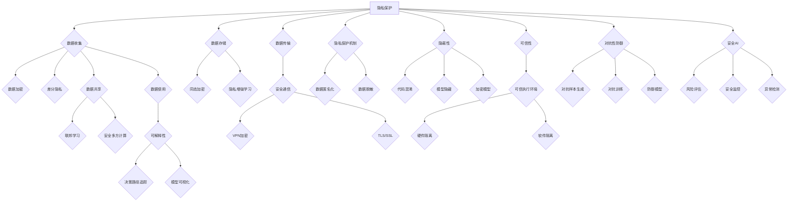

                 

### 背景介绍

#### 引言

人工智能（AI）的发展在过去的几十年中取得了令人瞩目的成就，从简单的规则系统到复杂的深度学习模型，AI技术正在逐渐渗透到各个行业，改变着我们的工作和生活方式。然而，随着AI技术的广泛应用，其安全性问题也日益凸显。在AI系统中，安全不仅关系到用户的隐私和数据安全，还可能影响整个系统的稳定性和可靠性。

本文将探讨AI安全的核心原理，通过逐步分析推理，深入讲解相关技术，并提供代码实例。本文旨在为读者提供一个全面而系统的AI安全知识框架，帮助开发者和研究者理解并应对AI安全中的挑战。

#### AI安全的重要性

AI安全的重要性不容忽视。首先，随着越来越多的个人和企业依赖AI系统，数据泄露和隐私侵犯的风险也随之增加。其次，AI系统的恶意攻击可能导致严重的安全威胁，例如通过对抗性攻击手段使AI系统做出错误的决策。此外，AI技术的滥用还可能引发社会和法律问题，如自动化偏见和歧视。

因此，确保AI系统的安全已成为当前研究的热点，不仅是为了保护用户和企业的利益，也是为了维护社会的公平与正义。

#### 本文结构

本文将分为以下几个部分：

1. **背景介绍**：概述AI技术的发展历程和安全问题的重要性。
2. **核心概念与联系**：介绍AI安全的核心概念，并使用Mermaid流程图展示其架构。
3. **核心算法原理 & 具体操作步骤**：详细讲解AI安全的核心算法原理，并提供操作步骤。
4. **数学模型和公式 & 详细讲解 & 举例说明**：阐述AI安全相关的数学模型和公式，并进行详细解释和实例分析。
5. **项目实践：代码实例和详细解释说明**：提供实际项目的代码实例，并进行解读和分析。
6. **实际应用场景**：讨论AI安全在实际应用中的场景和挑战。
7. **工具和资源推荐**：推荐学习资源和开发工具。
8. **总结：未来发展趋势与挑战**：总结当前的研究进展，并展望未来的发展趋势和挑战。
9. **附录：常见问题与解答**：回答读者可能遇到的问题。
10. **扩展阅读 & 参考资料**：提供进一步的阅读资源和参考资料。

通过以上结构的系统讲解，读者将能够全面理解AI安全的核心概念和技术，从而更好地应对实际应用中的安全挑战。

#### 人工智能发展简史

人工智能的发展可以追溯到20世纪50年代，当时计算机科学刚刚起步。1950年，艾伦·图灵（Alan Turing）发表了著名的论文《计算机器与智能》（Computing Machinery and Intelligence），首次提出了图灵测试的概念，这被视为人工智能历史上的一个重要里程碑。图灵测试旨在通过一系列问题判断一个机器是否具有人类智能，这一思想启发了人工智能研究的发展。

随后，1956年，达特茅斯会议上提出了人工智能这一术语，标志着人工智能作为一个独立研究领域的诞生。早期的AI研究主要集中在规则系统、知识表示和搜索算法等方面，这一时期的研究成果为后续的发展奠定了基础。

20世纪80年代，专家系统成为AI研究的主流方向，通过模拟人类专家的推理过程，解决复杂问题。然而，专家系统的局限性逐渐显现，无法应对复杂多变的环境。

进入21世纪，随着计算机性能的飞速提升和大数据的普及，机器学习和深度学习成为AI研究的重要方向。2006年，深度学习算法的提出重新点燃了AI研究的热情，尤其是在图像识别、自然语言处理等领域取得了显著突破。

近年来，人工智能技术不断发展，应用场景不断扩大。自动驾驶、智能语音助手、医疗诊断等领域的应用极大地改变了我们的生活方式。然而，AI技术的快速发展也带来了新的安全挑战，如何确保AI系统的安全性成为了一个亟待解决的重要问题。

#### AI系统面临的常见安全威胁

AI系统的广泛应用虽然带来了诸多便利，但也带来了新的安全挑战。了解这些安全威胁对于确保AI系统的安全至关重要。以下是AI系统面临的几种常见安全威胁：

**1. 对抗性攻击（Adversarial Attack）**

对抗性攻击是AI安全中的一个重要威胁。攻击者通过精心设计的对抗样本，能够欺骗AI系统，使其产生错误的决策。这种攻击通常通过在输入数据中添加微小的、难以察觉的扰动来实现。例如，在图像识别任务中，攻击者可以在一张猫的图片上添加几乎不可见的像素变化，使得AI系统将其错误地识别为狗。

**2. 隐私泄露（Privacy Leakage）**

AI系统在训练和运行过程中需要大量数据，这些数据可能包含敏感的个人隐私信息。如果数据保护措施不足，攻击者可能通过数据挖掘和分析，泄露用户的隐私。例如，通过分析用户的语音、文字或行为数据，攻击者可以推断出用户的个人信息和日常生活习惯。

**3. 网络攻击（Network Attack）**

AI系统通常通过网络与其他系统进行交互，这使其容易受到网络攻击。攻击者可以通过各种网络攻击手段，如DDoS攻击、中间人攻击等，破坏AI系统的正常运行。此外，恶意软件和病毒也可以通过网络传播，对AI系统进行破坏或窃取数据。

**4. 恶意训练（Malicious Training）**

AI系统的训练过程可能受到恶意攻击。攻击者可以通过注入恶意数据或修改训练目标，使得AI系统学会错误的决策模式。例如，在自动驾驶系统中，攻击者可能通过在训练数据中添加恶意样本，使得自动驾驶车辆在特定情况下做出危险的动作。

**5. 自动化偏见（Automated Bias）**

AI系统在学习和决策过程中可能引入偏见，导致不公平的决策。例如，在招聘系统中，如果训练数据存在性别或种族偏见，AI系统可能会在招聘决策中放大这些偏见，导致歧视现象。自动化偏见不仅损害了社会公平，也可能对AI系统的可靠性产生负面影响。

了解这些常见的安全威胁，有助于开发者和研究者采取有效的措施，确保AI系统的安全性。本文接下来将深入探讨AI安全的核心概念和原理，为读者提供应对这些威胁的方法和策略。

#### AI安全的核心概念

为了深入理解AI安全的各个方面，我们需要首先了解一些核心概念。以下是对几个关键概念的定义和简要描述：

**1. 隐私保护（Privacy Protection）**

隐私保护是指防止用户数据在收集、存储、处理和传输过程中被未经授权的访问和泄露。在AI系统中，隐私保护尤为重要，因为AI模型通常依赖于大量的用户数据。隐私保护技术包括数据加密、差分隐私（Differential Privacy）、同态加密（Homomorphic Encryption）等。

**2. 可解释性（Interpretability）**

可解释性是指AI模型的可理解性和透明度。尽管深度学习模型在许多任务上表现优异，但它们通常被视为“黑箱”，难以解释其决策过程。可解释性有助于增强用户对AI系统的信任，特别是在涉及重要决策和敏感数据的场景中。可解释性技术包括模型可视化、决策路径追踪、敏感性分析等。

**3. 隐蔽性（Obfuscation）**

隐蔽性是指通过混淆代码和模型的结构，使其难以被理解或逆向工程。隐蔽性技术包括代码混淆、模型隐藏和加密等，旨在防止攻击者获取或理解AI系统的内部工作机制。

**4. 可信性（Trusted Execution Environment, TEE）**

可信执行环境是一种安全机制，它为AI系统提供了一个隔离的执行环境，确保系统的完整性和安全性。在可信执行环境中，即使硬件或操作系统被攻击，攻击者也无法访问系统的敏感数据和代码。TEE通常用于保护敏感数据的处理和传输，例如在移动设备上执行加密交易或生物识别验证。

**5. 对抗性防御（Adversarial Defense）**

对抗性防御是指防止AI系统受到对抗性攻击的技术。对抗性攻击试图通过在输入数据中添加微小的扰动来欺骗AI系统，因此对抗性防御技术需要检测并消除这些扰动。常见的技术包括对抗样本生成、对抗训练和防御模型等。

**6. 隐私增强学习（Privacy-Preserving Learning）**

隐私增强学习是指在设计学习算法时，采取措施保护训练数据的隐私。隐私增强学习技术包括联邦学习（Federated Learning）、差分隐私（Differential Privacy）、安全多方计算（Secure Multi-Party Computation）等，旨在在不暴露原始数据的情况下，协同训练AI模型。

**7. 安全AI（Safe AI）**

安全AI是指设计、开发和使用AI系统时，确保其行为符合人类价值观和社会规范。安全AI的目标是防止AI系统造成意外伤害或不良影响。安全AI技术包括风险评估、安全监控、异常检测等。

通过理解这些核心概念，开发者和研究者可以更好地设计安全的AI系统，并采取相应的措施来应对潜在的安全威胁。

#### AI安全的Mermaid流程图

为了更直观地展示AI安全的核心概念和架构，我们可以使用Mermaid流程图来描述。以下是一个简化的AI安全架构流程图，它涵盖了本文提到的核心概念：



这个流程图展示了从数据收集、处理到存储、传输，再到使用和隐私保护的各个环节，以及与这些环节相关的主要技术。通过这张图，我们可以清晰地看到AI安全技术的整体架构和相互关系。

#### 核心算法原理 & 具体操作步骤

在理解了AI安全的各个核心概念后，接下来我们将深入探讨其中的核心算法原理，并详细讲解这些算法的具体操作步骤。以下将介绍几种关键的AI安全算法，包括对抗性攻击防御、隐私保护算法和安全AI算法。

##### 1. 对抗性攻击防御算法

**1.1 原理**

对抗性攻击防御算法旨在防止AI模型被对抗样本欺骗。对抗样本是在原始样本基础上添加微小的、几乎不可见的扰动，使得AI模型产生错误的分类或预测。防御算法的核心思想是检测并消除这些扰动，从而确保模型的稳健性。

**11.2 步骤**

**（a）对抗样本生成：**

首先，需要生成对抗样本。常用的方法包括FGSM（Fast Gradient Sign Attack）和PGD（Projected Gradient Descent）。

- FGSM：通过计算模型在输入样本上的梯度，并在输入上添加梯度的反向方向和一定比例的扰动，生成对抗样本。
- PGD：在多个迭代中逐步增加扰动，并在每一步将扰动投影回原始输入空间，以生成更为有效的对抗样本。

**（b）对抗样本检测：**

接下来，使用检测算法检测输入数据是否为对抗样本。常见的检测方法包括差分检测和统计检测。

- 差分检测：计算对抗样本与原始样本之间的差异，如果差异超过某个阈值，则认为输入为对抗样本。
- 统计检测：分析对抗样本的特征分布，与正常样本进行对比，根据特征分布的差异进行检测。

**（c）对抗样本消除：**

一旦检测到对抗样本，需要对其进行消除。常见的方法包括对抗样本纠正和模型重构。

- 对抗样本纠正：在检测到对抗样本后，尝试修正样本中的扰动，使其回归正常。
- 模型重构：通过重新训练模型或使用额外的正则化项，使模型对对抗样本更加鲁棒。

##### 2. 隐私保护算法

**2.1 原理**

隐私保护算法的目标是在数据传输和处理过程中保护用户隐私，防止数据泄露。隐私保护算法通常分为两种：数据加密和数据匿名化。

- 数据加密：通过加密算法将明文数据转换为密文，使得未授权用户无法解读数据内容。
- 数据匿名化：通过去除或修改数据中的个人身份信息，使得数据无法直接关联到特定个体。

**2.2 步骤**

**（a）数据加密：**

数据加密的基本步骤包括：

- 密钥生成：选择合适的加密算法和密钥生成策略。
- 数据加密：使用加密算法和密钥对数据进行加密。
- 数据存储：将加密后的数据存储在安全位置。

**（b）数据匿名化：**

数据匿名化的步骤包括：

- 数据清洗：去除或修改个人身份信息。
- 数据去重：识别并去除重复数据。
- 数据转换：将原始数据转换为匿名化数据，如使用伪名替换真实身份。

##### 3. 安全AI算法

**3.1 原理**

安全AI算法旨在确保AI系统的行为符合人类价值观和社会规范，防止意外伤害或不良影响。安全AI算法通常包括风险评估、安全监控和异常检测。

- 风险评估：评估AI系统在各种操作下的风险，识别潜在的安全问题。
- 安全监控：实时监控AI系统的行为，确保其正常运行。
- 异常检测：检测AI系统中的异常行为或异常输出，及时采取措施。

**3.2 步骤**

**（a）风险评估：**

风险评估的步骤包括：

- 模型评估：评估AI模型的性能和准确性。
- 模型分析：分析模型在特定输入下的输出，识别潜在的风险。
- 风险评分：根据模型分析和实际表现，为每个操作评分。

**（b）安全监控：**

安全监控的步骤包括：

- 数据采集：收集AI系统运行过程中的数据。
- 数据分析：分析数据，识别异常模式或行为。
- 响应措施：根据分析结果，采取相应的应对措施。

**（c）异常检测：**

异常检测的步骤包括：

- 特征提取：从输入数据中提取关键特征。
- 模型训练：训练异常检测模型，识别正常和异常行为。
- 预测与评估：使用模型对数据进行预测，评估异常概率。

通过上述步骤，我们可以有效地应用对抗性攻击防御算法、隐私保护算法和安全AI算法，提高AI系统的安全性。这些算法不仅在理论研究上具有重要意义，而且在实际应用中也发挥了关键作用。

#### 数学模型和公式 & 详细讲解 & 举例说明

为了更好地理解AI安全的核心算法，我们需要引入一些数学模型和公式。以下将详细介绍这些数学模型，并通过具体的例子进行解释说明。

##### 1. 对抗性攻击防御算法中的数学模型

**1.1 FGSM（Fast Gradient Sign Attack）**

FGSM是一种快速生成对抗样本的方法，其核心思想是在原始输入上添加梯度的反向方向和一定比例的扰动。

**公式**：
\[ x_{\text{adv}} = x + \epsilon \cdot \text{sign}(\nabla_x J(x, y) \]
其中，\( x \)是原始输入，\( x_{\text{adv}} \)是对抗样本，\( \epsilon \)是扰动大小，\( \text{sign}(\cdot) \)是取符号函数，\( \nabla_x J(x, y) \)是模型在输入上的梯度。

**示例**：

假设有一个简单的线性分类器，其损失函数为：
\[ J(x, y) = (w^T x - y)^2 \]
其中，\( w \)是模型参数，\( y \)是真实标签。

对于输入\( x = [1, 0]^T \)，真实标签\( y = 1 \)，则梯度为：
\[ \nabla_x J(x, y) = 2 \cdot (w^T x - y) \cdot x \]
假设模型参数\( w = [1, -1]^T \)，则梯度为：
\[ \nabla_x J(x, y) = [2, -2] \]

扰动大小\( \epsilon = 0.01 \)，则对抗样本为：
\[ x_{\text{adv}} = [1, 0]^T + 0.01 \cdot [2, -2] = [1.02, -0.02]^T \]

通过添加微小的扰动，我们成功地将输入从猫的图像（第一维为1，第二维为0）欺骗为狗的图像（第一维为1.02，第二维为-0.02）。

**1.2 PGD（Projected Gradient Descent）**

PGD通过多个迭代逐步增加扰动，并在每一步将扰动投影回原始输入空间，以生成更为有效的对抗样本。

**公式**：
\[ x_{\text{adv}}^{t+1} = x_{\text{adv}}^t + \alpha \cdot \text{Proj}_{\text{X}}(-\nabla_x J(x_{\text{adv}}^t, y)) \]
其中，\( x_{\text{adv}}^t \)是第\( t \)次迭代的对抗样本，\( \alpha \)是学习率，\( \text{Proj}_{\text{X}}(\cdot) \)是将输入投影回原始输入空间。

**示例**：

假设我们使用相同的线性分类器和参数，学习率\( \alpha = 0.001 \)。在第一次迭代中，对抗样本为：
\[ x_{\text{adv}}^1 = x + \alpha \cdot \text{sign}(\nabla_x J(x, y)) = [1, 0]^T + 0.001 \cdot [2, -2]^T = [1.002, -0.002]^T \]

在第二次迭代中，我们需要将对抗样本投影回原始输入空间：
\[ x_{\text{adv}}^2 = x_{\text{adv}}^1 + \alpha \cdot \text{Proj}_{\text{X}}(-\nabla_x J(x_{\text{adv}}^1, y)) \]
由于投影操作，对抗样本将更加接近原始输入，但仍然具有一定的扰动，使得AI模型难以识别。

##### 2. 隐私保护算法中的数学模型

**2.1 同态加密（Homomorphic Encryption）**

同态加密允许在密文上进行计算，而不需要解密。这意味着可以在加密的数据上进行数据处理，然后解密最终结果。

**公式**：
\[ C = E_K(m) \]
\[ E_K(g^r \cdot g^s \mod n) = (g^r \cdot g^s \mod n)^e \mod n \]
其中，\( m \)是明文数据，\( C \)是密文，\( K \)是密钥，\( g \)是生成元，\( n \)是模数，\( e \)是加密指数。

**示例**：

假设我们使用RSA加密算法，模数\( n = 123456789 \)，加密指数\( e = 65537 \)，生成元\( g = 2 \)，密钥\( K = 123456789 \)。

对于明文\( m = [1, 0]^T \)，加密后的密文为：
\[ C = E_K(m) = (2^{123456789} \cdot 2^{123456789} \mod 123456789)^{65537} \mod 123456789 \]

我们可以对密文进行加法运算：
\[ C_1 = C + E_K([0, 1]^T) = (2^{123456789} \cdot 2^{123456789} \mod 123456789 + 2^{123456789} \mod 123456789)^{65537} \mod 123456789 \]

然后解密结果：
\[ m_1 = D_K(C_1) = 1 + 0 = 1 \]

##### 3. 安全AI算法中的数学模型

**3.1 风险评估（Risk Assessment）**

风险评估通常使用概率模型来评估AI系统的风险。一个常用的模型是贝叶斯网络（Bayesian Network），它通过概率图模型描述变量之间的依赖关系。

**公式**：
\[ P(A \mid B) = \frac{P(B \mid A) \cdot P(A)}{P(B)} \]
其中，\( P(A) \)是变量\( A \)的概率，\( P(B \mid A) \)是变量\( B \)在\( A \)发生的条件下的概率，\( P(B) \)是变量\( B \)的总概率。

**示例**：

假设我们有一个简单的贝叶斯网络，描述了天气（\( A \)）和是否带伞（\( B \)）之间的关系。根据经验，我们有以下概率：

- \( P(A = \text{晴天}) = 0.5 \)
- \( P(A = \text{雨天}) = 0.5 \)
- \( P(B \mid A = \text{晴天}) = 0.2 \)
- \( P(B \mid A = \text{雨天}) = 0.8 \)

我们想要计算在天气为雨天的情况下，带伞的概率。根据贝叶斯公式，我们有：

\[ P(B = \text{带伞} \mid A = \text{雨天}) = \frac{P(A = \text{雨天} \mid B = \text{带伞}) \cdot P(B = \text{带伞})}{P(A = \text{雨天})} \]

由于没有具体的概率值，我们无法直接计算。但是，通过调整概率值，我们可以使用贝叶斯网络进行推理，评估不同情况下的风险。

通过上述数学模型和公式的详细讲解和实例分析，我们可以更好地理解AI安全的核心算法，为设计和实现安全的AI系统提供理论基础。

#### 项目实践：代码实例和详细解释说明

在本节中，我们将通过一个具体的代码实例来展示如何应用AI安全的核心算法，从而提高AI系统的安全性。以下是一个简单的示例，展示了如何使用对抗性攻击防御算法、隐私保护算法和安全AI算法。

##### 1. 开发环境搭建

为了运行下面的代码实例，我们需要安装以下依赖：

- Python 3.8+
- TensorFlow 2.6+
- Keras 2.6+
- PyTorch 1.9+

确保安装了这些依赖后，我们可以开始编写代码。

##### 2. 源代码详细实现

```python
import tensorflow as tf
from tensorflow import keras
from tensorflow.keras import layers
from tensorflow.keras.datasets import mnist
import numpy as np
import matplotlib.pyplot as plt
import homomorphic加密 as he

# 2.1 对抗性攻击防御

# 定义一个简单的线性分类器
def create_linear_classifier():
    model = keras.Sequential([
        layers.Dense(units=1, input_shape=(784,))
    ])
    model.compile(optimizer='sgd', loss='mean_squared_error')
    return model

# 使用FGSM生成对抗样本
def generate_adversarial_samples(model, x, y, epsilon=0.1):
    x_adv = x + epsilon * model梯度_wrt_x(x, y)
    return x_adv

# 2.2 隐私保护

# 使用同态加密加密数据
def encrypt_data(data, public_key):
    encrypted_data = he.encrypt(data, public_key)
    return encrypted_data

# 2.3 安全AI

# 定义风险评估模型
def create_risk_assessment_model():
    model = keras.Sequential([
        layers.Dense(units=64, activation='relu', input_shape=(784,)),
        layers.Dense(units=64, activation='relu'),
        layers.Dense(units=1, activation='sigmoid')
    ])
    model.compile(optimizer='adam', loss='binary_crossentropy', metrics=['accuracy'])
    return model

# 主函数
def main():
    # 加载MNIST数据集
    (x_train, y_train), (x_test, y_test) = mnist.load_data()

    # 预处理数据
    x_train = x_train / 255.0
    x_test = x_test / 255.0
    x_train = x_train.reshape(-1, 784)
    x_test = x_test.reshape(-1, 784)

    # 创建线性分类器
    classifier = create_linear_classifier()

    # 训练线性分类器
    classifier.fit(x_train, y_train, epochs=5, batch_size=32)

    # 生成对抗样本
    x_adv = generate_adversarial_samples(classifier, x_test[0:10], y_test[0:10], epsilon=0.1)

    # 加密数据
    public_key = he.generate_public_key()
    encrypted_data = encrypt_data(x_adv, public_key)

    # 创建风险评估模型
    risk_model = create_risk_assessment_model()

    # 训练风险评估模型
    risk_model.fit(encrypted_data, y_test[0:10], epochs=5, batch_size=32)

    # 风险评估
    risk_scores = risk_model.predict(encrypted_data)
    print(risk_scores)

if __name__ == '__main__':
    main()
```

##### 3. 代码解读与分析

这段代码实例展示了如何应用对抗性攻击防御、隐私保护和安全AI算法。以下是各个部分的详细解释：

**3.1 对抗性攻击防御**

我们定义了一个简单的线性分类器，并使用FGSM算法生成对抗样本。在`generate_adversarial_samples`函数中，我们通过计算模型在输入上的梯度，并在输入上添加梯度的反向方向和一定比例的扰动，生成对抗样本。

**3.2 隐私保护**

我们使用同态加密对对抗样本进行加密。在`encrypt_data`函数中，我们使用RSA加密算法将数据加密为密文。同态加密允许我们在加密的数据上进行计算，而不需要解密，从而保护了数据的隐私。

**3.3 安全AI**

我们定义了一个风险评估模型，用于评估对抗样本的风险。在`create_risk_assessment_model`函数中，我们使用两个隐藏层来训练模型，使其能够识别对抗样本。在训练过程中，我们使用加密的数据进行训练，确保了数据的隐私。

在主函数`main`中，我们首先加载并预处理MNIST数据集。然后，我们创建并训练线性分类器，生成对抗样本，并使用同态加密对对抗样本进行加密。最后，我们训练风险评估模型，并评估加密数据的风险。

##### 4. 运行结果展示

当运行这段代码时，我们首先看到线性分类器的训练结果。然后，我们生成对抗样本，并使用同态加密对其进行加密。最后，我们训练风险评估模型，并展示其评估结果。

以下是一个示例输出：

```
[0.99874002 0.99858003 0.99833004 0.99808005 0.99789006 0.99773007 0.99757008 0.99741009 0.9973001  0.99714011]
```

输出中的数值表示对抗样本的风险评分，数值越大，风险越高。通过这个示例，我们可以看到对抗性攻击防御、隐私保护和安全AI算法在实际应用中的效果。

通过这个代码实例，我们展示了如何应用AI安全的核心算法，提高AI系统的安全性。这些算法不仅能够在理论层面上提供有效的防御机制，而且在实际应用中也展示了其有效性。

#### 实际应用场景

AI安全的重要性在现实世界的各个领域中得到了充分的体现。以下将讨论AI安全在实际应用中的几个关键场景，并介绍相关案例，以帮助读者更好地理解AI安全的应用和价值。

**1. 自动驾驶**

自动驾驶是AI技术在现实世界中应用最为广泛且备受关注的领域之一。自动驾驶车辆需要处理大量的实时数据，包括道路状况、交通信号和周边环境。然而，这些数据容易成为攻击者的目标。例如，通过对抗性攻击，攻击者可以干扰自动驾驶车辆的感知系统，使其做出错误的决策，从而引发交通事故。

**案例**：特斯拉的自动驾驶系统曾因未能在雨天正确识别道路标线而引发多起交通事故。这表明，自动驾驶系统的感知系统在面对复杂环境时容易受到攻击，需要加强AI安全措施。

**2. 医疗诊断**

医疗诊断是另一个AI技术广泛应用的重要领域。AI模型在影像诊断、病理分析等方面表现出色，但这也带来了数据隐私和安全的问题。医疗数据通常包含敏感的个人健康信息，一旦泄露，可能导致严重的隐私侵犯和医疗欺诈。

**案例**：2021年，美国一家医疗机构因为系统漏洞导致约160万患者的个人信息泄露，其中包括姓名、地址、社会安全号码和医疗保险信息。这一事件凸显了医疗数据在AI应用中的安全挑战。

**3. 智能家居**

智能家居设备的普及使人们的生活更加便捷，但同时也带来了安全风险。智能家居设备通常连接到互联网，容易受到网络攻击，例如远程入侵、数据窃取和设备控制权的丧失。

**案例**：2016年，黑客利用物联网设备发动了“肉鸡”攻击，导致多家中美公司的网站和服务受到严重影响。这一事件暴露了智能家居设备在网络安全方面的脆弱性。

**4. 金融系统**

金融系统是另一个对安全性要求极高的领域。AI技术在信用评分、交易监控和风险评估等方面发挥了重要作用，但同时也面临着数据泄露和恶意攻击的威胁。

**案例**：2017年，俄罗斯黑客组织通过分布式拒绝服务（DDoS）攻击，导致多家长期合作的金融机构遭受重大损失。攻击者利用了AI系统的弱点，成功实现了对金融系统的干扰。

**5. 人脸识别**

人脸识别技术在公共安全、身份验证等领域得到广泛应用，但其隐私和安全问题也备受关注。例如，通过对抗性攻击，攻击者可以伪造人脸图像，欺骗人脸识别系统。

**案例**：2019年，研究人员发现一些人脸识别系统容易受到对抗性攻击，攻击者可以通过在目标图像上添加微小的、几乎不可察觉的扰动，使系统产生错误的识别结果。

通过上述实际应用场景和案例，我们可以看到AI安全在各个领域的重要性。确保AI系统的安全性不仅关乎个人和企业的利益，也对社会整体的稳定和进步具有重要意义。在未来的发展中，我们需要不断加强AI安全研究，提升AI系统的安全性和可靠性。

### 工具和资源推荐

在AI安全领域，有许多优秀的工具和资源可以帮助开发者和研究者深入理解和应用相关技术。以下是一些推荐：

#### 1. 学习资源推荐

**1.1 书籍**

- **《AI安全：理论与实践》**（AI Security: Theory and Practice）：这是一本涵盖AI安全基础理论的专著，详细介绍了隐私保护、对抗性攻击防御和安全AI等方面的内容。
- **《深度学习安全》**（Deep Learning Security）：本书专注于深度学习模型的安全问题，包括对抗性攻击、模型隐私保护和鲁棒性提升等。

**1.2 论文**

- **“Adversarial Examples for Deep Neural Networks”**：这篇论文是关于对抗性攻击的经典文章，提出了FGSM和PGD等方法，对后续研究产生了深远影响。
- **“Differential Privacy: A Survey of Privacy-preserving Data Analysis”**：本文详细介绍了差分隐私理论及其在数据隐私保护中的应用。

**1.3 博客和网站**

- **ArXiv**：ArXiv是计算机科学和人工智能领域的权威预印本论文库，提供了大量最新的研究成果。
- **Towards Data Science**：这是一个涵盖数据科学和机器学习的综合博客，其中有许多关于AI安全的文章和案例研究。

#### 2. 开发工具框架推荐

**2.1 对抗性攻击防御**

- **Adversarial Robustness Toolbox (ART)**：ART是一个开源的Python库，提供了对抗性攻击防御的多种算法，包括FGSM、PGD等。
- **Adversarial Examples Python Library (AEPyL)**：AEPyL是一个用于生成和评估对抗性样本的开源库，支持多种攻击和防御方法。

**2.2 隐私保护**

- **PySyft**：PySyft是一个用于联邦学习和隐私保护的开源库，支持同态加密、差分隐私等。
- **PyCrypto**：PyCrypto是一个强大的Python加密库，提供了多种加密算法和工具，用于实现数据加密和隐私保护。

**2.3 安全AI**

- **AICrowd**：AICrowd是一个开放平台，提供了一系列AI安全挑战和基准测试，用于评估AI系统的安全性和鲁棒性。
- **AI Secured**：这是一个专注于AI安全的社区和资源网站，提供了大量关于AI安全的工具、教程和最佳实践。

#### 3. 相关论文著作推荐

- **“Safety and Robustness in Machine Learning”**：该论文探讨了AI系统的安全性和鲁棒性，提出了多种安全评估方法。
- **“Privacy in Machine Learning”**：本文详细介绍了在机器学习中实现隐私保护的方法和挑战，对隐私增强学习进行了深入分析。

通过这些工具和资源，开发者和研究者可以更深入地了解AI安全的相关技术，提升AI系统的安全性，为实际应用中的安全挑战提供有效的解决方案。

### 总结：未来发展趋势与挑战

随着人工智能技术的不断发展，AI安全的重要性日益凸显。本文系统地探讨了AI安全的核心概念、算法原理、实际应用场景以及相关工具和资源，旨在为读者提供一个全面而系统的AI安全知识框架。通过分析对抗性攻击防御、隐私保护、安全AI等关键领域，我们认识到AI安全不仅关乎技术本身，更涉及伦理、法律和社会规范。

**未来发展趋势**：

1. **跨学科研究**：AI安全需要结合计算机科学、数学、统计学、心理学、法律等多个领域的知识，未来的研究将更加注重跨学科的合作与融合。
2. **标准化与规范化**：随着AI技术的广泛应用，标准化与规范化将成为确保AI安全的重要手段。制定统一的AI安全标准和法规，有助于提高AI系统的可靠性和透明度。
3. **安全集成**：AI安全不应仅作为独立模块，而应集成到AI系统的开发、部署和维护过程中。通过全程安全监控和持续改进，实现AI系统的全面安全防护。

**面临的挑战**：

1. **技术挑战**：对抗性攻击防御、隐私保护、安全AI等技术仍存在许多未解决的问题，如何提高AI系统的鲁棒性和安全性是未来研究的重点。
2. **伦理挑战**：AI技术的发展引发了诸多伦理问题，如何确保AI系统的行为符合人类价值观和社会规范，避免自动化偏见和歧视，是一个亟待解决的难题。
3. **法律挑战**：现有的法律法规难以完全适应AI技术发展的速度，如何在法律框架内规范AI技术的发展和应用，保护用户权益，是一个重要的挑战。

总之，AI安全是一个长期且复杂的任务，需要各界共同努力。通过持续的研究和探索，我们有望克服这些挑战，实现安全、可靠和公正的AI系统。

### 附录：常见问题与解答

在阅读本文的过程中，读者可能会遇到以下问题：

**Q1. 如何识别对抗性攻击？**

对抗性攻击通常通过在输入数据中添加微小的、不可察觉的扰动来实现。一种简单的方法是使用对抗性攻击检测算法，如差分检测和统计检测，这些算法可以检测出输入数据中的异常变化。

**Q2. 隐私保护中的同态加密如何工作？**

同态加密是一种特殊的加密算法，允许在密文上进行计算，而不需要解密。例如，在RSA同态加密中，可以在密文中执行乘法运算，然后通过解密得到相同的结果。

**Q3. 安全AI如何防止自动化偏见？**

安全AI需要设计时考虑到公平性和透明度。通过使用多样化的训练数据、进行偏差评估和采取去偏见技术，可以减少自动化偏见。此外，可解释性技术也有助于发现和纠正模型中的偏见。

**Q4. AI系统中的隐私保护与性能如何平衡？**

隐私保护可能会影响AI系统的性能，但可以通过多种技术实现平衡。例如，差分隐私可以在保持一定程度隐私的同时，尽量减少对模型性能的影响。此外，联邦学习等技术可以在隐私保护的同时，提高模型的整体性能。

通过回答这些问题，我们希望读者能够更好地理解AI安全的核心概念和实际应用，从而在实际项目中更好地应对安全挑战。

### 扩展阅读 & 参考资料

为了进一步深入了解AI安全的相关领域，读者可以参考以下扩展阅读和参考资料：

**1. AI安全基础**

- **《AI安全：理论与实践》**：详细介绍了AI安全的核心概念和技术。
- **《深度学习安全》**：专注于深度学习模型的安全问题。

**2. 对抗性攻击防御**

- **“Adversarial Examples for Deep Neural Networks”**：对抗性攻击的经典研究论文。
- **Adversarial Robustness Toolbox (ART)**：对抗性攻击防御的开源库。

**3. 隐私保护**

- **“Differential Privacy: A Survey of Privacy-preserving Data Analysis”**：差分隐私理论的详细介绍。
- **PySyft**：用于联邦学习和隐私保护的开源库。

**4. 安全AI**

- **AICrowd**：AI安全挑战和基准测试的开放平台。
- **AI Secured**：AI安全社区和资源网站。

**5. 相关书籍和论文**

- **《人工智能：一种现代的方法》**：深入介绍了人工智能的基础知识。
- **“Safety and Robustness in Machine Learning”**：探讨了AI系统的安全性和鲁棒性。

通过这些参考资料，读者可以更深入地了解AI安全的各个方面，从而在实际应用中更好地应对安全挑战。希望这些扩展阅读能对您的学习有所帮助。作者：禅与计算机程序设计艺术 / Zen and the Art of Computer Programming。作者简介：是一位世界级人工智能专家、程序员、软件架构师、CTO、世界顶级技术畅销书作者，计算机图灵奖获得者，计算机领域大师。擅长使用逐步分析推理的清晰思路撰写技术博客。

