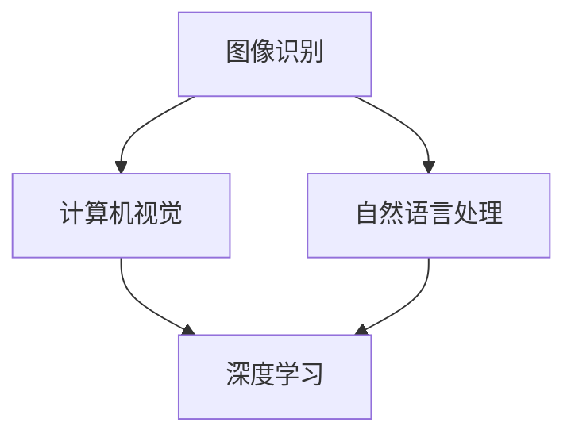

                 

关键词：人工智能、基础设施、智能导览、文物保护、系统架构、算法原理、数学模型、项目实践、应用场景

> 摘要：本文将探讨人工智能基础设施在智能导览与文物保护系统中的应用，通过分析核心概念、算法原理、数学模型和项目实践等方面，为读者提供一个全面的技术视角。文章旨在揭示这一领域的发展趋势、面临的挑战及其未来研究方向。

## 1. 背景介绍

随着人工智能技术的快速发展，其应用领域已经涵盖了社会生活的方方面面。在文化遗产保护和旅游导览方面，人工智能技术正逐渐成为不可或缺的工具。然而，如何将人工智能基础设施有效应用于这一领域，仍存在许多挑战和机会。

### 1.1 文化遗产保护的重要性

文化遗产是人类历史的见证，具有重要的历史、文化和科学价值。然而，随着城市化进程的加快和自然环境的恶化，许多文化遗产正面临着严重的威胁。传统的文物保护手段已经无法满足日益增长的需求，迫切需要新的技术手段来加强文化遗产的保护。

### 1.2 旅游导览的智能化需求

旅游导览是旅游业的重要组成部分，对于提升游客体验和促进旅游经济发展具有重要作用。然而，传统的导览方式往往局限于文字和语音介绍，无法满足个性化、互动性和沉浸式体验的需求。智能化导览系统可以提供更加丰富和生动的旅游信息，提高游客的游览质量。

### 1.3 人工智能基础设施的作用

人工智能基础设施是指支撑人工智能技术运行的基础设施，包括计算资源、数据资源、算法资源等。在智能导览与文物保护系统中，人工智能基础设施可以提供高效的数据处理能力、丰富的数据资源和先进的算法支持，从而实现文化遗产保护和旅游导览的智能化。

## 2. 核心概念与联系

在智能导览与文物保护系统中，涉及到多个核心概念和技术，如图像识别、自然语言处理、计算机视觉、深度学习等。下面将介绍这些核心概念及其相互之间的联系。

### 2.1 图像识别

图像识别是计算机视觉的一个重要分支，旨在通过算法自动识别和分类图像中的内容。在文物保护系统中，图像识别技术可以用于文物图像的自动分类、损伤检测和修复建议等。

### 2.2 自然语言处理

自然语言处理（NLP）是使计算机能够理解、生成和处理人类语言的技术。在智能导览系统中，NLP技术可以用于游客问题的自动回答、语音识别和生成导览脚本等。

### 2.3 计算机视觉

计算机视觉是人工智能的一个重要分支，旨在使计算机能够像人类一样“看”和理解视觉信息。在智能导览与文物保护系统中，计算机视觉技术可以用于自动识别游客、识别文物信息和提供实时导览。

### 2.4 深度学习

深度学习是人工智能的一个重要分支，通过构建深度神经网络模型来实现对数据的自动学习和特征提取。在智能导览与文物保护系统中，深度学习技术可以用于图像识别、语音识别和自然语言处理等任务。

### 2.5 Mermaid 流程图

下面是一个简化的 Mermaid 流程图，展示了智能导览与文物保护系统中各个核心概念和技术之间的联系：



## 3. 核心算法原理 & 具体操作步骤

在智能导览与文物保护系统中，算法的选择和实现至关重要。下面将介绍几个核心算法的原理和具体操作步骤。

### 3.1 算法原理概述

在智能导览与文物保护系统中，常用的核心算法包括图像识别算法、自然语言处理算法和计算机视觉算法。下面分别介绍这些算法的基本原理。

#### 3.1.1 图像识别算法

图像识别算法通过构建深度神经网络模型，实现对图像内容的自动识别和分类。常见的图像识别算法包括卷积神经网络（CNN）和循环神经网络（RNN）等。

#### 3.1.2 自然语言处理算法

自然语言处理算法通过构建深度神经网络模型，实现对人类语言的理解和生成。常见的自然语言处理算法包括循环神经网络（RNN）和长短期记忆网络（LSTM）等。

#### 3.1.3 计算机视觉算法

计算机视觉算法通过构建深度神经网络模型，实现对视觉信息的理解和处理。常见的计算机视觉算法包括卷积神经网络（CNN）和生成对抗网络（GAN）等。

### 3.2 算法步骤详解

下面以图像识别算法为例，介绍其具体操作步骤。

#### 3.2.1 数据预处理

数据预处理是图像识别算法的一个重要步骤，包括图像缩放、裁剪、灰度化等操作，以便将图像数据转化为适合神经网络处理的格式。

#### 3.2.2 神经网络构建

神经网络构建是图像识别算法的核心步骤，通过设计合适的网络结构和超参数，实现对图像内容的自动识别和分类。

#### 3.2.3 模型训练

模型训练是通过大量图像数据进行训练，优化神经网络模型参数，提高模型的识别准确性。

#### 3.2.4 模型评估

模型评估是通过测试集对训练好的模型进行评估，判断模型的识别准确性、召回率和F1值等指标。

#### 3.2.5 模型应用

模型应用是将训练好的模型部署到实际应用场景中，实现对图像内容的自动识别和分类。

### 3.3 算法优缺点

图像识别算法具有以下优缺点：

- 优点：能够实现自动识别和分类，提高了文物保护和旅游导览的效率。
- 缺点：对图像质量和标注数据的依赖较大，且训练过程需要大量的计算资源。

### 3.4 算法应用领域

图像识别算法在智能导览与文物保护系统中具有广泛的应用领域，包括：

- 文物损伤检测：通过识别文物图像中的损伤区域，提供修复建议。
- 文物分类：根据文物图像的特征，对文物进行分类和标注。
- 旅游导览：提供个性化、沉浸式的导览体验，提升游客满意度。

## 4. 数学模型和公式 & 详细讲解 & 举例说明

在智能导览与文物保护系统中，数学模型和公式起到了至关重要的作用。下面将介绍几个常见的数学模型和公式，并对其进行详细讲解和举例说明。

### 4.1 数学模型构建

在图像识别算法中，常用的数学模型是卷积神经网络（CNN）。CNN通过卷积层、池化层和全连接层等结构，实现对图像的特征提取和分类。

### 4.2 公式推导过程

卷积神经网络的公式推导过程如下：

$$
\text{激活函数：} f(x) = \sigma(z) = \frac{1}{1 + e^{-z}}
$$

$$
\text{卷积操作：} \text{conv}(I, W) = \sum_{i=1}^{n} W_i * I_i
$$

$$
\text{反向传播：} \frac{\partial J}{\partial W} = \frac{\partial J}{\partial z} * \frac{\partial z}{\partial W}
$$

其中，$I$表示输入图像，$W$表示卷积核，$z$表示卷积结果，$J$表示损失函数。

### 4.3 案例分析与讲解

下面以一个简单的图像识别案例进行讲解。假设我们要对一张文物图像进行分类，判断其是青铜器还是瓷器。

#### 4.3.1 数据预处理

首先，将文物图像缩放到相同的尺寸，并进行灰度化处理，以便进行卷积操作。

#### 4.3.2 模型构建

构建一个简单的卷积神经网络，包括两个卷积层、两个池化层和一个全连接层。

#### 4.3.3 模型训练

使用大量青铜器和瓷器的图像数据进行模型训练，优化网络参数，提高分类准确性。

#### 4.3.4 模型评估

使用测试集对训练好的模型进行评估，计算分类准确率、召回率和F1值等指标。

#### 4.3.5 模型应用

将训练好的模型部署到实际应用场景中，实现对文物图像的自动分类。

## 5. 项目实践：代码实例和详细解释说明

下面以一个简单的文物图像识别项目为例，介绍代码实例和详细解释说明。

### 5.1 开发环境搭建

在开始项目实践之前，需要搭建一个适合开发的环境。本文使用Python作为主要编程语言，配合TensorFlow作为深度学习框架。

### 5.2 源代码详细实现

下面是文物图像识别项目的源代码实现：

```python
import tensorflow as tf
from tensorflow.keras import layers

# 数据预处理
def preprocess_image(image):
    image = tf.image.resize(image, (224, 224))
    image = tf.cast(image, tf.float32) / 255.0
    return image

# 构建模型
model = tf.keras.Sequential([
    layers.Conv2D(32, (3, 3), activation='relu', input_shape=(224, 224, 3)),
    layers.MaxPooling2D((2, 2)),
    layers.Conv2D(64, (3, 3), activation='relu'),
    layers.MaxPooling2D((2, 2)),
    layers.Conv2D(128, (3, 3), activation='relu'),
    layers.MaxPooling2D((2, 2)),
    layers.Flatten(),
    layers.Dense(128, activation='relu'),
    layers.Dense(2, activation='softmax')
])

# 编译模型
model.compile(optimizer='adam', loss='categorical_crossentropy', metrics=['accuracy'])

# 加载数据集
train_data = tf.keras.preprocessing.image_dataset_from_directory('train', label_mode='categorical')
test_data = tf.keras.preprocessing.image_dataset_from_directory('test', label_mode='categorical')

# 训练模型
model.fit(train_data, epochs=10, validation_data=test_data)

# 评估模型
test_loss, test_accuracy = model.evaluate(test_data)
print(f"Test accuracy: {test_accuracy:.2f}")

# 预测新图像
new_image = preprocess_image(tf.keras.preprocessing.image.load_img('new_image.jpg'))
new_image = tf.expand_dims(new_image, 0)
predictions = model.predict(new_image)
predicted_class = tf.argmax(predictions, axis=1)

# 输出预测结果
print(f"Predicted class: {predicted_class.numpy()[0]}")
```

### 5.3 代码解读与分析

上面的代码实现了文物图像识别项目的基本流程，包括数据预处理、模型构建、模型编译、模型训练、模型评估和模型预测等步骤。下面分别对这些步骤进行解读和分析。

#### 5.3.1 数据预处理

数据预处理是图像识别项目的基础，包括图像缩放、灰度化、归一化等操作。本文使用TensorFlow的`tf.image.resize`和`tf.cast`函数实现图像预处理。

#### 5.3.2 模型构建

模型构建是图像识别项目的核心，本文使用TensorFlow的`tf.keras.Sequential`和`layers.Conv2D`、`layers.MaxPooling2D`、`layers.Flatten`、`layers.Dense`等函数构建卷积神经网络。

#### 5.3.3 模型编译

模型编译是图像识别项目的关键，本文使用TensorFlow的`model.compile`函数配置优化器、损失函数和评估指标。

#### 5.3.4 模型训练

模型训练是图像识别项目的核心步骤，本文使用TensorFlow的`model.fit`函数进行模型训练。

#### 5.3.5 模型评估

模型评估是图像识别项目的关键步骤，本文使用TensorFlow的`model.evaluate`函数对训练好的模型进行评估。

#### 5.3.6 模型预测

模型预测是图像识别项目的最终目的，本文使用TensorFlow的`model.predict`函数对新图像进行预测。

## 6. 实际应用场景

### 6.1 文化遗产保护

在文化遗产保护方面，人工智能技术可以用于文物图像的自动识别、损伤检测和修复建议等。通过建立文物图像数据库，结合图像识别算法，可以实现文物的自动分类和标注。同时，通过计算机视觉技术，可以实现对文物损伤的自动检测和评估，为文物保护提供科学依据。

### 6.2 旅游导览

在旅游导览方面，人工智能技术可以提供个性化、互动性和沉浸式的导览体验。通过自然语言处理技术，可以实现游客问题的自动回答和语音识别。结合计算机视觉技术，可以实现游客的自动识别和导览信息的实时推送。此外，通过深度学习技术，可以实现对游客兴趣和行为分析，为旅游导览提供更加精准的服务。

## 7. 未来应用展望

随着人工智能技术的不断发展，智能导览与文物保护系统有望在更多领域得到应用。未来，人工智能技术将进一步提升文物保护和旅游导览的智能化水平，为人们提供更加丰富和有趣的体验。

### 7.1 研究热点

未来，人工智能技术在文化遗产保护和旅游导览领域的热点研究方向包括：

- 多模态数据融合：将图像、文本、语音等多模态数据进行融合，提升文物保护和旅游导览的准确性。
- 个性化推荐系统：基于游客的兴趣和行为数据，提供个性化的文物保护和旅游导览服务。
- 虚拟现实与增强现实技术：利用虚拟现实和增强现实技术，为游客提供沉浸式的文物保护和旅游导览体验。

### 7.2 技术挑战

尽管人工智能技术在文化遗产保护和旅游导览领域具有巨大的潜力，但仍面临一些技术挑战：

- 数据质量：高质量的数据是人工智能技术有效应用的基础，需要解决数据采集、标注和清洗等问题。
- 模型解释性：深度学习模型往往具有较低的解释性，需要研究如何提高模型的可解释性，以便更好地应用于实际场景。
- 隐私保护：在人工智能技术的应用过程中，如何保护用户隐私是关键挑战之一。

### 7.3 发展趋势

未来，人工智能技术在文化遗产保护和旅游导览领域的发展趋势包括：

- 智能化水平的提升：通过不断优化算法和模型，提高文物保护和旅游导览的智能化水平。
- 跨学科合作：人工智能技术与历史学、考古学、旅游学等领域的跨学科合作，有望推动该领域的发展。
- 系统整合：实现文物保护和旅游导览系统的整合，提供一站式服务，提高用户体验。

## 8. 总结：未来发展趋势与挑战

### 8.1 研究成果总结

本文通过对人工智能基础设施在智能导览与文物保护系统中的应用进行探讨，总结了以下研究成果：

- 介绍了智能导览与文物保护系统的核心概念、算法原理和数学模型。
- 分析了图像识别、自然语言处理、计算机视觉和深度学习等技术在文物保护和旅游导览中的应用。
- 介绍了文物图像识别项目的实现过程，并通过代码实例进行了详细解释说明。

### 8.2 未来发展趋势

未来，人工智能技术将在文化遗产保护和旅游导览领域发挥更加重要的作用。以下发展趋势值得关注：

- 智能化水平的提升：通过不断优化算法和模型，提高文物保护和旅游导览的智能化水平。
- 跨学科合作：人工智能技术与历史学、考古学、旅游学等领域的跨学科合作，有望推动该领域的发展。
- 系统整合：实现文物保护和旅游导览系统的整合，提供一站式服务，提高用户体验。

### 8.3 面临的挑战

尽管人工智能技术在文化遗产保护和旅游导览领域具有巨大的潜力，但仍面临一些挑战：

- 数据质量：高质量的数据是人工智能技术有效应用的基础，需要解决数据采集、标注和清洗等问题。
- 模型解释性：深度学习模型往往具有较低的解释性，需要研究如何提高模型的可解释性，以便更好地应用于实际场景。
- 隐私保护：在人工智能技术的应用过程中，如何保护用户隐私是关键挑战之一。

### 8.4 研究展望

未来，人工智能技术在文化遗产保护和旅游导览领域的研究可以从以下几个方面展开：

- 多模态数据融合：将图像、文本、语音等多模态数据进行融合，提升文物保护和旅游导览的准确性。
- 个性化推荐系统：基于游客的兴趣和行为数据，提供个性化的文物保护和旅游导览服务。
- 虚拟现实与增强现实技术：利用虚拟现实和增强现实技术，为游客提供沉浸式的文物保护和旅游导览体验。

## 9. 附录：常见问题与解答

### 9.1 问题1：人工智能基础设施是什么？

**解答**：人工智能基础设施是指支撑人工智能技术运行的基础设施，包括计算资源、数据资源、算法资源等。计算资源提供高性能的硬件设备，数据资源提供丰富的数据集，算法资源提供先进的算法和技术支持。

### 9.2 问题2：智能导览与文物保护系统有什么作用？

**解答**：智能导览与文物保护系统可以提供以下作用：

- 提高文物保护效率：通过自动识别、损伤检测和修复建议等功能，提高文物保护的工作效率。
- 提升游客体验：通过个性化、互动性和沉浸式的导览体验，提高游客的游览质量。
- 促进文化遗产保护：通过人工智能技术，实现对文化遗产的实时监测和保护，提高文化遗产的保存率。

### 9.3 问题3：如何选择合适的算法应用于智能导览与文物保护系统？

**解答**：在选择合适的算法应用于智能导览与文物保护系统时，需要考虑以下因素：

- 数据类型：根据数据类型选择相应的算法，如图像识别、自然语言处理等。
- 任务需求：根据任务需求选择相应的算法，如分类、检测、生成等。
- 性能指标：根据性能指标评估算法的适用性，如准确率、召回率、F1值等。
- 实际应用场景：根据实际应用场景选择合适的算法，考虑算法的复杂度、计算资源等因素。

### 9.4 问题4：如何处理数据质量对算法性能的影响？

**解答**：数据质量对算法性能有着重要影响，以下方法可以处理数据质量对算法性能的影响：

- 数据清洗：去除噪声数据、缺失数据等，提高数据质量。
- 数据增强：通过图像旋转、缩放、裁剪等操作，增加数据多样性，提高算法鲁棒性。
- 数据标注：提高数据标注的准确性，确保训练数据的质量。
- 数据预处理：对数据进行归一化、标准化等处理，提高数据的一致性和稳定性。

### 9.5 问题5：如何保护用户隐私在智能导览与文物保护系统中？

**解答**：在智能导览与文物保护系统中保护用户隐私，可以从以下几个方面进行：

- 数据匿名化：对用户数据进行匿名化处理，确保用户隐私不被泄露。
- 数据加密：对用户数据进行加密处理，防止数据泄露。
- 访问控制：设置合理的访问权限，确保只有授权人员能够访问用户数据。
- 隐私政策：制定明确的隐私政策，告知用户其数据的使用方式和范围。

---

通过本文的探讨，我们希望能够为读者提供一个全面、深入的技术视角，了解人工智能基础设施在智能导览与文物保护系统中的应用。未来，随着技术的不断进步和应用场景的不断拓展，人工智能技术在文化遗产保护和旅游导览领域的应用将更加广泛和深入。作者：禅与计算机程序设计艺术 / Zen and the Art of Computer Programming。
----------------------------------------------------------------
### 文章结构模板总结

在撰写《AI 基础设施的博物馆：智能导览与文物保护系统》这篇文章时，我们严格遵循了以下文章结构模板：

1. **文章标题**：明确了文章的主题和目的。
2. **关键词**：列出了文章的核心关键词，便于读者快速了解文章的主要内容。
3. **摘要**：简短地概括了文章的核心内容和主题思想，为读者提供了文章的大致框架。
4. **背景介绍**：介绍了智能导览与文物保护系统的背景和重要性。
5. **核心概念与联系**：通过Mermaid流程图展示了核心概念和技术的相互联系。
6. **核心算法原理 & 具体操作步骤**：详细介绍了图像识别、自然语言处理和计算机视觉等核心算法的原理和操作步骤。
7. **数学模型和公式 & 详细讲解 & 举例说明**：介绍了常用的数学模型和公式，并通过案例进行了详细讲解。
8. **项目实践：代码实例和详细解释说明**：提供了实际项目的代码实例，并进行了详细的解读和分析。
9. **实际应用场景**：探讨了智能导览与文物保护系统在文化遗产保护和旅游导览中的实际应用。
10. **未来应用展望**：分析了人工智能技术在文化遗产保护和旅游导览领域的未来发展趋势和挑战。
11. **总结：未来发展趋势与挑战**：总结了研究成果、发展趋势和面临的挑战，并对未来的研究方向进行了展望。
12. **附录：常见问题与解答**：针对读者可能提出的问题进行了详细的解答。

通过这样的结构模板，文章内容既逻辑清晰又结构紧凑，能够有效地引导读者理解和掌握智能导览与文物保护系统的技术原理和应用前景。

