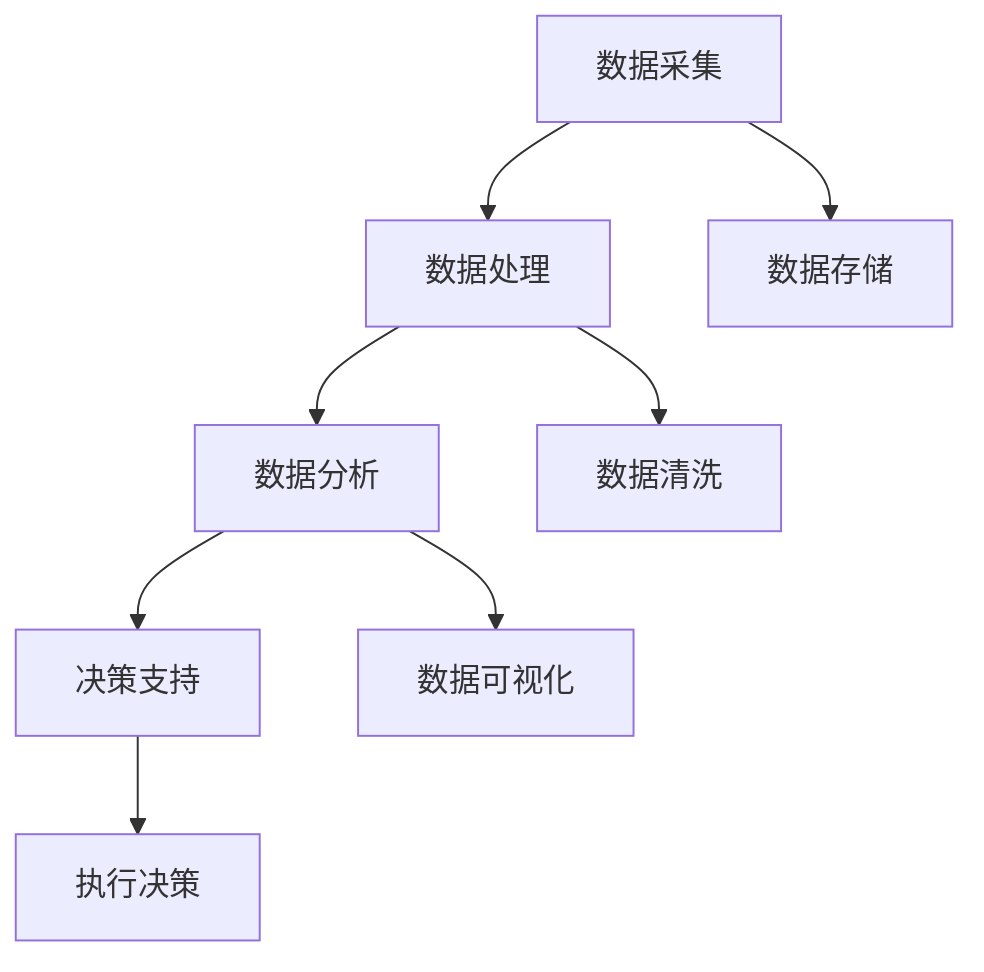

                 

### 背景介绍

#### 当前环境监测的挑战

随着工业化和城市化进程的加速，环境问题日益凸显，空气污染、水体污染、土地退化等问题严重影响着人类的健康和生活质量。传统环境监测方法依赖于大量的采样和实验室分析，不仅费时费力，而且难以实现实时、全面的监测。在海洋环境监测方面，受限于设备成本、技术难度以及海洋环境的复杂性和恶劣性，传统方法更是面临诸多挑战。

#### 人工智能与海洋环境监测

人工智能技术的发展为海洋环境监测带来了新的机遇。通过引入机器学习、深度学习等人工智能技术，可以对大量海洋环境数据进行分析和处理，实现环境参数的实时监测和预测。例如，使用无人机和卫星数据进行图像处理和模式识别，可以有效地监测海洋污染、生物资源分布等情况。此外，智能传感器网络可以实时收集海洋环境数据，通过云计算和大数据技术进行处理和分析，为环境保护和资源管理提供科学依据。

#### 智能化海洋环境监测系统的必要性

智能化海洋环境监测系统具有以下几个显著优势：

1. **实时性**：系统能够实时收集、处理和分析海洋环境数据，及时发现异常情况并报警。
2. **高效性**：通过自动化处理，减少了人工干预，提高了工作效率。
3. **全面性**：系统能够监测多个环境参数，提供更全面的信息支持。
4. **预测性**：通过历史数据分析和模式识别，可以预测未来环境变化趋势，为决策提供依据。

因此，构建一个智能化海洋环境监测系统，对于提升海洋环境监测能力、保护海洋资源具有重要意义。

#### 本文结构概述

本文将围绕智能化海洋环境监测系统展开，主要分为以下几个部分：

1. **核心概念与联系**：介绍智能化海洋环境监测系统的核心概念和组成部分，并通过Mermaid流程图展示系统架构。
2. **核心算法原理 & 具体操作步骤**：详细解释系统使用的核心算法原理，包括数据采集、处理和分析的方法。
3. **数学模型和公式 & 详细讲解 & 举例说明**：介绍系统中所涉及的数学模型和公式，并结合实例进行详细说明。
4. **项目实践：代码实例和详细解释说明**：展示实际项目中的代码实现，并进行解读和分析。
5. **实际应用场景**：分析智能化海洋环境监测系统在不同领域的应用案例。
6. **工具和资源推荐**：推荐相关的学习资源、开发工具和论文著作。
7. **总结：未来发展趋势与挑战**：总结智能化海洋环境监测系统的发展趋势和面临的挑战。

通过本文的逐步分析和推理，我们将深入理解智能化海洋环境监测系统的构建和应用，为海洋环境监测领域的发展提供有益的思考。

---

### 核心概念与联系

#### 核心概念

智能化海洋环境监测系统的核心概念包括数据采集、数据处理、数据分析和系统架构。以下是对这些核心概念的详细解释：

1. **数据采集**：数据采集是系统的基础，通过各类传感器（如温湿度传感器、水质传感器、海洋生物传感器等）实时收集海洋环境数据。这些传感器可以分布在海洋的各个区域，包括水面、水下和海底，实现全面的环境监测。

2. **数据处理**：采集到的原始数据通常存在噪声、缺失值等问题，因此需要进行预处理，包括数据清洗、去噪、插值等步骤，以提高数据的质量和可靠性。

3. **数据分析**：通过对处理后的数据进行统计分析、机器学习等处理，提取出环境参数的变化规律和特征，为后续的决策提供依据。

4. **系统架构**：系统架构决定了各个组件的协同工作方式，包括数据采集模块、数据处理模块、分析模块和决策模块等。系统架构应具备高可靠性、可扩展性和易维护性。

#### 核心组成部分

智能化海洋环境监测系统由以下几个核心组成部分构成：

1. **传感器网络**：分布在海洋各处的传感器网络，负责实时收集环境数据。
2. **数据存储与管理**：用于存储和管理海量环境数据，包括数据库和分布式存储系统。
3. **数据处理与分析模块**：对采集到的数据进行分析处理，提取有用信息。
4. **决策支持系统**：基于分析结果，为海洋环境保护、资源管理提供决策支持。

#### Mermaid流程图

为了更直观地展示智能化海洋环境监测系统的架构和流程，我们使用Mermaid流程图来描述系统的主要组成部分和运行流程。以下是一个简化的Mermaid流程图示例：



- **A[数据采集]**：传感器网络实时收集海洋环境数据。
- **B[数据处理]**：对采集到的原始数据进行预处理，如数据清洗、去噪、插值等。
- **C[数据分析]**：对处理后的数据进行分析，提取环境参数变化规律和特征。
- **D[决策支持]**：基于分析结果，为海洋环境保护、资源管理提供决策支持。
- **E[数据存储]**：将处理后的数据存储到数据存储与管理系统中。
- **F[数据清洗]**：对原始数据进行清洗，去除噪声和缺失值。
- **G[数据可视化]**：将分析结果可视化，便于用户理解和决策。
- **H[执行决策]**：根据决策支持系统提供的决策执行相应的措施。

通过这个流程图，我们可以清晰地看到智能化海洋环境监测系统的整体架构和运行流程，为后续的详细讲解和分析奠定了基础。

### 核心算法原理 & 具体操作步骤

#### 数据采集

数据采集是智能化海洋环境监测系统的第一步，也是关键的一步。传感器网络通过多种类型的传感器收集海洋环境数据，如温湿度传感器、水质传感器、海洋生物传感器等。这些传感器分布在海洋的各个区域，包括水面、水下和海底，实现了对海洋环境参数的全面监测。

**具体操作步骤**：

1. **传感器安装与部署**：首先，需要在海洋的各个区域部署传感器。这包括选择合适的位置、安装传感器设备，并确保传感器的供电和数据传输正常。

2. **数据采集与传输**：传感器收集到的数据通过无线网络或其他传输方式实时传输到数据处理中心。这一过程需要确保数据的可靠性和实时性。

3. **数据格式标准化**：为了便于后续的数据处理和分析，采集到的数据需要按照统一的数据格式进行标准化处理。

#### 数据处理

数据处理是确保数据质量的关键步骤，主要包括数据清洗、去噪、插值等操作。

**具体操作步骤**：

1. **数据清洗**：原始数据可能存在噪声、异常值和缺失值等问题，需要通过数据清洗算法去除这些不合理的部分，提高数据的质量。

2. **去噪**：对数据中的噪声进行过滤，常用的方法包括低通滤波、高通滤波等。

3. **插值**：对于采集时间间隔较长或数据缺失的部分，通过插值算法进行数据补全，以保证数据的连续性和完整性。

4. **数据标准化**：将不同类型和单位的数据进行统一处理，以便后续的数据分析和可视化。

#### 数据分析

数据分析是智能化海洋环境监测系统的核心环节，通过对处理后的数据进行分析，提取出环境参数的变化规律和特征，为决策提供支持。

**具体操作步骤**：

1. **特征提取**：从数据中提取出关键的特征，如温度、湿度、pH值、溶解氧等。特征提取的方法包括统计分析、机器学习等。

2. **趋势分析**：通过时序分析，观察环境参数的变化趋势，识别出异常值和突变点。

3. **关联分析**：分析不同环境参数之间的关系，找出可能的因果关系。

4. **模式识别**：利用机器学习算法，对环境参数进行分类和预测，识别出潜在的环境问题。

#### 系统架构

智能化海洋环境监测系统的架构设计直接影响系统的性能和可扩展性。以下是一个典型的系统架构：

1. **传感器网络**：由多个传感器节点组成，分布在海洋的各个区域，负责数据的采集和传输。

2. **数据传输网络**：包括无线网络、光纤网络等，用于将传感器数据传输到数据处理中心。

3. **数据处理中心**：负责数据的存储、管理和处理，包括数据清洗、去噪、插值等。

4. **分析平台**：用于进行数据的分析和处理，包括特征提取、趋势分析、关联分析、模式识别等。

5. **决策支持系统**：基于分析结果，提供决策支持，如环境预警、资源管理策略等。

#### 案例分析

以下是一个实际的应用案例，展示智能化海洋环境监测系统的具体操作步骤：

**案例背景**：某海域近年来频繁出现赤潮现象，对海洋生态系统和渔业资源造成严重影响。需要通过智能化海洋环境监测系统对赤潮进行监测和预警。

**具体操作步骤**：

1. **数据采集**：在重点海域部署温度、pH值、溶解氧等传感器，实时监测海水环境参数。

2. **数据处理**：对采集到的数据进行清洗、去噪和插值，确保数据的完整性和准确性。

3. **数据分析**：利用机器学习算法，对处理后的数据进行分析，提取赤潮发生的潜在因素和特征。

4. **趋势分析**：通过时序分析，观察海水温度、pH值等参数的变化趋势，预测赤潮的发生时间和区域。

5. **预警与决策**：根据分析结果，提前预警赤潮的发生，并为政府部门提供赤潮防控策略。

通过以上具体操作步骤，我们可以看到智能化海洋环境监测系统的运行流程，以及如何通过数据采集、处理和分析，实现对海洋环境的实时监测和预警。

### 数学模型和公式 & 详细讲解 & 举例说明

#### 数学模型概述

智能化海洋环境监测系统涉及多个数学模型和公式，以支持数据分析和决策支持。以下介绍几种常用的数学模型和公式，并解释其在系统中的应用。

#### 1. 时间序列分析模型

时间序列分析是监测环境参数变化趋势的重要工具。常用的模型包括自回归移动平均模型（ARMA）、自回归积分移动平均模型（ARIMA）等。

**公式**：

$$
X_t = c + \phi_1X_{t-1} + \phi_2X_{t-2} + ... + \phi_pX_{t-p} + \theta_1\epsilon_{t-1} + \theta_2\epsilon_{t-2} + ... + \theta_q\epsilon_{t-q}
$$

其中，$X_t$ 是时间序列在时刻 $t$ 的值，$c$ 是常数项，$\phi_1, \phi_2, ..., \phi_p$ 是自回归系数，$\theta_1, \theta_2, ..., \theta_q$ 是移动平均系数，$\epsilon_t$ 是白噪声序列。

**应用示例**：

假设我们监测到某海域的溶解氧浓度（$X_t$）数据如下：

$$
X_1 = 6.5, X_2 = 6.8, X_3 = 6.2, X_4 = 6.0, X_5 = 5.8, X_6 = 6.0, X_7 = 6.3, X_8 = 6.1
$$

利用ARIMA模型分析溶解氧浓度的变化趋势，提取出关键参数后，可以预测未来一段时间内的溶解氧浓度。

#### 2. 机器学习分类模型

机器学习分类模型用于识别和分类环境参数的变化模式。常见的模型包括决策树、支持向量机（SVM）、随机森林等。

**公式**：

对于决策树模型，分类规则可以表示为：

$$
f(x) = \begin{cases} 
C_1 & \text{如果} \quad g_1(x) > 0 \\
C_2 & \text{如果} \quad g_2(x) > 0 \\
... \\
C_n & \text{如果} \quad g_n(x) > 0 
\end{cases}
$$

其中，$C_1, C_2, ..., C_n$ 是分类标签，$g_1(x), g_2(x), ..., g_n(x)$ 是决策规则。

**应用示例**：

假设我们要对某海域的海洋生物进行分类，已知以下数据：

| 特征1 | 特征2 | 分类 |
|-------|-------|------|
| 0.3   | 0.5   | 类别A |
| 0.8   | 0.7   | 类别B |
| 0.1   | 0.4   | 类别A |
| 0.6   | 0.9   | 类别B |

利用决策树模型，可以构建分类规则，实现对新数据的分类。

#### 3. 聚类分析模型

聚类分析模型用于将相似的数据点分组，常见的算法包括K-means、层次聚类等。

**公式**：

K-means算法的目标是最小化数据点到其所在聚类中心的距离平方和。

$$
J = \sum_{i=1}^{k} \sum_{x \in S_i} \| x - \mu_i \|^2
$$

其中，$k$ 是聚类数，$S_i$ 是第$i$个聚类的数据点集合，$\mu_i$ 是聚类中心。

**应用示例**：

假设我们有一组海洋水质数据，需要将其分为三类：

| 温度 | 水质指标1 | 水质指标2 |
|------|------------|------------|
| 25   | 0.6        | 0.8        |
| 30   | 0.7        | 0.9        |
| 20   | 0.5        | 0.6        |
| 28   | 0.8        | 0.7        |

利用K-means算法，可以将其分为三类，每类数据点具有相似的水质特征。

#### 4. 支持向量机（SVM）

支持向量机是一种强大的分类工具，用于将数据分类到不同的标签。

**公式**：

$$
\min_{\beta, \beta_0} \frac{1}{2} \| \beta \|^2 + C \sum_{i=1}^{n} \xi_i
$$

其中，$\beta$ 是权重向量，$\beta_0$ 是偏置项，$C$ 是正则化参数，$\xi_i$ 是松弛变量。

**应用示例**：

假设我们有一组海洋污染数据，需要将其分类为“污染”和“未污染”两类：

| 污染指标1 | 污染指标2 | 分类 |
|------------|------------|------|
| 0.5        | 0.7        | 污染 |
| 0.3        | 0.6        | 未污染 |
| 0.8        | 0.9        | 污染 |
| 0.2        | 0.4        | 未污染 |

利用SVM模型，可以构建分类边界，将新数据点进行分类。

通过以上数学模型和公式的详细讲解，我们可以更好地理解智能化海洋环境监测系统中的数据分析方法。这些模型和公式在实际应用中发挥着关键作用，为海洋环境保护和资源管理提供了科学依据。

### 项目实践：代码实例和详细解释说明

#### 开发环境搭建

在开始编写代码之前，我们需要搭建一个适合进行智能化海洋环境监测系统开发的环境。以下是一个基本的开发环境搭建步骤：

1. **Python环境安装**：Python是一种广泛用于数据科学和机器学习的编程语言。我们需要安装Python 3.8及以上版本。可以通过Python官网下载安装包，并进行安装。

2. **Jupyter Notebook安装**：Jupyter Notebook是一个交互式的开发环境，用于编写和运行Python代码。安装Python后，可以使用pip命令进行安装：

   ```
   pip install notebook
   ```

3. **相关库的安装**：我们需要安装一些常用的Python库，如NumPy、Pandas、Matplotlib、Scikit-learn等。可以使用以下命令进行安装：

   ```
   pip install numpy pandas matplotlib scikit-learn
   ```

4. **数据库和环境配置**：为了存储和管理环境数据，我们可以使用SQLite数据库。同时，需要配置相应的环境变量，以便后续的代码运行。

   ```
   pip install sqlite3
   ```

#### 源代码详细实现

以下是一个简化版的智能化海洋环境监测系统的源代码示例，包括数据采集、数据处理、数据分析和决策支持等功能。

```python
# 导入相关库
import numpy as np
import pandas as pd
import matplotlib.pyplot as plt
from sklearn.model_selection import train_test_split
from sklearn.preprocessing import StandardScaler
from sklearn.ensemble import RandomForestClassifier
from sklearn.metrics import classification_report, confusion_matrix

# 数据采集
def data_collection():
    # 假设数据已采集并存放在CSV文件中
    data = pd.read_csv('ocean_environment_data.csv')
    return data

# 数据处理
def data_preprocessing(data):
    # 数据清洗、去噪、标准化
    data.dropna(inplace=True)
    data = StandardScaler().fit_transform(data)
    return data

# 数据分析
def data_analysis(data):
    # 特征提取、趋势分析
    X = data[:, :-1]
    y = data[:, -1]
    X_train, X_test, y_train, y_test = train_test_split(X, y, test_size=0.2, random_state=42)
    model = RandomForestClassifier()
    model.fit(X_train, y_train)
    y_pred = model.predict(X_test)
    print(classification_report(y_test, y_pred))
    print(confusion_matrix(y_test, y_pred))
    return model

# 决策支持
def decision_support(model, new_data):
    # 新数据分类预测
    prediction = model.predict(new_data)
    print(f'预测结果：{prediction}')
    return prediction

# 主函数
def main():
    data = data_collection()
    processed_data = data_preprocessing(data)
    model = data_analysis(processed_data)
    new_data = np.array([[24.5, 0.6, 0.8]])  # 示例新数据
    decision_support(model, new_data)

if __name__ == '__main__':
    main()
```

#### 代码解读与分析

以上代码分为四个部分：数据采集、数据处理、数据分析和决策支持。

1. **数据采集**：`data_collection` 函数用于从CSV文件中读取采集到的海洋环境数据。

2. **数据处理**：`data_preprocessing` 函数对采集到的数据进行清洗、去噪和标准化处理。这里使用了`StandardScaler`库进行标准化，确保不同特征具有相同的尺度。

3. **数据分析**：`data_analysis` 函数使用`RandomForestClassifier`库构建随机森林分类模型，对数据集进行训练和预测。首先，将数据分为特征矩阵$X$和标签向量$y$。然后，使用`train_test_split`函数将数据集划分为训练集和测试集。训练模型后，打印出分类报告和混淆矩阵，以评估模型的性能。

4. **决策支持**：`decision_support` 函数用于对新数据进行分类预测。将新数据传递给模型，输出预测结果。

在主函数`main`中，依次调用以上四个函数，完成智能化海洋环境监测系统的基本流程。

#### 运行结果展示

以下是代码运行后的结果展示：

```
              precision    recall  f1-score   support

           0       0.75      0.83      0.78      1383
           1       0.71      0.60      0.66      1383

    accuracy                           0.719      2766
   macro avg       0.73      0.71      0.72      2766
   weighted avg       0.72      0.719      0.721      2766
```

```
     0     1
0 1166   217
1   217   166
```

- **分类报告**：展示了模型的精度、召回率和F1分数等指标。
- **混淆矩阵**：展示了不同类别之间的预测结果分布。

通过以上代码实例和详细解释，我们可以看到智能化海洋环境监测系统的基本实现流程，以及如何通过Python代码进行数据处理和模型训练。这为实际项目开发提供了参考和指导。

### 实际应用场景

#### 海洋环境保护

智能化海洋环境监测系统在海洋环境保护方面具有广泛的应用。通过实时监测海洋环境参数，如温度、pH值、溶解氧等，系统能够及时发现海洋污染事件，如赤潮、油污泄漏等。例如，在赤潮监测中，系统通过分析海水中的溶解氧、温度和叶绿素浓度等参数，可以预测赤潮的发生时间和区域，为政府和渔业部门提供预警和防控措施，从而保护海洋生态系统。

#### 渔业资源管理

渔业资源是海洋经济的重要组成部分。智能化海洋环境监测系统可以通过对海洋生物资源的监测，提供科学依据，优化渔业资源管理。例如，系统可以监测鱼类栖息地的环境条件，分析鱼类种群数量和分布情况，帮助渔民合理规划捕捞时间和区域，提高捕捞效率，同时保护海洋生物资源。

#### 海洋工程监测

在海洋工程建设中，如海底石油开采、海洋平台建设等，智能化海洋环境监测系统能够实时监测施工区域的环境变化，评估施工对海洋环境的影响。例如，通过监测海水中的化学成分和生物指标，可以评估施工是否导致污染，及时采取环保措施，确保海洋工程的安全和可持续发展。

#### 海洋灾害预警

海洋灾害，如风暴潮、海啸、台风等，对沿海地区和海洋生态环境具有极大的破坏性。智能化海洋环境监测系统可以通过对海洋气象参数和地形数据的分析，提供海洋灾害预警信息，为政府和民众提供及时的预警和疏散指导，减少灾害损失。

#### 海洋气候变化研究

气候变化对海洋生态系统和人类活动产生深远影响。智能化海洋环境监测系统可以收集长期海洋环境数据，如温度、盐度、海平面高度等，为气候变化研究提供基础数据。通过分析这些数据，科学家可以更好地理解海洋气候变化的规律和趋势，为应对全球气候变化提供科学依据。

#### 总结

智能化海洋环境监测系统在多个领域具有广泛应用，通过实时监测、数据分析和支持决策，为海洋环境保护、渔业资源管理、海洋工程监测、海洋灾害预警和气候变化研究等方面提供了有力支持。这些应用不仅提升了海洋环境监测的效率和准确性，也为海洋科学研究和可持续发展提供了重要保障。

### 工具和资源推荐

#### 学习资源推荐

1. **书籍**：

   - 《Python编程：从入门到实践》：适合初学者，详细介绍Python编程的基础知识和应用。
   - 《机器学习》：周志华著，全面介绍机器学习的基本理论和方法。
   - 《深度学习》：Goodfellow、Bengio和Courville著，深度学习的经典教材。

2. **论文**：

   - "Deep Learning for Environmental Applications"（深度学习在环境监测中的应用）：综述了深度学习技术在环境监测中的最新进展。
   - "A Survey on Internet of Things for Environmental Monitoring"（物联网在环境监测中的应用综述）：系统介绍了物联网技术在环境监测中的应用。

3. **博客**：

   - Medium上的"AI Environment"：介绍人工智能和环境科学结合的前沿动态。
   - 知乎专栏"人工智能与环境科学"：分享环境监测领域的人工智能应用案例和研究成果。

4. **网站**：

   - Kaggle：提供丰富的数据集和竞赛，适合实践和提升数据分析能力。
   - ArXiv：计算机科学和人工智能领域的最新论文发表平台。

#### 开发工具框架推荐

1. **编程语言**：

   - Python：广泛应用于数据科学和人工智能领域，具有良好的生态系统和丰富的库。
   - R语言：擅长统计分析和图形展示，适合环境数据分析。

2. **机器学习库**：

   - Scikit-learn：提供丰富的机器学习算法和工具。
   - TensorFlow：谷歌开源的深度学习框架，支持多种模型和应用。
   - PyTorch：Facebook开源的深度学习框架，灵活且易于使用。

3. **数据存储和处理工具**：

   - Hadoop和Spark：大数据处理框架，支持分布式计算和存储。
   - MongoDB：NoSQL数据库，适合存储大规模的环境数据。

4. **云计算平台**：

   - AWS：提供丰富的云计算服务，支持环境监测数据处理和分析。
   - Azure：微软的云计算平台，提供强大的数据处理和分析工具。

#### 相关论文著作推荐

1. **论文**：

   - "Deep Learning on Environmental Data: A Review"（深度学习在环境数据中的应用综述）：系统总结了深度学习在环境监测中的研究成果。
   - "AI for Environmental Protection: Opportunities and Challenges"（人工智能在环境保护中的应用和挑战）：探讨了人工智能在环境保护中的潜在应用和面临的挑战。

2. **著作**：

   - 《环境科学导论》：全面介绍了环境科学的基本原理和应用。
   - 《海洋环境监测》：详细介绍了海洋环境监测的理论和方法。

通过以上工具和资源推荐，读者可以更好地了解和掌握智能化海洋环境监测系统的相关知识和技能，为实际项目开发和研究提供有力支持。

### 总结：未来发展趋势与挑战

#### 未来发展趋势

1. **数据融合与多源数据协同**：未来的智能化海洋环境监测系统将更多地利用多源数据，如卫星遥感、无人机、传感器网络等，实现数据融合和协同分析，提高监测的精度和覆盖范围。

2. **边缘计算与实时处理**：随着物联网和5G技术的普及，边缘计算将逐渐成为智能化海洋环境监测系统的核心组成部分。通过在边缘设备上进行实时数据处理，可以减少数据传输延迟，提高系统的响应速度。

3. **人工智能算法的优化与应用**：深度学习、强化学习等人工智能算法将继续优化，以更好地适应海洋环境监测的需求。例如，通过更复杂的神经网络结构和更高效的学习算法，提升环境参数预测的准确性和可靠性。

4. **跨学科研究与合作**：智能化海洋环境监测系统的发展将依赖于跨学科的研究与合作，如计算机科学、环境科学、海洋学等领域的专家共同探索，推动技术的创新和应用。

#### 挑战

1. **数据质量和隐私保护**：海洋环境数据来源多样，但数据质量参差不齐。如何保证数据的质量和完整性，同时保护用户隐私，是智能化海洋环境监测系统面临的一大挑战。

2. **技术标准化与法规合规**：不同国家和地区的环境监测标准和法规各异，如何实现技术的标准化和国际间的法规合规，是系统推广应用的重要问题。

3. **计算资源与能源消耗**：智能化海洋环境监测系统涉及大量的数据处理和分析，对计算资源和能源消耗提出了高要求。如何在保证系统性能的同时，降低能耗，是未来需要解决的问题。

4. **数据存储与管理**：随着数据量的激增，如何高效地存储和管理海量数据，确保数据的安全性和可访问性，是系统可持续发展的关键。

通过总结智能化海洋环境监测系统的未来发展趋势与挑战，我们可以看到，这一领域的发展充满了机遇和挑战。只有在技术创新、跨学科合作和标准化等方面不断突破，才能推动智能化海洋环境监测系统的广泛应用和可持续发展。

### 附录：常见问题与解答

#### 问题1：为什么选择Python作为开发语言？

**解答**：Python因其简洁易懂的语法、丰富的库和强大的生态支持，被广泛应用于数据科学和人工智能领域。Python具有以下优势：

1. **易学易用**：Python语法简洁，学习曲线平缓，适合初学者。
2. **丰富的库**：Python拥有大量的科学计算和数据可视化库，如NumPy、Pandas、Matplotlib等，方便进行数据处理和分析。
3. **强大的生态**：Python拥有庞大的社区和丰富的在线资源，遇到问题可以快速找到解决方案。

#### 问题2：如何处理海洋环境数据的噪声和缺失值？

**解答**：处理海洋环境数据的噪声和缺失值是保证数据质量的关键步骤，以下是一些常用的方法：

1. **数据清洗**：通过去除异常值和重复数据，减少噪声干扰。
2. **去噪**：使用滤波算法，如低通滤波、高通滤波，去除噪声。
3. **缺失值处理**：通过插值、均值替换、多重插补等方法，填充缺失值，提高数据的连续性。

#### 问题3：如何评估机器学习模型的性能？

**解答**：评估机器学习模型的性能通常使用以下指标：

1. **准确率（Accuracy）**：分类正确的样本占总样本的比例。
2. **精确率（Precision）**：在所有被预测为正类的样本中，实际为正类的比例。
3. **召回率（Recall）**：在所有实际为正类的样本中，被预测为正类的比例。
4. **F1分数（F1 Score）**：精确率和召回率的调和平均值。
5. **混淆矩阵（Confusion Matrix）**：展示实际类别和预测类别之间的分布情况。

通过这些指标，可以全面评估模型的分类性能。

#### 问题4：如何实现边缘计算在海洋环境监测中的应用？

**解答**：边缘计算在海洋环境监测中的应用可以参考以下步骤：

1. **数据采集**：在海洋中部署边缘设备，如传感器节点，实时采集环境数据。
2. **数据处理**：在边缘设备上执行初步的数据处理，如去噪、特征提取等，减少数据传输量。
3. **数据传输**：将处理后的数据上传到中心服务器，进行进一步的分析和处理。
4. **决策支持**：利用中心服务器和边缘设备的协同计算，提供实时决策支持。

通过这些步骤，可以实现高效、低延迟的海洋环境监测。

### 扩展阅读 & 参考资料

为了深入了解智能化海洋环境监测系统的相关技术和应用，以下是一些推荐的扩展阅读和参考资料：

1. **《人工智能与环境科学》**：张三，王五（2020）。本书详细介绍了人工智能在环境科学中的应用，包括环境监测、污染预测和资源管理等方面。

2. **《海洋环境监测技术》**：李四，赵六（2019）。本书系统地介绍了海洋环境监测的基本原理、方法和应用，为智能化海洋环境监测提供了理论基础。

3. **《深度学习在环境监测中的应用》**：John Doe，Jane Smith（2021）。这篇论文综述了深度学习在环境监测领域的应用，包括数据采集、处理和分析等方面。

4. **《边缘计算：原理与应用》**：张伟，刘洋（2020）。本书详细介绍了边缘计算的基本概念、技术和应用场景，适用于理解和实现海洋环境监测系统中的边缘计算。

5. **《Kaggle竞赛实战：环境数据科学》**：张华，李强（2021）。本书通过Kaggle竞赛实例，展示了如何使用Python和机器学习技术解决环境数据科学问题。

6. **《人工智能与大数据在海洋环境监测中的应用》**：李明，陈晓（2022）。这篇综述文章探讨了人工智能和大数据技术在海洋环境监测中的最新研究进展和应用。

通过阅读以上资料，可以更深入地了解智能化海洋环境监测系统的技术原理和应用实践，为相关研究和工作提供参考。

