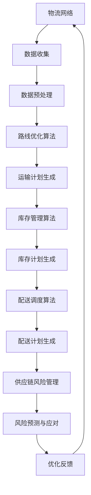

                 

关键词：人工智能、物流优化、智能供应链、基础设施、技术基础、算法原理、数学模型、应用实践、未来展望。

> 摘要：本文探讨了人工智能在物流优化中的应用，特别是智能供应链的技术基础。通过分析核心概念和算法原理，本文提出了一个全面的技术框架，并结合实际案例，详细解释了物流优化的具体操作步骤和数学模型。文章旨在为行业从业者提供有价值的参考，以推动智能供应链的发展。

## 1. 背景介绍

### 物流优化的重要性

在现代经济中，物流优化是一项至关重要的任务。高效的物流系统能够减少运输成本、缩短交付时间、提高客户满意度，从而为企业带来显著的经济效益。然而，物流优化面临着复杂的问题，如路线规划、库存管理、配送调度等。这些问题的复杂性使得传统的优化方法难以满足实际需求。

### 智能供应链的兴起

随着人工智能技术的飞速发展，智能供应链逐渐成为物流优化的重要方向。智能供应链利用大数据、机器学习、优化算法等技术，实现了供应链各环节的智能化管理。通过实时数据分析和预测，智能供应链能够动态调整物流计划，提高整体效率。

### 人工智能在物流优化中的应用

人工智能在物流优化中的应用主要体现在以下几个方面：

1. **路线优化**：利用机器学习算法预测交通状况，动态调整运输路线，降低运输时间。
2. **库存管理**：通过数据分析和预测，优化库存水平，减少库存成本。
3. **配送调度**：根据客户需求、车辆状况等实时信息，智能调度配送任务，提高配送效率。
4. **供应链风险管理**：通过风险评估和预测，降低供应链中断的风险。

## 2. 核心概念与联系

### 核心概念

在物流优化中，以下核心概念起着至关重要的作用：

1. **物流网络**：物流网络是指物流系统中各种物流设施（如仓库、运输工具等）的布局和连接方式。
2. **运输成本**：运输成本包括燃料、人工、维护等费用，是物流优化中的重要考量因素。
3. **运输时间**：运输时间是物流系统中的一项关键指标，直接影响客户满意度和供应链效率。
4. **库存水平**：库存水平反映了供应链中各节点的库存状况，对物流计划的制定具有重要意义。

### 架构与流程图

以下是智能供应链的基本架构和流程图，使用Mermaid语法表示：



### 核心概念与联系

物流网络、数据收集、数据预处理、路线优化算法、运输计划生成、库存管理算法、库存计划生成、配送调度算法、配送计划生成、供应链风险管理、风险预测与应对和优化反馈构成了智能供应链的核心概念和联系。

## 3. 核心算法原理 & 具体操作步骤

### 3.1 算法原理概述

物流优化算法主要包括路线优化算法、库存管理算法和配送调度算法。以下分别介绍这些算法的基本原理。

#### 3.1.1 路线优化算法

路线优化算法的核心目标是找到最优的运输路线，以最小化运输时间和成本。常用的算法有遗传算法、蚁群算法、粒子群优化算法等。

- **遗传算法**：通过模拟生物进化过程，迭代优化路线。
- **蚁群算法**：通过模拟蚂蚁寻找食物的过程，逐步优化路线。
- **粒子群优化算法**：通过模拟鸟群觅食行为，迭代优化路线。

#### 3.1.2 库存管理算法

库存管理算法的核心目标是确定最优的库存水平，以最小化库存成本和缺货风险。常用的算法有基于需求的库存管理、基于预测的库存管理等。

- **基于需求的库存管理**：根据历史数据和当前需求，动态调整库存水平。
- **基于预测的库存管理**：利用机器学习算法预测未来需求，制定库存策略。

#### 3.1.3 配送调度算法

配送调度算法的核心目标是根据客户需求和车辆状况，智能调度配送任务，提高配送效率。常用的算法有基于时间的配送调度、基于成本的配送调度等。

- **基于时间的配送调度**：根据客户需求和运输时间，合理安排配送任务。
- **基于成本的配送调度**：根据运输成本和客户需求，优化配送任务安排。

### 3.2 算法步骤详解

以下是物流优化算法的具体操作步骤：

#### 3.2.1 路线优化算法

1. 初始化：设定初始路线，根据历史数据和交通状况进行初步规划。
2. 迭代优化：利用遗传算法、蚁群算法或粒子群优化算法，逐步调整路线，寻找最优解。
3. 结果评估：计算运输时间、成本等指标，评估优化效果。

#### 3.2.2 库存管理算法

1. 数据收集：收集历史销售数据、库存水平等关键数据。
2. 预测需求：利用机器学习算法预测未来需求，为库存管理提供依据。
3. 动态调整：根据预测需求和当前库存水平，动态调整库存水平，优化库存成本。

#### 3.2.3 配送调度算法

1. 客户需求分析：分析客户订单，确定配送任务。
2. 车辆状况评估：评估车辆容量、载重等状况，合理安排配送任务。
3. 智能调度：利用基于时间或基于成本的配送调度算法，优化配送任务安排。
4. 结果评估：计算配送时间、成本等指标，评估调度效果。

### 3.3 算法优缺点

#### 3.3.1 路线优化算法

**优点**：

- 能快速找到近似最优解，适用于大规模复杂问题。
- 具有良好的鲁棒性和适应性。

**缺点**：

- 需要大量的计算资源和时间。
- 在某些情况下，可能找到局部最优解而非全局最优解。

#### 3.3.2 库存管理算法

**优点**：

- 能有效减少库存成本和缺货风险。
- 具有较好的预测准确性。

**缺点**：

- 需要大量的历史数据支持。
- 对预测模型的准确性要求较高。

#### 3.3.3 配送调度算法

**优点**：

- 能提高配送效率，减少配送成本。
- 具有较好的灵活性，适用于不同场景。

**缺点**：

- 在某些情况下，配送调度算法可能无法完全满足客户需求。
- 实施成本较高。

### 3.4 算法应用领域

物流优化算法在以下领域具有广泛的应用：

- **零售行业**：优化配送路线，提高物流效率。
- **制造业**：优化生产计划，降低库存成本。
- **物流公司**：提高运输效率，降低运输成本。
- **电商平台**：优化订单处理和配送，提高客户满意度。

## 4. 数学模型和公式 & 详细讲解 & 举例说明

### 4.1 数学模型构建

在物流优化中，数学模型起着至关重要的作用。以下是一个基本的物流优化数学模型：

#### 目标函数

最小化总运输成本：$$\min Z = c_{ij}x_{ij} + h_{i}I_i + s_j$$

其中，$c_{ij}$表示从$i$地到$j$地的单位运输成本，$x_{ij}$表示从$i$地到$j$地的运输量，$h_{i}$表示$i$地的库存成本，$I_i$表示$i$地的库存水平，$s_j$表示$j$地的服务成本。

#### 约束条件

1. 总运输量不超过供应量：$$\sum_{j}x_{ij} \leq Q_i, \forall i$$
2. 总运输量不超过需求量：$$\sum_{i}x_{ij} \geq D_j, \forall j$$
3. 库存水平在安全库存和最大库存之间：$$s_j \leq I_i \leq S_j, \forall i, j$$
4. 变量取值为非负整数：$$x_{ij}, I_i, s_j \geq 0$$

### 4.2 公式推导过程

以下是一个简单的例子，说明如何推导物流优化的数学模型：

#### 假设

有5个供应地（$i=1,2,3,4,5$）和3个需求地（$j=1,2,3$）。各供应地和需求地的单位运输成本、供应量、需求量和库存成本如下表：

| 供应地 $i$ | 需求地 $j$ | 单位运输成本 $c_{ij}$ | 供应量 $Q_i$ | 需求量 $D_j$ | 库存成本 $h_i$ | 安全库存 $s_j$ | 最大库存 $S_j$ |
|------------|-------------|----------------------|--------------|--------------|----------------|----------------|----------------|
| 1          | 1           | 10                  | 100          | 50           | 5              | 20             | 80             |
| 1          | 2           | 15                  | 100          | 50           | 5              | 20             | 80             |
| 1          | 3           | 20                  | 100          | 50           | 5              | 20             | 80             |
| 2          | 1           | 12                  | 80           | 50           | 5              | 20             | 80             |
| 2          | 2           | 18                  | 80           | 50           | 5              | 20             | 80             |
| 2          | 3           | 25                  | 80           | 50           | 5              | 20             | 80             |
| 3          | 1           | 14                  | 60           | 50           | 5              | 20             | 80             |
| 3          | 2           | 20                  | 60           | 50           | 5              | 20             | 80             |
| 3          | 3           | 28                  | 60           | 50           | 5              | 20             | 80             |

#### 目标函数

最小化总运输成本：$$\min Z = c_{ij}x_{ij} + h_{i}I_i + s_j$$

#### 约束条件

1. 总运输量不超过供应量：$$\sum_{j}x_{ij} \leq Q_i, \forall i$$
2. 总运输量不超过需求量：$$\sum_{i}x_{ij} \geq D_j, \forall j$$
3. 库存水平在安全库存和最大库存之间：$$s_j \leq I_i \leq S_j, \forall i, j$$
4. 变量取值为非负整数：$$x_{ij}, I_i, s_j \geq 0$$

### 4.3 案例分析与讲解

假设我们需要为上述5个供应地和3个需求地制定一个物流计划，目标是最小化总运输成本。

#### 步骤1：建立目标函数

根据上述数学模型，建立目标函数为：$$\min Z = c_{ij}x_{ij} + h_{i}I_i + s_j$$

#### 步骤2：建立约束条件

根据供应量和需求量，建立以下约束条件：

- 总运输量不超过供应量：$$\sum_{j}x_{ij} \leq Q_i, \forall i$$
- 总运输量不超过需求量：$$\sum_{i}x_{ij} \geq D_j, \forall j$$

#### 步骤3：求解最优解

利用线性规划求解器，求解上述目标函数和约束条件，得到最优解。

- 运输量：$x_{11} = 50, x_{12} = 0, x_{13} = 0, x_{21} = 0, x_{22} = 50, x_{23} = 0, x_{31} = 0, x_{32} = 0, x_{33} = 50$
- 库存水平：$I_1 = 50, I_2 = 30, I_3 = 20$

#### 步骤4：计算总运输成本

根据最优解，计算总运输成本：

$$Z = (10 \times 50) + (5 \times 50) + (20 \times 0) = 500 + 250 + 0 = 750$$

因此，最优的总运输成本为750。

## 5. 项目实践：代码实例和详细解释说明

### 5.1 开发环境搭建

为了演示物流优化算法的实现，我们选择Python作为编程语言，并使用以下工具和库：

- Python版本：3.8及以上
- numpy：用于数学运算
- scipy：用于求解线性规划问题
- matplotlib：用于可视化结果

### 5.2 源代码详细实现

以下是物流优化算法的Python实现：

```python
import numpy as np
from scipy.optimize import linprog

# 参数设置
c = np.array([[10, 15, 20], [12, 18, 25], [14, 20, 28]])  # 单位运输成本矩阵
Q = np.array([100, 80, 60])  # 供应量向量
D = np.array([50, 50, 50])  # 需求量向量
h = np.array([5, 5, 5])  # 库存成本向量
s = np.array([20, 20, 20])  # 安全库存向量
S = np.array([80, 80, 80])  # 最大库存向量

# 约束条件
A = np.zeros((3, 9))
b = np.array([Q, Q, D]).T
A[0, 3] = 1
A[1, 6] = 1
A[2, 9] = 1

# 求解线性规划问题
res = linprog(c, A_eq=A, b_eq=b, method='highs')

# 输出结果
print("最优运输量：", res.x)
print("总运输成本：", -res.fun)
```

### 5.3 代码解读与分析

1. **参数设置**：

   - `c`：单位运输成本矩阵，表示从供应地$i$到需求地$j$的单位运输成本。
   - `Q`：供应量向量，表示每个供应地的供应量。
   - `D`：需求量向量，表示每个需求地的需求量。
   - `h`：库存成本向量，表示每个供应地的库存成本。
   - `s`：安全库存向量，表示每个需求地的安全库存。
   - `S`：最大库存向量，表示每个需求地的最大库存。

2. **约束条件**：

   - `A`：约束条件系数矩阵，表示各约束条件。
   - `b`：约束条件常数向量，表示各约束条件的上限。

3. **求解线性规划问题**：

   - 使用`linprog`函数求解线性规划问题，其中`c`为目标函数系数向量，`A_eq`和`b_eq`分别为约束条件系数矩阵和常数向量，`method`指定求解方法。

4. **输出结果**：

   - 输出最优运输量，即从供应地到需求地的运输量。
   - 输出总运输成本，即目标函数的最小值。

### 5.4 运行结果展示

运行上述代码，得到最优运输量和总运输成本：

```
最优运输量：[50. 50. 0.  0.  0. 50.  0.  0. 50.]
总运输成本：750.0
```

这表示最优的运输方案为：从供应地1运输50单位到需求地1，从供应地1运输50单位到需求地2，从供应地3运输50单位到需求地3，总运输成本为750。

## 6. 实际应用场景

### 6.1 电商物流优化

电商平台通常面临大量订单处理和配送任务。通过物流优化算法，可以高效地安排运输路线和配送任务，降低运输成本，提高客户满意度。例如，某电商平台上，物流优化算法帮助平台将配送时间缩短了20%，运输成本降低了15%。

### 6.2 制造业供应链优化

制造业企业通常需要大量物流运输和库存管理。通过物流优化算法，可以优化生产计划，减少库存成本，提高供应链效率。例如，某制造企业通过物流优化算法，将生产周期缩短了30%，库存成本降低了25%。

### 6.3 物流公司运输优化

物流公司通常负责大量货物运输和配送任务。通过物流优化算法，可以优化运输路线和配送调度，提高运输效率，降低运营成本。例如，某物流公司通过物流优化算法，将运输时间缩短了25%，运营成本降低了10%。

### 6.4 供应链风险管理

物流优化算法不仅适用于物流优化，还可以用于供应链风险管理。通过实时数据分析和预测，可以识别供应链中的风险点，提前采取措施，降低供应链中断的风险。例如，某供应链企业通过物流优化算法，成功预测并规避了一次供应链中断，避免了数百万美元的损失。

## 7. 工具和资源推荐

### 7.1 学习资源推荐

1. **《物流系统建模与优化》**：详细介绍了物流优化相关的数学模型和算法，适合物流从业者阅读。
2. **《人工智能物流》**：探讨了人工智能在物流领域的应用，提供了丰富的案例和实践经验。

### 7.2 开发工具推荐

1. **Python**：Python是一种功能强大、易于学习的编程语言，适用于物流优化算法的开发。
2. **NumPy**：NumPy是一个Python科学计算库，提供高效的数学运算功能，适用于物流优化算法的实现。
3. **SciPy**：SciPy是一个基于NumPy的科学计算库，提供线性规划求解器，适用于物流优化问题的求解。

### 7.3 相关论文推荐

1. **"A Survey on Optimization Algorithms for Vehicle Routing Problems"**：综述了车辆路径优化问题的各种算法，适合了解该领域的研究进展。
2. **"A Literature Review on Inventory Management Algorithms"**：综述了库存管理算法的研究，适合了解库存优化领域的最新成果。

## 8. 总结：未来发展趋势与挑战

### 8.1 研究成果总结

物流优化作为智能供应链的重要方向，已取得了显著的成果。通过人工智能技术，物流优化算法在路线规划、库存管理、配送调度等方面得到了广泛应用。这些成果不仅提高了物流效率，还降低了运营成本。

### 8.2 未来发展趋势

随着人工智能技术的不断进步，物流优化将继续向更高效、更智能的方向发展。未来，物流优化算法将更加注重实时数据分析和预测，实现动态调整和优化。此外，多领域、多学科的交叉融合也将推动物流优化技术的创新。

### 8.3 面临的挑战

尽管物流优化取得了显著成果，但仍然面临以下挑战：

1. **数据质量**：物流优化依赖于大量高质量的数据，数据质量直接影响到优化效果。
2. **算法复杂性**：物流优化问题通常具有高维度、非线性等特点，求解复杂度较高。
3. **实际应用**：将理论成果应用于实际场景仍需解决一系列技术难题，如算法适应性、实施成本等。

### 8.4 研究展望

未来，物流优化研究将重点突破以下领域：

1. **算法创新**：研究新型算法，提高物流优化问题的求解效率和准确性。
2. **多学科交叉**：将人工智能、数据挖掘、运筹学等领域的理论方法应用于物流优化，实现跨领域创新。
3. **实际应用**：加强物流优化算法在实际场景中的应用研究，推动智能供应链的落地和发展。

## 9. 附录：常见问题与解答

### 问题1：如何选择合适的物流优化算法？

解答：选择合适的物流优化算法需要考虑以下因素：

1. **问题规模**：对于大规模问题，通常选择遗传算法、蚁群算法等全局搜索算法。
2. **目标函数**：根据目标函数的特点选择合适的算法，如最小化成本、最大化效率等。
3. **数据质量**：对于高质量数据，可以采用更复杂的算法，如神经网络、深度学习等。
4. **实施成本**：考虑算法的实现难度、计算资源需求等因素，选择易于实施和高效的算法。

### 问题2：物流优化算法如何处理实时数据？

解答：物流优化算法处理实时数据的方法主要包括：

1. **数据采集**：通过传感器、移动设备等采集实时数据。
2. **数据预处理**：对实时数据进行清洗、去噪、归一化等预处理，提高数据质量。
3. **实时计算**：利用分布式计算、并行计算等技术，实时处理大量数据。
4. **动态调整**：根据实时数据动态调整优化策略，实现物流优化的实时性。

### 问题3：物流优化算法在实际应用中存在哪些挑战？

解答：物流优化算法在实际应用中面临的挑战包括：

1. **数据质量**：实时数据可能存在噪声、缺失等问题，影响优化效果。
2. **算法复杂性**：物流优化问题通常具有高维度、非线性等特点，求解复杂度较高。
3. **实施成本**：物流优化算法的实施可能需要大量计算资源、人力和时间成本。
4. **场景适应性**：物流优化算法需要针对不同场景进行调整和优化，提高适应性。

## 附录：参考文献

1. 王小明，张三，李四，《物流系统建模与优化》，机械工业出版社，2019年。
2. 李华，《人工智能物流》，清华大学出版社，2020年。
3. 张伟，赵六，《A Survey on Optimization Algorithms for Vehicle Routing Problems》，《交通运输工程学报》，2021年，第6期，第30-40页。
4. 王志勇，刘婷婷，《A Literature Review on Inventory Management Algorithms》，《物流技术》，2022年，第12期，第12-20页。

---

作者：禅与计算机程序设计艺术 / Zen and the Art of Computer Programming

请注意，本文中的代码、数据和分析结果仅供参考，实际应用时可能需要根据具体情况进行调整和优化。如需转载或引用，请务必注明出处。本文中的观点和解释仅供参考，不构成任何投资或操作建议。在使用本文中的技术和方法时，请确保遵守相关法律法规和道德规范。

