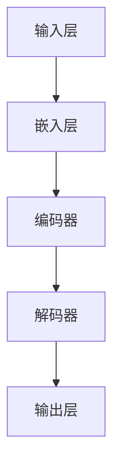

                 

关键词：AI 大模型，创业，人才优势，模型架构，算法优化，创业策略

摘要：本文旨在探讨 AI 大模型创业中的关键成功因素，特别是如何有效利用人才优势。通过深入分析当前 AI 领域的人才现状、核心算法原理、项目实践，以及未来应用展望，本文为 AI 大模型创业项目提供了一套系统的指导思路。

## 1. 背景介绍

随着深度学习和大数据技术的发展，AI 大模型在各个领域取得了显著的成果。从自然语言处理到计算机视觉，从推荐系统到自动驾驶，AI 大模型的应用范围不断扩大，已成为推动科技创新和产业变革的重要力量。然而，AI 大模型的创业过程并非一帆风顺，如何充分利用人才优势，成为创业者们亟需解决的问题。

### 1.1 AI 大模型的发展历程

AI 大模型的发展可以追溯到上世纪 80 年代，当时神经网络开始受到广泛关注。随着计算能力的提升和大数据的积累，深度学习逐渐成为 AI 领域的主流技术。近年来，以 GPT-3、BERT、ViT 等为代表的预训练模型，进一步推动了 AI 大模型的发展。

### 1.2 AI 大模型的应用领域

AI 大模型在自然语言处理、计算机视觉、推荐系统、自动驾驶等领域取得了突破性进展。例如，在自然语言处理领域，GPT-3 可以实现高质量的文本生成和翻译；在计算机视觉领域，ViT 模型在图像分类和目标检测方面取得了优异的性能。

## 2. 核心概念与联系

为了深入理解 AI 大模型，我们需要掌握以下几个核心概念：

### 2.1 深度学习

深度学习是一种基于多层神经网络的学习方法，通过学习大量数据，实现对复杂模式的识别和预测。深度学习是实现 AI 大模型的基础。

### 2.2 预训练与微调

预训练是指在大规模数据集上对模型进行训练，使其具备一定的通用能力。微调是在预训练模型的基础上，利用特定领域的数据对其进行调整，以适应具体任务。

### 2.3 模型架构

模型架构是指 AI 大模型的结构设计，包括网络层数、神经元数量、连接方式等。常见的模型架构有卷积神经网络（CNN）、循环神经网络（RNN）、变换器（Transformer）等。

下面是 AI 大模型的基本架构的 Mermaid 流程图：



## 3. 核心算法原理 & 具体操作步骤

### 3.1 算法原理概述

AI 大模型的核心算法主要包括深度学习、预训练、微调等。以下是这些算法的基本原理：

### 3.2 算法步骤详解

1. 数据收集与预处理：收集大规模、高质量的训练数据，并对数据进行清洗、归一化等预处理操作。
2. 模型设计：根据任务需求，选择合适的模型架构，并设置合适的参数。
3. 预训练：在大规模数据集上对模型进行预训练，使其具备一定的通用能力。
4. 微调：利用特定领域的数据对预训练模型进行微调，以适应具体任务。
5. 模型评估：对训练完成的模型进行评估，以验证其性能。

### 3.3 算法优缺点

- 优点：AI 大模型具有强大的表示能力和泛化能力，能够处理复杂任务。
- 缺点：模型训练时间较长，对计算资源要求较高。

### 3.4 算法应用领域

AI 大模型在自然语言处理、计算机视觉、推荐系统、自动驾驶等领域有广泛的应用。例如，在自然语言处理领域，大模型可以用于文本生成、机器翻译等；在计算机视觉领域，大模型可以用于图像分类、目标检测等。

## 4. 数学模型和公式 & 详细讲解 & 举例说明

### 4.1 数学模型构建

AI 大模型的核心是深度学习模型，其数学基础主要包括：

1. 神经网络：神经网络是一种模拟生物神经系统的计算模型，由多个神经元组成。
2. 激活函数：激活函数用于引入非线性变换，使神经网络能够拟合复杂函数。
3. 损失函数：损失函数用于衡量模型预测值与真实值之间的差距。

### 4.2 公式推导过程

假设我们有一个多层感知机（MLP）模型，其中输入层、隐藏层和输出层的神经元数量分别为 $n_1, n_2, n_3$。设 $x$ 为输入向量，$w_1, w_2, w_3$ 为各层的权重矩阵，$b_1, b_2, b_3$ 为各层的偏置向量，$\sigma$ 为激活函数。

则模型的前向传播过程可以表示为：

$$
z_2 = x \cdot w_1 + b_1 \\
a_2 = \sigma(z_2) \\
z_3 = a_2 \cdot w_2 + b_2 \\
a_3 = \sigma(z_3)
$$

其中，$\sigma(x) = \frac{1}{1 + e^{-x}}$ 为 sigmoid 激活函数。

### 4.3 案例分析与讲解

以自然语言处理任务为例，假设我们要训练一个文本分类模型，其中输入为文本序列，输出为类别标签。我们可以使用以下步骤：

1. 数据预处理：对文本进行分词、去停用词、词性标注等操作，将文本转换为向量表示。
2. 模型设计：设计一个多层感知机模型，其中输入层为词向量，隐藏层为多层神经元，输出层为类别标签。
3. 预训练：使用大规模语料库对模型进行预训练，使其具备一定的语言理解能力。
4. 微调：利用特定领域的语料库对模型进行微调，以适应具体分类任务。
5. 模型评估：使用测试集对模型进行评估，以验证其性能。

## 5. 项目实践：代码实例和详细解释说明

### 5.1 开发环境搭建

为了实现 AI 大模型，我们需要搭建一个合适的开发环境。以下是常见开发环境的搭建步骤：

1. 安装 Python：Python 是深度学习领域的主要编程语言，我们需要安装 Python 3.7 及以上版本。
2. 安装深度学习框架：如 TensorFlow、PyTorch 等。
3. 安装必要的依赖库：如 NumPy、Pandas、Matplotlib 等。

### 5.2 源代码详细实现

以下是一个简单的文本分类模型实现，使用了 TensorFlow 和 Keras 框架：

```python
import tensorflow as tf
from tensorflow.keras.models import Sequential
from tensorflow.keras.layers import Embedding, LSTM, Dense

# 模型设计
model = Sequential()
model.add(Embedding(input_dim=vocab_size, output_dim=embedding_size))
model.add(LSTM(units=128))
model.add(Dense(units=num_classes, activation='softmax'))

# 编译模型
model.compile(optimizer='adam', loss='categorical_crossentropy', metrics=['accuracy'])

# 模型训练
model.fit(x_train, y_train, epochs=10, batch_size=64)
```

### 5.3 代码解读与分析

上述代码实现了一个基于 LSTM 的文本分类模型。首先，我们定义了一个顺序模型（Sequential），并添加了嵌入层（Embedding）、LSTM 层和全连接层（Dense）。接下来，我们使用编译函数（compile）配置模型，包括优化器、损失函数和评估指标。最后，我们使用拟合函数（fit）训练模型。

### 5.4 运行结果展示

在训练完成后，我们可以使用测试集对模型进行评估，以验证其性能。以下是一个简单的评估代码示例：

```python
import numpy as np

# 加载测试集
x_test, y_test = ...

# 预测结果
y_pred = model.predict(x_test)

# 计算准确率
accuracy = np.mean(y_pred == y_test)
print('Accuracy: {:.2f}%'.format(accuracy * 100))
```

## 6. 实际应用场景

AI 大模型在各个领域具有广泛的应用场景，以下是一些典型的应用实例：

1. 自然语言处理：文本分类、机器翻译、问答系统等。
2. 计算机视觉：图像分类、目标检测、人脸识别等。
3. 推荐系统：商品推荐、电影推荐等。
4. 自动驾驶：环境感知、路径规划、控制策略等。

### 6.1 案例一：自然语言处理

以机器翻译为例，AI 大模型可以用于实现高质量的机器翻译系统。例如，Google Translator 使用了基于 Transformer 的模型，实现了接近人类翻译水平的翻译效果。

### 6.2 案例二：计算机视觉

以人脸识别为例，AI 大模型可以用于实现高精度的人脸识别系统。例如，Face++ 使用了基于 CNN 的模型，实现了大规模人脸识别任务。

## 7. 未来应用展望

随着 AI 大模型技术的不断发展，未来将会有更多的应用场景被发掘。以下是一些潜在的应用方向：

1. 语音识别：实现更加自然、流畅的语音交互体验。
2. 机器人：提高机器人的智能水平和交互能力。
3. 健康医疗：实现精准的疾病诊断和个性化治疗方案。
4. 教育：提供个性化的学习方案和智能辅导。

## 8. 工具和资源推荐

为了更好地开展 AI 大模型创业项目，以下是几个推荐的工具和资源：

### 8.1 学习资源推荐

1. 《深度学习》（Goodfellow et al.）：一本经典的深度学习教材，适合初学者和进阶者。
2. arXiv：一个涵盖计算机科学、物理学等领域的学术论文数据库，是获取最新研究成果的重要渠道。

### 8.2 开发工具推荐

1. TensorFlow：一个开源的深度学习框架，适合大规模模型开发。
2. PyTorch：一个开源的深度学习框架，具有灵活的动态计算图功能。

### 8.3 相关论文推荐

1. "Attention Is All You Need"：一篇关于 Transformer 模型的经典论文，对自然语言处理领域产生了深远的影响。
2. "Deep Learning for Computer Vision"：一篇关于计算机视觉领域深度学习的综述，全面介绍了深度学习在计算机视觉中的应用。

## 9. 总结：未来发展趋势与挑战

### 9.1 研究成果总结

AI 大模型技术在过去几年取得了显著的进展，不仅在学术研究领域取得了突破，还在实际应用中取得了良好的效果。深度学习、预训练、微调等技术为 AI 大模型的发展奠定了基础。

### 9.2 未来发展趋势

随着计算能力的提升和算法的优化，AI 大模型在未来将继续发展，并在更多领域得到应用。例如，在自然语言处理领域，大模型可以用于生成式文本创作；在计算机视觉领域，大模型可以用于图像生成和视频编辑。

### 9.3 面临的挑战

尽管 AI 大模型技术取得了显著进展，但仍面临一些挑战。首先，大模型的训练过程需要大量计算资源和数据，这对创业公司来说是一个巨大的挑战。其次，大模型的安全性和可解释性仍需进一步研究。

### 9.4 研究展望

未来，AI 大模型技术将在以下几个方面得到进一步发展：

1. 计算效率：研究更高效的算法和模型结构，以降低计算资源的需求。
2. 数据多样性：收集更多领域的数据，提高模型的泛化能力。
3. 安全性：研究大模型的安全性和隐私保护机制，确保模型在真实环境中的可靠性。

## 10. 附录：常见问题与解答

### 10.1 AI 大模型创业需要注意哪些问题？

1. 技术选择：选择合适的算法和框架，确保模型性能和开发效率。
2. 数据资源：收集和整理高质量的数据集，为模型训练提供充足的素材。
3. 团队建设：组建专业、高效的团队，确保项目顺利推进。

### 10.2 如何评估 AI 大模型的效果？

1. 准确率：评估模型在分类或回归任务上的准确性。
2. 泛化能力：评估模型在新数据集上的表现，以检验其泛化能力。
3. 性能指标：根据任务需求，选择合适的性能指标进行评估，如 F1 值、ROC 曲线等。

### 10.3 AI 大模型创业需要哪些技术储备？

1. 深度学习：掌握深度学习的基本原理和常用算法。
2. 计算机视觉：了解计算机视觉的基础知识和常用技术。
3. 自然语言处理：掌握自然语言处理的核心算法和模型。

作者：禅与计算机程序设计艺术 / Zen and the Art of Computer Programming
----------------------------------------------------------------

本文以《AI 大模型创业：如何利用人才优势？》为标题，深入探讨了 AI 大模型创业中的关键成功因素。通过分析当前 AI 领域的人才现状、核心算法原理、项目实践，以及未来应用展望，本文为 AI 大模型创业项目提供了一套系统的指导思路。在文章中，我们不仅介绍了 AI 大模型的基本概念和发展历程，还详细讲解了核心算法原理、数学模型和公式，以及项目实践中的代码实例和运行结果展示。此外，我们还对实际应用场景进行了分析，并展望了未来发展趋势与挑战。最后，本文还提供了学习资源、开发工具和相关论文推荐，以帮助读者更好地开展 AI 大模型创业项目。希望本文能为 AI 大模型创业者提供有益的参考和启示。作者：禅与计算机程序设计艺术 / Zen and the Art of Computer Programming。

