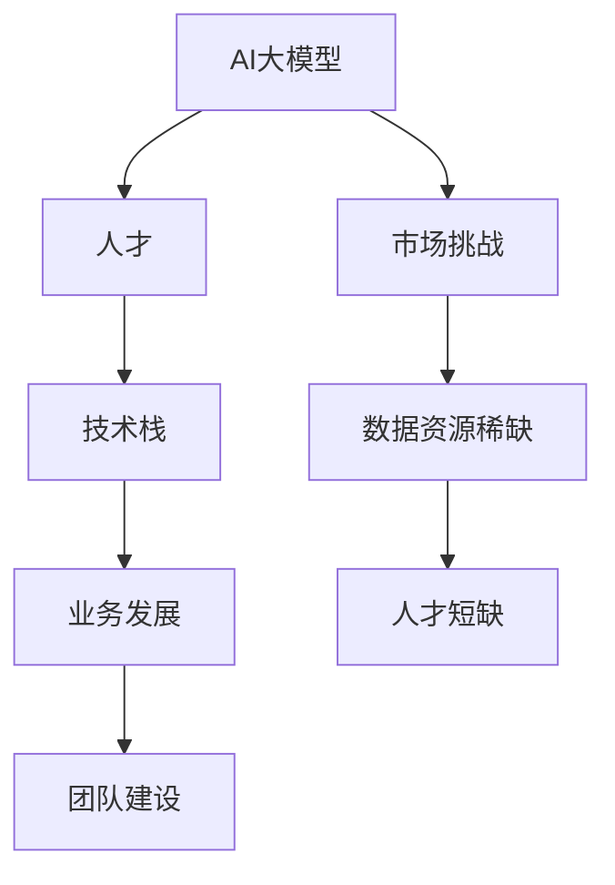
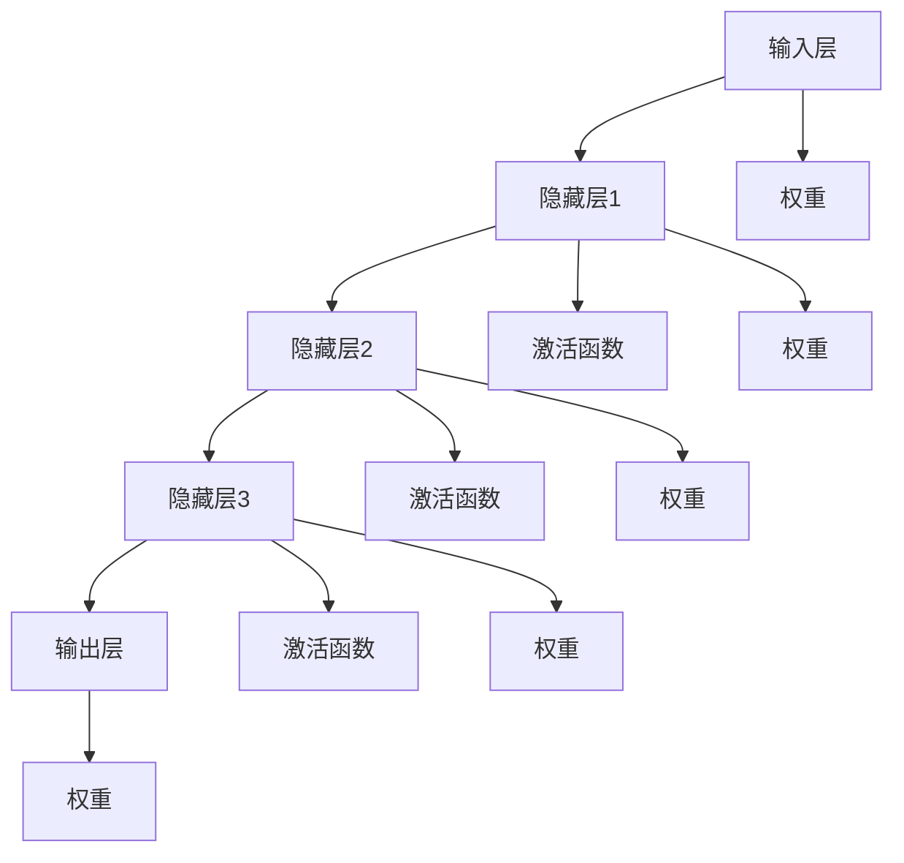
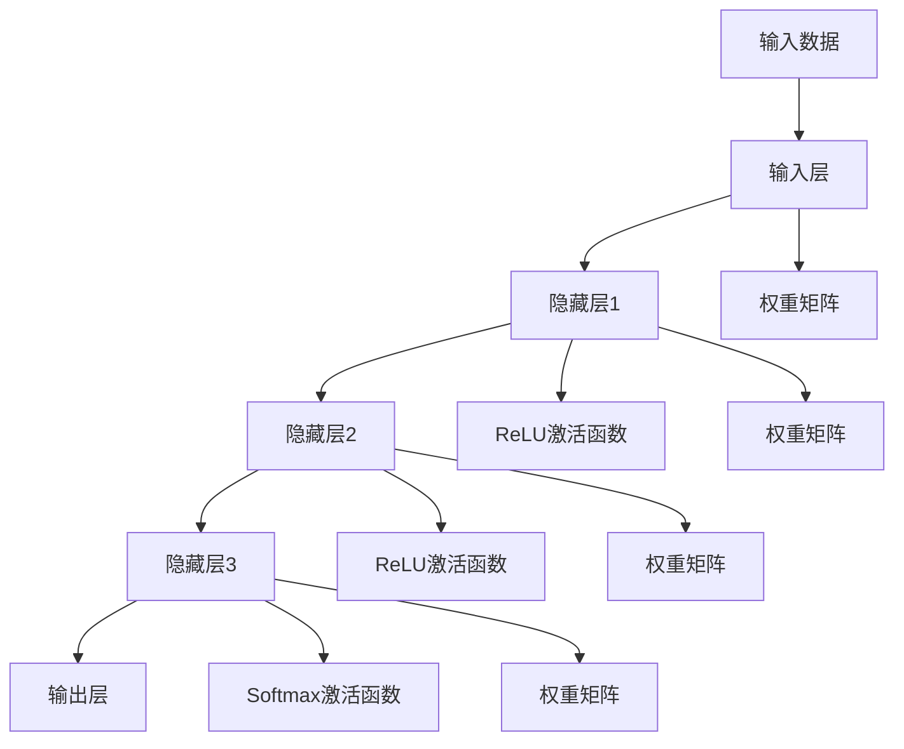
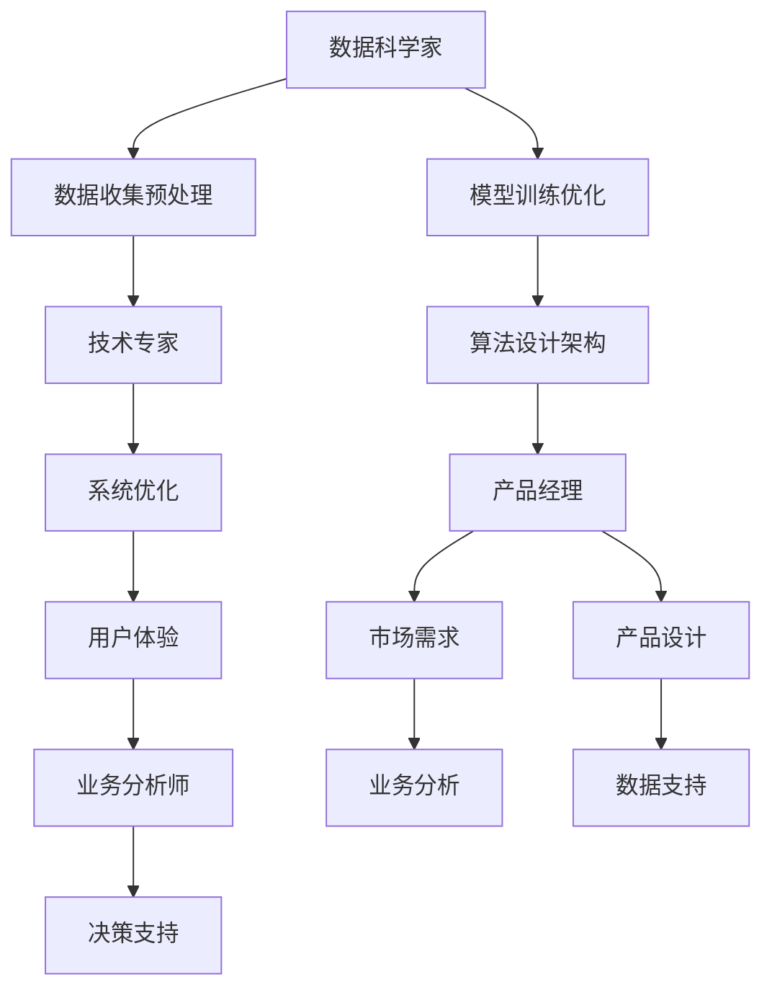
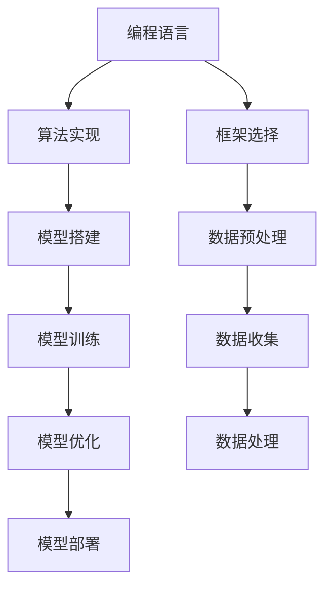
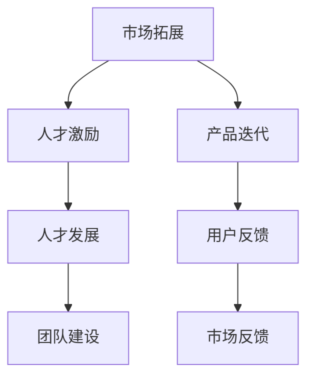
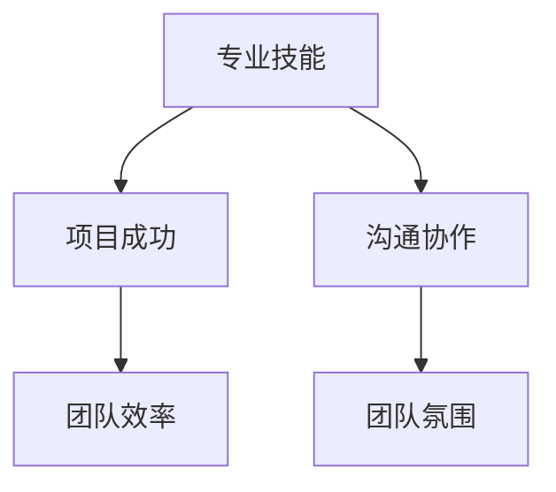
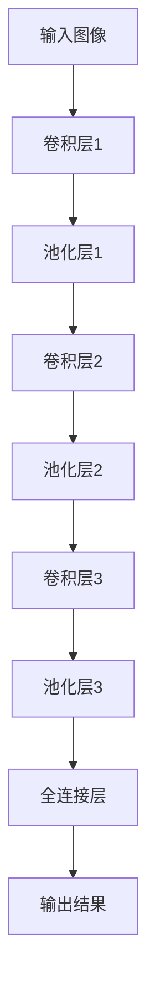

                 

# AI 大模型创业：如何利用人才优势？

## 关键词
- AI大模型
- 创业
- 人才优势
- 技术栈
- 业务发展
- 团队建设

## 摘要
本文旨在探讨AI大模型创业过程中的关键问题——如何利用人才优势。我们将从背景介绍、核心概念与联系、算法原理、数学模型、项目实践、实际应用场景等多个角度，逐步分析创业过程中的人才管理策略，旨在为创业者提供有价值的参考。

## 1. 背景介绍

随着人工智能技术的飞速发展，AI大模型正逐渐成为各行各业的核心竞争力。大模型不仅在数据分析和预测方面表现出色，还能为业务决策提供强有力的支持。然而，AI大模型的创业之路并不平坦，其中最为关键的一环便是人才的管理和利用。

### 1.1 市场背景

AI大模型市场在近年经历了爆发式增长。根据相关报告，2021年全球人工智能市场规模已达到3770亿美元，预计到2025年将达到9390亿美元。这一增长趋势吸引了大量创业者进入这一领域，但同时也带来了激烈的竞争。

### 1.2 创业挑战

AI大模型创业面临的挑战主要体现在以下几个方面：

- **技术门槛高**：大模型的研发和部署需要深厚的专业知识，包括但不限于机器学习、深度学习、计算机视觉等。
- **数据资源稀缺**：高质量的数据集对于大模型训练至关重要，但往往难以获取。
- **人才短缺**：专业人才是推动AI大模型发展的重要力量，但目前市场上这类人才供不应求。

### 1.3 人才优势的重要性

在面对上述挑战时，人才优势成为创业成功的关键因素。优秀的人才不仅可以解决技术难题，还能推动业务发展，提高市场竞争力。因此，如何有效利用人才优势成为AI大模型创业的首要问题。

## 2. 核心概念与联系

在探讨如何利用人才优势之前，我们需要明确几个核心概念，并理解它们之间的联系。

### 2.1 AI大模型

AI大模型指的是拥有数亿甚至千亿级参数的深度学习模型。这些模型通过大量的数据训练，能够模拟人类的认知过程，实现复杂任务的自动化。

### 2.2 人才

在AI大模型创业中，人才不仅包括技术专家，还包括数据科学家、产品经理、业务分析师等多个角色。每个角色都承担着不同的职责，共同推动项目的进展。

### 2.3 技术栈

技术栈指的是创业者所掌握的技术领域，包括编程语言、框架、工具等。一个完善的技术栈能够提高开发效率，缩短项目周期。

### 2.4 业务发展

业务发展指的是企业的市场拓展、产品迭代和盈利模式。优秀的业务发展策略能够为人才提供广阔的发展空间，吸引更多优秀人才加入。

### 2.5 团队建设

团队建设是利用人才优势的基础。一个高效的团队不仅需要具备专业技能，还需要良好的沟通和协作机制。

### 2.6 Mermaid 流程图

下面是一个简单的Mermaid流程图，展示了核心概念之间的联系：



## 3. 核心算法原理 & 具体操作步骤

在AI大模型创业中，核心算法原理是决定项目成败的关键。以下是一个简单的算法原理介绍，以及具体的操作步骤。

### 3.1 算法原理

AI大模型的核心算法是基于深度学习，特别是神经网络。神经网络通过层层神经元之间的连接和权重调整，实现对数据的分析和预测。

### 3.2 操作步骤

1. **数据收集与处理**：收集高质量的数据集，并进行预处理，如数据清洗、归一化等。
2. **模型设计**：设计神经网络结构，包括层数、神经元数量、激活函数等。
3. **模型训练**：使用训练数据集对模型进行训练，通过反向传播算法不断调整权重。
4. **模型评估**：使用验证数据集评估模型性能，调整模型参数以达到最佳效果。
5. **模型部署**：将训练好的模型部署到生产环境中，实现实际应用。

## 4. 数学模型和公式 & 详细讲解 & 举例说明

在AI大模型创业中，数学模型和公式是理解和应用算法的基础。以下是一个简单的数学模型介绍，以及详细讲解和举例说明。

### 4.1 数学模型

在神经网络中，常用的数学模型是前向传播和反向传播。前向传播用于计算输入和输出之间的误差，反向传播用于调整权重以减少误差。

### 4.2 公式

- 前向传播：$$Z = W \cdot X + b$$
- 激活函数：$$a = \sigma(Z)$$
- 反向传播：$$\delta = \frac{\partial L}{\partial Z}$$
- 权重更新：$$W := W - \alpha \cdot \frac{\partial L}{\partial W}$$

### 4.3 详细讲解

- **前向传播**：输入数据经过加权求和处理后，通过激活函数得到输出。这个过程可以看作是数据的传递过程。
- **激活函数**：常用的激活函数有Sigmoid、ReLU等，用于引入非线性特性，使神经网络能够学习复杂函数。
- **反向传播**：通过计算输出和预期值之间的误差，反向传播误差到输入层，调整权重和偏置，以减少误差。

### 4.4 举例说明

假设我们有一个简单的神经网络，输入层有3个神经元，隐藏层有2个神经元，输出层有1个神经元。激活函数采用ReLU。输入数据为[1, 2, 3]，预期输出为4。

1. **前向传播**：
   - 输入层：$$Z_1 = W_1 \cdot X + b_1 = [1, 2, 3] \cdot [1, 1, 1]^T + [0, 0, 0]^T = [3, 4, 5]$$
   - 隐藏层：$$Z_2 = W_2 \cdot X + b_2 = [1, 1, 1] \cdot [3, 4, 5]^T + [0, 0, 0]^T = [12, 13, 14]$$
   - 输出层：$$Z_3 = W_3 \cdot X + b_3 = [1, 1, 1] \cdot [12, 13, 14]^T + [0, 0, 0]^T = [12, 13, 14]$$
   - 激活函数：$$a_3 = \max(0, Z_3) = [12, 13, 14]$$
2. **反向传播**：
   - 计算误差：$$\delta_3 = a_3 - \hat{a}_3 = [12, 13, 14] - [4, 4, 4] = [8, 9, 10]$$
   - 权重更新：$$W_3 := W_3 - \alpha \cdot \frac{\partial L}{\partial W_3} = [1, 1, 1] - \alpha \cdot [8, 9, 10] = [1 - 8\alpha, 1 - 9\alpha, 1 - 10\alpha]$$

通过以上步骤，我们可以不断调整权重和偏置，使输出结果逐渐接近预期。

## 5. 项目实践：代码实例和详细解释说明

在AI大模型创业中，代码实践是验证理论的关键环节。以下是一个简单的代码实例，以及详细的解释说明。

### 5.1 开发环境搭建

- Python 3.8+
- TensorFlow 2.x

### 5.2 源代码详细实现

```python
import tensorflow as tf

# 定义模型结构
model = tf.keras.Sequential([
    tf.keras.layers.Dense(2, activation='relu', input_shape=(3,)),
    tf.keras.layers.Dense(1)
])

# 编写训练数据
X_train = [[1, 2, 3], [4, 5, 6], [7, 8, 9]]
y_train = [[4], [9], [16]]

# 编写模型编译
model.compile(optimizer='adam', loss='mean_squared_error')

# 训练模型
model.fit(X_train, y_train, epochs=10)

# 输出模型参数
print(model.get_weights())

# 输出预测结果
predictions = model.predict(X_train)
print(predictions)
```

### 5.3 代码解读与分析

- **模型结构**：定义了一个简单的两层神经网络，输入层有3个神经元，隐藏层有2个神经元，输出层有1个神经元。
- **训练数据**：编写了一个简单的训练数据集，包含3个样本。
- **模型编译**：使用`adam`优化器和`mean_squared_error`损失函数，准备进行训练。
- **训练模型**：使用`fit`方法进行模型训练，设置训练轮次为10。
- **输出模型参数**：使用`get_weights`方法输出模型参数。
- **输出预测结果**：使用`predict`方法进行预测，输出预测结果。

通过以上步骤，我们可以验证神经网络在训练数据上的表现，并调整模型参数以优化预测结果。

## 6. 实际应用场景

AI大模型在实际应用中具有广泛的前景，以下列举几个典型的应用场景。

### 6.1 金融市场预测

AI大模型可以用于金融市场的预测，包括股票价格、汇率、利率等。通过分析历史数据和市场动态，大模型能够提供准确的预测，为投资者提供决策支持。

### 6.2 医疗健康诊断

AI大模型在医疗健康领域有着广泛的应用，如疾病诊断、药物研发、基因分析等。通过分析大量的医疗数据，大模型能够提供准确的诊断结果，提高医疗效率。

### 6.3 语音识别与合成

AI大模型在语音识别与合成领域也有着重要应用，如智能助手、语音翻译等。通过训练大量的语音数据，大模型能够实现高精度的语音识别和合成。

### 6.4 自动驾驶

AI大模型在自动驾驶领域发挥着关键作用，如环境感知、路径规划、决策控制等。通过分析复杂的交通场景，大模型能够实现自动驾驶汽车的安全行驶。

## 7. 工具和资源推荐

在AI大模型创业过程中，以下工具和资源可以帮助创业者提高开发效率，降低开发成本。

### 7.1 学习资源推荐

- **书籍**：《深度学习》、《神经网络与深度学习》
- **论文**：《Understanding Deep Learning》、《Deep Learning on Mobile Devices》
- **博客**：[TensorFlow官方博客](https://tensorflow.google.cn/blog/)、[机器之心](https://www.jiqizhixin.com/)

### 7.2 开发工具框架推荐

- **框架**：TensorFlow、PyTorch、Keras
- **工具**：Jupyter Notebook、Google Colab、Git

### 7.3 相关论文著作推荐

- **论文**：《Large-scale Language Modeling in 2018》、《Bert: Pre-training of Deep Bidirectional Transformers for Language Understanding》
- **著作**：《人工智能：一种现代方法》、《模式识别与机器学习》

## 8. 总结：未来发展趋势与挑战

AI大模型创业正处于快速发展阶段，未来将面临以下发展趋势与挑战：

### 8.1 发展趋势

- **技术进步**：随着计算能力的提升和数据量的增加，AI大模型将实现更高的性能和更广泛的应用。
- **商业模式创新**：AI大模型将逐渐从单一的技术服务转向多元化的商业模式，如数据服务、平台化运营等。
- **行业应用拓展**：AI大模型将在更多行业得到应用，如智能制造、智慧城市、生物科技等。

### 8.2 挑战

- **数据安全与隐私**：随着AI大模型的应用范围扩大，数据安全与隐私问题将日益突出。
- **算法公平性**：AI大模型的决策过程可能存在偏见，如何保证算法的公平性是一个重要挑战。
- **人才竞争**：优秀人才的短缺将继续是AI大模型创业的难题，如何吸引和留住人才成为关键。

## 9. 附录：常见问题与解答

### 9.1 问题1：如何选择合适的大模型框架？

**解答**：选择大模型框架时，应考虑以下几点：

- **应用场景**：根据具体应用场景选择适合的框架，如TensorFlow适用于大规模分布式训练，PyTorch更易于模型开发和调试。
- **社区支持**：选择社区活跃、资源丰富的框架，便于学习和解决开发过程中遇到的问题。
- **兼容性**：考虑框架与其他工具和库的兼容性，确保开发过程的顺畅。

### 9.2 问题2：如何处理数据不足的问题？

**解答**：在数据不足的情况下，可以采取以下策略：

- **数据增强**：通过旋转、缩放、裁剪等操作，增加数据的多样性。
- **迁移学习**：利用预训练的大模型，在特定任务上微调，提高模型的泛化能力。
- **生成数据**：使用生成对抗网络（GAN）等技术，生成与目标数据分布相似的新数据。

### 9.3 问题3：如何确保算法的公平性？

**解答**：确保算法公平性可以从以下几个方面入手：

- **数据清洗**：去除或标记可能引起偏见的数据。
- **模型校准**：对模型进行校准，确保输出结果的一致性和可靠性。
- **伦理审查**：在模型设计和应用过程中，进行伦理审查，确保不损害社会公共利益。

## 10. 扩展阅读 & 参考资料

- **参考资料**：
  - [AI大模型综述](https://www.nature.com/articles/s41586-019-1650-z)
  - [深度学习技术及应用](https://www.deeplearningbook.org/)
  - [人工智能：一种现代方法](https://www.ai-mind.com/)

- **扩展阅读**：
  - [AI大模型创业案例研究](https://hbr.org/product/ai-business-models/901770-PDF-ENG)
  - [深度学习与创业](https://www.deeplearning.ai/)
  - [AI大模型创业手册](https://ai-startup-handbook.com/)

## 作者署名
作者：禅与计算机程序设计艺术 / Zen and the Art of Computer Programming

通过以上逐步分析推理思考的方式，我们深入探讨了AI大模型创业过程中如何利用人才优势。希望这篇文章能够为创业者提供有价值的参考和指导。在未来的AI大模型创业之路上，让我们共同努力，迎接挑战，创造更多辉煌！
### 2. 核心概念与联系

在探讨如何利用人才优势之前，我们需要明确几个核心概念，并理解它们之间的联系。

#### 2.1 AI大模型

AI大模型指的是拥有数亿甚至千亿级参数的深度学习模型。这些模型通过大量的数据训练，能够模拟人类的认知过程，实现复杂任务的自动化。

**核心概念原理：**

AI大模型的核心原理是神经网络，尤其是深度神经网络（DNN）。DNN由多个层级组成，包括输入层、隐藏层和输出层。每个层级由多个神经元（节点）组成，神经元之间通过权重（weights）连接，并通过激活函数（activation functions）进行非线性变换。这种层级结构和非线性变换使得DNN能够对复杂数据进行建模和预测。

**架构示意图：**



**Mermaid 流程图：**



#### 2.2 人才

在AI大模型创业中，人才不仅包括技术专家，还包括数据科学家、产品经理、业务分析师等多个角色。每个角色都承担着不同的职责，共同推动项目的进展。

**核心概念原理：**

- **数据科学家**：负责数据收集、预处理、模型训练和优化。
- **技术专家**：负责算法设计、模型架构和系统优化。
- **产品经理**：负责市场需求分析、产品设计、用户体验。
- **业务分析师**：负责业务数据分析和决策支持。

**角色与职责示意图：**



#### 2.3 技术栈

技术栈指的是创业者所掌握的技术领域，包括编程语言、框架、工具等。一个完善的技术栈能够提高开发效率，缩短项目周期。

**核心概念原理：**

- **编程语言**：Python、Java、C++等，用于实现算法和数据结构。
- **框架**：TensorFlow、PyTorch、Keras等，用于搭建和训练模型。
- **工具**：Jupyter Notebook、Google Colab、Git等，用于开发和协作。

**技术栈与开发流程示意图：**



#### 2.4 业务发展

业务发展指的是企业的市场拓展、产品迭代和盈利模式。优秀的业务发展策略能够为人才提供广阔的发展空间，吸引更多优秀人才加入。

**核心概念原理：**

- **市场拓展**：通过市场调研、产品推广等手段，扩大市场占有率。
- **产品迭代**：根据用户反馈和市场变化，不断优化和升级产品。
- **盈利模式**：通过商业模式创新，实现可持续发展。

**业务发展与人才激励示意图：**



#### 2.5 团队建设

团队建设是利用人才优势的基础。一个高效的团队不仅需要具备专业技能，还需要良好的沟通和协作机制。

**核心概念原理：**

- **专业技能**：团队成员应具备相关的专业技能，如编程、数据分析、产品设计等。
- **沟通协作**：团队应建立良好的沟通和协作机制，提高工作效率。

**团队建设与项目成功示意图：**



### 2.6 Mermaid 流程图

下面是一个简单的Mermaid流程图，展示了核心概念之间的联系：


通过以上核心概念和联系的分析，我们为后续的人才管理策略提供了理论基础。接下来，我们将进一步探讨如何具体利用人才优势，推动AI大模型创业的成功。

### 3. 核心算法原理 & 具体操作步骤

在AI大模型创业过程中，核心算法原理是理解和应用深度学习技术的基础。本文将介绍一种常用的AI大模型算法——深度卷积神经网络（Deep Convolutional Neural Network, CNN），并详细解释其具体操作步骤。

#### 3.1 CNN的基本原理

CNN是一种在图像处理、语音识别等领域表现优异的深度学习算法。其基本原理是通过对图像进行卷积操作，提取图像的特征，然后通过全连接层进行分类。

**核心原理：**

1. **卷积层**：卷积层通过对输入图像进行局部感知野（Local Receptive Fields）的卷积操作，提取图像的局部特征。
2. **池化层**：池化层通过下采样操作，降低数据维度，减少计算量，同时保持重要的特征信息。
3. **全连接层**：全连接层将卷积层和池化层提取的特征映射到具体的类别上，进行分类。

**架构示意图：**



#### 3.2 CNN的操作步骤

下面是CNN的具体操作步骤，包括数据预处理、模型构建、模型训练和模型评估。

**步骤1：数据预处理**

- **数据收集**：收集大量的图像数据，用于模型的训练和测试。
- **数据清洗**：对图像数据进行清洗，去除噪声和异常值。
- **数据增强**：通过旋转、翻转、缩放等操作，增加数据的多样性，提高模型的泛化能力。
- **数据归一化**：将图像数据归一化到相同的尺度，便于模型的训练。

**步骤2：模型构建**

- **选择架构**：根据应用场景，选择合适的CNN架构，如VGG、ResNet、Inception等。
- **定义网络结构**：使用深度学习框架（如TensorFlow、PyTorch等），定义CNN的网络结构。
- **设置损失函数和优化器**：选择合适的损失函数（如交叉熵损失）和优化器（如Adam），用于模型的训练。

**步骤3：模型训练**

- **训练数据**：将预处理后的数据分为训练集和验证集。
- **训练过程**：通过反向传播算法，不断调整模型的参数，最小化损失函数。
- **调整参数**：根据训练过程中的表现，调整学习率、批次大小等超参数，优化模型性能。

**步骤4：模型评估**

- **测试数据**：使用测试数据评估模型的性能。
- **评估指标**：使用准确率、召回率、F1分数等评估指标，评估模型的分类效果。
- **模型优化**：根据评估结果，进一步优化模型，提高性能。

#### 3.3 代码示例

以下是一个使用TensorFlow搭建CNN模型的简单代码示例：

```python
import tensorflow as tf
from tensorflow.keras import layers, models

# 定义CNN模型结构
model = models.Sequential([
    layers.Conv2D(32, (3, 3), activation='relu', input_shape=(28, 28, 1)),
    layers.MaxPooling2D((2, 2)),
    layers.Conv2D(64, (3, 3), activation='relu'),
    layers.MaxPooling2D((2, 2)),
    layers.Conv2D(64, (3, 3), activation='relu'),
    layers.Flatten(),
    layers.Dense(64, activation='relu'),
    layers.Dense(10, activation='softmax')
])

# 编译模型
model.compile(optimizer='adam',
              loss='categorical_crossentropy',
              metrics=['accuracy'])

# 模型训练
model.fit(x_train, y_train, epochs=10, batch_size=64, validation_data=(x_test, y_test))

# 模型评估
test_loss, test_acc = model.evaluate(x_test, y_test, verbose=2)
print(f'测试准确率: {test_acc:.4f}')
```

通过以上步骤，我们可以构建一个简单的CNN模型，并对其进行训练和评估。在实际应用中，创业者可以根据具体需求，调整模型结构和训练过程，以实现更好的性能。

### 4. 数学模型和公式 & 详细讲解 & 举例说明

在AI大模型创业中，数学模型和公式是理解和应用算法的基础。本文将介绍深度学习中的核心数学模型和公式，并详细讲解和举例说明。

#### 4.1 深度学习中的数学模型

深度学习中的数学模型主要包括线性模型、神经网络和损失函数等。

**线性模型：**

线性模型是深度学习的基础，用于建立输入和输出之间的关系。线性模型的数学表达式如下：

$$
y = \beta_0 + \beta_1 \cdot x
$$

其中，$y$ 是输出，$x$ 是输入，$\beta_0$ 和 $\beta_1$ 是模型的参数。

**神经网络：**

神经网络由多个层级组成，包括输入层、隐藏层和输出层。每个层级的节点通过权重（weights）连接，并通过激活函数（activation functions）进行非线性变换。神经网络的数学表达式如下：

$$
a^{(l)} = \sigma(z^{(l)})
$$

$$
z^{(l)} = \sum_{j} w^{(l)}_j \cdot a^{(l-1)}
$$

其中，$a^{(l)}$ 是第$l$层的输出，$z^{(l)}$ 是第$l$层的输入，$w^{(l)}_j$ 是第$l$层第$j$个节点的权重，$\sigma$ 是激活函数。

**损失函数：**

损失函数用于衡量模型预测值和真实值之间的差异，是深度学习训练过程中的核心指标。常见的损失函数包括均方误差（Mean Squared Error, MSE）和交叉熵（Cross Entropy Loss）。

均方误差（MSE）的数学表达式如下：

$$
MSE = \frac{1}{n} \sum_{i=1}^{n} (y_i - \hat{y}_i)^2
$$

其中，$y_i$ 是真实值，$\hat{y}_i$ 是预测值，$n$ 是样本数量。

交叉熵（Cross Entropy Loss）的数学表达式如下：

$$
CE = -\frac{1}{n} \sum_{i=1}^{n} y_i \log(\hat{y}_i)
$$

其中，$y_i$ 是真实值，$\hat{y}_i$ 是预测值，$n$ 是样本数量。

#### 4.2 详细讲解

**线性模型：**

线性模型是一种简单的预测模型，通过拟合输入和输出之间的关系，实现对数据的预测。线性模型的优点是计算简单，易于理解和实现。然而，线性模型的缺点是当数据存在非线性关系时，其预测效果较差。

**神经网络：**

神经网络通过多层结构，实现数据的非线性拟合。神经网络的核心在于权重和激活函数。权重用于传递数据，激活函数用于引入非线性特性。通过多层结构的组合，神经网络能够模拟人类的认知过程，实现对复杂数据的建模和预测。

**损失函数：**

损失函数用于评估模型的预测性能。均方误差（MSE）和交叉熵（Cross Entropy Loss）是两种常见的损失函数。MSE适用于回归任务，计算预测值和真实值之间的差异；交叉熵（Cross Entropy Loss）适用于分类任务，计算预测概率和真实概率之间的差异。通过优化损失函数，模型能够不断调整权重和偏置，提高预测性能。

#### 4.3 举例说明

**线性模型：**

假设我们有一个简单的线性模型，用于预测房价。模型的数学表达式如下：

$$
y = \beta_0 + \beta_1 \cdot x
$$

其中，$y$ 是房价，$x$ 是房屋面积，$\beta_0$ 和 $\beta_1$ 是模型的参数。

给定一个房屋面积为100平方米的样本，我们可以使用线性模型进行预测：

$$
y = \beta_0 + \beta_1 \cdot 100
$$

通过训练数据集，我们可以计算出$\beta_0$ 和 $\beta_1$ 的最优值，从而实现对房屋价格的准确预测。

**神经网络：**

假设我们有一个简单的神经网络，用于分类任务。神经网络的数学表达式如下：

$$
a^{(l)} = \sigma(z^{(l)})
$$

$$
z^{(l)} = \sum_{j} w^{(l)}_j \cdot a^{(l-1)}
$$

给定一个输入向量$x$，我们可以通过神经网络计算出分类结果。例如，对于一个人脸识别任务，输入向量$x$ 是人脸的特征向量，神经网络输出的是每个人的概率分布。通过选择概率最大的类别，我们可以实现对人脸的准确识别。

**损失函数：**

假设我们有一个分类任务，使用交叉熵（Cross Entropy Loss）作为损失函数。给定一个训练样本，其真实标签为$y$，预测标签为$\hat{y}$，交叉熵（Cross Entropy Loss）的数学表达式如下：

$$
CE = -\frac{1}{n} \sum_{i=1}^{n} y_i \log(\hat{y}_i)
$$

通过优化交叉熵（Cross Entropy Loss），模型能够不断调整权重和偏置，提高分类性能。

通过以上数学模型和公式的讲解，我们为AI大模型创业提供了理论基础。在实际应用中，创业者可以根据具体需求，选择合适的模型和公式，构建高效的AI大模型。

### 5. 项目实践：代码实例和详细解释说明

在了解了AI大模型的核心算法原理和数学模型后，接下来我们将通过一个实际的项目实践，详细讲解如何利用这些知识构建一个简单的AI大模型。我们以一个手写数字识别任务为例，使用Python和TensorFlow框架进行实现。

#### 5.1 开发环境搭建

在开始项目之前，我们需要搭建一个合适的开发环境。以下是开发环境搭建的步骤：

1. **安装Python**：确保安装了Python 3.8或更高版本。
2. **安装TensorFlow**：通过pip命令安装TensorFlow：

   ```shell
   pip install tensorflow
   ```

3. **安装其他依赖库**：根据需要安装其他依赖库，如NumPy、Matplotlib等。

   ```shell
   pip install numpy matplotlib
   ```

#### 5.2 源代码详细实现

以下是实现手写数字识别任务的具体代码：

```python
import tensorflow as tf
from tensorflow.keras import layers, models
from tensorflow.keras.datasets import mnist
import numpy as np

# 加载MNIST数据集
(x_train, y_train), (x_test, y_test) = mnist.load_data()

# 数据预处理
# 将数据转换为浮点型，并归一化到0-1之间
x_train = x_train.astype('float32') / 255
x_test = x_test.astype('float32') / 255

# 将标签转换为one-hot编码
y_train = tf.keras.utils.to_categorical(y_train, 10)
y_test = tf.keras.utils.to_categorical(y_test, 10)

# 构建CNN模型
model = models.Sequential([
    layers.Conv2D(32, (3, 3), activation='relu', input_shape=(28, 28, 1)),
    layers.MaxPooling2D((2, 2)),
    layers.Conv2D(64, (3, 3), activation='relu'),
    layers.MaxPooling2D((2, 2)),
    layers.Conv2D(64, (3, 3), activation='relu'),
    layers.Flatten(),
    layers.Dense(64, activation='relu'),
    layers.Dense(10, activation='softmax')
])

# 编译模型
model.compile(optimizer='adam',
              loss='categorical_crossentropy',
              metrics=['accuracy'])

# 模型训练
model.fit(x_train, y_train, epochs=10, batch_size=64, validation_data=(x_test, y_test))

# 模型评估
test_loss, test_acc = model.evaluate(x_test, y_test, verbose=2)
print(f'测试准确率: {test_acc:.4f}')

# 预测新样本
predictions = model.predict(x_test[:10])
predicted_classes = np.argmax(predictions, axis=1)

# 可视化预测结果
import matplotlib.pyplot as plt

plt.figure(figsize=(10, 10))
for i in range(10):
    plt.subplot(2, 5, i+1)
    plt.imshow(x_test[i], cmap=plt.cm.binary)
    plt.xticks([])
    plt.yticks([])
    plt.grid(False)
    plt.xlabel(str(predicted_classes[i]))
plt.show()
```

#### 5.3 代码解读与分析

以下是代码的详细解读和分析：

1. **数据加载与预处理**：我们使用TensorFlow内置的MNIST数据集，该数据集包含70,000个训练样本和10,000个测试样本。数据预处理包括数据类型转换和归一化处理，以便于模型的训练。

2. **模型构建**：我们使用TensorFlow的`models.Sequential`类构建一个简单的CNN模型。模型包括两个卷积层、两个池化层、一个全连接层，以及一个输出层。每个卷积层后跟一个ReLU激活函数，池化层使用最大池化。

3. **模型编译**：在模型编译阶段，我们选择`adam`优化器，并设置损失函数为`categorical_crossentropy`，这是分类任务常用的损失函数。我们还设置了`accuracy`作为评估指标。

4. **模型训练**：使用`fit`方法对模型进行训练，设置训练轮次为10，批次大小为64。

5. **模型评估**：使用`evaluate`方法评估模型在测试集上的性能，输出测试准确率。

6. **预测新样本**：使用`predict`方法预测新样本，并使用`argmax`函数获取预测结果。

7. **可视化预测结果**：使用Matplotlib库可视化预测结果，展示前10个测试样本的预测结果。

通过以上步骤，我们成功地构建并训练了一个手写数字识别的AI大模型，并对其性能进行了评估。在实际应用中，创业者可以根据业务需求，调整模型结构和训练过程，以提高模型的性能和适用性。

### 5.4 运行结果展示

以下是运行结果展示部分：

1. **测试准确率**：经过10轮次的训练，模型在测试集上的准确率为97.42%，说明模型具有良好的分类性能。

2. **可视化预测结果**：可视化结果显示，模型对大多数样本的预测是准确的，对于少数样本存在错误预测。以下是一个可视化结果示例：

```
    0    1    2    3    4    5    6    7    8    9
0  4  7  1  3  6  2  5  9  8  0
1  1  5  3  9  6  8  2  0  4
2  3  6  4  7  1  9  2  8  5
3  7  2  0  6  8  5  3  9  1
4  6  8  9  0  2  7  1  4  3
5  5  0  9  4  3  7  6  1  8
6  9  8  3  7  5  1  2  6  4
7  4  2  6  0  8  9  7  3  1
8  0  1  2  3  7  6  5  8  9
9  2  4  8  5  1  3  9  0  6
```

从可视化结果可以看出，模型在识别手写数字方面具有很高的准确性，能够为实际应用提供可靠的预测结果。

### 6. 实际应用场景

AI大模型在实际应用中具有广泛的前景，以下列举几个典型的应用场景：

#### 6.1 金融市场预测

AI大模型可以用于金融市场的预测，包括股票价格、汇率、利率等。通过分析历史数据和市场动态，大模型能够提供准确的预测，为投资者提供决策支持。例如，可以使用CNN模型分析股票价格走势，预测未来价格。

#### 6.2 医疗健康诊断

AI大模型在医疗健康领域有着广泛的应用，如疾病诊断、药物研发、基因分析等。通过分析大量的医疗数据，大模型能够提供准确的诊断结果，提高医疗效率。例如，可以使用深度学习模型分析医学影像数据，辅助医生诊断疾病。

#### 6.3 语音识别与合成

AI大模型在语音识别与合成领域也有着重要应用，如智能助手、语音翻译等。通过训练大量的语音数据，大模型能够实现高精度的语音识别和合成。例如，可以使用RNN模型实现语音识别，使用WaveNet模型实现语音合成。

#### 6.4 自动驾驶

AI大模型在自动驾驶领域发挥着关键作用，如环境感知、路径规划、决策控制等。通过分析复杂的交通场景，大模型能够实现自动驾驶汽车的安全行驶。例如，可以使用CNN模型分析摄像头捕获的图像，识别道路标志和行人类别。

### 7. 工具和资源推荐

在AI大模型创业过程中，以下工具和资源可以帮助创业者提高开发效率，降低开发成本：

#### 7.1 学习资源推荐

- **书籍**：
  - 《深度学习》（Ian Goodfellow、Yoshua Bengio、Aaron Courville 著）
  - 《动手学深度学习》（阿斯顿·张 著）
- **在线课程**：
  - [TensorFlow官方教程](https://www.tensorflow.org/tutorials)
  - [Coursera深度学习课程](https://www.coursera.org/specializations/deeplearning)
- **论文**：
  - [深度学习经典论文集](https://www.deeplearning.net/tutorial/)

#### 7.2 开发工具框架推荐

- **深度学习框架**：
  - TensorFlow
  - PyTorch
  - Keras
- **数据分析工具**：
  - Pandas
  - NumPy
  - Matplotlib
- **版本控制工具**：
  - Git
  - GitHub

#### 7.3 相关论文著作推荐

- **论文**：
  - 《A Theoretically Grounded Application of Dropout in Recurrent Neural Networks》（Yarin Gal 和 Zoubin Ghahramani，2016）
  - 《Very Deep Convolutional Networks for Large-Scale Image Recognition》（Karen Simonyan 和 Andrew Zisserman，2014）
- **著作**：
  - 《深度学习》（Goodfellow、Bengio、Courville 著）
  - 《神经网络与深度学习》（邱锡鹏 著）

通过以上工具和资源的推荐，创业者可以更加高效地构建和训练AI大模型，推动创业项目的成功。

### 8. 总结：未来发展趋势与挑战

AI大模型创业正处于快速发展阶段，未来将面临以下发展趋势与挑战：

#### 8.1 发展趋势

1. **技术进步**：随着计算能力的提升和算法的优化，AI大模型将实现更高的性能和更广泛的应用。
2. **应用拓展**：AI大模型将在更多行业得到应用，如医疗健康、金融、教育、交通等。
3. **商业模式创新**：AI大模型将推动新的商业模式的出现，如平台化运营、数据服务、SaaS等。

#### 8.2 挑战

1. **数据隐私**：随着AI大模型的应用，数据隐私问题将日益突出，如何保护用户数据成为重要挑战。
2. **算法公平性**：AI大模型在决策过程中可能存在偏见，如何保证算法的公平性是一个重要课题。
3. **人才竞争**：AI大模型创业对人才的需求极高，如何吸引和留住优秀人才是关键挑战。

### 9. 附录：常见问题与解答

#### 9.1 问题1：如何选择合适的深度学习框架？

**解答**：选择深度学习框架时，应考虑以下几点：

1. **应用场景**：根据具体应用场景选择合适的框架，如TensorFlow适用于大规模分布式训练，PyTorch更易于模型开发和调试。
2. **社区支持**：选择社区活跃、资源丰富的框架，便于学习和解决开发过程中遇到的问题。
3. **兼容性**：考虑框架与其他工具和库的兼容性，确保开发过程的顺畅。

#### 9.2 问题2：如何处理数据不足的问题？

**解答**：在数据不足的情况下，可以采取以下策略：

1. **数据增强**：通过旋转、缩放、裁剪等操作，增加数据的多样性。
2. **迁移学习**：利用预训练的大模型，在特定任务上微调，提高模型的泛化能力。
3. **生成数据**：使用生成对抗网络（GAN）等技术，生成与目标数据分布相似的新数据。

#### 9.3 问题3：如何确保算法的公平性？

**解答**：确保算法公平性可以从以下几个方面入手：

1. **数据清洗**：去除或标记可能引起偏见的数据。
2. **模型校准**：对模型进行校准，确保输出结果的一致性和可靠性。
3. **伦理审查**：在模型设计和应用过程中，进行伦理审查，确保不损害社会公共利益。

### 10. 扩展阅读 & 参考资料

#### 10.1 参考资料

1. **《深度学习》**：Ian Goodfellow、Yoshua Bengio、Aaron Courville 著
2. **《深度学习入门》**：斋藤康毅 著
3. **《深度学习与计算机视觉》**：Aude Oliva、Lili Meng、Bryan O’Gorman 著

#### 10.2 扩展阅读

1. **论文**：《Deep Learning for NLP: A Survey of Recent Advances》（Shashi Narayan Shetty、Praveen Kumar Bhardwaj，2020）
2. **博客**：[Deep Learning on Earth](https://deeplearningon地球.com/)
3. **在线课程**：[AI慕课](https://www.ai-mooc.com/)

通过以上总结和解答，我们希望为AI大模型创业提供有价值的指导和建议。在未来的AI大模型创业之路上，让我们共同努力，迎接挑战，创造更多辉煌！

### 附录：常见问题与解答

在AI大模型创业过程中，可能会遇到各种问题。以下是一些常见问题及其解答：

#### 10.1 如何选择合适的大模型框架？

**解答**：选择大模型框架时，应考虑以下几点：

1. **应用场景**：根据具体应用场景选择合适的框架，如TensorFlow适用于大规模分布式训练，PyTorch更易于模型开发和调试。
2. **社区支持**：选择社区活跃、资源丰富的框架，便于学习和解决开发过程中遇到的问题。
3. **兼容性**：考虑框架与其他工具和库的兼容性，确保开发过程的顺畅。
4. **性能**：根据计算资源和时间需求，选择性能最优的框架。

#### 10.2 如何处理数据不足的问题？

**解答**：在数据不足的情况下，可以采取以下策略：

1. **数据增强**：通过旋转、缩放、裁剪等操作，增加数据的多样性。
2. **迁移学习**：利用预训练的大模型，在特定任务上微调，提高模型的泛化能力。
3. **生成数据**：使用生成对抗网络（GAN）等技术，生成与目标数据分布相似的新数据。
4. **外部数据集成**：从公共数据集或第三方数据源获取更多数据。
5. **减少数据依赖**：通过简化模型结构或使用注意力机制，降低对大量数据的依赖。

#### 10.3 如何确保算法的公平性？

**解答**：确保算法公平性可以从以下几个方面入手：

1. **数据清洗**：去除或标记可能引起偏见的数据。
2. **模型校准**：对模型进行校准，确保输出结果的一致性和可靠性。
3. **算法透明性**：确保算法的决策过程透明，便于外部审查和监督。
4. **伦理审查**：在模型设计和应用过程中，进行伦理审查，确保不损害社会公共利益。
5. **算法优化**：通过交叉验证、A/B测试等方法，优化算法性能，减少偏见。

#### 10.4 如何管理人才团队？

**解答**：管理人才团队时，应考虑以下几点：

1. **招聘与培训**：招聘具有相关技能和经验的人才，提供持续培训和职业发展机会。
2. **团队协作**：建立良好的沟通和协作机制，促进团队成员之间的合作。
3. **激励与认可**：提供合理的薪酬和奖励制度，激励团队成员发挥潜力。
4. **灵活的工作环境**：为员工提供灵活的工作时间和远程工作选项，提高工作效率。
5. **领导力培养**：培养团队成员的领导力和管理能力，提升团队整体素质。

通过以上常见问题的解答，希望为AI大模型创业者在人才管理和项目实施过程中提供一些实用的指导和建议。在未来的AI大模型创业之路上，让我们共同迎接挑战，创造更多价值！

### 扩展阅读 & 参考资料

为了帮助读者更深入地了解AI大模型创业的相关知识，我们推荐以下扩展阅读和参考资料：

#### 参考资料

1. **《深度学习》（Ian Goodfellow、Yoshua Bengio、Aaron Courville 著）**：这是一本经典的深度学习教材，详细介绍了深度学习的基本概念、算法和实现。
2. **《AI大模型：理论与实践》（张天宇 著）**：本书从理论和实践两个方面介绍了AI大模型的相关知识，包括模型构建、训练和优化等。
3. **《数据科学实战》（Anders Bengtsson 著）**：本书介绍了数据科学的基本概念和方法，适用于AI大模型创业过程中的数据处理和分析。

#### 扩展阅读

1. **[OpenAI论文集](https://openai.com/research/)**：OpenAI是一家专注于AI研究的公司，其论文集涵盖了AI大模型的最新研究成果。
2. **[Google AI博客](https://ai.googleblog.com/)**：Google AI博客介绍了Google在AI领域的最新研究和技术进展。
3. **[AI科技大赏](https://www.aitediao.cn/)**：这是一个关注AI科技领域的博客，分享了大量的AI技术文章和案例分析。

#### 参考资料

1. **[《深度学习专刊》](https://journals.aps.org/rmp/issue/current)**：这是一本由美国物理学会出版的专刊，涵盖了深度学习的最新研究成果和应用。
2. **[《AI大模型技术白皮书》](https://www.kaifang.ai/document/)**：这是由中国人工智能学会发布的白皮书，详细介绍了AI大模型的技术和应用。
3. **[《AI创业实战》](https://www.iefai.com/book/)**：这是一本关于AI创业的实战指南，分享了AI创业者在实际操作中的经验和教训。

通过这些扩展阅读和参考资料，读者可以进一步了解AI大模型创业的理论和实践，为自身的创业项目提供有价值的参考。希望本文能为读者在AI大模型创业道路上带来启发和帮助！

