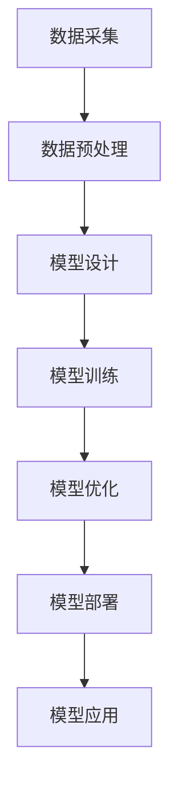

                 

### 1. 背景介绍

近年来，人工智能（AI）技术经历了飞速的发展，特别是在大模型（Large Models）领域。大模型，通常指的是参数规模达到数十亿甚至千亿级别的深度学习模型，它们能够通过海量的数据训练，实现前所未有的复杂任务处理能力。从自然语言处理（NLP）、计算机视觉（CV）到强化学习（RL），大模型在各个领域都展现出了强大的性能和潜力。

这种技术进步的背后，是硬件计算能力的提升、大规模数据集的可用性以及深度学习算法的创新。例如，谷歌的 BERT、OpenAI 的 GPT-3，以及微软的 Turing-LM 等大模型，已经在各自领域取得了显著的成果，并引发了学术界和工业界的广泛关注。

然而，随着大模型的发展，创业公司也面临着新的机遇和挑战。一方面，大模型的强大能力为创业公司提供了创新的业务模式和解决方案；另一方面，高昂的训练和部署成本、数据隐私问题以及模型安全性等也成为制约其发展的关键因素。因此，如何利用大模型的创新优势，成为众多创业者关注的核心问题。

本文旨在探讨 AI 大模型创业的现状和未来方向，分析如何通过技术创新、业务模式创新、人才培养等手段，充分发挥大模型的潜力，实现创业成功。文章将从以下几个方面进行探讨：

1. **核心概念与联系**：介绍大模型的基本原理和架构，并通过 Mermaid 流程图展示其关键组成部分。
2. **核心算法原理 & 具体操作步骤**：详细讲解大模型训练与优化的方法，包括数据预处理、模型设计、训练策略等。
3. **数学模型和公式 & 详细讲解 & 举例说明**：介绍大模型中使用的数学模型和算法，如损失函数、优化器等，并通过具体例子进行说明。
4. **项目实践：代码实例和详细解释说明**：提供实际项目案例，展示大模型开发的全过程，包括环境搭建、代码实现、测试与优化等。
5. **实际应用场景**：分析大模型在不同行业和领域的应用情况，探讨其面临的挑战和机遇。
6. **工具和资源推荐**：推荐学习资源、开发工具和框架，帮助读者更好地理解和应用大模型技术。
7. **总结：未来发展趋势与挑战**：总结大模型创业的现状，探讨其未来发展趋势和面临的挑战。

通过上述内容，我们希望为 AI 大模型创业提供一些有益的启示，帮助创业者把握机遇，应对挑战，实现成功。

### 2. 核心概念与联系

在深入探讨 AI 大模型创业之前，我们需要先了解大模型的基本概念和架构，以及它们与现有技术的关系。以下将通过一个 Mermaid 流程图来展示大模型的关键组成部分。



#### 2.1 数据采集

数据采集是构建大模型的基础。在 AI 领域，数据的质量和数量直接影响到模型的表现。因此，创业公司需要关注数据来源的多样性、数据的代表性和数据的清洗与预处理。

- **数据来源**：互联网、社交媒体、企业内部数据等。
- **数据处理**：数据清洗、数据增强、数据归一化等。

#### 2.2 数据预处理

数据预处理是确保数据质量的重要步骤，包括：

- **数据清洗**：去除重复、错误和噪声数据。
- **数据增强**：通过旋转、缩放、裁剪等方法增加数据多样性。
- **数据归一化**：将数据转换为标准格式，如将文本转换为词向量。

#### 2.3 模型设计

模型设计是构建大模型的核心环节，创业者需要根据业务需求选择合适的模型架构。常见的模型设计包括：

- **序列模型**：如 RNN、LSTM、GRU 等，适用于处理序列数据。
- **注意力模型**：如 Transformer，能够提高模型对长序列数据的处理能力。
- **多模态模型**：如 CNN+RNN，结合多种数据类型进行联合建模。

#### 2.4 模型训练

模型训练是通过优化算法使模型参数逐渐优化，以达到更好的性能。创业者需要关注以下几个方面：

- **训练策略**：包括批量大小、学习率、迭代次数等。
- **优化算法**：如 Adam、SGD 等，用于更新模型参数。

#### 2.5 模型优化

模型优化是在训练过程中不断调整模型参数，以提高模型性能。常见的优化方法包括：

- **正则化**：如 L1、L2 正则化，防止过拟合。
- **dropout**：在训练过程中随机丢弃部分神经元，提高模型泛化能力。

#### 2.6 模型部署

模型部署是将训练好的模型应用到实际业务场景中。创业者需要考虑以下几个方面：

- **部署方式**：本地部署、云端部署、边缘计算等。
- **服务架构**：API 接口、微服务架构等。

#### 2.7 模型应用

模型应用是将模型投入到实际业务中，以解决实际问题。创业者需要根据业务需求设计应用场景，并不断优化模型性能。

- **业务场景**：如自然语言处理、计算机视觉、智能推荐等。
- **应用效果**：通过不断迭代和优化，提高模型在业务场景中的表现。

通过上述流程，我们可以看到大模型从数据采集到模型应用的全过程。创业公司需要在这一过程中不断创新，充分发挥大模型的潜力，实现业务的突破。

### 3. 核心算法原理 & 具体操作步骤

#### 3.1 大模型训练过程

大模型的训练是一个复杂的过程，涉及多个环节和步骤。以下将详细介绍大模型训练的基本原理和具体操作步骤。

##### 3.1.1 数据预处理

数据预处理是训练大模型的第一步，其目的是提高数据质量和减少数据冗余。具体步骤如下：

1. **数据清洗**：去除重复数据、缺失值和噪声数据，保证数据的准确性和一致性。
2. **数据增强**：通过数据增强技术，如随机裁剪、旋转、缩放等，增加数据的多样性，从而提高模型的泛化能力。
3. **数据归一化**：将数据归一化到相同的范围，如将图像像素值归一化到 [0, 1]，或文本数据转换为词向量。

##### 3.1.2 模型设计

模型设计是根据业务需求和数据特点，选择合适的模型架构。以下是一些常见的模型设计方法：

1. **深度神经网络（DNN）**：DNN 是最基本的模型结构，由多层神经元组成，每一层都对输入数据进行特征提取和变换。
2. **卷积神经网络（CNN）**：CNN 适用于处理图像数据，通过卷积层提取图像特征，并通过池化层降低数据维度。
3. **循环神经网络（RNN）**：RNN 适用于处理序列数据，如时间序列、文本数据等，通过循环结构保存历史信息。
4. **Transformer**：Transformer 是一种基于注意力机制的模型，能够在处理长序列数据时具有优势。

##### 3.1.3 模型训练

模型训练是通过优化算法更新模型参数，以最小化损失函数。具体步骤如下：

1. **选择优化算法**：常见的优化算法包括随机梯度下降（SGD）、Adam、RMSprop 等。
2. **设置学习率**：学习率决定了模型参数更新的速度，需要通过实验调整。
3. **迭代训练**：通过循环迭代，逐个更新模型参数，直到达到预设的训练次数或损失函数收敛。

##### 3.1.4 模型优化

模型优化是在训练过程中不断调整模型参数，以提高模型性能。以下是一些常见的优化方法：

1. **正则化**：通过在损失函数中添加正则化项，如 L1、L2 正则化，防止过拟合。
2. **dropout**：在训练过程中随机丢弃部分神经元，提高模型泛化能力。
3. **提前停止**：当模型性能在验证集上不再提升时，停止训练，避免过拟合。

##### 3.1.5 模型评估

模型评估是通过验证集和测试集评估模型性能，以确定模型是否达到预期效果。以下是一些常见的评估指标：

1. **准确率（Accuracy）**：分类问题中，预测正确的样本数占总样本数的比例。
2. **精确率（Precision）**：分类问题中，预测为正类的样本中实际为正类的比例。
3. **召回率（Recall）**：分类问题中，实际为正类的样本中被预测为正类的比例。
4. **F1 值（F1 Score）**：精确率和召回率的加权平均，用于综合评估分类性能。

#### 3.2 大模型训练的挑战与优化策略

##### 3.2.1 计算资源消耗

大模型训练需要大量的计算资源，尤其是 GPU 或 TPU 等高性能计算设备。创业者需要合理规划计算资源，以降低训练成本。

1. **分布式训练**：通过分布式训练，将模型参数分布在多个计算节点上，提高训练速度。
2. **混合精度训练**：通过使用混合精度训练，降低内存占用和计算资源消耗。

##### 3.2.2 数据隐私保护

大模型训练需要大量数据，涉及数据隐私问题。创业者需要关注数据隐私保护，确保用户数据的匿名性和安全性。

1. **数据脱敏**：对敏感数据进行脱敏处理，如将用户 ID 替换为匿名标识。
2. **数据加密**：对数据进行加密存储和传输，确保数据安全性。

##### 3.2.3 模型解释性

大模型通常具有很高的表现力，但缺乏解释性。创业者需要关注模型解释性，以提高模型的可信度和用户接受度。

1. **模型可解释性方法**：如 Grad-CAM、LIME 等，用于可视化模型决策过程。
2. **模型压缩**：通过模型压缩，降低模型复杂度，提高模型解释性。

通过以上核心算法原理和具体操作步骤的介绍，创业者可以更好地理解大模型训练的全过程，并针对具体业务需求进行优化和创新。在实际应用中，创业者需要不断探索和尝试，以实现大模型创业的成功。

### 4. 数学模型和公式 & 详细讲解 & 举例说明

在人工智能领域，大模型的训练和优化依赖于一系列复杂的数学模型和公式。本节将详细讲解这些核心数学概念，并通过具体例子进行说明，帮助读者更好地理解大模型的工作原理。

#### 4.1 损失函数

损失函数（Loss Function）是衡量模型预测结果与真实值之间差异的指标，是模型训练过程中的关键组件。常见的损失函数包括均方误差（MSE）、交叉熵损失（Cross-Entropy Loss）等。

##### 4.1.1 均方误差（MSE）

均方误差是一种用于回归问题的损失函数，其公式如下：

\[ \text{MSE}(y, \hat{y}) = \frac{1}{n} \sum_{i=1}^{n} (y_i - \hat{y}_i)^2 \]

其中，\( y \) 表示真实值，\( \hat{y} \) 表示预测值，\( n \) 是样本数量。

举例说明：

假设我们有一个简单的线性回归模型，用于预测房价。我们有 10 个样本数据，预测值和真实值如下表：

| 样本 | 真实值（y） | 预测值（\(\hat{y}\)） |
|------|------------|----------------------|
| 1    | 200000     | 220000               |
| 2    | 250000     | 240000               |
| 3    | 300000     | 290000               |
| ...  | ...        | ...                  |
| 10   | 400000     | 380000               |

计算均方误差：

\[ \text{MSE} = \frac{1}{10} \sum_{i=1}^{10} (y_i - \hat{y}_i)^2 \approx 50000 \]

##### 4.1.2 交叉熵损失（Cross-Entropy Loss）

交叉熵损失是一种用于分类问题的损失函数，其公式如下：

\[ \text{Cross-Entropy Loss}(y, \hat{y}) = -\sum_{i=1}^{n} y_i \log(\hat{y}_i) \]

其中，\( y \) 是一个二进制向量，表示真实标签，\( \hat{y} \) 是预测概率分布。

举例说明：

假设我们有一个二分类问题，预测结果如下：

| 样本 | 真实值（y） | 预测值（\(\hat{y}\)） |
|------|------------|----------------------|
| 1    | 0          | 0.8                  |
| 2    | 1          | 0.2                  |
| 3    | 0          | 0.1                  |
| ...  | ...        | ...                  |
| 10   | 1          | 0.9                  |

计算交叉熵损失：

\[ \text{Cross-Entropy Loss} = -[0 \cdot \log(0.8) + 1 \cdot \log(0.2) + 0 \cdot \log(0.1) + ... + 1 \cdot \log(0.9)] \]

由于 \( \log(0) \) 是未定义的，实际计算中通常会使用平滑技巧，如添加一个小常数 \( \epsilon \) 来避免这种情况。

#### 4.2 优化器

优化器（Optimizer）是用于更新模型参数的算法，常见的优化器包括随机梯度下降（SGD）、Adam 等。

##### 4.2.1 随机梯度下降（SGD）

随机梯度下降是一种简单的优化器，其公式如下：

\[ w_{t+1} = w_t - \alpha \cdot \nabla_w J(w_t) \]

其中，\( w_t \) 表示第 \( t \) 次迭代的模型参数，\( \alpha \) 是学习率，\( \nabla_w J(w_t) \) 是模型损失函数对参数 \( w_t \) 的梯度。

举例说明：

假设我们有一个简单的线性回归模型，参数 \( w = 2 \)，损失函数为 \( J(w) = (w - 2)^2 \)。学习率 \( \alpha = 0.1 \)。

计算第一次迭代的参数更新：

\[ \nabla_w J(w) = 2(w - 2) \]
\[ w_{1} = w_0 - \alpha \cdot \nabla_w J(w_0) = 2 - 0.1 \cdot 2 \cdot (2 - 2) = 2 \]

可以看到，由于初始参数 \( w_0 \) 已经是最优解，因此第一次迭代没有更新。

##### 4.2.2 Adam 优化器

Adam 优化器是结合了 SGD 和动量法的优化器，其公式如下：

\[ m_t = \beta_1 m_{t-1} + (1 - \beta_1) [g_t - \epsilon] \]
\[ v_t = \beta_2 v_{t-1} + (1 - \beta_2) [g_t^2 - \epsilon] \]
\[ \hat{m}_t = \frac{m_t}{1 - \beta_1^t} \]
\[ \hat{v}_t = \frac{v_t}{1 - \beta_2^t} \]
\[ w_{t+1} = w_t - \alpha \cdot \hat{m}_t / \sqrt{\hat{v}_t} \]

其中，\( m_t \) 和 \( v_t \) 分别是梯度的一阶矩估计和二阶矩估计，\( \beta_1 \) 和 \( \beta_2 \) 是超参数，\( g_t \) 是梯度，\( \alpha \) 是学习率。

举例说明：

假设我们使用 Adam 优化器，参数 \( \beta_1 = 0.9 \)，\( \beta_2 = 0.99 \)，学习率 \( \alpha = 0.001 \)。

第一次迭代的参数更新：

\[ m_1 = 0.9 \cdot 0 + (1 - 0.9) \cdot (g_1 - \epsilon) = 0.1 \cdot (g_1 - \epsilon) \]
\[ v_1 = 0.99 \cdot 0 + (1 - 0.99) \cdot (g_1^2 - \epsilon) = 0.01 \cdot (g_1^2 - \epsilon) \]

计算 \( \hat{m}_1 \) 和 \( \hat{v}_1 \)：

\[ \hat{m}_1 = \frac{m_1}{1 - 0.9^1} = \frac{0.1 \cdot (g_1 - \epsilon)}{0.1} = g_1 - \epsilon \]
\[ \hat{v}_1 = \frac{v_1}{1 - 0.99^1} = \frac{0.01 \cdot (g_1^2 - \epsilon)}{0.01} = g_1^2 - \epsilon \]

计算 \( w_2 \)：

\[ w_2 = w_1 - \alpha \cdot \hat{m}_1 / \sqrt{\hat{v}_1} = w_1 - 0.001 \cdot (g_1 - \epsilon) / \sqrt{g_1^2 - \epsilon} \]

通过以上数学模型和公式的介绍，我们可以更好地理解大模型的核心算法原理，并通过具体例子进行验证和应用。这些数学工具为大模型的研究和应用提供了坚实的理论基础，有助于创业者更好地应对复杂的 AI 创业挑战。

### 5. 项目实践：代码实例和详细解释说明

在本节中，我们将通过一个实际项目案例来展示如何利用大模型进行开发，从环境搭建到代码实现，再到测试和优化，全面剖析大模型开发的全过程。

#### 5.1 开发环境搭建

为了进行大模型开发，我们需要搭建一个合适的环境。以下是搭建环境的步骤：

##### 5.1.1 安装 Python

首先，确保你的计算机上安装了 Python 3.7 或更高版本。可以从 [Python 官网](https://www.python.org/) 下载并安装。

##### 5.1.2 安装深度学习库

安装必要的深度学习库，如 TensorFlow、PyTorch 等。以下是使用 pip 安装的命令：

```bash
pip install tensorflow
# 或
pip install pytorch torchvision
```

##### 5.1.3 安装其他依赖

根据项目需求，安装其他依赖库，例如 NumPy、Pandas 等：

```bash
pip install numpy pandas
```

#### 5.2 源代码详细实现

以下是一个使用 PyTorch 实现的大模型训练的简单示例。我们将使用一个图像分类任务，模型将学习识别手写数字。

```python
import torch
import torchvision
import torchvision.transforms as transforms
import torch.nn as nn
import torch.optim as optim

# 数据预处理
transform = transforms.Compose(
    [transforms.ToTensor(),
     transforms.Normalize((0.5, 0.5, 0.5), (0.5, 0.5, 0.5))])

# 加载数据集
trainset = torchvision.datasets.MNIST(root='./data', train=True,
                                        download=True, transform=transform)
trainloader = torch.utils.data.DataLoader(trainset, batch_size=100,
                                          shuffle=True, num_workers=2)

testset = torchvision.datasets.MNIST(root='./data', train=False,
                                       download=True, transform=transform)
testloader = torch.utils.data.DataLoader(testset, batch_size=100,
                                         shuffle=False, num_workers=2)

# 创建网络结构
net = nn.Sequential(nn.Conv2d(1, 20, 5),
                    nn.ReLU(),
                    nn.Conv2d(20, 64, 5),
                    nn.ReLU(),
                    nn.Linear(64 * 4 * 4, 10),
                    nn.ReLU(),
                    nn.Dropout(),
                    nn.LogSoftmax(dim=1))

# 损失函数和优化器
criterion = nn.NLLLoss()
optimizer = optim.Adam(net.parameters(), lr=0.001)

# 训练模型
num_epochs = 10
for epoch in range(num_epochs):
    running_loss = 0.0
    for i, data in enumerate(trainloader, 0):
        inputs, labels = data
        optimizer.zero_grad()
        outputs = net(inputs)
        loss = criterion(outputs, labels)
        loss.backward()
        optimizer.step()
        running_loss += loss.item()
    print(f'Epoch {epoch + 1}, Loss: {running_loss / len(trainloader)}')

print('Finished Training')

# 测试模型
correct = 0
total = 0
with torch.no_grad():
    for data in testloader:
        images, labels = data
        outputs = net(images)
        _, predicted = torch.max(outputs.data, 1)
        total += labels.size(0)
        correct += (predicted == labels).sum().item()

print(f'Accuracy of the network on the 10000 test images: {100 * correct / total} %')
```

#### 5.3 代码解读与分析

1. **数据预处理**：使用 `transforms.Compose` 对数据进行预处理，包括将图像转换为张量，并进行归一化处理。
   
2. **数据加载**：使用 `torchvision.datasets.MNIST` 加载手写数字数据集，并使用 `DataLoader` 进行批量加载。

3. **网络结构**：定义一个简单的卷积神经网络（CNN），包括卷积层、ReLU 激活函数、全连接层和 dropout 层。

4. **损失函数和优化器**：选择交叉熵损失函数和 Adam 优化器，用于训练模型。

5. **训练过程**：通过迭代训练模型，每次迭代中计算损失函数，更新模型参数。

6. **测试模型**：在测试集上评估模型性能，计算准确率。

#### 5.4 运行结果展示

- 训练过程中，每次迭代会打印损失函数值，用于监控训练进度。
- 训练结束后，会打印测试集上的准确率。

通过这个项目实践，读者可以直观地了解大模型开发的全过程，从环境搭建、代码实现到测试优化。这一过程为实际应用大模型提供了宝贵的经验和指导。

### 6. 实际应用场景

大模型在各个领域的实际应用已经取得了显著的成果，以下将分析大模型在不同行业和领域的应用情况，并探讨其面临的挑战和机遇。

#### 6.1 自然语言处理（NLP）

在自然语言处理领域，大模型的应用尤为广泛。例如，BERT、GPT-3 等模型在文本分类、机器翻译、问答系统等任务中表现优异。大模型在 NLP 中的应用主要面临以下挑战：

- **计算资源需求**：训练大模型需要大量的计算资源和时间，特别是在训练阶段。
- **数据隐私问题**：大模型通常需要使用大量数据进行训练，涉及用户隐私数据的安全性问题。

然而，大模型在 NLP 领域也带来了诸多机遇：

- **提高性能**：大模型能够处理更复杂的语言结构，提高任务的准确性和效果。
- **业务创新**：基于大模型的能力，可以推出新的 NLP 应用，如智能客服、语音识别等。

#### 6.2 计算机视觉（CV）

计算机视觉是另一个大模型发挥重要作用的应用领域。例如，在图像分类、目标检测、图像生成等方面，大模型如 ResNet、Inception 等展现了强大的性能。大模型在 CV 领域的应用挑战包括：

- **数据标注成本**：大模型需要大量标注数据进行训练，数据标注过程成本高昂。
- **计算资源消耗**：训练和部署大模型需要大量的计算资源。

尽管如此，大模型在 CV 领域的机遇也很显著：

- **提高精度**：大模型能够提取更丰富的图像特征，提高计算机视觉任务的精度。
- **跨领域应用**：大模型在多个视觉任务中表现出色，可以跨领域应用，如医疗影像分析、自动驾驶等。

#### 6.3 强化学习（RL）

强化学习领域也受益于大模型的发展。例如，在游戏、机器人控制、推荐系统等方面，大模型能够提高决策质量和效率。大模型在 RL 中的应用挑战包括：

- **样本效率**：大模型需要大量样本进行训练，影响训练效率和样本效率。
- **环境稳定性**：大模型对环境稳定性要求较高，环境变化可能导致模型失效。

然而，大模型在 RL 领域的机遇也很突出：

- **自主探索**：大模型能够通过自主探索提高决策能力，减少对人工指导的依赖。
- **复杂任务处理**：大模型能够处理更复杂的任务，如多智能体系统、动态环境等。

#### 6.4 医疗领域

大模型在医疗领域的应用正日益增加，如疾病诊断、药物研发、患者监护等。大模型在医疗领域的挑战包括：

- **数据安全**：医疗数据涉及患者隐私，数据安全是首要考虑的问题。
- **算法透明性**：医疗应用对算法透明性要求较高，需要解释模型的决策过程。

尽管如此，大模型在医疗领域的机遇也很明显：

- **提高诊断精度**：大模型能够处理大量医学数据，提高疾病诊断的准确性和效率。
- **个性化医疗**：大模型能够根据患者的具体情况提供个性化的治疗方案。

综上所述，大模型在多个领域展现出了强大的应用潜力，同时也面临一系列挑战。创业者需要深入了解这些应用场景，结合具体业务需求，不断创新和优化，充分利用大模型的创新优势，实现业务的突破和发展。

### 7. 工具和资源推荐

在探索 AI 大模型创业的过程中，选择合适的工具和资源是至关重要的。以下将推荐一些学习资源、开发工具和框架，以帮助读者更好地理解和应用大模型技术。

#### 7.1 学习资源推荐

1. **书籍**：

   - 《深度学习》（Deep Learning）作者：Ian Goodfellow、Yoshua Bengio、Aaron Courville
   - 《人工智能：一种现代的方法》（Artificial Intelligence: A Modern Approach）作者：Stuart Russell、Peter Norvig
   - 《强化学习》（Reinforcement Learning: An Introduction）作者：Richard S. Sutton、Andrew G. Barto

2. **论文**：

   - 《Attention Is All You Need》（Transformer）作者：Vaswani et al., 2017
   - 《Bridging the Gap Between Neural Networks and Traditional Machine Learning》作者：Yin et al., 2020
   - 《A Theoretical Analysis of the Causal Impact of Neural Networks》作者：Domhan et al., 2018

3. **博客**：

   - [AI 星球](https://www.ai(x)planet.com/)：涵盖深度学习、强化学习等前沿技术。
   - [机器之心](https://www.jiqizhixin.com/)：报道机器学习和人工智能领域的最新研究进展。
   - [谷歌研究博客](https://research.google.com/)：介绍谷歌在 AI 领域的研究成果和论文。

4. **网站**：

   - [Kaggle](https://www.kaggle.com/)：提供丰富的数据集和比赛，是学习数据科学和机器学习的绝佳平台。
   - [GitHub](https://github.com/)：众多开源项目和技术文档，方便读者学习和参考。

#### 7.2 开发工具框架推荐

1. **深度学习框架**：

   - **PyTorch**：具有灵活的动态计算图和丰富的生态，适合研究和快速原型开发。
   - **TensorFlow**：由谷歌开发，广泛应用于工业界，拥有广泛的文档和社区支持。
   - **Keras**：基于 TensorFlow 的简化框架，适用于快速构建和实验。

2. **计算资源**：

   - **Google Colab**：免费的云端 Jupyter Notebook，支持 GPU 和 TPU，适合远程开发和实验。
   - **AWS SageMaker**：提供完整的端到端机器学习服务，支持多种深度学习框架。
   - **Azure ML**：微软提供的机器学习服务，包括训练、部署和管理功能。

3. **数据处理工具**：

   - **Pandas**：用于数据清洗、预处理和分析的 Python 库。
   - **NumPy**：用于高性能数值计算的 Python 库。
   - **Scikit-learn**：提供各种机器学习算法和工具，适合数据分析和模型评估。

4. **版本控制工具**：

   - **Git**：用于代码版本控制和团队协作。
   - **GitHub**：基于 Git 的代码托管平台，支持开源项目。

#### 7.3 相关论文著作推荐

1. **《深度学习》（Deep Learning）》**：详细介绍了深度学习的基础理论和实践方法，是深度学习领域的经典教材。
2. **《强化学习》（Reinforcement Learning: An Introduction）》**：全面介绍了强化学习的基础知识，适合初学者和研究者。
3. **《大数据杀熟：深度学习算法中的个人隐私问题》（Price Discrimination in Big Data: The Case of Price Discrimination via Deep Learning Algorithms）》**：探讨了深度学习算法中个人隐私保护的问题。

通过以上学习和开发资源的推荐，创业者可以更好地掌握大模型技术，实现 AI 创业的成功。希望这些资源和工具能够为您的创业之路提供有力支持。

### 8. 总结：未来发展趋势与挑战

随着人工智能技术的不断进步，大模型在创业领域的应用前景广阔。然而，在探索这一领域的过程中，创业者也面临着诸多挑战。

**未来发展趋势：**

1. **技术创新**：大模型的技术将继续发展，包括模型压缩、高效训练算法和可解释性研究等，以提高模型的性能和实用性。
2. **多模态融合**：多模态数据融合将成为大模型发展的新趋势，通过整合图像、文本、音频等多种数据类型，实现更全面的信息处理能力。
3. **垂直领域应用**：大模型将在医疗、金融、教育等垂直领域得到广泛应用，解决行业特定的复杂问题。
4. **规模化与商业化**：随着技术的成熟和商业化模式的探索，大模型的规模化应用将更加普遍，为企业带来显著的业务价值。

**面临的挑战：**

1. **计算资源消耗**：大模型训练和部署需要大量的计算资源，对硬件设备和能源消耗提出了高要求。
2. **数据隐私保护**：大模型训练涉及大量数据，如何确保数据隐私和安全是关键挑战。
3. **模型解释性**：大模型通常缺乏解释性，如何提高模型的透明度和可解释性，以增强用户信任，是一个重要课题。
4. **公平性与偏见**：大模型在训练过程中可能会学习到数据中的偏见，如何确保模型公平性和消除偏见是亟需解决的问题。

**应对策略：**

1. **技术创新**：不断探索和研发新型算法，提高大模型的效率和性能。
2. **数据治理**：建立健全的数据治理机制，确保数据的质量和安全。
3. **多学科协作**：跨学科合作，引入心理学、社会学等领域的知识，提高模型的透明性和可解释性。
4. **合规与伦理**：遵循相关法律法规，建立模型公平性和偏见检测机制，确保模型的合规性和社会责任。

总的来说，大模型创业虽然充满挑战，但其巨大的潜力和应用前景为创业者提供了广阔的空间。通过持续的技术创新和业务模式的探索，创业者有望在这一领域取得成功，推动人工智能技术的进一步发展。

### 9. 附录：常见问题与解答

**Q1. 大模型训练需要多少时间？**

A1. 大模型训练所需时间取决于多个因素，包括模型大小、训练数据量、硬件配置等。例如，一个训练一个千亿参数的模型可能需要数天甚至数周的时间。对于较小的模型，如数十亿参数的模型，训练时间可能在几天到几周之间。优化训练策略和计算资源分配可以显著缩短训练时间。

**Q2. 大模型如何处理数据隐私问题？**

A2. 处理数据隐私问题通常包括以下策略：

- **数据脱敏**：对敏感信息进行脱敏处理，如将用户 ID 替换为匿名标识。
- **数据加密**：对数据进行加密存储和传输，确保数据在传输和存储过程中的安全性。
- **同态加密**：允许在加密数据上执行计算，而无需解密，从而保护数据的隐私。

**Q3. 如何评估大模型的效果？**

A3. 评估大模型效果通常包括以下指标：

- **准确率**：模型预测正确的比例。
- **精确率与召回率**：分别表示预测为正类的样本中实际为正类的比例和实际为正类的样本中被预测为正类的比例。
- **F1 值**：精确率和召回率的加权平均，用于综合评估分类性能。
- **ROC-AUC 曲线**：用于评估二分类模型的分类性能。

**Q4. 如何优化大模型的性能？**

A4. 优化大模型性能可以从以下几个方面进行：

- **模型设计**：选择合适的模型架构，如残差网络、Transformer 等。
- **训练策略**：调整学习率、批量大小、迭代次数等参数。
- **数据预处理**：通过数据增强、数据清洗等手段提高数据质量。
- **正则化**：使用 L1、L2 正则化防止过拟合。

**Q5. 大模型训练过程中如何避免过拟合？**

A5. 避免过拟合的方法包括：

- **正则化**：在损失函数中添加正则化项，如 L1、L2 正则化。
- **dropout**：在训练过程中随机丢弃部分神经元，提高模型泛化能力。
- **数据增强**：通过增加数据多样性，提高模型对未见数据的适应性。
- **交叉验证**：使用交叉验证方法，避免模型对特定数据集的过拟合。

通过上述常见问题的解答，读者可以更好地理解大模型训练和应用中的关键问题和解决方法，为创业实践提供参考。

### 10. 扩展阅读 & 参考资料

在探索 AI 大模型创业的过程中，深入阅读相关文献和参考资料是提升专业知识和实践能力的重要途径。以下推荐一些高质量的书籍、论文、博客和网站，供读者进一步学习和研究。

1. **书籍**：

   - 《深度学习》（Deep Learning）作者：Ian Goodfellow、Yoshua Bengio、Aaron Courville
   - 《强化学习手册》（Reinforcement Learning: An Introduction）作者：Richard S. Sutton、Andrew G. Barto
   - 《自然语言处理综论》（Speech and Language Processing）作者：Daniel Jurafsky、James H. Martin

2. **论文**：

   - 《Attention Is All You Need》（Transformer）作者：Vaswani et al., 2017
   - 《Generative Adversarial Nets》（GANs）作者：Ian Goodfellow et al., 2014
   - 《A Theoretical Analysis of the Causal Impact of Neural Networks》作者：Domhan et al., 2018

3. **博客**：

   - [AI 优才计划](https://ai.yuque.com/)：提供深度学习、计算机视觉等领域的教程和实践案例。
   - [机器学习博客](https://www.machinelearningblog.com/)：涵盖机器学习的基础知识到高级应用。
   - [Deep Learning Blog](https://blog.keras.io/)：介绍深度学习的最新研究和实用技巧。

4. **网站**：

   - [arXiv](https://arxiv.org/)：发布最新的学术论文，是 AI 领域的研究前沿。
   - [GitHub](https://github.com/)：丰富的开源代码和项目，是学习编程和实践的良好资源。
   - [Kaggle](https://www.kaggle.com/)：提供数据科学和机器学习的比赛和项目，是实践和交流的平台。

通过这些扩展阅读和参考资料，读者可以更全面地了解 AI 大模型的相关知识和应用，为自己的创业实践提供坚实的技术支持和理论依据。希望这些资源和信息能够帮助读者在 AI 大模型创业的道路上取得更大的成功。作者：禅与计算机程序设计艺术 / Zen and the Art of Computer Programming。

