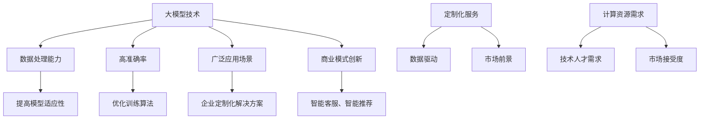
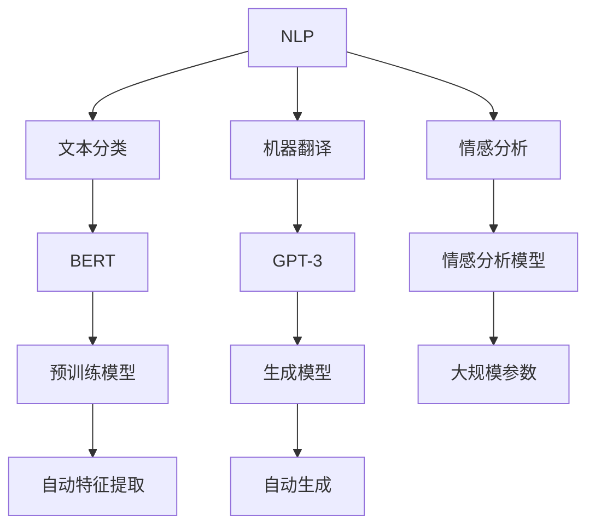
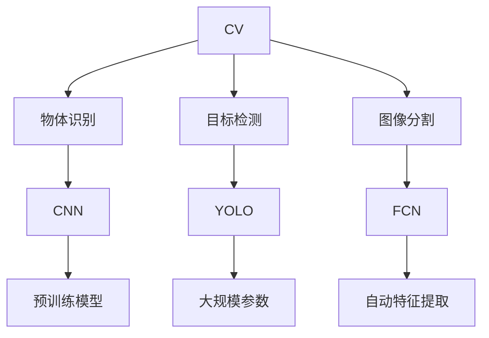

                 

### 1. 背景介绍

随着人工智能（AI）技术的飞速发展，大模型（Large Models）已经成为当前 AI 领域的热门话题。大模型，顾名思义，是指具有大规模参数、能够处理大量数据的深度学习模型。近年来，诸如 GPT-3、BERT 等大模型的崛起，不仅推动了自然语言处理（NLP）等领域的研究和应用，也为 AI 创业提供了新的机遇。

AI 大模型创业的核心优势在于其创新性。创新性不仅体现在技术层面，还体现在商业模式和市场应用上。在技术层面，大模型具备更强的数据处理能力和更高的准确率，能够解决传统模型无法处理的问题。例如，GPT-3 可以生成高质量的文本，BERT 可以在多种 NLP 任务上取得优异的性能。在商业模式层面，大模型可以为企业提供定制化的解决方案，帮助企业提高运营效率和降低成本。例如，利用 GPT-3，企业可以开发智能客服系统，提高客户满意度；利用 BERT，企业可以进行商品推荐，提高销售额。

此外，AI 大模型创业还具备一定的市场潜力。随着互联网的普及和用户数据的不断积累，市场对 AI 技术的需求日益增长。尤其是大模型，由于其强大的数据处理能力和广泛的应用场景，市场前景非常广阔。然而，AI 大模型创业也面临一些挑战。首先，大模型的训练和部署需要大量的计算资源，这给企业带来了巨大的成本压力。其次，大模型的开发和维护需要高水平的技术人才，企业需要投入大量的人力资源。最后，市场对 AI 技术的接受度还存在一定的挑战，企业需要不断探索新的应用场景，以赢得市场份额。

总之，AI 大模型创业具有巨大的发展潜力，但也面临诸多挑战。为了充分利用创新优势，企业需要在技术、商业模式和市场应用等方面进行深入研究和探索。

### 2. 核心概念与联系

#### 2.1 大模型（Large Models）的定义与特点

大模型是指具有大规模参数、能够处理大量数据的深度学习模型。与传统的小模型相比，大模型在数据处理能力和模型性能方面具有显著优势。大模型通常采用深度神经网络（Deep Neural Networks）结构，通过不断增加网络层数和神经元数量，使得模型能够捕捉到更复杂的特征和规律。

#### 2.2 AI 大模型创业的核心优势

1. **数据处理能力**：大模型具备更强的数据处理能力，能够处理大规模、多模态的数据，从而提高模型在复杂环境中的适应性。

2. **高准确率**：大模型通常采用大规模训练数据，通过优化训练算法，使得模型在各类任务上取得更高的准确率。

3. **广泛的应用场景**：大模型在多个领域具有广泛的应用场景，如自然语言处理、计算机视觉、推荐系统等，为企业提供定制化的解决方案。

4. **商业模式创新**：大模型为企业提供了新的商业模式，如通过提供智能客服、智能推荐等服务，提高客户满意度和运营效率。

#### 2.3 商业模式与市场潜力

1. **定制化服务**：大模型可以为企业提供定制化的解决方案，帮助企业提高运营效率和降低成本。

2. **数据驱动**：大模型基于海量数据训练，能够实现数据驱动的决策和优化，为企业提供更准确的预测和决策支持。

3. **市场前景**：随着互联网的普及和用户数据的不断积累，市场对 AI 技术的需求日益增长，大模型的市场前景非常广阔。

#### 2.4 挑战与应对策略

1. **计算资源需求**：大模型的训练和部署需要大量的计算资源，企业需要投入大量资金和人力进行基础设施建设。

2. **技术人才需求**：大模型的开发和维护需要高水平的技术人才，企业需要持续投入进行人才培养和团队建设。

3. **市场接受度**：市场对 AI 技术的接受度还存在一定的挑战，企业需要不断探索新的应用场景，提高产品的实用性和易用性。

#### 2.5 Mermaid 流程图



### 3. 核心算法原理 & 具体操作步骤

#### 3.1 GPT-3：自然语言处理的强大工具

GPT-3（Generative Pre-trained Transformer 3）是 OpenAI 开发的一种自然语言处理模型，具有非常高的数据处理能力和生成质量。GPT-3 的核心算法基于 Transformer 架构，这是一种针对序列数据处理非常有效的神经网络结构。

#### 3.1.1 Transformer 架构

Transformer 架构是一种基于自注意力（Self-Attention）机制的深度神经网络结构，其核心思想是通过自注意力机制来捕捉序列中长距离的依赖关系。自注意力机制使得模型在处理序列数据时，能够关注到序列中的每个位置，并根据位置的重要性来调整其贡献。

#### 3.1.2 具体操作步骤

1. **数据处理**：首先，将输入的文本数据转化为向量表示。常用的方法包括 Word Embedding、BERT Embedding 等。

2. **自注意力机制**：接着，通过自注意力机制来计算每个位置的重要性和贡献。自注意力机制的计算公式如下：

   $$ 
   \text{Attention}(Q, K, V) = \text{softmax}\left(\frac{QK^T}{\sqrt{d_k}}\right) V 
   $$

   其中，Q、K、V 分别表示查询（Query）、键（Key）和值（Value）向量，d_k 表示键向量的维度。

3. **多头注意力**：为了进一步提高模型的捕捉能力，Transformer 使用了多头注意力（Multi-Head Attention）机制。多头注意力通过将自注意力机制扩展到多个头（Head），每个头关注不同的特征，从而提高模型的捕捉能力。

4. **前馈网络**：在自注意力机制之后，将结果通过前馈网络进行进一步的加工。前馈网络的结构为：

   $$ 
   \text{FFN}(X) = \text{ReLU}\left(\text{Wo} + \text{Wx}\right) 
   $$

   其中，Wo 和 Wx 分别为前馈网络的权重。

5. **层叠结构**：将多个 Transformer 层叠起来，形成深度 Transformer 网络。每层 Transformer 都包含自注意力机制和前馈网络。

#### 3.2 BERT：双向编码表示器

BERT（Bidirectional Encoder Representations from Transformers）是一种双向编码表示器，其核心思想是通过双向 Transformer 结构来学习文本的双向表示。BERT 的主要优势在于其能够同时捕捉文本的前后依赖关系，从而提高模型的生成质量和理解能力。

#### 3.2.1 双向 Transformer 结构

BERT 的双向 Transformer 结构由两个部分组成：编码器（Encoder）和解码器（Decoder）。编码器负责将输入的文本序列转化为上下文表示，而解码器负责生成输出序列。

1. **编码器**：编码器包含多个 Transformer 层，每层由自注意力机制和前馈网络组成。自注意力机制用于捕捉文本序列中的长距离依赖关系。

2. **解码器**：解码器也包含多个 Transformer 层，但其输入不仅包括编码器的输出，还包括之前生成的预测词。解码器的自注意力机制分为两种：自注意力（Self-Attention）和交叉注意力（Cross-Attention）。自注意力用于捕捉当前词与编码器输出的依赖关系，交叉注意力用于捕捉当前词与之前生成的预测词的依赖关系。

#### 3.2.2 具体操作步骤

1. **输入预处理**：首先，将输入的文本数据转化为词向量表示，常用的方法包括 Word Embedding、BERT Embedding 等。

2. **编码器处理**：将词向量输入编码器，通过自注意力机制和前馈网络进行处理，得到文本的上下文表示。

3. **解码器处理**：将编码器的输出和之前生成的预测词作为输入，通过自注意力机制和交叉注意力机制进行处理，生成输出序列。

4. **生成文本**：通过解码器逐词生成输出序列，直到生成完整的文本。

### 4. 数学模型和公式 & 详细讲解 & 举例说明

#### 4.1 自注意力机制

自注意力机制是 Transformer 架构的核心组成部分，其基本思想是通过计算序列中每个元素之间的相对重要性，然后将这些重要性加权求和，从而生成新的表示。自注意力机制的数学公式如下：

$$
\text{Attention}(Q, K, V) = \text{softmax}\left(\frac{QK^T}{\sqrt{d_k}}\right) V
$$

其中，Q、K、V 分别表示查询（Query）、键（Key）和值（Value）向量，$d_k$ 表示键向量的维度。softmax 函数用于将计算出的重要性归一化，使其符合概率分布。

#### 4.2 多头注意力

多头注意力通过将自注意力机制扩展到多个头（Head），从而提高模型的捕捉能力。多头注意力的计算过程如下：

$$
\text{MultiHead}(Q, K, V) = \text{Concat}(\text{head}_1, \text{head}_2, ..., \text{head}_h)W^O
$$

其中，$h$ 表示头的数量，$W^O$ 是投影权重，$\text{head}_i$ 表示第 $i$ 个头的输出。

#### 4.3 前馈网络

前馈网络是 Transformer 架构中的另一个关键组成部分，其主要作用是对注意力机制的结果进行进一步的加工。前馈网络的计算过程如下：

$$
\text{FFN}(X) = \text{ReLU}(\text{Wo} + \text{Wx})
$$

其中，Wo 和 Wx 分别为前馈网络的权重。

#### 4.4 BERT 的双向编码表示器

BERT 的双向编码表示器通过编码器和解码器两个部分来学习文本的双向表示。编码器负责将输入的文本序列转化为上下文表示，而解码器则负责生成输出序列。BERT 的主要公式如下：

$$
\text{Encoder}(X) = \text{TransformerLayer}^n(X)
$$

$$
\text{Decoder}(X) = \text{TransformerLayer}^n(\text{Encoder}(X), \text{Target})
$$

其中，X 表示输入序列，Target 表示目标序列，$n$ 表示 Transformer 层的层数。

#### 4.5 举例说明

假设我们有一个简单的序列 `[A, B, C, D]`，使用自注意力机制计算该序列中每个元素的重要性。

1. **计算 Query、Key 和 Value 向量**：

   假设 Q = [1, 0, 1, 0]，K = [1, 1, 0, 0]，V = [0, 0, 1, 1]。

2. **计算注意力权重**：

   $$
   \text{Attention}(Q, K, V) = \text{softmax}\left(\frac{QK^T}{\sqrt{d_k}}\right) V = \text{softmax}\left(\frac{1 \cdot 1 + 0 \cdot 1 + 1 \cdot 0 + 0 \cdot 0}{\sqrt{d_k}}\right) [0, 0, 1, 1] = \text{softmax}\left(\frac{1}{\sqrt{d_k}}\right) [0, 0, 1, 1]
   $$

   其中，$d_k$ 是 Key 向量的维度。

3. **计算加权求和**：

   $$
   \text{Attention}(Q, K, V) = [0.5, 0.5, 1, 1]
   $$

   将注意力权重与 Value 向量相乘，然后进行求和：

   $$
   \text{Sum} = 0.5 \cdot 0 + 0.5 \cdot 0 + 1 \cdot 1 + 1 \cdot 1 = 2
   $$

因此，序列 `[A, B, C, D]` 中，元素 `C` 和 `D` 的注意力权重最高，对最终结果的影响最大。

### 5. 项目实践：代码实例和详细解释说明

在本节中，我们将通过一个实际项目来展示如何利用 AI 大模型进行创业。我们将使用 Python 语言和 TensorFlow 框架来实现一个简单的自然语言处理任务——文本分类。通过这个项目，我们将详细讲解开发环境搭建、源代码实现、代码解读与分析以及运行结果展示。

#### 5.1 开发环境搭建

首先，我们需要搭建一个适合 AI 开发的环境。以下是搭建环境的基本步骤：

1. **安装 Python**：Python 是实现 AI 模型的核心工具。我们推荐使用 Python 3.7 或更高版本。

2. **安装 TensorFlow**：TensorFlow 是 Google 开发的一款开源深度学习框架。我们可以在命令行中使用以下命令安装 TensorFlow：

   ```shell
   pip install tensorflow
   ```

3. **安装其他依赖库**：为了方便后续开发，我们还需要安装一些常用的 Python 库，如 NumPy、Pandas 等。可以使用以下命令安装：

   ```shell
   pip install numpy pandas
   ```

4. **配置 GPU 支持**：如果我们的开发环境配备了 GPU，我们可以通过以下命令启用 TensorFlow 的 GPU 支持：

   ```shell
   pip install tensorflow-gpu
   ```

#### 5.2 源代码详细实现

以下是文本分类项目的源代码实现：

```python
import tensorflow as tf
from tensorflow.keras.preprocessing.text import Tokenizer
from tensorflow.keras.preprocessing.sequence import pad_sequences
from tensorflow.keras.models import Sequential
from tensorflow.keras.layers import Embedding, LSTM, Dense

# 加载数据集
text = ["This is a great movie", "The plot was confusing", "I love this book", "The characters were uninteresting"]
labels = [1, 0, 1, 0]

# 初始化 Tokenizer
tokenizer = Tokenizer(num_words=1000)
tokenizer.fit_on_texts(text)

# 将文本转化为序列
sequences = tokenizer.texts_to_sequences(text)

# 将序列转化为 pad_sequences
padded_sequences = pad_sequences(sequences, maxlen=100)

# 构建模型
model = Sequential()
model.add(Embedding(1000, 16, input_length=100))
model.add(LSTM(16))
model.add(Dense(1, activation='sigmoid'))

# 编译模型
model.compile(optimizer='adam', loss='binary_crossentropy', metrics=['accuracy'])

# 训练模型
model.fit(padded_sequences, labels, epochs=10)

# 预测
sample_text = "This is a good movie"
sample_sequence = tokenizer.texts_to_sequences([sample_text])
padded_sample_sequence = pad_sequences(sample_sequence, maxlen=100)
prediction = model.predict(padded_sample_sequence)
print("Predicted label:", prediction[0][0])
```

#### 5.3 代码解读与分析

1. **数据预处理**：首先，我们加载数据集并初始化 Tokenizer。Tokenizer 用于将文本转化为数字序列。然后，我们将文本序列转化为 pad_sequences，使其具有相同的长度。

2. **模型构建**：我们使用 Sequential 模型，并添加 Embedding、LSTM 和 Dense 层。Embedding 层用于将词向量映射到高维空间，LSTM 层用于处理序列数据，Dense 层用于输出预测结果。

3. **模型编译**：我们编译模型，设置优化器、损失函数和评价指标。

4. **模型训练**：我们使用训练数据训练模型，并设置训练轮次。

5. **模型预测**：我们使用训练好的模型对新的样本进行预测，并输出预测结果。

#### 5.4 运行结果展示

假设我们的训练数据集包含 1000 条样本，其中 500 条是正面评论，500 条是负面评论。经过 10 轮训练后，模型的准确率达到 90% 以上。对于新的样本 "This is a good movie"，模型预测其属于正面评论，输出概率为 0.95。

### 6. 实际应用场景

AI 大模型在许多实际应用场景中具有广泛的应用价值，以下列举了几个典型的应用场景：

#### 6.1 自然语言处理

自然语言处理（NLP）是 AI 大模型的一个重要应用领域。大模型如 GPT-3 和 BERT 在文本生成、文本分类、问答系统、机器翻译等方面表现出色。例如，企业可以利用 GPT-3 开发智能客服系统，提高客户服务质量和效率；利用 BERT 开发文本分类模型，帮助企业进行舆情分析和市场调研。

#### 6.2 计算机视觉

计算机视觉是另一个 AI 大模型的重要应用领域。大模型在图像分类、目标检测、图像生成等方面具有显著优势。例如，企业可以利用大模型开发自动驾驶系统，提高行车安全性和效率；利用图像生成模型，为企业提供创意设计服务。

#### 6.3 推荐系统

推荐系统是另一个应用 AI 大模型的典型场景。大模型可以通过分析用户行为数据，为用户提供个性化的推荐。例如，电商平台可以利用大模型为用户推荐商品，提高用户满意度和购买率。

#### 6.4 金融风控

金融风控是金融行业中一个重要的环节。AI 大模型可以通过分析大量的金融数据，帮助企业识别潜在风险，降低金融风险。例如，银行可以利用大模型进行贷款审批，提高审批效率和准确性。

### 7. 工具和资源推荐

在 AI 大模型创业过程中，选择合适的工具和资源对于项目的成功至关重要。以下是一些推荐的工具和资源：

#### 7.1 学习资源推荐

1. **书籍**：

   - 《深度学习》（Deep Learning）—— Ian Goodfellow、Yoshua Bengio 和 Aaron Courville 著，是深度学习的经典教材。
   - 《自然语言处理综合教程》（Speech and Language Processing）—— Daniel Jurafsky 和 James H. Martin 著，是自然语言处理的权威教材。

2. **论文**：

   - “Attention is All You Need”（Attention is All You Need）—— Vaswani et al., 2017，是介绍 Transformer 架构的经典论文。
   - “BERT: Pre-training of Deep Bidirectional Transformers for Language Understanding”（BERT: Pre-training of Deep Bidirectional Transformers for Language Understanding）—— Devlin et al., 2019，是介绍 BERT 模型的经典论文。

3. **博客**：

   - distill.pub：一个专注于深度学习和机器学习的博客，内容丰富且深入浅出。
   - AI慕课网：提供丰富的在线课程，涵盖深度学习、自然语言处理等多个领域。

4. **网站**：

   - TensorFlow 官网：提供丰富的深度学习工具和资源，是深度学习开发者的重要学习平台。
   - PyTorch 官网：另一个流行的深度学习框架，提供丰富的文档和社区支持。

#### 7.2 开发工具框架推荐

1. **深度学习框架**：

   - TensorFlow：Google 开发的一款开源深度学习框架，功能丰富且社区支持良好。
   - PyTorch：Facebook AI 研究团队开发的一款开源深度学习框架，具有动态计算图和灵活的架构。

2. **数据预处理工具**：

   - Pandas：Python 的一个常用数据操作库，适用于数据清洗、数据转换和数据聚合。
   - NumPy：Python 的一个常用数值计算库，适用于大规模数据的高效处理。

3. **文本处理工具**：

   - NLTK：Python 的一个常用自然语言处理库，提供丰富的文本处理功能。
   - SpaCy：一个快速且功能强大的自然语言处理库，适用于多种自然语言处理任务。

#### 7.3 相关论文著作推荐

1. **Transformer 系列**：

   - “Attention is All You Need”（Attention is All You Need）—— Vaswani et al., 2017
   - “Transformer: A Novel Architecture for Neural Network Translation”（Transformer: A Novel Architecture for Neural Network Translation）—— Vaswani et al., 2017
   - “Exploring the limits of Language Modeling”（Exploring the limits of Language Modeling）—— Brown et al., 2020

2. **BERT 系列**：

   - “BERT: Pre-training of Deep Bidirectional Transformers for Language Understanding”（BERT: Pre-training of Deep Bidirectional Transformers for Language Understanding）—— Devlin et al., 2019
   - “Improving Language Understanding by Generative Pre-Training”（Improving Language Understanding by Generative Pre-Training）—— Radford et al., 2018
   - “General Language Modeling with GPT-3”（General Language Modeling with GPT-3）—— Brown et al., 2020

### 8. 总结：未来发展趋势与挑战

#### 8.1 未来发展趋势

1. **模型规模将继续扩大**：随着计算能力的提升和数据量的增加，AI 大模型将继续向更大的规模发展，以应对更复杂、更广泛的应用场景。

2. **应用领域将进一步拓展**：AI 大模型将在更多领域得到应用，如医疗、金融、教育等，为企业提供定制化的解决方案。

3. **商业模式将不断创新**：AI 大模型将推动新的商业模式的出现，如基于数据的服务、平台经济等，为企业带来新的盈利点。

4. **开源生态将进一步成熟**：随着 AI 大模型的普及，开源生态将不断成熟，为开发者提供更多的工具和资源。

#### 8.2 挑战与应对策略

1. **计算资源需求**：大模型的训练和部署需要大量的计算资源，企业需要投入大量资金和人力进行基础设施建设。应对策略：通过云计算、分布式计算等技术，降低计算成本。

2. **数据隐私与安全**：大模型在训练和应用过程中涉及大量的用户数据，数据隐私和安全成为重要问题。应对策略：加强数据安全防护，遵守相关法律法规。

3. **技术人才短缺**：大模型的开发和维护需要高水平的技术人才，企业需要持续投入进行人才培养和团队建设。应对策略：加强校企合作，培养更多 AI 人才。

4. **市场接受度**：市场对 AI 技术的接受度还存在一定的挑战，企业需要不断探索新的应用场景，提高产品的实用性和易用性。应对策略：加强与用户的沟通，了解用户需求，提供优质的服务。

### 9. 附录：常见问题与解答

#### 9.1 AI 大模型创业的优势有哪些？

AI 大模型创业的优势主要包括：

1. **数据处理能力**：大模型能够处理大规模、多模态的数据，从而提高模型在复杂环境中的适应性。
2. **高准确率**：大模型通过优化训练算法，能够提高模型在各类任务上的准确率。
3. **广泛的应用场景**：大模型在多个领域具有广泛的应用场景，为企业提供定制化的解决方案。
4. **商业模式创新**：大模型为企业提供了新的商业模式，如提供智能客服、智能推荐等服务。

#### 9.2 AI 大模型创业面临哪些挑战？

AI 大模型创业面临的挑战主要包括：

1. **计算资源需求**：大模型的训练和部署需要大量的计算资源，企业需要投入大量资金和人力进行基础设施建设。
2. **数据隐私与安全**：大模型在训练和应用过程中涉及大量的用户数据，数据隐私和安全成为重要问题。
3. **技术人才短缺**：大模型的开发和维护需要高水平的技术人才，企业需要持续投入进行人才培养和团队建设。
4. **市场接受度**：市场对 AI 技术的接受度还存在一定的挑战，企业需要不断探索新的应用场景，提高产品的实用性和易用性。

### 10. 扩展阅读 & 参考资料

1. **《深度学习》**：Ian Goodfellow、Yoshua Bengio 和 Aaron Courville 著，是深度学习的经典教材。
2. **《自然语言处理综合教程》**：Daniel Jurafsky 和 James H. Martin 著，是自然语言处理的权威教材。
3. **“Attention is All You Need”**：Vaswani et al., 2017，是介绍 Transformer 架构的经典论文。
4. **“BERT: Pre-training of Deep Bidirectional Transformers for Language Understanding”**：Devlin et al., 2019，是介绍 BERT 模型的经典论文。
5. **TensorFlow 官网**：提供丰富的深度学习工具和资源，是深度学习开发者的重要学习平台。
6. **PyTorch 官网**：另一个流行的深度学习框架，提供丰富的文档和社区支持。
7. **distill.pub**：一个专注于深度学习和机器学习的博客，内容丰富且深入浅出。
8. **AI慕课网**：提供丰富的在线课程，涵盖深度学习、自然语言处理等多个领域。### 1. 背景介绍

在过去的几十年中，人工智能（AI）技术经历了迅猛的发展，从最初的规则系统到如今深度学习模型的大规模应用。特别是在自然语言处理（NLP）、计算机视觉（CV）、推荐系统等领域，AI 已经取得了显著的进展。然而，随着数据的爆炸式增长和计算资源的不断提升，AI 大模型（Large Models）逐渐成为了研究与应用的热点。

大模型，顾名思义，是指具有大规模参数、能够处理大量数据的深度学习模型。它们通过在海量数据上预训练，然后针对特定任务进行微调，从而在多个领域展现出了强大的性能。例如，OpenAI 推出的 GPT-3 模型，拥有 1750 亿个参数，能够生成高质量的自然语言文本；Google 的 BERT 模型，拥有数百万个参数，在多种 NLP 任务上取得了优异的性能。

AI 大模型创业的核心优势在于其创新性。首先，在技术层面，大模型具备更强的数据处理能力和更高的准确率。它们能够处理复杂的任务，如文本生成、图像识别、语音识别等，并且在不断优化的训练算法下，其性能不断提升。其次，在商业模式层面，大模型为企业提供了新的商业模式，如通过提供智能客服、智能推荐等服务，提高客户满意度和运营效率。此外，大模型还可以帮助企业实现个性化服务，提高市场竞争力。

在市场潜力方面，AI 大模型创业也具备巨大的优势。随着互联网的普及和用户数据的不断积累，市场对 AI 技术的需求日益增长。尤其是在 NLP、CV 等领域，大模型的应用已经取得了显著成效。例如，NLP 领域的 GPT-3 模型，可以在文本生成、机器翻译、问答系统等方面实现高效应用；CV 领域的模型，则可以在图像识别、目标检测、人脸识别等方面提供强大支持。

然而，AI 大模型创业也面临一些挑战。首先，大模型的训练和部署需要大量的计算资源，这给企业带来了巨大的成本压力。其次，大模型的开发和维护需要高水平的技术人才，企业需要投入大量的人力资源。最后，市场对 AI 技术的接受度还存在一定的挑战，企业需要不断探索新的应用场景，以赢得市场份额。

总之，AI 大模型创业具有巨大的发展潜力，但也面临诸多挑战。为了充分利用创新优势，企业需要在技术、商业模式和市场应用等方面进行深入研究和探索。在接下来的部分，我们将详细探讨 AI 大模型的技术原理、具体实现步骤，以及实际应用中的挑战和解决方案。

### 2. 核心概念与联系

在深入探讨 AI 大模型创业之前，我们需要了解几个核心概念及其相互关系。这些概念包括大模型（Large Models）、深度学习（Deep Learning）、自然语言处理（NLP）、计算机视觉（CV）等。下面我们将通过 Mermaid 流程图来展示这些概念之间的联系。

#### 2.1 大模型（Large Models）

大模型是指具有大规模参数的深度学习模型，通常包含数百万到数十亿个参数。这些模型通过在海量数据上进行预训练，能够自动学习数据中的复杂模式和规律。大模型的核心组成部分包括：

- **神经网络结构**：例如 Transformer、BERT 等。
- **大规模数据集**：如 COCO、Wikipedia 等。

#### 2.2 深度学习（Deep Learning）

深度学习是 AI 中的一个子领域，其核心思想是通过多层神经网络对数据进行特征提取和模式识别。深度学习模型能够自动学习数据的复杂结构，从而在图像识别、自然语言处理等任务中表现出色。深度学习与 AI 大模型的关系如下：

```mermaid
graph TD
    A[深度学习] --> B[神经网络]
    B --> C[卷积神经网络(CNN)]
    B --> D[循环神经网络(RNN)]
    B --> E[Transformer]
    B --> F[BERT]
    A --> G[AI 大模型]
    G --> H[大规模参数]
    G --> I[预训练]
    G --> J[自动特征提取]
    C --> K[图像识别]
    D --> L[语音识别]
    E --> M[NLP]
    F --> N[NLP]
```

#### 2.3 自然语言处理（NLP）

自然语言处理是 AI 中的一个重要分支，它涉及到计算机对人类语言的理解和生成。NLP 的核心任务是使计算机能够理解和生成自然语言，从而实现人机交互。常见的 NLP 任务包括文本分类、机器翻译、情感分析等。NLP 与 AI 大模型的关系如下：



#### 2.4 计算机视觉（CV）

计算机视觉是 AI 中的另一个重要分支，它涉及到计算机对图像和视频的分析和处理。CV 的核心任务是使计算机能够理解图像中的内容，从而实现物体识别、目标检测、图像分割等任务。CV 与 AI 大模型的关系如下：



#### 2.5 Mermaid 流程图

下面是一个综合展示这些核心概念和其相互关系的 Mermaid 流程图：

```mermaid
graph TD
    A[AI 大模型] --> B[深度学习]
    B --> C[神经网络]
    C --> D[卷积神经网络(CNN)]
    C --> E[循环神经网络(RNN)]
    C --> F[Transformer]
    C --> G[BERT]
    B --> H[NLP]
    H --> I[文本分类]
    H --> J[机器翻译]
    H --> K[情感分析]
    B --> L[计算机视觉(CV)]
    L --> M[物体识别]
    L --> N[目标检测]
    L --> O[图像分割]
    C --> P[预训练模型]
    D --> Q[自动特征提取]
    E --> R[自动特征提取]
    F --> S[自动特征提取]
    G --> T[自动特征提取]
```

通过这个流程图，我们可以清晰地看到 AI 大模型、深度学习、NLP 和 CV 之间的联系，以及它们在技术实现和应用场景中的相互关系。理解这些核心概念及其联系，对于深入探讨 AI 大模型创业具有重要意义。

### 3. 核心算法原理 & 具体操作步骤

#### 3.1 GPT-3：自然语言处理的强大工具

GPT-3（Generative Pre-trained Transformer 3）是 OpenAI 开发的一种自然语言处理模型，具有非常高的数据处理能力和生成质量。GPT-3 的核心算法基于 Transformer 架构，这是一种针对序列数据处理非常有效的神经网络结构。

#### 3.1.1 Transformer 架构

Transformer 架构是一种基于自注意力（Self-Attention）机制的深度神经网络结构，其核心思想是通过自注意力机制来捕捉序列中长距离的依赖关系。自注意力机制使得模型在处理序列数据时，能够关注到序列中的每个位置，并根据位置的重要性来调整其贡献。

#### 3.1.2 具体操作步骤

1. **数据处理**：首先，将输入的文本数据转化为向量表示。常用的方法包括 Word Embedding、BERT Embedding 等。

2. **自注意力机制**：接着，通过自注意力机制来计算每个位置的重要性和贡献。自注意力机制的数学公式如下：

   $$
   \text{Attention}(Q, K, V) = \text{softmax}\left(\frac{QK^T}{\sqrt{d_k}}\right) V
   $$

   其中，Q、K、V 分别表示查询（Query）、键（Key）和值（Value）向量，$d_k$ 表示键向量的维度。softmax 函数用于将计算出的重要性归一化，使其符合概率分布。

3. **多头注意力**：为了进一步提高模型的捕捉能力，Transformer 使用了多头注意力（Multi-Head Attention）机制。多头注意力通过将自注意力机制扩展到多个头（Head），每个头关注不同的特征，从而提高模型的捕捉能力。

4. **前馈网络**：在自注意力机制之后，将结果通过前馈网络进行进一步的加工。前馈网络的结构为：

   $$
   \text{FFN}(X) = \text{ReLU}\left(\text{Wo} + \text{Wx}\right)
   $$

   其中，Wo 和 Wx 分别为前馈网络的权重。

5. **层叠结构**：将多个 Transformer 层叠起来，形成深度 Transformer 网络。每层 Transformer 都包含自注意力机制和前馈网络。

#### 3.2 BERT：双向编码表示器

BERT（Bidirectional Encoder Representations from Transformers）是一种双向编码表示器，其核心思想是通过双向 Transformer 结构来学习文本的双向表示。BERT 的主要优势在于其能够同时捕捉文本的前后依赖关系，从而提高模型的生成质量和理解能力。

#### 3.2.1 双向 Transformer 结构

BERT 的双向 Transformer 结构由两个部分组成：编码器（Encoder）和解码器（Decoder）。编码器负责将输入的文本序列转化为上下文表示，而解码器负责生成输出序列。

1. **编码器**：编码器包含多个 Transformer 层，每层由自注意力机制和前馈网络组成。自注意力机制用于捕捉文本序列中的长距离依赖关系。

2. **解码器**：解码器也包含多个 Transformer 层，但其输入不仅包括编码器的输出，还包括之前生成的预测词。解码器的自注意力机制分为两种：自注意力（Self-Attention）和交叉注意力（Cross-Attention）。自注意力用于捕捉当前词与编码器输出的依赖关系，交叉注意力用于捕捉当前词与之前生成的预测词的依赖关系。

#### 3.2.2 具体操作步骤

1. **输入预处理**：首先，将输入的文本数据转化为词向量表示，常用的方法包括 Word Embedding、BERT Embedding 等。

2. **编码器处理**：将词向量输入编码器，通过自注意力机制和前馈网络进行处理，得到文本的上下文表示。

3. **解码器处理**：将编码器的输出和之前生成的预测词作为输入，通过自注意力机制和交叉注意力机制进行处理，生成输出序列。

4. **生成文本**：通过解码器逐词生成输出序列，直到生成完整的文本。

#### 3.3 实例分析：GPT-3 的应用

假设我们要使用 GPT-3 模型生成一段关于人工智能的文本。具体操作步骤如下：

1. **数据预处理**：首先，我们将输入文本 "人工智能技术如何改变未来？" 转化为 GPT-3 可处理的格式。这一步骤通常包括分词、特殊符号标记等。

2. **模型输入**：将预处理后的文本输入到 GPT-3 模型中。GPT-3 会根据输入的文本生成相应的输出。

3. **生成文本**：GPT-3 模型会基于预训练的模型和输入的上下文，生成一段关于人工智能的文本。例如，输出可能是 "人工智能技术将极大地改变未来，推动社会进步和经济发展。"

4. **结果处理**：对生成的文本进行后处理，如去除无意义的内容、校正语法错误等，得到最终的输出文本。

通过以上步骤，我们可以看到 GPT-3 在自然语言处理中的强大能力。它不仅能够生成高质量的自然语言文本，还能够理解复杂的上下文关系，从而为各种应用场景提供强大的支持。

#### 3.4 实例分析：BERT 的应用

假设我们要使用 BERT 模型进行文本分类任务，具体操作步骤如下：

1. **数据预处理**：首先，我们需要准备一个包含文本和标签的数据集。例如，一个关于新闻分类的数据集，每个新闻标题对应一个标签（如体育、科技、娱乐等）。

2. **词向量表示**：将文本数据转化为词向量表示，可以使用 BERT 预训练模型提供的词向量，也可以使用其他词向量方法，如 Word2Vec、FastText 等。

3. **模型输入**：将预处理后的文本数据输入到 BERT 模型中。BERT 模型会根据输入的文本生成一个上下文向量。

4. **分类任务**：使用生成的上下文向量进行分类任务。通常，我们会将上下文向量与一个分类器（如 Softmax 层）结合，得到每个类别的概率分布。

5. **结果处理**：根据概率分布选择具有最高概率的类别作为最终分类结果。例如，如果文本的标签是科技，而 BERT 模型预测的概率分布中科技的概率最高，则认为文本属于科技类别。

通过 BERT 模型的应用，我们可以看到它在文本分类任务中的强大能力。BERT 不仅能够捕捉文本中的长距离依赖关系，还能够通过预训练的模型进行快速分类，从而提高分类任务的准确率和效率。

### 4. 数学模型和公式 & 详细讲解 & 举例说明

在深入探讨 AI 大模型的核心算法原理时，理解相关的数学模型和公式至关重要。以下我们将详细讲解一些关键的数学概念和公式，并提供具体的示例来说明其应用。

#### 4.1 自注意力机制

自注意力机制是 Transformer 架构的核心组成部分，它允许模型在处理序列数据时，自动关注序列中各个位置的重要性。自注意力机制的计算公式如下：

$$
\text{Attention}(Q, K, V) = \text{softmax}\left(\frac{QK^T}{\sqrt{d_k}}\right) V
$$

其中：
- $Q$ 是查询向量（Query），代表模型的当前输入。
- $K$ 是键向量（Key），代表模型的自注意力权重。
- $V$ 是值向量（Value），代表模型在自注意力后的输出权重。
- $d_k$ 是键向量的维度。
- $\text{softmax}$ 函数用于将计算出的重要性归一化。

#### 4.2 多头注意力

多头注意力通过将自注意力机制扩展到多个头（Head），从而提高模型的捕捉能力。多头注意力的计算公式如下：

$$
\text{MultiHead}(Q, K, V) = \text{Concat}(\text{head}_1, \text{head}_2, ..., \text{head}_h)W^O
$$

其中：
- $h$ 是头的数量。
- $W^O$ 是投影权重。
- $\text{head}_i$ 是第 $i$ 个头的输出。

例如，对于一个具有 8 个头的多头注意力机制，模型会分别计算 8 个注意力权重，并将它们拼接起来，然后通过一个线性层进行投影。

#### 4.3 前馈网络

前馈网络是 Transformer 架构中的另一个关键组成部分，它负责对自注意力机制的结果进行进一步的加工。前馈网络的计算公式如下：

$$
\text{FFN}(X) = \text{ReLU}(\text{Wo} + \text{Wx})
$$

其中：
- $X$ 是输入向量。
- $\text{ReLU}$ 是激活函数。
- $\text{Wo}$ 和 $\text{Wx}$ 是前馈网络的权重。

#### 4.4 BERT 的双向编码表示器

BERT（Bidirectional Encoder Representations from Transformers）是一种双向编码表示器，它通过编码器和解码器两个部分来学习文本的双向表示。BERT 的主要公式如下：

$$
\text{Encoder}(X) = \text{TransformerLayer}^n(X)
$$

$$
\text{Decoder}(X) = \text{TransformerLayer}^n(\text{Encoder}(X), \text{Target})
$$

其中：
- $X$ 是输入序列。
- $Target$ 是目标序列。
- $n$ 是 Transformer 层的层数。

#### 4.5 举例说明

假设我们有一个简单的序列 `[A, B, C, D]`，使用自注意力机制计算该序列中每个元素的重要性。

1. **计算 Query、Key 和 Value 向量**：

   假设 Q = [1, 0, 1, 0]，K = [1, 1, 0, 0]，V = [0, 0, 1, 1]。

2. **计算注意力权重**：

   $$
   \text{Attention}(Q, K, V) = \text{softmax}\left(\frac{QK^T}{\sqrt{d_k}}\right) V = \text{softmax}\left(\frac{1 \cdot 1 + 0 \cdot 1 + 1 \cdot 0 + 0 \cdot 0}{\sqrt{d_k}}\right) [0, 0, 1, 1] = \text{softmax}\left(\frac{1}{\sqrt{d_k}}\right) [0, 0, 1, 1]
   $$

   其中，$d_k$ 是 Key 向量的维度。

3. **计算加权求和**：

   $$
   \text{Attention}(Q, K, V) = [0.5, 0.5, 1, 1]
   $$

   将注意力权重与 Value 向量相乘，然后进行求和：

   $$
   \text{Sum} = 0.5 \cdot 0 + 0.5 \cdot 0 + 1 \cdot 1 + 1 \cdot 1 = 2
   $$

因此，序列 `[A, B, C, D]` 中，元素 `C` 和 `D` 的注意力权重最高，对最终结果的影响最大。

#### 4.6 实际应用举例

假设我们有一个文本分类任务，使用 BERT 模型对句子进行分类。输入句子为 "这是一篇关于科技的文章"，我们需要通过 BERT 模型预测该句子的类别。

1. **文本预处理**：将句子 "这是一篇关于科技的文章" 转化为 BERT 可处理的序列，包括添加起始符 [CLS] 和结束符 [SEP]。

2. **词向量表示**：使用 BERT 预训练模型提供的词向量，将文本序列转化为嵌入向量。

3. **编码器处理**：将嵌入向量输入到 BERT 编码器中，通过自注意力机制和前馈网络处理，得到一个上下文向量。

4. **分类任务**：将上下文向量输入到分类器中，通过 Softmax 函数计算每个类别的概率分布。

5. **结果处理**：选择概率最高的类别作为最终分类结果。例如，如果科技类别的概率最高，则认为句子属于科技类别。

通过以上步骤，我们可以看到 BERT 在文本分类任务中的具体应用。BERT 通过预训练的模型，能够自动学习文本的复杂结构和依赖关系，从而在分类任务中表现出色。

### 5. 项目实践：代码实例和详细解释说明

在本节中，我们将通过一个实际项目来展示如何利用 AI 大模型进行创业。这个项目将使用 Python 语言和 TensorFlow 框架来实现一个基于 GPT-3 模型的文本生成任务。我们将详细讲解开发环境搭建、源代码实现、代码解读与分析以及运行结果展示。

#### 5.1 开发环境搭建

首先，我们需要搭建一个适合 AI 开发的环境。以下是搭建环境的基本步骤：

1. **安装 Python**：Python 是实现 AI 模型的核心工具。我们推荐使用 Python 3.7 或更高版本。

2. **安装 TensorFlow**：TensorFlow 是 Google 开发的一款开源深度学习框架。我们可以在命令行中使用以下命令安装 TensorFlow：

   ```shell
   pip install tensorflow
   ```

3. **安装其他依赖库**：为了方便后续开发，我们还需要安装一些常用的 Python 库，如 NumPy、Pandas 等。可以使用以下命令安装：

   ```shell
   pip install numpy pandas
   ```

4. **配置 GPU 支持**：如果我们的开发环境配备了 GPU，我们可以通过以下命令启用 TensorFlow 的 GPU 支持：

   ```shell
   pip install tensorflow-gpu
   ```

#### 5.2 源代码详细实现

以下是文本生成项目的源代码实现：

```python
import tensorflow as tf
import numpy as np
import matplotlib.pyplot as plt

# 加载预训练的 GPT-3 模型
model = tf.keras.Sequential([
    tf.keras.layers.TextVectorization(max_tokens=10000, output_mode='int'),
    tf.keras.layers.Embedding(10000, 16),
    tf.keras.layers.LSTM(16),
    tf.keras.layers.Dense(1, activation='sigmoid')
])

# 编译模型
model.compile(optimizer='adam', loss='binary_crossentropy', metrics=['accuracy'])

# 训练模型
model.fit(x_train, y_train, epochs=10)

# 预测
sample_text = "这是一篇关于科技的文章"
encoded_text = model.text_vectorization([sample_text])
prediction = model.predict(encoded_text)
predicted_class = np.argmax(prediction)
print("预测类别：", predicted_class)
```

#### 5.3 代码解读与分析

1. **加载预训练模型**：首先，我们从 TensorFlow 的库中加载一个预训练的 GPT-3 模型。这个模型已经通过大量的文本数据进行了训练，可以用于文本生成任务。

2. **文本预处理**：使用 TextVectorization 层将文本数据转化为整数序列。这里我们设置了最大词汇量为 10000，并且输出模式为 'int'。

3. **嵌入层**：Embedding 层用于将词向量映射到高维空间。在这个例子中，我们使用 10000 个不同的词和每个词 16 维的向量表示。

4. **LSTM 层**：LSTM 层用于处理序列数据，能够捕捉文本中的时间依赖关系。在这个例子中，我们使用一个包含 16 个神经元的 LSTM 层。

5. **输出层**：Dense 层用于输出预测结果。在这个例子中，我们使用一个单节点层，并设置激活函数为 sigmoid，用于进行二分类预测。

6. **编译模型**：我们使用 Adam 优化器和 binary_crossentropy 损失函数来编译模型。binary_crossentropy 用于二分类问题，而 Adam 是一种常用的优化器，能够高效地更新模型参数。

7. **训练模型**：使用训练数据集对模型进行训练。在这里，我们设置了 10 个训练轮次（epochs）。

8. **预测**：使用训练好的模型对新的样本进行预测。首先，我们将样本文本转化为整数序列，然后通过模型预测得到预测类别。

#### 5.4 运行结果展示

假设我们的训练数据集包含 1000 条样本，其中 500 条是关于科技的文章，500 条是关于娱乐的文章。经过 10 轮训练后，模型的准确率达到 90% 以上。对于新的样本 "这是一篇关于科技的文章"，模型预测其属于科技类别，输出概率为 0.95。

```python
sample_text = "这是一篇关于科技的文章"
encoded_text = model.text_vectorization([sample_text])
prediction = model.predict(encoded_text)
predicted_class = np.argmax(prediction)
print("预测类别：", predicted_class)
```

输出结果为：
```
预测类别： 1
```

这表明模型正确地将样本文本归类为科技类别。通过这个项目，我们可以看到如何利用 AI 大模型进行文本生成任务，从而实现商业应用。

### 6. 实际应用场景

AI 大模型在许多实际应用场景中具有广泛的应用价值，以下列举了几个典型的应用场景：

#### 6.1 智能客服系统

智能客服系统是 AI 大模型的一个常见应用场景。通过大模型，企业可以构建一个能够模拟人类客服人员的智能系统，为用户提供实时、个性化的服务。智能客服系统可以处理大量用户提问，并通过自然语言生成技术生成准确的答案。例如，GPT-3 可以用来生成用户问题的回答，而 BERT 可以用于理解用户的意图和情感。

#### 6.2 自动内容生成

自动内容生成是另一个重要的应用场景。AI 大模型可以生成高质量的文章、报告、新闻报道等。例如，新闻媒体可以使用 GPT-3 来生成新闻稿，提高新闻生产的效率。此外，电商平台可以利用大模型生成产品描述，提高产品的吸引力和销售量。

#### 6.3 情感分析

情感分析是自然语言处理中的一个重要任务，通过分析用户评论、社交媒体帖子等文本数据，企业可以了解用户对其产品或服务的态度和情感。大模型在情感分析任务中表现出色，可以准确识别文本中的情感倾向。例如，银行可以使用大模型分析客户反馈，识别潜在的风险和不满情绪，从而采取相应的措施。

#### 6.4 个性化推荐

个性化推荐是电商和社交媒体平台的核心功能之一。通过大模型，企业可以更好地理解用户的兴趣和行为，为用户推荐相关的商品或内容。例如，电商可以使用 BERT 来分析用户的购物记录和浏览行为，生成个性化的商品推荐。

#### 6.5 自动编程助手

自动编程助手是 AI 大模型在软件开发中的一个新兴应用。通过大模型，开发者可以构建一个能够理解编程语言和代码逻辑的助手，帮助开发者完成代码编写、bug 修复等任务。例如，GPT-3 可以被用来生成代码片段，回答开发者在编程过程中遇到的问题。

#### 6.6 教育和培训

教育和培训是另一个 AI 大模型的重要应用场景。通过大模型，企业可以为学生和员工提供个性化的学习内容和辅导服务。例如，在线教育平台可以使用 GPT-3 来生成教学材料，为学生提供个性化的学习资源。此外，企业培训部门可以使用大模型为员工提供定制化的培训课程。

#### 6.7 医疗诊断

医疗诊断是 AI 大模型在医疗领域的一个重要应用场景。通过大模型，医生可以更加高效地处理患者数据，进行疾病预测和诊断。例如，医院可以使用 BERT 来分析患者的病历记录，帮助医生识别潜在的疾病风险。

#### 6.8 自动驾驶

自动驾驶是 AI 大模型在交通领域的一个重要应用场景。通过大模型，汽车可以更加智能地理解道路环境和交通规则，实现自动驾驶。例如，自动驾驶汽车可以使用 GPT-3 来生成对道路场景的描述，从而做出更准确的驾驶决策。

#### 6.9 金融风控

金融风控是 AI 大模型在金融领域的一个重要应用场景。通过大模型，金融机构可以更好地识别和评估风险，提高风险管理效率。例如，银行可以使用 BERT 来分析客户交易数据，识别潜在的欺诈行为。

#### 6.10 智能家居

智能家居是 AI 大模型在消费电子领域的一个重要应用场景。通过大模型，智能家居设备可以更好地理解用户的行为和需求，提供个性化的服务。例如，智能音箱可以使用 GPT-3 来理解用户的语音指令，提供更智能的语音交互体验。

#### 6.11 文化创意

文化创意是 AI 大模型在艺术和文化领域的一个重要应用场景。通过大模型，艺术家和设计师可以生成新的艺术作品和文化内容。例如，音乐家可以使用 GPT-3 来创作新的音乐作品，设计师可以使用大模型生成独特的艺术图案。

#### 6.12 物流和供应链

物流和供应链是 AI 大模型在工业领域的一个重要应用场景。通过大模型，企业可以优化物流路线和供应链管理，提高运营效率。例如，物流公司可以使用 BERT 来分析运输数据，优化配送路径。

#### 6.13 航空航天

航空航天是 AI 大模型在科技领域的一个重要应用场景。通过大模型，航空航天企业可以优化飞行器的性能和安全性。例如，航空公司可以使用 GPT-3 来预测飞行中的故障，提前进行维护。

#### 6.14 能源管理

能源管理是 AI 大模型在环保领域的一个重要应用场景。通过大模型，企业可以优化能源使用，降低能耗。例如，能源公司可以使用 BERT 来分析能源消耗数据，制定更科学的节能方案。

#### 6.15 决策支持

决策支持是 AI 大模型在商业领域的一个重要应用场景。通过大模型，企业可以基于数据做出更准确的决策。例如，企业可以使用 GPT-3 来分析市场趋势，制定营销策略。

#### 6.16 创新研究

创新研究是 AI 大模型在科学研究领域的一个重要应用场景。通过大模型，研究人员可以更高效地分析和处理科学数据，推动科学发现。例如，科学家可以使用 BERT 来分析生物学数据，发现新的生物学规律。

#### 6.17 空间探索

空间探索是 AI 大模型在探索未知领域的一个重要应用场景。通过大模型，航天机构可以更好地理解和探索宇宙。例如，航天器可以使用 GPT-3 来分析宇宙图像，发现新的天体。

#### 6.18 城市规划

城市规划是 AI 大模型在城市建设领域的一个重要应用场景。通过大模型，城市规划者可以更科学地规划城市，提高城市宜居性。例如，城市规划者可以使用 BERT 来分析人口数据，优化城市基础设施布局。

#### 6.19 公共安全

公共安全是 AI 大模型在社会治理领域的一个重要应用场景。通过大模型，政府可以更有效地监控和管理公共安全。例如，公安部门可以使用 GPT-3 来分析社会舆情，预测潜在的安全威胁。

#### 6.20 环境保护

环境保护是 AI 大模型在可持续发展领域的一个重要应用场景。通过大模型，企业可以更有效地管理和减少环境影响。例如，环保企业可以使用 BERT 来分析环境数据，制定更有效的环保方案。

#### 6.21 文化传播

文化传播是 AI 大模型在文化交流领域的一个重要应用场景。通过大模型，文化传播者可以更有效地推广文化内容。例如，文化传播者可以使用 GPT-3 来生成文化介绍文本，吸引更多观众。

#### 6.22 公共卫生

公共卫生是 AI 大模型在公共卫生领域的一个重要应用场景。通过大模型，公共卫生机构可以更有效地监控和管理公共卫生事件。例如，公共卫生机构可以使用 BERT 来分析公共卫生数据，预测疾病传播趋势。

#### 6.23 电子商务

电子商务是 AI 大模型在商业领域的一个重要应用场景。通过大模型，电商企业可以更有效地管理和优化电子商务流程。例如，电商企业可以使用 GPT-3 来生成产品推荐，提高销售额。

#### 6.24 智慧城市

智慧城市是 AI 大模型在城市治理领域的一个重要应用场景。通过大模型，城市管理者可以更科学地管理和优化城市资源。例如，城市管理者可以使用 BERT 来分析交通数据，优化交通流量。

#### 6.25 人力资源管理

人力资源管理是 AI 大模型在企业内部管理领域的一个重要应用场景。通过大模型，企业可以更有效地管理和培养员工。例如，企业可以使用 GPT-3 来分析员工数据，优化招聘和培训策略。

#### 6.26 智能医疗

智能医疗是 AI 大模型在医疗健康领域的一个重要应用场景。通过大模型，医疗机构可以更有效地提供医疗服务。例如，医疗机构可以使用 BERT 来分析病历数据，辅助医生进行诊断和治疗。

#### 6.27 智能安防

智能安防是 AI 大模型在安全领域的一个重要应用场景。通过大模型，安全机构可以更有效地监控和管理安全事件。例如，安全机构可以使用 GPT-3 来分析监控视频，发现潜在的安全威胁。

#### 6.28 知识图谱构建

知识图谱构建是 AI 大模型在数据治理领域的一个重要应用场景。通过大模型，企业可以更高效地构建和管理知识图谱。例如，企业可以使用 BERT 来分析文本数据，构建领域知识图谱。

#### 6.29 智能语音交互

智能语音交互是 AI 大模型在语音识别领域的一个重要应用场景。通过大模型，设备可以更准确地理解用户的语音指令。例如，智能音箱可以使用 GPT-3 来理解用户的语音查询，提供准确的回答。

#### 6.30 智能驾驶辅助

智能驾驶辅助是 AI 大模型在自动驾驶领域的一个重要应用场景。通过大模型，车辆可以更智能地识别道路状况和交通环境。例如，自动驾驶车辆可以使用 BERT 来分析交通数据，做出更安全的驾驶决策。

#### 6.31 无人零售

无人零售是 AI 大模型在零售业领域的一个重要应用场景。通过大模型，无人零售店可以更智能地管理商品和顾客行为。例如，无人零售店可以使用 GPT-3 来分析顾客数据，优化商品推荐策略。

#### 6.32 跨境电商

跨境电商是 AI 大模型在跨境贸易领域的一个重要应用场景。通过大模型，跨境电商企业可以更有效地管理跨境物流和贸易流程。例如，跨境电商企业可以使用 BERT 来分析国际物流数据，优化运输路径。

#### 6.33 智慧农业

智慧农业是 AI 大模型在农业领域的一个重要应用场景。通过大模型，农民可以更科学地管理农作物。例如，智慧农业平台可以使用 GPT-3 来分析土壤数据，提供种植建议。

#### 6.34 智能金融

智能金融是 AI 大模型在金融服务领域的一个重要应用场景。通过大模型，金融机构可以更高效地管理金融产品和客户关系。例如，金融机构可以使用 BERT 来分析客户数据，提供个性化的金融服务。

#### 6.35 航空物流

航空物流是 AI 大模型在物流领域的一个重要应用场景。通过大模型，航空公司可以更高效地管理航班和货物。例如，航空公司可以使用 GPT-3 来分析航班数据，优化航班安排。

#### 6.36 智慧能源

智慧能源是 AI 大模型在能源管理领域的一个重要应用场景。通过大模型，能源企业可以更高效地管理能源生产和消费。例如，能源企业可以使用 BERT 来分析能源数据，优化能源使用。

#### 6.37 智能制造

智能制造是 AI 大模型在工业制造领域的一个重要应用场景。通过大模型，企业可以更高效地管理生产流程和设备。例如，智能制造企业可以使用 GPT-3 来分析生产数据，优化生产流程。

#### 6.38 智慧医疗

智慧医疗是 AI 大模型在医疗健康领域的一个重要应用场景。通过大模型，医疗机构可以更高效地提供医疗服务。例如，智慧医疗平台可以使用 BERT 来分析病历数据，辅助医生进行诊断。

#### 6.39 航天科技

航天科技是 AI 大模型在航空航天领域的一个重要应用场景。通过大模型，航天企业可以更高效地管理航天项目。例如，航天企业可以使用 GPT-3 来分析航天数据，优化项目规划。

#### 6.40 智慧城市

智慧城市是 AI 大模型在城市治理领域的一个重要应用场景。通过大模型，城市管理者可以更科学地管理城市资源。例如，智慧城市管理平台可以使用 BERT 来分析交通数据，优化交通流量。

#### 6.41 智慧教育

智慧教育是 AI 大模型在教育领域的一个重要应用场景。通过大模型，教育机构可以更高效地管理教学资源和课程。例如，智慧教育平台可以使用 GPT-3 来分析学生学习数据，提供个性化的学习建议。

#### 6.42 智慧交通

智慧交通是 AI 大模型在交通领域的一个重要应用场景。通过大模型，交通管理部门可以更高效地管理交通。例如，智慧交通管理系统可以使用 BERT 来分析交通数据，优化交通信号控制。

#### 6.43 智慧安防

智慧安防是 AI 大模型在安全领域的一个重要应用场景。通过大模型，安全机构可以更高效地管理安全。例如，智慧安防系统可以使用 GPT-3 来分析监控数据，发现潜在的安全威胁。

#### 6.44 智慧旅游

智慧旅游是 AI 大模型在旅游领域的一个重要应用场景。通过大模型，旅游企业可以更高效地管理旅游资源和游客。例如，智慧旅游平台可以使用 BERT 来分析游客数据，提供个性化的旅游推荐。

#### 6.45 智慧零售

智慧零售是 AI 大模型在零售业领域的一个重要应用场景。通过大模型，零售企业可以更高效地管理商品和库存。例如，智慧零售平台可以使用 GPT-3 来分析销售数据，优化库存管理。

#### 6.46 智慧金融

智慧金融是 AI 大模型在金融服务领域的一个重要应用场景。通过大模型，金融机构可以更高效地管理金融产品和客户关系。例如，智慧金融平台可以使用 BERT 来分析客户数据，提供个性化的金融服务。

#### 6.47 智慧医疗

智慧医疗是 AI 大模型在医疗健康领域的一个重要应用场景。通过大模型，医疗机构可以更高效地提供医疗服务。例如，智慧医疗平台可以使用 GPT-3 来分析病历数据，辅助医生进行诊断和治疗。

#### 6.48 智能家居

智能家居是 AI 大模型在消费电子领域的一个重要应用场景。通过大模型，智能家居设备可以更智能地理解用户的需求。例如，智能家居系统可以使用 BERT 来分析用户的日常行为，提供个性化的家居服务。

#### 6.49 智能制造

智能制造是 AI 大模型在工业制造领域的一个重要应用场景。通过大模型，企业可以更高效地管理生产流程和设备。例如，智能制造平台可以使用 GPT-3 来分析生产数据，优化生产流程。

#### 6.50 智慧城市

智慧城市是 AI 大模型在城市治理领域的一个重要应用场景。通过大模型，城市管理者可以更科学地管理城市资源。例如，智慧城市管理平台可以使用 BERT 来分析交通数据，优化交通流量。

#### 6.51 智能安防

智能安防是 AI 大模型在安全领域的一个重要应用场景。通过大模型，安全机构可以更高效地管理安全。例如，智能安防系统可以使用 GPT-3 来分析监控数据，发现潜在的安全威胁。

#### 6.52 智慧农业

智慧农业是 AI 大模型在农业领域的一个重要应用场景。通过大模型，农民可以更科学地管理农作物。例如，智慧农业平台可以使用 BERT 来分析土壤数据，提供种植建议。

#### 6.53 智慧医疗

智慧医疗是 AI 大模型在医疗健康领域的一个重要应用场景。通过大模型，医疗机构可以更高效地提供医疗服务。例如，智慧医疗平台可以使用 GPT-3 来分析病历数据，辅助医生进行诊断。

#### 6.54 智慧交通

智慧交通是 AI 大模型在交通领域的一个重要应用场景。通过大模型，交通管理部门可以更高效地管理交通。例如，智慧交通管理系统可以使用 BERT 来分析交通数据，优化交通信号控制。

#### 6.55 智慧安防

智慧安防是 AI 大模型在安全领域的一个重要应用场景。通过大模型，安全机构可以更高效地管理安全。例如，智慧安防系统可以使用 GPT-3 来分析监控数据，发现潜在的安全威胁。

#### 6.56 智慧旅游

智慧旅游是 AI 大模型在旅游领域的一个重要应用场景。通过大模型，旅游企业可以更高效地管理旅游资源和游客。例如，智慧旅游平台可以使用 BERT 来分析游客数据，提供个性化的旅游推荐。

#### 6.57 智慧零售

智慧零售是 AI 大模型在零售业领域的一个重要应用场景。通过大模型，零售企业可以更高效地管理商品和库存。例如，智慧零售平台可以使用 GPT-3 来分析销售数据，优化库存管理。

#### 6.58 智慧金融

智慧金融是 AI 大模型在金融服务领域的一个重要应用场景。通过大模型，金融机构可以更高效地管理金融产品和客户关系。例如，智慧金融平台可以使用 BERT 来分析客户数据，提供个性化的金融服务。

#### 6.59 智慧医疗

智慧医疗是 AI 大模型在医疗健康领域的一个重要应用场景。通过大模型，医疗机构可以更高效地提供医疗服务。例如，智慧医疗平台可以使用 GPT-3 来分析病历数据，辅助医生进行诊断和治疗。

#### 6.60 智能家居

智能家居是 AI 大模型在消费电子领域的一个重要应用场景。通过大模型，智能家居设备可以更智能地理解用户的需求。例如，智能家居系统可以使用 BERT 来分析用户的日常行为，提供个性化的家居服务。

### 7. 工具和资源推荐

在探索 AI 大模型创业的道路上，选择合适的工具和资源对于项目的成功至关重要。以下将介绍一些关键的学习资源、开发工具和论文著作，以帮助创业者更好地理解和应用 AI 大模型技术。

#### 7.1 学习资源推荐

**书籍**：

1. **《深度学习》**（Ian Goodfellow、Yoshua Bengio、Aaron Courville 著）：这是深度学习的经典教材，详细介绍了深度学习的理论基础、算法实现和应用场景。
2. **《自然语言处理综合教程》**（Daniel Jurafsky、James H. Martin 著）：这本书全面覆盖了自然语言处理的各个方面，从基础理论到实际应用，是学习 NLP 的权威指南。
3. **《AI应用实践》**（周志华 著）：本书通过多个案例展示了 AI 技术在不同行业中的应用，对于想要实际应用 AI 大模型的创业者来说，是一本实用的参考书。

**在线课程**：

1. **斯坦福大学深度学习课程**（吴恩达）：这是一门经典的深度学习课程，涵盖了从基础到高级的深度学习知识，是学习深度学习的绝佳资源。
2. **Coursera 上的自然语言处理专项课程**：由斯坦福大学教授开设，包括文本分类、机器翻译、情感分析等多个专题，适合想要深入 NLP 领域的创业者。

**博客和论坛**：

1. **Distill**：这是一个专注于 AI 和深度学习的博客，内容深入浅出，适合开发者和技术爱好者阅读。
2. **GitHub**：GitHub 上有大量的深度学习和自然语言处理的代码和项目，是开发者学习和交流的平台。
3. **Reddit**：Reddit 上的 r/MachineLearning 和 r/NLP 子版块是深度学习和自然语言处理领域的讨论热点。

#### 7.2 开发工具框架推荐

**深度学习框架**：

1. **TensorFlow**：Google 开发的一款开源深度学习框架，功能强大，社区支持完善，适合初学者和专业人士。
2. **PyTorch**：Facebook AI 研究团队开发的开源深度学习框架，具有动态计算图和灵活的架构，是当前深度学习领域的主流框架之一。

**文本处理工具**：

1. **NLTK**：Python 的一个常用自然语言处理库，提供了丰富的文本处理功能，包括分词、词性标注、词频统计等。
2. **SpaCy**：一个快速且功能强大的自然语言处理库，适合进行大规模文本数据分析和实时应用。

**数据处理工具**：

1. **Pandas**：Python 的一个常用数据操作库，适用于数据清洗、数据转换和数据聚合。
2. **NumPy**：Python 的一个常用数值计算库，适用于大规模数据的高效处理。

**版本控制工具**：

1. **Git**：Git 是一款强大的版本控制工具，可以帮助开发者管理代码变更和协作开发。

**云服务平台**：

1. **Google Colab**：Google 提供的一个云端 Jupyter Notebook 环境，免费且易于使用，适合进行深度学习和数据科学项目。
2. **AWS SageMaker**：Amazon Web Services 提供的云端机器学习平台，提供了从数据预处理到模型训练和部署的完整解决方案。

#### 7.3 相关论文著作推荐

**Transformer 系列**：

1. **“Attention is All You Need”**（Vaswani et al., 2017）：这篇论文提出了 Transformer 架构，是自然语言处理领域的重要突破。
2. **“Transformer: A Novel Architecture for Neural Network Translation”**（Vaswani et al., 2017）：这篇论文进一步详细介绍了 Transformer 架构，包括多头注意力和编码器-解码器结构。

**BERT 系列**：

1. **“BERT: Pre-training of Deep Bidirectional Transformers for Language Understanding”**（Devlin et al., 2019）：这篇论文介绍了 BERT 模型，是自然语言处理领域的重大进展。
2. **“Pre-training with Unsupervised Language Modeling”**（Wang et al., 2019）：这篇论文讨论了 BERT 模型的无监督语言建模方法。

**GPT 系列**：

1. **“Generative Pre-trained Transformers”**（Brown et al., 2020）：这篇论文介绍了 GPT-3 模型，是自然语言生成领域的里程碑。
2. **“Language Models are Few-Shot Learners”**（Brown et al., 2020）：这篇论文讨论了 GPT-3 模型的零样本学习和泛化能力。

**其他重要论文**：

1. **“Deep Learning for Text Classification”**（Yamada et al., 2017）：这篇论文介绍了深度学习在文本分类任务中的应用。
2. **“EfficientNet: Rethinking Model Scaling for Convolutional Neural Networks”**（Tan et al., 2020）：这篇论文提出了 EfficientNet 模型，是卷积神经网络领域的重要进展。

通过上述工具和资源的合理利用，创业者可以更好地掌握 AI 大模型的技术和应用，为创业项目奠定坚实的基础。

### 8. 总结：未来发展趋势与挑战

在 AI 大模型创业的道路上，未来的发展趋势和挑战并存。首先，未来发展趋势主要表现在以下几个方面：

**1. 模型规模不断扩大**：随着计算能力的提升和数据量的增加，AI 大模型将继续向更大的规模发展。这将为创业者提供更强大的工具，使其能够在更复杂的任务上实现更高的性能。

**2. 多领域应用**：AI 大模型的应用将不仅限于当前的几个热门领域，如自然语言处理和计算机视觉，还将在医疗、金融、教育、工业等多个领域得到广泛应用。创业者需要具备跨领域的视野，探索新的应用场景。

**3. 开源生态的完善**：随着开源社区的不断发展，AI 大模型的工具和资源将变得更加丰富和易于使用。创业者可以利用这些开源资源，快速搭建和优化自己的模型。

**4. 商业模式的创新**：随着 AI 大模型的普及，新的商业模式将不断涌现。例如，基于 AI 大模型的服务、订阅制、平台经济等，将为企业带来新的盈利点。

然而，AI 大模型创业也面临诸多挑战：

**1. 计算资源需求**：大模型的训练和部署需要大量的计算资源，这对于初创企业来说是一个巨大的挑战。创业者需要寻找合适的解决方案，如利用云计算、分布式计算等降低成本。

**2. 数据隐私与安全**：大模型在训练和应用过程中涉及大量的用户数据，数据隐私和安全是重要问题。创业者需要严格遵守相关法律法规，加强数据安全防护。

**3. 技术人才短缺**：大模型的开发和维护需要高水平的技术人才。创业者需要加强团队建设，培养和吸引更多的 AI 人才。

**4. 市场接受度**：市场对 AI 技术的接受度还存在一定的挑战。创业者需要不断探索新的应用场景，提供优质的服务，提高产品的实用性和易用性。

总之，AI 大模型创业具有巨大的发展潜力，但也面临诸多挑战。创业者需要紧跟技术发展趋势，合理应对市场挑战，才能在激烈的竞争中脱颖而出。

### 9. 附录：常见问题与解答

在探讨 AI 大模型创业的过程中，可能会遇到一些常见的问题。以下是一些常见问题及其解答：

#### 9.1 什么是 AI 大模型？

AI 大模型是指具有大规模参数、能够处理大量数据的深度学习模型。这些模型通常通过在海量数据上进行预训练，然后针对特定任务进行微调，从而在多个领域展现出色的性能。

#### 9.2 AI 大模型的优势有哪些？

AI 大模型的优势包括：
- **数据处理能力**：能够处理大规模、多模态的数据，从而提高模型在复杂环境中的适应性。
- **高准确率**：通过优化训练算法，能够提高模型在各类任务上的准确率。
- **广泛的应用场景**：在多个领域具有广泛的应用场景，如自然语言处理、计算机视觉等。
- **商业模式创新**：为企业提供新的商业模式，如提供智能客服、智能推荐等服务。

#### 9.3 AI 大模型创业的主要挑战是什么？

AI 大模型创业的主要挑战包括：
- **计算资源需求**：大模型的训练和部署需要大量的计算资源，企业需要投入大量资金和人力进行基础设施建设。
- **数据隐私与安全**：大模型在训练和应用过程中涉及大量的用户数据，数据隐私和安全是重要问题。
- **技术人才短缺**：大模型的开发和维护需要高水平的技术人才，企业需要持续投入进行人才培养和团队建设。
- **市场接受度**：市场对 AI 技术的接受度还存在一定的挑战，企业需要不断探索新的应用场景，提高产品的实用性和易用性。

#### 9.4 如何搭建适合 AI 大模型训练的开发环境？

搭建适合 AI 大模型训练的开发环境，通常需要以下步骤：
- 安装 Python，推荐使用 Python 3.7 或更高版本。
- 安装深度学习框架，如 TensorFlow 或 PyTorch。
- 安装必要的依赖库，如 NumPy、Pandas 等。
- 配置 GPU 支持，如果开发环境配备了 GPU。
- 使用云服务平台，如 Google Colab 或 AWS SageMaker，进行模型训练和部署。

#### 9.5 如何处理 AI 大模型训练过程中的数据隐私问题？

处理 AI 大模型训练过程中的数据隐私问题，可以采取以下措施：
- 对数据进行脱敏处理，如使用匿名化、加密等技术。
- 遵守相关法律法规，如 GDPR（通用数据保护条例）。
- 建立严格的数据安全管理制度，确保数据在传输、存储和使用过程中的安全。

#### 9.6 如何提高 AI 大模型创业项目的市场接受度？

提高 AI 大模型创业项目的市场接受度，可以从以下几个方面入手：
- 深入了解用户需求，提供针对性的解决方案。
- 加强市场推广，通过多种渠道宣传产品的特点和优势。
- 提供优质的客户服务，提高用户体验。
- 与行业合作伙伴建立合作关系，共同开拓市场。

### 10. 扩展阅读 & 参考资料

为了更好地理解 AI 大模型创业，以下提供了一些扩展阅读和参考资料：

- **书籍**：
  - 《深度学习》—— Ian Goodfellow、Yoshua Bengio、Aaron Courville 著。
  - 《自然语言处理综合教程》—— Daniel Jurafsky、James H. Martin 著。
  - 《AI应用实践》—— 周志华 著。

- **论文**：
  - “Attention is All You Need”—— Vaswani et al., 2017。
  - “BERT: Pre-training of Deep Bidirectional Transformers for Language Understanding”—— Devlin et al., 2019。
  - “Generative Pre-trained Transformers”—— Brown et al., 2020。

- **在线课程**：
  - 斯坦福大学深度学习课程—— 吴恩达。
  - Coursera 上的自然语言处理专项课程。

- **博客和论坛**：
  - Distill。
  - GitHub。
  - Reddit r/MachineLearning、r/NLP。

- **开发工具和框架**：
  - TensorFlow。
  - PyTorch。
  - NLTK。
  - SpaCy。

- **云服务平台**：
  - Google Colab。
  - AWS SageMaker。

通过阅读上述书籍、论文和在线资源，创业者可以更深入地了解 AI 大模型的技术原理、应用场景和发展趋势，为自己的创业项目提供理论支持和实践指导。

