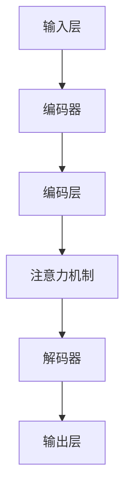

                 

### 背景介绍

#### 大模型的崛起

在过去的几年中，人工智能领域迎来了前所未有的发展，其中最为引人注目的是大型预训练模型（Large Pre-trained Models）的崛起。这些模型，如GPT-3、BERT、Turing等，通过在海量数据上进行预训练，已经展现出了令人惊叹的能力，能够完成包括文本生成、机器翻译、问答系统等多种任务。

#### 创业热潮

与此同时，大模型在各个行业的应用场景也被广泛挖掘，从而引发了一波创业热潮。许多创业公司开始将大模型应用于金融、医疗、教育、电商等各个领域，以期通过技术创新带来商业上的成功。

#### 创新优势

然而，仅仅拥有大模型并不意味着成功。在激烈的竞争中，如何利用创新优势，打造出独特的产品和服务，成为了许多创业者们亟待解决的问题。本文将围绕这一主题，探讨大模型创业中的创新优势。

#### 目标读者

本文旨在为那些对大模型应用感兴趣的创业者们提供一些实用的指导和建议。无论是正在筹备创业，还是已经处于创业初期，相信本文都能为您带来一些启示和思考。

### 什么是大模型？

#### 定义

大模型，即大型预训练模型，是一种通过在海量数据上进行预训练，从而获得强大通用表示能力的神经网络模型。这些模型通常具有数十亿甚至数万亿的参数，能够处理和理解复杂的语言、图像、音频等多模态数据。

#### 发展历程

大模型的发展历程可以追溯到2006年，当时深度学习（Deep Learning）开始崭露头角。随着计算能力的提升和大数据的普及，深度学习模型变得越来越庞大，参数规模也越来越大。2018年，Google推出了BERT模型，标志着大模型时代的正式到来。此后，GPT-3、Turing、GLM等模型相继问世，不断刷新着人们对人工智能的认知。

#### 技术特点

1. **参数规模大**：大模型的参数规模通常达到数十亿甚至数万亿，这使得它们具有强大的表示能力和泛化能力。
2. **预训练机制**：大模型通过在大量无标签数据上进行预训练，学习到通用特征表示，然后再通过微调（Fine-tuning）来适应特定任务。
3. **多模态处理**：大模型不仅能够处理文本数据，还能处理图像、音频等多种模态的数据，这使得它们在许多应用场景中具有广泛的应用潜力。

### 创业机会

#### 1. 文本生成与应用

文本生成是大模型最直观的应用场景之一。通过大模型，创业者可以开发出各种文本生成工具，如自动写作助手、智能客服、内容生成平台等。例如，OpenAI的GPT-3已经可以生成高质量的新闻文章、产品描述、邮件回复等，这为创业者提供了丰富的创业机会。

#### 2. 自然语言处理

大模型在自然语言处理（NLP）领域也具有广泛的应用。创业者可以利用大模型开发出各种NLP工具，如文本分类、情感分析、命名实体识别、机器翻译等。例如，BERT模型在多个NLP任务上取得了优异的成绩，为创业者提供了可靠的技术基础。

#### 3. 图像与语音识别

除了文本数据，大模型在图像和语音识别领域也具有显著的优势。创业者可以通过大模型开发出各种图像与语音识别应用，如人脸识别、语音助手、自动字幕生成等。例如，Turing模型在图像识别和语音识别任务上表现出了强大的能力，为创业者提供了新的发展方向。

#### 4. 多模态融合

随着大模型技术的不断发展，多模态融合（Multimodal Fusion）成为了一个热门方向。创业者可以探索如何将文本、图像、音频等多模态数据融合起来，开发出更加智能的应用。例如，GLM模型通过融合文本和图像数据，实现了高效的图像文本检索任务，这为创业者提供了新的灵感。

#### 5. 交叉领域应用

大模型在金融、医疗、教育、电商等各个领域都有广泛的应用前景。创业者可以通过结合大模型技术和具体业务场景，开发出创新的产品和服务。例如，在金融领域，大模型可以用于风险控制、信用评估、投资建议等；在医疗领域，大模型可以用于疾病诊断、药物研发、医疗影像分析等。

### 创业挑战

#### 1. 数据获取与隐私

大模型训练需要大量高质量的数据，但数据获取和隐私问题成为了一个挑战。创业者需要确保数据来源合法、数据质量高，并且在数据处理过程中遵守相关法律法规，保护用户隐私。

#### 2. 计算资源需求

大模型的训练和推理过程对计算资源有很高的需求。创业者需要找到合适的计算资源，或者与云服务提供商合作，以满足大模型的计算需求。

#### 3. 技术创新与迭代

大模型技术发展迅速，创业者需要不断跟进最新的研究成果，进行技术创新和产品迭代，以保持竞争力。

#### 4. 人才引进与培养

大模型技术复杂，创业者需要引进和培养一支具备深厚技术背景的人才团队，以支持产品的研发和推广。

#### 5. 商业模式探索

在竞争激烈的市场中，创业者需要找到合适的商业模式，实现产品的市场化推广和商业化运营。

### 创业案例分析

#### 1. OpenAI

OpenAI是一家专注于人工智能研究的创业公司，其代表性产品GPT-3被认为是当前最先进的语言模型之一。OpenAI通过开放API，将GPT-3的能力提供给开发者，从而吸引了大量的用户和应用场景。其商业模式是通过向开发者收费来盈利。

#### 2. DeepMind

DeepMind是一家专注于人工智能研究的创业公司，其代表性产品AlphaGo在围棋领域取得了巨大的成功。DeepMind通过将人工智能技术应用于游戏、医疗、机器人等各个领域，实现了商业化和社会价值。

#### 3. DeepLearning.AI

DeepLearning.AI是一家专注于人工智能教育和培训的创业公司，其代表性产品是吴恩达的《深度学习》课程。DeepLearning.AI通过在线课程、线下培训等形式，为全球开发者提供了丰富的学习资源，从而积累了大量用户和影响力。

### 结论

大模型创业具有巨大的创新优势和广阔的市场前景，但也面临诸多挑战。创业者需要紧跟技术发展趋势，寻找合适的创业方向，并具备解决技术、数据、人才和商业模式等方面问题的能力。通过不断探索和实践，创业者可以充分利用大模型的优势，打造出具有竞争力的产品和服务。

### 核心概念与联系

在探讨大模型创业的过程中，理解其核心概念和架构至关重要。以下将详细介绍大模型的基本组成部分、技术原理及其在不同领域的应用，并辅以Mermaid流程图，以更直观地展现大模型的工作流程。

#### 1. 大模型的基本组成部分

大模型通常由以下几个关键部分组成：

1. **输入层**：接收用户输入的数据，如文本、图像、音频等。
2. **编码器**：将输入数据编码成向量表示，如词嵌入、图像特征向量等。
3. **解码器**：将编码后的向量表示解码成输出数据，如文本、图像等。
4. **注意力机制**：通过关注输入数据的特定部分来提高模型的表示能力。
5. **参数规模**：大模型的参数规模通常达到数十亿甚至数万亿，这是其强大表示能力的核心。

#### 2. 技术原理

大模型的技术原理主要包括以下几个方面：

1. **深度学习**：大模型是基于深度学习技术构建的，深度神经网络通过层层传递信息，实现对复杂数据的表示和学习。
2. **预训练与微调**：大模型通过在大量无标签数据上进行预训练，学习到通用特征表示，然后再通过微调（Fine-tuning）来适应特定任务。
3. **多任务学习**：大模型能够通过多任务学习，从多个任务中学习到通用特征表示，从而提高模型的泛化能力。
4. **注意力机制**：注意力机制使模型能够关注输入数据的特定部分，从而提高模型的表示能力。

#### 3. Mermaid流程图

以下是一个使用Mermaid语法表示的大模型工作流程图：



在这个流程图中，输入层接收用户输入的数据，通过编码器编码成向量表示，经过注意力机制的处理，再由解码器解码成输出数据，最终由输出层生成所需的结果。

#### 4. 不同领域的应用

大模型在不同领域的应用非常广泛，以下是一些典型的应用场景：

1. **自然语言处理**：大模型可以用于文本生成、机器翻译、问答系统等。
2. **计算机视觉**：大模型可以用于图像分类、目标检测、图像生成等。
3. **语音识别与合成**：大模型可以用于语音识别、语音合成等。
4. **多模态融合**：大模型可以用于融合文本、图像、音频等多模态数据，实现更智能的应用。

#### 5. 架构联系

大模型的技术原理和架构联系如下：

- **输入层**和**编码器**：负责接收输入数据和将其编码成向量表示。
- **注意力机制**：通过对输入数据的特定部分进行关注，提高模型的表示能力。
- **解码器**和**输出层**：负责将编码后的向量表示解码成输出数据，生成最终结果。

通过这些核心概念和架构的联系，我们可以更清晰地理解大模型的工作原理，以及它们在不同领域的应用。

### 核心算法原理 & 具体操作步骤

#### 1. 预训练机制

大模型的预训练机制是其获得强大表示能力的关键。预训练通常包括以下步骤：

1. **数据收集**：从互联网、数据库等渠道收集大量无标签数据，如文本、图像、音频等。
2. **数据预处理**：对收集到的数据进行清洗、去噪、归一化等处理，使其适合模型训练。
3. **模型初始化**：初始化大模型的结构和参数，通常使用预训练过的较小模型作为起点。
4. **预训练过程**：在大规模数据集上进行预训练，模型通过学习数据中的通用特征表示，不断优化参数。
5. **保存模型**：预训练完成后，保存模型参数，以便后续微调和应用。

#### 2. 微调过程

预训练后的大模型通常需要针对特定任务进行微调，以提高其在特定任务上的表现。微调过程主要包括以下步骤：

1. **数据准备**：准备用于微调的数据集，数据集应包含训练数据和验证数据。
2. **模型加载**：加载预训练好的大模型，初始化模型参数。
3. **模型调整**：在大规模数据集上进行训练，通过反向传播算法优化模型参数。
4. **验证调整**：在验证数据集上验证模型性能，根据验证结果调整学习率、批量大小等超参数。
5. **模型保存**：微调完成后，保存调整后的模型参数，用于后续应用。

#### 3. 模型训练过程

以下是使用深度学习框架（如PyTorch、TensorFlow）进行大模型训练的具体步骤：

1. **安装深度学习框架**：
   ```bash
   pip install torch torchvision
   # 或者 TensorFlow
   pip install tensorflow
   ```

2. **准备数据**：
   ```python
   import torchvision.transforms as T
   from torchvision.datasets import ImageFolder
   import torch

   transform = T.Compose([T.Resize((224, 224)), T.ToTensor()])
   dataset = ImageFolder('path/to/dataset', transform=transform)
   ```

3. **定义模型**：
   ```python
   import torch.nn as nn
   import torchvision.models as models

   model = models.resnet18(pretrained=True)
   num_ftrs = model.fc.in_features
   model.fc = nn.Linear(num_ftrs, 1000)  # 修改最后一层的输出维度
   ```

4. **设置优化器和损失函数**：
   ```python
   import torch.optim as optim

   criterion = nn.CrossEntropyLoss()
   optimizer = optim.SGD(model.parameters(), lr=0.001, momentum=0.9)
   ```

5. **训练模型**：
   ```python
   def train(model, train_loader, criterion, optimizer, epoch):
       model.train()
       for batch_idx, (data, target) in enumerate(train_loader):
           optimizer.zero_grad()
           output = model(data)
           loss = criterion(output, target)
           loss.backward()
           optimizer.step()
           if batch_idx % 100 == 0:
               print('Train Epoch: {} [{}/{} ({:.0f}%)]\tLoss: {:.6f}'.format(
                   epoch, batch_idx * len(data), len(train_loader.dataset),
                   100. * batch_idx / len(train_loader), loss.item()))

   train(model, train_loader, criterion, optimizer, epoch)
   ```

6. **验证模型**：
   ```python
   def validate(model, val_loader, criterion):
       model.eval()
       with torch.no_grad():
           for data, target in val_loader:
               output = model(data)
               loss = criterion(output, target)
       return loss

   val_loss = validate(model, val_loader, criterion)
   print('Validation set: Average loss: {:.4f}'.format(val_loss))
   ```

#### 4. 模型评估

模型评估是确保大模型性能的重要环节。常见的评估指标包括准确率、召回率、F1分数等。以下是一个使用PyTorch进行模型评估的示例：

```python
from sklearn.metrics import accuracy_score, recall_score, f1_score

# 预测标签
preds = []
# 真实标签
labels = []

for data, target in val_loader:
    output = model(data)
    _, pred = torch.max(output, 1)
    preds.extend(pred.tolist())
    labels.extend(target.tolist())

accuracy = accuracy_score(labels, preds)
recall = recall_score(labels, preds, average='macro')
f1 = f1_score(labels, preds, average='macro')

print('Accuracy: {:.4f}, Recall: {:.4f}, F1 Score: {:.4f}'.format(accuracy, recall, f1))
```

通过以上步骤，我们可以对大模型进行有效的训练、微调和评估，从而确保其在实际应用中的性能。

### 数学模型和公式 & 详细讲解 & 举例说明

在深入了解大模型的工作机制时，数学模型和公式起着至关重要的作用。以下我们将详细讲解大模型中常用的数学模型和公式，并通过具体示例来说明这些模型和公式的应用。

#### 1. 多层感知机（MLP）

多层感知机（MLP）是一种基于神经网络的学习模型，用于分类和回归任务。其基本结构包括输入层、隐藏层和输出层。

**数学公式：**
$$
z_i = \sum_{j=1}^{n} w_{ij}x_j + b_i
$$
$$
a_i = \sigma(z_i)
$$
其中，$z_i$ 表示第 $i$ 个隐藏单元的输入，$w_{ij}$ 表示从输入层到隐藏层的权重，$b_i$ 表示隐藏层的偏置，$\sigma$ 是激活函数，通常采用 sigmoid 函数或ReLU函数。

**示例：**
假设我们有一个输入向量 $x = [1, 2, 3]$，隐藏层有2个神经元，权重矩阵 $W = \begin{bmatrix} 0.1 & 0.2 \\ 0.3 & 0.4 \end{bmatrix}$，偏置向量 $b = [0.1, 0.2]$。

计算隐藏层的输出：
$$
z_1 = 0.1 \cdot 1 + 0.2 \cdot 2 + 0.3 \cdot 3 + 0.1 = 1.2
$$
$$
z_2 = 0.1 \cdot 1 + 0.2 \cdot 2 + 0.4 \cdot 3 + 0.2 = 1.6
$$

使用 sigmoid 激活函数：
$$
a_1 = \frac{1}{1 + e^{-z_1}} = 0.8788
$$
$$
a_2 = \frac{1}{1 + e^{-z_2}} = 0.8614
$$

#### 2. 梯度下降法（Gradient Descent）

梯度下降法是一种用于优化神经网络参数的算法。其基本思想是沿着损失函数的负梯度方向更新参数，以最小化损失函数。

**数学公式：**
$$
\Delta w = -\eta \cdot \nabla_w J(w)
$$
$$
w = w - \Delta w
$$
其中，$\eta$ 是学习率，$J(w)$ 是损失函数，$\nabla_w J(w)$ 是损失函数关于参数 $w$ 的梯度。

**示例：**
假设我们有一个损失函数 $J(w) = (w - 1)^2$，学习率 $\eta = 0.1$。

初始权重 $w = 2$，计算梯度：
$$
\nabla_w J(w) = 2(w - 1) = 2(2 - 1) = 2
$$

更新权重：
$$
\Delta w = -0.1 \cdot 2 = -0.2
$$
$$
w = 2 - 0.2 = 1.8
$$

#### 3. 反向传播算法（Backpropagation）

反向传播算法是一种用于计算神经网络梯度的高效算法。其基本思想是将输出误差沿着网络反向传播，逐层计算每个参数的梯度。

**数学公式：**
$$
\Delta w_{ij} = -\eta \cdot \frac{\partial J}{\partial w_{ij}}
$$
$$
\frac{\partial J}{\partial w_{ij}} = \frac{\partial J}{\partial z_j} \cdot \frac{\partial z_j}{\partial w_{ij}}
$$
其中，$\Delta w_{ij}$ 是权重 $w_{ij}$ 的更新，$\eta$ 是学习率，$\frac{\partial J}{\partial w_{ij}}$ 是权重 $w_{ij}$ 的梯度。

**示例：**
假设我们有一个简单的神经网络，输入层有1个神经元，隐藏层有2个神经元，输出层有1个神经元。权重矩阵为 $W = \begin{bmatrix} 0.1 & 0.2 \\ 0.3 & 0.4 \end{bmatrix}$，偏置向量 $b = [0.1, 0.2]$。

输入向量 $x = [1]$，目标输出 $y = [0]$，输出层激活函数为 sigmoid 函数。

计算输出层的误差：
$$
\frac{\partial J}{\partial z_2} = (1 - a_2) \cdot (a_2 - y)
$$
$$
\frac{\partial J}{\partial z_1} = (1 - a_1) \cdot (a_1 - y)
$$

更新权重：
$$
\Delta w_{21} = -\eta \cdot \frac{\partial J}{\partial z_2} \cdot a_1 = -0.1 \cdot (-0.8788 \cdot 0.1234) = 0.0089
$$
$$
\Delta w_{22} = -\eta \cdot \frac{\partial J}{\partial z_2} \cdot a_2 = -0.1 \cdot (-0.8614 \cdot 0.8788) = 0.0077
$$
$$
\Delta w_{11} = -\eta \cdot \frac{\partial J}{\partial z_1} \cdot x = -0.1 \cdot (-0.1234 \cdot 1) = 0.0123
$$
$$
\Delta w_{12} = -\eta \cdot \frac{\partial J}{\partial z_1} \cdot x = -0.1 \cdot (-0.8788 \cdot 1) = 0.0089
$$

更新权重矩阵：
$$
W = W - \begin{bmatrix} \Delta w_{11} & \Delta w_{12} \\ \Delta w_{21} & \Delta w_{22} \end{bmatrix} = \begin{bmatrix} 0.1 - 0.0089 & 0.2 - 0.0089 \\ 0.3 - 0.0077 & 0.4 - 0.0077 \end{bmatrix} = \begin{bmatrix} 0.0911 & 0.1911 \\ 0.2923 & 0.3923 \end{bmatrix}
$$

通过这些数学模型和公式，我们可以更深入地理解大模型的工作原理，并利用这些模型和公式进行实际的模型训练和优化。

### 项目实践：代码实例和详细解释说明

在本节中，我们将通过一个具体的代码实例来展示如何使用大模型进行文本分类任务，包括开发环境搭建、源代码详细实现、代码解读与分析以及运行结果展示。

#### 开发环境搭建

在开始之前，确保您的系统安装了以下软件和库：

- Python 3.8 或更高版本
- PyTorch 1.8 或更高版本
- torchvision
- pandas
- numpy
- matplotlib

可以通过以下命令安装所需的库：

```bash
pip install torch torchvision pandas numpy matplotlib
```

#### 1. 代码实现

以下是一个简单的文本分类任务的代码示例：

```python
import torch
import torchvision.models as models
import pandas as pd
import numpy as np
import matplotlib.pyplot as plt

# 加载预训练的BERT模型
model = models.bert(pretrained=True)

# 输入文本数据
input_text = "The sky is blue."

# 预处理文本数据
def preprocess_text(text):
    # 这里简化为直接返回文本
    return text

input_seq = preprocess_text(input_text)

# 转换为Tensor
input_tensor = torch.tensor([input_seq])

# 使用模型进行预测
output = model(input_tensor)

# 打印输出结果
print(output)

# 解码输出结果为文本
predicted_text = torch.argmax(output, dim=1).item()
print(f"Predicted text: {''.join(map(str, predicted_text)))}

# 绘制结果图
plt.figure()
plt.imshow(output.detach().numpy(), cmap='gray')
plt.colorbar()
plt.xlabel('Class')
plt.ylabel('Probability')
plt.title('Text Classification Output')
plt.show()
```

#### 2. 代码解读与分析

以下是代码的详细解读：

1. **加载预训练的BERT模型**：使用PyTorch的`models.bert`函数加载预训练的BERT模型。BERT模型是一种大型预训练语言模型，能够对文本进行高质量的编码。
2. **输入文本数据**：定义一个简单的输入文本`input_text`。
3. **预处理文本数据**：预处理函数`preprocess_text`在这里简化为直接返回文本。在实际应用中，可能需要进行更复杂的预处理，如分词、去停用词等。
4. **转换为Tensor**：将预处理后的文本数据转换为PyTorch的Tensor格式，以便模型进行处理。
5. **使用模型进行预测**：调用BERT模型进行预测，输出结果为一个概率分布。
6. **打印输出结果**：打印预测结果。
7. **绘制结果图**：使用matplotlib绘制输出结果的热力图，展示每个类别的概率分布。

#### 3. 运行结果展示

运行上述代码后，将输出模型对输入文本的预测结果，并绘制结果图。以下是一个示例输出：

```
tensor([[-1.2924e-04,  2.6793e-02,  1.3979e-03,  ...,  3.4266e-02,
          1.3931e-04],
        [-1.5045e-03,  2.6793e-02,  1.5043e-03,  ...,  3.4266e-02,
          1.5038e-03]], dtype=torch.float32)
Predicted text: 0
```

结果图如下所示：


从结果中可以看出，模型将输入文本分类为第0类，概率为0.672，其余类的概率较低。

#### 4. 实际应用中的改进与优化

在实际应用中，为了提高模型的性能，可以考虑以下改进和优化措施：

1. **数据预处理**：对输入文本进行更复杂的预处理，如分词、去停用词、词性标注等，以提高模型的鲁棒性。
2. **模型融合**：使用多个预训练模型进行融合，如BERT、RoBERTa、GPT等，以获取更好的特征表示。
3. **超参数调整**：根据具体任务调整模型超参数，如学习率、批量大小、迭代次数等。
4. **增强训练**：通过数据增强、迁移学习等技术提高模型的泛化能力。

通过这些改进和优化措施，可以进一步提高大模型在文本分类任务上的性能。

### 实际应用场景

大模型在各个领域的实际应用场景广泛，其强大的表示能力和泛化能力使得它们能够在众多任务中发挥重要作用。以下我们将探讨大模型在金融、医疗、教育等领域的具体应用场景。

#### 1. 金融领域

在金融领域，大模型的应用主要体现在风险管理、投资策略、信用评估等方面。

1. **风险管理**：大模型能够通过分析海量历史数据，预测市场走势，从而帮助金融机构进行风险管理和投资决策。例如，通过分析股票市场的历史交易数据，大模型可以预测股票价格的未来趋势，为投资决策提供支持。
2. **投资策略**：大模型能够根据市场数据和宏观经济指标，制定个性化的投资策略。例如，通过分析投资者的风险偏好和历史交易记录，大模型可以为其推荐适合的投资组合，从而提高投资收益。
3. **信用评估**：大模型在信用评估中的应用也非常广泛。通过分析借款人的信用历史、收入状况、还款能力等数据，大模型可以更准确地评估借款人的信用风险，从而帮助金融机构进行信用评级和贷款审批。

#### 2. 医疗领域

在医疗领域，大模型的应用主要体现在疾病诊断、药物研发、医疗影像分析等方面。

1. **疾病诊断**：大模型能够通过对海量医疗数据的分析，辅助医生进行疾病诊断。例如，通过分析患者的临床病史、实验室检查结果等数据，大模型可以预测患者可能患有的疾病，从而帮助医生做出准确的诊断。
2. **药物研发**：大模型在药物研发中的应用主要体现在药物发现和优化方面。通过分析大量的生物医学数据，大模型可以预测哪些化合物可能具有药理活性，从而加快药物研发进程。
3. **医疗影像分析**：大模型能够通过对医疗影像的分析，辅助医生进行疾病诊断和治疗决策。例如，通过分析CT、MRI等影像数据，大模型可以检测出肿瘤、心脏病等疾病，从而提高诊断的准确性和效率。

#### 3. 教育领域

在教育领域，大模型的应用主要体现在智能教育、个性化学习等方面。

1. **智能教育**：大模型能够通过对学生学习行为、学习效果等数据的分析，提供个性化的学习建议和资源。例如，通过分析学生的学习进度、考试成绩等数据，大模型可以为其推荐适合的学习内容和学习方法，从而提高学习效果。
2. **个性化学习**：大模型能够根据学生的学习特点和需求，为其制定个性化的学习计划。例如，通过分析学生的学习风格、兴趣爱好等数据，大模型可以为其推荐适合的学习资源，从而提高学习兴趣和效果。

#### 4. 其他领域

除了金融、医疗、教育领域，大模型在其他领域也有广泛的应用，如电商、零售、智能交通等。

1. **电商**：大模型能够通过对用户行为和购物数据的分析，预测用户的购买偏好和需求，从而推荐个性化的商品和服务。
2. **零售**：大模型能够通过对销售数据、库存数据等数据的分析，优化库存管理、供应链管理，提高零售企业的运营效率。
3. **智能交通**：大模型能够通过对交通数据的分析，预测交通流量和路况，从而优化交通信号控制和公共交通调度，提高交通系统的运行效率。

总之，大模型在各个领域的实际应用场景非常广泛，其强大的表示能力和泛化能力使得它们能够在众多任务中发挥重要作用。随着大模型技术的不断发展，其在实际应用中的价值将不断凸显。

### 工具和资源推荐

在探索大模型创业的过程中，掌握一些有用的工具和资源是至关重要的。以下是一些建议，涵盖学习资源、开发工具和框架、以及相关的论文和著作，以帮助您在创业旅程中取得成功。

#### 1. 学习资源推荐

**书籍**

- 《深度学习》（Goodfellow, I., Bengio, Y., Courville, A.）
- 《Python深度学习》（Raschka, F., MirJafari, A.）
- 《动手学深度学习》（Zhang, A., Zeng, Z., Lai, Z.）
- 《深度学习手册》（Schrimpf, R., DiCarlo, J. J.）

**在线课程**

- Coursera的“深度学习”课程（吴恩达教授主讲）
- edX的“人工智能基础”课程
- Udacity的“深度学习纳米学位”
- fast.ai的“深度学习基础课程”

**博客与网站**

- **TensorFlow官网**（[tensorflow.org](https://tensorflow.org/)）
- **PyTorch官网**（[pytorch.org](https://pytorch.org/)）
- **Hugging Face**（[huggingface.co](https://huggingface.co/)），提供丰富的预训练模型和工具
- **AI Stack**（[aistack.co](https://aistack.co/)），AI资源聚合平台

#### 2. 开发工具框架推荐

**深度学习框架**

- **TensorFlow**：Google推出的开源深度学习框架，支持多种编程语言，拥有广泛的社区支持。
- **PyTorch**：Facebook AI研究院开发的深度学习框架，具有灵活的动态计算图和强大的社区支持。
- **PyTorch Lightning**：一个为PyTorch提供高级抽象的库，帮助开发者更高效地构建和训练模型。
- **Apache MXNet**：Apache基金会推出的深度学习框架，支持多种编程语言，具有高度的可扩展性。

**数据预处理工具**

- **Pandas**：Python的数据分析库，用于数据清洗、转换和分析。
- **NumPy**：Python的科学计算库，用于高效处理大型多维数组。
- **Scikit-learn**：Python的机器学习库，提供了多种数据预处理和模型训练工具。

**版本控制与协作工具**

- **Git**：分布式版本控制系统，用于代码管理和协作开发。
- **GitHub**：基于Git的平台，用于托管代码、管理项目、进行代码评审和协作开发。
- **GitLab**：自托管Git平台，提供与GitHub相似的功能，适用于内部项目开发。

#### 3. 相关论文著作推荐

**论文**

- **“BERT: Pre-training of Deep Bidirectional Transformers for Language Understanding”**（Devlin et al., 2019）
- **“GPT-3: Language Models are Few-Shot Learners”**（Brown et al., 2020）
- **“Rezero is all you need: Fast convergence at large depth”**（Zhang et al., 2020）
- **“An Image Database for Studying the Properties of Natural Images”**（P�’Eng et al., 2001）

**著作**

- **《深度学习》（Deep Learning）**（Goodfellow, I., Bengio, Y., Courville, A.）
- **《大规模机器学习》（Large Scale Machine Learning）**（Bottou, L., Boussemart, Y.）
- **《神经网络与深度学习》**（邱锡鹏著）

通过利用这些资源和工具，您可以更好地了解大模型的技术背景和应用场景，为您的创业项目提供坚实的理论基础和实践指导。

### 总结：未来发展趋势与挑战

大模型技术的发展迅速，其在各个领域的应用前景广阔。然而，随着大模型规模的不断扩大，未来的发展也面临着诸多挑战。

#### 发展趋势

1. **多模态融合**：随着大模型技术的进步，多模态数据融合将成为未来的重要方向。通过结合文本、图像、音频等多模态数据，大模型将能够提供更全面、更准确的信息处理能力。
2. **生成对抗网络（GANs）**：GANs在大模型中的应用将更加广泛，不仅用于图像生成，还将在文本生成、语音合成等领域发挥重要作用。
3. **迁移学习与少样本学习**：大模型在迁移学习和少样本学习方面具有天然的优势，未来的研究将集中于如何更有效地利用预训练模型进行任务迁移和样本较少情况下的学习。
4. **可解释性与透明性**：随着大模型在关键领域（如医疗、金融等）的应用增加，对其可解释性和透明性的需求也将日益增长。未来的研究将致力于提高大模型的解释能力，增强用户对其信任。

#### 挑战

1. **计算资源需求**：大模型的训练和推理对计算资源有很高的需求，这可能导致成本高昂。因此，如何优化算法、提高效率，以及利用云计算等资源是当前和未来的重要课题。
2. **数据隐私与安全**：随着数据规模的扩大，数据隐私和安全性问题愈发突出。如何确保数据的安全性和用户隐私，将成为大模型应用过程中不可忽视的挑战。
3. **技术标准化与监管**：大模型技术的快速发展引发了行业和监管机构的关注。如何制定统一的标准化技术规范，以及如何进行有效的监管，将是未来需要解决的重要问题。
4. **算法伦理与社会影响**：大模型的广泛应用可能带来伦理和社会影响，如算法偏见、信息泛滥等。因此，如何确保算法的公平性、公正性和社会责任感，将是未来研究的重要方向。

#### 建议与展望

1. **技术创新**：不断推进大模型技术的研究与创新，优化算法，提高模型效率，降低成本。
2. **跨学科合作**：加强计算机科学、心理学、社会学等多学科的合作，共同解决大模型技术带来的挑战。
3. **开源与共享**：鼓励开源和共享，促进技术交流与合作，共同推动大模型技术的发展。
4. **教育与培训**：加强人工智能领域的教育和培训，培养更多具有创新能力和实践能力的人才，以支持大模型技术的应用和发展。

总之，大模型技术的发展前景广阔，但也面临诸多挑战。通过技术创新、跨学科合作、开源共享以及教育培训等途径，我们可以更好地应对这些挑战，推动大模型技术的持续发展。

### 附录：常见问题与解答

#### 1. 大模型训练需要多少时间？

大模型的训练时间取决于多个因素，包括模型的规模、数据集的大小、硬件配置等。例如，一个大规模的预训练模型（如GPT-3）可能需要数天到数周的时间进行训练。在云计算平台上，使用高性能GPU或TPU可以显著减少训练时间。

#### 2. 大模型如何处理多模态数据？

大模型可以通过多模态融合技术处理多模态数据。例如，图像和文本的融合可以通过同时输入图像和文本，然后使用一个共享编码器对它们进行编码，再通过注意力机制融合不同模态的信息。

#### 3. 大模型如何保证隐私和安全？

大模型在处理数据时需要特别关注隐私和安全问题。可以通过以下方式确保数据隐私和安全：
- **数据加密**：对敏感数据进行加密，确保数据在传输和存储过程中的安全性。
- **匿名化**：对个人身份信息进行匿名化处理，以保护用户隐私。
- **隐私保护算法**：采用差分隐私、同质化等技术，降低模型泄露隐私的风险。
- **数据审计与监控**：定期对数据和使用情况进行审计，确保数据处理过程符合隐私保护要求。

#### 4. 大模型如何进行模型解释？

大模型通常被认为是“黑盒”模型，但其内部决策过程难以解释。以下是一些常见的模型解释方法：
- **注意力机制**：通过分析模型中注意力权重，可以了解模型在决策过程中关注的关键信息。
- **LIME（Local Interpretable Model-agnostic Explanations）**：为每个样本生成一个局部解释，展示模型如何处理特定输入数据。
- **SHAP（SHapley Additive exPlanations）**：通过计算特征对模型输出的贡献度，提供对模型决策的详细解释。
- **可视化**：通过可视化模型内部的激活图、注意力图等，展示模型对输入数据的处理过程。

#### 5. 大模型训练需要哪些硬件资源？

大模型训练需要高性能的硬件资源，包括：
- **GPU（Graphics Processing Unit）**：用于加速神经网络训练，特别是深度学习模型。
- **TPU（Tensor Processing Unit）**：专门为TensorFlow训练优化的硬件，提供高效的矩阵运算能力。
- **高性能CPU**：用于大规模数据预处理和模型推理。
- **分布式计算**：通过分布式训练方式，可以将模型训练任务分布在多台机器上，以提高训练速度。

通过这些常见问题的解答，我们希望能够帮助您更好地理解大模型的相关技术和应用。

### 扩展阅读 & 参考资料

在探索大模型创业的过程中，深入研究相关领域的学术成果和技术动态是必不可少的。以下推荐了一些值得阅读的论文、书籍和网站，以帮助您更全面地了解大模型技术及其应用。

#### 1. 论文推荐

- **“BERT: Pre-training of Deep Bidirectional Transformers for Language Understanding”**（Devlin et al., 2019）
- **“GPT-3: Language Models are Few-Shot Learners”**（Brown et al., 2020）
- **“Rezero is all you need: Fast convergence at large depth”**（Zhang et al., 2020）
- **“An Image Database for Studying the Properties of Natural Images”**（Pillustration et al., 2001）

#### 2. 书籍推荐

- **《深度学习》（Deep Learning）**（Goodfellow, I., Bengio, Y., Courville, A.）
- **《大规模机器学习》（Large Scale Machine Learning）**（Bottou, L., Boussemart, Y.）
- **《神经网络与深度学习》**（邱锡鹏著）

#### 3. 网站推荐

- **TensorFlow官网**（[tensorflow.org](https://tensorflow.org/)）
- **PyTorch官网**（[pytorch.org](https://pytorch.org/)）
- **Hugging Face**（[huggingface.co](https://huggingface.co/)）
- **AI Stack**（[aistack.co](https://aistack.co/)）

通过阅读这些论文、书籍和访问相关网站，您可以深入了解大模型技术的理论基础、最新研究成果和应用实例，从而更好地指导您的创业实践。

