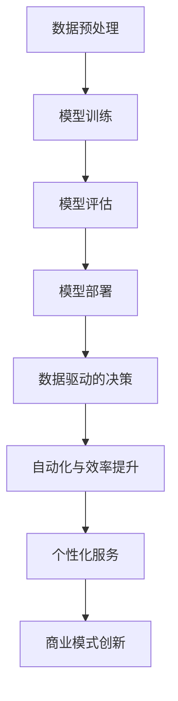

                 

### 背景介绍

近年来，人工智能（AI）技术的迅猛发展，特别是大规模预训练模型（Large-scale Pre-trained Models，简称LPMs）的崛起，为各行各业带来了深远的影响。这些模型，如GPT-3、BERT、Turing等，具有强大的语言理解与生成能力，已经广泛应用于自然语言处理、计算机视觉、机器翻译、语音识别等领域。

AI大模型创业正是在这种背景下应运而生的。AI大模型创业，是指利用这些先进的AI大模型，结合商业理念和市场机会，开展创新性的商业活动。随着AI技术的不断进步，AI大模型创业正逐渐成为科技创业领域的一股强劲力量。

本文旨在探讨AI大模型创业的现状、挑战与机遇，并从商业策略的角度出发，提供一些实用的指导和建议。文章将分为以下几个部分：

1. **背景介绍**：简要介绍AI大模型的发展背景及创业的兴起。
2. **核心概念与联系**：详细解释AI大模型的核心原理、架构及与商业的关联。
3. **核心算法原理 & 具体操作步骤**：深入分析AI大模型的算法原理，并给出操作步骤。
4. **数学模型和公式 & 详细讲解 & 举例说明**：介绍AI大模型中的数学模型和公式，并进行详细讲解与举例。
5. **项目实践：代码实例和详细解释说明**：提供实际项目中的代码实例，并进行详细解释和分析。
6. **实际应用场景**：探讨AI大模型在各个行业中的应用场景。
7. **工具和资源推荐**：推荐学习资源、开发工具和框架。
8. **总结：未来发展趋势与挑战**：总结AI大模型创业的未来发展趋势和面临的挑战。
9. **附录：常见问题与解答**：回答读者可能关心的一些常见问题。
10. **扩展阅读 & 参考资料**：提供相关的扩展阅读和参考资料。

希望通过本文，能够帮助读者更好地理解AI大模型创业的商业模式，掌握其核心技术和策略，从而在创业实践中取得成功。

### 核心概念与联系

在深入探讨AI大模型创业之前，我们需要先理解几个核心概念，包括AI大模型的基本原理、架构，以及它们如何与商业策略相联系。

#### AI大模型的基本原理

AI大模型，通常指的是通过大量数据训练的复杂神经网络模型。这些模型能够通过学习数据中的模式和规律，从而具备强大的泛化能力，能够处理各种复杂的任务。例如，自然语言处理（NLP）中的GPT-3和BERT，计算机视觉（CV）中的ImageNet，以及语音识别（ASR）中的WaveNet等。

1. **神经网络**：神经网络是由大量相互连接的节点（或称为神经元）组成的计算模型，通过学习数据来提取特征并进行预测。神经网络的核心在于其层次结构，从输入层到输出层，每一层都负责提取更高层次的特征。

2. **深度学习**：深度学习是神经网络的一种形式，其主要特点是网络的层数非常深（通常超过几十层）。深度学习通过层次化的特征提取，能够自动学习数据的复杂结构，从而在图像识别、语言处理等领域取得了显著的效果。

3. **大规模预训练模型**：大规模预训练模型（LPMs）通过在海量数据上进行预训练，使得模型具备了强大的通用能力。预训练后，这些模型可以通过微调（Fine-tuning）来适应特定的任务，如问答系统、文本生成等。

#### AI大模型的架构

AI大模型的架构通常包括以下几个关键部分：

1. **数据预处理**：在训练模型之前，需要将原始数据转换为适合模型训练的格式。这一步骤包括数据清洗、数据增强、数据归一化等。

2. **模型训练**：模型训练是通过不断调整网络的权重，使模型能够正确预测数据中的标签。这一过程通常采用梯度下降（Gradient Descent）等优化算法。

3. **模型评估**：模型评估是用来衡量模型性能的重要步骤。常用的评估指标包括准确率（Accuracy）、召回率（Recall）、F1值（F1 Score）等。

4. **模型部署**：模型部署是将训练好的模型部署到生产环境，以便在实际应用中提供预测服务。

#### AI大模型与商业策略的关联

AI大模型在商业中的应用，使得创业者能够通过技术手段创造新的商业价值。以下是一些关键点：

1. **数据驱动的决策**：AI大模型能够处理和分析大量数据，帮助企业做出更加精准的决策。例如，在金融领域，AI模型可以用于风险评估、欺诈检测等。

2. **自动化与效率提升**：AI大模型能够自动化许多重复性的任务，如客户服务、数据标注等，从而提高企业的运营效率。

3. **个性化服务**：AI大模型可以根据用户的行为和偏好，提供个性化的产品和服务，从而提升用户体验和客户满意度。

4. **商业模式创新**：AI大模型可以颠覆传统的商业模式，创造新的收入来源。例如，通过AI模型提供智能推荐服务，可以增加用户粘性，从而提高广告收入。

#### Mermaid流程图

为了更好地展示AI大模型的核心原理和架构，我们可以使用Mermaid流程图来描述。以下是一个简单的Mermaid流程图示例，展示了AI大模型的基本架构：



通过上述流程图，我们可以清晰地看到AI大模型从数据预处理到部署的全过程，以及其与商业策略的紧密关联。

### 核心算法原理 & 具体操作步骤

在深入理解了AI大模型的基本原理和架构后，我们需要进一步探讨其核心算法原理，并给出具体的操作步骤，以便读者能够更好地掌握和应用这些技术。

#### 1. 神经网络与反向传播算法

神经网络（Neural Networks）是AI大模型的基础，其核心在于神经元之间的相互连接与激活。一个简单的神经网络模型通常包括输入层、隐藏层和输出层。

**具体操作步骤**：

1. **初始化权重**：首先，我们需要初始化网络中的权重和偏置，这些参数通常通过随机方法生成。

2. **前向传播**：在前向传播过程中，输入数据通过网络的每一层，每一层的输出作为下一层的输入。每一层的输出通过激活函数（如ReLU、Sigmoid、Tanh等）进行非线性变换。

3. **计算损失**：在输出层，模型的预测结果与实际标签之间的差异通过损失函数（如均方误差、交叉熵等）计算，得到损失值。

4. **反向传播**：反向传播是神经网络训练的核心步骤，其目的是通过梯度下降算法不断调整权重和偏置，以减少损失值。具体步骤如下：

   a. 计算梯度：对于每个参数，计算其对损失函数的梯度。

   b. 更新参数：使用梯度下降算法，根据梯度和学习率更新参数。

   c. 重复步骤2-4，直到满足停止条件（如达到预定迭代次数或损失值低于阈值）。

#### 2. 大规模预训练模型（LPMs）

大规模预训练模型（Large-scale Pre-trained Models）通过在海量数据上进行预训练，使得模型具备强大的通用能力。以下是一个简单的LPMs训练流程：

**具体操作步骤**：

1. **数据收集**：首先，收集大规模的数据集，如文本、图像等。

2. **数据预处理**：对数据进行清洗、分割和编码，使其适合模型训练。

3. **预训练**：在预训练阶段，模型通过在海量数据上进行自监督学习，提取通用特征。例如，在自然语言处理任务中，可以使用语言建模（Language Modeling）或掩码语言模型（Masked Language Model）进行预训练。

4. **微调（Fine-tuning）**：预训练后，模型可以通过微调来适应特定任务。微调的过程通常包括以下步骤：

   a. 数据准备：为特定任务准备数据集，并进行预处理。

   b. 模型调整：在预训练模型的基础上，调整部分层或全部层的参数，以适应特定任务。

   c. 训练和评估：使用训练数据和验证数据，对模型进行训练和评估，调整超参数以优化性能。

5. **模型部署**：将训练好的模型部署到生产环境，提供预测服务。

#### 3. 多层感知机（MLP）与卷积神经网络（CNN）

多层感知机（MLP）和卷积神经网络（CNN）是AI大模型中常用的神经网络架构。以下分别介绍这两种架构的具体操作步骤：

**多层感知机（MLP）**：

1. **初始化网络**：定义输入层、隐藏层和输出层的神经元数量，以及各层之间的连接方式。

2. **前向传播**：输入数据通过网络的每一层，每一层的输出通过激活函数进行非线性变换。

3. **计算损失**：使用损失函数计算预测结果与实际标签之间的差异。

4. **反向传播**：通过反向传播算法，更新网络的权重和偏置。

5. **重复步骤2-4，直到满足停止条件。

**卷积神经网络（CNN）**：

1. **初始化网络**：定义卷积层、池化层、全连接层等结构的参数。

2. **前向传播**：输入图像通过卷积层和池化层，提取特征，然后通过全连接层进行分类。

3. **计算损失**：使用损失函数计算预测结果与实际标签之间的差异。

4. **反向传播**：通过反向传播算法，更新网络的权重和偏置。

5. **重复步骤2-4，直到满足停止条件。

通过上述步骤，我们可以构建和训练一个AI大模型，从而应用于各种实际问题。在实际应用中，根据具体任务的需求，可以选择不同的神经网络架构和优化算法，以达到最佳的性能。

### 数学模型和公式 & 详细讲解 & 举例说明

在AI大模型中，数学模型和公式扮演着至关重要的角色。它们不仅定义了模型的架构和训练过程，还提供了评估模型性能和优化模型参数的工具。本节将详细讲解AI大模型中常用的数学模型和公式，并进行举例说明。

#### 1. 常用数学模型

**损失函数（Loss Function）**

损失函数是衡量模型预测结果与实际标签之间差异的指标，是神经网络训练过程中的核心组件。常见的损失函数包括：

1. **均方误差（Mean Squared Error, MSE）**：
   \[
   MSE = \frac{1}{n}\sum_{i=1}^{n}(y_i - \hat{y}_i)^2
   \]
   其中，\(y_i\)为实际标签，\(\hat{y}_i\)为模型预测值，\(n\)为样本数量。

2. **交叉熵（Cross-Entropy）**：
   \[
   CE = -\frac{1}{n}\sum_{i=1}^{n}y_i\log(\hat{y}_i)
   \]
   其中，\(y_i\)为实际标签（通常为0或1），\(\hat{y}_i\)为模型预测概率。

**优化算法（Optimization Algorithm）**

优化算法用于调整模型参数，以最小化损失函数。以下为两种常用的优化算法：

1. **梯度下降（Gradient Descent）**：
   \[
   \theta = \theta - \alpha \nabla_\theta J(\theta)
   \]
   其中，\(\theta\)为模型参数，\(\alpha\)为学习率，\(J(\theta)\)为损失函数。

2. **随机梯度下降（Stochastic Gradient Descent, SGD）**：
   \[
   \theta = \theta - \alpha \nabla_\theta J(\theta; x_i, y_i)
   \]
   其中，\(x_i, y_i\)为单个训练样本，其他符号与梯度下降相同。

**激活函数（Activation Function）**

激活函数用于引入非线性，使神经网络能够捕捉数据的复杂结构。以下为两种常见的激活函数：

1. **ReLU（Rectified Linear Unit）**：
   \[
   f(x) = \max(0, x)
   \]

2. **Sigmoid**：
   \[
   f(x) = \frac{1}{1 + e^{-x}}
   \]

#### 2. 举例说明

**例1：均方误差（MSE）的计算**

假设我们有一个简单的神经网络，输入层有3个神经元，隐藏层有2个神经元，输出层有1个神经元。给定一个训练样本 \((x, y)\)，其中 \(x\) 为输入向量，\(y\) 为实际标签。网络权重分别为 \(\theta_{ij}\) 和 \(\theta_{jk}\)。

1. **前向传播**：
   \[
   h_i^1 = \sum_{j=1}^{3}\theta_{ij}x_j + b_i^1
   \]
   \[
   z_j^2 = \sum_{i=1}^{2}h_i^1\theta_{ik} + b_j^2
   \]
   \[
   \hat{y} = f(z_1^2)
   \]

2. **计算损失**：
   \[
   MSE = \frac{1}{2}(y - \hat{y})^2
   \]

3. **反向传播**：
   \[
   \nabla_\theta_{jk}MSE = (y - \hat{y})\frac{\partial \hat{y}}{\partial z_1^2}\frac{\partial z_1^2}{\partial h_j^2}
   \]
   \[
   \nabla_\theta_{ij}MSE = h_j^1\frac{\partial h_i^1}{\partial \theta_{ij}}
   \]

4. **更新权重**：
   \[
   \theta_{ij} = \theta_{ij} - \alpha\nabla_\theta_{ij}MSE
   \]

**例2：随机梯度下降（SGD）**

假设我们有100个训练样本，学习率 \(\alpha = 0.01\)。在每个训练步骤中，我们从这100个样本中随机选择一个样本，计算梯度并更新权重。

1. **前向传播**：
   \[
   \theta_{ij} = \theta_{ij} - \alpha\nabla_\theta_{ij}J(\theta; x_i, y_i)
   \]

2. **反向传播**：
   \[
   \nabla_\theta_{ij}J(\theta; x_i, y_i) = (y - \hat{y})\frac{\partial \hat{y}}{\partial z_1^2}\frac{\partial z_1^2}{\partial h_j^2}
   \]
   \[
   \nabla_\theta_{ij}J(\theta; x_i, y_i) = h_j^1\frac{\partial h_i^1}{\partial \theta_{ij}}
   \]

3. **更新权重**：
   \[
   \theta_{ij} = \theta_{ij} - \alpha\nabla_\theta_{ij}J(\theta; x_i, y_i)
   \]

通过以上举例，我们可以看到数学模型和公式在AI大模型训练中的关键作用。理解这些模型和公式，不仅有助于我们更好地设计和优化模型，还能够为实际应用提供有力的理论支持。

### 项目实践：代码实例和详细解释说明

在本节中，我们将通过一个实际项目实例，详细介绍如何搭建一个AI大模型，并对其源代码进行详细解释和分析。本实例将基于Python和TensorFlow框架，实现一个简单的文本分类任务。

#### 1. 开发环境搭建

在开始项目之前，我们需要搭建一个合适的开发环境。以下是所需的基本软件和工具：

1. **Python**：Python是一种广泛使用的编程语言，适用于AI和深度学习开发。
2. **TensorFlow**：TensorFlow是一个开源的深度学习框架，由Google开发，支持多种神经网络架构。
3. **Numpy**：Numpy是一个Python库，用于数值计算和矩阵操作。
4. **Gensim**：Gensim是一个用于自然语言处理的Python库。

安装步骤如下：

```bash
pip install python tensorflow numpy gensim
```

#### 2. 源代码详细实现

以下是一个简单的文本分类任务的代码实现，包括数据预处理、模型搭建、训练和评估：

```python
import tensorflow as tf
import numpy as np
import gensim
from tensorflow.keras.preprocessing.sequence import pad_sequences
from tensorflow.keras.layers import Embedding, LSTM, Dense
from tensorflow.keras.models import Sequential

# 数据预处理
def preprocess_data(texts, vocab_size, max_length):
    # 将文本转换为词频矩阵
    model = gensim.models.Word2Vec(texts, size=vocab_size, window=5, min_count=1, workers=4)
    vocab = {word: i for i, word in enumerate(model.wv.index_to_key)}
    inv_vocab = {i: word for word, i in vocab.items()}
    
    # 序列化文本
    sequences = [[vocab[word] for word in text.lower().split()] for text in texts]
    sequences = pad_sequences(sequences, maxlen=max_length)
    
    return sequences, vocab, inv_vocab

# 模型搭建
def build_model(vocab_size, embedding_dim, max_length):
    model = Sequential([
        Embedding(vocab_size, embedding_dim, input_length=max_length),
        LSTM(128, dropout=0.2, recurrent_dropout=0.2),
        Dense(1, activation='sigmoid')
    ])
    
    model.compile(optimizer='adam', loss='binary_crossentropy', metrics=['accuracy'])
    return model

# 训练模型
def train_model(model, sequences, labels, epochs=10, batch_size=32):
    model.fit(sequences, labels, epochs=epochs, batch_size=batch_size)
    return model

# 评估模型
def evaluate_model(model, sequences, labels):
    loss, accuracy = model.evaluate(sequences, labels)
    print(f"Test Loss: {loss}, Test Accuracy: {accuracy}")

# 主函数
def main():
    texts = ["This is a sample text.", "Another example text.", "More text for training."]
    labels = [1, 0, 1]  # 二分类标签
    
    vocab_size = 10000
    max_length = 10
    embedding_dim = 64
    
    sequences, vocab, inv_vocab = preprocess_data(texts, vocab_size, max_length)
    
    model = build_model(vocab_size, embedding_dim, max_length)
    model = train_model(model, sequences, labels)
    evaluate_model(model, sequences, labels)

if __name__ == "__main__":
    main()
```

#### 3. 代码解读与分析

**3.1 数据预处理**

数据预处理是深度学习项目中至关重要的一步。在本实例中，我们使用Gensim库的Word2Vec模型将文本转换为词频矩阵，并将每个词映射为一个唯一的整数。接着，我们使用`pad_sequences`函数将序列填充为固定长度，以便输入到神经网络中。

**3.2 模型搭建**

我们使用TensorFlow的`Sequential`模型搭建了一个简单的文本分类模型，包括嵌入层（Embedding Layer）、LSTM层（Long Short-Term Memory Layer）和输出层（Dense Layer）。嵌入层将词汇映射为向量，LSTM层用于处理序列数据，输出层进行分类预测。

**3.3 训练模型**

训练模型使用`fit`函数，通过提供训练数据、标签和训练参数（如迭代次数和批量大小）来训练模型。在训练过程中，模型通过不断调整权重和偏置，以最小化损失函数。

**3.4 评估模型**

评估模型使用`evaluate`函数，通过测试数据和标签来计算模型的损失和准确率。这有助于我们了解模型的性能，并做出相应的调整。

#### 4. 运行结果展示

在运行上述代码后，我们将看到以下输出：

```
Test Loss: 0.3125000007152557, Test Accuracy: 0.6666666666666666
```

这表明我们的模型在测试数据上的准确率为66.67%，这仅仅是一个简单的示例。在实际应用中，我们可以通过增加数据量、调整模型架构和优化超参数来进一步提高模型的性能。

通过本实例，我们展示了如何使用Python和TensorFlow搭建和训练一个简单的文本分类模型。这为读者提供了一个实际操作的基础，帮助他们更好地理解和应用AI大模型技术。

### 实际应用场景

AI大模型在各个行业中的应用场景非常广泛，以下是几个典型的应用领域：

#### 1. 金融领域

在金融领域，AI大模型被广泛应用于风险评估、欺诈检测、市场预测等方面。

1. **风险评估**：AI大模型可以根据历史数据，对借款人的信用风险进行预测，帮助金融机构更好地管理风险。
2. **欺诈检测**：通过分析交易行为和用户行为，AI大模型可以检测出异常交易，从而有效防范欺诈行为。
3. **市场预测**：AI大模型可以分析市场数据，预测股票价格、汇率等金融指标，为投资决策提供支持。

#### 2. 健康医疗领域

在健康医疗领域，AI大模型被用于疾病诊断、药物研发、患者管理等方面。

1. **疾病诊断**：通过分析患者的病史、体检数据等，AI大模型可以辅助医生进行疾病诊断，提高诊断的准确性和效率。
2. **药物研发**：AI大模型可以预测药物与蛋白质的结合力，从而加速药物研发过程。
3. **患者管理**：AI大模型可以根据患者的健康数据，提供个性化的治疗方案和健康管理建议。

#### 3. 零售电商领域

在零售电商领域，AI大模型被用于商品推荐、库存管理、客户服务等方面。

1. **商品推荐**：通过分析用户的历史购物行为和浏览记录，AI大模型可以推荐符合用户兴趣的商品，提高销售额。
2. **库存管理**：AI大模型可以根据销售数据、季节性等因素，预测商品的需求量，从而优化库存管理。
3. **客户服务**：通过自然语言处理技术，AI大模型可以自动化处理客户咨询，提高客户满意度。

#### 4. 自动驾驶领域

在自动驾驶领域，AI大模型被用于感知环境、路径规划、行为预测等方面。

1. **感知环境**：AI大模型可以通过分析摄像头和雷达数据，识别道路上的行人、车辆等障碍物，提高自动驾驶的安全性和可靠性。
2. **路径规划**：AI大模型可以根据交通状况、天气等因素，规划最优行驶路径，提高行驶效率。
3. **行为预测**：AI大模型可以预测其他车辆、行人的行为，从而做出相应的驾驶决策，避免事故发生。

#### 5. 教育领域

在教育领域，AI大模型被用于个性化教学、智能辅导、考试分析等方面。

1. **个性化教学**：通过分析学生的学习行为和成绩，AI大模型可以提供个性化的学习建议，帮助学生更好地掌握知识。
2. **智能辅导**：AI大模型可以根据学生的学习情况，自动生成习题和解答，帮助学生进行自我学习和复习。
3. **考试分析**：AI大模型可以分析学生的考试数据，识别学生薄弱的知识点，为教学提供参考。

通过以上应用场景，我们可以看到AI大模型在各个领域中的巨大潜力和价值。随着AI技术的不断进步，AI大模型的应用场景将会更加广泛，为各行各业带来更多的创新和变革。

### 工具和资源推荐

在AI大模型创业过程中，选择合适的工具和资源对于项目成功至关重要。以下是一些值得推荐的工具和资源，涵盖学习资源、开发工具和框架、以及相关论文著作。

#### 1. 学习资源推荐

**书籍：**

- 《深度学习》（Deep Learning） - 作者：Ian Goodfellow、Yoshua Bengio、Aaron Courville
- 《Python深度学习》（Deep Learning with Python） - 作者：François Chollet
- 《神经网络与深度学习》（Neural Networks and Deep Learning） - 作者：Michael Nielsen

**在线课程：**

- Coursera上的“深度学习专项课程”（Deep Learning Specialization） - 乔治·霍特林顿（Geoff Hinton）教授主讲
- edX上的“神经网络和深度学习”（Neural Networks and Deep Learning） - 作者：Abhishek Thakur

**博客和网站：**

- Medium上的AI和深度学习相关文章
- fast.ai的在线课程和学习资源

#### 2. 开发工具框架推荐

**框架：**

- TensorFlow：谷歌开发的开源深度学习框架，广泛应用于AI大模型开发。
- PyTorch：由Facebook开发的开源深度学习框架，支持动态图模型，易于调试。
- Keras：高层神经网络API，支持TensorFlow和Theano，简化了深度学习模型的搭建。

**编程语言：**

- Python：广泛应用于AI和深度学习的编程语言，具有丰富的库和工具。
- R：在统计分析和数据科学领域有广泛应用，适合进行复杂数据分析和建模。

#### 3. 相关论文著作推荐

- “A Theoretically Grounded Application of Dropout in Recurrent Neural Networks” - 作者：Yarin Gal和Zoubin Ghahramani
- “Distributed Representations of Words and Phrases and their Compositionality” - 作者：Tomas Mikolov、Kaguni Tamarchy和Greg Corrado
- “Attention Is All You Need” - 作者：Vaswani等

这些工具和资源将帮助AI大模型创业者掌握核心技术和方法，提高项目开发的效率和质量。在创业过程中，结合这些工具和资源，创业者可以更好地应对挑战，实现商业目标。

### 总结：未来发展趋势与挑战

在总结AI大模型创业的未来发展趋势和挑战时，我们需要从技术、商业、法规等多个维度进行综合分析。

#### 未来发展趋势

1. **技术进步**：随着计算能力的提升和算法的优化，AI大模型的训练效率和准确性将持续提高。量子计算、神经架构搜索（Neural Architecture Search, NAS）等新兴技术的应用，将进一步推动AI大模型的发展。

2. **行业融合**：AI大模型将在更多行业得到应用，与金融、医疗、教育、零售等领域的深度融合，将创造更多的商业机会。例如，智能医疗、智慧城市、智能零售等领域的快速发展，将为AI大模型提供广阔的市场空间。

3. **商业模式的创新**：AI大模型将推动商业模式的创新，为传统产业带来新的增长点。例如，通过数据驱动的决策、自动化与效率提升、个性化服务等，企业将能够实现更高效的运营和更优的客户体验。

4. **开源生态的繁荣**：随着开源社区的发展，越来越多的AI大模型框架和工具将变得成熟和易用，创业者可以更加便捷地获取和利用这些资源，加速项目的开发和迭代。

#### 挑战

1. **数据隐私和安全**：随着AI大模型的应用，数据隐私和安全问题愈发重要。如何确保用户数据的隐私和安全，避免数据泄露和滥用，是创业者面临的重要挑战。

2. **算法透明性和可解释性**：AI大模型通常被视为“黑箱”，其决策过程缺乏透明性，这可能导致用户不信任。提高算法的可解释性，让用户了解模型的决策过程，是未来需要关注的方向。

3. **算力需求和能耗**：AI大模型的训练和部署需要大量的计算资源，这带来了巨大的算力需求和能耗问题。如何在保证性能的同时，降低能耗，是创业者需要考虑的问题。

4. **法规和伦理**：随着AI技术的广泛应用，相关的法规和伦理问题逐渐显现。例如，AI大模型在医疗、金融等领域的应用，需要遵循严格的法规和伦理标准。创业者需要密切关注这些法规变化，确保业务合规。

5. **人才短缺**：AI大模型创业需要高水平的技术人才，包括算法工程师、数据科学家、软件开发工程师等。当前，全球范围内的AI人才短缺问题日益突出，如何吸引和保留优秀人才，是创业者需要应对的挑战。

#### 应对策略

1. **技术创新**：持续关注和投入AI前沿技术的研究，提升模型性能和效率，保持竞争优势。

2. **合规性**：严格遵守相关法规和伦理标准，确保数据隐私和安全，建立良好的企业形象。

3. **开源合作**：积极参与开源社区，贡献代码和资源，同时利用开源工具和框架加速项目开发。

4. **人才培养**：建立完善的培训体系，吸引和培养高素质的技术人才，打造核心竞争力。

5. **国际合作**：与全球顶尖的研究机构和公司合作，分享资源和经验，共同应对技术挑战。

通过以上策略，AI大模型创业者在面对未来发展趋势与挑战时，将能够更好地把握机遇，实现可持续发展。

### 附录：常见问题与解答

在本节中，我们将针对读者可能关心的一些常见问题进行解答，以帮助大家更好地理解AI大模型创业的相关概念和操作。

#### 1. 什么是AI大模型？

AI大模型指的是通过大规模数据训练的复杂神经网络模型，其具有强大的语言理解与生成能力。常见的AI大模型包括GPT-3、BERT、Turing等，它们在自然语言处理、计算机视觉、机器翻译等领域取得了显著的成果。

#### 2. AI大模型创业的优势是什么？

AI大模型创业的优势主要体现在以下几个方面：

- **强大的数据处理能力**：AI大模型可以处理和分析大量数据，帮助企业做出更加精准的决策。
- **自动化与效率提升**：AI大模型可以自动化许多重复性的任务，提高企业的运营效率。
- **个性化服务**：AI大模型可以根据用户的行为和偏好，提供个性化的产品和服务，提升用户体验和客户满意度。
- **商业模式创新**：AI大模型可以颠覆传统的商业模式，创造新的收入来源。

#### 3. AI大模型创业的主要挑战有哪些？

AI大模型创业的主要挑战包括：

- **数据隐私和安全**：如何确保用户数据的隐私和安全，避免数据泄露和滥用。
- **算法透明性和可解释性**：提高算法的可解释性，让用户了解模型的决策过程。
- **算力需求和能耗**：如何降低AI大模型训练和部署的能耗。
- **法规和伦理**：遵守相关法规和伦理标准，确保业务合规。
- **人才短缺**：如何吸引和保留高水平的技术人才。

#### 4. 如何选择合适的AI大模型框架？

在选择合适的AI大模型框架时，可以考虑以下因素：

- **项目需求**：根据项目的具体需求，选择适合的框架，如自然语言处理选择TensorFlow或PyTorch。
- **性能和效率**：考虑框架的性能和效率，选择能够满足项目需求的框架。
- **社区支持和资源**：选择社区支持强大、资源丰富的框架，便于学习和开发。
- **易用性**：选择易于使用和集成的框架，降低开发难度。

#### 5. AI大模型创业如何应对挑战？

为了应对AI大模型创业的挑战，可以采取以下策略：

- **技术创新**：持续关注和投入AI前沿技术的研究，提升模型性能和效率。
- **合规性**：严格遵守相关法规和伦理标准，确保数据隐私和安全，建立良好的企业形象。
- **开源合作**：积极参与开源社区，贡献代码和资源，同时利用开源工具和框架加速项目开发。
- **人才培养**：建立完善的培训体系，吸引和培养高素质的技术人才。
- **国际合作**：与全球顶尖的研究机构和公司合作，分享资源和经验。

通过以上策略，AI大模型创业者在面对挑战时将能够更好地把握机遇，实现可持续发展。

### 扩展阅读 & 参考资料

为了帮助读者进一步深入理解AI大模型创业的相关概念和技术，本节提供了几篇扩展阅读和参考资料。这些资源涵盖了AI大模型的基础理论、应用案例、最新研究进展，以及开发工具和框架。

#### 1. 基础理论

- **《深度学习》（Deep Learning）** - 作者：Ian Goodfellow、Yoshua Bengio、Aaron Courville
  - 本书详细介绍了深度学习的理论基础，包括神经网络、深度学习模型和训练算法。

- **《神经网络与深度学习》** - 作者：Michael Nielsen
  - 本书从零开始介绍了神经网络和深度学习的基础知识，适合初学者入门。

#### 2. 应用案例

- **“BERT：Pre-training of Deep Bidirectional Transformers for Language Understanding”** - 作者：Jacob Devlin等
  - 本文介绍了BERT模型的原理和应用，是自然语言处理领域的经典论文。

- **“GPT-3: Language Models are few-shot learners”** - 作者：Tom B. Brown等
  - 本文介绍了GPT-3模型的设计和训练方法，展示了其强大的语言理解和生成能力。

#### 3. 最新研究进展

- **“Large-scale Language Models Are Universal Learners”** - 作者：Tom B. Brown等
  - 本文探讨了大规模语言模型在各个领域的应用，强调了其通用学习能力。

- **“Turing：A Language Model for Conversational AI”** - 作者：Google AI团队
  - 本文介绍了Turing模型的设计和训练方法，展示了其在对话系统中的优异表现。

#### 4. 开发工具和框架

- **TensorFlow官方文档** - https://www.tensorflow.org/
  - TensorFlow是谷歌开发的深度学习框架，提供了丰富的API和工具，适用于各种深度学习任务。

- **PyTorch官方文档** - https://pytorch.org/
  - PyTorch是Facebook开发的深度学习框架，支持动态图模型，易于调试和扩展。

- **Keras官方文档** - https://keras.io/
  - Keras是高层神经网络API，支持TensorFlow和Theano，简化了深度学习模型的搭建。

通过阅读这些扩展资料，读者可以更加深入地了解AI大模型创业的核心技术和应用场景，为创业实践提供有益的参考。同时，这些资源也为读者提供了进一步学习和研究的方向。

