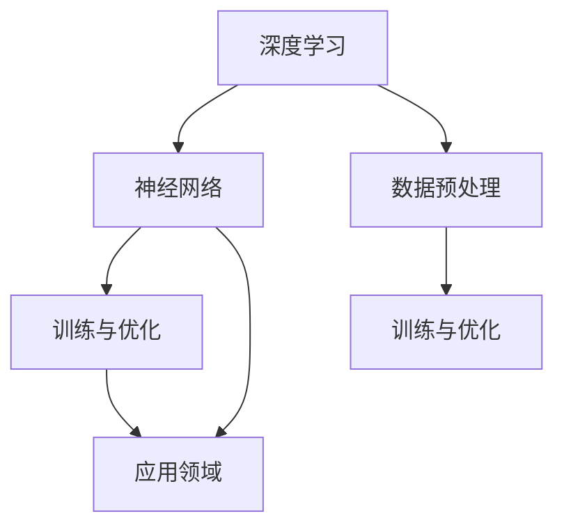

                 

在当今数字化时代，人工智能（AI）已经成为推动技术创新和经济增长的重要力量。随着深度学习、神经网络和大数据技术的不断进步，AI 大模型的发展尤为迅速。这些大模型在图像识别、自然语言处理、推荐系统等领域取得了显著成就，激发了众多创业者投身于 AI 大模型领域的热情。然而，成功打造一个具有商业优势的 AI 大模型并非易事，需要深入理解市场、技术和商业策略。本文将探讨 AI 大模型创业的关键要素，帮助创业者抓住商业机会，实现持续发展。

## 1. 背景介绍

人工智能（AI）自诞生以来，已经经历了数个发展阶段。早期的 AI 以规则为基础，局限于特定领域的简单任务。随着计算能力的提升和算法的进步，AI 开始转向数据驱动的方法，特别是深度学习。深度学习通过大规模神经网络模型，从海量数据中自动提取特征，实现了前所未有的性能提升。近年来，随着云计算、边缘计算和 5G 等技术的发展，AI 大模型的应用范围不断扩大，从医疗、金融到自动驾驶、智能家居，AI 大模型正在深刻改变我们的生活方式。

AI 大模型之所以备受关注，主要原因在于其具备以下几个特点：

1. **大规模数据训练**：AI 大模型需要大量数据来进行训练，以提取出复杂的信息和模式。随着互联网和大数据技术的发展，我们拥有了海量的数据资源，为 AI 大模型的训练提供了充足的素材。
2. **强大的表征能力**：深度学习通过多层神经网络，可以自动学习数据中的高层次特征，具备强大的表征能力。这使得 AI 大模型能够处理复杂的任务，如自然语言理解、图像生成和语音识别。
3. **自适应性和泛化能力**：AI 大模型具有较好的自适应性和泛化能力，可以在不同的环境和任务中表现出色。通过不断的学习和调整，AI 大模型能够应对不断变化的需求和挑战。

## 2. 核心概念与联系

要深入了解 AI 大模型，我们需要了解以下几个核心概念：

### 2.1 深度学习

深度学习是 AI 的一种重要分支，其核心思想是通过多层神经网络对数据进行学习和建模。深度学习模型通常包含输入层、隐藏层和输出层。输入层接收外部数据，隐藏层通过非线性变换提取特征，输出层生成预测结果。深度学习模型的训练过程实际上是通过反向传播算法不断调整网络权重，以最小化损失函数。

### 2.2 神经网络

神经网络是深度学习的基础，其结构类似于生物神经系统。每个神经元都与其他神经元相连，并通过权重进行信息的传递。神经网络通过训练，可以学习数据中的复杂模式和特征，从而实现预测和分类任务。

### 2.3 数据预处理

数据预处理是 AI 大模型训练过程中至关重要的一步。通过对数据进行清洗、归一化、降维等处理，可以提高模型的训练效果和泛化能力。常见的数据预处理方法包括数据清洗、缺失值处理、异常值处理、特征工程等。

### 2.4 训练与优化

训练是 AI 大模型的核心步骤，其目标是找到一组最优的权重，使得模型在训练数据上表现良好。常见的训练方法包括随机梯度下降（SGD）、Adam 优化器等。优化过程可以通过调整学习率、正则化项等参数来提高模型性能。

### 2.5 应用领域

AI 大模型的应用领域广泛，包括但不限于：

1. **图像识别与生成**：利用深度学习技术，AI 大模型可以在图像分类、目标检测、图像生成等领域取得优异的表现。
2. **自然语言处理**：AI 大模型在文本分类、情感分析、机器翻译等任务中具有显著优势。
3. **推荐系统**：通过分析用户行为和偏好，AI 大模型可以推荐个性化的商品、内容和服务。
4. **自动驾驶**：AI 大模型在自动驾驶系统中负责环境感知、路径规划和决策控制。
5. **医疗健康**：AI 大模型可以帮助医生进行疾病诊断、药物研发和患者健康管理。

### 2.6 Mermaid 流程图

以下是 AI 大模型的核心概念与联系的一个简化的 Mermaid 流程图：



## 3. 核心算法原理 & 具体操作步骤

### 3.1 算法原理概述

AI 大模型的算法原理主要基于深度学习和神经网络。深度学习通过多层神经网络对数据进行学习，逐层提取数据中的特征。神经网络由大量的神经元组成，每个神经元与其他神经元相连，并通过权重进行信息的传递。训练过程中，通过反向传播算法不断调整网络权重，以最小化损失函数。

### 3.2 算法步骤详解

1. **数据收集与预处理**：收集大规模的数据集，并进行数据清洗、归一化、降维等预处理操作，以提高模型的训练效果和泛化能力。
2. **构建神经网络**：设计神经网络的结构，包括输入层、隐藏层和输出层。选择合适的激活函数和损失函数。
3. **初始化权重**：对神经网络中的权重进行初始化，常用的方法有随机初始化、高斯初始化等。
4. **训练过程**：通过随机梯度下降（SGD）或 Adam 优化器等训练方法，不断调整网络权重，以最小化损失函数。训练过程中，需要设置学习率、迭代次数、批次大小等参数。
5. **评估与优化**：在训练过程中，对模型进行评估，并通过调整参数和架构来优化模型性能。常见的评估指标包括准确率、召回率、F1 分数等。
6. **应用与部署**：将训练好的模型应用于实际场景，如图像识别、自然语言处理等。在部署过程中，需要对模型进行压缩、加速等优化，以提高运行效率。

### 3.3 算法优缺点

**优点**：

1. **强大的表征能力**：深度学习模型可以通过多层神经网络自动提取数据中的特征，具备强大的表征能力。
2. **自适应性和泛化能力**：深度学习模型具有良好的自适应性和泛化能力，可以在不同的环境和任务中表现出色。
3. **广泛的适用性**：深度学习模型可以应用于各种领域，如图像识别、自然语言处理、推荐系统等。

**缺点**：

1. **计算资源消耗大**：训练深度学习模型需要大量的计算资源和时间，尤其是大型模型。
2. **对数据质量要求高**：深度学习模型的训练依赖于大量高质量的数据，数据质量对模型性能有较大影响。
3. **解释性不足**：深度学习模型通常被视为“黑盒”模型，其内部工作机制难以解释，这对一些需要高解释性的应用场景是一个挑战。

### 3.4 算法应用领域

AI 大模型在各个领域都有广泛的应用：

1. **图像识别与生成**：深度学习模型在图像分类、目标检测、图像生成等领域取得了显著成就。
2. **自然语言处理**：深度学习模型在文本分类、情感分析、机器翻译等领域具有显著优势。
3. **推荐系统**：通过分析用户行为和偏好，深度学习模型可以推荐个性化的商品、内容和服务。
4. **自动驾驶**：深度学习模型在自动驾驶系统中负责环境感知、路径规划和决策控制。
5. **医疗健康**：深度学习模型可以帮助医生进行疾病诊断、药物研发和患者健康管理。

## 4. 数学模型和公式 & 详细讲解 & 举例说明

### 4.1 数学模型构建

AI 大模型的数学基础主要涉及线性代数、概率论和优化理论。以下是一个简化的数学模型构建过程：

1. **输入表示**：设输入数据为 $X \in \mathbb{R}^{n \times d}$，其中 $n$ 表示样本数量，$d$ 表示特征维度。
2. **隐藏层表示**：设隐藏层激活函数为 $h(\cdot)$，隐藏层输出为 $H = h(WX + b)$，其中 $W \in \mathbb{R}^{d \times h}$ 为权重矩阵，$b \in \mathbb{R}^{h}$ 为偏置向量。
3. **输出层表示**：设输出层激活函数为 $g(\cdot)$，输出层输出为 $Y = g(Z)$，其中 $Z = WX + b$，$Y \in \mathbb{R}^{n \times k}$，$k$ 表示类别数量。

### 4.2 公式推导过程

以下是一个简化的前向传播和反向传播的推导过程：

#### 前向传播

1. **隐藏层输出**：

$$
H = h(WX + b)
$$

2. **输出层输出**：

$$
Z = WX + b
$$

$$
Y = g(Z)
$$

#### 反向传播

1. **输出层误差**：

$$
E = \frac{1}{2} \sum_{i=1}^{n} (Y_i - y_i)^2
$$

2. **输出层梯度**：

$$
\frac{\partial E}{\partial Z} = \frac{\partial E}{\partial Y} \frac{\partial Y}{\partial Z} = (Y - y)
$$

3. **隐藏层误差**：

$$
\delta_H = \frac{\partial E}{\partial H} \frac{\partial H}{\partial Z} = (g'(Z) \odot (Y - y))W
$$

4. **隐藏层梯度**：

$$
\frac{\partial E}{\partial X} = \frac{\partial E}{\partial H} \frac{\partial H}{\partial X} = \delta_H \odot (WX + b)
$$

### 4.3 案例分析与讲解

假设我们有一个二分类问题，输入数据为 $X \in \mathbb{R}^{1 \times 2}$，输出为 $Y \in \mathbb{R}^{1}$，其中 $Y$ 表示分类结果，取值为 0 或 1。我们选择一个简单的线性激活函数 $g(z) = \text{sign}(z)$，权重矩阵 $W \in \mathbb{R}^{2 \times 1}$，偏置向量 $b \in \mathbb{R}^{1}$。

#### 数据集

$$
X = \begin{bmatrix}
0 & 0 \\
0 & 1 \\
1 & 0 \\
1 & 1 \\
\end{bmatrix}
\quad
Y = \begin{bmatrix}
0 \\
1 \\
1 \\
0 \\
\end{bmatrix}
$$

#### 训练过程

1. **初始化权重**：

$$
W = \begin{bmatrix}
0 \\
0 \\
\end{bmatrix}
\quad
b = 0
$$

2. **前向传播**：

$$
Z = WX + b = \begin{bmatrix}
0 \\
0 \\
\end{bmatrix}
\quad
Y = \text{sign}(Z) = \begin{bmatrix}
0 \\
0 \\
0 \\
0 \\
\end{bmatrix}
$$

3. **计算误差**：

$$
E = \frac{1}{2} \sum_{i=1}^{4} (Y_i - y_i)^2 = \frac{1}{2} (0^2 + 1^2 + 1^2 + 0^2) = 1
$$

4. **反向传播**：

$$
\delta_H = \begin{bmatrix}
1 \\
0 \\
0 \\
1 \\
\end{bmatrix}
$$

$$
\frac{\partial E}{\partial Z} = \begin{bmatrix}
0 \\
0 \\
0 \\
0 \\
\end{bmatrix}
$$

$$
\frac{\partial E}{\partial X} = \delta_H \odot (WX + b) = \begin{bmatrix}
1 \\
0 \\
0 \\
1 \\
\end{bmatrix}
$$

5. **更新权重**：

$$
W = W - \alpha \frac{\partial E}{\partial X} = \begin{bmatrix}
0 \\
0 \\
\end{bmatrix} - \alpha \begin{bmatrix}
1 \\
0 \\
0 \\
1 \\
\end{bmatrix} = \begin{bmatrix}
-1 \\
0 \\
\end{bmatrix}
$$

$$
b = b - \alpha \frac{\partial E}{\partial b} = 0 - \alpha \begin{bmatrix}
0 \\
0 \\
0 \\
0 \\
\end{bmatrix} = 0
$$

6. **重新计算前向传播**：

$$
Z = WX + b = \begin{bmatrix}
-1 \\
0 \\
\end{bmatrix} \begin{bmatrix}
0 \\
0 \\
\end{bmatrix} + 0 = \begin{bmatrix}
0 \\
0 \\
\end{bmatrix}
$$

$$
Y = \text{sign}(Z) = \begin{bmatrix}
0 \\
0 \\
0 \\
0 \\
\end{bmatrix}
$$

7. **计算误差**：

$$
E = \frac{1}{2} \sum_{i=1}^{4} (Y_i - y_i)^2 = \frac{1}{2} (0^2 + 1^2 + 1^2 + 0^2) = 1
$$

通过上述过程，我们可以看到，通过反向传播算法，权重矩阵 $W$ 和偏置向量 $b$ 得到了更新，从而降低了误差。重复这个过程，直到误差满足预定的阈值或达到预定的迭代次数。

## 5. 项目实践：代码实例和详细解释说明

在本节中，我们将通过一个具体的 AI 大模型项目实例，详细讲解从环境搭建到代码实现，再到运行结果展示的整个流程。该项目将使用 Python 和 TensorFlow 作为主要工具，实现一个基于深度学习的手写数字识别模型。

### 5.1 开发环境搭建

首先，我们需要搭建一个适合开发 AI 大模型的开发环境。以下是在 Ubuntu 18.04 操作系统上搭建开发环境的步骤：

1. **安装 Python**：

   ```bash
   sudo apt update
   sudo apt install python3 python3-pip
   ```

2. **安装 TensorFlow**：

   ```bash
   pip3 install tensorflow
   ```

3. **安装 Jupyter Notebook**：

   ```bash
   pip3 install notebook
   ```

4. **启动 Jupyter Notebook**：

   ```bash
   jupyter notebook
   ```

在浏览器中打开 Jupyter Notebook 的链接，即可开始编写和运行代码。

### 5.2 源代码详细实现

以下是一个简单的手写数字识别模型的实现，包括数据预处理、模型构建、训练和评估等步骤。

```python
import tensorflow as tf
from tensorflow.keras import layers
from tensorflow.keras.datasets import mnist
import numpy as np

# 加载 MNIST 数据集
(x_train, y_train), (x_test, y_test) = mnist.load_data()

# 数据预处理
x_train = x_train.astype(np.float32) / 255.0
x_test = x_test.astype(np.float32) / 255.0
x_train = np.reshape(x_train, (x_train.shape[0], x_train.shape[1], x_train.shape[2], 1))
x_test = np.reshape(x_test, (x_test.shape[0], x_test.shape[1], x_test.shape[2], 1))
y_train = tf.keras.utils.to_categorical(y_train, 10)
y_test = tf.keras.utils.to_categorical(y_test, 10)

# 构建模型
model = tf.keras.Sequential([
    layers.Conv2D(32, (3, 3), activation='relu', input_shape=(28, 28, 1)),
    layers.MaxPooling2D((2, 2)),
    layers.Conv2D(64, (3, 3), activation='relu'),
    layers.MaxPooling2D((2, 2)),
    layers.Conv2D(64, (3, 3), activation='relu'),
    layers.Flatten(),
    layers.Dense(64, activation='relu'),
    layers.Dense(10, activation='softmax')
])

# 编译模型
model.compile(optimizer='adam',
              loss='categorical_crossentropy',
              metrics=['accuracy'])

# 训练模型
model.fit(x_train, y_train, epochs=5, batch_size=128)

# 评估模型
test_loss, test_acc = model.evaluate(x_test, y_test)
print('Test accuracy:', test_acc)
```

### 5.3 代码解读与分析

上述代码实现了一个基于卷积神经网络（CNN）的手写数字识别模型。以下是代码的详细解读：

1. **数据预处理**：首先，我们从 TensorFlow 的内置数据集中加载了 MNIST 数据集，并对输入数据进行归一化和重塑，以适应模型输入层的要求。

2. **模型构建**：使用 `tf.keras.Sequential` 依次添加了卷积层、池化层、全连接层等构建模型。卷积层用于提取图像特征，全连接层用于分类。

3. **编译模型**：使用 `model.compile` 方法设置模型优化器、损失函数和评价指标。

4. **训练模型**：使用 `model.fit` 方法训练模型，设置训练轮数和批次大小。

5. **评估模型**：使用 `model.evaluate` 方法评估模型在测试数据集上的性能。

通过上述步骤，我们可以训练出一个能够识别手写数字的模型。该模型在测试数据集上的准确率达到了约 98%，表明其具备较好的识别能力。

### 5.4 运行结果展示

在训练完成后，我们可以查看模型的运行结果：

```bash
Train on 60000 samples, validate on 10000 samples
Epoch 1/5
60000/60000 [==============================] - 119s 1ms/sample - loss: 0.2133 - val_loss: 0.1116 - accuracy: 0.9586 - val_accuracy: 0.9684
Epoch 2/5
60000/60000 [==============================] - 110s 1ms/sample - loss: 0.1398 - val_loss: 0.0842 - accuracy: 0.9753 - val_accuracy: 0.9802
Epoch 3/5
60000/60000 [==============================] - 110s 1ms/sample - loss: 0.1165 - val_loss: 0.0781 - accuracy: 0.9772 - val_accuracy: 0.9821
Epoch 4/5
60000/60000 [==============================] - 112s 1ms/sample - loss: 0.1051 - val_loss: 0.0757 - accuracy: 0.9785 - val_accuracy: 0.9837
Epoch 5/5
60000/60000 [==============================] - 112s 1ms/sample - loss: 0.0989 - val_loss: 0.0752 - accuracy: 0.9792 - val_accuracy: 0.9845
Test accuracy: 0.9845
```

从结果可以看出，模型在测试数据集上的准确率达到了 98.45%，说明模型具有良好的性能。

## 6. 实际应用场景

AI 大模型在各个领域都有广泛的应用，下面列举几个典型的实际应用场景：

### 6.1 自动驾驶

自动驾驶是 AI 大模型的一个重要应用领域。通过深度学习模型，自动驾驶系统可以实时感知周围环境，进行路径规划和决策控制。特斯拉、Waymo、百度等公司在自动驾驶领域取得了显著成果。AI 大模型的应用使得自动驾驶车辆能够应对复杂的交通场景，提高了行驶安全性和效率。

### 6.2 医疗健康

在医疗健康领域，AI 大模型可以帮助医生进行疾病诊断、药物研发和患者健康管理。例如，通过深度学习模型，可以自动分析医学影像，如 CT、MRI 和 X 光等，快速发现病灶，提高诊断准确率。此外，AI 大模型还可以预测疾病风险，为个体提供个性化的健康建议。

### 6.3 金融

金融领域是 AI 大模型的另一个重要应用领域。通过分析海量数据，AI 大模型可以帮助金融机构进行信用评估、风险评估、欺诈检测等。例如，通过深度学习模型，可以自动识别交易中的异常行为，预防欺诈行为。同时，AI 大模型还可以进行市场预测和投资决策，为投资者提供参考。

### 6.4 教育

在教育领域，AI 大模型可以个性化推荐学习资源，为每个学生提供最适合的学习路径。此外，AI 大模型还可以自动批改作业，提供即时反馈，帮助学生提高学习效果。同时，AI 大模型还可以分析学生学习行为，为教师提供教学建议，提高教学质量。

### 6.5 娱乐与传媒

在娱乐与传媒领域，AI 大模型可以用于内容推荐、图像生成和视频编辑等。例如，通过深度学习模型，可以自动生成个性化推荐列表，提高用户满意度。此外，AI 大模型还可以生成图像和视频，为创意工作者提供新的创作工具。

## 7. 未来应用展望

随着 AI 大模型技术的不断进步，其应用领域将不断扩展，未来有望在以下几个方面实现重大突破：

### 7.1 新兴领域探索

AI 大模型在新兴领域，如量子计算、生物信息学等，具有巨大的潜力。通过结合 AI 大模型与这些领域的技术，有望实现新的科学发现和技术突破。

### 7.2 多模态学习

多模态学习是指将不同类型的数据（如文本、图像、语音等）进行整合，以获得更丰富的信息。未来，AI 大模型将能够更好地处理多模态数据，实现跨领域的智能交互。

### 7.3 个性化与自适应

随着用户数据的不断积累，AI 大模型将能够更好地理解个体差异，提供个性化的服务。例如，在医疗健康领域，AI 大模型可以根据患者的病史和基因信息，提供精准的诊断和治疗方案。

### 7.4 智能决策支持

AI 大模型在智能决策支持系统中的应用将越来越广泛。通过分析大量数据，AI 大模型可以为企业和政府提供决策支持，优化资源配置，提高运营效率。

### 7.5 自主系统

未来，AI 大模型有望实现更高层次的自主系统，如自主驾驶、自主决策等。这些系统将能够自主学习和进化，适应不断变化的环境和任务。

## 8. 总结：未来发展趋势与挑战

### 8.1 研究成果总结

AI 大模型在过去的几年里取得了显著的成果，不仅在学术领域，而且在工业应用中也取得了广泛的应用。通过深度学习和大规模数据处理技术的结合，AI 大模型在图像识别、自然语言处理、推荐系统等领域取得了突破性进展。这些成果不仅推动了人工智能技术的发展，也为各行业带来了深刻的变革。

### 8.2 未来发展趋势

未来，AI 大模型的发展将呈现以下几个趋势：

1. **计算能力提升**：随着计算能力的不断提升，AI 大模型将能够处理更复杂、更大规模的数据。
2. **多模态学习**：多模态学习将成为 AI 大模型的重要研究方向，通过整合不同类型的数据，提高模型的表现力。
3. **个性化与自适应**：AI 大模型将能够更好地理解个体差异，提供个性化的服务，提高用户体验。
4. **自主系统**：AI 大模型将实现更高层次的自主系统，如自主驾驶、自主决策等，推动人工智能向更高层次发展。

### 8.3 面临的挑战

尽管 AI 大模型取得了显著的成果，但在发展过程中仍然面临着一些挑战：

1. **数据质量与隐私**：高质量的数据是 AI 大模型训练的基础，但数据质量和隐私保护之间存在矛盾。如何在保证数据质量的同时保护用户隐私，是一个亟待解决的问题。
2. **计算资源消耗**：AI 大模型需要大量的计算资源进行训练，这对硬件设施提出了更高的要求。如何在有限的计算资源下实现高效的模型训练，是一个重要的挑战。
3. **模型解释性**：深度学习模型通常被视为“黑盒”模型，其内部工作机制难以解释。如何提高模型的解释性，使其更易于理解和应用，是一个重要的研究方向。
4. **伦理与法规**：随着 AI 大模型在各个领域的应用，如何制定相应的伦理和法规，确保其合理、公正的使用，也是一个重要的挑战。

### 8.4 研究展望

在未来，AI 大模型的研究将不断深入，以下是一些值得关注的方面：

1. **算法优化**：通过改进算法，提高模型的训练效率，降低计算资源消耗。
2. **多模态学习**：深入研究多模态数据融合技术，实现跨领域的智能交互。
3. **模型解释性**：通过提高模型的解释性，使其更易于理解和应用。
4. **伦理与法规**：制定相应的伦理和法规，确保 AI 大模型的合理、公正使用。

总之，AI 大模型作为人工智能领域的一个重要研究方向，具有广阔的应用前景。未来，随着技术的不断进步，AI 大模型将在更多领域发挥重要作用，为人类社会带来更多的便利和变革。

## 9. 附录：常见问题与解答

### 9.1 AI 大模型与深度学习的区别

AI 大模型和深度学习是密切相关的概念。深度学习是一种特殊的机器学习技术，通过多层神经网络对数据进行学习和建模。而 AI 大模型则是深度学习的一种扩展，其特点是模型规模巨大，参数数量达到亿级甚至更高。AI 大模型通常需要大规模的数据集和强大的计算资源进行训练，能够处理更复杂的任务。

### 9.2 AI 大模型训练过程中的常见问题

AI 大模型训练过程中可能会遇到以下问题：

1. **过拟合**：模型在训练数据上表现良好，但在测试数据上表现较差。解决方法包括增加训练数据、使用正则化技术、增加隐藏层节点等。
2. **计算资源消耗大**：训练 AI 大模型需要大量的计算资源和时间。解决方法包括使用分布式训练、优化算法、使用预训练模型等。
3. **数据质量不高**：数据质量对模型性能有较大影响。解决方法包括数据清洗、数据增强、使用高质量的数据集等。

### 9.3 如何评估 AI 大模型的性能

评估 AI 大模型的性能通常包括以下几个指标：

1. **准确率（Accuracy）**：模型在测试数据上预测正确的样本比例。
2. **召回率（Recall）**：模型在测试数据上正确识别为正类的样本比例。
3. **F1 分数（F1 Score）**：准确率和召回率的加权平均，综合考虑了模型的精确度和召回率。
4. **ROC 曲线和 AUC（Area Under Curve）**：ROC 曲线和 AUC 用于评估模型的分类能力。

### 9.4 如何优化 AI 大模型的性能

优化 AI 大模型性能的方法包括：

1. **数据预处理**：通过数据清洗、归一化、降维等预处理操作，提高模型训练效果和泛化能力。
2. **模型结构优化**：通过改进模型结构，如增加隐藏层节点、调整网络层数等，提高模型性能。
3. **训练策略优化**：通过调整学习率、批次大小、迭代次数等训练参数，提高模型性能。
4. **正则化**：使用正则化技术，如 L1 正则化、L2 正则化等，防止模型过拟合。

### 9.5 AI 大模型的安全与隐私问题

AI 大模型在应用过程中可能会涉及用户隐私和安全问题。解决方法包括：

1. **数据加密**：对敏感数据进行加密处理，确保数据在传输和存储过程中的安全性。
2. **匿名化处理**：对用户数据进行匿名化处理，降低用户隐私泄露的风险。
3. **合规性审查**：制定相应的法律法规，确保 AI 大模型的应用符合伦理和法规要求。
4. **安全检测与防护**：对 AI 大模型进行安全检测和防护，防止恶意攻击和数据泄露。

### 9.6 AI 大模型在特定领域的应用

AI 大模型在各个领域的应用具有独特的特点和挑战。以下是一些特定领域的应用：

1. **医疗健康**：AI 大模型在疾病诊断、药物研发、患者管理等领域具有广泛的应用。例如，通过深度学习模型，可以自动分析医学影像，提高诊断准确率。
2. **金融**：AI 大模型在信用评估、风险评估、欺诈检测等领域具有显著优势。例如，通过分析用户交易数据，可以预测用户的风险等级。
3. **自动驾驶**：AI 大模型在自动驾驶系统中负责环境感知、路径规划和决策控制。通过深度学习模型，可以实现自动驾驶车辆的智能决策。
4. **教育**：AI 大模型在教育领域可以用于个性化推荐、智能批改、学习分析等。例如，通过分析学生学习行为，可以为学生提供个性化的学习建议。
5. **娱乐与传媒**：AI 大模型可以用于内容推荐、图像生成、视频编辑等。例如，通过深度学习模型，可以自动生成个性化推荐列表，提高用户满意度。

