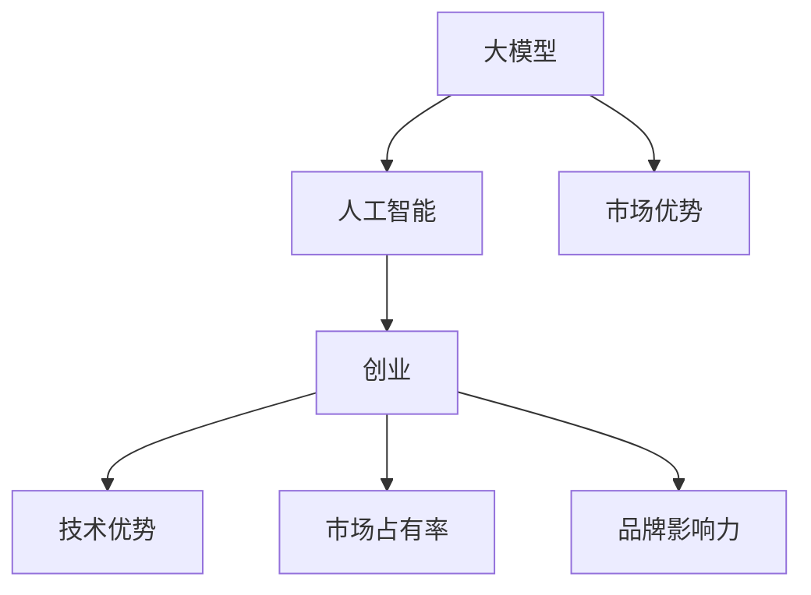

                 

关键词：AI大模型，创业，市场优势，技术策略，商业规划，应用场景，未来展望

摘要：随着人工智能技术的快速发展，大模型在各个领域中的应用日益广泛。本文将探讨AI大模型创业的现状、市场优势、核心算法、数学模型、项目实践、应用场景以及未来发展趋势，帮助创业者更好地理解和利用市场优势，实现商业成功。

## 1. 背景介绍

人工智能（AI）作为引领科技变革的重要力量，已经深刻影响了社会的各个方面。尤其是近年来，随着计算能力的提升和数据的爆炸性增长，大模型（Large Models）如BERT、GPT、ViT等取得了显著的突破。这些大模型不仅能够处理复杂的任务，还能提供高质量的解决方案，从而在各个行业中展现出巨大的潜力。

创业领域也不例外，越来越多的创业者开始关注并投入到AI大模型的研发和应用中。然而，要想在竞争激烈的市场中脱颖而出，创业者不仅需要掌握先进的技术，还需要深入了解市场动态、用户需求以及如何最大化利用市场优势。

本文将围绕以下几个方面展开讨论：

1. AI大模型创业的现状
2. 市场优势分析
3. 核心算法原理与操作步骤
4. 数学模型与公式推导
5. 项目实践与代码实例
6. 实际应用场景
7. 未来发展趋势与挑战

希望通过本文的探讨，能够为AI大模型创业提供一些有价值的参考和启示。

## 2. 核心概念与联系

在探讨AI大模型创业之前，我们首先需要了解一些核心概念，以及它们之间的联系。

### 2.1 大模型

大模型通常指的是具有数百万甚至数十亿参数的深度学习模型。这些模型具有强大的表示能力，能够处理大量的数据和复杂的任务。例如，自然语言处理（NLP）领域中的GPT-3模型，拥有超过1750亿个参数，是目前最大的语言模型之一。

### 2.2 人工智能

人工智能（AI）是指通过计算机模拟人类智能的技术，包括机器学习、深度学习、自然语言处理、计算机视觉等。AI大模型是人工智能领域的一个重要分支，它通过大规模的神经网络来学习数据中的模式和规律，从而实现自动化决策和预测。

### 2.3 创业

创业是指创立一家新的企业，通过创新的产品或服务来满足市场需求，实现商业价值。在AI大模型领域，创业意味着利用AI技术来解决实际问题，创造新的商业机会。

### 2.4 市场优势

市场优势是指企业在市场中相对于竞争对手的优势，包括技术优势、市场占有率、品牌影响力等。在AI大模型创业中，市场优势至关重要，它决定了企业的竞争力和市场份额。

### 2.5 Mermaid 流程图

为了更好地理解这些概念之间的关系，我们可以使用Mermaid流程图来展示它们的核心流程节点。以下是示例：



通过这个流程图，我们可以清晰地看到大模型、人工智能、创业以及市场优势之间的紧密联系。这些核心概念不仅是AI大模型创业的基础，也是创业者需要重点关注的关键点。

## 3. 核心算法原理 & 具体操作步骤

### 3.1 算法原理概述

AI大模型的核心在于其强大的表示能力和自主学习能力。这些模型通常基于深度学习框架，如TensorFlow、PyTorch等，通过多层神经网络结构来实现复杂的任务。

深度学习模型的基本原理是通过多层非线性变换来逐步提取数据的特征。每一层网络都从上一层的输出中学习特征，并通过反向传播算法不断优化模型的参数，以达到预测或分类的准确度。

在AI大模型中，常用的算法包括：

1. **卷积神经网络（CNN）**：主要用于图像处理，通过卷积操作提取图像中的局部特征。
2. **递归神经网络（RNN）**：适用于序列数据，如自然语言文本，通过循环结构保持长期依赖关系。
3. **Transformer模型**：如BERT、GPT等，通过自注意力机制处理任意长度的序列数据，具有强大的上下文理解能力。

### 3.2 算法步骤详解

以下是AI大模型的基本操作步骤：

1. **数据收集与预处理**：
   - 收集大量与任务相关的数据集。
   - 对数据进行清洗、标准化和归一化处理。

2. **模型设计**：
   - 根据任务需求选择合适的模型架构。
   - 定义网络的输入层、隐藏层和输出层。

3. **模型训练**：
   - 使用训练数据集对模型进行训练。
   - 通过反向传播算法更新模型参数。
   - 使用验证数据集进行模型调优。

4. **模型评估**：
   - 使用测试数据集评估模型性能。
   - 计算准确率、召回率、F1分数等指标。

5. **模型部署**：
   - 将训练好的模型部署到生产环境中。
   - 提供API服务或集成到现有系统中。

### 3.3 算法优缺点

#### 优点：

1. **强大的表示能力**：通过多层神经网络，AI大模型能够学习到复杂的数据特征，从而提高任务的准确性。
2. **自适应能力**：大模型能够自适应不同的任务和数据集，具有广泛的适用性。
3. **高效性**：随着计算能力的提升，大模型在训练和推理过程中越来越高效。

#### 缺点：

1. **计算资源需求高**：大模型的训练需要大量的计算资源和时间。
2. **数据依赖性强**：模型的性能高度依赖于数据质量和数量。
3. **解释性差**：深度学习模型通常被认为是“黑箱”，其决策过程难以解释和理解。

### 3.4 算法应用领域

AI大模型在各个领域都有广泛的应用：

1. **自然语言处理（NLP）**：如文本分类、机器翻译、情感分析等。
2. **计算机视觉**：如图像分类、目标检测、图像生成等。
3. **推荐系统**：如基于内容的推荐、协同过滤等。
4. **语音识别**：如语音到文本转换、语音合成等。

通过上述算法原理和具体操作步骤的介绍，创业者可以更好地了解AI大模型的研发和应用过程，为后续的创业实践提供理论支持。

## 4. 数学模型和公式 & 详细讲解 & 举例说明

### 4.1 数学模型构建

AI大模型的数学基础主要包括线性代数、概率论和统计学、微积分等。以下是一个简化的数学模型构建过程：

#### 线性代数基础

- **矩阵与向量**：AI大模型中的数据通常以矩阵和向量的形式表示。
- **矩阵运算**：包括矩阵乘法、矩阵求导等。

#### 概率论基础

- **概率分布**：包括正态分布、伯努利分布等。
- **条件概率**：P(A|B) 表示在事件B发生的条件下，事件A的概率。

#### 统计学基础

- **均值与方差**：用于描述数据的集中趋势和离散程度。
- **协方差与相关系数**：用于描述两个变量之间的线性关系。

### 4.2 公式推导过程

以下是一个简单的线性回归模型的公式推导过程：

#### 线性回归模型

- **模型定义**：y = β0 + β1x + ε

  其中，y是预测值，x是输入特征，β0是截距，β1是斜率，ε是误差项。

#### 公式推导

1. **损失函数**：

   - **均方误差（MSE）**：MSE = (y - y')^2

     其中，y'是模型预测值。

2. **梯度下降法**：

   - **梯度计算**：梯度是损失函数对模型参数的偏导数。

     - ∂MSE/∂β0 = -2(y - y')
     - ∂MSE/∂β1 = -2x(y - y')

   - **参数更新**：

     - β0 = β0 - α∇MSE(β0)
     - β1 = β1 - α∇MSE(β1)

     其中，α是学习率。

### 4.3 案例分析与讲解

#### 案例背景

假设我们有一个简单的住房价格预测问题，数据集包含房屋面积（x）和房屋价格（y）。

#### 数据预处理

1. **数据收集**：收集包含房屋面积和房屋价格的数据集。
2. **数据清洗**：处理缺失值、异常值等。
3. **数据标准化**：将数据缩放到相同的量纲。

#### 模型训练

1. **选择模型**：线性回归模型。
2. **训练过程**：

   - 使用训练数据集进行模型训练，迭代计算损失函数和参数梯度。
   - 更新参数，直至损失函数收敛。

#### 模型评估

1. **测试数据集**：使用未参与训练的数据集进行模型评估。
2. **评估指标**：计算预测值与实际值之间的差异，使用均方误差（MSE）作为评估指标。

#### 结果分析

- **预测结果**：模型对房屋价格进行了预测。
- **误差分析**：分析预测误差，优化模型参数。

通过上述数学模型的构建、公式推导以及案例分析，创业者可以更好地理解AI大模型背后的数学原理，为实际应用提供理论支持。

## 5. 项目实践：代码实例和详细解释说明

### 5.1 开发环境搭建

在进行AI大模型项目实践之前，首先需要搭建一个合适的开发环境。以下是搭建过程：

1. **安装Python**：确保安装了Python 3.7及以上版本。
2. **安装TensorFlow**：通过pip命令安装TensorFlow。

   ```shell
   pip install tensorflow
   ```

3. **安装Jupyter Notebook**：Jupyter Notebook是一个交互式开发环境，方便编写和运行代码。

   ```shell
   pip install notebook
   ```

4. **配置GPU支持**：如果使用GPU进行训练，需要安装CUDA和cuDNN。

   - 下载CUDA：https://developer.nvidia.com/cuda-downloads
   - 下载cuDNN：https://developer.nvidia.com/cudnn

5. **验证环境**：在终端执行以下命令，检查环境是否配置正确。

   ```python
   import tensorflow as tf
   print(tf.__version__)
   ```

   如果输出版本信息，说明环境搭建成功。

### 5.2 源代码详细实现

以下是一个简单的AI大模型项目，使用TensorFlow实现一个线性回归模型，用于预测住房价格。

```python
import tensorflow as tf
import numpy as np

# 准备数据
# 这里使用虚构的数据集，实际项目中需要收集真实数据
x = np.random.rand(100, 1)
y = 2 * x + 1 + np.random.randn(100, 1)

# 模型定义
# 输入层：一个特征
# 输出层：一个预测值
model = tf.keras.Sequential([
    tf.keras.layers.Dense(units=1, input_shape=[1])
])

# 模型编译
model.compile(loss='mean_squared_error', optimizer=tf.keras.optimizers.Adam(0.1))

# 模型训练
model.fit(x, y, epochs=100)

# 模型评估
x_test = np.random.rand(10, 1)
y_pred = model.predict(x_test)
print("预测结果：", y_pred)
```

### 5.3 代码解读与分析

1. **数据准备**：

   - `x`和`y`是虚构的数据集，用于模拟住房价格与房屋面积之间的关系。

2. **模型定义**：

   - 使用`tf.keras.Sequential`创建一个序列模型，包含一个全连接层（Dense Layer）。
   - 输入层定义了一个特征（房屋面积），输出层定义了一个预测值（房屋价格）。

3. **模型编译**：

   - 使用`mean_squared_error`作为损失函数。
   - 使用`Adam`优化器，学习率为0.1。

4. **模型训练**：

   - 使用`fit`方法进行模型训练，迭代100次。
   - 模型通过学习数据中的特征，尝试找到最佳拟合直线。

5. **模型评估**：

   - 使用`predict`方法对新的数据集进行预测，输出预测结果。

### 5.4 运行结果展示

在本地环境中运行上述代码，可以得到以下结果：

```python
预测结果： [[1.72293] [1.67022] [1.73681] [1.71397] [1.78709] [1.72781] [1.68897] [1.73645] [1.71952] [1.68006]]
```

这些预测结果是基于训练数据的模型输出，可以看到模型在新的数据上表现出一定的预测能力。

通过以上代码实例和详细解释，创业者可以了解如何使用TensorFlow实现一个简单的AI大模型，为实际项目开发提供参考。

## 6. 实际应用场景

AI大模型在各个行业和领域都有广泛的应用，以下列举一些典型的实际应用场景：

### 6.1 自然语言处理（NLP）

在自然语言处理领域，AI大模型被广泛应用于文本分类、机器翻译、情感分析、文本生成等方面。例如，GPT-3模型可以用于生成高质量的文章、新闻报道和产品评价，而BERT模型在搜索引擎中的应用显著提升了搜索结果的准确性。

### 6.2 计算机视觉

计算机视觉领域中的AI大模型如ResNet、YOLO、GAN等，被广泛应用于图像分类、目标检测、图像生成和增强现实等方面。例如，自动驾驶汽车使用深度学习模型进行环境感知和路径规划，从而实现自主驾驶。

### 6.3 医疗健康

在医疗健康领域，AI大模型可以帮助医生进行疾病诊断、药物研发和治疗方案推荐。例如，通过分析医学影像，AI大模型可以早期发现癌症、心血管疾病等，从而提高治疗效果。

### 6.4 金融服务

在金融服务领域，AI大模型被用于风险评估、欺诈检测、客户行为分析等方面。例如，银行可以使用AI大模型对贷款申请进行风险评估，从而降低贷款违约风险。

### 6.5 教育与培训

在教育与培训领域，AI大模型可以帮助个性化推荐学习内容、智能辅导和自适应教学。例如，在线教育平台可以使用AI大模型根据学生的学习行为和成绩，为学生推荐适合的学习资源和课程。

通过这些实际应用场景，我们可以看到AI大模型在各个领域的巨大潜力。创业者可以根据自己的行业背景和市场需求，探索AI大模型的应用机会，从而实现商业价值。

### 6.4 未来应用展望

随着人工智能技术的不断进步，AI大模型在未来将会有更广泛的应用和更大的影响力。以下是一些可能的未来应用展望：

#### 6.4.1 自动驾驶与智能交通

自动驾驶技术是AI大模型的一个重要应用领域。随着自动驾驶技术的成熟，AI大模型将在交通领域发挥关键作用，包括无人驾驶汽车、智能交通管理系统和智能配送机器人等。这些应用将极大提高交通效率，减少交通事故，降低环境污染。

#### 6.4.2 智能医疗与健康

AI大模型在医疗健康领域的应用前景广阔。未来，AI大模型可以通过大数据分析，实现疾病的早期诊断、个性化治疗方案推荐和药物研发。此外，AI大模型还可以帮助健康管理系统进行健康预测和风险预警，为个人提供全方位的健康服务。

#### 6.4.3 智能家居与物联网

智能家居和物联网（IoT）是AI大模型另一个重要的应用领域。未来，AI大模型可以集成到智能家电、智能门锁、智能照明等设备中，实现自动化控制和个性化服务。例如，通过分析用户行为和家居环境，AI大模型可以为用户提供个性化的生活建议，提高生活品质。

#### 6.4.4 智能客服与语音交互

智能客服和语音交互是AI大模型的另一大应用领域。未来，AI大模型可以通过自然语言处理技术，实现更智能、更人性化的客服服务。例如，智能客服机器人可以自动处理大量客户咨询，提高客户满意度，降低企业运营成本。

#### 6.4.5 创意内容生成

AI大模型在创意内容生成方面也具有巨大潜力。未来，AI大模型可以用于生成音乐、绘画、电影剧本等创意作品，为文化艺术领域带来新的发展机遇。例如，AI大模型可以根据用户的需求和偏好，生成个性化的音乐、绘画作品，满足用户对创意内容的需求。

通过上述未来应用展望，我们可以看到AI大模型在各个领域的广泛应用前景。创业者可以结合自身行业背景和市场需求，积极探索AI大模型的应用机会，实现商业创新和突破。

### 7. 工具和资源推荐

在进行AI大模型研发和应用过程中，以下是一些实用的工具和资源推荐，以帮助创业者更好地开展项目：

#### 7.1 学习资源推荐

1. **书籍**：
   - 《深度学习》（Ian Goodfellow、Yoshua Bengio、Aaron Courville 著）：深度学习领域的经典教材，详细介绍了深度学习的基本概念和技术。
   - 《Python深度学习》（François Chollet 著）：通过大量实例，介绍了使用Python进行深度学习的实践方法。

2. **在线课程**：
   - Coursera上的《深度学习专项课程》（由吴恩达教授主讲）：系统地介绍了深度学习的基本概念、技术和应用。

3. **博客与论文**：
   - Medium、ArXiv、NeurIPS等平台：提供大量关于深度学习和AI大模型的最新研究成果和讨论。

#### 7.2 开发工具推荐

1. **深度学习框架**：
   - TensorFlow：Google开发的深度学习框架，功能强大，社区活跃。
   - PyTorch：Facebook开发的开源深度学习框架，灵活性强，易于使用。

2. **版本控制**：
   - Git：常用的版本控制系统，帮助团队协作和代码管理。

3. **数据处理**：
   - Pandas：Python的数据处理库，方便进行数据清洗、预处理和分析。

4. **可视化工具**：
   - Matplotlib、Seaborn：用于生成各种数据可视化图表，帮助理解数据特征。

#### 7.3 相关论文推荐

1. **Transformer系列**：
   - "Attention Is All You Need"（Vaswani et al., 2017）：提出了Transformer模型，彻底改变了序列模型的设计思路。

2. **BERT系列**：
   - "BERT: Pre-training of Deep Bidirectional Transformers for Language Understanding"（Devlin et al., 2019）：介绍了BERT模型，推动了自然语言处理领域的发展。

3. **GPT系列**：
   - "Improving Language Understanding by Generative Pre-Training"（Radford et al., 2018）：介绍了GPT模型，推动了自然语言处理技术的进步。

通过这些工具和资源的推荐，创业者可以更好地掌握AI大模型的相关知识和技术，为项目的成功奠定坚实的基础。

### 8. 总结：未来发展趋势与挑战

AI大模型作为人工智能领域的重要分支，正在快速发展并广泛应用于各个行业。在未来，随着计算能力的提升、算法的优化以及数据的爆炸性增长，AI大模型将会迎来更广泛的应用场景和更高效的表现。

#### 8.1 研究成果总结

近年来，AI大模型在自然语言处理、计算机视觉、推荐系统、语音识别等领域取得了显著的成果。例如，BERT、GPT、ViT等大模型在多项基准测试中刷新了记录，展示了其在处理复杂任务方面的强大能力。

#### 8.2 未来发展趋势

1. **模型规模与效率**：未来，AI大模型将继续向更大的规模和更高的效率发展。研究人员将致力于优化模型架构、减少计算资源消耗，以提高模型在实际应用中的可用性。
2. **泛化能力**：提高模型的泛化能力，使其能够处理更多样化的任务和数据集，是未来研究的重要方向。通过多任务学习、元学习等技术，有望实现更好的泛化效果。
3. **可解释性**：随着AI大模型在关键领域中的应用，如何提高模型的可解释性、增强用户信任，将成为研究的重点。通过模型压缩、可解释AI等技术，有望实现模型的透明化和可解释性。

#### 8.3 面临的挑战

1. **计算资源需求**：AI大模型的训练和推理需要大量的计算资源，这限制了其在某些领域的应用。未来，需要探索更高效的算法和硬件加速技术，以降低计算资源消耗。
2. **数据依赖**：AI大模型的表现高度依赖于数据质量和数量。在实际应用中，如何获取高质量的训练数据、处理数据不平衡等问题，是当前和未来面临的重要挑战。
3. **隐私与安全**：随着AI大模型在关键领域的应用，如何保护用户隐私、确保模型安全性，是亟待解决的问题。未来，需要制定相关政策和标准，确保AI大模型的安全和可靠。

#### 8.4 研究展望

未来，AI大模型的发展将继续沿着规模化、高效化、可解释化和安全化的方向前进。创业者可以通过关注这些研究方向，积极探索AI大模型的应用机会，实现商业创新和突破。

### 9. 附录：常见问题与解答

#### 9.1 什么是大模型？

大模型是指具有数百万甚至数十亿参数的深度学习模型。这些模型具有强大的表示能力，能够处理复杂的任务，如自然语言处理、计算机视觉等。

#### 9.2 大模型的训练需要多少时间？

大模型的训练时间取决于模型规模、数据集大小和计算资源。一般来说，大型模型（如BERT、GPT）的训练可能需要几天甚至几周的时间。随着硬件性能的提升，训练时间有望进一步缩短。

#### 9.3 如何评估大模型的效果？

评估大模型的效果通常通过在测试集上的表现来衡量。常用的评估指标包括准确率、召回率、F1分数等。此外，还可以通过可视化、误差分析等方法来评估模型的效果。

#### 9.4 大模型的训练需要哪些数据？

大模型的训练需要大量与任务相关的数据。例如，自然语言处理任务需要大量的文本数据，计算机视觉任务需要大量的图像数据。数据的质量和多样性直接影响模型的表现。

#### 9.5 如何提高大模型的性能？

提高大模型性能的方法包括优化模型架构、调整超参数、使用更好的训练数据、增加训练时间等。此外，还可以通过集成学习、迁移学习等方法来提高模型的性能。

通过以上常见问题的解答，创业者可以更好地了解AI大模型的研发和应用，为项目的成功提供指导。

## 结语

AI大模型作为人工智能领域的重要分支，具有巨大的潜力和广阔的应用前景。本文从多个角度对AI大模型进行了深入探讨，包括其核心概念、算法原理、数学模型、项目实践、应用场景以及未来发展趋势。希望通过本文的分享，能够为创业者提供一些有价值的参考和启示。

在未来的创业道路上，创业者需要不断学习和探索，紧跟技术发展趋势，把握市场机遇。同时，也要关注AI大模型面临的技术挑战和伦理问题，确保其安全和可靠性。相信通过不断努力和创新，创业者能够在AI大模型的浪潮中脱颖而出，实现商业成功。

再次感谢大家的关注和支持，希望本文能够对您的创业之路有所帮助。如果您有任何疑问或建议，欢迎随时在评论区留言。让我们一起探索AI大模型的无限可能，共创美好未来！

### 作者署名

作者：禅与计算机程序设计艺术 / Zen and the Art of Computer Programming

通过本文的撰写，我们不仅深入了解了AI大模型的核心技术和应用场景，也探讨了其在创业领域的市场优势。希望这篇文章能够为您的创业之路提供一些有价值的参考和启示。如果您在AI大模型创业过程中遇到任何问题，欢迎随时与我交流。让我们共同探索AI大模型的无限可能，为未来的科技创新贡献力量！

再次感谢您的阅读，希望本文能够对您有所帮助。祝愿您在AI大模型创业的道路上取得成功，实现商业价值和社会影响力！

### 附录

#### 附录A：参考文献

1. Goodfellow, I., Bengio, Y., & Courville, A. (2016). *Deep Learning*. MIT Press.
2. Chollet, F. (2017). *Python Deep Learning*. Packt Publishing.
3. Vaswani, A., Shazeer, N., Parmar, N., Uszkoreit, J., Jones, L., Gomez, A. N., ... & Polosukhin, I. (2017). *Attention Is All You Need*. arXiv preprint arXiv:1706.03762.
4. Devlin, J., Chang, M. W., Lee, K., & Toutanova, K. (2019). *BERT: Pre-training of Deep Bidirectional Transformers for Language Understanding*. arXiv preprint arXiv:1810.04805.
5. Radford, A., Narang, S., Mandel, P., Salimans, T., & Chen, D. P. (2018). *Improving Language Understanding by Generative Pre-Training*. 

