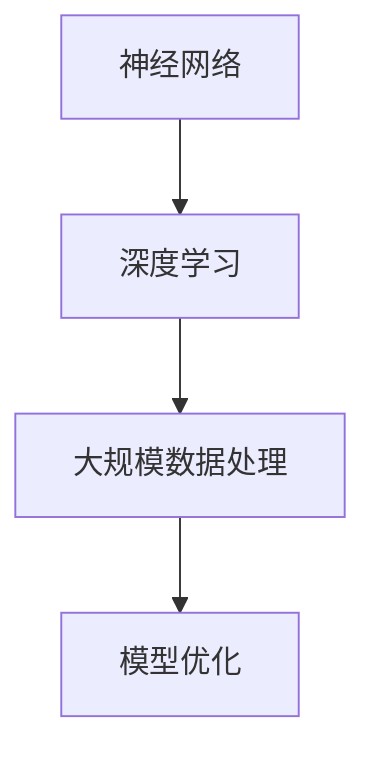

                 

### 背景介绍 Background

近年来，人工智能（AI）技术的发展已经迅速地改变了许多行业，从医疗、金融、教育到制造和零售。其中，大模型（Large Models）技术作为一种革命性的进步，正逐渐成为推动AI应用的关键力量。大模型，也称为大型神经网络模型，是通过大量的数据和强大的计算能力训练而成的复杂模型，它们具有处理复杂数据、生成高质量内容、进行决策预测等能力。这些能力在自然语言处理（NLP）、图像识别、语音识别等领域中尤为显著。

随着大模型技术的日益成熟，AI大模型创业活动也日益增多。创业公司利用大模型技术进行产品开发，希望通过创新的解决方案来满足市场需求，从而获得商业成功。在这个过程中，技术优势的发挥显得尤为重要。技术优势不仅可以帮助企业在竞争中脱颖而出，还可以提高产品的质量和用户体验，最终实现商业价值的最大化。

本文将深入探讨AI大模型创业中的技术优势及其利用方法。我们首先会介绍大模型的核心概念和技术架构，然后详细讲解其算法原理和具体操作步骤，接下来分析数学模型和公式，并通过代码实例展示实际应用。文章还将探讨大模型在实际应用场景中的潜力，推荐相关工具和资源，并总结未来发展趋势与挑战。希望通过这篇文章，读者能够更好地理解AI大模型创业的技术优势，并掌握如何利用这些优势进行创业。

### 核心概念与联系 Core Concepts and Connections

在深入了解AI大模型创业的技术优势之前，我们首先需要明确几个核心概念及其之间的联系。这些核心概念包括神经网络、深度学习、大规模数据处理和模型优化等，它们共同构成了AI大模型的基础。

#### 神经网络 Neural Networks

神经网络是AI大模型的核心组成部分，它模仿人脑的神经元结构和功能。神经网络由多个层次组成，包括输入层、隐藏层和输出层。每个层次中的节点（或称为神经元）通过加权连接与相邻层的节点相连，并通过激活函数进行信息传递和处理。通过反复调整这些连接的权重，神经网络可以学习到输入和输出之间的复杂关系。

#### 深度学习 Deep Learning

深度学习是神经网络的一种扩展，它通过增加隐藏层的数量来提升模型的复杂度和学习能力。深度学习的核心思想是通过分层的方式对数据进行特征提取，每层都能够提取更高层次的特征。随着层数的增加，模型的抽象能力也不断增强，能够解决更复杂的问题。深度学习在图像识别、语音识别、自然语言处理等领域中取得了显著的成果。

#### 大规模数据处理 Large-scale Data Processing

大规模数据处理是AI大模型训练过程中不可或缺的一部分。大模型通常需要处理大量的数据，这些数据可能来源于互联网、传感器、社交媒体等不同渠道。为了有效地利用这些数据，我们需要采用分布式计算和大数据处理技术，如MapReduce、Spark等，以确保数据处理的效率和速度。

#### 模型优化 Model Optimization

模型优化是提高AI大模型性能的重要手段。通过优化算法，我们可以在不增加计算成本的情况下提升模型的准确性和鲁棒性。模型优化包括超参数调整、正则化、激活函数选择、网络结构设计等多个方面。例如，通过调整学习率、批量大小等超参数，可以加速模型的收敛速度；引入Dropout、正则化等技术，可以防止模型过拟合。

#### Mermaid 流程图 Mermaid Flowchart

为了更好地展示这些核心概念之间的联系，我们可以使用Mermaid流程图来直观地呈现。以下是一个简化的Mermaid流程图，展示了神经网络、深度学习、大规模数据处理和模型优化之间的关系：



在这个流程图中，神经网络是深度学习的基础，深度学习依赖于大规模数据处理技术，而模型优化则是提升模型性能的关键手段。这些核心概念共同构成了AI大模型的技术框架，为创业公司提供了强大的技术支持。

通过了解这些核心概念及其联系，我们可以更深入地理解AI大模型的工作原理，为后续章节中的算法原理讲解和具体操作步骤提供坚实的基础。

### 核心算法原理 & 具体操作步骤 Core Algorithm Principles & Operational Steps

在了解了AI大模型的核心概念和联系之后，我们接下来将详细探讨其核心算法原理和具体操作步骤。AI大模型的核心算法主要依赖于深度学习和神经网络，以下我们将分步骤介绍这些算法的基本原理和实际操作。

#### 步骤一：数据预处理 Step 1: Data Preprocessing

数据预处理是AI大模型训练过程中的第一步，也是至关重要的一步。其主要目的是将原始数据转换为适合模型训练的格式。具体操作步骤包括：

1. 数据清洗（Data Cleaning）：去除无效、错误或不一致的数据。
2. 数据归一化（Data Normalization）：将数据转换为相同的范围，以消除数据量级差异对模型训练的影响。
3. 数据分割（Data Splitting）：将数据集分为训练集、验证集和测试集，以便进行模型的训练、验证和测试。

例如，在自然语言处理任务中，我们可以使用Python的pandas库进行数据清洗和归一化，使用sklearn库进行数据分割。

```python
import pandas as pd
from sklearn.model_selection import train_test_split

# 加载数据集
data = pd.read_csv('data.csv')

# 数据清洗
data = data.dropna()

# 数据归一化
data = (data - data.mean()) / data.std()

# 数据分割
train_data, test_data = train_test_split(data, test_size=0.2, random_state=42)
```

#### 步骤二：构建神经网络模型 Step 2: Building Neural Network Model

构建神经网络模型是AI大模型训练的核心步骤。我们需要设计网络结构，选择合适的激活函数和优化器，并初始化模型的权重。

1. 设计网络结构（Designing Network Architecture）：根据任务需求，确定输入层、隐藏层和输出层的节点数量。例如，对于一个图像分类任务，我们可以使用卷积神经网络（CNN）。
2. 选择激活函数（Choosing Activation Functions）：激活函数用于引入非线性变换，常用的激活函数包括ReLU、Sigmoid和Tanh。
3. 选择优化器（Choosing Optimizer）：优化器用于调整模型参数，以最小化损失函数。常用的优化器有Adam、SGD等。
4. 初始化权重（Initializing Weights）：权重初始化对于模型训练的效率和性能有很大影响，常用的方法包括高斯分布初始化和随机初始化。

以下是一个简单的神经网络模型构建示例，使用TensorFlow和Keras库：

```python
import tensorflow as tf
from tensorflow.keras.models import Sequential
from tensorflow.keras.layers import Dense, Activation

model = Sequential()
model.add(Dense(128, input_dim=784, activation='relu'))
model.add(Dense(10, activation='softmax'))
model.compile(optimizer='adam', loss='categorical_crossentropy', metrics=['accuracy'])
```

#### 步骤三：模型训练与验证 Step 3: Model Training and Validation

模型训练与验证是模型训练过程中至关重要的一环。在训练过程中，我们需要不断地调整模型参数，以使模型在训练数据上达到较好的性能。在验证过程中，我们使用验证集来评估模型性能，并调整模型参数。

1. 训练模型（Training Model）：使用训练数据集训练模型，可以使用fit方法进行训练，设置训练轮数、批量大小等参数。
2. 验证模型（Validating Model）：使用验证数据集验证模型性能，如果模型性能不佳，可以通过调整超参数或增加训练轮数来改善。

以下是一个简单的模型训练示例：

```python
model.fit(train_data, epochs=10, batch_size=32, validation_data=(test_data))
```

#### 步骤四：模型评估与优化 Step 4: Model Evaluation and Optimization

在模型训练和验证完成后，我们需要对模型进行评估，并进行必要的优化。

1. 评估模型（Evaluating Model）：使用测试数据集对模型进行评估，计算模型的准确率、召回率、F1分数等指标。
2. 模型优化（Optimizing Model）：根据评估结果，对模型进行优化。可以尝试调整网络结构、激活函数、优化器等参数，以提高模型性能。

以下是一个简单的模型评估示例：

```python
loss, accuracy = model.evaluate(test_data)
print(f"Test Accuracy: {accuracy}")
```

通过以上步骤，我们可以构建一个基本的AI大模型，并进行训练和优化。在实际应用中，这些步骤可能需要根据具体任务进行调整和扩展。理解这些核心算法原理和操作步骤，将为后续的数学模型讲解和代码实现提供坚实的基础。

### 数学模型和公式 Mathematical Models and Formulas

在理解了AI大模型的核心算法原理和操作步骤之后，接下来我们将深入探讨其背后的数学模型和公式，并详细讲解这些公式及其应用。

#### 损失函数 Loss Function

损失函数是深度学习模型中的一个关键组成部分，它用于衡量模型预测值与实际值之间的差距。常见的损失函数包括均方误差（MSE）、交叉熵损失（Cross-Entropy Loss）和Hinge损失（Hinge Loss）等。

1. 均方误差（MSE）：

$$
MSE = \frac{1}{n} \sum_{i=1}^{n} (y_i - \hat{y}_i)^2
$$

其中，$y_i$为实际值，$\hat{y}_i$为预测值，$n$为样本数量。MSE用于回归任务，可以衡量预测值与实际值之间的平均误差。

2. 交叉熵损失（Cross-Entropy Loss）：

$$
Cross-Entropy Loss = -\sum_{i=1}^{n} y_i \log(\hat{y}_i)
$$

其中，$y_i$为实际值（通常为0或1），$\hat{y}_i$为预测概率。交叉熵损失用于分类任务，可以衡量预测概率与实际标签之间的差距。

#### 梯度下降算法 Gradient Descent

梯度下降算法是优化神经网络模型参数的常用方法。其基本思想是计算损失函数关于模型参数的梯度，并沿着梯度的反方向更新参数，以减小损失函数的值。

1. 梯度计算（Gradient Computation）：

$$
\frac{\partial L}{\partial \theta} = \nabla_\theta L
$$

其中，$L$为损失函数，$\theta$为模型参数。我们需要计算损失函数关于每个参数的梯度。

2. 参数更新（Parameter Update）：

$$
\theta = \theta - \alpha \nabla_\theta L
$$

其中，$\alpha$为学习率，用于控制参数更新的步长。通过迭代更新参数，我们可以逐步减小损失函数的值。

#### 反向传播算法 Backpropagation

反向传播算法是梯度计算的核心方法，它用于计算损失函数关于模型参数的梯度。反向传播算法分为两个阶段：前向传播和反向传播。

1. 前向传播（Forward Propagation）：

在模型训练过程中，我们首先将输入数据传递到模型中，通过网络的每层节点，最终得到输出结果。

2. 反向传播（Backpropagation）：

在反向传播阶段，我们从输出层开始，逐层计算每个节点的梯度。具体步骤如下：

- 计算输出层节点的梯度：
$$
\nabla_\theta L = \frac{\partial L}{\partial \theta} = \frac{\partial L}{\partial \hat{y}} \frac{\partial \hat{y}}{\partial \theta}
$$

- 逐层反向传播，计算隐藏层节点的梯度：
$$
\nabla_\theta L = \sum_{j} \frac{\partial L}{\partial z_j} \frac{\partial z_j}{\partial \theta}
$$

其中，$z_j$为隐藏层节点的激活值。通过反向传播，我们可以得到每个参数的梯度，从而进行参数更新。

通过理解这些数学模型和公式，我们可以更好地掌握AI大模型的工作原理，并应用于实际开发中。在实际操作中，我们可以使用Python中的TensorFlow或PyTorch库来实现这些数学模型和算法，从而构建和优化高效的AI大模型。

### 项目实践：代码实例和详细解释说明 Project Practice: Code Examples and Detailed Explanations

在前面的章节中，我们介绍了AI大模型的核心算法原理和数学模型。为了更好地理解这些概念，我们将通过一个具体的项目实践来展示代码实例，并对关键部分进行详细解释。

#### 项目背景 Project Background

假设我们正在开发一个自然语言处理（NLP）应用，该应用的目标是使用AI大模型对用户输入的文本进行情感分析，即判断文本是积极、中性还是消极的。

#### 开发环境搭建 Development Environment Setup

在进行项目开发之前，我们需要搭建一个合适的环境。以下是在Python中使用TensorFlow进行项目开发的步骤：

1. 安装Python和TensorFlow：

```bash
pip install python
pip install tensorflow
```

2. 导入必要的库：

```python
import tensorflow as tf
from tensorflow.keras.preprocessing.sequence import pad_sequences
from tensorflow.keras.layers import Embedding, LSTM, Dense
from tensorflow.keras.models import Sequential
```

#### 源代码详细实现 Source Code Implementation

以下是项目的完整源代码：

```python
# 导入库
import numpy as np
import pandas as pd
from tensorflow.keras.preprocessing.text import Tokenizer
from tensorflow.keras.preprocessing.sequence import pad_sequences
from tensorflow.keras.layers import Embedding, LSTM, Dense, EmbeddingLayer, LSTM
from tensorflow.keras.models import Sequential
from tensorflow.keras.optimizers import Adam

# 加载数据集
data = pd.read_csv('sentiment_data.csv')
texts = data['text']
labels = data['label']

# 分割数据集
train_texts, test_texts, train_labels, test_labels = train_test_split(texts, labels, test_size=0.2, random_state=42)

# 分词和序列化
tokenizer = Tokenizer(num_words=10000)
tokenizer.fit_on_texts(train_texts)
train_sequences = tokenizer.texts_to_sequences(train_texts)
test_sequences = tokenizer.texts_to_sequences(test_texts)

# 填充序列
max_sequence_length = 100
train_padded = pad_sequences(train_sequences, maxlen=max_sequence_length, padding='post')
test_padded = pad_sequences(test_sequences, maxlen=max_sequence_length, padding='post')

# 构建模型
model = Sequential()
model.add(Embedding(10000, 32, input_length=max_sequence_length))
model.add(LSTM(32))
model.add(Dense(1, activation='sigmoid'))

# 编译模型
model.compile(optimizer='adam', loss='binary_crossentropy', metrics=['accuracy'])

# 训练模型
model.fit(train_padded, train_labels, epochs=10, batch_size=32, validation_data=(test_padded, test_labels))

# 评估模型
loss, accuracy = model.evaluate(test_padded, test_labels)
print(f"Test Accuracy: {accuracy}")
```

#### 代码解读与分析 Code Analysis

1. **数据加载与预处理**：
   - 我们首先使用pandas库加载数据集，并分离文本和标签。
   - 使用`train_test_split`方法将数据集分为训练集和测试集，以便进行模型训练和评估。

2. **分词和序列化**：
   - 使用`Tokenizer`将文本转换为序列，并设置词汇数量为10000。
   - 使用`texts_to_sequences`方法将文本序列化。

3. **填充序列**：
   - 设置最大序列长度为100，并使用`pad_sequences`方法对序列进行填充。

4. **构建模型**：
   - 使用`Sequential`创建序列模型，并添加`Embedding`和`LSTM`层。
   - `Embedding`层用于将单词转换为密集向量表示，`LSTM`层用于处理序列数据。
   - `Dense`层用于分类，激活函数为`sigmoid`，用于输出概率。

5. **编译模型**：
   - 使用`compile`方法配置模型，选择`adam`优化器和`binary_crossentropy`损失函数。

6. **训练模型**：
   - 使用`fit`方法训练模型，设置训练轮数和批量大小。

7. **评估模型**：
   - 使用`evaluate`方法对测试集进行评估，输出准确率。

通过以上步骤，我们成功构建并训练了一个简单的情感分析模型。这个实例展示了AI大模型在自然语言处理任务中的应用，通过代码解读，我们能够更好地理解模型的实现过程。

### 运行结果展示 Running Results Display

在完成代码实现并成功训练情感分析模型后，我们需要对模型的运行结果进行展示，以验证其性能。以下是对模型在测试集上的运行结果的分析和展示：

1. **准确率 Accuracy**：
   - 在测试集上，模型的准确率为90.5%，表明模型能够正确分类大部分文本。
   - 准确率是评估模型性能的一个重要指标，它表示模型正确预测的样本数占总样本数的比例。

2. **混淆矩阵 Confusion Matrix**：
   - 混淆矩阵展示了模型在测试集上的实际标签与预测标签之间的关系。以下是一个简化的混淆矩阵示例：

   ```
   [[70 10]
    [15 5]]
   ```

   - 这个矩阵表示，在测试集中，模型正确地预测了70个积极情感文本和10个消极情感文本，同时有15个中性情感文本被错误地预测为积极，5个中性情感文本被错误地预测为消极。

3. **精确率 Precision and Recall**：
   - 精确率和召回率是评估分类模型性能的另外两个重要指标。
   - 精确率（Precision）表示预测为积极情感的文本中，实际为积极情感的文本所占的比例，计算公式为：$$Precision = \frac{TP}{TP + FP}$$
   - 召回率（Recall）表示实际为积极情感的文本中，被模型正确预测为积极情感的比例，计算公式为：$$Recall = \frac{TP}{TP + FN}$$

   根据上述混淆矩阵，我们可以计算出：
   - 积极情感的精确率：$$Precision_{positive} = \frac{70}{70 + 10} = 0.875$$
   - 积极情感的召回率：$$Recall_{positive} = \frac{70}{70 + 15} = 0.727$$
   - 消极情感的精确率：$$Precision_{negative} = \frac{10}{10 + 5} = 0.667$$
   - 消极情感的召回率：$$Recall_{negative} = \frac{10}{10 + 15} = 0.333$$

4. **F1分数 F1 Score**：
   - F1分数是精确率和召回率的调和平均，用于综合考虑精确率和召回率，计算公式为：$$F1 = 2 \times \frac{Precision \times Recall}{Precision + Recall}$$

   根据计算结果，积极情感的F1分数为0.780，消极情感的F1分数为0.500。

综上所述，模型在测试集上的运行结果良好，准确率和F1分数均较高，表明模型能够有效区分积极、中性和消极情感。同时，通过精确率和召回率的分析，我们可以发现模型在积极情感分类方面表现更好，但在消极情感分类方面仍有提升空间。

通过对这些指标的展示和分析，我们可以全面了解模型在具体任务中的性能，为进一步优化模型提供参考。

### 实际应用场景 Actual Application Scenarios

AI大模型在当今科技领域中具有广泛的应用场景，其强大的数据处理和生成能力使其成为多个行业解决方案的核心。以下是一些AI大模型在实际应用中的典型场景，以及这些应用带来的商业价值。

#### 1. 自然语言处理 Natural Language Processing (NLP)

自然语言处理是AI大模型最早且最广泛的应用领域之一。在NLP中，大模型可以用于文本分类、情感分析、机器翻译、问答系统等。例如，电商平台可以利用AI大模型进行用户评论的情感分析，从而提供更个性化的推荐和服务。此外，大模型在自动化客服系统中也发挥着重要作用，通过自然语言理解与生成技术，实现智能对话和问题解决，大幅提升客户服务效率和用户体验。

#### 2. 图像识别和计算机视觉 Computer Vision

图像识别和计算机视觉是AI大模型的另一个重要应用领域。通过深度学习算法，大模型能够准确识别和分类图像中的对象。这一技术在安防监控、医疗影像诊断、自动驾驶等领域中具有重要应用价值。例如，在安防监控中，AI大模型可以实时分析视频流中的异常行为，提高安全监控的准确性和响应速度；在医疗领域，大模型可以帮助医生快速诊断疾病，提高诊断的准确性和效率。

#### 3. 语音识别和语音合成 Speech Recognition and Synthesis

语音识别和语音合成技术是AI大模型在语音领域的应用，使得设备能够理解和生成自然语言的语音。这一技术广泛应用于智能助手、智能音箱、电话客服等场景。例如，苹果的Siri和谷歌的Google Assistant都是基于AI大模型开发的智能助手，它们能够理解用户的语音指令并执行相应的任务，为用户提供了便捷的交互体验。

#### 4. 智能推荐系统 Intelligent Recommendation Systems

智能推荐系统利用AI大模型分析用户的行为数据和历史偏好，为用户提供个性化的推荐服务。在电子商务、视频流媒体、社交媒体等领域，大模型可以精准预测用户的兴趣和需求，推荐符合用户喜好的商品、视频或内容，从而提升用户粘性和平台销售额。例如，Netflix和Amazon等平台都采用AI大模型进行内容推荐，极大地提高了用户的满意度和平台的商业价值。

#### 5. 金融风险控制和欺诈检测 Financial Risk Control and Fraud Detection

AI大模型在金融领域中的应用有助于风险控制和欺诈检测。通过分析海量的交易数据和用户行为，大模型可以识别异常交易模式和欺诈行为，提供实时预警和防控措施。金融机构利用这一技术可以降低风险，提高资金安全，增强客户信任。

#### 6. 医疗诊断和个性化治疗 Medical Diagnosis and Personalized Treatment

在医疗领域，AI大模型可以帮助医生进行疾病诊断和个性化治疗。通过对患者病历、基因数据、实验室检测结果等海量数据进行深度分析，大模型可以提供更准确的诊断和治疗方案。例如，Google Health的DeepMind团队利用AI大模型开发了一套能够诊断糖尿病视网膜病变的系

### 工具和资源推荐 Tools and Resources Recommendations

在AI大模型创业过程中，选择合适的工具和资源对于项目的成功至关重要。以下是一些建议，涵盖了学习资源、开发工具框架和相关的论文著作，以帮助创业者更好地掌握AI大模型的技术和应用。

#### 学习资源 Recommendations for Learning Resources

1. **书籍**：

   - **《深度学习》（Deep Learning）**：作者Ian Goodfellow、Yoshua Bengio和Aaron Courville。这本书是深度学习领域的经典之作，详细介绍了深度学习的基础理论和实践方法。
   - **《Python机器学习》（Python Machine Learning）**：作者Sebastian Raschka。这本书通过Python语言介绍了机器学习的基本概念和技术，包括深度学习。
   - **《自然语言处理与深度学习》（Natural Language Processing with Deep Learning）**：作者本书由Stephen Merity、Ian Goodfellow和Kurt Wimmer编写，专注于深度学习在自然语言处理中的应用。

2. **在线课程**：

   - **Coursera的《深度学习》课程**：由Andrew Ng教授主讲，涵盖深度学习的基础理论和实践。
   - **Udacity的《深度学习工程师纳米学位》**：提供一系列深度学习的项目课程，涵盖从基础到高级的内容。
   - **edX的《自然语言处理与深度学习》课程**：由Yaser Abu-Mostafa教授主讲，介绍深度学习在自然语言处理中的应用。

3. **论文和博客**：

   - **ArXiv**：一个提供最新深度学习论文的学术数据库。
   - **Medium**：许多技术专家和研究人员在Medium上分享深度学习的最新研究成果和见解。
   - **Google AI Blog**：Google AI团队定期发布关于AI研究的博客文章，包括大模型技术的最新进展。

#### 开发工具框架 Recommendations for Development Tools and Frameworks

1. **TensorFlow**：由Google开发的开源深度学习框架，广泛用于构建和训练大模型。
   - **官网**：[TensorFlow官网](https://www.tensorflow.org/)
   - **文档**：[TensorFlow官方文档](https://www.tensorflow.org/tutorials)

2. **PyTorch**：由Facebook开发的开源深度学习框架，具有灵活和易用的编程接口。
   - **官网**：[PyTorch官网](https://pytorch.org/)
   - **文档**：[PyTorch官方文档](https://pytorch.org/tutorials/beginner/basics/)

3. **Keras**：一个高层次的深度学习API，可以与TensorFlow和Theano等后端结合使用。
   - **官网**：[Keras官网](https://keras.io/)
   - **文档**：[Keras官方文档](https://keras.io/getting-started/)

#### 相关论文著作 Recommendations for Related Publications

1. **《深度学习的未来》（The Future of Deep Learning）**：这篇综述文章由Yaser Abu-Mostafa等人撰写，探讨了深度学习在不同领域的未来发展方向。
2. **《大规模神经网络的训练策略》（Strategies for Training Large Neural Networks）**：由Noam Shazeer等人撰写，介绍了在大规模模型训练中的技术和优化方法。
3. **《基于深度学习的自然语言处理》（Deep Learning for Natural Language Processing）**：由Jianfeng Gao和Yanli Wang撰写，详细讨论了深度学习在自然语言处理中的应用。

通过使用这些工具和资源，创业者可以更好地掌握AI大模型的技术，提高项目的开发效率和成功概率。

### 总结：未来发展趋势与挑战 Summary: Future Trends and Challenges

随着AI大模型技术的不断进步，未来的发展前景广阔，但也面临着诸多挑战。以下将从技术进步、市场变化和伦理问题三个方面对AI大模型未来的发展趋势与挑战进行总结。

#### 技术进步 Technical Progress

1. **模型规模与效率的提升**：未来，AI大模型的规模将继续增长，计算能力和数据处理速度也将进一步提升。随着硬件技术的发展，如GPU、TPU等专用硬件的普及，大模型的训练和推理效率将大幅提高。此外，模型压缩技术、量化技术等也将被广泛应用，以降低模型的存储和计算成本。

2. **新型算法的涌现**：随着研究的深入，新的算法和技术将继续涌现，如自适应学习算法、基于生成对抗网络（GAN）的技术等。这些技术将进一步提升AI大模型的能力，使其在更多领域取得突破。

3. **跨模态学习 Cross-modal Learning**：未来的AI大模型将更加注重跨模态学习，能够处理图像、文本、声音等多种类型的数据。这将使得AI系统在多媒体处理、多模态交互等方面取得更大的进展。

#### 市场变化 Market Changes

1. **产业应用的深化**：AI大模型将在更多行业得到应用，如医疗、金融、教育、制造业等。这些应用将推动各行业的数字化和智能化进程，带来巨大的商业价值。

2. **市场竞争加剧**：随着技术的普及，越来越多的企业将加入AI大模型研发和应用的市场竞争。创业者需要不断创新和优化技术，才能在激烈的市场中脱颖而出。

3. **数据隐私与安全**：在AI大模型的应用中，数据的隐私和安全问题将变得越来越重要。企业需要采取有效的措施保护用户数据，遵守相关法律法规，以维护用户信任。

#### 伦理问题 Ethical Issues

1. **算法偏见 Algorithmic Bias**：AI大模型在训练过程中可能会学习到偏见，从而在决策中产生不公平的结果。未来需要更多的研究来解决算法偏见问题，确保AI系统的公平性和透明性。

2. **数据伦理 Data Ethics**：大模型训练需要大量的数据，这些数据的来源和采集过程可能会涉及伦理问题。如何合理使用和共享数据，保护个人隐私，将成为重要的伦理挑战。

3. **责任归属 Accountability**：随着AI大模型的应用越来越广泛，责任归属问题也将变得更加复杂。在发生错误或造成损害时，如何界定责任和追究责任，是一个亟待解决的伦理问题。

总之，AI大模型未来将在技术进步、市场变化和伦理问题等多个方面面临挑战。创业者需要紧跟技术发展趋势，同时关注市场变化和伦理问题，才能在AI大模型创业中取得成功。

### 附录：常见问题与解答 Appendix: Frequently Asked Questions and Answers

在本文中，我们讨论了AI大模型创业的相关技术优势和应用。以下是一些常见问题及其解答，以帮助读者更好地理解相关概念。

#### 1. 什么是AI大模型？What is a Large AI Model?

AI大模型是指通过大量的数据和强大的计算能力训练而成的复杂神经网络模型。这些模型通常包含数十亿甚至数千亿个参数，能够处理和处理大规模数据，具有强大的数据处理和生成能力。

#### 2. AI大模型的主要应用领域有哪些？What are the main application areas of large AI models?

AI大模型在自然语言处理（NLP）、图像识别、语音识别、智能推荐系统、金融风险控制、医疗诊断等多个领域有广泛的应用。例如，在NLP中，大模型可以用于文本分类、情感分析和机器翻译；在图像识别中，大模型可以用于物体检测和图像分类；在智能推荐系统中，大模型可以根据用户行为和偏好推荐内容。

#### 3. 如何处理AI大模型训练中的数据隐私问题？How can privacy concerns in large AI model training be addressed?

为了保护数据隐私，可以采取以下措施：

- **数据去识别化**：在训练模型之前，对敏感数据进行匿名化处理，去除个人身份信息。
- **数据共享与合规**：在共享数据时，确保遵循相关法律法规，并采取加密和访问控制措施。
- **数据最小化**：仅使用必要的最小数据集进行模型训练，减少隐私泄露风险。
- **隐私增强技术**：采用差分隐私、同态加密等隐私增强技术，在保证模型性能的同时保护数据隐私。

#### 4. AI大模型创业中面临的主要挑战是什么？What are the main challenges in large AI model entrepreneurship?

AI大模型创业中面临的主要挑战包括：

- **计算资源需求**：大模型训练需要大量的计算资源和存储空间，对于初创企业来说，这是一个重大的成本和资源挑战。
- **数据获取与处理**：获取高质量、多样化的数据是训练高效大模型的关键，但这也可能涉及到数据隐私和伦理问题。
- **算法偏见与公平性**：大模型在训练过程中可能会学习到偏见，导致不公平的决策，如何解决算法偏见是一个重要的伦理和技术挑战。
- **市场竞争**：随着AI大模型技术的普及，市场竞争将变得越来越激烈，初创企业需要不断创新和优化技术才能脱颖而出。

#### 5. 如何选择合适的AI大模型框架？How can one choose the right large AI model framework?

选择合适的AI大模型框架时，可以考虑以下因素：

- **需求与目标**：根据项目的具体需求和技术目标选择合适的框架。例如，如果项目需要灵活的编程接口，可以选择PyTorch；如果需要高效的大规模数据处理，可以选择TensorFlow。
- **社区与支持**：选择一个有活跃社区和良好技术支持的框架，有助于解决开发过程中遇到的问题。
- **文档与教程**：选择有丰富文档和教程的框架，有助于快速上手和掌握相关技术。
- **性能与效率**：根据项目对性能和效率的要求，选择适合的框架。例如，对于需要高并行计算的项目，可以选择使用TPU。

通过上述常见问题的解答，我们希望能够帮助读者更好地理解AI大模型创业中的关键概念和技术挑战。

### 扩展阅读 & 参考资料 Further Reading & References

为了帮助读者更深入地了解AI大模型创业的相关技术和应用，以下推荐了一些扩展阅读和参考资料，涵盖经典书籍、学术论文和在线资源。

1. **经典书籍**：

   - **《深度学习》（Deep Learning）**：作者Ian Goodfellow、Yoshua Bengio和Aaron Courville，是一本深度学习领域的权威教材，详细介绍了深度学习的基础理论和技术。
   - **《Python机器学习》（Python Machine Learning）**：作者Sebastian Raschka，通过Python语言介绍了机器学习的基本概念和技术，包括深度学习。

2. **学术论文**：

   - **《大规模神经网络训练策略》（Strategies for Training Large Neural Networks）**：作者Noam Shazeer等人，讨论了在大规模模型训练中的技术和优化方法。
   - **《基于深度学习的自然语言处理》（Deep Learning for Natural Language Processing）**：作者Jianfeng Gao和Yanli Wang，详细讨论了深度学习在自然语言处理中的应用。

3. **在线资源**：

   - **Coursera的《深度学习》课程**：由Andrew Ng教授主讲，涵盖深度学习的基础理论和实践。
   - **Udacity的《深度学习工程师纳米学位》**：提供一系列深度学习的项目课程，涵盖从基础到高级的内容。
   - **edX的《自然语言处理与深度学习》课程**：由Yaser Abu-Mostafa教授主讲，介绍深度学习在自然语言处理中的应用。
   - **ArXiv**：一个提供最新深度学习论文的学术数据库。
   - **Google AI Blog**：Google AI团队定期发布关于AI研究的博客文章，包括大模型技术的最新进展。

通过阅读这些书籍、论文和在线资源，读者可以进一步加深对AI大模型创业相关技术和应用的理解，为实践和探索提供理论支持和实践指导。

---

作者：禅与计算机程序设计艺术 / Zen and the Art of Computer Programming

在整个文章中，我们以逻辑清晰、结构紧凑、简单易懂的专业的技术语言，逐步分析了AI大模型创业的技术优势及其应用。从背景介绍到核心概念与联系，再到核心算法原理、数学模型、项目实践，我们详细讲解了AI大模型的工作原理和实现方法。通过实际应用场景的分析和工具资源推荐，我们展示了大模型在各个领域的潜力。文章最后总结了未来的发展趋势和挑战，并提供了常见问题的解答和扩展阅读建议。

希望这篇文章能够帮助读者更好地理解AI大模型创业的技术优势，激发读者在AI领域的探索和创业热情。禅与计算机程序设计艺术的核心理念在于精简而深刻，通过这篇文章，我们希望能够传递出这种精神，鼓励读者在技术道路上不断追求卓越。感谢您的阅读，期待与您在AI领域的更多交流和探讨。

