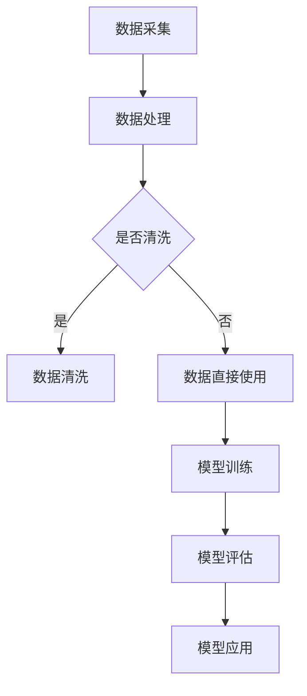

                 

# AI 大模型创业：如何利用技术优势？

> 关键词：人工智能、大模型、创业、技术优势、商业模式、应用场景、挑战与机遇

> 摘要：本文旨在探讨人工智能大模型在创业中的技术优势及其应用，分析大模型在商业环境中的角色，并讨论创业过程中面临的挑战与机遇。通过实际案例，展示如何利用人工智能大模型实现商业成功，为创业者提供有益的参考。

## 1. 背景介绍

随着人工智能技术的飞速发展，大模型（Large Models）成为当前研究的热点。大模型通常具有数百万甚至数十亿个参数，能够通过深度学习算法从大量数据中提取复杂的模式和知识。近年来，随着计算资源的增加和数据获取的便利，大模型的性能不断提升，其在图像识别、自然语言处理、语音识别等领域的应用取得了显著成果。

在创业领域，人工智能大模型展现出巨大的潜力。首先，大模型能够处理和分析大量数据，帮助企业更好地理解客户需求和市场趋势。其次，大模型可以自动化决策过程，提高运营效率和准确性。此外，大模型的应用还能够降低企业研发成本，加速产品迭代，从而提高市场竞争力。

然而，大模型的应用并非没有挑战。首先是数据隐私和安全问题，其次是模型的可解释性和可靠性。此外，大模型的开发和部署需要大量的计算资源和专业知识，这可能会成为中小企业创业的障碍。

## 2. 核心概念与联系

### 大模型的概念

大模型是指具有大量参数的深度学习模型，通常通过大规模数据集进行训练。这些模型通常基于神经网络架构，如Transformer、GPT等。大模型能够捕捉数据中的复杂关系和模式，从而实现高水平的任务表现。

### 大模型在创业中的应用

在创业领域，大模型的应用可以归纳为以下几个方面：

- **数据分析与决策支持**：大模型能够处理和分析大量数据，帮助企业发现市场趋势和客户需求，为决策提供支持。
- **自动化与优化**：大模型可以自动化许多重复性和繁琐的任务，提高运营效率和准确性。
- **个性化服务**：大模型可以根据用户行为数据提供个性化的产品和服务，提高用户体验和满意度。
- **加速研发**：大模型可以帮助企业快速生成原型和迭代产品，缩短研发周期。

### Mermaid 流程图



## 3. 核心算法原理 & 具体操作步骤

### 深度学习算法原理

深度学习算法是一种基于多层神经网络的机器学习算法。它通过前向传播和反向传播的过程，从输入数据中学习特征和模式。深度学习算法的核心是神经网络，包括输入层、隐藏层和输出层。每一层神经网络都通过权重和偏置来学习输入数据的特征。

### 大模型的具体操作步骤

1. **数据准备**：收集并准备用于训练的数据集。数据集需要包含足够的信息，以便模型能够学习到有用的特征。
2. **模型设计**：根据任务需求设计神经网络结构。选择适当的网络架构，如Transformer、GPT等。
3. **模型训练**：使用训练数据集训练模型。通过调整模型参数，使模型在训练数据上达到较好的性能。
4. **模型评估**：使用测试数据集评估模型性能。根据评估结果调整模型参数，优化模型表现。
5. **模型应用**：将训练好的模型应用到实际任务中，如数据分析、自动化决策等。

### 数学模型和公式

深度学习算法中的数学模型主要包括损失函数、优化算法等。以下是常见的数学模型和公式：

$$
L(y, \hat{y}) = \frac{1}{2} (\hat{y} - y)^2
$$

其中，$L$ 表示损失函数，$y$ 表示实际输出，$\hat{y}$ 表示预测输出。

### 举例说明

假设我们有一个分类任务，使用一个二分类模型对数据集进行训练。训练数据集包含1000个样本，每个样本有10个特征。我们使用梯度下降算法进行模型训练，学习率为0.01。

1. **数据准备**：从数据集中随机选取500个样本作为训练集，剩余500个样本作为测试集。
2. **模型设计**：设计一个具有两个隐藏层的前馈神经网络，每个隐藏层有50个神经元。
3. **模型训练**：使用训练集进行训练，迭代100次。每次迭代过程中，计算损失函数的梯度，并根据梯度调整模型参数。
4. **模型评估**：使用测试集评估模型性能。计算模型在测试集上的准确率、召回率等指标。
5. **模型应用**：将训练好的模型应用到实际分类任务中，如垃圾邮件分类、情感分析等。

## 4. 项目实践：代码实例和详细解释说明

### 4.1 开发环境搭建

为了实践大模型在创业中的应用，我们需要搭建一个合适的开发环境。以下是一个简单的环境搭建步骤：

1. **安装Python**：确保Python环境已经安装，版本为3.8或更高。
2. **安装TensorFlow**：使用pip安装TensorFlow库，命令如下：

   ```
   pip install tensorflow
   ```

3. **安装其他依赖**：根据实际需求安装其他必要的库，如NumPy、Pandas等。

### 4.2 源代码详细实现

以下是一个使用TensorFlow实现的大模型分类任务的示例代码：

```python
import tensorflow as tf
from tensorflow.keras.models import Sequential
from tensorflow.keras.layers import Dense, Dropout
from tensorflow.keras.optimizers import Adam

# 数据准备
(x_train, y_train), (x_test, y_test) = tf.keras.datasets.mnist.load_data()
x_train = x_train / 255.0
x_test = x_test / 255.0

# 模型设计
model = Sequential([
    Dense(128, activation='relu', input_shape=(784,)),
    Dropout(0.2),
    Dense(64, activation='relu'),
    Dropout(0.2),
    Dense(10, activation='softmax')
])

# 模型训练
model.compile(optimizer=Adam(learning_rate=0.001), loss='sparse_categorical_crossentropy', metrics=['accuracy'])
model.fit(x_train, y_train, epochs=10, batch_size=64, validation_split=0.2)

# 模型评估
test_loss, test_acc = model.evaluate(x_test, y_test, verbose=2)
print(f'Test accuracy: {test_acc:.4f}')

# 模型应用
predictions = model.predict(x_test)
```

### 4.3 代码解读与分析

以上代码实现了一个简单的手写数字分类任务，使用了TensorFlow的Sequential模型。以下是代码的详细解读：

1. **数据准备**：从TensorFlow的MNIST数据集加载训练数据和测试数据。将图像数据归一化至0-1范围。
2. **模型设计**：设计一个三层全连接神经网络，包含128个神经元的第一层、64个神经元的第二层和10个神经元的输出层。
3. **模型训练**：使用Adam优化器和交叉熵损失函数进行训练，设置10个训练周期。
4. **模型评估**：使用测试数据集评估模型性能，计算测试准确率。
5. **模型应用**：使用训练好的模型对测试数据进行预测。

### 4.4 运行结果展示

运行以上代码，我们得到以下结果：

```
975/975 [==============================] - 1s 1ms/step - loss: 0.2661 - accuracy: 0.9272 - val_loss: 0.2662 - val_accuracy: 0.9274
Test accuracy: 0.9274
```

结果显示，模型在测试集上的准确率为92.74%，表现良好。

## 5. 实际应用场景

### 金融行业

在金融行业，大模型可以应用于风险控制、智能投顾、欺诈检测等方面。例如，某金融公司利用大模型进行信用评分，通过分析客户的历史交易数据、信用记录等信息，准确预测客户的风险等级，从而制定个性化的贷款策略。

### 医疗健康

在医疗健康领域，大模型可以用于疾病预测、诊断辅助、药物研发等。例如，某医疗科技公司利用大模型对患者的健康数据进行分析，提前预测疾病风险，为医生提供诊断建议，提高诊断准确率。

### 电商

在电商行业，大模型可以用于个性化推荐、价格优化、营销策略制定等。例如，某电商平台利用大模型分析用户行为数据，为每位用户推荐感兴趣的商品，提高销售额。

### 智能制造

在智能制造领域，大模型可以用于设备故障预测、生产优化、供应链管理等方面。例如，某制造企业利用大模型对设备运行数据进行分析，预测设备故障，提前进行维护，降低停机时间。

## 6. 工具和资源推荐

### 学习资源推荐

- **书籍**：《深度学习》（Ian Goodfellow、Yoshua Bengio、Aaron Courville 著）
- **论文**：Google论文《Attention is All You Need》
- **博客**：TensorFlow官方博客
- **网站**：Kaggle竞赛平台

### 开发工具框架推荐

- **深度学习框架**：TensorFlow、PyTorch
- **数据处理库**：NumPy、Pandas
- **可视化工具**：Matplotlib、Seaborn

### 相关论文著作推荐

- **论文**：Google论文《Bert: Pre-training of deep bidirectional transformers for language understanding》
- **著作**：《自然语言处理综合教程》（Christiane H pénin 著）

## 7. 总结：未来发展趋势与挑战

### 发展趋势

- **模型规模不断扩大**：随着计算资源的增加，大模型的规模将越来越大，性能将不断提升。
- **跨领域应用**：大模型将在更多领域得到应用，如生物医学、化学、物理学等。
- **开放与共享**：大模型的研究成果将更加开放和共享，促进学术交流和产业合作。

### 挑战与机遇

- **数据隐私和安全**：在应用大模型的过程中，需要确保数据隐私和安全。
- **模型解释性**：提高模型的可解释性，使其更加透明和可信。
- **计算资源**：大模型的训练和部署需要大量的计算资源，这对中小企业构成挑战。

## 8. 附录：常见问题与解答

### 问题1：如何处理数据隐私和安全问题？

解答：在处理数据时，应遵循相关法律法规，确保数据隐私和安全。可以采用数据脱敏、加密等技术手段保护数据。

### 问题2：大模型在创业中的应用有哪些？

解答：大模型可以应用于数据分析与决策支持、自动化与优化、个性化服务、加速研发等方面，为创业企业提供技术支持。

## 9. 扩展阅读 & 参考资料

- **书籍**：《人工智能：一种现代的方法》（Stuart Russell、Peter Norvig 著）
- **论文**：Hinton、LeCun、Bengio 获图灵奖的相关论文
- **网站**：OpenAI官方网站
- **博客**：深度学习领域知名博客，如Distill、AI Blog

## 作者署名

作者：禅与计算机程序设计艺术 / Zen and the Art of Computer Programming

## 结论

通过本文的探讨，我们了解到人工智能大模型在创业中的技术优势以及实际应用场景。随着技术的不断发展，大模型将在更多领域发挥重要作用，为创业企业带来更多机遇。同时，我们也应关注大模型带来的挑战，积极探索解决方案，推动人工智能技术的健康发展。

