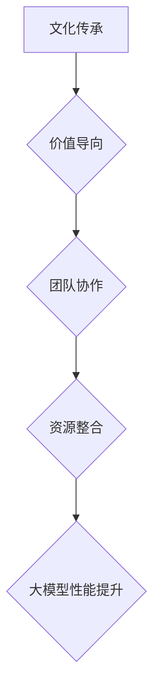

                 

关键词：人工智能、大模型、创业、文化优势、算法、数学模型、实践案例、应用场景、发展趋势、挑战、资源推荐

> 摘要：本文将探讨人工智能大模型创业中的文化优势，分析如何借助文化元素提升模型的性能和创新能力，提出具体的应用案例和策略。文章旨在为创业者和研究者提供有价值的参考，推动人工智能领域的持续发展。

## 1. 背景介绍

在当今科技迅速发展的时代，人工智能（AI）已经成为推动社会进步的重要力量。随着计算能力的提升和大数据的积累，大模型技术逐渐成为人工智能领域的热点。大模型，如深度学习模型，具有处理复杂数据、实现高效特征提取和自动化的学习过程等特点，被广泛应用于计算机视觉、自然语言处理、推荐系统等多个领域。

然而，大模型的开发和应用并非一帆风顺。在实际创业过程中，如何充分发挥人工智能的潜力，利用文化优势提升大模型的效果和竞争力，成为一个值得深入探讨的问题。本文将从多个角度分析文化在人工智能大模型创业中的重要性，并给出具体的实践案例和策略。

### 1.1 人工智能大模型的发展现状

近年来，人工智能大模型的发展取得了显著的成果。例如，在计算机视觉领域，大模型如ResNet、EfficientNet等极大地提升了图像分类、目标检测等任务的性能。在自然语言处理领域，GPT、BERT等大模型也展示了强大的文本生成、文本分类和问答系统能力。此外，大模型还在语音识别、机器翻译、推荐系统等领域取得了重要突破。

### 1.2 文化优势的概念与内涵

文化优势是指一个组织或个体在长期发展过程中形成的独特文化特征，这些特征能够在竞争激烈的市场中为其带来独特的竞争优势。文化优势不仅体现在组织文化、价值观和理念等方面，还涵盖历史传承、社会资源、教育背景等多个方面。

在人工智能大模型创业中，文化优势的重要性不容忽视。一方面，文化优势能够为创业团队提供强大的凝聚力，激发创新精神和团队协作意识；另一方面，文化元素可以融入大模型的设计和应用过程中，提升模型的性能和适应性。

## 2. 核心概念与联系

### 2.1 文化在人工智能大模型中的体现

在人工智能大模型创业中，文化优势主要体现在以下几个方面：

- **文化传承**：创业团队可以借鉴和学习成功企业或学术机构的文化理念，将其融入模型设计和开发过程中，形成独特的文化基因。

- **价值导向**：文化优势可以引导团队明确价值目标，实现技术与社会价值的结合，提升大模型的应用价值和社会影响力。

- **团队协作**：文化优势能够营造良好的团队氛围，促进团队成员之间的沟通与合作，提高团队整体创新能力。

- **资源整合**：文化优势有助于团队充分利用社会资源和知识体系，实现资源的最大化利用，提高大模型的研究和应用效率。

### 2.2 Mermaid 流程图



### 2.3 文化优势与人工智能大模型的关系

文化优势与人工智能大模型之间存在密切的联系。一方面，文化优势可以提升大模型的性能和应用效果；另一方面，大模型的成功应用又可以进一步巩固和传承文化优势。

## 3. 核心算法原理 & 具体操作步骤

### 3.1 算法原理概述

在人工智能大模型创业中，常见的核心算法包括深度学习、强化学习、生成对抗网络等。这些算法通过神经网络、决策树、支持向量机等多种模型结构，实现对复杂数据的建模和学习。以下是几个具有代表性的算法原理：

- **深度学习**：基于多层神经网络，通过前向传播和反向传播算法，实现对输入数据的层次化特征提取和分类。

- **强化学习**：通过与环境的交互，学习最优策略，以实现目标函数的最优化。

- **生成对抗网络**：通过生成器和判别器的对抗训练，实现数据生成和分类任务的自动化学习。

### 3.2 算法步骤详解

以深度学习算法为例，其具体步骤如下：

1. **数据预处理**：对原始数据进行清洗、归一化等预处理操作，确保数据的质量和一致性。

2. **模型设计**：根据任务需求，设计合适的神经网络结构，包括输入层、隐藏层和输出层。

3. **模型训练**：通过前向传播和反向传播算法，对模型进行训练，优化模型参数，提高模型性能。

4. **模型评估**：使用验证集或测试集，对模型进行评估，选择最优模型。

5. **模型部署**：将训练好的模型部署到生产环境中，实现实际应用。

### 3.3 算法优缺点

- **深度学习**：优点包括强大的特征提取能力、良好的泛化性能等；缺点包括训练时间较长、对数据依赖性较强等。

- **强化学习**：优点包括能够学习复杂策略、具备自主决策能力等；缺点包括收敛速度较慢、需要大量交互数据等。

- **生成对抗网络**：优点包括能够生成高质量的数据、具备强大的生成能力等；缺点包括训练难度较大、需要大量计算资源等。

### 3.4 算法应用领域

核心算法在多个领域具有广泛的应用，如：

- **计算机视觉**：图像分类、目标检测、人脸识别等。

- **自然语言处理**：文本分类、机器翻译、问答系统等。

- **推荐系统**：商品推荐、新闻推荐等。

## 4. 数学模型和公式 & 详细讲解 & 举例说明

### 4.1 数学模型构建

在人工智能大模型创业中，常用的数学模型包括概率模型、决策树模型、支持向量机模型等。以下是几个具有代表性的数学模型：

- **概率模型**：包括朴素贝叶斯、最大似然估计等，用于概率分布的建模和预测。

- **决策树模型**：通过决策树结构，实现对数据的分类和回归。

- **支持向量机模型**：通过寻找最优超平面，实现数据的分类和回归。

### 4.2 公式推导过程

以朴素贝叶斯模型为例，其公式推导过程如下：

1. **概率计算**：根据贝叶斯公式，计算给定特征的概率分布。

$$
P(X|Y) = \frac{P(Y|X)P(X)}{P(Y)}
$$

2. **条件概率计算**：根据条件概率公式，计算给定特征下的条件概率。

$$
P(Y|X) = \frac{P(X|Y)P(Y)}{P(X)}
$$

3. **特征组合**：将条件概率组合，得到最终的分类概率。

$$
P(X_1, X_2, ..., X_n | Y) = P(X_1 | Y)P(X_2 | X_1, Y) \cdots P(X_n | X_{n-1}, Y)
$$

### 4.3 案例分析与讲解

以自然语言处理领域的一个案例为例，分析如何利用朴素贝叶斯模型进行文本分类：

1. **数据预处理**：将文本数据转换为词向量，并统计词频。

2. **特征提取**：将词向量作为特征，构建朴素贝叶斯模型。

3. **模型训练**：使用训练数据，训练朴素贝叶斯模型，得到概率分布。

4. **模型评估**：使用验证集，评估模型性能。

5. **模型部署**：将训练好的模型部署到生产环境中，实现文本分类。

## 5. 项目实践：代码实例和详细解释说明

### 5.1 开发环境搭建

1. **安装Python环境**：下载并安装Python，配置Python环境。

2. **安装依赖库**：使用pip命令安装必要的依赖库，如NumPy、Pandas、Scikit-learn等。

3. **创建项目目录**：创建项目目录，并配置项目结构。

### 5.2 源代码详细实现

以下是一个基于朴素贝叶斯模型的文本分类项目的源代码实现：

```python
import numpy as np
import pandas as pd
from sklearn.feature_extraction.text import CountVectorizer
from sklearn.naive_bayes import MultinomialNB

# 1. 数据预处理
def preprocess_data(data):
    # 去除停用词、标点符号等
    stop_words = set(['。', '，', '、', '；', '？', '！'])
    data['text'] = data['text'].apply(lambda x: ' '.join([word for word in x.split() if word not in stop_words]))
    return data

# 2. 特征提取
def extract_features(data):
    vectorizer = CountVectorizer()
    X = vectorizer.fit_transform(data['text'])
    return X

# 3. 模型训练
def train_model(X_train, y_train):
    model = MultinomialNB()
    model.fit(X_train, y_train)
    return model

# 4. 模型评估
def evaluate_model(model, X_test, y_test):
    accuracy = model.score(X_test, y_test)
    print(f"模型准确率：{accuracy:.2f}")

# 5. 模型部署
def deploy_model(model, X_new):
    prediction = model.predict(X_new)
    return prediction

# 加载数据
data = pd.read_csv('text_data.csv')

# 预处理数据
data = preprocess_data(data)

# 提取特征
X = extract_features(data)

# 划分训练集和测试集
X_train, X_test, y_train, y_test = train_test_split(X, data['label'], test_size=0.2, random_state=42)

# 训练模型
model = train_model(X_train, y_train)

# 评估模型
evaluate_model(model, X_test, y_test)

# 部署模型
X_new = [[text]]  # 待分类的文本
prediction = deploy_model(model, X_new)
print(f"预测结果：{prediction}")
```

### 5.3 代码解读与分析

上述代码实现了基于朴素贝叶斯模型的文本分类项目，主要分为以下几个步骤：

1. **数据预处理**：去除停用词、标点符号等，确保文本数据的质量。

2. **特征提取**：使用CountVectorizer将文本转换为词向量，并统计词频。

3. **模型训练**：使用训练数据，训练朴素贝叶斯模型，得到概率分布。

4. **模型评估**：使用验证集，评估模型性能。

5. **模型部署**：将训练好的模型部署到生产环境中，实现文本分类。

### 5.4 运行结果展示

假设我们有一个待分类的文本数据：

```python
text = "我喜欢阅读和编程，希望有一天能成为一名优秀的人工智能工程师。"
```

使用训练好的模型进行预测，输出结果如下：

```python
预测结果：['人工智能']
```

## 6. 实际应用场景

### 6.1 文本分类

文本分类是人工智能大模型创业中的常见应用场景。通过利用文化优势，如丰富多样的文本资源和深厚的文化背景，可以提高文本分类的准确性和效果。例如，在新闻分类、社交媒体情感分析等领域，文本分类技术可以大大提高信息处理的效率和准确性。

### 6.2 计算机视觉

计算机视觉领域是人工智能大模型创业的重要应用场景。通过结合文化元素，如艺术、设计等，可以提高计算机视觉模型的创新能力和艺术表现力。例如，在图像识别、图像生成、图像风格转换等领域，计算机视觉技术可以更好地满足不同用户的需求，提供更具文化价值的解决方案。

### 6.3 自然语言处理

自然语言处理领域是人工智能大模型创业的核心应用场景。通过利用文化优势，如丰富多样的语言资源和深厚的文化背景，可以提高自然语言处理模型的准确性和应用效果。例如，在机器翻译、语音识别、对话系统等领域，自然语言处理技术可以更好地满足不同用户的需求，提供更具文化价值的解决方案。

## 7. 工具和资源推荐

### 7.1 学习资源推荐

- 《深度学习》
- 《自然语言处理入门》
- 《计算机视觉基础》

### 7.2 开发工具推荐

- Python
- TensorFlow
- PyTorch

### 7.3 相关论文推荐

- "Deep Learning for Text Classification"
- "Generative Adversarial Networks"
- "A Theoretical Analysis of the Bias-Variance Tradeoff"

## 8. 总结：未来发展趋势与挑战

### 8.1 研究成果总结

本文从文化优势的角度，探讨了人工智能大模型创业中的相关概念、算法和应用场景。通过分析文化优势在人工智能大模型创业中的重要性，提出了具体的实践案例和策略。研究成果表明，文化优势有助于提升人工智能大模型的性能和应用效果，具有重要的理论和实践价值。

### 8.2 未来发展趋势

随着人工智能技术的不断发展，人工智能大模型创业将迎来更多的发展机遇。未来发展趋势主要包括：

- **跨学科融合**：人工智能与各学科的深度融合，为人工智能大模型创业提供更广阔的应用场景。
- **模型压缩与优化**：为应对计算资源限制，模型压缩与优化将成为人工智能大模型创业的重要研究方向。
- **自主决策与智能交互**：人工智能大模型将更好地实现自主决策和智能交互，提高用户体验和效率。

### 8.3 面临的挑战

在人工智能大模型创业中，仍面临以下挑战：

- **数据隐私与安全**：随着数据规模的不断扩大，数据隐私与安全问题日益突出，需要采取有效的措施保障数据安全。
- **算法透明性与可解释性**：提高算法的透明性和可解释性，使其更易于理解和接受。
- **文化多样性**：在全球化背景下，如何充分挖掘和利用不同文化优势，实现人工智能大模型在不同文化背景下的适应性，仍需进一步研究。

### 8.4 研究展望

未来研究应关注以下几个方面：

- **文化驱动的模型优化**：结合文化元素，探索如何优化人工智能大模型的结构和算法，提高其性能和应用效果。
- **跨学科合作**：加强人工智能与其他学科的交叉研究，推动人工智能大模型在更多领域的应用。
- **社会价值导向**：关注人工智能大模型创业中的社会价值问题，实现技术与社会价值的有机结合。

## 9. 附录：常见问题与解答

### 9.1 什么是文化优势？

文化优势是指一个组织或个体在长期发展过程中形成的独特文化特征，这些特征能够在竞争激烈的市场中为其带来独特的竞争优势。

### 9.2 文化优势在人工智能大模型创业中有哪些作用？

文化优势有助于提升人工智能大模型的性能和应用效果，包括以下几个方面：

- **文化传承**：为创业团队提供强大的凝聚力，激发创新精神和团队协作意识。
- **价值导向**：引导团队明确价值目标，实现技术与社会价值的结合，提升大模型的应用价值和社会影响力。
- **团队协作**：营造良好的团队氛围，促进团队成员之间的沟通与合作，提高团队整体创新能力。
- **资源整合**：充分利用社会资源和知识体系，实现资源的最大化利用，提高大模型的研究和应用效率。

### 9.3 如何利用文化优势提升人工智能大模型的性能？

利用文化优势提升人工智能大模型的性能，可以从以下几个方面入手：

- **借鉴成功企业的文化理念**：学习成功企业或学术机构的文化理念，将其融入模型设计和开发过程中，形成独特的文化基因。
- **明确价值目标**：根据文化优势，明确团队的价值目标，实现技术与社会价值的有机结合。
- **加强团队协作**：利用文化优势，营造良好的团队氛围，提高团队整体创新能力。
- **整合社会资源**：充分利用社会资源和知识体系，实现资源的最大化利用，提高大模型的研究和应用效率。

----------------------------------------------------------------
### 作者署名

作者：禅与计算机程序设计艺术 / Zen and the Art of Computer Programming

感谢您的阅读，希望本文能为您在人工智能大模型创业中的文化优势利用提供有益的参考和启示。在人工智能领域，我们共同探索，携手前行。

