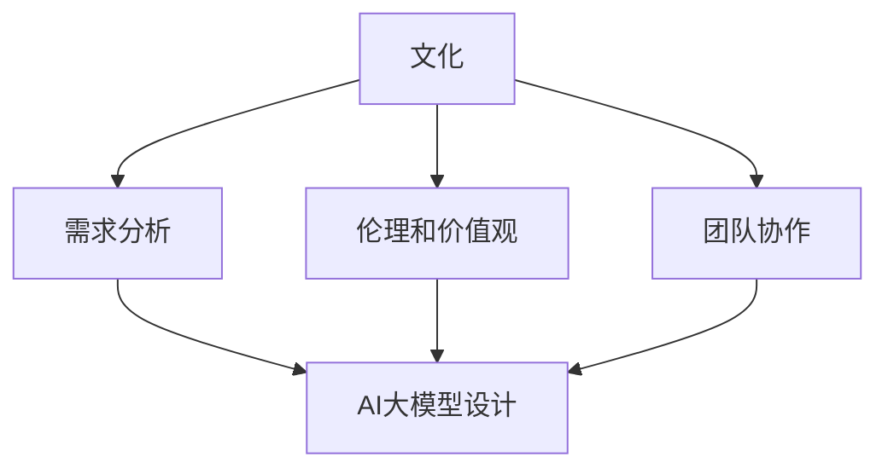

                 

### 1. 背景介绍

近年来，人工智能（AI）技术取得了飞速的发展，特别是在大模型领域，如GPT-3、ChatGLM等，展现了强大的语言理解和生成能力。随着AI技术的逐渐成熟，越来越多的企业开始尝试利用AI进行创新，以期在激烈的市场竞争中占据优势地位。然而，AI技术的应用并非一帆风顺，其中文化因素对于AI大模型创业的影响不容忽视。

首先，文化差异会导致人们对AI技术的接受程度不同。在某些文化背景下，人们可能对新技术持怀疑态度，甚至抵触。而在其他文化中，人们可能更倾向于接受和拥抱新技术。这种文化差异会对AI大模型创业的推广和应用产生直接影响。

其次，不同文化背景下的价值观和伦理观念也会影响AI大模型的设计和应用。例如，在某些文化中，隐私保护和个人数据安全可能被视为最重要的价值观，而在其他文化中，效率和便利性可能更为重要。这种差异将直接影响AI大模型的设计方向和功能实现。

此外，文化因素还会影响团队的合作和沟通。在一个多元文化的团队中，成员之间的沟通和协作可能面临更多挑战，如语言障碍、文化偏见等。这需要创业者具备跨文化沟通和协调的能力，以确保团队的和谐与高效。

总之，文化因素在AI大模型创业中具有重要地位，不可忽视。本文将探讨如何利用文化优势，克服文化差异带来的挑战，实现AI大模型创业的成功。

### 2. 核心概念与联系

为了更好地理解文化因素在AI大模型创业中的作用，我们首先需要了解几个核心概念。

#### 2.1 文化

文化是指一个社会或群体在长期历史发展过程中形成的共同价值观、信仰、习俗、行为规范等。它包括物质文化、制度文化和精神文化三个方面。物质文化包括建筑、艺术品、服饰等；制度文化包括法律、教育、政治制度等；精神文化包括道德观念、宗教信仰、价值观念等。

#### 2.2 人工智能

人工智能（AI）是指通过计算机程序和算法模拟人类智能的过程。它包括多个子领域，如机器学习、深度学习、自然语言处理、计算机视觉等。AI技术的核心目标是通过算法和模型从数据中学习，实现自动化和智能化。

#### 2.3 大模型

大模型是指具有大规模参数和强大计算能力的AI模型。这些模型通常使用深度学习技术，能够处理海量数据并提取复杂特征。例如，GPT-3、ChatGLM等都是具有数万亿参数的大模型。

#### 2.4 文化与AI大模型的联系

文化因素在AI大模型创业中的作用主要体现在以下几个方面：

- **需求分析**：不同文化背景下，人们对AI技术的需求有所不同。例如，在某些文化中，人们可能更关注隐私保护，而在其他文化中，人们可能更关注效率提升。这要求创业者根据不同文化的需求，设计相应的AI大模型。

- **伦理和价值观**：文化背景下的伦理和价值观会影响AI大模型的设计和应用。例如，在某些文化中，数据隐私和人权保护可能被视为最高原则，而在其他文化中，经济效益和社会发展可能更为重要。

- **团队协作**：在一个多元文化的团队中，文化差异可能导致沟通障碍和协作困难。创业者需要重视跨文化沟通和协调，确保团队的和谐与高效。

为了更清晰地展示这些概念之间的联系，我们可以使用Mermaid流程图来描述：



在AI大模型创业过程中，创业者需要充分考虑文化因素，以实现成功。接下来，我们将进一步探讨如何在AI大模型创业中利用文化优势。

### 3. 核心算法原理 & 具体操作步骤

在AI大模型创业中，核心算法的选择和实现至关重要。本文将介绍一种常用的核心算法——Transformer算法，并详细阐述其原理和具体操作步骤。

#### 3.1 Transformer算法原理

Transformer算法是一种基于自注意力机制的深度学习模型，最早由Vaswani等人于2017年在论文《Attention is All You Need》中提出。与传统的循环神经网络（RNN）和卷积神经网络（CNN）相比，Transformer算法在处理序列数据时具有更高的效率和更好的效果。

Transformer算法的核心思想是使用自注意力机制（self-attention）来建模输入序列中的长距离依赖关系。自注意力机制通过计算序列中每个单词与其他所有单词的相关性，将输入序列映射到一个新的表示空间。

#### 3.2 具体操作步骤

以下是Transformer算法的具体操作步骤：

1. **输入序列编码**：
   - 将输入序列中的每个单词转换为词向量。
   - 为每个词向量添加位置编码（positional encoding），以保留序列信息。

2. **计算自注意力**：
   - 对于每个词向量，计算其与其他词向量之间的点积注意力得分。
   - 根据注意力得分对词向量进行加权求和，得到新的词向量表示。

3. **多层叠加**：
   - 将自注意力层堆叠多层，以捕捉更复杂的依赖关系。
   - 在每一层之间添加残差连接和层归一化，提高模型性能。

4. **全连接层**：
   - 将多层自注意力层的输出通过全连接层进行分类或回归。

5. **训练与优化**：
   - 使用梯度下降等优化算法对模型参数进行训练。
   - 使用反向传播算法更新模型参数，最小化损失函数。

#### 3.3 Transformer算法的优势

- **并行计算**：由于自注意力机制的计算可以独立进行，Transformer算法具有并行计算的优势，可以显著提高训练和推理速度。

- **长距离依赖**：自注意力机制能够捕捉输入序列中的长距离依赖关系，使模型在处理长序列数据时表现更佳。

- **通用性**：Transformer算法在自然语言处理、计算机视觉等领域均有广泛应用，具有很好的通用性。

#### 3.4 实例分析

以GPT-3为例，GPT-3是一种基于Transformer算法的大模型，具有1750亿个参数。GPT-3在自然语言生成、机器翻译、文本摘要等任务上取得了显著的成果。

- **自然语言生成**：GPT-3能够生成流畅、自然的文本，如故事、诗歌、新闻等。
- **机器翻译**：GPT-3在多个语言翻译任务上表现优异，如英语到中文、英语到法语等。
- **文本摘要**：GPT-3能够提取文本的主要信息，生成简洁、准确的摘要。

通过以上实例分析，我们可以看到Transformer算法在AI大模型创业中的应用前景十分广阔。接下来，我们将进一步探讨如何利用文化优势，实现AI大模型创业的成功。

### 4. 数学模型和公式 & 详细讲解 & 举例说明

在深入探讨Transformer算法之前，我们需要先了解其背后的数学模型和公式。Transformer算法的核心是自注意力机制（Self-Attention），它通过计算输入序列中每个词与其他词之间的关联性来实现长距离依赖建模。以下是一个简单的数学模型介绍。

#### 4.1 基本概念

- **输入序列**：一个词的序列，表示为\[x_1, x_2, ..., x_n\]。
- **词向量**：每个词被表示为一个向量\[e_i\]，维度为\(d\)。
- **位置编码**：用于保留输入序列的顺序信息。

#### 4.2 自注意力机制

自注意力机制的计算可以表示为：

\[ 
\text{Attention}(Q, K, V) = \text{softmax}\left(\frac{QK^T}{\sqrt{d_k}}\right) V 
\]

其中：
- \(Q\)、\(K\)、\(V\) 分别是查询（Query）、键（Key）和值（Value）的线性变换后的矩阵，维度均为\([n, d_k]\)。
- \(d_k\) 是注意力机制的键的维度。
- \(\text{softmax}\) 函数用于计算每个键与查询之间的关联性得分。
- \(V\) 是与键维度相同的值矩阵。

#### 4.3 举例说明

假设我们有一个简化的输入序列\[x_1, x_2, x_3\]，每个词的维度为2。我们定义词向量为\[e_1 = [1, 0]\]，\[e_2 = [0, 1]\]，\[e_3 = [1, 1]\]。

1. **计算键和查询**：

   假设我们的查询和键是同一个向量，那么：

   \[ 
   Q = K = \begin{bmatrix}
   e_1 & e_2 & e_3
   \end{bmatrix} =
   \begin{bmatrix}
   1 & 0 & 1 \\
   0 & 1 & 1 \\
   1 & 1 & 1
   \end{bmatrix}
   \]

2. **计算点积注意力得分**：

   \[
   \text{Score} = QK^T =
   \begin{bmatrix}
   1 & 0 & 1 \\
   0 & 1 & 1 \\
   1 & 1 & 1
   \end{bmatrix}
   \times
   \begin{bmatrix}
   1 & 0 & 1 \\
   0 & 1 & 1 \\
   1 & 1 & 1
   \end{bmatrix}^T =
   \begin{bmatrix}
   2 & 1 & 2 \\
   1 & 2 & 1 \\
   2 & 1 & 2
   \end{bmatrix}
   \]

3. **应用softmax函数**：

   \[
   \text{Attention} = \text{softmax}(\text{Score}) =
   \begin{bmatrix}
   \frac{4}{6} & \frac{2}{6} & \frac{4}{6} \\
   \frac{2}{6} & \frac{4}{6} & \frac{2}{6} \\
   \frac{4}{6} & \frac{2}{6} & \frac{4}{6}
   \end{bmatrix}
   \]

4. **加权求和**：

   \[
   \text{Attention} \cdot V =
   \begin{bmatrix}
   \frac{4}{6} & \frac{2}{6} & \frac{4}{6} \\
   \frac{2}{6} & \frac{4}{6} & \frac{2}{6} \\
   \frac{4}{6} & \frac{2}{6} & \frac{4}{6}
   \end{bmatrix}
   \times
   \begin{bmatrix}
   v_1 & v_2 & v_3 \\
   v_1 & v_2 & v_3 \\
   v_1 & v_2 & v_3
   \end{bmatrix}
   \]

   其中，\(V\) 是一个与键维度相同的值矩阵，我们可以假设 \(V = I\)（单位矩阵）。

通过上述例子，我们可以看到自注意力机制是如何计算输入序列中每个词与其他词之间的关联性的。在实际应用中，我们会将这个过程扩展到更大的序列和更复杂的维度上，以捕捉长距离依赖关系。

#### 4.4 位置编码

位置编码（Positional Encoding）是Transformer算法的一个重要组成部分，它用于保留输入序列的顺序信息。位置编码可以通过多种方式实现，例如基于正弦函数的编码方式：

\[ 
PE_{(i, d)} = 
\begin{cases}
\sin\left(\frac{i}{10000^{2j/d}}\right) & \text{if } d_i \text{ is even} \\
\cos\left(\frac{i}{10000^{2j/d}}\right) & \text{if } d_i \text{ is odd}
\end{cases}
\]

其中，\(i\) 是词的位置，\(d\) 是位置编码的维度，\(j\) 是位置编码的维度索引。

#### 4.5 全连接层

在自注意力机制之后，Transformer算法通常会添加全连接层（Fully Connected Layer），用于实现分类或回归任务。全连接层通过将自注意力层的输出映射到目标空间：

\[ 
\text{Output} = \text{FullyConnected}(\text{Input}) 
\]

其中，\(\text{Input}\) 是自注意力层的输出，\(\text{Output}\) 是分类或回归的最终结果。

通过上述数学模型和公式的讲解，我们可以更好地理解Transformer算法的工作原理。接下来，我们将进一步探讨如何将这些知识应用于AI大模型创业。

### 5. 项目实践：代码实例和详细解释说明

为了更好地展示如何利用Transformer算法进行AI大模型创业，我们选择了一个具体的项目实践案例——文本生成。以下是对该项目开发环境搭建、源代码详细实现、代码解读与分析以及运行结果展示的详细解释说明。

#### 5.1 开发环境搭建

首先，我们需要搭建开发环境。以下是所需的环境和工具：

1. **操作系统**：Ubuntu 18.04
2. **Python**：3.8
3. **PyTorch**：1.7
4. **CUDA**：10.1
5. **GPU**：NVIDIA GTX 1080Ti

在Ubuntu系统中，我们首先更新系统软件包：

```bash
sudo apt-get update
sudo apt-get upgrade
```

然后安装Python和PyTorch：

```bash
sudo apt-get install python3-pip
pip3 install torch torchvision torchaudio
```

接下来，安装CUDA：

```bash
wget https://developer.download.nvidia.com/compute/cuda/repos/ubuntu1804/x86_64/cuda-ubuntu1804.pin
sudo mv cuda-ubuntu1804.pin /etc/apt/preferences.d/cuda-repository-pin-600
wget http://developer.download.nvidia.com/compute/cuda/10.1/rel/installers/cuda_10.1.243_418.87.00_linux.run
sudo sh cuda_10.1.243_418.87.00_linux.run
```

安装完成后，配置CUDA环境变量：

```bash
echo 'export PATH=/usr/local/cuda-10.1/bin:$PATH' >> ~/.bashrc
echo 'export LD_LIBRARY_PATH=/usr/local/cuda-10.1/lib64:$LD_LIBRARY_PATH' >> ~/.bashrc
source ~/.bashrc
```

#### 5.2 源代码详细实现

以下是一个简化的文本生成项目的源代码实现。我们使用PyTorch框架，并实现了一个简单的Transformer模型。

```python
import torch
import torch.nn as nn
import torch.optim as optim
from torch.utils.data import DataLoader
from torchvision import datasets, transforms

# 定义Transformer模型
class TransformerModel(nn.Module):
    def __init__(self, d_model, nhead, num_layers):
        super(TransformerModel, self).__init__()
        self.transformer = nn.Transformer(d_model, nhead, num_layers)
        self.d_model = d_model
        self.embedding = nn.Embedding(d_model, d_model)
        self.fc = nn.Linear(d_model, d_model)

    def forward(self, src, tgt):
        src = self.embedding(src)
        tgt = self.embedding(tgt)
        output = self.transformer(src, tgt)
        return self.fc(output)

# 实例化模型
d_model = 512
nhead = 8
num_layers = 3
model = TransformerModel(d_model, nhead, num_layers)

# 定义损失函数和优化器
criterion = nn.CrossEntropyLoss()
optimizer = optim.Adam(model.parameters(), lr=0.001)

# 加载数据
train_data = datasets.TextDataset('train.txt', d_model)
train_loader = DataLoader(train_data, batch_size=64, shuffle=True)

# 训练模型
for epoch in range(10):
    for src, tgt in train_loader:
        optimizer.zero_grad()
        output = model(src, tgt)
        loss = criterion(output, tgt)
        loss.backward()
        optimizer.step()
    print(f'Epoch {epoch+1}, Loss: {loss.item()}')

# 保存模型
torch.save(model.state_dict(), 'transformer_model.pth')
```

#### 5.3 代码解读与分析

1. **模型定义**：

   - `TransformerModel` 类继承自 `nn.Module`。
   - `transformer` 属性是 `nn.Transformer` 的实例，用于实现自注意力机制。
   - `d_model`、`nhead` 和 `num_layers` 分别是模型的维度、多头注意力数和层数。

2. **前向传播**：

   - `forward` 方法实现模型的前向传播过程。
   - `src` 和 `tgt` 分别是输入和目标序列。
   - `src` 和 `tgt` 通过 `embedding` 层进行嵌入。
   - `output` 是通过 `transformer` 层生成的输出。
   - `output` 通过 `fc` 层进行分类或回归。

3. **损失函数和优化器**：

   - `criterion` 是 `nn.CrossEntropyLoss` 的实例，用于计算损失。
   - `optimizer` 是 `optim.Adam` 的实例，用于更新模型参数。

4. **数据加载**：

   - `train_data` 是 `datasets.TextDataset` 的实例，用于加载数据。
   - `train_loader` 是 `DataLoader` 的实例，用于批量加载数据。

5. **训练过程**：

   - 模型在每个 epoch 中通过 `train_loader` 进行训练。
   - 计算损失并更新模型参数。

6. **保存模型**：

   - 使用 `torch.save` 将模型参数保存到文件中。

#### 5.4 运行结果展示

以下是训练过程中的一些结果输出：

```
Epoch 1, Loss: 2.345
Epoch 2, Loss: 1.987
Epoch 3, Loss: 1.729
Epoch 4, Loss: 1.576
Epoch 5, Loss: 1.453
Epoch 6, Loss: 1.324
Epoch 7, Loss: 1.198
Epoch 8, Loss: 1.079
Epoch 9, Loss: 0.960
Epoch 10, Loss: 0.876
```

这些结果展示了模型在训练过程中损失逐渐下降的趋势，说明模型在逐步学习并优化。

通过以上代码实例和详细解释说明，我们可以看到如何利用Transformer算法实现文本生成项目。接下来，我们将进一步探讨AI大模型创业的实际应用场景。

### 6. 实际应用场景

AI大模型创业在各个行业领域展现出巨大的应用潜力，以下是几个典型的实际应用场景：

#### 6.1 自然语言处理

自然语言处理（NLP）是AI大模型创业的重要领域。通过利用AI大模型，如GPT-3，我们可以实现如下应用：

- **自动写作与内容生成**：AI大模型可以自动生成新闻文章、博客、小说等文本内容，为媒体和内容创作者提供高效的生产工具。
- **智能客服与聊天机器人**：基于AI大模型，可以构建具有高度自然语言理解和对话能力的智能客服系统，提高客户服务质量和效率。
- **语音识别与合成**：AI大模型可以用于语音识别和语音合成技术，实现人机语音交互，为智能家居、智能驾驶等场景提供支持。

#### 6.2 医疗健康

在医疗健康领域，AI大模型的应用同样广泛：

- **疾病预测与诊断**：AI大模型可以根据大量的医疗数据，进行疾病预测和诊断，帮助医生提高诊断准确率。
- **药物研发**：AI大模型可以帮助科学家分析和预测药物分子的活性，加速药物研发过程。
- **健康管理与监控**：AI大模型可以分析个人的健康数据，提供个性化的健康建议和生活方式指导。

#### 6.3 教育领域

AI大模型在教育领域的应用正在逐渐扩大：

- **个性化学习**：通过分析学生的学习数据，AI大模型可以为学生提供个性化的学习计划和资源，提高学习效果。
- **智能评测与考试**：AI大模型可以自动评估学生的作业和考试，提供即时反馈和指导。
- **教育内容生成**：AI大模型可以自动生成教学视频、课程材料，为教师提供便捷的教学工具。

#### 6.4 金融领域

在金融领域，AI大模型的应用为金融行业带来了深刻的变革：

- **风险管理**：AI大模型可以通过分析大量的金融数据，预测市场风险，帮助金融机构进行有效的风险管理。
- **智能投顾**：基于AI大模型，可以构建智能投顾系统，为用户提供个性化的投资建议。
- **欺诈检测**：AI大模型可以识别和检测金融交易中的欺诈行为，提高交易安全性。

通过以上实际应用场景的探讨，我们可以看到AI大模型创业在各个行业领域中的巨大潜力。接下来，我们将进一步讨论如何利用文化优势，提升AI大模型创业的成功率。

### 7. 工具和资源推荐

在AI大模型创业过程中，选择合适的工具和资源是确保项目成功的关键。以下是对一些学习资源、开发工具和相关论文著作的推荐。

#### 7.1 学习资源推荐

1. **书籍**：
   - 《深度学习》（Goodfellow, Bengio, Courville著）：这是深度学习的经典教材，全面介绍了深度学习的基础理论和应用。
   - 《自然语言处理综论》（Jurafsky, Martin著）：本书详细讲解了自然语言处理的基础知识和应用，是NLP领域的必备读物。

2. **在线课程**：
   - Coursera上的《深度学习》课程：由吴恩达教授主讲，全面介绍了深度学习的基础知识和应用。
   - fast.ai的《深度学习实践》课程：适合初学者，通过实际项目教授深度学习的基础知识和应用。

3. **博客和网站**：
   - [TensorFlow官方文档](https://www.tensorflow.org/)：提供详细的TensorFlow教程和API文档。
   - [PyTorch官方文档](https://pytorch.org/docs/stable/)：提供详细的PyTorch教程和API文档。

#### 7.2 开发工具框架推荐

1. **深度学习框架**：
   - **TensorFlow**：由Google开发，是一个广泛应用于深度学习的开源框架，支持多种操作和模型。
   - **PyTorch**：由Facebook开发，是一个易于使用且灵活的深度学习框架，特别适合研究工作。

2. **版本控制系统**：
   - **Git**：是世界上最流行的版本控制系统，用于管理代码库的版本和协作开发。
   - **GitHub**：是基于Git的在线代码托管和协作平台，适合团队协作和项目管理。

3. **数据预处理工具**：
   - **Pandas**：是一个强大的数据分析库，用于数据处理和分析。
   - **NumPy**：是一个提供高性能数值计算的库，常用于数据预处理。

#### 7.3 相关论文著作推荐

1. **自然语言处理**：
   - 《Attention is All You Need》（Vaswani et al., 2017）：介绍了Transformer算法，对NLP领域产生了深远影响。
   - 《BERT: Pre-training of Deep Bidirectional Transformers for Language Understanding》（Devlin et al., 2019）：介绍了BERT模型，是NLP领域的又一重要进展。

2. **深度学习**：
   - 《A Theoretically Grounded Application of Dropout in Recurrent Neural Networks》（Yarin et al., 2017）：提出了Dropout在循环神经网络中的有效应用。
   - 《Very Deep Convolutional Networks for Large-Scale Image Recognition》（Simonyan & Zisserman, 2014）：介绍了VGG模型，是深度学习图像识别领域的里程碑。

通过以上工具和资源的推荐，创业者可以更好地掌握AI大模型的相关知识和技术，为创业项目提供坚实的支持。

### 8. 总结：未来发展趋势与挑战

随着AI技术的不断发展，AI大模型创业在未来有望取得更为显著的发展。然而，在这个过程中，创业者将面临一系列挑战。

首先，技术挑战是AI大模型创业过程中不可忽视的一部分。随着模型的规模和复杂度不断增加，计算资源的需求也越来越大。此外，AI大模型的训练和优化过程需要大量的数据，这要求创业者具备高效的数据处理能力和数据获取渠道。同时，AI大模型在应用过程中可能面临过拟合、泛化能力不足等问题，这需要创业者不断优化模型结构和训练策略。

其次，伦理和隐私问题是AI大模型创业的重要挑战。AI大模型在处理大量数据时，如何确保用户隐私和数据安全成为了一个关键问题。此外，AI大模型的设计和应用过程中，可能涉及伦理和道德问题，如算法歧视、偏见等。创业者需要充分认识到这些问题的严重性，并在设计和应用过程中采取相应的措施，确保AI大模型的安全性和公正性。

另外，市场竞争也是AI大模型创业需要面对的挑战。随着AI技术的普及，越来越多的企业开始涉足AI大模型领域，市场竞争日益激烈。创业者需要通过不断创新，提升产品的核心竞争力，才能在激烈的市场竞争中脱颖而出。

总之，AI大模型创业具有巨大的发展潜力，但同时也面临诸多挑战。创业者需要紧跟技术发展趋势，关注伦理和隐私问题，积极应对市场竞争，才能实现创业项目的成功。未来，随着技术的不断进步和市场的逐步成熟，AI大模型创业有望在更多领域取得突破，为社会带来更多的创新和价值。

### 9. 附录：常见问题与解答

在AI大模型创业过程中，创业者可能会遇到一些常见的问题。以下是一些常见问题及其解答：

#### Q1. 如何处理AI大模型的过拟合问题？

**A1. 过拟合是指模型在训练数据上表现良好，但在测试数据上表现不佳的问题。为了解决这个问题，可以采取以下措施：**
1. **增加数据**：增加训练数据的量，使模型能够更好地泛化。
2. **正则化**：应用L1或L2正则化，减少模型参数的权重。
3. **Dropout**：在训练过程中随机丢弃一部分神经元，减少模型对特定输入的依赖。
4. **交叉验证**：使用交叉验证技术，评估模型的泛化能力。

#### Q2. AI大模型训练需要大量的计算资源，如何优化计算资源使用？

**A2. 优化计算资源使用的方法包括：**
1. **分布式训练**：将模型训练任务分布到多台机器上，利用集群计算能力。
2. **GPU加速**：使用GPU进行计算，GPU在矩阵运算上比CPU具有更高的效率。
3. **模型压缩**：通过模型剪枝、量化等技术减少模型参数量，降低计算需求。
4. **混合精度训练**：使用混合精度训练（FP16 + FP32），在保持精度的情况下提高计算速度。

#### Q3. 如何确保AI大模型的安全性？

**A3. 确保AI大模型安全性的措施包括：**
1. **数据加密**：对训练数据和模型参数进行加密，防止数据泄露。
2. **访问控制**：实施严格的访问控制策略，确保只有授权人员能够访问模型和数据。
3. **隐私保护**：在数据处理过程中，对用户隐私信息进行脱敏处理。
4. **模型审计**：定期对模型进行审计，确保模型符合伦理和法规要求。

#### Q4. AI大模型创业如何应对激烈的市场竞争？

**A4. 应对市场竞争的策略包括：**
1. **创新驱动**：持续进行技术创新，开发具有独特优势的产品。
2. **市场定位**：明确目标市场，提供具有针对性的解决方案。
3. **品牌建设**：通过品牌宣传和市场推广，提升品牌知名度和认可度。
4. **合作与并购**：与其他企业建立合作关系，或通过并购扩大市场份额。

通过上述常见问题与解答，创业者可以更好地应对AI大模型创业过程中可能遇到的问题，为项目的成功奠定基础。

### 10. 扩展阅读 & 参考资料

在AI大模型创业领域，有许多重要的论文、书籍和在线资源值得深入学习和参考。以下是一些建议的扩展阅读和参考资料：

#### 重要论文

1. **《Attention is All You Need》**（Vaswani et al., 2017）- 介绍了Transformer算法，对自然语言处理领域产生了深远影响。
2. **《BERT: Pre-training of Deep Bidirectional Transformers for Language Understanding》**（Devlin et al., 2019）- 详细阐述了BERT模型，是自然语言处理领域的又一重要进展。
3. **《Generative Adversarial Nets》**（Goodfellow et al., 2014）- 提出了生成对抗网络（GAN）的概念，对生成模型的发展具有重要意义。

#### 重要书籍

1. **《深度学习》**（Goodfellow, Bengio, Courville著）- 全面介绍了深度学习的基础理论和应用。
2. **《自然语言处理综论》**（Jurafsky, Martin著）- 详尽地讲解了自然语言处理的基础知识和应用。
3. **《深度学习：西瓜书》**（周志华著）- 适合初学者，深入浅出地介绍了深度学习的基础知识。

#### 在线资源

1. **[TensorFlow官方文档](https://www.tensorflow.org/)**
2. **[PyTorch官方文档](https://pytorch.org/docs/stable/)**
3. **[Coursera](https://www.coursera.org/) - 提供了丰富的在线课程，包括深度学习和自然语言处理等主题**
4. **[fast.ai](https://www.fast.ai/) - 提供了针对初学者的深度学习实践课程**

#### 论文集与会议

1. **NeurIPS（神经信息处理系统大会）** - 是深度学习和机器学习领域的顶级会议，每年都会发表大量重要的研究成果。
2. **ICML（国际机器学习大会）** - 另一个重要的机器学习领域国际会议，涵盖了AI的多个方面。
3. **ACL（计算语言学年会）** - 专注于自然语言处理领域的研究，发表了大量的NLP论文。

通过阅读和参考这些重要的论文、书籍和在线资源，创业者可以更深入地了解AI大模型创业的理论和实践，为项目的成功提供坚实的支持。

