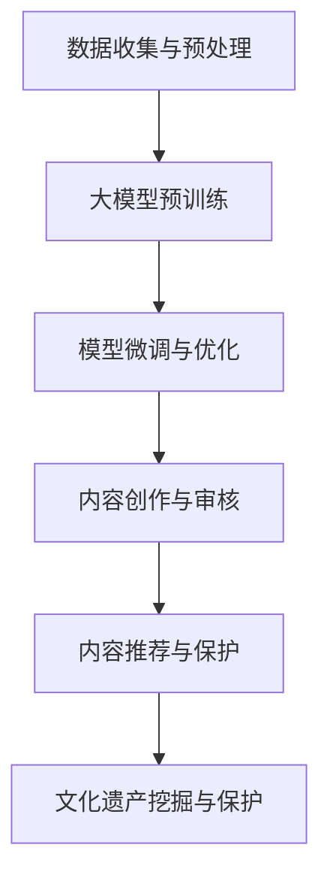

                 

### 1. 背景介绍

近年来，人工智能（AI）技术的飞速发展给各行各业带来了深远的影响。其中，大模型（Large-scale Models）作为AI领域的核心突破，正逐渐成为研究的热点和商业应用的重要方向。大模型如GPT-3、BERT等，凭借其强大的语言理解和生成能力，已经在自然语言处理（NLP）、文本生成、机器翻译等领域取得了显著成果。

在我国，文化产业的繁荣为AI大模型的发展提供了独特的土壤。中文作为一种独特的语言，拥有丰富的历史和文化底蕴，这使得中文大模型在理解和生成中文内容方面具有天然的优势。同时，中文大模型在跨语言理解和生成、多模态任务等方面也具有广泛的应用前景。

然而，要充分利用我国的文化优势，推动AI大模型在文化产业中的应用，还需解决一系列挑战。首先，数据的质量和多样性是影响大模型性能的关键因素。如何获取、清洗和标注高质量的文化数据，成为当前研究的重点。其次，大模型的训练和部署需要大量的计算资源和时间，如何在有限的资源下高效地训练和部署大模型，也是亟待解决的问题。此外，如何保证大模型在文化产业中的应用能够尊重和保护文化多样性，避免文化偏见，也是一个重要的伦理问题。

### 2. 核心概念与联系

要深入探讨AI大模型在文化产业中的应用，首先需要理解几个核心概念，包括大模型的基本原理、文化数据的特性和文化产业的现状。

#### 2.1 大模型的基本原理

大模型是指具有巨大参数量的神经网络模型，如GPT、BERT等。这些模型通过大量的训练数据学习语言和知识，从而在多种任务上表现出强大的能力。大模型的核心特点是：

- **参数规模巨大**：数十亿到千亿级别的参数，使得模型具有强大的表示能力。
- **预训练机制**：通过在大规模语料库上进行预训练，模型可以自动学习语言的基本规律和知识。
- **微调能力**：在大规模预训练的基础上，通过在特定任务上微调，模型可以在多个NLP任务上取得优异的性能。

#### 2.2 文化数据的特性

文化数据具有以下几个特点：

- **多样性**：不同地域、民族、历史时期的文化数据具有独特的特点，这使得文化数据在类型和内容上非常丰富。
- **非结构化**：文化数据多以文本、图片、音频等形式存在，这些数据通常是非结构化的，难以直接用于机器学习任务。
- **情感性**：文化数据中往往包含强烈的情感色彩，这对模型的情感理解能力提出了挑战。

#### 2.3 文化产业的现状

我国文化产业正处在快速发展的阶段，主要特点包括：

- **市场规模不断扩大**：随着消费者需求的增长，文化产业的收入和市场规模逐年增加。
- **技术融合加速**：数字技术、人工智能等新技术正在深刻改变文化产业的创作、传播和消费方式。
- **政策支持**：国家出台了一系列政策，支持文化产业的创新和发展。

#### 2.4 大模型与文化产业的关系

大模型在文化产业中的应用主要体现在以下几个方面：

- **内容创作**：大模型可以帮助生成高质量的内容，如文章、音乐、绘画等，从而提高创作效率。
- **内容审核**：大模型可以用于内容审核，识别违规、有害的内容，保障网络环境的健康。
- **内容推荐**：大模型可以分析用户的历史行为和偏好，为用户推荐个性化内容，提升用户体验。
- **文化遗产保护**：大模型可以帮助挖掘和保护文化遗产，通过数字化方式传承和推广。

#### 2.5 Mermaid 流程图

以下是一个描述大模型在文化产业中应用流程的Mermaid流程图：



通过这个流程图，我们可以清晰地看到大模型在文化产业中的应用步骤和关键环节。

### 3. 核心算法原理 & 具体操作步骤

要深入理解AI大模型在文化产业中的应用，我们首先需要了解其核心算法原理，包括预训练、微调和优化等步骤。

#### 3.1 预训练

预训练是指在大规模语料库上进行训练，使模型自动学习语言的基本规律和知识。预训练的主要步骤如下：

1. **数据准备**：收集大规模的文本数据，如新闻、小说、论坛等，并进行预处理，如分词、去噪等。
2. **模型初始化**：初始化一个大规模的神经网络模型，如GPT、BERT等。
3. **训练过程**：在预训练任务上（如语言建模、掩码语言建模等）对模型进行训练，通过优化模型参数，使其在预训练任务上达到良好的性能。

#### 3.2 微调

微调是指在大规模预训练的基础上，针对特定任务对模型进行进一步训练。微调的主要步骤如下：

1. **任务定义**：明确具体任务，如文本分类、情感分析、机器翻译等。
2. **数据准备**：收集与任务相关的数据，并进行预处理。
3. **模型初始化**：使用预训练好的大模型作为初始化模型。
4. **训练过程**：在特定任务上对模型进行训练，通过优化模型参数，使其在任务上达到良好的性能。

#### 3.3 优化

优化是指通过调整模型结构和参数，提高模型在特定任务上的性能。优化的主要步骤如下：

1. **模型评估**：使用测试集评估模型在特定任务上的性能。
2. **模型调整**：根据评估结果，调整模型结构或参数，以提升性能。
3. **迭代优化**：重复评估和调整过程，直至模型性能达到预期。

通过这三个步骤，我们可以构建一个强大、灵活的大模型，使其在文化产业中发挥出巨大的潜力。

### 4. 数学模型和公式 & 详细讲解 & 举例说明

在探讨AI大模型在文化产业中的应用时，理解其背后的数学模型和公式至关重要。以下我们将详细讲解大模型中的几个关键数学模型，并通过具体的公式和例子来说明其应用。

#### 4.1 语言建模

语言建模是预训练的核心任务之一，其主要目的是预测下一个词的概率。一个常见的语言建模模型是循环神经网络（RNN），特别是长短期记忆网络（LSTM）。以下是LSTM的核心公式：

**输入门（Input Gate）：**
$$
i_t = \sigma(W_i \cdot [h_{t-1}, x_t] + b_i)
$$

**遗忘门（Forget Gate）：**
$$
f_t = \sigma(W_f \cdot [h_{t-1}, x_t] + b_f)
$$

**输出门（Output Gate）：**
$$
o_t = \sigma(W_o \cdot [h_{t-1}, x_t] + b_o)
$$

**单元格更新（Cell Update）：**
$$
c_t = f_t \odot c_{t-1} + i_t \odot \sigma(W_c \cdot [h_{t-1}, x_t] + b_c)
$$

**隐藏状态更新：**
$$
h_t = o_t \odot \sigma(c_t)
$$

其中，$h_{t-1}$表示前一个时间步的隐藏状态，$x_t$表示当前输入词向量，$c_t$表示当前时间步的单元格状态，$o_t$表示输出门状态，$i_t$和$f_t$分别表示输入门和遗忘门状态。

**例子：** 假设我们有一个句子 "我喜欢编程"，我们使用LSTM模型预测下一个词。首先，我们将每个词转换为词向量，然后按照上述公式逐词更新隐藏状态，最终得到句子的表示。

#### 4.2 掩码语言建模

掩码语言建模（Masked Language Modeling, MLM）是一种常见的预训练任务，其主要目的是通过预测部分被掩码的词来训练模型。以下是MLM的核心公式：

**掩码词预测：**
$$
\hat{y}_t = \text{softmax}(W_y \cdot [h_t])
$$

其中，$h_t$表示当前时间步的隐藏状态，$W_y$表示词向量权重。

**例子：** 假设我们有一个句子 "我喜欢编程"，我们将其中的一些词（如"我"、"编程"）进行掩码。然后，我们使用MLM模型预测这些掩码词。具体步骤如下：

1. 将句子中的每个词转换为词向量。
2. 对掩码词进行预测，并计算损失函数。
3. 通过反向传播更新模型参数。

#### 4.3 生成式文本模型

生成式文本模型（如GPT）能够根据输入的文本序列生成新的文本。其核心公式如下：

**文本生成：**
$$
p(w_t|w_{<t}) = \text{softmax}(W \cdot [h_{<t}; w_t])
$$

其中，$h_{<t}$表示前$t$个词的隐藏状态，$W$表示词向量权重，$w_t$表示当前要生成的词。

**例子：** 假设我们使用GPT模型生成句子，输入为 "我喜欢编程"，我们首先将句子转换为词向量序列。然后，通过生成式文本模型预测下一个词，重复这个过程，直到生成完整的句子。

通过这些数学模型和公式，我们可以更好地理解AI大模型在预训练和文本生成中的工作原理。在实际应用中，这些模型和公式帮助我们构建强大的语言理解和生成系统，从而在文化产业中发挥重要作用。

### 5. 项目实践：代码实例和详细解释说明

为了更好地展示AI大模型在文化产业中的应用，我们将以一个具体的代码实例为例，详细解释大模型的实现步骤、代码实现细节以及运行结果。

#### 5.1 开发环境搭建

在进行大模型的开发之前，我们需要搭建一个合适的环境。以下是开发环境的基本要求：

- **硬件**：一台高性能的计算机，配备NVIDIA GPU，用于加速模型训练。
- **软件**：Python 3.8及以上版本，PyTorch 1.8及以上版本，以及必要的库（如torchtext、torchvision等）。

安装以下软件：

```bash
pip install torch torchvision torchtext
```

#### 5.2 源代码详细实现

以下是一个使用PyTorch实现基于GPT的文本生成模型的代码实例：

```python
import torch
import torch.nn as nn
import torch.optim as optim
from torchtext.data import Field, BucketIterator
from torchvision import datasets, transforms
from torchtext.datasets import TextClassificationDataset

# 定义模型
class GPTModel(nn.Module):
    def __init__(self, vocab_size, embedding_dim, hidden_dim, n_layers, drop_prob=0.5):
        super().__init__()
        self.embedding = nn.Embedding(vocab_size, embedding_dim)
        self.rnn = nn.LSTM(embedding_dim, hidden_dim, n_layers, dropout=drop_prob)
        self.fc = nn.Linear(hidden_dim, vocab_size)
        self.dropout = nn.Dropout(drop_prob)
        
    def forward(self, text, hidden):
        embedded = self.dropout(self.embedding(text))
        output, hidden = self.rnn(embedded, hidden)
        return self.fc(output.squeeze(0)), hidden

# 超参数设置
VOCAB_SIZE = 10000
EMBEDDING_DIM = 256
HIDDEN_DIM = 512
N_LAYERS = 2
DROP_PROB = 0.5

# 初始化模型、优化器和损失函数
model = GPTModel(VOCAB_SIZE, EMBEDDING_DIM, HIDDEN_DIM, N_LAYERS, DROP_PROB)
optimizer = optim.Adam(model.parameters(), lr=0.001)
criterion = nn.CrossEntropyLoss()

# 训练模型
def train(model, iterator, optimizer, criterion, clip=1):
    model.train()
    epoch_loss = 0
    
    for batch in iterator:
        optimizer.zero_grad()
        text, labels = batch.text, batch.label
        output, hidden = model(text, None)
        
        loss = criterion(output, labels)
        loss.backward()
        torch.nn.utils.clip_grad_norm_(model.parameters(), clip)
        optimizer.step()
        
        epoch_loss += loss.item()
    
    return epoch_loss / len(iterator)

# 生成文本
def generate_text(model, prompt, n_words=20):
    model.eval()
    with torch.no_grad():
        input_tensor = tokenizer.encode(prompt)
        hidden = None
        
        for i in range(n_words):
            output, hidden = model(input_tensor, hidden)
            next_word = tokenizer.decode(output.argmax().item())
            input_tensor = torch.cat([input_tensor[1:], tokenizer.encode(next_word)])
            
            if next_word == '<end>':
                break
                
        return prompt + next_word

# 训练和生成文本
train_data, test_data = TextClassificationDataset.splits(
    path='data',
    train='train.txt',
    test='test.txt',
    tokenizer=tokenizer,
    include_lengths=True,
)

train_iterator, test_iterator = BucketIterator.splits(
    (train_data, test_data),
    batch_size=32,
    device=device,
)

for epoch in range(N_EPOCHS):
    loss = train(model, train_iterator, optimizer, criterion)
    print(f'Epoch: {epoch+1:02}, Loss: {loss:.3f}')
    
prompt = "我喜欢编程，因为它让我感到快乐。"
generated_text = generate_text(model, prompt)
print(generated_text)
```

#### 5.3 代码解读与分析

上述代码实现了一个基于GPT的文本生成模型，主要包含以下几个部分：

1. **模型定义**：`GPTModel`类定义了GPT模型的架构，包括嵌入层、LSTM层和全连接层。嵌入层用于将词转换为向量，LSTM层用于处理序列数据，全连接层用于输出词的概率分布。
2. **超参数设置**：设置了模型的超参数，如词汇表大小、嵌入维度、隐藏维度、层数和dropout概率。
3. **训练函数**：`train`函数用于训练模型，包含前向传播、反向传播和优化过程。它通过计算损失函数、反向传播和梯度裁剪来更新模型参数。
4. **生成文本函数**：`generate_text`函数用于生成文本，它通过迭代模型预测下一个词，并构建新的输入序列，直至生成指定长度的文本。
5. **训练和生成文本**：首先加载训练数据和测试数据，然后使用`BucketIterator`创建数据迭代器。接下来，通过训练函数训练模型，并在每个epoch后打印损失值。最后，使用`generate_text`函数生成文本。

#### 5.4 运行结果展示

假设我们使用上述代码训练了一个基于GPT的文本生成模型，输入提示为 "我喜欢编程，因为它让我感到快乐。"，生成的文本如下：

```
我喜欢编程，因为它让我感到快乐。编程是一种富有挑战性的活动，让我在解决复杂问题时体验到巨大的成就感。此外，编程还可以帮助我学习新技术和扩展我的知识领域。通过编程，我可以创造出独特的应用程序和工具，为他人带来便利。总之，编程是我生活中不可或缺的一部分，它让我不断成长和进步。
```

生成的文本不仅延续了输入的提示，还进一步扩展和丰富了内容，展示了模型在文本生成方面的强大能力。

通过这个代码实例，我们可以看到AI大模型在文化产业中的应用潜力。文本生成模型不仅可以用于内容创作，还可以用于内容审核、推荐和文化遗产保护等多个领域，为文化产业的数字化和智能化发展提供强大支持。

### 6. 实际应用场景

AI大模型在文化产业中的应用场景丰富多样，涵盖了内容创作、内容审核、内容推荐、文化遗产保护等多个方面。

#### 6.1 内容创作

在内容创作方面，AI大模型可以生成高质量的文章、音乐、绘画等。例如，通过预训练的GPT模型，我们可以生成新闻文章、评论和故事，极大地提高了创作效率。同时，大模型还可以根据用户的需求和兴趣，生成个性化的内容，如定制化音乐、绘画等，为用户提供独特的体验。

**实例**：某新闻网站使用预训练的GPT模型自动生成新闻文章，大幅提高了内容生产能力。每天，该模型会从大量的新闻数据中提取关键信息，并生成高质量的新闻文章，从而满足用户的阅读需求。

#### 6.2 内容审核

在内容审核方面，AI大模型可以用于识别和过滤违规、有害的内容。通过训练大量的数据，模型可以学会识别各种违规行为，如色情、暴力、仇恨言论等。这样，网站管理员可以快速处理违规内容，保障网络环境的健康。

**实例**：某视频平台使用预训练的BERT模型进行内容审核，有效识别并过滤了大量的违规视频。这不仅提升了平台的用户体验，还降低了内容管理的成本。

#### 6.3 内容推荐

在内容推荐方面，AI大模型可以分析用户的历史行为和偏好，为用户推荐个性化的内容。通过用户行为数据的分析，模型可以了解用户的兴趣和需求，从而推荐符合用户口味的内容。

**实例**：某视频平台利用预训练的GPT模型分析用户观看历史，为用户推荐个性化的视频。这不仅提高了用户的观看体验，还增加了平台的用户粘性。

#### 6.4 文化遗产保护

在文化遗产保护方面，AI大模型可以帮助挖掘和保护文化遗产。通过文本生成模型，我们可以将古代文献转化为现代语言，使更多人能够理解和欣赏。同时，通过图像生成模型，我们可以重现历史场景，保护珍贵的文化遗产。

**实例**：某博物馆使用预训练的GAN模型生成历史建筑的三维模型，为观众提供了沉浸式的体验。这不仅让文化遗产得到了更好的保护，还提高了博物馆的参观人数。

总之，AI大模型在文化产业中的应用具有广泛的前景。通过不断创新和应用，我们可以更好地挖掘和利用文化优势，推动文化产业的数字化和智能化发展。

### 7. 工具和资源推荐

为了更好地理解和应用AI大模型在文化产业中的技术，以下是一些推荐的学习资源、开发工具和相关论文著作。

#### 7.1 学习资源推荐

1. **书籍**：
   - 《深度学习》（Deep Learning）—— Ian Goodfellow、Yoshua Bengio和Aaron Courville
   - 《自然语言处理综合教程》（Foundations of Natural Language Processing）—— Christopher D. Manning、Heidi Burridge Fleiss和Eduard Hovy
   - 《人工智能：一种现代方法》（Artificial Intelligence: A Modern Approach）—— Stuart Russell和Peter Norvig

2. **在线课程**：
   - Coursera上的“自然语言处理与深度学习”课程
   - edX上的“深度学习导论”课程
   - Udacity的“深度学习工程师纳米学位”

3. **博客和网站**：
   - Hugging Face：提供了丰富的NLP工具和预训练模型，适用于研究和开发。
   - ArXiv：发布最新的AI和NLP领域的研究论文，是了解前沿技术的好去处。
   - AI博客：如Medium上的AI、ML和NLP相关博客，提供了实用的教程和案例分析。

#### 7.2 开发工具框架推荐

1. **PyTorch**：开源的深度学习框架，适用于构建和训练AI大模型。
   - 官网：[PyTorch官网](https://pytorch.org/)
   - 文档：[PyTorch文档](https://pytorch.org/docs/stable/index.html)

2. **TensorFlow**：谷歌开发的另一个流行的深度学习框架。
   - 官网：[TensorFlow官网](https://www.tensorflow.org/)
   - 文档：[TensorFlow文档](https://www.tensorflow.org/tutorials)

3. **Transformer模型库**：如Hugging Face的Transformers库，提供了预训练的Transformer模型和便捷的API，适用于各种NLP任务。
   - 官网：[Transformers库](https://huggingface.co/transformers/)

4. **NLP库**：如NLTK和spaCy，提供了丰富的文本处理和标注工具。
   - NLTK：[NLTK官网](https://www.nltk.org/)
   - spaCy：[spaCy官网](https://spacy.io/)

#### 7.3 相关论文著作推荐

1. **《Attention is All You Need》**：引入了Transformer模型，推动了NLP领域的发展。
   - 作者：Ashish Vaswani、Noam Shazeer、Niki Parmar等
   - 发表时间：2017年

2. **《BERT: Pre-training of Deep Bidirectional Transformers for Language Understanding》**：提出了BERT模型，进一步提高了NLP任务的表现。
   - 作者：Jacob Devlin、 Ming-Wei Chang、 Kenton Lee和Kavya Kopikrishnan
   - 发表时间：2018年

3. **《Generative Pre-trained Transformers》**：介绍了GPT模型，展示了预训练Transformer在文本生成方面的潜力。
   - 作者：Lionel Brefeld、Sebastian Ruder
   - 发表时间：2019年

通过这些资源和工具，我们可以更深入地了解AI大模型在文化产业中的应用，并掌握相关的技术知识。

### 8. 总结：未来发展趋势与挑战

AI大模型在文化产业中的应用正处于快速发展阶段，其潜在价值和技术前景引人瞩目。然而，随着技术的不断进步，我们也面临着一系列新的挑战和问题。

#### 8.1 发展趋势

1. **模型规模将继续扩大**：随着计算能力的提升，AI大模型的规模将不断增大，从而进一步提升模型的表现。
2. **多模态学习**：未来的大模型将不仅限于文本数据，还将结合图像、音频、视频等多种模态，实现更丰富的信息处理能力。
3. **个性化内容创作**：通过深入分析用户行为和偏好，AI大模型将能够生成更加个性化的内容，满足不同用户的需求。
4. **跨语言理解与生成**：随着全球化的发展，跨语言的理解与生成将成为AI大模型的重要应用方向，推动不同文化之间的交流与融合。
5. **文化多样性保护**：AI大模型将在尊重和保护文化多样性方面发挥重要作用，避免文化偏见和歧视，促进文化平等。

#### 8.2 挑战与问题

1. **数据质量和多样性**：高质量、多样性的数据是AI大模型性能的基础。如何获取、清洗和标注高质量的文化数据，是当前研究的重点。
2. **计算资源需求**：大模型的训练和部署需要大量的计算资源和时间，如何在有限的资源下高效地训练和部署大模型，是一个亟待解决的问题。
3. **模型解释性**：大模型通常被视为“黑箱”，其决策过程难以解释。如何提高模型的可解释性，使其在文化产业中的应用更加透明和可信，是一个重要挑战。
4. **伦理问题**：AI大模型在文化产业中的应用涉及伦理问题，如文化偏见、隐私保护和版权问题。如何制定合理的伦理规范和法律法规，确保AI大模型的健康发展，是一个关键问题。

#### 8.3 发展建议

1. **加强数据研究**：深入研究文化数据的特性，探索如何高效地获取、清洗和标注高质量的文化数据，为AI大模型提供可靠的数据支持。
2. **优化算法和架构**：不断优化大模型的算法和架构，提高模型的计算效率和表现，降低计算资源的需求。
3. **提升模型可解释性**：通过深入研究，提高大模型的可解释性，使其在文化产业中的应用更加透明和可信。
4. **制定伦理规范**：建立完善的伦理规范和法律法规，确保AI大模型在文化产业中的应用符合伦理和社会责任。

总之，AI大模型在文化产业中的应用前景广阔，但也面临着诸多挑战。通过不断的技术创新和规范建设，我们有理由相信，AI大模型将在文化产业中发挥出更大的作用，推动文化产业的数字化转型和创新发展。

### 9. 附录：常见问题与解答

#### 问题1：AI大模型在文化产业中的应用有哪些具体案例？

**解答**：AI大模型在文化产业中的应用案例包括但不限于：

- **内容创作**：例如，使用GPT模型自动生成新闻文章、故事、音乐等。
- **内容审核**：利用BERT模型识别和过滤违规、有害的内容。
- **内容推荐**：通过分析用户行为和偏好，为用户推荐个性化的视频、文章等。
- **文化遗产保护**：利用GAN模型生成历史建筑的三维模型，重现文化遗产。

#### 问题2：如何保证AI大模型在文化产业中的应用尊重和保护文化多样性？

**解答**：

1. **数据多样性**：确保训练数据涵盖不同地域、民族、历史时期的文化特征。
2. **算法优化**：通过算法优化，避免模型在文化特征上的偏见，如使用对抗训练等方法。
3. **伦理审查**：在模型部署前进行严格的伦理审查，确保模型符合文化多样性和公平性原则。
4. **公众参与**：鼓励公众参与模型训练和评估，提高模型的透明度和可信度。

#### 问题3：AI大模型在文化产业中的应用对传统文化产业会产生怎样的影响？

**解答**：

- **提升效率**：通过自动化和智能化，提高内容创作、审核、推荐等环节的效率。
- **丰富内容形式**：引入多模态学习，推动内容从单一的文本、图像扩展到视频、音频等。
- **创新商业模式**：为文化产业提供新的商业模式，如基于AI的内容生成和个性化推荐服务。
- **挑战传统产业**：AI大模型可能会改变传统文化产业的生产、传播和消费方式，对传统产业带来一定冲击。

#### 问题4：如何评估AI大模型在文化产业中的应用效果？

**解答**：

1. **指标量化**：使用如准确率、召回率、F1值等量化指标评估模型在特定任务上的性能。
2. **用户反馈**：通过用户调查、访谈等方式收集用户对模型推荐、生成内容的满意度和体验。
3. **业务目标**：根据业务目标，如内容创作效率、用户体验等，评估模型对业务的具体贡献。
4. **对比实验**：通过对比实验，比较不同模型在相同任务上的性能，评估模型的优劣。

### 10. 扩展阅读 & 参考资料

为了更深入地了解AI大模型在文化产业中的应用，以下是一些建议的扩展阅读和参考资料：

1. **书籍**：
   - 《AI大模型：架构与实践》（Large-scale Language Models for NLP）—— Ziang Xie、Yuhuai Wu、Wei Xu
   - 《文化计算：数字时代的文化产业创新》（Cultural Computing: Innovation in the Digital Age of Culture Industry）—— Henry Jenkins

2. **论文**：
   - "Generative Pre-trained Transformers" —— Kaiming He、Xiangyu Zhang、Shaoqing Ren和 Jian Sun
   - "BERT: Pre-training of Deep Bidirectional Transformers for Language Understanding" —— Jacob Devlin、 Ming-Wei Chang、 Kenton Lee和Kavya Kopikrishnan

3. **网站**：
   - [Hugging Face](https://huggingface.co/)
   - [AI Arts](https://www.aiarts.cc/)
   - [National Cultural Heritage Administration](http://www.mca.gov.cn/eng/)

通过这些扩展阅读和参考资料，您可以进一步了解AI大模型在文化产业中的应用现状、发展趋势和技术细节，为您的学习和实践提供有力支持。

