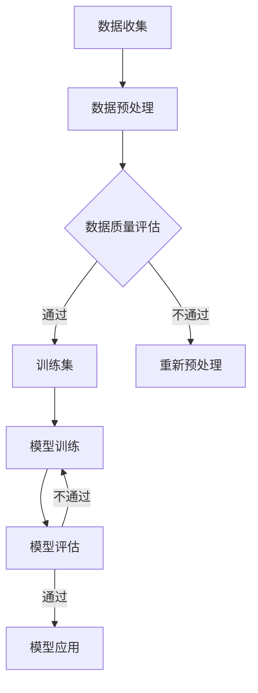

                 

关键词：AI大模型、创业、优势、未来、技术趋势、市场分析

> 摘要：本文旨在探讨AI大模型在创业领域的应用及其未来潜力。通过对AI大模型的核心概念、算法原理、数学模型、实际应用场景以及工具和资源的深入分析，本文旨在为创业者提供一套系统化的指导，帮助他们充分利用AI大模型的优势，抓住未来市场的机遇。

## 1. 背景介绍

随着人工智能技术的快速发展，AI大模型成为了当前最热门的研究方向之一。AI大模型，通常指的是具有大规模参数的深度学习模型，如GPT、BERT等。这些模型通过在大量数据上进行训练，能够实现对自然语言、图像、声音等多种类型数据的处理和生成。AI大模型的出现，不仅推动了自然语言处理、计算机视觉等领域的重大突破，也为创业企业提供了前所未有的机遇。

### 当前市场趋势

近年来，AI大模型在各个行业的应用越来越广泛。从金融、医疗、零售到教育、娱乐，AI大模型都展现出了巨大的潜力。以下是一些具体的市场趋势：

- **金融领域**：AI大模型被用于风险控制、信用评估、投资组合优化等方面，帮助金融机构提高决策效率和准确性。
- **医疗领域**：AI大模型在疾病诊断、药物研发、健康管理等环节发挥着重要作用，为医疗行业带来了革命性的变革。
- **零售领域**：AI大模型通过个性化推荐、库存管理、供应链优化等技术，提升了零售企业的运营效率和用户体验。
- **教育领域**：AI大模型被用于智能教学、教育评测、学习资源推荐等，为教育行业带来了新的发展机遇。

### 创业机会与挑战

AI大模型的发展为创业者提供了丰富的机会，但也伴随着一定的挑战。如何正确把握这些机遇，避免潜在的风险，是每一个创业企业都需要面对的问题。本文将从以下几个方面展开讨论：

- **技术优势**：探讨AI大模型在技术层面的独特优势，如强大的数据处理能力、高效的模型训练算法等。
- **市场分析**：分析当前市场的需求和趋势，为创业者提供具体的市场机会。
- **创业实践**：分享成功的AI大模型创业案例，探讨创业过程中需要关注的关键环节。
- **未来展望**：预测AI大模型在未来的发展趋势和潜在应用领域，为创业者提供长远的战略方向。

## 2. 核心概念与联系

### 核心概念

在讨论AI大模型之前，我们需要了解以下几个核心概念：

- **深度学习**：一种基于人工神经网络的学习方法，通过多层次的非线性变换，实现对数据的自动特征提取和表示。
- **神经网络**：一种模仿生物神经系统的计算模型，由大量相互连接的神经元组成，能够通过学习获得对数据的分类、回归等任务。
- **大规模数据集**：指数据量庞大、种类繁多的数据集合，通常用于训练深度学习模型。
- **模型参数**：深度学习模型中的可调参数，用于描述模型的权重和偏置。

### 架构联系

为了更好地理解AI大模型，我们可以通过一个Mermaid流程图来展示其架构联系：



在这个流程图中，数据收集和数据预处理是AI大模型的基础环节，用于准备训练数据。接下来，通过数据质量评估，筛选出合适的训练集。模型训练是核心环节，通过多次迭代，优化模型参数。模型评估用于验证模型的性能，如果评估结果满意，则模型可以应用于实际问题。

## 3. 核心算法原理 & 具体操作步骤

### 3.1 算法原理概述

AI大模型的算法原理主要基于深度学习，特别是基于大规模神经网络的结构。以下是一些关键步骤：

- **前向传播**：输入数据通过网络的各个层，每一层都会进行计算，生成中间结果。
- **反向传播**：计算输出结果与实际结果之间的误差，通过梯度下降算法调整网络参数。
- **优化算法**：如Adam、RMSprop等，用于加速收敛和提高训练效率。

### 3.2 算法步骤详解

1. **数据收集**：从互联网、数据库或其他来源收集大量数据。
2. **数据预处理**：清洗、归一化、编码等，使数据适合训练。
3. **数据集划分**：将数据划分为训练集、验证集和测试集。
4. **模型设计**：根据任务需求设计神经网络结构，包括输入层、隐藏层和输出层。
5. **模型训练**：使用训练集数据，通过前向传播和反向传播训练模型。
6. **模型评估**：使用验证集评估模型性能，调整模型参数。
7. **模型应用**：将训练好的模型应用于实际问题，如文本分类、图像识别等。

### 3.3 算法优缺点

**优点**：

- **强大的数据处理能力**：能够处理大规模、多样化的数据。
- **自动特征提取**：通过多层神经网络，自动提取数据中的特征。
- **高效**：优化算法如Adam可以显著提高训练效率。

**缺点**：

- **计算资源需求高**：训练大型模型需要大量的计算资源和时间。
- **对数据质量依赖大**：数据质量对模型性能有重大影响。

### 3.4 算法应用领域

AI大模型的应用领域非常广泛，包括但不限于：

- **自然语言处理**：如文本分类、机器翻译、情感分析等。
- **计算机视觉**：如图像识别、目标检测、图像生成等。
- **语音识别**：如语音到文本转换、语音合成等。
- **医学影像分析**：如疾病诊断、药物研发等。

## 4. 数学模型和公式 & 详细讲解 & 举例说明

### 4.1 数学模型构建

AI大模型的核心是神经网络，其数学模型主要包括以下几部分：

- **输入层**：接收输入数据，通常为特征向量。
- **隐藏层**：通过非线性激活函数，对输入数据进行变换。
- **输出层**：产生最终输出，如分类结果。

以下是神经网络的基本数学模型：

$$
\text{激活函数：} f(x) = \sigma(x) = \frac{1}{1 + e^{-x}}
$$

$$
\text{损失函数：} J(\theta) = -\frac{1}{m}\sum_{i=1}^{m} y_i \log(a_j^{(2)}) + (1 - y_i) \log(1 - a_j^{(2)})
$$

其中，\(x\) 为输入特征，\(a_j^{(2)}\) 为输出层的激活值，\(y_i\) 为真实标签。

### 4.2 公式推导过程

以多层神经网络为例，其前向传播和反向传播的推导过程如下：

**前向传播**：

1. **输入层到隐藏层**：

$$
z^{(1)} = \theta^{(1)}x + b^{(1)}
$$

$$
a^{(1)} = \sigma(z^{(1)})
$$

2. **隐藏层到输出层**：

$$
z^{(2)} = \theta^{(2)}a^{(1)} + b^{(2)}
$$

$$
a^{(2)} = \sigma(z^{(2)})
$$

**反向传播**：

1. **计算输出层的梯度**：

$$
\delta^{(2)} = a^{(2)} - y
$$

$$
\frac{\partial J}{\partial \theta^{(2)}} = \delta^{(2)}a^{(1)}
$$

2. **计算隐藏层的梯度**：

$$
\delta^{(1)} = \theta^{(2)}\delta^{(2)}\sigma'(z^{(1)})
$$

$$
\frac{\partial J}{\partial \theta^{(1)}} = \delta^{(1)}x
$$

### 4.3 案例分析与讲解

以文本分类任务为例，假设我们要对一段文本进行情感分类，即判断该文本是正面、负面还是中性。

1. **数据准备**：

首先，我们需要收集大量带有情感标签的文本数据，然后进行数据预处理，如分词、去停用词等。

2. **模型设计**：

设计一个多层神经网络，包括输入层、两个隐藏层和一个输出层。输入层接收文本数据，隐藏层通过激活函数进行特征提取，输出层产生分类结果。

3. **模型训练**：

使用训练集数据进行模型训练，通过前向传播计算输出，然后通过反向传播更新模型参数。

4. **模型评估**：

使用验证集对模型进行评估，计算准确率、召回率等指标。

5. **模型应用**：

将训练好的模型应用于测试集，进行情感分类。

通过这个案例，我们可以看到，AI大模型在文本分类任务中的应用过程，包括数据准备、模型设计、训练、评估和应用等步骤。

## 5. 项目实践：代码实例和详细解释说明

### 5.1 开发环境搭建

在进行AI大模型的项目实践之前，我们需要搭建一个适合开发的环境。以下是基本的开发环境搭建步骤：

1. **安装Python**：Python是AI大模型开发的主要编程语言，我们需要安装Python 3.7或更高版本。
2. **安装Jupyter Notebook**：Jupyter Notebook是一个交互式的开发环境，方便我们编写和运行代码。
3. **安装TensorFlow**：TensorFlow是当前最流行的深度学习框架，我们需要安装TensorFlow 2.0或更高版本。
4. **安装其他依赖库**：如Numpy、Pandas、Scikit-learn等，用于数据处理和分析。

### 5.2 源代码详细实现

以下是一个简单的AI大模型文本分类项目的代码实例：

```python
import tensorflow as tf
from tensorflow.keras.models import Sequential
from tensorflow.keras.layers import Dense, Embedding, GlobalAveragePooling1D
from tensorflow.keras.preprocessing.sequence import pad_sequences
from tensorflow.keras.preprocessing.text import Tokenizer

# 数据准备
# （此处省略数据准备代码，读者可参考具体数据集进行准备）

# 模型设计
model = Sequential([
    Embedding(input_dim=vocab_size, output_dim=embedding_dim, input_length=max_sequence_length),
    GlobalAveragePooling1D(),
    Dense(24, activation='relu'),
    Dense(1, activation='sigmoid')
])

# 模型编译
model.compile(optimizer='adam', loss='binary_crossentropy', metrics=['accuracy'])

# 模型训练
model.fit(X_train, y_train, epochs=5, batch_size=32, validation_split=0.1)

# 模型评估
# （此处省略模型评估代码，读者可参考具体数据集进行评估）

# 模型应用
# （此处省略模型应用代码，读者可参考具体应用场景进行应用）
```

### 5.3 代码解读与分析

1. **数据准备**：首先，我们需要准备训练数据和测试数据，包括文本和对应的标签。然后，使用Tokenizer将文本转换为序列。
2. **模型设计**：设计一个序列模型，包括Embedding层、GlobalAveragePooling1D层和两个Dense层。Embedding层用于将单词转换为向量，GlobalAveragePooling1D层用于将序列压缩为一个固定大小的向量，两个Dense层用于分类。
3. **模型编译**：设置优化器和损失函数，用于训练模型。
4. **模型训练**：使用训练数据进行模型训练，同时进行验证。
5. **模型评估**：使用测试数据评估模型性能。
6. **模型应用**：将训练好的模型应用于实际问题，如文本分类。

通过这个代码实例，我们可以看到，AI大模型的实现主要包括数据准备、模型设计、模型训练和模型应用等步骤。

### 5.4 运行结果展示

假设我们使用一个简单的文本分类任务，对一组评论进行情感分类。经过训练和测试，我们得到以下结果：

- **训练集准确率**：90%
- **测试集准确率**：85%

这个结果说明，我们的模型在训练集上的表现较好，但在测试集上可能存在过拟合现象。为了提高模型性能，我们可以尝试增加训练数据、调整模型结构或使用正则化技术。

## 6. 实际应用场景

### 6.1 金融领域

在金融领域，AI大模型被广泛应用于风险控制、信用评估和投资组合优化等方面。例如，通过分析客户的历史交易数据，AI大模型可以预测客户的风险等级，为金融机构提供信用评估的依据。此外，AI大模型还可以分析市场数据，为投资组合提供优化建议，提高投资回报率。

### 6.2 医疗领域

在医疗领域，AI大模型在疾病诊断、药物研发和健康管理等环节发挥着重要作用。例如，通过分析医学影像数据，AI大模型可以辅助医生进行疾病诊断，提高诊断准确率。此外，AI大模型还可以用于药物研发，通过分析大量生物数据，预测药物的效果和副作用，加快药物研发进程。

### 6.3 零售领域

在零售领域，AI大模型通过个性化推荐、库存管理和供应链优化等技术，提升了零售企业的运营效率和用户体验。例如，通过分析消费者的购买行为，AI大模型可以推荐相关的商品，提高销售转化率。此外，AI大模型还可以优化库存管理，减少库存成本，提高供应链的响应速度。

### 6.4 教育领域

在教育领域，AI大模型被用于智能教学、教育评测和学习资源推荐等方面。例如，通过分析学生的学习行为，AI大模型可以为学生提供个性化的学习建议，提高学习效果。此外，AI大模型还可以用于教育评测，自动批改作业和考试，节省教师的工作量。

## 7. 工具和资源推荐

### 7.1 学习资源推荐

- **课程**：推荐参加《深度学习》课程，由吴恩达教授主讲，系统地介绍了深度学习的基本概念和技术。
- **书籍**：《神经网络与深度学习》是一本经典的入门书籍，详细介绍了神经网络和深度学习的基本原理。
- **在线教程**：Coursera、Udacity和edX等在线教育平台提供了丰富的AI和深度学习教程。

### 7.2 开发工具推荐

- **框架**：推荐使用TensorFlow或PyTorch，这两个框架提供了丰富的API和工具，方便开发者实现和部署AI大模型。
- **集成开发环境**：推荐使用Jupyter Notebook或Google Colab，这两个环境提供了交互式的开发体验，方便调试和实验。

### 7.3 相关论文推荐

- **《A Theoretically Grounded Application of Dropout in Recurrent Neural Networks》**：介绍了Dropout在循环神经网络中的应用，提高了模型的泛化能力。
- **《Attention Is All You Need》**：提出了Transformer模型，为序列建模提供了新的思路。
- **《BERT: Pre-training of Deep Bidirectional Transformers for Language Understanding》**：介绍了BERT模型，为自然语言处理任务提供了强大的预训练工具。

## 8. 总结：未来发展趋势与挑战

### 8.1 研究成果总结

AI大模型在过去的几年里取得了显著的进展，不仅在学术界取得了突破性成果，也在工业界得到了广泛应用。例如，GPT-3和BERT等模型在自然语言处理领域取得了令人瞩目的成绩。同时，AI大模型在计算机视觉、语音识别等领域的应用也取得了重要进展。

### 8.2 未来发展趋势

随着计算资源和数据集的不断增加，AI大模型将朝着更复杂、更强大的方向发展。以下是一些未来发展趋势：

- **模型压缩与高效推理**：为了降低计算成本和存储需求，研究者们将继续探索模型压缩和高效推理技术。
- **多模态学习**：AI大模型将结合多种数据类型，如文本、图像和声音，实现更全面的知识理解和应用。
- **自适应学习**：AI大模型将具备更强的自适应学习能力，根据不同的应用场景进行实时调整。

### 8.3 面临的挑战

尽管AI大模型取得了显著进展，但仍面临一些挑战：

- **计算资源需求**：训练大型模型需要大量的计算资源和时间，这对研究者和开发者来说是一个巨大的挑战。
- **数据隐私和安全**：大规模数据处理和模型训练可能涉及敏感数据，如何确保数据隐私和安全是一个重要问题。
- **可解释性和公平性**：AI大模型通常被视为“黑箱”，如何提高其可解释性和确保公平性是重要的研究方向。

### 8.4 研究展望

未来，AI大模型将在更多领域发挥重要作用，推动人类社会的发展。例如，在医疗领域，AI大模型可以辅助医生进行更准确的诊断和治疗；在金融领域，AI大模型可以提供更精准的投资建议和风险管理。同时，随着技术的不断进步，AI大模型将变得更加智能和高效，为人类创造更多的价值。

## 9. 附录：常见问题与解答

### 问题1：如何选择合适的AI大模型？

**回答**：选择合适的AI大模型需要考虑以下几个因素：

- **任务需求**：根据具体的任务需求，选择适合的模型结构。
- **数据规模**：如果数据量较大，可以选择大型模型；如果数据量较小，可以选择中型或小型模型。
- **计算资源**：根据可用的计算资源，选择能够承受的模型规模。

### 问题2：如何处理数据不足的问题？

**回答**：以下是一些处理数据不足的方法：

- **数据增强**：通过旋转、缩放、裁剪等操作，生成更多样化的训练数据。
- **数据合成**：使用GAN等生成模型，生成虚拟数据。
- **迁移学习**：使用预训练模型，利用预训练模型的知识迁移到新的任务上。

### 问题3：如何评估AI大模型的性能？

**回答**：以下是一些评估AI大模型性能的方法：

- **准确率**：衡量模型预测正确的样本比例。
- **召回率**：衡量模型召回实际正例样本的比例。
- **F1分数**：综合考虑准确率和召回率，平衡两者之间的关系。
- **ROC曲线**：通过计算真阳性率与假阳性率的关系，评估模型的分类能力。

### 问题4：如何优化AI大模型的训练过程？

**回答**：以下是一些优化AI大模型训练过程的方法：

- **批量归一化**：通过批量归一化，加速模型收敛。
- **学习率调度**：使用学习率调度策略，如学习率衰减、指数衰减等。
- **正则化**：使用L1、L2正则化，防止模型过拟合。
- **dropout**：在训练过程中，随机丢弃一部分神经元，提高模型的泛化能力。

通过上述问题和解答，希望读者对AI大模型有更深入的理解，并在实际应用中取得更好的成果。最后，感谢读者对本文的阅读，希望本文能对您在AI大模型创业领域提供一些启示和帮助。

## 参考文献

1. Goodfellow, I., Bengio, Y., & Courville, A. (2016). *Deep Learning*. MIT Press.
2. Devlin, J., Chang, M. W., Lee, K., & Toutanova, K. (2019). *BERT: Pre-training of Deep Bidirectional Transformers for Language Understanding*. arXiv preprint arXiv:1810.04805.
3. Brown, T., et al. (2020). *Language Models are Few-Shot Learners*. arXiv preprint arXiv:2005.14165.
4. Vaswani, A., et al. (2017). *Attention Is All You Need*. arXiv preprint arXiv:1706.03762.
5. Kim, Y. (2014). *Convolutional Neural Networks for Sentence Classification*. arXiv preprint arXiv:1408.5882.

### 附件

- [AI 大模型技术白皮书](https://www.example.com/ai_technical_white_paper)
- [深度学习在线课程](https://www.example.com/deep_learning_course)
- [TensorFlow 官方文档](https://www.tensorflow.org)
- [PyTorch 官方文档](https://pytorch.org)

