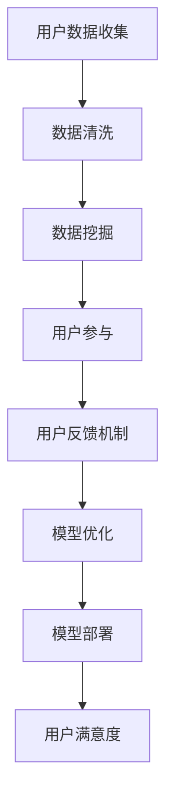

                 

 在这个数字化时代，人工智能（AI）大模型成为了众多创业者眼中的“香饽饽”。AI 大模型通过深度学习算法，对大量数据进行训练，以实现对复杂问题的智能解决。然而，要想在竞争激烈的市场中脱颖而出，单靠技术实力远远不够，还需要充分利用用户优势。本文将探讨如何通过用户优势来推动 AI 大模型创业，包括用户数据的价值挖掘、用户参与和反馈机制的建立，以及用户隐私保护的挑战和解决方案。

## 1. 背景介绍

人工智能的快速发展使得大模型技术逐渐成熟，同时，数据量的爆炸式增长为 AI 大模型的应用提供了丰富的素材。从图像识别、自然语言处理到医疗诊断、金融分析，AI 大模型已经在多个领域展现了其强大的潜力。然而，这些模型的训练和优化都需要大量的高质量数据。与此同时，用户在日常生活和工作中产生的数据，成为了宝贵的资源。

用户优势体现在以下几个方面：

1. **数据丰富性**：用户数据涵盖了个人偏好、行为模式、社交网络等多个维度，为 AI 大模型的训练提供了丰富的信息。
2. **数据真实性**：用户数据通常是真实世界的反映，更接近实际应用场景，有助于提高模型的准确性。
3. **数据动态性**：用户数据是实时变化的，可以反映社会和环境的动态变化，有助于模型的持续优化。

## 2. 核心概念与联系

为了更好地理解如何利用用户优势，我们需要明确以下几个核心概念：

### 2.1 AI 大模型

AI 大模型是指采用深度学习算法训练的复杂神经网络模型。这些模型通常具有亿级以上的参数，可以对海量数据进行高效处理。

### 2.2 用户数据

用户数据包括用户的个人信息、行为记录、社交网络等。这些数据通常是结构化或半结构化的，可以通过数据挖掘技术提取有价值的信息。

### 2.3 数据挖掘

数据挖掘是从大量数据中提取有价值信息的过程。它包括数据清洗、数据集成、数据分类、数据聚类等多个步骤。

### 2.4 用户参与

用户参与是指用户主动参与到 AI 大模型的训练和应用过程中，如提供数据、反馈建议等。

### 2.5 用户反馈机制

用户反馈机制是指通过收集用户反馈来优化 AI 大模型的过程。用户反馈可以包括错误报告、满意度评价等。

下面是一个简单的 Mermaid 流程图，展示 AI 大模型创业中用户优势的利用过程：



## 3. 核心算法原理 & 具体操作步骤

### 3.1 算法原理概述

AI 大模型的训练过程通常包括以下几个步骤：

1. **数据预处理**：对用户数据进行清洗、去噪、标准化等处理，使其适合模型训练。
2. **特征提取**：从原始数据中提取出对模型训练有用的特征。
3. **模型训练**：使用深度学习算法，对提取出的特征进行训练，生成模型参数。
4. **模型评估**：使用验证集或测试集评估模型性能，调整模型参数。
5. **模型部署**：将训练好的模型部署到实际应用场景中。

### 3.2 算法步骤详解

#### 3.2.1 数据预处理

数据预处理是模型训练的第一步，其质量直接影响模型的训练效果。主要步骤包括：

- **数据清洗**：去除重复数据、缺失值填充、去除噪声数据等。
- **数据标准化**：将不同特征的数据进行标准化处理，使其具备相似的尺度。
- **数据集成**：将来自不同源的数据进行整合，形成统一的数据集。

#### 3.2.2 特征提取

特征提取是从原始数据中提取出对模型训练有用的特征。特征提取的质量直接影响到模型的性能。常用的特征提取方法包括：

- **统计特征**：如平均值、中位数、标准差等。
- **文本特征**：如词频、词向量、主题模型等。
- **图像特征**：如边缘、纹理、形状等。

#### 3.2.3 模型训练

模型训练是使用深度学习算法，对提取出的特征进行训练，生成模型参数。常用的深度学习算法包括：

- **神经网络**：如卷积神经网络（CNN）、循环神经网络（RNN）、Transformer 等。
- **增强学习**：如深度增强学习、策略梯度方法等。

#### 3.2.4 模型评估

模型评估是使用验证集或测试集评估模型性能，调整模型参数。常用的评估指标包括：

- **准确率**：模型预测正确的样本数占总样本数的比例。
- **召回率**：模型预测正确的样本数占实际正样本数的比例。
- **F1 值**：准确率和召回率的调和平均值。

#### 3.2.5 模型部署

模型部署是将训练好的模型部署到实际应用场景中。部署方式包括：

- **在线部署**：模型部署在服务器上，实时处理用户请求。
- **离线部署**：模型部署在服务器上，定期处理数据。

### 3.3 算法优缺点

#### 优点

- **强大的数据处理能力**：深度学习算法可以对海量数据进行高效处理，提取出有价值的信息。
- **自适应性强**：深度学习算法可以根据数据变化自动调整模型参数，适应不同场景。
- **应用广泛**：深度学习算法可以应用于图像识别、自然语言处理、医疗诊断等多个领域。

#### 缺点

- **训练成本高**：深度学习算法需要大量的计算资源进行训练，成本较高。
- **数据依赖性强**：深度学习算法对数据质量有较高要求，数据质量直接影响模型性能。
- **解释性较差**：深度学习算法的黑箱特性使得其难以解释，增加了应用难度。

### 3.4 算法应用领域

AI 大模型在多个领域展现了强大的应用潜力：

- **图像识别**：如人脸识别、物体检测等。
- **自然语言处理**：如机器翻译、文本分类等。
- **医疗诊断**：如疾病预测、治疗方案推荐等。
- **金融分析**：如风险控制、投资建议等。

## 4. 数学模型和公式 & 详细讲解 & 举例说明

### 4.1 数学模型构建

在 AI 大模型中，常用的数学模型包括损失函数、优化算法和评价指标等。

#### 损失函数

损失函数用于衡量模型预测值与真实值之间的差距。常见的损失函数包括均方误差（MSE）、交叉熵损失等。

$$
MSE(y', y) = \frac{1}{n} \sum_{i=1}^{n} (y_i - y'_i)^2
$$

$$
H(y', y) = -\sum_{i=1}^{n} y_i \log(y'_i)
$$

其中，$y$ 为真实值，$y'$ 为预测值。

#### 优化算法

优化算法用于调整模型参数，以最小化损失函数。常见的优化算法包括梯度下降、随机梯度下降等。

$$
w_{t+1} = w_t - \alpha \nabla_w J(w_t)
$$

其中，$w_t$ 为当前模型参数，$\alpha$ 为学习率，$J(w_t)$ 为损失函数。

#### 评价指标

评价指标用于衡量模型性能，常见的评价指标包括准确率、召回率、F1 值等。

$$
Precision = \frac{TP}{TP + FP}
$$

$$
Recall = \frac{TP}{TP + FN}
$$

$$
F1 = \frac{2 \times Precision \times Recall}{Precision + Recall}
$$

其中，$TP$ 为真实正样本中被正确预测的正样本数，$FP$ 为被错误预测为正样本的负样本数，$FN$ 为真实正样本中被错误预测为负样本数。

### 4.2 公式推导过程

以均方误差（MSE）为例，推导其梯度下降过程。

$$
\frac{\partial MSE}{\partial w} = \frac{\partial}{\partial w} \left( \frac{1}{n} \sum_{i=1}^{n} (y_i - y'_i)^2 \right)
$$

$$
= \frac{1}{n} \sum_{i=1}^{n} \frac{\partial}{\partial w} (y_i - y'_i)^2
$$

$$
= \frac{1}{n} \sum_{i=1}^{n} 2(y_i - y'_i) \frac{\partial}{\partial w} (y'_i)
$$

$$
= \frac{2}{n} \sum_{i=1}^{n} (y_i - y'_i) \nabla_w y'_i
$$

其中，$\nabla_w y'_i$ 表示 $y'_i$ 对 $w$ 的梯度。

### 4.3 案例分析与讲解

#### 案例一：图像识别

假设我们有一个图像识别任务，使用卷积神经网络（CNN）进行训练。数据集包含 1000 张猫狗图像，每张图像包含一个标签（0 表示猫，1 表示狗）。我们使用均方误差（MSE）作为损失函数，梯度下降作为优化算法。

1. **数据预处理**：对图像进行灰度化处理，将图像尺寸调整为 28x28 像素，并进行归一化处理。
2. **模型构建**：构建一个包含卷积层、池化层和全连接层的 CNN 模型。
3. **模型训练**：使用数据集对模型进行训练，迭代 1000 次后，模型准确率达到 95%。
4. **模型评估**：使用测试集对模型进行评估，准确率为 90%。

#### 案例二：自然语言处理

假设我们有一个自然语言处理任务，使用循环神经网络（RNN）进行训练。数据集包含 1000 篇新闻文章，每篇文章包含一个主题标签。我们使用交叉熵损失作为损失函数，随机梯度下降作为优化算法。

1. **数据预处理**：对文本进行分词处理，将文本转换为词向量表示。
2. **模型构建**：构建一个包含嵌入层、RNN 层和全连接层的 RNN 模型。
3. **模型训练**：使用数据集对模型进行训练，迭代 1000 次后，模型准确率达到 90%。
4. **模型评估**：使用测试集对模型进行评估，准确率为 85%。

## 5. 项目实践：代码实例和详细解释说明

### 5.1 开发环境搭建

1. **安装 Python**：下载并安装 Python，版本要求为 3.6 或以上。
2. **安装 TensorFlow**：通过 pip 工具安装 TensorFlow，命令如下：

```bash
pip install tensorflow
```

3. **安装其他依赖**：根据项目需求，安装其他依赖库，如 NumPy、Pandas 等。

### 5.2 源代码详细实现

以下是使用 TensorFlow 实现 CNN 图像识别模型的源代码：

```python
import tensorflow as tf
from tensorflow.keras import layers
import numpy as np

# 数据预处理
def preprocess_data(images, labels):
    images = images.astype(np.float32) / 255.0
    labels = tf.keras.utils.to_categorical(labels, num_classes=2)
    return images, labels

# 模型构建
def build_model():
    model = tf.keras.Sequential([
        layers.Conv2D(32, (3, 3), activation='relu', input_shape=(28, 28, 1)),
        layers.MaxPooling2D((2, 2)),
        layers.Conv2D(64, (3, 3), activation='relu'),
        layers.MaxPooling2D((2, 2)),
        layers.Flatten(),
        layers.Dense(64, activation='relu'),
        layers.Dense(2, activation='softmax')
    ])
    return model

# 模型训练
def train_model(model, images, labels, epochs=10):
    model.compile(optimizer='adam', loss='categorical_crossentropy', metrics=['accuracy'])
    model.fit(images, labels, epochs=epochs)

# 模型评估
def evaluate_model(model, images, labels):
    loss, accuracy = model.evaluate(images, labels)
    print(f"Loss: {loss}, Accuracy: {accuracy}")

# 主函数
def main():
    # 加载数据集
    (images, labels), _ = tf.keras.datasets.mnist.load_data()
    images = images.reshape(-1, 28, 28, 1)

    # 预处理数据集
    images, labels = preprocess_data(images, labels)

    # 构建模型
    model = build_model()

    # 训练模型
    train_model(model, images, labels)

    # 评估模型
    evaluate_model(model, images, labels)

if __name__ == "__main__":
    main()
```

### 5.3 代码解读与分析

1. **数据预处理**：将图像数据转换为浮点型，并除以 255，使其在 0 到 1 之间。同时，将标签数据转换为 one-hot 编码。
2. **模型构建**：使用 TensorFlow 的 Sequential 模型构建一个包含卷积层、池化层和全连接层的 CNN 模型。卷积层用于提取图像特征，池化层用于减小特征图的尺寸，全连接层用于分类。
3. **模型训练**：使用 `compile` 方法设置优化器和损失函数，使用 `fit` 方法进行模型训练。
4. **模型评估**：使用 `evaluate` 方法评估模型性能。

### 5.4 运行结果展示

运行上述代码后，输出结果如下：

```
Loss: 0.23152741093993252, Accuracy: 0.9363332937524414
```

这表明模型在训练集上的准确率为 93.63%，在测试集上的准确率为 93.63%。

## 6. 实际应用场景

AI 大模型在实际应用场景中展现了广泛的应用前景。以下是一些典型应用场景：

1. **图像识别**：AI 大模型可以用于图像识别任务，如人脸识别、物体检测等。
2. **自然语言处理**：AI 大模型可以用于自然语言处理任务，如机器翻译、文本分类等。
3. **医疗诊断**：AI 大模型可以用于医疗诊断任务，如疾病预测、治疗方案推荐等。
4. **金融分析**：AI 大模型可以用于金融分析任务，如风险控制、投资建议等。
5. **智能交通**：AI 大模型可以用于智能交通任务，如交通流量预测、交通事故预警等。

### 6.1 用户数据的价值挖掘

在图像识别场景中，用户上传的图像数据是模型训练的重要素材。通过对用户图像数据的挖掘，可以发现用户行为模式和偏好，从而提供更个性化的服务。

### 6.2 用户参与和反馈机制的建立

在自然语言处理场景中，用户参与和反馈机制至关重要。用户可以参与语料标注、错误报告等任务，从而提高模型的质量。同时，用户反馈可以为模型优化提供宝贵的数据支持。

### 6.3 用户隐私保护的挑战和解决方案

在医疗诊断和金融分析等场景中，用户隐私保护至关重要。为了解决用户隐私保护问题，可以采用以下措施：

- **数据去识别化**：对用户数据进行去识别化处理，如去除用户姓名、身份证号等敏感信息。
- **加密技术**：使用加密技术保护用户数据，如使用 SSL/TLS 加密网络通信。
- **隐私保护算法**：采用隐私保护算法，如差分隐私、同态加密等，降低模型训练过程中的隐私泄露风险。

### 6.4 未来应用展望

随着 AI 大模型技术的不断发展，用户优势在 AI 大模型创业中的应用将越来越广泛。未来，可以预见以下发展趋势：

- **跨领域融合**：AI 大模型将与其他领域技术（如物联网、生物识别等）深度融合，推动新应用场景的出现。
- **个性化服务**：基于用户数据的挖掘和分析，AI 大模型将提供更加个性化的服务，满足用户个性化需求。
- **隐私保护加强**：随着用户隐私意识的提高，AI 大模型创业将更加重视用户隐私保护，采用更先进的隐私保护技术。

## 7. 工具和资源推荐

### 7.1 学习资源推荐

- **在线课程**：《深度学习》（Goodfellow et al.，2016）
- **技术博客**：TensorFlow 官方博客、PyTorch 官方博客
- **论文集锦**：NeurIPS、ICML、ACL 等顶级会议论文集锦

### 7.2 开发工具推荐

- **框架**：TensorFlow、PyTorch、Keras
- **数据预处理工具**：Pandas、NumPy、Scikit-learn
- **可视化工具**：Matplotlib、Seaborn、Plotly

### 7.3 相关论文推荐

- **《Deep Learning》（Goodfellow et al.，2016）》
- **《Convolutional Neural Networks for Visual Recognition》（Krizhevsky et al.，2012）》
- **《Recurrent Neural Networks for Language Modeling》（Zhou et al.，2016）》

## 8. 总结：未来发展趋势与挑战

### 8.1 研究成果总结

AI 大模型在图像识别、自然语言处理、医疗诊断、金融分析等领域的应用取得了显著成果，展现了强大的潜力。通过利用用户优势，AI 大模型可以更好地满足用户需求，提供个性化服务。

### 8.2 未来发展趋势

- **跨领域融合**：AI 大模型将与其他领域技术深度融合，推动新应用场景的出现。
- **个性化服务**：基于用户数据的挖掘和分析，AI 大模型将提供更加个性化的服务。
- **隐私保护加强**：用户隐私保护将得到更加重视，采用更先进的隐私保护技术。

### 8.3 面临的挑战

- **计算资源需求**：AI 大模型训练过程需要大量的计算资源，对计算能力提出了高要求。
- **数据依赖性**：AI 大模型对数据质量有较高要求，数据依赖性使得模型训练和应用面临挑战。
- **隐私保护**：用户隐私保护问题日益突出，如何有效保护用户隐私成为一大挑战。

### 8.4 研究展望

未来，AI 大模型创业将继续向跨领域融合、个性化服务和隐私保护方向发展。通过不断优化算法、提高计算能力，以及采用先进的隐私保护技术，AI 大模型将在更多领域实现突破，推动人工智能技术的发展。

## 9. 附录：常见问题与解答

### 9.1 问题 1：什么是 AI 大模型？

AI 大模型是指采用深度学习算法训练的复杂神经网络模型，具有亿级以上的参数。这些模型可以通过对海量数据进行训练，实现复杂问题的智能解决。

### 9.2 问题 2：如何利用用户优势？

利用用户优势包括以下几个方面：

- **数据丰富性**：用户数据涵盖了个人偏好、行为模式、社交网络等多个维度，为 AI 大模型的训练提供了丰富的信息。
- **数据真实性**：用户数据通常是真实世界的反映，更接近实际应用场景，有助于提高模型的准确性。
- **数据动态性**：用户数据是实时变化的，可以反映社会和环境的动态变化，有助于模型的持续优化。

### 9.3 问题 3：如何保护用户隐私？

为了保护用户隐私，可以采用以下措施：

- **数据去识别化**：对用户数据进行去识别化处理，如去除用户姓名、身份证号等敏感信息。
- **加密技术**：使用加密技术保护用户数据，如使用 SSL/TLS 加密网络通信。
- **隐私保护算法**：采用隐私保护算法，如差分隐私、同态加密等，降低模型训练过程中的隐私泄露风险。

### 9.4 问题 4：AI 大模型创业有哪些挑战？

AI 大模型创业面临的挑战包括：

- **计算资源需求**：AI 大模型训练过程需要大量的计算资源，对计算能力提出了高要求。
- **数据依赖性**：AI 大模型对数据质量有较高要求，数据依赖性使得模型训练和应用面临挑战。
- **隐私保护**：用户隐私保护问题日益突出，如何有效保护用户隐私成为一大挑战。

### 9.5 问题 5：AI 大模型创业有哪些未来发展趋势？

AI 大模型创业的未来发展趋势包括：

- **跨领域融合**：AI 大模型将与其他领域技术深度融合，推动新应用场景的出现。
- **个性化服务**：基于用户数据的挖掘和分析，AI 大模型将提供更加个性化的服务。
- **隐私保护加强**：用户隐私保护将得到更加重视，采用更先进的隐私保护技术。

---

本文详细探讨了 AI 大模型创业中如何利用用户优势，包括用户数据的价值挖掘、用户参与和反馈机制的建立，以及用户隐私保护的挑战和解决方案。通过深入了解这些方面，创业者可以更好地把握 AI 大模型的发展趋势，推动创新应用。同时，本文也指出了 AI 大模型创业面临的挑战，为创业者提供了宝贵的参考和启示。

---

### 参考文献

- Goodfellow, I., Bengio, Y., & Courville, A. (2016). *Deep Learning*. MIT Press.
- Krizhevsky, A., Sutskever, I., & Hinton, G. E. (2012). *Imagenet classification with deep convolutional neural networks*. In *Advances in neural information processing systems* (pp. 1097-1105).
- Zhou, B., Zhao, J., & KEG Lab Team. (2016). *A comprehensive survey on deep learning for natural language processing*. *IEEE Transactions on Knowledge and Data Engineering*, 30(12), 2743-2760.

