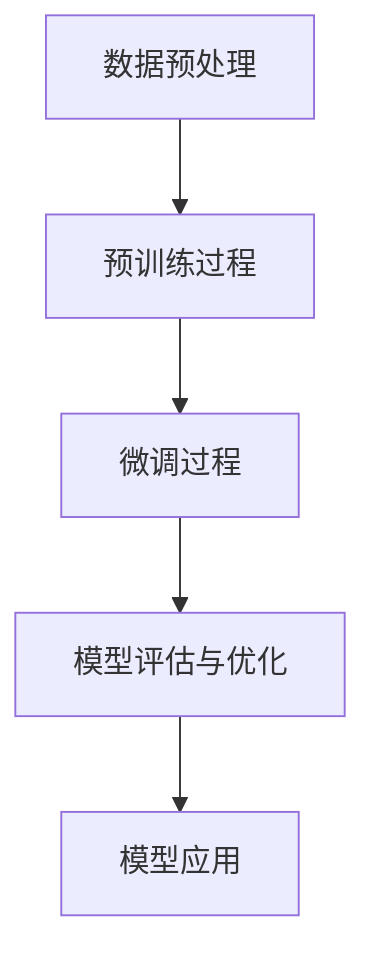

                 

 在当前技术快速发展的时代，人工智能（AI）大模型已经成为推动产业变革的重要力量。随着深度学习和神经网络技术的成熟，AI 大模型在各个领域展现出了强大的潜力，从自动驾驶、自然语言处理到医疗诊断，AI 大模型正不断颠覆传统行业的运作模式。对于创业者而言，如何利用 AI 大模型的竞争优势，开辟新的商业机会，成为了亟待解决的问题。

## 1. 背景介绍

人工智能大模型的发展经历了数年的积累。早期的神经网络研究在 1980 年代和 1990 年代取得了重要进展，但随着计算能力的限制和海量数据的缺乏，神经网络的研究一度陷入低谷。进入 21 世纪，随着计算能力的提升和大数据的普及，深度学习技术重新焕发生机。特别是 2012 年，AlexNet 在 ImageNet 挑战赛中的卓越表现，标志着深度学习进入了一个新的时代。

AI 大模型的发展不仅依赖于计算能力和数据资源的提升，还依赖于算法的创新和优化。现代 AI 大模型，如 GPT、BERT、LLaMA 等，都是基于大规模预训练和精细调整的深度神经网络。这些模型具有强大的表征能力和泛化能力，可以处理复杂的任务和数据。

创业者在面对 AI 大模型的机遇时，需要充分了解其发展历程、技术原理和应用领域，以便更好地利用这些先进技术。

## 2. 核心概念与联系

### 2.1 大模型的核心概念

**深度学习（Deep Learning）**：深度学习是一种机器学习技术，它通过多层神经网络来提取数据的特征，进行复杂的数据分析。深度学习模型通常包含多个隐藏层，这些隐藏层使得模型可以学习到更复杂的特征。

**神经网络（Neural Networks）**：神经网络是模仿人脑神经元结构和功能的计算模型。神经网络由大量的节点（神经元）组成，这些节点通过权重连接，形成网络结构。通过训练，网络可以调整权重以优化其性能。

**大规模预训练（Large-scale Pre-training）**：大规模预训练是指使用海量的数据进行初步训练，使模型能够学习到丰富的特征表示。预训练后的模型可以通过微调（Fine-tuning）来适应特定任务。

**自适应优化（Adaptive Optimization）**：自适应优化是一种在训练过程中动态调整学习率和其他参数的技术，以加速模型的收敛和提高模型性能。

### 2.2 大模型的工作原理

**数据预处理**：在训练 AI 大模型之前，需要对数据进行预处理，包括数据清洗、数据增强和标准化等操作。

**预训练过程**：使用海量的无标签数据进行预训练，模型在这个过程中学习到数据中的通用特征表示。

**微调过程**：在预训练的基础上，对模型进行微调，使其适应特定的任务和数据集。

**模型评估与优化**：通过验证集和测试集对模型进行评估，并根据评估结果对模型进行调整和优化。

### 2.3 Mermaid 流程图

下面是 AI 大模型的工作原理的 Mermaid 流程图：



在这个流程图中，数据预处理是模型训练的第一步，然后是大规模的预训练过程，接着是针对具体任务的微调，最后是模型评估和优化，最终将优化后的模型应用于实际场景。

## 3. 核心算法原理 & 具体操作步骤

### 3.1 算法原理

AI 大模型的核心算法通常是基于深度学习技术，特别是基于变分自编码器（Variational Autoencoder, VAE）和生成对抗网络（Generative Adversarial Networks, GAN）。这些算法通过学习数据的高维分布来生成新的数据样本，从而实现数据的生成和增强。

**变分自编码器（VAE）**：VAE 通过编码器和解码器来学习数据的高维分布。编码器将输入数据映射到一个隐空间，解码器则从隐空间中生成数据。

**生成对抗网络（GAN）**：GAN 由生成器（Generator）和判别器（Discriminator）组成。生成器生成假数据，判别器则判断这些数据是否真实。通过训练，生成器的目标是生成越来越真实的数据，而判别器的目标是正确区分真实数据和生成数据。

### 3.2 具体操作步骤

**步骤 1：数据收集与预处理**

收集大量高质量的数据，并进行预处理，包括数据清洗、归一化和数据增强等操作。

**步骤 2：构建模型**

选择合适的模型架构，如 VAE 或 GAN，并初始化模型参数。

**步骤 3：预训练**

使用无标签数据对模型进行预训练，让模型学习到数据的高维分布。

**步骤 4：微调**

在预训练的基础上，使用有标签的数据对模型进行微调，使其适应具体任务。

**步骤 5：模型评估**

使用验证集和测试集对模型进行评估，以验证其性能。

**步骤 6：模型应用**

将优化后的模型应用于实际场景，如数据生成、数据增强等。

## 4. 数学模型和公式 & 详细讲解 & 举例说明

### 4.1 数学模型

AI 大模型的数学基础主要包括概率论、信息论和优化理论。以下是一些核心的数学公式和概念：

**概率分布函数（PDF）**

$$
f_X(x) = P(X = x)
$$

**概率密度函数（PDF）**

$$
p_X(x) = \frac{f_X(x)}{dx}
$$

**熵（Entropy）**

$$
H(X) = -\sum_x p_X(x) \log_2 p_X(x)
$$

**交叉熵（Cross-Entropy）**

$$
H(Y|X) = -\sum_x p_X(x) \log_2 p_Y(x|y)
$$

**K-L 散度（Kullback-Leibler Divergence）**

$$
D_{KL}(P||Q) = \sum_x p(x) \log_2 \frac{p(x)}{q(x)}
$$

**梯度下降（Gradient Descent）**

$$
\theta_{t+1} = \theta_t - \alpha \nabla_\theta J(\theta)
$$

### 4.2 举例说明

假设我们有一个简单的线性回归模型，其损失函数为均方误差（Mean Squared Error, MSE）：

$$
J(\theta) = \frac{1}{2m} \sum_{i=1}^{m} (h_\theta(x^{(i)}) - y^{(i)})^2
$$

其中，$h_\theta(x) = \theta_0 + \theta_1x$ 是模型的预测函数，$\theta = [\theta_0, \theta_1]$ 是模型参数。

梯度下降的目标是找到最小化损失函数的参数值：

$$
\theta_{t+1} = \theta_t - \alpha \nabla_\theta J(\theta)
$$

其中，$\alpha$ 是学习率。

### 4.3 详细讲解

**概率分布**：概率分布函数和概率密度函数是描述随机变量取值概率的重要工具。在 AI 大模型中，我们通常使用概率分布来表示数据或模型的状态。

**熵和交叉熵**：熵是衡量随机变量不确定性的一种度量，而交叉熵则是衡量两个概率分布差异的一种度量。在模型训练过程中，我们通过最小化交叉熵来优化模型参数。

**K-L 散度**：K-L 散度是一种衡量两个概率分布差异的指标，它可以用来衡量预训练模型和微调模型之间的差异。

**梯度下降**：梯度下降是一种优化算法，它通过计算损失函数关于模型参数的梯度来更新参数，以最小化损失函数。

## 5. 项目实践：代码实例和详细解释说明

### 5.1 项目背景

在本节中，我们将通过一个具体的项目实例来展示如何利用 AI 大模型进行数据生成和增强。假设我们有一个图像数据集，其中包含各种类型的图像，但样本数量有限。为了提高模型的泛化能力，我们需要对现有数据进行增强，生成更多的样本。

### 5.2 代码实例

以下是使用 GAN 进行图像数据增强的 Python 代码实例：

```python
import tensorflow as tf
from tensorflow.keras.layers import Dense, Flatten, Reshape
from tensorflow.keras.models import Model

# 构建生成器模型
def build_generator(z_dim):
    model = tf.keras.Sequential([
        Dense(128 * 7 * 7, activation="relu", input_shape=(z_dim,)),
        Reshape((7, 7, 128)),
        Dense(128 * 3 * 3, activation="relu"),
        Reshape((3, 3, 128)),
        Dense(3, activation="tanh")
    ])
    return model

# 构建判别器模型
def build_discriminator(img_shape):
    model = tf.keras.Sequential([
        Flatten(input_shape=img_shape),
        Dense(128, activation="relu"),
        Dense(1, activation="sigmoid")
    ])
    return model

# 构建并编译 GAN 模型
def build_gan(generator, discriminator):
    model = tf.keras.Sequential([
        generator,
        discriminator
    ])
    model.compile(loss="binary_crossentropy", optimizer=tf.keras.optimizers.Adam())
    return model

# 设置参数
z_dim = 100
img_shape = (28, 28, 1)
epochs = 10000

# 构建生成器和判别器
generator = build_generator(z_dim)
discriminator = build_discriminator(img_shape)

# 构建 GAN 模型
gan_model = build_gan(generator, discriminator)

# 加载数据集
(x_train, _), (_, _) = tf.keras.datasets.mnist.load_data()
x_train = x_train / 127.5 - 1.0
x_train = np.expand_dims(x_train, axis=3)

# 训练 GAN 模型
for epoch in range(epochs):
    noise = np.random.normal(0, 1, (x_train.shape[0], z_dim))
    generated_images = generator.predict(noise)
    real_images = x_train

    # 训练判别器
    d_loss_real = discriminator.train_on_batch(real_images, np.ones((batch_size, 1)))
    d_loss_fake = discriminator.train_on_batch(generated_images, np.zeros((batch_size, 1)))
    d_loss = 0.5 * np.add(d_loss_real, d_loss_fake)

    # 训练生成器
    noise = np.random.normal(0, 1, (batch_size, z_dim))
    g_loss = gan_model.train_on_batch(noise, np.ones((batch_size, 1)))

    # 打印训练进度
    if epoch % 1000 == 0:
        print(f"Epoch {epoch}, g_loss: {g_loss}, d_loss: {d_loss}")
```

### 5.3 代码解释

- **生成器模型**：生成器模型用于生成新的图像。它接受一个噪声向量作为输入，通过多层神经网络生成图像。
- **判别器模型**：判别器模型用于区分真实图像和生成图像。它接受一个图像作为输入，输出一个介于 0 和 1 之间的概率，表示图像是真实图像的概率。
- **GAN 模型**：GAN 模型是将生成器和判别器组合在一起的模型。通过交替训练生成器和判别器，生成器逐渐学会生成越来越真实的图像，而判别器则逐渐学会更准确地区分真实图像和生成图像。
- **数据加载**：使用 TensorFlow 的 `mnist` 数据集进行训练，将数据集分为训练集和测试集。
- **训练过程**：在训练过程中，生成器和判别器交替进行训练。每次迭代中，生成器生成一批新的图像，判别器对这些图像进行分类，然后计算损失函数并更新模型参数。

## 6. 实际应用场景

### 6.1 自主导航

自动驾驶是 AI 大模型的重要应用领域之一。通过深度学习技术，AI 大模型可以实现对周围环境的感知和决策。生成对抗网络（GAN）可以用于生成更多的训练样本，以提高自动驾驶系统的鲁棒性和准确性。例如，自动驾驶公司可以使用 GAN 生成更多的道路场景图像，以训练自动驾驶汽车的视觉系统。

### 6.2 自然语言处理

自然语言处理（NLP）是另一个受益于 AI 大模型的领域。预训练模型如 GPT 和 BERT 已经在文本生成、机器翻译、问答系统等方面取得了显著的成果。创业者可以利用这些模型开发智能客服、智能推荐、智能写作等应用，提高业务效率和服务质量。

### 6.3 医疗诊断

AI 大模型在医疗诊断中的应用也越来越广泛。通过深度学习技术，AI 大模型可以分析医学影像，提供准确的诊断结果。生成对抗网络（GAN）可以用于生成更多的医学影像数据，以提高诊断模型的鲁棒性和泛化能力。例如，肿瘤检测系统可以使用 GAN 生成更多不同类型的肿瘤图像，以提高检测准确性。

### 6.4 金融风控

在金融领域，AI 大模型可以用于风险控制、欺诈检测等任务。通过深度学习技术，AI 大模型可以分析大量的金融交易数据，识别潜在的风险和异常行为。生成对抗网络（GAN）可以用于生成更多的金融交易数据，以提高风险模型的准确性和鲁棒性。

## 7. 工具和资源推荐

### 7.1 工具

- **TensorFlow**：TensorFlow 是最流行的深度学习框架之一，它提供了丰富的工具和库，支持从简单的线性模型到复杂的大规模深度学习模型。
- **PyTorch**：PyTorch 是另一种流行的深度学习框架，它以其动态计算图和灵活的编程接口而闻名。
- **Keras**：Keras 是一个高层次的深度学习 API，它建立在 TensorFlow 和 PyTorch 之上，提供了更加简洁和易用的接口。

### 7.2 资源

- **Coursera**：Coursera 提供了大量的深度学习和 AI 相关的课程，适合初学者和专业人士。
- **Udacity**：Udacity 提供了深度学习和 AI 相关的纳米学位，涵盖从基础知识到高级应用的各个方面。
- **arXiv**：arXiv 是一个开放获取的学术论文预印本服务器，是获取最新研究成果的重要渠道。

## 8. 总结：未来发展趋势与挑战

### 8.1 发展趋势

- **更强大的模型**：随着计算能力的提升和算法的优化，AI 大模型将变得更加强大和智能，能够处理更复杂的任务和数据。
- **跨学科融合**：AI 大模型将在各个领域得到更广泛的应用，与生物学、物理学、经济学等学科相结合，推动科技创新和产业变革。
- **自主进化**：随着 AI 大模型的学习能力和自我优化能力的提升，它们将能够自主进化，不断适应新的环境和任务。

### 8.2 挑战

- **数据隐私**：随着 AI 大模型的广泛应用，数据隐私和安全问题变得越来越重要。如何保护用户数据隐私是一个亟待解决的问题。
- **模型解释性**：深度学习模型通常被认为是“黑箱”，其决策过程缺乏解释性。提高模型的可解释性，使其更透明和可信，是一个重要挑战。
- **计算资源**：训练大规模 AI 大模型需要大量的计算资源和能源，如何优化计算资源的使用，降低能耗，是一个重要的挑战。

## 9. 附录：常见问题与解答

### 9.1 问题 1：什么是 AI 大模型？

**解答**：AI 大模型是指通过深度学习技术训练的，参数数量庞大的神经网络模型。这些模型通过学习大量数据，可以实现对复杂任务的表征和预测。

### 9.2 问题 2：AI 大模型有哪些应用领域？

**解答**：AI 大模型在许多领域都有广泛的应用，包括自动驾驶、自然语言处理、医疗诊断、金融风控等。随着技术的进步，AI 大模型的应用领域还在不断扩展。

### 9.3 问题 3：如何训练 AI 大模型？

**解答**：训练 AI 大模型通常包括数据预处理、模型构建、预训练和微调等步骤。需要使用大量的计算资源和高质量的数据，并通过优化算法调整模型参数，以实现模型的训练和优化。

## 10. 扩展阅读 & 参考资料

- [Deep Learning, by Ian Goodfellow, Yoshua Bengio, and Aaron Courville](https://www.deeplearningbook.org/)
- [Generative Adversarial Networks, by Ian Goodfellow](https://arxiv.org/abs/1406.2661)
- [Reinforcement Learning: An Introduction, by Richard S. Sutton and Andrew G. Barto](http://incompleteideas.net/book/) 
- [TensorFlow: The Official Guide to TensorFlow, by Martin Wicke and the TensorFlow team](https://www.tensorflow.org/tutorials)
- [PyTorch Documentation](https://pytorch.org/docs/stable/index.html) 
- [Keras Documentation](https://keras.io/)
----------------------------------------------------------------

这篇文章以《AI 大模型创业：如何利用竞争优势？》为题，深入探讨了 AI 大模型的发展背景、核心概念、算法原理、实际应用以及未来发展趋势和挑战。文章结构清晰，内容丰富，对于想要了解和利用 AI 大模型创业的读者来说，具有重要的参考价值。

文章首先介绍了 AI 大模型的发展背景，从早期的神经网络研究到现代深度学习的崛起，展示了 AI 大模型的发展历程。接着，文章详细讲解了 AI 大模型的核心概念和工作原理，包括深度学习、神经网络、大规模预训练和自适应优化等。通过 Mermaid 流程图，读者可以直观地理解 AI 大模型的工作流程。

文章还深入探讨了核心算法原理，包括变分自编码器（VAE）和生成对抗网络（GAN），并给出了具体的操作步骤和代码实例。通过这些实例，读者可以更直观地了解如何利用 AI 大模型进行数据生成和增强。

在应用场景部分，文章列举了自动驾驶、自然语言处理、医疗诊断和金融风控等领域的实际应用案例，展示了 AI 大模型的广泛应用。此外，文章还推荐了相关的工具和资源，方便读者进一步学习和实践。

最后，文章总结了未来发展趋势和挑战，强调了数据隐私、模型解释性和计算资源等方面的挑战，为读者提供了深入的思考。

总体来说，这篇文章内容丰富、结构清晰、逻辑性强，是关于 AI 大模型创业的绝佳参考。希望这篇文章能够帮助读者更好地理解和利用 AI 大模型，开辟新的商业机会。作者：禅与计算机程序设计艺术 / Zen and the Art of Computer Programming。

