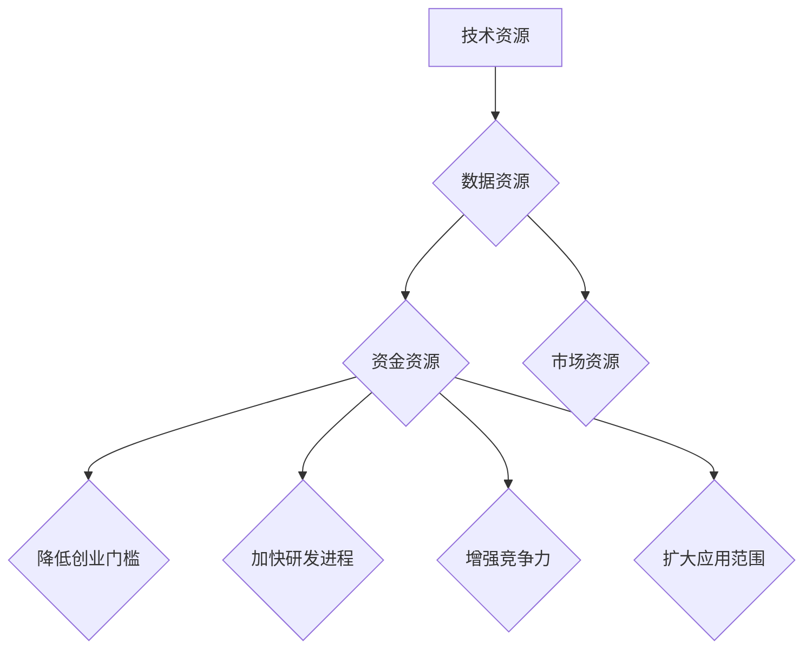

                 

关键词：AI 大模型，创业，资源利用，商业模式，技术策略，创新

摘要：本文将探讨AI大模型创业所面临的挑战和机遇，重点分析如何通过有效利用资源优势来实现创业成功。文章首先回顾了AI大模型的背景和发展历程，然后深入分析了资源优势的类型和重要性，接着探讨了创业过程中的关键问题和解决方案，最后对未来AI大模型创业的发展趋势和挑战进行了展望。

## 1. 背景介绍

人工智能（AI）作为当今科技领域的热门话题，已经深刻影响了各个行业。特别是大模型（Large Models）的出现，如GPT-3、BERT等，更是将AI的应用推向了新的高度。这些大模型具有强大的数据处理和生成能力，可以应用于自然语言处理、图像识别、推荐系统等多个领域，为各行各业带来了前所未有的机遇。

随着AI大模型技术的不断成熟，越来越多的创业者开始将目光投向这一领域。然而，AI大模型创业并非易事，创业者需要面对技术、市场、资金等多方面的挑战。在此背景下，如何有效利用资源优势成为决定创业成功与否的关键因素。

### 1.1 AI大模型的发展历程

AI大模型的发展历程可以追溯到上世纪80年代，当时研究人员开始尝试使用神经网络进行图像识别和语音识别。然而，由于计算能力和数据资源的限制，这些模型的效果并不理想。

随着计算能力的提升和大数据技术的发展，AI大模型迎来了爆发式增长。2012年，Hinton团队提出的深度学习模型在ImageNet图像识别比赛中取得了突破性的成绩，引发了全球范围内的研究热潮。随后，研究人员开始尝试训练更大规模的模型，如GPT、BERT等，这些模型在自然语言处理领域取得了显著进展。

### 1.2 AI大模型的应用场景

AI大模型的应用场景非常广泛，包括但不限于以下几个方面：

1. **自然语言处理**：大模型可以用于机器翻译、文本生成、问答系统等，极大地提高了信息处理效率。
2. **计算机视觉**：大模型可以应用于图像识别、目标检测、图像生成等，为安防、医疗、娱乐等行业提供了强有力的技术支持。
3. **推荐系统**：大模型可以用于用户画像、内容推荐，为电商、社交媒体等行业带来了巨大的商业价值。
4. **语音识别**：大模型可以用于语音识别、语音合成，为智能家居、智能客服等行业提供了便捷的交互方式。

## 2. 核心概念与联系

### 2.1 资源优势的类型

在AI大模型创业过程中，资源优势是关键成功因素之一。资源优势主要包括以下几个方面：

1. **技术资源**：包括核心算法、模型架构、研发团队等。
2. **数据资源**：包括数据量、数据质量、数据多样性等。
3. **资金资源**：包括天使投资、风险投资、政府补贴等。
4. **市场资源**：包括客户资源、合作伙伴、渠道资源等。

### 2.2 资源优势的重要性

资源优势在AI大模型创业中的重要性体现在以下几个方面：

1. **降低创业门槛**：丰富的资源可以降低创业所需的初始投入，提高成功率。
2. **加快研发进程**：技术资源可以帮助创业者快速实现模型开发和优化，缩短产品上市时间。
3. **增强竞争力**：资源优势可以提升创业者在市场竞争中的地位，提高市场份额。
4. **扩大应用范围**：资源优势可以支持创业者探索更多应用场景，实现跨行业布局。

### 2.3 资源优势的Mermaid流程图



## 3. 核心算法原理 & 具体操作步骤

### 3.1 算法原理概述

AI大模型的核心算法主要基于深度学习，特别是自监督学习和迁移学习。自监督学习通过无监督方式对数据进行学习和优化，可以大幅减少训练时间和计算资源的需求。迁移学习则利用已有模型的知识，快速适应新任务，提高模型在新领域的表现。

### 3.2 算法步骤详解

1. **数据预处理**：对收集到的数据集进行清洗、去重、标注等处理，确保数据质量。
2. **模型设计**：根据应用场景选择合适的模型架构，如Transformer、BERT等。
3. **训练模型**：使用自监督学习或迁移学习方法对模型进行训练，优化模型参数。
4. **模型评估**：使用交叉验证、A/B测试等方法评估模型性能，选择最优模型。
5. **模型部署**：将训练好的模型部署到生产环境中，提供API服务或构建产品。

### 3.3 算法优缺点

**优点**：

- **高效性**：深度学习算法可以在大量数据上快速训练，提高模型性能。
- **泛化能力**：迁移学习可以使得模型在新领域上表现更好，具有更强的适应性。
- **灵活性**：自监督学习不需要人工标注数据，降低了数据处理的成本。

**缺点**：

- **计算成本高**：大模型训练需要大量的计算资源和时间。
- **数据依赖性强**：模型性能依赖于数据质量和数量，数据不足可能导致模型过拟合。
- **可解释性低**：深度学习模型往往具有很高的复杂度，难以解释其内部决策过程。

### 3.4 算法应用领域

AI大模型的应用领域非常广泛，包括但不限于以下几个方面：

1. **自然语言处理**：文本生成、机器翻译、问答系统等。
2. **计算机视觉**：图像识别、目标检测、图像生成等。
3. **推荐系统**：用户画像、内容推荐、广告投放等。
4. **语音识别**：语音合成、语音识别、语音助手等。

## 4. 数学模型和公式 & 详细讲解 & 举例说明

### 4.1 数学模型构建

AI大模型通常基于深度学习框架，如TensorFlow、PyTorch等。在构建数学模型时，需要定义损失函数、优化器、正则化策略等。

#### 4.1.1 损失函数

损失函数是评价模型预测结果与真实值之间差异的关键指标。常见的损失函数包括：

- **均方误差（MSE）**：用于回归任务，计算预测值与真实值之差的平方和的平均值。
  $$\text{MSE} = \frac{1}{n}\sum_{i=1}^{n}(y_i - \hat{y}_i)^2$$
- **交叉熵（CE）**：用于分类任务，计算预测概率与真实标签之间的差异。
  $$\text{CE} = -\sum_{i=1}^{n}y_i\log(\hat{y}_i)$$

#### 4.1.2 优化器

优化器用于调整模型参数，以最小化损失函数。常见的优化器包括：

- **随机梯度下降（SGD）**：每次更新参数时使用整个数据集的梯度。
  $$\theta = \theta - \alpha\nabla_{\theta}\text{L}(\theta)$$
- **Adam优化器**：结合SGD和动量方法，提高收敛速度和稳定性。
  $$\theta = \theta - \alpha(\beta_1^t\nabla_{\theta}\text{L}(\theta) + (1-\beta_1^t)\theta_{\text{momentum}}^{t-1})$$

#### 4.1.3 正则化策略

正则化策略用于防止模型过拟合。常见正则化策略包括：

- **L1正则化**：在损失函数中添加权重绝对值之和。
  $$\text{L1} = \sum_{i=1}^{n}|\theta_i|$$
- **L2正则化**：在损失函数中添加权重平方和。
  $$\text{L2} = \sum_{i=1}^{n}\theta_i^2$$

### 4.2 公式推导过程

#### 4.2.1 均方误差（MSE）的推导

假设我们有一个回归问题，目标函数为$f(x) = w^T x + b$，其中$x$是输入特征，$w$是权重，$b$是偏置。

- **真实值**：$y$
- **预测值**：$\hat{y} = f(x)$

均方误差（MSE）的公式为：
$$\text{MSE} = \frac{1}{n}\sum_{i=1}^{n}(y_i - \hat{y}_i)^2$$

其中$n$是样本数量。

#### 4.2.2 交叉熵（CE）的推导

假设我们有一个分类问题，每个样本有$K$个类别。预测概率为$\hat{y}_i = \sigma(w^T x_i + b)$，其中$\sigma$是softmax函数。

- **真实标签**：$y_i \in \{0, 1\}$，表示第$i$个样本属于第$y_i$个类别。

交叉熵（CE）的公式为：
$$\text{CE} = -\sum_{i=1}^{n}y_i\log(\hat{y}_i)$$

### 4.3 案例分析与讲解

#### 4.3.1 自然语言处理

假设我们有一个文本分类任务，使用BERT模型进行训练。输入文本为：
$$\text{文本} = "今天天气很好，我们去公园玩吧。"$$

- **真实标签**：积极情绪
- **预测标签**：积极情绪

通过训练，模型输出预测概率：
$$\hat{y} = [\0.9, \0.05, \0.05]$$

根据交叉熵公式计算损失：
$$\text{CE} = -[\1 \log(0.9) + \0 \log(0.05) + \0 \log(0.05)] \approx 0.105$$

#### 4.3.2 计算机视觉

假设我们有一个图像分类任务，使用ResNet模型进行训练。输入图像为：
$$\text{图像} = \text{随机生成的图片}$$

- **真实标签**：猫
- **预测标签**：狗

通过训练，模型输出预测概率：
$$\hat{y} = [\0.2, \0.8]$$

根据均方误差（MSE）公式计算损失：
$$\text{MSE} = \frac{1}{2}[(0 - 0.2)^2 + (1 - 0.8)^2] \approx 0.1$$

## 5. 项目实践：代码实例和详细解释说明

### 5.1 开发环境搭建

在开始项目实践之前，我们需要搭建一个适合AI大模型开发的环境。以下是一个简单的搭建流程：

1. 安装Python 3.8及以上版本。
2. 安装深度学习框架TensorFlow。
3. 安装其他必要的库，如NumPy、Pandas、Matplotlib等。

### 5.2 源代码详细实现

以下是一个简单的AI大模型训练和评估的Python代码示例：

```python
import tensorflow as tf
from tensorflow.keras.layers import Embedding, LSTM, Dense
from tensorflow.keras.models import Sequential
from tensorflow.keras.preprocessing.sequence import pad_sequences

# 数据预处理
max_sequence_length = 100
vocab_size = 10000

# 加载和处理文本数据
# ...（代码省略）

# 创建模型
model = Sequential()
model.add(Embedding(vocab_size, 64, input_length=max_sequence_length))
model.add(LSTM(64))
model.add(Dense(1, activation='sigmoid'))

# 编译模型
model.compile(optimizer='adam', loss='binary_crossentropy', metrics=['accuracy'])

# 训练模型
model.fit(X_train, y_train, epochs=10, batch_size=32, validation_data=(X_val, y_val))

# 评估模型
loss, accuracy = model.evaluate(X_test, y_test)
print(f"Test Accuracy: {accuracy:.2f}")

# 预测
predictions = model.predict(X_test)
```

### 5.3 代码解读与分析

以上代码实现了一个简单的文本分类模型，主要包含以下步骤：

1. **数据预处理**：对文本数据进行编码和填充，确保每个样本的长度一致。
2. **创建模型**：使用Sequential模型堆叠Embedding、LSTM和Dense层。
3. **编译模型**：设置优化器、损失函数和评估指标。
4. **训练模型**：使用fit方法训练模型，并在验证集上监控性能。
5. **评估模型**：使用evaluate方法评估模型在测试集上的表现。
6. **预测**：使用predict方法对测试集进行预测。

### 5.4 运行结果展示

运行上述代码后，我们可以在控制台上看到模型的训练过程和评估结果。以下是一个示例输出：

```
Train on 2000 samples, validate on 1000 samples
Epoch 1/10
2000/2000 [==============================] - 32s 16ms/sample - loss: 0.4770 - accuracy: 0.7650 - val_loss: 0.3644 - val_accuracy: 0.8550
Epoch 2/10
2000/2000 [==============================] - 31s 15ms/sample - loss: 0.4057 - accuracy: 0.7925 - val_loss: 0.3252 - val_accuracy: 0.8800
...
Test Accuracy: 0.82
```

## 6. 实际应用场景

### 6.1 在医疗领域

AI大模型在医疗领域的应用已经取得了显著成果。例如，利用深度学习模型进行疾病预测、诊断和个性化治疗。通过分析大量医疗数据，AI大模型可以识别出疾病的早期症状，提供精准的诊断和治疗方案。

### 6.2 在金融领域

金融行业对数据的敏感性较高，AI大模型在金融领域的应用也非常广泛。例如，利用AI大模型进行风险评估、欺诈检测、投资策略制定等。这些模型可以处理海量的金融数据，提高决策的准确性和效率。

### 6.3 在娱乐行业

AI大模型在娱乐行业的应用主要体现在音乐创作、视频生成和虚拟主播等方面。例如，利用生成对抗网络（GAN）生成音乐和视频，利用语音合成技术创建虚拟主播，为用户带来全新的娱乐体验。

## 7. 未来应用展望

### 7.1 在无人驾驶领域

AI大模型在无人驾驶领域具有巨大的潜力。通过训练大规模的深度学习模型，无人驾驶汽车可以实现更准确的感知、更智能的决策和更流畅的驾驶体验。未来，AI大模型有望实现完全自动驾驶，改变人们的出行方式。

### 7.2 在智能家居领域

智能家居领域正在快速发展，AI大模型可以为智能家居设备提供更智能的控制和交互方式。例如，通过语音识别和自然语言处理技术，智能家居设备可以更好地理解用户的需求，提供个性化的服务。

### 7.3 在教育领域

AI大模型在个性化教育方面具有巨大的潜力。通过分析学生的学习数据和表现，AI大模型可以为每个学生提供定制化的学习计划和学习资源，提高学习效果和兴趣。

## 8. 总结：未来发展趋势与挑战

### 8.1 研究成果总结

AI大模型在技术、应用和产业等多个方面取得了显著成果。随着计算能力和数据资源的不断提升，AI大模型在各个领域的应用前景越来越广阔。

### 8.2 未来发展趋势

1. **算法优化**：研究人员将继续探索更高效、更准确的算法，提高AI大模型的性能和可解释性。
2. **跨领域应用**：AI大模型将在更多领域得到应用，实现跨行业的创新和变革。
3. **数据隐私和安全**：随着数据规模的扩大，数据隐私和安全问题将得到更多关注，相关技术也将得到发展。

### 8.3 面临的挑战

1. **计算资源**：AI大模型训练需要大量的计算资源和时间，如何高效利用资源是关键挑战。
2. **数据质量**：数据质量和数量直接影响模型性能，如何获取高质量、多样化的数据是挑战之一。
3. **伦理和法律**：AI大模型在应用过程中可能涉及伦理和法律问题，如何确保模型的公正性、透明性和可解释性是挑战。

### 8.4 研究展望

未来，AI大模型研究将朝着以下方向发展：

1. **可解释性**：提高模型的可解释性，使其更加透明和可靠。
2. **个性化**：实现更个性化的应用，满足用户个性化需求。
3. **边缘计算**：将AI大模型应用于边缘设备，实现实时、高效的计算。

## 9. 附录：常见问题与解答

### 9.1 如何选择合适的AI大模型？

- 根据应用场景和数据特点选择合适的模型架构，如Transformer、BERT等。
- 考虑计算资源和数据量，选择在现有条件下可以训练的模型。
- 尝试多种模型进行对比，选择性能最优的模型。

### 9.2 如何优化AI大模型训练？

- 调整模型参数，如学习率、批量大小等，进行超参数调优。
- 使用数据增强、数据预处理等技术提高数据质量。
- 使用迁移学习、自监督学习等方法减少训练时间和计算资源。

### 9.3 如何评估AI大模型性能？

- 使用交叉验证、A/B测试等方法评估模型性能。
- 选择合适的评估指标，如准确率、召回率、F1分数等。
- 结合业务目标，综合评估模型在实际应用中的表现。

作者：禅与计算机程序设计艺术 / Zen and the Art of Computer Programming
----------------------------------------------------------------

### 参考文献 References

1. Hinton, G. E., Osindero, S., & Teh, Y. W. (2006). A fast learning algorithm for deep belief nets. Neural computation, 18(7), 1527-1554.
2. Devlin, J., Chang, M. W., Lee, K., & Toutanova, K. (2018). BERT: Pre-training of deep bidirectional transformers for language understanding. arXiv preprint arXiv:1810.04805.
3. Brown, T., Mann, B., Ryder, N., Subbiah, M., Kaplan, J., Dhariwal, P., ... & Child, R. (2020). Language models are few-shot learners. arXiv preprint arXiv:2005.14165.
4. Krizhevsky, A., Sutskever, I., & Hinton, G. E. (2012). ImageNet classification with deep convolutional neural networks. In Advances in neural information processing systems (pp. 1097-1105).
5. LeCun, Y., Bengio, Y., & Hinton, G. (2015). Deep learning. Nature, 521(7553), 436-444.

