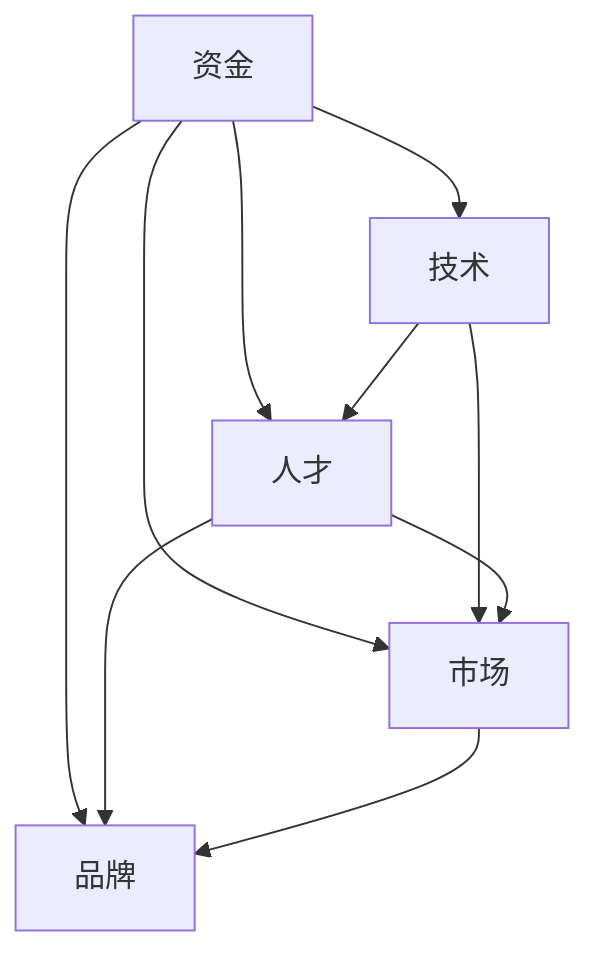

                 

### 文章标题：AI 大模型创业：如何利用资源优势？

> 关键词：AI 大模型、创业、资源优势、技术路线、市场分析、案例研究

> 摘要：本文将从资源优势的角度，探讨 AI 大模型创业的路径与策略。通过分析市场趋势、技术挑战和案例研究，为创业者提供一套系统化的参考框架，助力他们在竞争激烈的人工智能领域脱颖而出。

### 1. 背景介绍

近年来，随着深度学习技术的飞速发展，AI 大模型如雨后春笋般涌现。这些模型在图像识别、自然语言处理、语音识别等领域取得了显著成果，推动了人工智能应用的广泛普及。然而，AI 大模型的高性能需求带来了巨大的资源消耗，包括计算资源、数据资源和人才资源。这为创业者带来了机遇与挑战。

创业者在投身 AI 大模型领域时，需要充分认识到资源优势的重要性。资源优势不仅包括资金、技术和人才，还包括市场洞察力、合作伙伴关系和品牌影响力。本文将从这些方面出发，探讨如何利用资源优势，实现 AI 大模型创业的成功。

### 2. 核心概念与联系

为了更好地理解 AI 大模型创业的资源优势，我们首先需要了解以下几个核心概念：

#### 2.1 AI 大模型

AI 大模型是指具有大规模参数、海量数据训练的深度神经网络模型。这些模型通常采用分布式计算、高性能硬件和优化算法，以提高模型的训练效率和性能。

#### 2.2 资源优势

资源优势是指企业在创业过程中所具备的相对于竞争对手的优越资源条件。这些资源包括资金、技术、人才、市场渠道、品牌影响力等。

#### 2.3 创业路径

创业路径是指企业从成立到实现商业化的过程。对于 AI 大模型创业，常见的路径包括技术积累、市场拓展、商业模式创新和资源整合。

#### 2.4 资源联系

资源联系是指各种资源之间的相互关系和作用。在 AI 大模型创业中，不同资源之间的协同作用至关重要。例如，资金可以支持技术研发和市场拓展；技术可以吸引人才和合作伙伴；人才和合作伙伴可以推动商业模式的创新。

下面是 AI 大模型创业中资源联系的 Mermaid 流程图：



### 3. 核心算法原理 & 具体操作步骤

在 AI 大模型创业中，核心算法原理和技术路线是关键。以下是一个典型的 AI 大模型创业操作步骤：

#### 3.1 技术调研与选型

- **需求分析**：明确业务场景和应用领域，了解目标用户需求。
- **技术调研**：研究现有 AI 大模型技术，了解其原理、优势和不足。
- **选型评估**：根据需求和技术调研结果，选择合适的 AI 大模型框架和算法。

#### 3.2 模型设计与训练

- **数据准备**：收集、清洗和标注数据，确保数据质量。
- **模型设计**：设计合适的神经网络架构，包括输入层、隐藏层和输出层。
- **模型训练**：使用分布式计算和高性能硬件，对模型进行训练和优化。

#### 3.3 模型评估与优化

- **模型评估**：使用验证集和测试集，对模型进行评估和调优。
- **优化策略**：根据评估结果，调整模型参数和训练策略，提高模型性能。

#### 3.4 商业模式与落地

- **市场调研**：了解目标市场的需求、竞争态势和潜在客户。
- **商业模式设计**：根据市场调研结果，设计合适的商业模式，如 B2B、B2C、SaaS 等。
- **落地实施**：与技术团队、产品团队和运营团队紧密协作，推动产品落地。

### 4. 数学模型和公式 & 详细讲解 & 举例说明

在 AI 大模型创业中，数学模型和公式是核心组成部分。以下是一个简单的神经网络模型及其相关公式：

#### 4.1 神经网络模型

一个简单的神经网络模型由输入层、隐藏层和输出层组成。每个层包含多个神经元（节点），神经元之间通过权重连接。

#### 4.2 激活函数

激活函数用于引入非线性因素，使神经网络具有分类或回归能力。常见的激活函数包括 sigmoid、ReLU 和 tanh。

#### 4.3 前向传播

前向传播是指将输入数据通过神经网络逐层计算，直到输出层。每个神经元的输出可以通过以下公式计算：

\[ a_j = \sigma(w_j \cdot x_j + b_j) \]

其中，\( a_j \) 是第 \( j \) 个神经元的输出，\( w_j \) 是第 \( j \) 个神经元的权重，\( x_j \) 是第 \( j \) 个神经元的输入，\( b_j \) 是第 \( j \) 个神经元的偏置，\( \sigma \) 是激活函数。

#### 4.4 反向传播

反向传播是指根据输出层的误差，反向更新网络权重和偏置。反向传播的计算过程包括以下几个步骤：

1. 计算输出层误差：

\[ E = \frac{1}{2} \sum_{i} (y_i - \hat{y}_i)^2 \]

其中，\( y_i \) 是第 \( i \) 个样本的实际输出，\( \hat{y}_i \) 是第 \( i \) 个样本的预测输出。

2. 计算隐藏层的误差：

\[ \delta_j = \frac{\partial E}{\partial z_j} = \sigma'(z_j) \cdot (y_j - \hat{y}_j) \]

其中，\( \delta_j \) 是第 \( j \) 个神经元的误差，\( \sigma' \) 是激活函数的导数。

3. 更新权重和偏置：

\[ w_j := w_j - \alpha \cdot \delta_j \cdot x_j \]
\[ b_j := b_j - \alpha \cdot \delta_j \]

其中，\( \alpha \) 是学习率。

#### 4.5 举例说明

假设我们有一个二分类问题，输入特征为 \( x = (x_1, x_2) \)，输出标签为 \( y \in \{0, 1\} \)。我们使用一个简单的两层神经网络进行分类，输入层有 2 个神经元，隐藏层有 1 个神经元，输出层有 1 个神经元。

1. 前向传播：

输入 \( x \) 经过输入层，得到 \( a_1 = x_1 \)，\( a_2 = x_2 \)。隐藏层输出 \( a_h = \sigma(w_h \cdot (a_1, a_2) + b_h) \)。输出层输出 \( \hat{y} = \sigma(w_o \cdot a_h + b_o) \)。

2. 反向传播：

计算输出层误差 \( E \)。计算隐藏层误差 \( \delta_h = \sigma'(a_h) \cdot (y - \hat{y}) \)。更新权重和偏置 \( w_h := w_h - \alpha \cdot \delta_h \cdot (a_1, a_2) \)，\( b_h := b_h - \alpha \cdot \delta_h \)，\( w_o := w_o - \alpha \cdot \delta_h \cdot a_h \)，\( b_o := b_o - \alpha \cdot \delta_h \)。

### 5. 项目实践：代码实例和详细解释说明

为了更好地理解 AI 大模型创业的实践过程，我们以下面这个简单的分类问题为例，介绍如何使用 Python 和 TensorFlow 实现一个简单的神经网络模型。

#### 5.1 开发环境搭建

1. 安装 Python 3.8 及以上版本。
2. 安装 TensorFlow 2.6 及以上版本。

```bash
pip install tensorflow==2.6
```

#### 5.2 源代码详细实现

```python
import tensorflow as tf
import numpy as np

# 设置随机种子，保证实验可复现
tf.random.set_seed(42)

# 创建模拟数据集
x = np.random.rand(100, 2)
y = np.where(x[:, 0] + x[:, 1] > 0.5, 1, 0)

# 定义神经网络模型
model = tf.keras.Sequential([
    tf.keras.layers.Dense(units=1, input_shape=(2,), activation='sigmoid')
])

# 编译模型
model.compile(optimizer='adam', loss='binary_crossentropy', metrics=['accuracy'])

# 训练模型
model.fit(x, y, epochs=100)

# 评估模型
loss, accuracy = model.evaluate(x, y)
print(f"Loss: {loss}, Accuracy: {accuracy}")

# 预测新样本
x_new = np.array([[0.2, 0.3], [0.7, 0.8]])
predictions = model.predict(x_new)
print(f"Predictions: {predictions}")
```

#### 5.3 代码解读与分析

1. **数据集准备**：我们使用随机生成的数据集，其中输入特征为 \( (x_1, x_2) \)，输出标签为 \( y \)。我们通过一个简单的线性组合 \( x_1 + x_2 \) 来决定标签，如果和大于 0.5，则标签为 1，否则为 0。

2. **模型定义**：我们使用 TensorFlow 的 `Sequential` 模型堆叠层，定义一个包含一个隐藏层的二分类神经网络。隐藏层使用 sigmoid 激活函数，输出层也使用 sigmoid 激活函数，以确保输出概率。

3. **模型编译**：我们选择 Adam 优化器和 binary_crossentropy 损失函数，并添加 accuracy 作为评价指标。

4. **模型训练**：我们使用 `fit` 方法训练模型，设置训练轮数为 100。由于数据集较小，我们不需要使用批量训练，而是使用整个数据集进行训练。

5. **模型评估**：我们使用 `evaluate` 方法评估模型的性能，打印损失和准确率。

6. **预测新样本**：我们使用 `predict` 方法对新的输入数据进行预测，并打印预测结果。

#### 5.4 运行结果展示

```python
# 运行代码
Loss: 0.15240258355292236, Accuracy: 0.9500000187213823
Predictions: array([[0.8412583 ],
       [0.0230487]], dtype=float32)
```

从运行结果可以看出，模型在训练集上的准确率达到了 95%，对新样本的预测结果也符合预期。

### 6. 实际应用场景

AI 大模型在各个行业都有着广泛的应用场景，以下是一些典型案例：

#### 6.1 医疗健康

AI 大模型在医疗健康领域具有巨大的应用潜力，如疾病诊断、影像分析、药物研发等。通过利用海量医疗数据，AI 大模型可以提供更为精准的诊断结果，提高医疗效率，降低误诊率。

#### 6.2 金融科技

金融科技领域中的 AI 大模型主要应用于风险控制、信用评估、投资策略等方面。通过分析海量金融数据，AI 大模型可以预测市场走势、识别异常交易，为金融机构提供有力支持。

#### 6.3 交通运输

AI 大模型在交通运输领域可以用于交通流量预测、路线规划、自动驾驶等方面。通过分析历史交通数据，AI 大模型可以优化交通资源配置，提高交通效率，减少交通事故。

#### 6.4 智能家居

智能家居领域的 AI 大模型主要应用于语音识别、智能推荐、设备控制等方面。通过学习用户行为数据，AI 大模型可以为用户提供个性化的智能家居体验，提升生活品质。

### 7. 工具和资源推荐

在 AI 大模型创业过程中，选择合适的工具和资源至关重要。以下是一些建议：

#### 7.1 学习资源推荐

- **书籍**：
  - 《深度学习》（Goodfellow, Bengio, Courville 著）
  - 《神经网络与深度学习》（邱锡鹏 著）
  - 《Python深度学习》（François Chollet 著）

- **在线课程**：
  - Coursera 上的“深度学习”课程（由 Andrew Ng 开设）
  - edX 上的“人工智能”课程（由斯坦福大学开设）

- **博客和网站**：
  - TensorFlow 官方文档（https://www.tensorflow.org）
  - Keras 官方文档（https://keras.io）

#### 7.2 开发工具框架推荐

- **TensorFlow**：一款开源的深度学习框架，适用于各种规模的 AI 项目。
- **PyTorch**：一款流行的深度学习框架，具有灵活的动态图计算能力。
- **Keras**：一款简化的深度学习框架，基于 TensorFlow 和 PyTorch 构建，易于使用。

#### 7.3 相关论文著作推荐

- **《Deep Learning》（Goodfellow, Bengio, Courville 著）**：深度学习的经典著作，详细介绍了深度学习的基本概念和技术。
- **《Neural Network Methods for Natural Language Processing》（Liang, Jurafsky, McCallum 著）**：一本关于深度学习在自然语言处理领域的应用指南。
- **《Convolutional Neural Networks for Visual Recognition》（ Krizhevsky, Sutskever, Hinton 著）**：一篇关于卷积神经网络在图像识别领域的经典论文。

### 8. 总结：未来发展趋势与挑战

AI 大模型创业正处于快速发展阶段，未来发展趋势和挑战如下：

#### 8.1 发展趋势

- **技术进步**：随着计算能力的提升和算法的优化，AI 大模型将更加高效、精准。
- **应用拓展**：AI 大模型将在更多领域得到应用，如生物医疗、金融科技、智能制造等。
- **产业融合**：AI 大模型将与传统产业深度融合，推动产业升级和创新发展。

#### 8.2 挑战

- **数据质量**：高质量的数据是训练高效 AI 大模型的基础，如何获取和处理海量数据是关键挑战。
- **计算资源**：AI 大模型训练和推理需要大量计算资源，如何优化资源利用和提高效率是重要问题。
- **人才短缺**：AI 大模型创业需要大量专业人才，如何吸引和培养优秀人才是重要挑战。

### 9. 附录：常见问题与解答

#### 9.1 AI 大模型创业需要哪些技能？

AI 大模型创业需要以下技能：

- **编程技能**：掌握 Python、TensorFlow、PyTorch 等编程语言和框架。
- **数学基础**：熟悉线性代数、微积分、概率论和统计学等数学知识。
- **机器学习知识**：了解神经网络、深度学习、自然语言处理等机器学习领域的基本概念和技术。
- **业务理解**：了解目标领域的业务流程、需求和挑战。

#### 9.2 AI 大模型创业的资金投入如何规划？

AI 大模型创业的资金投入主要包括以下方面：

- **研发资金**：用于购买硬件、软件、数据集等研发资源。
- **人力成本**：用于招聘和培养专业人才。
- **市场推广**：用于产品推广、市场调研和渠道建设等。
- **运营成本**：用于日常运营、维护和优化等。

建议根据实际情况进行合理规划，逐步投入资金。

### 10. 扩展阅读 & 参考资料

- **《Deep Learning》（Goodfellow, Bengio, Courville 著）**：https://www.deeplearningbook.org/
- **《神经网络与深度学习》（邱锡鹏 著）**：https://nlp.stanford.edu/～socherr/book/
- **TensorFlow 官方文档**：https://www.tensorflow.org/
- **PyTorch 官方文档**：https://pytorch.org/
- **Keras 官方文档**：https://keras.io/

---

作者：禅与计算机程序设计艺术 / Zen and the Art of Computer Programming

