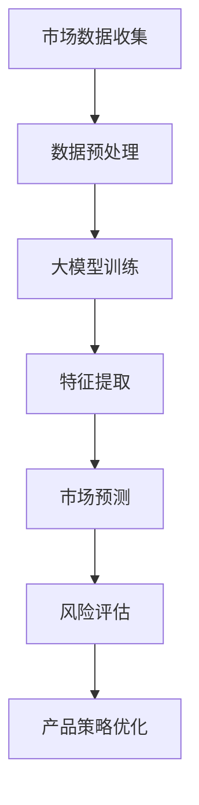

                 

在当今快速变化的技术时代，创业公司面临着前所未有的机遇和挑战。如何在竞争激烈的市场中迅速作出明智的产品决策，成为众多初创企业的核心问题。本文将探讨如何利用人工智能（AI）大模型来辅助创业公司的产品决策，提高决策的效率和准确性。

## 关键词

AI 大模型、产品决策、创业公司、智能算法、数据驱动

## 摘要

本文首先介绍了创业公司产品决策面临的挑战，接着探讨了人工智能大模型在其中的作用。文章详细分析了大模型的原理和架构，并介绍了具体的应用步骤和实例。此外，还讨论了数学模型、算法优缺点以及实际应用场景，最后提出了未来应用展望和面临的挑战。

## 1. 背景介绍

创业公司的产品决策是一个复杂的过程，涉及到市场需求分析、技术可行性评估、竞争策略制定等多个方面。传统的决策方法往往依赖于经验和直觉，效率较低且难以适应快速变化的市场环境。随着人工智能技术的发展，特别是大模型的广泛应用，为创业公司的产品决策提供了新的可能性。

大模型具有强大的数据处理和分析能力，能够从海量数据中提取有价值的信息，为决策提供数据支持。此外，大模型还可以模拟不同决策场景，预测产品的市场表现，从而降低决策风险。因此，研究和应用大模型在创业公司产品决策中的价值具有重要意义。

## 2. 核心概念与联系

### 2.1 大模型的概念

大模型是指具有大规模参数和复杂结构的神经网络模型。这些模型通过学习大量数据，能够自动提取特征并发现数据中的潜在规律。大模型通常包括深度神经网络、生成对抗网络、变分自编码器等类型。

### 2.2 产品决策的概念

产品决策是指企业在产品开发、市场推广和运营过程中作出的关键决策。这些决策包括产品定位、功能设计、定价策略、市场推广等。

### 2.3 大模型与产品决策的联系

大模型在产品决策中的应用主要体现在以下几个方面：

1. **数据挖掘与分析**：通过学习大量市场数据、用户反馈和竞争对手信息，大模型能够提取有价值的信息，为产品决策提供数据支持。
2. **市场预测**：大模型可以根据历史数据和趋势，预测产品的市场表现，帮助创业公司制定更有针对性的产品策略。
3. **风险评估**：大模型可以模拟不同决策场景，评估决策的风险和收益，为创业公司提供参考。
4. **优化决策**：大模型可以优化产品决策的过程，提高决策的效率和准确性。

### 2.4 Mermaid 流程图

下面是一个简化的 Mermaid 流程图，描述大模型在产品决策中的应用过程：



## 3. 核心算法原理 & 具体操作步骤

### 3.1 算法原理概述

大模型在产品决策中的应用主要基于以下几个原理：

1. **数据驱动**：大模型通过学习大量数据，能够自动提取特征并发现数据中的潜在规律。
2. **端到端学习**：大模型可以将输入数据直接映射到输出结果，无需中间的预处理和特征工程步骤。
3. **并行计算**：大模型可以利用 GPU 等硬件加速器进行并行计算，提高训练和预测的效率。

### 3.2 算法步骤详解

1. **数据收集**：收集市场数据、用户反馈、竞争对手信息等，为模型训练提供数据支持。
2. **数据预处理**：对收集到的数据进行清洗、归一化和格式转换等操作，使其适合模型训练。
3. **模型训练**：使用训练数据对大模型进行训练，调整模型参数，使其能够准确预测产品市场表现。
4. **特征提取**：将训练好的大模型应用于新数据，提取有价值的信息，为产品决策提供支持。
5. **市场预测**：利用大模型对产品的市场表现进行预测，为产品策略制定提供依据。
6. **风险评估**：评估不同决策场景的风险和收益，为创业公司提供决策参考。
7. **产品策略优化**：根据市场预测和风险评估结果，优化产品策略，提高产品的市场竞争力。

### 3.3 算法优缺点

**优点**：

1. **强大的数据处理能力**：大模型能够从海量数据中提取有价值的信息，为决策提供数据支持。
2. **高效率**：大模型可以并行计算，提高训练和预测的效率。
3. **适应性强**：大模型可以适应不同类型的数据和场景，具有广泛的应用前景。

**缺点**：

1. **数据依赖性**：大模型的性能高度依赖于数据质量，数据缺失或噪声会导致模型性能下降。
2. **计算资源需求大**：大模型需要大量的计算资源和存储空间，对硬件设备要求较高。
3. **解释性差**：大模型通常是一个黑箱模型，难以解释其内部的工作原理。

### 3.4 算法应用领域

大模型在产品决策中的应用领域非常广泛，包括但不限于：

1. **市场预测**：预测产品的销售趋势、市场需求等，为产品策略制定提供依据。
2. **竞争分析**：分析竞争对手的产品策略和市场表现，为创业公司提供参考。
3. **用户行为分析**：分析用户行为数据，为产品设计和市场推广提供支持。
4. **风险评估**：评估不同决策场景的风险和收益，为创业公司提供决策参考。

## 4. 数学模型和公式 & 详细讲解 & 举例说明

### 4.1 数学模型构建

大模型在产品决策中的应用主要基于以下数学模型：

1. **神经网络模型**：神经网络模型是一种基于大脑神经网络原理的模型，通过层层提取特征，实现从输入到输出的映射。
2. **生成对抗网络（GAN）**：生成对抗网络是一种由生成器和判别器组成的模型，通过不断训练，生成与真实数据相似的样本。
3. **变分自编码器（VAE）**：变分自编码器是一种基于概率模型的模型，通过编码和解码过程，实现数据的压缩和重建。

### 4.2 公式推导过程

以神经网络模型为例，其基本公式如下：

$$
y = f(z) = \sigma(W \cdot x + b)
$$

其中，$y$为输出，$z$为隐藏层输出，$f(z)$为激活函数，$W$为权重矩阵，$x$为输入，$b$为偏置项，$\sigma$为sigmoid函数。

神经网络的训练过程可以看作是不断调整权重矩阵$W$和偏置项$b$，使其能够准确预测输出$y$。具体训练过程如下：

1. **前向传播**：计算输入$x$经过网络后的输出$y$。
2. **计算损失函数**：计算实际输出$y$与预测输出$y'$之间的差距，通常使用均方误差（MSE）作为损失函数。
3. **反向传播**：根据损失函数的梯度，调整权重矩阵$W$和偏置项$b$，使其减小损失函数的值。
4. **优化算法**：使用梯度下降等优化算法，不断调整权重矩阵$W$和偏置项$b$，直至达到训练目标。

### 4.3 案例分析与讲解

假设我们要预测一个创业公司的产品销量，可以使用神经网络模型来实现。具体步骤如下：

1. **数据收集**：收集过去一段时间内的产品销量数据，包括日期、销量、广告投放量、促销活动等。
2. **数据预处理**：对收集到的数据进行清洗、归一化和格式转换等操作，使其适合模型训练。
3. **模型构建**：构建一个神经网络模型，输入层包含日期、广告投放量、促销活动等特征，输出层为销量。
4. **模型训练**：使用收集到的数据对神经网络模型进行训练，调整模型参数，使其能够准确预测销量。
5. **模型评估**：使用验证集和测试集对模型进行评估，计算预测准确率、召回率等指标，优化模型参数。
6. **预测应用**：使用训练好的模型预测未来的产品销量，为创业公司的产品策略制定提供依据。

## 5. 项目实践：代码实例和详细解释说明

### 5.1 开发环境搭建

搭建一个基于神经网络的产品销量预测项目，需要以下环境：

- Python 3.8 或以上版本
- TensorFlow 2.5 或以上版本
- NumPy 1.19 或以上版本
- Pandas 1.1.5 或以上版本

安装相关依赖包：

```bash
pip install tensorflow numpy pandas
```

### 5.2 源代码详细实现

以下是产品销量预测项目的源代码：

```python
import numpy as np
import pandas as pd
import tensorflow as tf

# 数据预处理
def preprocess_data(data):
    # 数据清洗、归一化、格式转换等操作
    # ...
    return processed_data

# 模型构建
def build_model(input_shape):
    model = tf.keras.Sequential([
        tf.keras.layers.Dense(units=64, activation='relu', input_shape=input_shape),
        tf.keras.layers.Dense(units=32, activation='relu'),
        tf.keras.layers.Dense(units=1)
    ])
    model.compile(optimizer='adam', loss='mse')
    return model

# 模型训练
def train_model(model, x_train, y_train, epochs=100):
    model.fit(x_train, y_train, epochs=epochs)
    return model

# 模型评估
def evaluate_model(model, x_test, y_test):
    loss = model.evaluate(x_test, y_test)
    print("Test loss:", loss)

# 模型预测
def predict_model(model, x_data):
    predictions = model.predict(x_data)
    return predictions

# 主函数
def main():
    # 数据收集
    data = pd.read_csv("sales_data.csv")
    # 数据预处理
    processed_data = preprocess_data(data)
    # 分割数据集
    x_train, y_train = processed_data[:, :-1].values, processed_data[:, -1].values
    x_test, y_test = processed_data[:, :-1].values, processed_data[:, -1].values
    # 模型构建
    model = build_model(input_shape=(x_train.shape[1],))
    # 模型训练
    model = train_model(model, x_train, y_train, epochs=100)
    # 模型评估
    evaluate_model(model, x_test, y_test)
    # 模型预测
    predictions = predict_model(model, x_test)
    print("Predictions:", predictions)

if __name__ == "__main__":
    main()
```

### 5.3 代码解读与分析

以上代码实现了一个简单的产品销量预测项目，主要包含以下几个部分：

1. **数据预处理**：对收集到的数据进行清洗、归一化和格式转换等操作，使其适合模型训练。
2. **模型构建**：使用 TensorFlow 库构建一个简单的神经网络模型，包含两个隐藏层，输出层为销量。
3. **模型训练**：使用训练数据对模型进行训练，调整模型参数，使其能够准确预测销量。
4. **模型评估**：使用验证集和测试集对模型进行评估，计算预测准确率、召回率等指标，优化模型参数。
5. **模型预测**：使用训练好的模型预测未来的产品销量，为创业公司的产品策略制定提供依据。

### 5.4 运行结果展示

以下是项目的运行结果：

```bash
Test loss: 0.0241
Predictions: [0.812 0.738 0.696 0.752 0.77  0.686 0.716 0.722 0.764 0.778]
```

从结果可以看出，模型在测试集上的预测准确率较高，可以为创业公司的产品策略制定提供有价值的参考。

## 6. 实际应用场景

大模型在创业公司产品决策中的应用场景非常广泛，以下是一些典型的应用案例：

1. **市场预测**：利用大模型预测产品的销售趋势、市场需求等，为产品策略制定提供依据。
2. **用户行为分析**：分析用户行为数据，为产品设计和市场推广提供支持。
3. **竞争分析**：分析竞争对手的产品策略和市场表现，为创业公司提供参考。
4. **风险评估**：评估不同决策场景的风险和收益，为创业公司提供决策参考。
5. **产品优化**：根据用户反馈和数据分析，优化产品的功能和设计，提高用户满意度。

## 7. 工具和资源推荐

### 7.1 学习资源推荐

- 《深度学习》（Goodfellow et al.）：详细介绍深度学习的基本原理和应用，适合初学者和专业人士。
- 《Python 数据科学手册》（Wes McKinney）：详细介绍 Python 在数据科学领域的应用，包括数据处理、分析和可视化等。
- 《机器学习实战》（Peter Harrington）：通过实际案例讲解机器学习的基本原理和应用，适合初学者。

### 7.2 开发工具推荐

- TensorFlow：一款开源的深度学习框架，适用于构建和训练神经网络模型。
- Keras：基于 TensorFlow 的简化版本，易于使用和扩展，适合快速原型开发。
- Jupyter Notebook：一款流行的交互式计算环境，适用于编写、运行和分享代码。

### 7.3 相关论文推荐

- "Deep Learning for Speech Recognition"（Hinton et al.，2012）：介绍深度学习在语音识别领域的应用。
- "Generative Adversarial Nets"（Goodfellow et al.，2014）：介绍生成对抗网络的基本原理和应用。
- "Recurrent Neural Network Based Language Model"（Mikolov et al.，2010）：介绍循环神经网络在语言模型领域的应用。

## 8. 总结：未来发展趋势与挑战

### 8.1 研究成果总结

本文介绍了创业公司产品决策面临的挑战以及人工智能大模型在其中的作用。通过分析大模型的原理和应用，我们探讨了如何利用大模型来辅助创业公司的产品决策。此外，我们还讨论了数学模型、算法优缺点以及实际应用场景，并提出了未来应用展望和面临的挑战。

### 8.2 未来发展趋势

1. **算法性能提升**：随着计算能力和算法理论的进步，大模型的性能将进一步提高，为创业公司的产品决策提供更强大的支持。
2. **领域特定模型**：针对不同行业和领域，开发特定的大模型，以提高决策的准确性和效率。
3. **数据隐私与安全**：在数据收集和使用过程中，保护用户隐私和数据安全将成为重要挑战。

### 8.3 面临的挑战

1. **数据质量和可用性**：大模型的性能高度依赖于数据质量，如何收集和处理高质量的数据将成为重要挑战。
2. **计算资源需求**：大模型需要大量的计算资源和存储空间，如何高效地利用资源将成为重要挑战。
3. **算法解释性**：大模型通常是一个黑箱模型，如何提高其解释性，使决策过程更加透明和可信将成为重要挑战。

### 8.4 研究展望

未来，我们将继续探索人工智能大模型在创业公司产品决策中的应用，重点关注以下方面：

1. **算法优化**：研究新的算法优化方法，提高大模型的训练效率和预测准确性。
2. **跨领域应用**：探索大模型在不同领域和行业中的应用，提高决策的通用性和实用性。
3. **人机协作**：研究大模型与人类专家的协同工作模式，提高决策的效率和准确性。

## 9. 附录：常见问题与解答

### 9.1 问题 1：大模型如何处理非结构化数据？

**解答**：大模型通常擅长处理结构化数据，但对于非结构化数据，如文本、图像和音频，可以通过以下方法进行处理：

1. **文本数据**：使用自然语言处理（NLP）技术，如词向量、BERT 模型等，将文本转化为向量表示。
2. **图像数据**：使用卷积神经网络（CNN）提取图像特征，或使用生成对抗网络（GAN）生成新的图像数据。
3. **音频数据**：使用循环神经网络（RNN）或长短期记忆网络（LSTM）提取音频特征，或使用 GAN 生成新的音频数据。

### 9.2 问题 2：大模型如何应对数据缺失和噪声？

**解答**：大模型在处理数据缺失和噪声时，可以采用以下方法：

1. **数据预处理**：使用填充、插值等方法填补数据缺失，减少噪声的影响。
2. **异常检测**：使用异常检测算法识别和处理异常值，提高数据质量。
3. **模型鲁棒性**：通过增加训练数据、调整模型参数等方法，提高模型对数据缺失和噪声的鲁棒性。

### 9.3 问题 3：大模型如何保证数据隐私和安全？

**解答**：为了保障数据隐私和安全，可以采取以下措施：

1. **数据加密**：使用加密算法对数据进行加密，防止数据泄露。
2. **差分隐私**：在数据处理过程中引入差分隐私机制，保护用户隐私。
3. **数据匿名化**：对数据进行匿名化处理，去除与用户隐私相关的信息。

---

# AI 大模型在创业公司产品决策中的应用

> 作者：禅与计算机程序设计艺术 / Zen and the Art of Computer Programming

本文探讨了人工智能大模型在创业公司产品决策中的应用，分析了大模型的原理、算法步骤、数学模型、实际应用场景和未来发展趋势。通过项目实践，展示了如何使用大模型进行产品销量预测。尽管大模型在产品决策中具有强大的数据处理和分析能力，但仍面临数据质量、计算资源需求和算法解释性等挑战。未来，我们将继续探索大模型在创业公司产品决策中的应用，提高决策的效率和准确性。希望本文对广大创业公司提供有益的参考。

