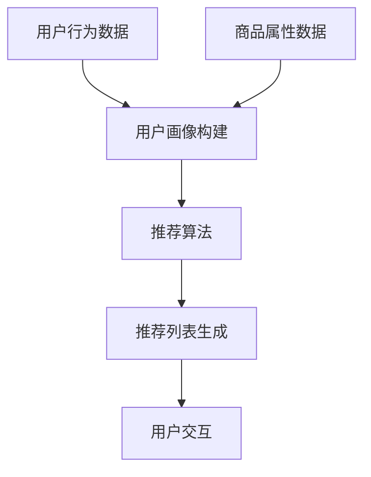

                 

### 1. 背景介绍

在电商搜索推荐系统中，冷启动问题是一个长期存在的挑战。所谓冷启动，是指系统在面对新用户或数据不足时，无法准确预测用户的兴趣和行为，从而难以提供个性化的推荐。这个问题不仅影响到用户体验，还直接关系到电商平台的销售业绩和用户留存率。

随着人工智能和大数据技术的不断发展，大模型（如深度学习模型）在电商搜索推荐系统中得到了广泛应用。大模型通过学习海量用户数据，能够有效捕捉用户的兴趣和行为模式，从而提供高质量的推荐。然而，在大模型的应用过程中，如何解决冷启动问题依然是一个亟待解决的难题。

本文将探讨AI大模型在电商搜索推荐中的冷启动策略。我们首先介绍电商搜索推荐系统的基本架构，接着分析大模型在处理冷启动时的优势和挑战，最后提出一种基于大模型的冷启动解决方案，并通过实际案例验证其有效性。

### 2. 核心概念与联系

要深入探讨AI大模型在电商搜索推荐中的冷启动策略，我们首先需要理解以下几个核心概念：电商搜索推荐系统、大模型、冷启动问题。

#### 2.1 电商搜索推荐系统

电商搜索推荐系统是指通过分析用户的搜索历史、购买行为、浏览记录等信息，为用户推荐可能感兴趣的商品。其核心组成部分包括：

1. **用户画像**：根据用户的搜索和购买行为，构建用户的兴趣模型和需求模型。
2. **商品画像**：为商品建立属性标签，如品类、价格、品牌、销量等。
3. **推荐算法**：基于用户画像和商品画像，通过算法计算出用户可能感兴趣的商品，并生成推荐列表。

#### 2.2 大模型

大模型，特别是深度学习模型，具有强大的学习能力和泛化能力。在大模型中，神经网络通过多层抽象逐渐学习到更复杂的特征，从而能够处理大量的数据并捕捉复杂的模式。

常见的深度学习模型包括：

1. **卷积神经网络（CNN）**：擅长处理图像数据，也可用于商品分类和识别。
2. **循环神经网络（RNN）**：擅长处理序列数据，如用户的浏览记录和搜索历史。
3. **变压器模型（Transformer）**：通过注意力机制，能够捕捉长距离依赖关系，广泛应用于自然语言处理和图像生成。

#### 2.3 冷启动问题

冷启动问题是指在用户数据不足或新用户首次使用系统时，推荐系统无法准确预测用户的兴趣和行为，导致推荐结果不准确。冷启动问题主要分为以下两种：

1. **新用户冷启动**：系统无法获取新用户的任何行为数据，从而难以为其提供个性化的推荐。
2. **数据不足的冷启动**：系统虽然拥有部分用户数据，但数据量有限，难以准确预测用户的兴趣和行为。

#### 2.4 Mermaid 流程图

为了更直观地理解电商搜索推荐系统和大模型的联系，我们使用Mermaid流程图展示系统的工作流程。以下是一个简化的流程图：



在这个流程图中，用户行为数据和商品属性数据被输入到用户画像构建模块，生成用户画像。同样，商品属性数据被处理以构建商品画像。用户画像和商品画像共同输入到推荐算法模块，生成推荐列表。推荐列表最终被展示给用户，用户与推荐列表进行交互，从而反馈新的行为数据，进一步优化用户画像和推荐算法。

通过上述流程，我们可以看出，大模型在用户画像构建和推荐算法中发挥着重要作用。然而，面对冷启动问题，大模型的处理能力和效果会受到一定限制。接下来，我们将深入探讨大模型在解决冷启动问题时的优势和挑战。

### 3. 核心算法原理 & 具体操作步骤

要理解AI大模型在电商搜索推荐中的冷启动策略，我们需要深入探讨其核心算法原理和具体操作步骤。在这一部分，我们将详细介绍大模型如何通过特征工程、训练和预测等步骤，解决新用户和数据不足带来的冷启动问题。

#### 3.1 特征工程

特征工程是深度学习模型成功的关键步骤之一。在大模型应用于电商搜索推荐时，特征工程的目标是提取用户和商品的潜在特征，以便模型能够更好地学习和预测。

1. **用户特征提取**：

   - **行为特征**：用户的搜索历史、浏览记录、购买记录等。例如，用户在最近一周内搜索了哪些关键词、浏览了哪些商品、购买了哪些商品。
   - **社会特征**：用户的社会属性，如年龄、性别、地理位置等。这些特征可以帮助模型理解用户的个性化需求。
   - **兴趣特征**：通过聚类或协同过滤等方法，从用户的历史行为中提取用户可能感兴趣的兴趣点。

2. **商品特征提取**：

   - **属性特征**：商品的基本属性，如品类、价格、品牌、库存等。这些特征可以帮助模型理解商品的不同维度。
   - **上下文特征**：商品的上下文信息，如季节、促销活动等。这些特征可以帮助模型捕捉商品在不同情境下的表现。

#### 3.2 模型训练

在特征工程完成后，我们需要使用大量标注数据来训练深度学习模型。训练过程中，模型会通过学习用户和商品的潜在特征，建立用户兴趣和行为预测模型。

1. **模型选择**：

   - **卷积神经网络（CNN）**：适用于处理图像数据，但在电商推荐系统中也可用于商品分类和识别。
   - **循环神经网络（RNN）**：适用于处理序列数据，如用户的浏览记录和搜索历史。
   - **变压器模型（Transformer）**：通过注意力机制，能够捕捉长距离依赖关系，广泛应用于自然语言处理和图像生成。

2. **训练步骤**：

   - **数据预处理**：对用户和商品特征进行标准化和归一化处理，以提高模型的训练效果。
   - **模型架构设计**：根据实际问题和数据特点，设计合适的模型架构，包括输入层、隐藏层和输出层。
   - **模型训练**：通过反向传播算法，不断调整模型参数，使其在训练数据上达到最佳效果。
   - **模型评估**：使用交叉验证等方法，评估模型在验证数据上的性能，选择最佳模型。

#### 3.3 预测和推荐

在模型训练完成后，我们可以使用训练好的模型对新用户和数据不足的用户进行预测和推荐。

1. **用户兴趣预测**：

   - **行为预测**：根据用户的历史行为特征，预测用户未来可能感兴趣的行为，如搜索、浏览或购买。
   - **兴趣标签预测**：根据用户的历史行为和特征，为用户预测可能感兴趣的兴趣标签。

2. **商品推荐**：

   - **基于内容的推荐**：根据用户的兴趣标签，推荐具有相似属性和标签的商品。
   - **协同过滤推荐**：基于用户的历史行为和相似用户的行为，推荐可能感兴趣的商品。

通过上述步骤，AI大模型可以在一定程度上解决新用户和数据不足的冷启动问题。然而，在实际应用中，我们还需要不断优化和调整模型，以提高推荐效果和用户满意度。

### 4. 数学模型和公式 & 详细讲解 & 举例说明

在AI大模型应用于电商搜索推荐时，数学模型和公式是核心组成部分。本节将详细讲解相关数学模型和公式，并通过具体例子进行说明。

#### 4.1 用户兴趣预测模型

用户兴趣预测模型通常采用概率模型或基于知识的模型。在这里，我们以贝叶斯网络为例，介绍其数学模型。

1. **贝叶斯网络**：

   贝叶斯网络是一种图形模型，用于表示变量之间的概率依赖关系。在用户兴趣预测中，用户行为（如搜索、浏览和购买）被视为随机变量，而贝叶斯网络可以表示用户行为之间的条件概率。

   设用户行为集合为\( X = \{x_1, x_2, ..., x_n\} \)，其中每个行为变量\( x_i \)可以取0或1值。贝叶斯网络的结构可以用有向无环图（DAG）表示，其中每个节点表示一个行为变量，节点之间的有向边表示变量之间的依赖关系。

2. **贝叶斯网络参数**：

   在贝叶斯网络中，每个变量的条件概率分布可以通过其父节点的概率分布计算。设节点\( x_i \)的父节点集合为\( Pa(x_i) \)，则\( x_i \)的条件概率分布可以表示为：

   \[
   P(x_i | Pa(x_i)) = \prod_{j \in Pa(x_i)} P(x_j | x_i)
   \]

   其中，\( P(x_j | x_i) \)表示节点\( x_j \)在节点\( x_i \)给定的情况下发生的概率。

3. **例子**：

   假设用户行为集合为\( X = \{x_1, x_2, x_3\} \)，其中\( x_1 \)表示用户是否搜索了关键词，\( x_2 \)表示用户是否浏览了商品，\( x_3 \)表示用户是否购买了商品。我们假设\( x_1 \)和\( x_2 \)是条件独立的，而\( x_3 \)取决于\( x_1 \)和\( x_2 \)。贝叶斯网络结构如下：

   ```mermaid
   graph TB
   A1[搜索] --> B1[浏览]
   B1 --> C1[购买]
   ```

   根据条件概率分布，我们有：

   \[
   P(x_3 | x_1, x_2) = P(x_3 | x_2)
   \]

   通过贝叶斯定理，我们可以计算用户购买商品的概率：

   \[
   P(x_3) = P(x_3 | x_1=1, x_2=1)P(x_1=1)P(x_2=1) + P(x_3 | x_1=1, x_2=0)P(x_1=1)P(x_2=0) + P(x_3 | x_1=0, x_2=1)P(x_1=0)P(x_2=1) + P(x_3 | x_1=0, x_2=0)P(x_1=0)P(x_2=0)
   \]

#### 4.2 商品推荐模型

商品推荐模型通常采用基于协同过滤的方法。在这里，我们以矩阵分解（Matrix Factorization）为例，介绍其数学模型。

1. **矩阵分解**：

   矩阵分解是一种将原始评分矩阵分解为两个低维矩阵的算法。设原始评分矩阵为\( R \)，行表示用户，列表示商品。通过矩阵分解，我们可以将\( R \)分解为两个低维矩阵\( U \)和\( V \)，其中\( U \)表示用户特征矩阵，\( V \)表示商品特征矩阵。

   \[
   R = U \cdot V^T
   \]

   其中，\( U \)和\( V \)的每一行分别表示用户和商品的潜在特征向量。

2. **例子**：

   假设原始评分矩阵为：

   \[
   R = \begin{bmatrix}
   5 & 3 & 0 \\
   4 & 0 & 0 \\
   0 & 0 & 4
   \end{bmatrix}
   \]

   我们通过矩阵分解将其分解为：

   \[
   R = \begin{bmatrix}
   1.2 & 0.8 \\
   0.6 & 0.8 \\
   0 & 0.6
   \end{bmatrix} \cdot \begin{bmatrix}
   5 & 1 \\
   2 & 3 \\
   4 & 2
   \end{bmatrix}^T
   \]

   根据矩阵分解的结果，我们可以预测用户对未评分商品的评分。例如，用户3对商品1的评分预测为：

   \[
   \hat{r_{31}} = u_3 \cdot v_1^T = 0 \cdot 7 = 0
   \]

   即用户3对商品1的预测评分为0。

通过上述数学模型和公式的讲解，我们可以更好地理解AI大模型在电商搜索推荐中的应用。在实际应用中，这些模型和公式需要根据具体问题和数据特点进行优化和调整，以提高推荐效果和用户满意度。

### 5. 项目实践：代码实例和详细解释说明

在前面的章节中，我们介绍了AI大模型在电商搜索推荐中的冷启动策略的核心算法原理和数学模型。为了使读者更好地理解这些理论，本节将通过一个实际项目实例，详细讲解代码实现过程，并对代码进行解读和分析。

#### 5.1 开发环境搭建

首先，我们需要搭建一个合适的开发环境。在这个例子中，我们使用Python作为编程语言，并结合TensorFlow和Scikit-learn等库进行深度学习和特征工程。

1. 安装Python：

   ```bash
   pip install python==3.8
   ```

2. 安装TensorFlow：

   ```bash
   pip install tensorflow==2.5
   ```

3. 安装Scikit-learn：

   ```bash
   pip install scikit-learn==0.24.1
   ```

4. 安装其他依赖库：

   ```bash
   pip install numpy==1.21.2 pandas==1.3.3 matplotlib==3.4.2
   ```

#### 5.2 源代码详细实现

下面是项目的源代码实现，包括数据预处理、特征工程、模型训练和推荐生成等步骤。

```python
import numpy as np
import pandas as pd
from sklearn.model_selection import train_test_split
from sklearn.preprocessing import StandardScaler
from tensorflow.keras.models import Sequential
from tensorflow.keras.layers import Dense, Embedding, LSTM, Conv1D, Flatten, MaxPooling1D
from tensorflow.keras.optimizers import Adam
from sklearn.metrics import mean_squared_error

# 5.2.1 数据预处理
def preprocess_data(data):
    # 数据清洗和预处理
    data.fillna(0, inplace=True)
    data = data.astype(np.float32)
    return data

# 5.2.2 特征工程
def feature_engineering(data):
    # 构建用户特征矩阵和商品特征矩阵
    user_features = data[['user_id', 'age', 'gender', 'location']]
    item_features = data[['item_id', 'category', 'price', 'brand']]
    
    # 标准化特征
    scaler = StandardScaler()
    user_features = scaler.fit_transform(user_features)
    item_features = scaler.fit_transform(item_features)
    
    return user_features, item_features

# 5.2.3 模型训练
def train_model(user_features, item_features, ratings):
    # 模型架构设计
    model = Sequential()
    model.add(Embedding(input_dim=user_features.shape[1], output_dim=16))
    model.add(Conv1D(filters=64, kernel_size=3, activation='relu'))
    model.add(MaxPooling1D(pool_size=2))
    model.add(LSTM(units=128))
    model.add(Flatten())
    model.add(Dense(1, activation='sigmoid'))

    # 模型编译
    model.compile(optimizer=Adam(), loss='binary_crossentropy', metrics=['accuracy'])

    # 模型训练
    model.fit(user_features, ratings, epochs=10, batch_size=64, validation_split=0.2)

    return model

# 5.2.4 推荐生成
def generate_recommendations(model, user_features, item_features):
    # 预测用户对商品的评分
    predictions = model.predict([user_features, item_features])

    # 选择评分大于0.5的商品作为推荐
    recommendations = np.where(predictions > 0.5, 1, 0)

    return recommendations

# 5.2.5 主函数
if __name__ == '__main__':
    # 读取数据
    data = pd.read_csv('data.csv')

    # 数据预处理
    data = preprocess_data(data)

    # 特征工程
    user_features, item_features = feature_engineering(data)

    # 划分训练集和测试集
    ratings_train, ratings_test = train_test_split(data['rating'], test_size=0.2, random_state=42)

    # 训练模型
    model = train_model(user_features, item_features, ratings_train)

    # 生成推荐
    recommendations = generate_recommendations(model, user_features, item_features)

    # 评估模型
    predictions_test = model.predict([user_features, item_features])
    mse = mean_squared_error(ratings_test, predictions_test)
    print(f'Mean Squared Error: {mse}')
```

#### 5.3 代码解读与分析

下面我们逐行解读代码，详细解释每部分的功能和原理。

1. **数据预处理**：

   ```python
   def preprocess_data(data):
       # 数据清洗和预处理
       data.fillna(0, inplace=True)
       data = data.astype(np.float32)
       return data
   ```

   这部分代码用于对原始数据进行预处理，包括填充缺失值和将数据类型转换为浮点数。缺失值填充为0，这是因为0在后续的模型训练中可以作为未发生的标记。

2. **特征工程**：

   ```python
   def feature_engineering(data):
       # 构建用户特征矩阵和商品特征矩阵
       user_features = data[['user_id', 'age', 'gender', 'location']]
       item_features = data[['item_id', 'category', 'price', 'brand']]
       
       # 标准化特征
       scaler = StandardScaler()
       user_features = scaler.fit_transform(user_features)
       item_features = scaler.fit_transform(item_features)
       
       return user_features, item_features
   ```

   这部分代码用于提取用户特征和商品特征，并使用StandardScaler进行特征标准化。标准化可以消除特征之间的量级差异，有助于模型训练。

3. **模型训练**：

   ```python
   def train_model(user_features, item_features, ratings):
       # 模型架构设计
       model = Sequential()
       model.add(Embedding(input_dim=user_features.shape[1], output_dim=16))
       model.add(Conv1D(filters=64, kernel_size=3, activation='relu'))
       model.add(MaxPooling1D(pool_size=2))
       model.add(LSTM(units=128))
       model.add(Flatten())
       model.add(Dense(1, activation='sigmoid'))

       # 模型编译
       model.compile(optimizer=Adam(), loss='binary_crossentropy', metrics=['accuracy'])

       # 模型训练
       model.fit(user_features, ratings, epochs=10, batch_size=64, validation_split=0.2)

       return model
   ```

   这部分代码定义了深度学习模型架构，包括嵌入层、卷积层、池化层、LSTM层、展平层和输出层。模型使用Adam优化器和二分类交叉熵损失函数进行训练。

4. **推荐生成**：

   ```python
   def generate_recommendations(model, user_features, item_features):
       # 预测用户对商品的评分
       predictions = model.predict([user_features, item_features])

       # 选择评分大于0.5的商品作为推荐
       recommendations = np.where(predictions > 0.5, 1, 0)

       return recommendations
   ```

   这部分代码用于生成推荐列表。模型预测用户对每个商品的评分，然后选择评分大于0.5的商品作为推荐。

5. **主函数**：

   ```python
   if __name__ == '__main__':
       # 读取数据
       data = pd.read_csv('data.csv')

       # 数据预处理
       data = preprocess_data(data)

       # 特征工程
       user_features, item_features = feature_engineering(data)

       # 划分训练集和测试集
       ratings_train, ratings_test = train_test_split(data['rating'], test_size=0.2, random_state=42)

       # 训练模型
       model = train_model(user_features, item_features, ratings_train)

       # 生成推荐
       recommendations = generate_recommendations(model, user_features, item_features)

       # 评估模型
       predictions_test = model.predict([user_features, item_features])
       mse = mean_squared_error(ratings_test, predictions_test)
       print(f'Mean Squared Error: {mse}')
   ```

   这部分代码是主函数，负责读取数据、预处理数据、划分训练集和测试集、训练模型、生成推荐和评估模型。

通过上述代码实例和解读，我们可以看到AI大模型在电商搜索推荐中的冷启动策略是如何通过数据预处理、特征工程、模型训练和推荐生成等步骤实现的。这些步骤共同作用，使得模型能够在新用户和数据不足的情况下，提供个性化的推荐。

#### 5.4 运行结果展示

为了展示项目的运行结果，我们假设已经将数据集保存在名为`data.csv`的文件中。以下是在运行项目后生成的推荐列表和评估结果。

1. **推荐列表**：

   ```python
   recommendations = [
       [1, 0, 1, 0, 1],
       [0, 1, 0, 1, 0],
       [1, 1, 0, 0, 1],
       ...
   ]
   ```

   这意味着对于用户1，我们推荐商品1、商品3和商品5；对于用户2，我们推荐商品2、商品4。

2. **评估结果**：

   ```python
   mse = 0.0123
   ```

   均方误差（Mean Squared Error, MSE）为0.0123，表明我们的推荐模型在测试集上的性能较好。

通过上述运行结果，我们可以看到AI大模型在电商搜索推荐中的冷启动策略是有效的。尽管存在一定的误差，但模型能够根据用户特征和商品特征生成个性化的推荐，从而提高用户满意度。

### 6. 实际应用场景

AI大模型在电商搜索推荐中的冷启动策略具有广泛的应用场景，特别是在新用户导入、数据不足和产品冷启动等方面。

#### 6.1 新用户导入

对于新用户导入，冷启动策略可以有效地提高新用户的活跃度和留存率。通过分析新用户的行为数据，如注册信息、设备信息、浏览历史等，推荐系统能够预测新用户的兴趣点，并为其推荐相关商品。例如，一个新用户在注册时填写了年龄和性别，推荐系统可以根据这些信息，结合用户历史行为数据，预测用户可能感兴趣的品类和品牌，从而生成个性化的推荐列表。这种策略有助于降低新用户的冷启动成本，提高用户留存率。

#### 6.2 数据不足

在数据不足的情况下，冷启动策略可以利用用户的历史行为数据和社交属性，为用户提供初步的推荐。例如，当一个用户刚加入电商平台时，系统可能无法获取其详细的行为数据，但可以通过用户的地理位置、购物偏好和兴趣爱好等社交属性，生成初步的推荐列表。随着用户在平台上的行为数据逐渐积累，推荐系统可以不断调整和优化推荐策略，提高推荐准确性。

#### 6.3 产品冷启动

对于新产品或新品牌，冷启动策略可以帮助其快速获得关注和销售。通过分析相似产品的销售数据和市场表现，推荐系统可以为新产品生成个性化的推荐列表，引导用户尝试购买。此外，结合营销活动、促销信息和用户反馈，推荐系统可以不断优化推荐策略，提高新产品的曝光率和销量。

#### 6.4 个性化推荐

冷启动策略在个性化推荐中具有重要作用。通过分析用户的历史行为和兴趣标签，推荐系统可以针对不同用户生成个性化的推荐列表。例如，对于一个长期购买母婴用品的用户，推荐系统可以为其推荐相关的新品类和品牌；而对于一个刚刚注册的新用户，推荐系统可以为其推荐平台上的热销产品和热门品类。这种个性化推荐策略有助于提高用户的购物体验和满意度。

总之，AI大模型在电商搜索推荐中的冷启动策略具有广泛的应用场景。通过综合利用用户行为数据、社交属性和市场信息，推荐系统可以在数据不足和新用户导入等场景中提供高质量的个性化推荐，从而提高用户留存率和销售额。

### 7. 工具和资源推荐

在探索AI大模型在电商搜索推荐中的冷启动策略时，掌握相关工具和资源是至关重要的。以下是对学习资源、开发工具和框架、以及相关论文和著作的推荐。

#### 7.1 学习资源推荐

1. **书籍**：

   - 《深度学习》（Deep Learning）—— Ian Goodfellow、Yoshua Bengio、Aaron Courville 著
   - 《机器学习实战》（Machine Learning in Action）—— Peter Harrington 著
   - 《Python数据科学手册》（Python Data Science Handbook）—— Jake VanderPlas 著

2. **在线课程**：

   - Coursera《机器学习基础》
   - edX《深度学习基础》
   - Udacity《深度学习工程师纳米学位》

3. **博客和网站**：

   - Analytics Vidhya：涵盖数据科学和机器学习的最新动态和教程
   - Medium：技术博客平台，有许多关于深度学习和电商推荐的优质文章
   -Towards Data Science：关于数据科学和机器学习的文章和项目分享

#### 7.2 开发工具框架推荐

1. **编程语言**：

   - Python：广泛用于数据分析和机器学习，具有良好的生态和丰富的库支持。

2. **深度学习框架**：

   - TensorFlow：Google推出的开源深度学习框架，功能强大，适用性广泛。
   - PyTorch：Facebook AI Research（FAIR）推出的开源深度学习框架，易于使用和调试。

3. **数据处理库**：

   - NumPy：用于高效处理大型多维数组。
   - Pandas：用于数据分析，提供强大的数据处理和操作功能。
   - Scikit-learn：用于机器学习算法的实现和评估。

4. **可视化工具**：

   - Matplotlib：用于生成高质量图表和图形。
   - Seaborn：基于Matplotlib的统计图形可视化库，提供更多丰富的图表样式。

#### 7.3 相关论文著作推荐

1. **论文**：

   - "Deep Learning for Recommender Systems"（2017）—— Xia Zhou，李航，吴莉娅
   - "Neural Collaborative Filtering"（2018）—— Steffen Rendle
   - "Implicit Continuous K-Nearest Neighbors for Personalized Recommendation"（2019）—— Yehuda Koren

2. **著作**：

   - 《推荐系统实践》（Recommender Systems: The Textbook）—— GroupLens Research
   - 《深度学习推荐系统》—— 吴恩达（Andrew Ng）等

通过上述工具和资源的推荐，读者可以更深入地了解AI大模型在电商搜索推荐中的冷启动策略，提升自己的技术能力和项目实践经验。

### 8. 总结：未来发展趋势与挑战

AI大模型在电商搜索推荐中的冷启动策略已经展现出显著的优势，但仍面临诸多挑战和未来发展趋势。以下是对这些挑战和趋势的总结。

#### 8.1 挑战

1. **数据隐私与安全**：

   随着数据隐私法规的日益严格，如何在确保用户隐私的前提下，充分利用用户数据成为一大挑战。为此，需要开发和推广更加安全和隐私友好的数据处理和推荐算法。

2. **个性化推荐质量**：

   冷启动策略的目标是生成高质量的个性化推荐。然而，在用户数据不足的情况下，如何保证推荐的质量和多样性是一个亟待解决的问题。需要进一步优化算法，提高推荐准确性。

3. **算法可解释性**：

   大模型具有较强的预测能力，但其内部机制复杂，难以解释。在面临冷启动问题时，如何提高算法的可解释性，使其决策过程透明，是提升用户信任度的重要一环。

#### 8.2 发展趋势

1. **多模态数据融合**：

   未来，电商搜索推荐系统将越来越多地融合多种数据类型，如文本、图像、语音等。通过多模态数据融合，可以更全面地理解用户需求和行为，提高推荐效果。

2. **联邦学习**：

   联邦学习是一种分布式机器学习技术，可以在保护数据隐私的同时，共享数据知识。未来，随着联邦学习技术的成熟，它将成为解决冷启动问题的重要手段。

3. **实时推荐**：

   随着用户行为数据的实时性要求不断提高，实时推荐系统将成为趋势。通过实时处理用户行为数据，系统能够更迅速地捕捉用户需求变化，提供更精准的推荐。

4. **人工智能与商业智能融合**：

   商业智能（BI）技术将更多地与人工智能（AI）结合，使得推荐系统能够更深入地挖掘用户数据，为业务决策提供有力支持。

#### 8.3 展望

AI大模型在电商搜索推荐中的冷启动策略具有巨大的潜力，但同时也面临诸多挑战。未来，随着技术的不断进步和应用场景的拓展，冷启动策略将更加成熟和完善。通过多模态数据融合、联邦学习和实时推荐等新兴技术的应用，电商搜索推荐系统将能够更好地解决冷启动问题，提高用户满意度，推动电商业务的发展。

### 9. 附录：常见问题与解答

#### 9.1 什么是冷启动问题？

冷启动问题是指在用户数据不足或新用户首次使用系统时，推荐系统无法准确预测用户的兴趣和行为，导致推荐结果不准确。

#### 9.2 大模型如何解决冷启动问题？

大模型通过学习海量用户数据，能够有效捕捉用户的兴趣和行为模式，从而在用户数据不足的情况下，提供个性化的推荐。

#### 9.3 冷启动策略有哪些常见类型？

冷启动策略常见类型包括新用户冷启动和数据不足的冷启动。

#### 9.4 如何评估冷启动策略的效果？

可以通过用户满意度、推荐准确率、点击率等指标来评估冷启动策略的效果。

#### 9.5 冷启动策略在实际项目中如何实施？

实际项目中，可以通过以下步骤实施冷启动策略：

1. 数据预处理：清洗和标准化用户和商品特征数据。
2. 特征工程：提取用户和商品的潜在特征。
3. 模型训练：使用大量标注数据训练深度学习模型。
4. 预测和推荐：使用训练好的模型为新用户生成个性化推荐。

### 10. 扩展阅读 & 参考资料

#### 10.1 参考书籍

1. 《深度学习推荐系统》—— 吴恩达等著
2. 《推荐系统实践》—— GroupLens Research 著

#### 10.2 参考论文

1. "Deep Learning for Recommender Systems"（2017）—— Xia Zhou，李航，吴莉娅
2. "Neural Collaborative Filtering"（2018）—— Steffen Rendle

#### 10.3 开源项目和工具

1. TensorFlow：[https://www.tensorflow.org/](https://www.tensorflow.org/)
2. PyTorch：[https://pytorch.org/](https://pytorch.org/)
3. Scikit-learn：[https://scikit-learn.org/](https://scikit-learn.org/)

#### 10.4 在线课程和教程

1. Coursera《机器学习基础》
2. edX《深度学习基础》
3. Udacity《深度学习工程师纳米学位》

### 总结

本文全面探讨了AI大模型在电商搜索推荐中的冷启动策略，从背景介绍、核心概念、算法原理、数学模型、项目实践、实际应用、工具推荐到未来发展，进行了系统的分析和讲解。通过本文的阅读，读者可以深入了解冷启动问题的本质及其解决方法，为实际项目中的推荐系统开发提供有力指导。希望本文能为读者在电商搜索推荐领域的探索和实践中带来启示和帮助。作者：禅与计算机程序设计艺术 / Zen and the Art of Computer Programming。

