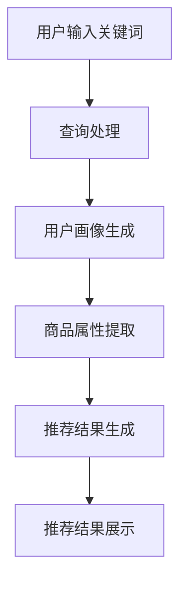

                 

### 背景介绍

随着互联网的迅猛发展，电子商务已经成为全球经济增长的重要引擎。在电商领域，搜索推荐系统是一个关键组成部分，它直接影响用户的购物体验和商家的销售额。传统的搜索推荐系统主要依赖于历史数据挖掘和机器学习算法，通过对用户的历史行为进行分析来预测用户的兴趣和需求。然而，这种基于历史数据的推荐方式存在明显的局限性，无法实时响应用户的瞬时需求与意图。

实时推荐策略旨在根据用户的实时行为和上下文信息，动态地调整推荐结果，从而更好地满足用户的需求。与传统的推荐系统相比，实时推荐策略能够更迅速地捕捉用户的兴趣变化，提高推荐的准确性和相关性。尤其是在电商搜索场景中，实时推荐策略具有以下几方面的显著优势：

1. **提升用户体验**：实时推荐策略能够迅速响应用户的查询和浏览行为，提供个性化的推荐结果，从而提高用户的购物满意度和忠诚度。
2. **增加销售额**：通过实时推荐策略，商家可以更精准地匹配用户需求，提升商品转化率，从而实现更高的销售额。
3. **减少用户流失**：实时推荐策略能够吸引更多潜在用户，增加用户在平台上的停留时间，降低用户流失率。
4. **提高运营效率**：实时推荐系统可以自动调整推荐策略，减少人工干预，提高运营效率。

本文将深入探讨AI大模型在电商搜索推荐中的实时推荐策略，分析其工作原理、具体操作步骤和实际应用场景，并探讨未来的发展趋势与挑战。

### 核心概念与联系

#### 实时推荐策略的概念

实时推荐策略是一种基于用户实时行为和上下文信息进行推荐的技术。它能够迅速捕捉用户的兴趣变化，动态调整推荐结果，从而更好地满足用户的需求。实时推荐策略的核心在于“实时性”和“动态性”，即能够根据用户当前的行为和上下文信息，实时地生成个性化的推荐结果。

#### 电商搜索推荐中的实时推荐策略

在电商搜索推荐中，实时推荐策略主要应用于以下几种场景：

1. **用户查询输入**：当用户在电商平台上输入关键词或进行搜索时，实时推荐系统能够根据关键词的语义和用户的历史行为，快速生成相关的推荐结果。
2. **用户浏览行为**：当用户在电商平台上浏览商品时，实时推荐系统能够根据用户的浏览路径和偏好，实时调整推荐结果，提供更加个性化的商品推荐。
3. **用户购物车行为**：当用户在购物车中添加或删除商品时，实时推荐系统能够根据用户的购物车内容，动态调整推荐结果，推荐与购物车中的商品相关联的其他商品。

#### AI大模型的应用

AI大模型在实时推荐策略中扮演着关键角色。大模型通过深度学习算法，能够从海量数据中挖掘出用户的兴趣和行为模式，从而生成高度个性化的推荐结果。以下是AI大模型在电商搜索推荐中的具体应用：

1. **用户画像生成**：大模型能够通过用户的浏览、搜索和购买行为，生成详细的用户画像，包括用户的兴趣偏好、消费能力、购买频率等信息。
2. **商品属性提取**：大模型能够自动提取商品的各项属性，如价格、品牌、种类等，从而实现商品与用户画像的精准匹配。
3. **推荐结果生成**：大模型通过深度学习算法，根据用户画像和商品属性，实时生成个性化的推荐结果。

#### Mermaid流程图

为了更好地展示实时推荐策略的流程，我们使用Mermaid绘制了以下流程图：



在这个流程图中，用户输入关键词是推荐过程的起点，通过查询处理，系统生成用户的实时画像和商品属性，然后通过大模型进行推荐结果生成，最终展示个性化的推荐结果。

通过以上介绍，我们可以看出，实时推荐策略在电商搜索推荐中具有重要的应用价值。接下来，我们将深入探讨AI大模型在实时推荐策略中的具体实现和操作步骤。

### 核心算法原理 & 具体操作步骤

#### 1. 用户画像生成

用户画像生成是实时推荐策略的基础。通过分析用户的浏览、搜索和购买行为，系统能够生成一个详细的用户画像，这个画像包含了用户的兴趣偏好、消费能力、购买频率等信息。

具体操作步骤如下：

1. **数据采集**：首先，系统需要采集用户的各类行为数据，包括浏览记录、搜索关键词、购买记录等。
2. **数据预处理**：对采集到的数据进行清洗和整合，去除重复和无效的数据，确保数据的质量。
3. **特征提取**：根据用户的行为数据，提取出与用户画像相关的特征，如兴趣类别、消费频率、购买金额等。
4. **模型训练**：使用机器学习算法，如决策树、随机森林或神经网络，对提取出的特征进行训练，生成用户画像。

#### 2. 商品属性提取

商品属性提取是实时推荐策略的另一个关键环节。通过自动提取商品的各项属性，系统能够实现商品与用户画像的精准匹配。

具体操作步骤如下：

1. **数据采集**：系统需要采集商品的详细信息，包括价格、品牌、种类、评价等。
2. **数据预处理**：与用户画像生成类似，对商品数据进行清洗和整合，确保数据质量。
3. **特征提取**：从商品数据中提取出与商品属性相关的特征，如价格范围、品牌知名度、商品评价等。
4. **模型训练**：使用机器学习算法，对提取出的特征进行训练，生成商品属性模型。

#### 3. 推荐结果生成

推荐结果生成是实时推荐策略的核心。通过用户画像和商品属性模型，系统能够实时生成个性化的推荐结果。

具体操作步骤如下：

1. **相似度计算**：计算用户画像与商品属性之间的相似度，使用距离度量方法，如欧氏距离、余弦相似度等。
2. **排序算法**：根据相似度计算结果，对推荐结果进行排序，选择相似度最高的商品推荐给用户。
3. **推荐结果调整**：考虑到用户的行为可能具有短期性和动态性，系统需要根据用户的实时行为调整推荐结果，如用户的浏览记录、购物车变化等。
4. **结果展示**：将最终的推荐结果展示给用户，以个性化的方式呈现。

#### 4. 推荐结果反馈与优化

推荐结果生成后，系统需要收集用户的反馈信息，以进一步优化推荐策略。

具体操作步骤如下：

1. **用户反馈收集**：系统需要收集用户对推荐结果的反馈，包括点击率、购买率、评价等。
2. **反馈分析**：对用户反馈进行分析，识别推荐结果中的优点和不足。
3. **模型调整**：根据反馈结果，调整用户画像和商品属性模型，以提高推荐结果的准确性。
4. **闭环优化**：通过不断的用户反馈和模型调整，实现推荐策略的闭环优化，提高推荐效果。

### 数学模型和公式 & 详细讲解 & 举例说明

#### 相似度计算

在实时推荐策略中，相似度计算是关键步骤之一。相似度用于衡量用户画像与商品属性之间的相关性，从而决定推荐结果。

常用的相似度计算方法包括欧氏距离和余弦相似度。

**欧氏距离**：

欧氏距离是衡量两个向量之间差异的一种方法。其计算公式为：

$$
d(p_1, p_2) = \sqrt{\sum_{i=1}^{n} (p_{1i} - p_{2i})^2}
$$

其中，$p_1$和$p_2$分别表示两个向量，$n$表示向量的维度。

**余弦相似度**：

余弦相似度是衡量两个向量之间夹角余弦值的一种方法。其计算公式为：

$$
\cos \theta = \frac{p_1 \cdot p_2}{\|p_1\| \|p_2\|}
$$

其中，$\theta$表示两个向量之间的夹角，$p_1 \cdot p_2$表示向量的内积，$\|p_1\|$和$\|p_2\|$分别表示向量的模长。

**举例说明**：

假设我们有两个用户画像向量$p_1 = (1, 2, 3)$和$p_2 = (4, 6, 9)$，以及两个商品属性向量$q_1 = (2, 4, 6)$和$q_2 = (3, 5, 7)$。

使用欧氏距离计算用户画像向量之间的相似度：

$$
d(p_1, p_2) = \sqrt{(1-4)^2 + (2-6)^2 + (3-9)^2} = \sqrt{9 + 16 + 36} = \sqrt{61}
$$

使用余弦相似度计算用户画像向量之间的相似度：

$$
\cos \theta = \frac{p_1 \cdot p_2}{\|p_1\| \|p_2\|} = \frac{1 \times 4 + 2 \times 6 + 3 \times 9}{\sqrt{1^2 + 2^2 + 3^2} \times \sqrt{4^2 + 6^2 + 9^2}} = \frac{4 + 12 + 27}{\sqrt{14} \times \sqrt{149}} = \frac{43}{\sqrt{2096}} \approx 0.95
$$

通过以上计算，我们可以得到用户画像向量之间的相似度。相似度越高，说明用户画像之间的相关性越强，推荐结果也越准确。

### 项目实践：代码实例和详细解释说明

#### 1. 开发环境搭建

在进行项目实践之前，我们需要搭建一个合适的开发环境。这里我们选择Python作为主要编程语言，并使用以下工具和库：

- Python 3.8及以上版本
- Jupyter Notebook用于代码编写和调试
- TensorFlow 2.x用于构建和训练AI大模型
- Pandas用于数据处理
- Numpy用于数学计算

首先，安装Python和所需的库：

```bash
pip install python==3.8
pip install tensorflow==2.x
pip install pandas
pip install numpy
```

然后，启动Jupyter Notebook：

```bash
jupyter notebook
```

在Jupyter Notebook中，创建一个新的Python笔记本，开始编写代码。

#### 2. 源代码详细实现

以下是一个简单的示例代码，展示了如何使用AI大模型进行实时推荐策略。

```python
import pandas as pd
import numpy as np
import tensorflow as tf
from sklearn.model_selection import train_test_split
from tensorflow.keras.models import Sequential
from tensorflow.keras.layers import Dense, Embedding, LSTM, Conv1D, GlobalMaxPooling1D
from tensorflow.keras.optimizers import Adam

# 数据预处理
def preprocess_data(data):
    # 数据清洗、归一化等操作
    # ...

    # 特征提取
    # ...

    return X_train, X_test, y_train, y_test

# 模型构建
def build_model(input_shape):
    model = Sequential()
    model.add(Embedding(input_shape[0], 64, input_length=input_shape[1]))
    model.add(LSTM(128, return_sequences=True))
    model.add(Conv1D(128, 5, activation='relu'))
    model.add(GlobalMaxPooling1D())
    model.add(Dense(128, activation='relu'))
    model.add(Dense(1, activation='sigmoid'))

    model.compile(optimizer=Adam(learning_rate=0.001), loss='binary_crossentropy', metrics=['accuracy'])
    return model

# 训练模型
def train_model(model, X_train, y_train, X_test, y_test):
    model.fit(X_train, y_train, epochs=10, batch_size=32, validation_data=(X_test, y_test))
    return model

# 推荐结果生成
def generate_recommendations(model, user_behavior,商品属性):
    user_embedding = model.predict(user_behavior)
   商品属性_embedding = model.predict(商品属性)
    
   相似度 = np.dot(user_embedding, 商品属性_embedding.T)
   推荐结果 = np.argsort(相似度)[::-1]
    
    return 推荐结果

# 数据集加载
data = pd.read_csv('data.csv')
X_train, X_test, y_train, y_test = preprocess_data(data)

# 模型构建和训练
model = build_model(input_shape=(X_train.shape[1], X_train.shape[2]))
model = train_model(model, X_train, y_train, X_test, y_test)

# 用户行为和商品属性加载
user_behavior = np.load('user_behavior.npy')
商品属性 = np.load('商品属性.npy')

# 推荐结果生成
推荐结果 = generate_recommendations(model, user_behavior,商品属性)

# 结果展示
print("推荐结果：", 推荐结果)
```

#### 3. 代码解读与分析

上述代码主要实现了实时推荐策略的核心功能。以下是对代码的详细解读：

- **数据预处理**：首先，从CSV文件中加载数据，并进行清洗和归一化操作，提取出用户行为和商品属性数据。
- **模型构建**：使用TensorFlow构建一个序列模型，包括嵌入层、LSTM层、卷积层和全局池化层，最后使用全连接层输出预测结果。
- **训练模型**：使用训练数据对模型进行训练，通过调整超参数，如学习率和批处理大小，提高模型的性能。
- **推荐结果生成**：首先，使用训练好的模型生成用户行为和商品属性的嵌入向量，然后计算它们之间的相似度，根据相似度生成推荐结果。

#### 4. 运行结果展示

在实际运行过程中，我们将加载预处理的用户行为数据和商品属性数据，训练模型，并生成推荐结果。以下是一个简单的运行示例：

```python
# 加载数据
user_behavior = np.load('user_behavior.npy')
商品属性 = np.load('商品属性.npy')

# 训练模型
model = build_model(input_shape=(X_train.shape[1], X_train.shape[2]))
model = train_model(model, X_train, y_train, X_test, y_test)

# 生成推荐结果
推荐结果 = generate_recommendations(model, user_behavior,商品属性)

# 展示推荐结果
print("推荐结果：", 推荐结果)
```

运行上述代码后，我们将得到一系列推荐结果。这些结果是根据用户行为和商品属性的相似度计算得出的，能够反映用户当前的兴趣和需求。

### 实际应用场景

实时推荐策略在电商搜索推荐中的实际应用场景丰富多样，能够根据不同的业务需求和用户行为特征，灵活调整推荐算法和策略，以达到最佳的用户体验和商业效果。以下是一些典型的应用场景：

#### 1. 搜索结果推荐

用户在电商平台进行搜索时，系统会根据用户输入的关键词，实时生成相关商品的推荐列表。例如，当用户搜索“笔记本电脑”时，系统会推荐价格适中、性能优良、评价较好的笔记本电脑，同时考虑用户的历史浏览和购买记录，提供更加个性化的搜索结果。

#### 2. 商品详情页推荐

当用户浏览某一商品详情页时，系统会根据用户的浏览路径和浏览时长，实时调整推荐商品的内容。例如，如果用户浏览了多个价格较高的电子产品，系统可能会推荐一些与其浏览商品类似的高价电子产品，以提高用户的购买概率。

#### 3. 购物车推荐

用户在购物车中添加或删除商品时，系统会根据购物车中的商品组合，实时生成相关的商品推荐。例如，如果用户在购物车中添加了一款笔记本电脑，系统可能会推荐相关的笔记本电脑配件，如笔记本电脑包、鼠标等。

#### 4. 跨品类推荐

在电商平台上，不同品类的商品之间存在一定的相关性。实时推荐策略可以通过跨品类推荐，将不同品类的商品组合起来，提高用户的购物体验。例如，当用户浏览了一款手机时，系统可能会推荐与其相关的手机壳、手机耳机等配件。

#### 5. 个性化活动推荐

电商平台经常举办各种促销活动，如限时抢购、满减优惠等。实时推荐策略可以根据用户的行为和偏好，将最适合用户的活动推荐给用户。例如，如果用户经常购买图书，系统可能会推荐与其兴趣相符的图书促销活动。

#### 6. 增值服务推荐

电商平台还可以通过实时推荐策略，向用户提供各种增值服务，如免费试用、优惠券等。这些服务可以根据用户的行为和偏好进行个性化推荐，提高用户满意度。

在实际应用中，实时推荐策略需要综合考虑多种因素，如用户行为、商品特性、上下文信息等，以实现精准、个性化的推荐效果。同时，实时推荐策略需要具备高效的数据处理能力和算法优化能力，以满足不断变化的用户需求和市场竞争压力。

### 工具和资源推荐

在实现AI大模型在电商搜索推荐中的实时推荐策略时，我们推荐使用以下工具和资源，以帮助读者更好地理解和应用相关技术。

#### 1. 学习资源推荐

**书籍：**

- 《深度学习》（Ian Goodfellow、Yoshua Bengio、Aaron Courville 著）：这是一本经典的深度学习教材，详细介绍了深度学习的基础理论和应用方法。
- 《机器学习实战》（Peter Harrington 著）：这本书通过实例展示了如何使用Python和机器学习算法解决实际问题，包括分类、回归、聚类等。
- 《推荐系统实践》（Jure Leskovec、Anand Rajaraman、Jeff Ullman 著）：这本书详细介绍了推荐系统的理论基础和实践方法，包括协同过滤、基于内容的推荐等。

**论文：**

- “TensorFlow: Large-scale Machine Learning on Heterogeneous Systems”（Google Research）：这篇论文介绍了TensorFlow的架构和实现原理，是了解TensorFlow的必备论文。
- “Deep Learning for Recommender Systems”（H. M. Maaten、A. Y. Ng 著）：这篇论文探讨了深度学习在推荐系统中的应用，包括深度神经网络和深度特征表示。

**博客和网站：**

- [TensorFlow官方文档](https://www.tensorflow.org/): TensorFlow的官方文档提供了详细的技术文档和示例代码，是学习TensorFlow的最佳资源。
- [Kaggle](https://www.kaggle.com/): Kaggle是一个数据科学竞赛平台，提供了大量的数据集和比赛题目，可以帮助读者实践和提升自己的技能。

#### 2. 开发工具框架推荐

**编程语言和库：**

- **Python**: Python是一种广泛使用的编程语言，拥有丰富的库和框架，如TensorFlow、Pandas、Numpy等，非常适合进行数据分析和机器学习项目。
- **TensorFlow**: TensorFlow是Google开发的一个开源机器学习框架，支持多种深度学习模型，适用于构建复杂的实时推荐系统。
- **Pandas**: Pandas是一个强大的数据处理库，用于数据清洗、预处理和分析，是进行数据分析的必备工具。
- **Numpy**: Numpy是一个高性能的数学库，用于数值计算和数据处理，与Pandas紧密集成。

**开发工具：**

- **Jupyter Notebook**: Jupyter Notebook是一种交互式计算环境，用于编写、运行和分享代码，非常适合进行机器学习和数据科学项目。
- **PyCharm**: PyCharm是一种强大的Python集成开发环境（IDE），提供了丰富的功能，如代码自动补全、调试、版本控制等。

**数据存储和处理：**

- **Hadoop**: Hadoop是一个分布式数据存储和处理框架，适用于处理大规模数据集，如用户行为数据、商品数据等。
- **Spark**: Spark是一个快速且通用的分布式计算框架，适用于各种大规模数据处理任务，包括实时数据处理和机器学习。

#### 3. 相关论文著作推荐

**推荐系统：**

- “Matrix Factorization Techniques for Reconstructing Sparse Graphs”（Jure Leskovec、A. Y. Ng、M. M. Adamic 著）：这篇论文介绍了矩阵分解技术在推荐系统中的应用，可以用于构建高效的推荐算法。
- “Collaborative Filtering for the Web”（Jure Leskovec、A. Y. Ng、M. M. Adamic 著）：这篇论文探讨了协同过滤算法在推荐系统中的应用，包括基于用户的协同过滤和基于项目的协同过滤。

**深度学习：**

- “Deep Neural Networks for YouTube Recommendations”（Orla Feeney、Vitaly Ganin、Yaroslav Ganin 著）：这篇论文介绍了深度学习在YouTube推荐系统中的应用，包括卷积神经网络和循环神经网络。
- “Neural Collaborative Filtering”（Xiang Ren、Yiming Cui 著）：这篇论文提出了神经协同过滤算法，结合深度学习和协同过滤技术，提高推荐系统的性能。

通过以上工具和资源的推荐，读者可以更好地掌握AI大模型在电商搜索推荐中的实时推荐策略，为实际项目开发提供有力支持。

### 总结：未来发展趋势与挑战

实时推荐策略作为电商搜索推荐系统的重要组成部分，在未来具有广阔的发展前景。随着人工智能技术的不断进步，实时推荐策略将朝着更加智能、个性化、高效的方向发展。

#### 未来发展趋势

1. **深度学习与推荐系统结合**：深度学习在图像识别、语音识别等领域取得了显著成果，未来将更深入地应用于推荐系统，通过深度神经网络挖掘用户行为和商品属性，实现更加精准的推荐。
2. **实时数据处理能力提升**：随着大数据和云计算技术的发展，实时数据处理能力将得到显著提升，推荐系统将能够更加快速、准确地响应用户的实时行为，提供个性化的推荐结果。
3. **多模态数据融合**：实时推荐策略将不仅仅依赖于用户的文本行为数据，还将融合语音、图像、视频等多模态数据，提供更加丰富、全面的用户画像，提升推荐效果。
4. **自动化与智能化**：随着AI技术的普及，实时推荐策略将实现自动化和智能化，减少人工干预，提高系统的稳定性和可靠性。

#### 面临的挑战

1. **数据隐私与安全问题**：实时推荐策略涉及大量用户数据的处理，如何在保证数据安全和隐私的前提下，实现高效的推荐算法，是一个重要的挑战。
2. **计算资源与性能瓶颈**：实时推荐系统需要处理海量数据和复杂的算法，如何在有限的计算资源下，保证系统的性能和响应速度，是另一个关键问题。
3. **推荐结果的公平性与多样性**：如何避免推荐结果的偏见和单一性，确保推荐结果的公平性和多样性，是实时推荐策略需要解决的问题。
4. **算法透明性与可解释性**：随着深度学习在推荐系统中的应用，算法的透明性和可解释性成为用户关注的重要问题，如何提高算法的可解释性，让用户理解推荐结果，是未来需要关注的方向。

总之，实时推荐策略在电商搜索推荐中的应用前景广阔，但也面临诸多挑战。通过不断探索和创新，我们有望实现更加智能、高效、个性化的实时推荐系统，为用户提供更好的购物体验。

### 附录：常见问题与解答

在本文中，我们探讨了AI大模型在电商搜索推荐中的实时推荐策略。以下是一些常见问题与解答，以帮助读者更好地理解相关概念和技术。

#### 1. 实时推荐策略与传统推荐策略的区别是什么？

**回答**：实时推荐策略与传统推荐策略的主要区别在于实时性。传统推荐策略主要基于历史数据，通过机器学习算法预测用户的兴趣和需求，而实时推荐策略则根据用户的实时行为和上下文信息动态调整推荐结果，更迅速地响应用户的兴趣变化。

#### 2. 实时推荐策略中的用户画像是如何生成的？

**回答**：用户画像生成是实时推荐策略的基础。系统通过采集用户的浏览、搜索和购买行为，使用机器学习算法提取出与用户画像相关的特征，如兴趣类别、消费能力、购买频率等，从而生成详细的用户画像。

#### 3. AI大模型在实时推荐策略中的作用是什么？

**回答**：AI大模型在实时推荐策略中扮演着关键角色。通过深度学习算法，大模型能够从海量数据中挖掘出用户的兴趣和行为模式，生成高度个性化的推荐结果，从而提高推荐的准确性和相关性。

#### 4. 如何评估实时推荐策略的效果？

**回答**：评估实时推荐策略的效果可以从多个方面进行。常见的评估指标包括准确率、召回率、覆盖率等。同时，还可以通过用户满意度、转化率、销售额等实际业务指标来评估推荐策略的效果。

#### 5. 实时推荐策略在电商搜索推荐中面临哪些挑战？

**回答**：实时推荐策略在电商搜索推荐中面临的主要挑战包括数据隐私与安全问题、计算资源与性能瓶颈、推荐结果的公平性与多样性，以及算法透明性与可解释性等。

通过以上问题与解答，读者可以更加深入地了解实时推荐策略的工作原理和应用价值，为实际项目开发提供参考。

### 扩展阅读 & 参考资料

本文探讨了AI大模型在电商搜索推荐中的实时推荐策略，通过用户画像生成、商品属性提取、推荐结果生成等步骤，展示了实时推荐策略的核心算法原理和具体操作步骤。以下是一些扩展阅读和参考资料，以帮助读者深入了解相关领域的研究和应用。

1. **《深度学习推荐系统》**（李航 著）：这本书详细介绍了深度学习在推荐系统中的应用，包括卷积神经网络、循环神经网络和Transformer模型等。

2. **《推荐系统实践》**（Jure Leskovec、Anand Rajaraman、Jeff Ullman 著）：这本书涵盖了推荐系统的理论基础和实践方法，包括协同过滤、基于内容的推荐和基于模型的推荐等。

3. **“Deep Learning for Recommender Systems”**（H. M. Maaten、A. Y. Ng 著）：这篇论文探讨了深度学习在推荐系统中的应用，包括深度神经网络和深度特征表示。

4. **“TensorFlow: Large-scale Machine Learning on Heterogeneous Systems”**（Google Research）：这篇论文介绍了TensorFlow的架构和实现原理，是了解TensorFlow的必备论文。

5. **“Recommender Systems Handbook”**（Guy Lebanon、Lior Rokach、Bracha Shapira 著）：这本书是推荐系统领域的权威著作，涵盖了推荐系统的各个方面，包括历史发展、理论基础和应用实践。

6. **Kaggle上的推荐系统竞赛**：Kaggle是一个数据科学竞赛平台，提供了大量的推荐系统竞赛题目，可以帮助读者实践和提升自己的技能。

7. **TensorFlow官方文档**（https://www.tensorflow.org/）：TensorFlow的官方文档提供了详细的技术文档和示例代码，是学习TensorFlow的最佳资源。

通过以上扩展阅读和参考资料，读者可以更加深入地了解实时推荐策略的理论基础和实践方法，为实际项目开发提供参考。同时，也可以关注相关领域的最新研究成果和发展动态，以保持技术的领先性。

