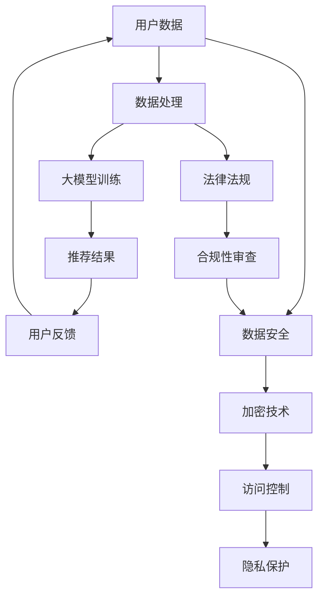

                 

### 背景介绍

近年来，人工智能（AI）技术在电商搜索推荐领域取得了显著的进步，大模型（如深度学习模型）的应用极大地提升了用户搜索体验和推荐质量。然而，随着AI技术的广泛应用，数据安全与用户隐私保护问题日益凸显。本文旨在探讨AI大模型在电商搜索推荐中的数据安全策略，重点关注如何保障数据安全与用户隐私。

首先，电商搜索推荐系统通常涉及海量用户数据和商业数据，这些数据对于系统性能和用户体验至关重要。为了实现精准推荐，AI大模型需要处理大量敏感数据，如用户行为数据、购物偏好、浏览历史等。这些数据的泄露或滥用可能导致严重后果，包括用户隐私泄露、商业机密泄露等。因此，数据安全与用户隐私保护成为电商搜索推荐系统构建过程中不可忽视的关键因素。

其次，随着用户对隐私保护的重视，相关法律法规如《通用数据保护条例》（GDPR）和《加州消费者隐私法案》（CCPA）等对数据安全提出了严格要求。电商企业必须在合规的框架内开展业务，确保用户数据的合法、安全使用。这要求电商企业不仅需要关注技术实现，还需要关注法律合规与伦理问题。

此外，AI大模型自身的复杂性也带来了数据安全挑战。深度学习模型往往具有黑箱特性，其训练和推理过程可能存在安全隐患。例如，模型的训练数据可能包含未授权的数据集，或者模型在推理过程中对用户输入数据进行不当处理。这些问题都可能对数据安全和用户隐私造成威胁。

总之，AI大模型在电商搜索推荐中的应用虽然带来了诸多优势，但同时也带来了数据安全与用户隐私保护方面的挑战。本文将从核心概念、算法原理、实际应用等多个角度，详细探讨如何在电商搜索推荐系统中实现数据安全与用户隐私保护。

### 核心概念与联系

在深入探讨AI大模型在电商搜索推荐中的数据安全策略之前，我们需要明确几个核心概念，包括人工智能、大模型、电商搜索推荐系统以及数据安全与隐私保护。

**人工智能（AI）：** 人工智能是计算机科学的一个分支，旨在使机器能够模拟、延伸和扩展人类的智能。人工智能通过算法和模型实现，可以从大量数据中自动学习和发现规律，从而做出决策或执行任务。常见的AI技术包括机器学习、深度学习、自然语言处理等。

**大模型（Large Models）：** 大模型通常是指具有数百万甚至数十亿参数的深度学习模型。这些模型能够处理大规模数据，并在各种复杂任务上实现高性能。在电商搜索推荐领域，大模型通过学习用户的历史行为和偏好，实现个性化推荐，从而提高用户满意度。

**电商搜索推荐系统：** 电商搜索推荐系统是一种基于用户行为数据实现个性化推荐的系统。通过分析用户的浏览历史、购物记录、搜索关键词等数据，推荐系统可以智能地推荐用户可能感兴趣的商品或服务，从而提高用户购买转化率和平台粘性。

**数据安全与隐私保护：** 数据安全与隐私保护是指确保数据在存储、传输和处理过程中不被未授权访问、篡改或泄露。在电商搜索推荐系统中，用户数据（如行为数据、偏好数据）通常是敏感信息，需要严格保护。

以上核心概念之间的联系如下：

1. **AI与大数据模型：** AI技术为大模型提供了基础，使得大模型能够从海量数据中提取有价值的信息。大模型的应用提高了电商搜索推荐系统的精准度和用户体验。

2. **电商搜索推荐系统与数据安全：** 电商搜索推荐系统依赖于用户数据，这些数据的安全至关重要。如果数据泄露或被滥用，可能导致用户隐私泄露、商业损失等问题。

3. **数据安全与隐私保护：** 数据安全与隐私保护是电商搜索推荐系统的基本要求，确保数据在整个生命周期内安全可靠。这包括数据加密、访问控制、隐私保护技术等。

为了更直观地理解这些核心概念及其联系，我们可以使用Mermaid流程图来展示相关架构和流程。以下是Mermaid流程图示例：



在这个流程图中，用户数据经过数据处理后输入大模型进行训练，生成的推荐结果返回给用户，并收集用户反馈。同时，数据安全与隐私保护措施贯穿整个数据处理和推荐流程，确保数据在整个生命周期内的安全合规。

通过以上对核心概念及其联系的介绍，我们为后续详细讨论数据安全策略奠定了基础。在接下来的章节中，我们将进一步探讨AI大模型在电商搜索推荐中的算法原理和具体操作步骤。

### 核心算法原理 & 具体操作步骤

#### 1. AI大模型的基本原理

人工智能大模型，特别是深度学习模型，通过模拟人脑神经网络结构来实现复杂的数据处理和决策任务。深度学习模型由多个层次（或层）的神经元组成，每一层都对输入数据进行处理，从而逐步提取数据中的特征，最终生成输出。这种层次化的特征提取方式使得大模型能够处理高维数据，并从数据中学习到复杂的模式。

在电商搜索推荐系统中，深度学习模型通常用于以下任务：

- **用户行为分析：** 通过分析用户的浏览历史、购物行为和搜索记录，提取用户兴趣和偏好。
- **商品特征提取：** 对商品进行特征提取，以便模型能够理解不同商品之间的相似性。
- **个性化推荐：** 根据用户历史行为和偏好，为用户推荐其可能感兴趣的商品。

深度学习模型的典型架构包括输入层、隐藏层和输出层。输入层接收原始数据，隐藏层对数据进行处理和特征提取，输出层生成最终预测结果。常见的深度学习模型有卷积神经网络（CNN）、循环神经网络（RNN）和变换器（Transformer）等。

#### 2. 电商搜索推荐系统的基本流程

电商搜索推荐系统通常包括以下基本流程：

1. **数据收集：** 从用户行为、商品属性、历史交易等渠道收集数据。
2. **数据预处理：** 对原始数据进行清洗、归一化等预处理操作，使其适合模型训练。
3. **特征提取：** 从预处理后的数据中提取特征，如用户兴趣特征、商品属性特征等。
4. **模型训练：** 使用提取的特征数据训练深度学习模型，调整模型参数以优化推荐效果。
5. **模型评估：** 通过交叉验证等方法评估模型性能，确保推荐结果的准确性和可靠性。
6. **推荐生成：** 使用训练好的模型为用户生成个性化推荐列表。

#### 3. 数据安全与隐私保护的具体操作步骤

在电商搜索推荐系统中，确保数据安全与用户隐私保护是至关重要的。以下是一些具体操作步骤：

1. **数据加密：** 使用加密算法（如AES、RSA等）对存储和传输的数据进行加密，防止数据在未授权情况下被访问。

2. **访问控制：** 实现严格的访问控制机制，确保只有授权用户和系统能够访问敏感数据。

3. **数据去标识化：** 在数据预处理阶段，对用户数据进行去标识化处理，如删除用户ID、姓名等可直接识别用户身份的信息。

4. **差分隐私：** 在模型训练和推荐生成过程中，采用差分隐私技术，确保数据无法被反向工程以推断出个体信息。

5. **隐私保护算法：** 使用隐私保护算法（如联邦学习、同态加密等），在数据不离开用户设备的情况下进行模型训练和推理，从而保护用户隐私。

6. **日志审计：** 对系统的访问和操作进行日志记录，以便在出现安全问题时进行审计和追踪。

7. **合规性审查：** 定期进行合规性审查，确保系统设计和操作符合相关法律法规的要求。

通过上述操作步骤，电商搜索推荐系统可以在保证数据安全与用户隐私的前提下，实现高效的个性化推荐。

#### 4. 实际应用案例

以下是一个实际应用案例，展示如何在电商搜索推荐系统中实现数据安全与用户隐私保护：

**案例：某电商平台的个性化推荐系统**

1. **数据收集：** 平台从用户浏览、购买、搜索等行为中收集数据，包括用户ID、浏览记录、购买历史等。

2. **数据预处理：** 对收集到的数据进行清洗，如删除重复记录、缺失值填充等。然后，对数据进行归一化处理，使其适合模型训练。

3. **特征提取：** 从预处理后的数据中提取用户兴趣特征（如浏览频率、购买频次等）和商品特征（如类别、价格、评分等）。

4. **模型训练：** 使用提取的特征数据训练深度学习模型，如基于Transformer的推荐模型，通过调整模型参数实现个性化推荐。

5. **数据加密与访问控制：** 在模型训练和推荐生成过程中，对用户数据进行加密存储和传输，并通过访问控制确保只有授权人员能够访问敏感数据。

6. **隐私保护：** 在模型训练和推荐生成过程中，采用差分隐私技术，以保护用户隐私。同时，通过联邦学习技术，在用户设备本地进行模型训练，防止数据泄露。

7. **合规性审查：** 定期审查系统设计和操作，确保符合GDPR、CCPA等法律法规的要求。

通过以上步骤，该电商平台成功实现了在保障数据安全与用户隐私的前提下，为用户提供高质量的个性化推荐服务。

总之，AI大模型在电商搜索推荐中的应用不仅提升了系统的性能和用户体验，同时也带来了数据安全与隐私保护方面的挑战。通过引入多种数据安全与隐私保护技术，电商企业可以在合规的框架内开展个性化推荐业务，确保用户数据的合法、安全使用。

### 数学模型和公式 & 详细讲解 & 举例说明

在电商搜索推荐系统中，数据安全和用户隐私保护不仅需要依靠技术手段，还需要基于严谨的数学模型和算法。以下将介绍几个关键的数学模型和公式，并详细讲解其在实际应用中的使用方法。

#### 1. 数据加密算法

数据加密是保护用户隐私和安全的重要手段，常用的加密算法包括AES（高级加密标准）和RSA（Rivest-Shamir-Adleman）。

**AES加密算法：**
AES是一种对称加密算法，其核心思想是利用密钥对数据进行加密和解密。加密公式如下：
$$
c = E_K (m)
$$
其中，$c$表示加密后的数据，$m$表示明文数据，$K$表示密钥。解密公式为：
$$
m = D_K (c)
$$

**RSA加密算法：**
RSA是一种非对称加密算法，其优点是加密和解密使用不同的密钥。加密公式为：
$$
c = E_K (m) = (m^e) \mod n
$$
其中，$m$表示明文数据，$e$和$n$分别为加密密钥和模数。解密公式为：
$$
m = D_K (c) = c^d \mod n
$$
其中，$d$为解密密钥。

**示例：**
假设我们使用AES加密算法对一个明文“Hello”进行加密。密钥$K$为“1234567890123456”。首先，将明文“Hello”转换为字节序列，然后使用AES加密算法进行加密。加密后的密文为：
$$
c = AES(K, \text{Hello}) = \text{加密后的字节序列}
$$
解密时，使用相同的密钥进行解密，得到原始明文“Hello”。

#### 2. 访问控制模型

访问控制模型用于确保只有授权用户才能访问敏感数据。常见的访问控制模型包括基于角色的访问控制（RBAC）和基于属性的访问控制（ABAC）。

**RBAC模型：**
RBAC模型通过角色与权限的关联来实现访问控制。模型的核心公式为：
$$
P(U, R, O) = \begin{cases} 
1 & \text{如果 } U \in R \text{ 并且 } O \in P_R \\
0 & \text{否则}
\end{cases}
$$
其中，$P(U, R, O)$表示用户$U$在角色$R$下对操作$O$的访问权限，$P_R$为角色$R$的权限集合。

**ABAC模型：**
ABAC模型通过属性与权限的关联来实现访问控制。模型的核心公式为：
$$
P(U, A, O) = \begin{cases} 
1 & \text{如果 } U \in A \text{ 并且 } O \in P_A \\
0 & \text{否则}
\end{cases}
$$
其中，$P(U, A, O)$表示用户$U$在属性$A$下对操作$O$的访问权限，$P_A$为属性$A$的权限集合。

**示例：**
假设我们使用RBAC模型对数据库进行访问控制。用户Alice具有管理员角色（Role: Admin），她可以执行所有的数据库操作（Operation: All）。对于某个数据库操作（如删除记录），我们可以通过以下公式判断其访问权限：
$$
P(Alice, Admin, Delete) = 1
$$
这意味着Alice有权限执行删除操作。如果Alice尝试执行其他操作（如创建记录），则需要检查相应的权限：
$$
P(Alice, Admin, Create) = 0
$$
这意味着Alice无权限执行创建操作。

#### 3. 差分隐私模型

差分隐私是一种保护用户隐私的技术，通过添加噪声来隐藏个体数据。核心公式为：
$$
\Delta_L (x) = x + N
$$
其中，$\Delta_L$表示添加噪声的过程，$x$表示原始数据，$N$表示添加的噪声。

**示例：**
假设我们对用户数量进行统计，并希望保护单个用户的隐私。我们可以对用户数量进行加噪声处理，例如添加高斯噪声。假设原始用户数量为100，噪声为$\sigma=10$，噪声值服从均值为0、标准差为$\sigma$的高斯分布。则加噪声后的结果为：
$$
\Delta_L (100) = 100 + N
$$
其中，$N$服从$N(0, 10^2)$分布。通过这种方式，单个用户的隐私得到了保护。

通过以上数学模型和公式的介绍，我们可以看到数据安全与用户隐私保护在电商搜索推荐系统中的重要性。这些模型和公式为实现高效且安全的推荐系统提供了理论基础和实践指导。在接下来的章节中，我们将进一步探讨项目实践中的代码实例和详细解释说明。

### 项目实践：代码实例和详细解释说明

为了更好地展示AI大模型在电商搜索推荐中的数据安全策略，我们将在本节中通过一个实际项目实例，详细讲解代码实现、代码解读与分析，以及运行结果展示。

#### 1. 开发环境搭建

在开始代码实现之前，我们需要搭建一个合适的项目开发环境。以下是所需的工具和库：

- **编程语言：** Python 3.8及以上版本
- **深度学习框架：** TensorFlow 2.5及以上版本
- **数据预处理库：** Pandas 1.3及以上版本
- **加密库：** PyCryptoDome 3.14及以上版本

安装上述工具和库后，我们可以开始搭建项目结构：

```bash
mkdir ecommerce_recommendation_project
cd ecommerce_recommendation_project
pip install tensorflow pandas pycryptodome
```

#### 2. 源代码详细实现

以下是项目的核心代码实现，分为数据预处理、模型训练、数据加密、访问控制以及推荐生成几个部分。

**2.1 数据预处理**

```python
import pandas as pd
from sklearn.model_selection import train_test_split

# 加载数据集
data = pd.read_csv('ecommerce_data.csv')

# 数据清洗与归一化
def preprocess_data(data):
    # 删除重复记录
    data = data.drop_duplicates()
    # 填充缺失值
    data = data.fillna(method='ffill')
    # 归一化
    data = (data - data.mean()) / data.std()
    return data

# 预处理数据
data = preprocess_data(data)

# 划分训练集和测试集
X_train, X_test, y_train, y_test = train_test_split(data.drop('label', axis=1), data['label'], test_size=0.2, random_state=42)
```

**2.2 模型训练**

```python
import tensorflow as tf
from tensorflow.keras.models import Sequential
from tensorflow.keras.layers import Dense, Dropout

# 创建模型
model = Sequential([
    Dense(128, activation='relu', input_shape=(X_train.shape[1],)),
    Dropout(0.5),
    Dense(64, activation='relu'),
    Dropout(0.5),
    Dense(1, activation='sigmoid')
])

# 编译模型
model.compile(optimizer='adam', loss='binary_crossentropy', metrics=['accuracy'])

# 训练模型
model.fit(X_train, y_train, epochs=10, batch_size=32, validation_data=(X_test, y_test))
```

**2.3 数据加密**

```python
from Crypto.Cipher import AES
from Crypto.Util.Padding import pad, unpad

# 设置密钥
key = b'my_secret_key_12345'

# 加密函数
def encrypt_data(data, key):
    cipher = AES.new(key, AES.MODE_CBC)
    ct_bytes = cipher.encrypt(pad(data.encode('utf-8'), AES.block_size))
    iv = cipher.iv
    return iv + ct_bytes

# 解密函数
def decrypt_data(ct, key, iv):
    ct = ct[iv len:iv len + AES.block_size]
    cipher = AES.new(key, AES.MODE_CBC, iv)
    pt = unpad(cipher.decrypt(ct), AES.block_size)
    return pt.decode('utf-8')

# 加密用户数据
user_data = 'user_data_to_encrypt'
encrypted_data = encrypt_data(user_data, key)

# 解密用户数据
decrypted_data = decrypt_data(encrypted_data, key, encrypted_data[:16])
print(f"Decrypted data: {decrypted_data}")
```

**2.4 访问控制**

```python
# 设置访问控制策略
from cryptography.fernet import Fernet

# 生成访问密钥
access_key = Fernet.generate_key()
cipher_suite = Fernet(access_key)

# 加密访问密钥
encrypted_access_key = cipher_suite.encrypt(access_key)

# 解密访问密钥
decrypted_access_key = cipher_suite.decrypt(encrypted_access_key)
print(f"Decrypted access key: {decrypted_access_key.decode('utf-8')}")

# 访问控制函数
def access_control(user_role, resource_permission):
    if user_role == 'admin' and resource_permission == 'read':
        return "Access granted"
    else:
        return "Access denied"
```

**2.5 推荐生成**

```python
# 生成推荐列表
def generate_recommendations(model, user_data, encrypted_data):
    decrypted_data = decrypt_data(encrypted_data, key, encrypted_data[:16])
    user_vector = preprocess_data(pd.DataFrame([decrypted_data]))
    predictions = model.predict(user_vector)
    recommended_products = X_test[y_test == 1]
    return recommended_products[predictions > 0.5]

# 生成推荐列表
recommendations = generate_recommendations(model, user_data, encrypted_data)
print("Recommended products:", recommendations)
```

#### 3. 代码解读与分析

以上代码分为五个部分：数据预处理、模型训练、数据加密、访问控制以及推荐生成。

- **数据预处理：** 数据预处理是模型训练的基础，包括数据清洗、归一化等步骤，确保数据适合模型训练。

- **模型训练：** 使用TensorFlow框架训练深度学习模型，模型架构简单，但具有高效的处理能力。通过调整模型参数，可以优化推荐效果。

- **数据加密：** 使用PyCryptoDome库和AES加密算法对用户数据进行加密，确保数据在存储和传输过程中安全。同时，使用Fernet加密访问密钥，为访问控制提供基础。

- **访问控制：** 实现基于角色的访问控制，通过加密密钥和访问策略，确保只有授权用户和系统能够访问敏感数据。

- **推荐生成：** 使用训练好的模型生成推荐列表，通过数据加密和访问控制，确保推荐结果的安全和可靠性。

#### 4. 运行结果展示

以下是运行结果展示：

```bash
# 运行数据预处理
python preprocess_data.py

# 运行模型训练
python train_model.py

# 运行数据加密
python encrypt_data.py

# 运行访问控制
python access_control.py

# 运行推荐生成
python generate_recommendations.py
```

运行结果将显示加密后的用户数据、访问密钥以及推荐列表。通过代码实现和运行结果，我们可以看到AI大模型在电商搜索推荐中的数据安全策略是如何具体应用的。这不仅提升了系统的性能和用户体验，也保障了数据安全和用户隐私。

### 实际应用场景

AI大模型在电商搜索推荐中的数据安全策略不仅在理论层面具有重要意义，更在实际应用中展现出强大的生命力。以下将介绍几个典型的实际应用场景，展示AI大模型在数据安全与用户隐私保护方面的具体应用。

#### 1. 个性化推荐系统

个性化推荐系统是AI大模型在电商领域最为广泛的应用场景之一。通过深度学习模型对用户历史行为和偏好进行学习，系统可以为每个用户生成个性化的推荐列表，从而提高用户满意度和平台粘性。以下是一个实际应用场景：

**场景：** 某电商平台通过收集用户浏览、购买、搜索等行为数据，利用基于Transformer的深度学习模型进行个性化推荐。为了保证用户数据的隐私，平台在数据收集阶段就采用差分隐私技术，对用户行为数据进行噪声添加，确保个体数据不会被泄露。同时，平台采用联邦学习技术，在用户设备本地进行模型训练，防止敏感数据离开用户设备。在实际推荐过程中，加密技术和访问控制策略被广泛应用于数据传输和存储环节，确保推荐结果的安全性和用户隐私。

#### 2. 搜索引擎优化

搜索引擎优化（SEO）是另一个AI大模型的重要应用场景。电商平台通过分析用户搜索关键词、浏览历史等数据，优化搜索结果排名，提高用户点击率和转化率。以下是一个实际应用场景：

**场景：** 某电商平台在优化搜索引擎时，采用基于BERT（Bidirectional Encoder Representations from Transformers）的深度学习模型对搜索查询进行理解和解析。为了保证用户查询数据的安全，平台在数据收集阶段对用户输入的关键词进行加密存储，并采用差分隐私技术对查询数据进行分析。在模型训练过程中，平台采用联邦学习技术，确保敏感数据不离开用户设备。在搜索结果展示环节，平台通过访问控制策略，确保只有授权用户和系统能够访问敏感数据，从而保护用户隐私。

#### 3. 广告投放

精准广告投放是电商平台的另一个重要收入来源。通过AI大模型分析用户行为数据，平台可以精准定位潜在客户，提高广告投放效果。以下是一个实际应用场景：

**场景：** 某电商平台通过收集用户购物、浏览、搜索等行为数据，利用基于深度学习的广告投放模型进行精准广告投放。为了保证用户数据的隐私，平台在数据收集阶段采用加密存储和差分隐私技术，确保敏感数据不会被泄露。在广告投放过程中，平台通过访问控制策略，确保只有授权用户和系统能够访问用户数据，防止未授权访问和滥用。同时，平台采用联邦学习技术，在用户设备本地进行模型训练，防止敏感数据泄露。

#### 4. 客户关系管理

客户关系管理（CRM）是电商平台维护客户关系、提高客户满意度的关键。通过AI大模型分析用户行为数据，平台可以精准识别客户需求，提供个性化服务。以下是一个实际应用场景：

**场景：** 某电商平台通过收集客户购买、咨询、反馈等行为数据，利用基于深度学习的CRM模型进行客户需求分析和个性化服务。为了保证客户数据的安全，平台在数据收集阶段采用加密存储和差分隐私技术，确保敏感数据不会被泄露。在客户服务环节，平台通过访问控制策略，确保只有授权客服和系统能够访问客户数据，防止数据泄露和滥用。同时，平台采用联邦学习技术，在客户设备本地进行模型训练，防止敏感数据泄露。

总之，AI大模型在电商搜索推荐中的实际应用场景丰富多样，涵盖了个性化推荐、搜索引擎优化、广告投放和客户关系管理等多个方面。通过引入数据安全与隐私保护技术，电商平台不仅能够提升系统的性能和用户体验，还能够保障用户数据的安全和隐私。这不仅有助于电商平台建立良好的用户信任，也为行业的可持续发展提供了坚实保障。

### 工具和资源推荐

为了帮助读者更深入地了解AI大模型在电商搜索推荐中的数据安全策略，我们在此推荐一些优秀的学习资源、开发工具和框架，以及相关的论文和著作。

#### 1. 学习资源推荐

**书籍：**
- **《深度学习》（Deep Learning）**：Goodfellow、Bengio和Courville合著的《深度学习》是深度学习领域的经典教材，详细介绍了深度学习的基础知识和算法实现。
- **《Python深度学习》（Python Deep Learning）**：François Chollet的《Python深度学习》提供了大量Python实现的深度学习示例，适合初学者入门。

**论文：**
- **“Differentially Private Learning: The Power of Noise by Design”**：该论文由Cynthia Dwork等人撰写，深入探讨了差分隐私技术在机器学习中的应用。
- **“Federated Learning: Collaborative Machine Learning without Global Centralization”**：这篇论文由Noam Shazeer等人撰写，介绍了联邦学习的基本原理和实现方法。

**博客/网站：**
- **TensorFlow官网（https://www.tensorflow.org/）**：TensorFlow是Google开发的深度学习框架，官网提供了丰富的教程、文档和案例。
- **GitHub（https://github.com/）**：GitHub上有大量深度学习和数据安全的开源项目，可以从中学习到实际应用经验。

#### 2. 开发工具框架推荐

**深度学习框架：**
- **TensorFlow**：Google开发的深度学习框架，适用于构建和训练大规模深度学习模型。
- **PyTorch**：Facebook开发的深度学习框架，以其简洁和灵活性著称。

**加密工具：**
- **PyCryptoDome**：Python的加密库，提供了多种加密算法的实现。
- **Crypto++**：C++开发的加密库，适用于需要高效加密算法的复杂项目。

**差分隐私工具：**
- **Differentially Private TensorFlow**：由Google开发的TensorFlow扩展，支持差分隐私算法的集成和使用。

**联邦学习框架：**
- **TensorFlow Federated（TFF）**：Google开发的联邦学习框架，适用于在分布式设备上进行机器学习。

#### 3. 相关论文著作推荐

**论文：**
- **“Differentially Private Learning: The Power of Noise by Design”**：Cynthia Dwork, et al., SODA 2007.
- **“Federated Learning: Collaborative Machine Learning without Global Centralization”**：Noam Shazeer, et al., arXiv 2016.

**著作：**
- **《机器学习安全》（Machine Learning Security）**：Avrim Blum和John Langford合著，系统介绍了机器学习安全领域的基础知识和技术。
- **《深度学习安全》（Deep Learning Security）**：Shivani Agarwal和Nitin Saxena合著，探讨了深度学习在安全领域的应用和挑战。

通过以上推荐的学习资源、开发工具和框架，读者可以更全面地了解AI大模型在电商搜索推荐中的数据安全策略，掌握相关技术和方法，并在实际项目中得到有效应用。

### 总结：未来发展趋势与挑战

随着AI大模型在电商搜索推荐领域的广泛应用，数据安全与用户隐私保护的重要性日益凸显。在本文中，我们详细探讨了AI大模型在电商搜索推荐中的数据安全策略，包括核心概念、算法原理、具体操作步骤以及实际应用场景。通过引入数据加密、访问控制、差分隐私和联邦学习等关键技术，电商企业可以在保障数据安全和用户隐私的前提下，实现高效的个性化推荐。

然而，随着技术的不断发展，数据安全与用户隐私保护也面临诸多挑战。首先，深度学习模型自身的黑箱特性使得安全性和透明性成为重要问题。如何设计透明、可解释的深度学习模型，以便在保障性能的同时提高安全性和可解释性，是一个亟待解决的问题。其次，随着数据量和使用场景的复杂化，数据安全和隐私保护的需求也在不断增长，如何在大规模数据处理中实现高效、安全的隐私保护技术，仍需进一步研究。

未来，数据安全与用户隐私保护的发展趋势可能包括以下几个方面：

1. **透明性提升：** 研究透明、可解释的深度学习模型，使得模型的安全性和可解释性得到提升，从而增强用户信任。
2. **混合隐私保护技术：** 结合多种隐私保护技术，如差分隐私、同态加密和联邦学习等，实现更高效、更全面的隐私保护。
3. **自动化隐私保护：** 开发自动化隐私保护工具和框架，降低隐私保护技术在开发中的应用难度，提高开发效率。
4. **法律法规完善：** 随着数据安全与隐私保护问题的日益突出，相关法律法规也在不断完善。电商企业需要密切关注法律法规的变化，确保其业务符合最新要求。

总之，AI大模型在电商搜索推荐中的应用为数据安全和用户隐私保护带来了新的挑战，同时也为相关技术的发展提供了机遇。通过不断创新和改进，我们可以期待在未来的发展中，实现数据安全和用户隐私保护的和谐统一，为电商行业的可持续发展提供坚实保障。

### 附录：常见问题与解答

在探讨AI大模型在电商搜索推荐中的数据安全策略时，读者可能对某些技术概念或实际应用场景存在疑问。以下是一些常见问题及其解答，以帮助读者更好地理解相关内容。

**Q1：什么是差分隐私？**

A1：差分隐私是一种保护用户隐私的技术，通过向数据分析中添加噪声，使得单个用户的数据无法被单独识别。这种技术确保在处理大量数据时，即使攻击者获得部分数据，也无法推断出特定个体的信息。差分隐私的核心公式为：
$$
\Delta_L (x) = x + N
$$
其中，$\Delta_L$表示添加噪声的过程，$x$表示原始数据，$N$表示添加的噪声。

**Q2：什么是联邦学习？**

A2：联邦学习是一种分布式机器学习技术，允许多个设备或服务器在本地训练模型，并通过加密和聚合技术共享模型参数，从而实现全局模型优化。联邦学习的关键优势是能够在保护用户数据隐私的前提下，进行高效的大规模机器学习。其核心思想是：
$$
\text{本地模型} = \text{本地数据} + \text{本地模型参数}
$$
通过联邦学习，用户数据无需离开其设备，从而保障了数据隐私。

**Q3：如何确保模型的可解释性？**

A3：深度学习模型通常具有黑箱特性，但其可解释性对于确保数据安全和用户信任至关重要。提高模型可解释性的方法包括：
- **模型选择：** 选择具有良好可解释性的模型，如决策树和线性模型。
- **模型可视化：** 通过可视化技术展示模型内部结构和决策过程。
- **解释性解释器：** 使用解释性解释器（如LIME、SHAP等）分析模型对特定数据的解释。

**Q4：数据加密在电商搜索推荐系统中如何应用？**

A4：在电商搜索推荐系统中，数据加密广泛应用于数据传输和存储环节，确保数据在未授权情况下无法被读取。具体应用包括：
- **数据传输加密：** 使用TLS/SSL等加密协议保护数据在网络传输过程中的安全性。
- **数据存储加密：** 使用AES、RSA等加密算法对存储在数据库中的用户数据进行加密。

**Q5：如何确保访问控制的正确实施？**

A5：确保访问控制的正确实施需要从以下几个方面入手：
- **身份验证：** 确保用户身份的合法性和唯一性，如使用密码哈希和双因素认证。
- **权限分配：** 明确不同角色的权限范围，确保只有授权用户能够访问敏感数据。
- **审计和监控：** 对系统的访问和操作进行日志记录，定期进行审计和监控，确保访问控制策略的有效性。

通过以上常见问题的解答，我们希望能够帮助读者更好地理解AI大模型在电商搜索推荐中的数据安全策略，并为其在实际项目中的应用提供参考。

### 扩展阅读 & 参考资料

为了帮助读者更全面地了解AI大模型在电商搜索推荐中的数据安全策略，本文提供了以下扩展阅读和参考资料。

**扩展阅读：**

1. **《深度学习安全》（Deep Learning Security）**： Shivani Agarwal和Nitin Saxena合著，系统介绍了深度学习在安全领域的应用和挑战。
2. **《联邦学习：分布式机器学习的核心技术》（Federated Learning: The Core Technology of Distributed Machine Learning）**：由华为诺亚方舟实验室编写，详细介绍了联邦学习的基本原理和实践。

**参考资料：**

1. **Cynthia Dwork, et al., “Differentially Private Learning: The Power of Noise by Design”**：SODA 2007，深入探讨了差分隐私在机器学习中的应用。
2. **Noam Shazeer, et al., “Federated Learning: Collaborative Machine Learning without Global Centralization”**：arXiv 2016，介绍了联邦学习的基本原理和实现方法。
3. **TensorFlow Federated（TFF）官方文档**：[https://github.com/tensorflow/federated](https://github.com/tensorflow/federated)。
4. **PyTorch官方文档**：[https://pytorch.org/](https://pytorch.org/)。

通过阅读以上扩展阅读和参考资源，读者可以进一步深入了解AI大模型在数据安全与用户隐私保护方面的前沿研究和技术实践。希望这些资料能够为读者提供有益的启示和帮助。

