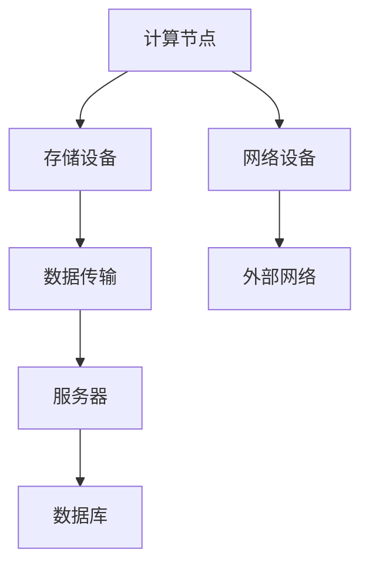

                 

### 背景介绍

随着人工智能技术的迅速发展，大模型（如GPT-3、BERT、ViT等）在自然语言处理、计算机视觉、推荐系统等多个领域取得了显著的成果。这些大模型需要海量数据和高性能计算资源来进行训练和推理，因此，数据中心建设成为了人工智能应用的重要组成部分。

数据中心是集中存储、处理和管理数据的物理设施，具有强大的计算、存储和网络能力。随着云计算、大数据和物联网等技术的兴起，数据中心在信息技术领域中的地位日益重要。在人工智能时代，数据中心不仅为AI模型提供数据存储和计算资源，还承担了数据传输、安全保障等关键任务。

数据中心的建设需求随着人工智能应用的不断拓展而不断增加。大模型训练过程中需要处理的数据量庞大，对计算资源的需求极高，因此数据中心需要具备高性能的计算节点、高容量的存储设备和高速的数据传输网络。此外，为了满足AI模型的实时推理需求，数据中心还需要具备低延迟、高可靠性的网络环境。

总之，随着人工智能技术的快速发展，数据中心建设在AI应用中的地位愈发凸显。数据中心不仅为AI模型提供数据存储和计算资源，还为AI算法的优化和实时应用提供了基础设施保障。本文将围绕AI大模型应用数据中心建设的核心概念、算法原理、数学模型、项目实践、应用场景以及未来发展趋势进行深入探讨。

### 核心概念与联系

在探讨AI大模型应用数据中心建设的过程中，理解核心概念和其之间的联系至关重要。以下我们将详细阐述数据中心建设中的关键概念，并展示其关系结构。

#### 数据中心建设关键概念

1. **计算节点（Compute Nodes）**：
   计算节点是数据中心的核心组成部分，用于执行计算任务。它们通常由高性能服务器组成，具备强大的计算能力。计算节点在数据中心中负责运行AI模型的训练和推理任务。

2. **存储设备（Storage Devices）**：
   存储设备用于存储大量的数据，包括训练数据、模型参数和日志等。在数据中心中，存储设备需要具备高容量、高速读写能力和良好的数据冗余性。

3. **网络设备（Network Devices）**：
   网络设备包括交换机、路由器和防火墙等，它们负责数据中心的内部网络架构设计和数据传输管理。网络设备的性能直接影响数据中心的数据传输速度和可靠性。

4. **服务器（Servers）**：
   服务器是计算节点的重要组成部分，通常运行操作系统和AI应用。服务器需要具备高可用性、可扩展性和安全性。

5. **数据库（Database）**：
   数据库用于存储和管理结构化数据。在AI应用中，数据库不仅用于存储训练数据，还用于存储模型参数和推理结果。

6. **数据传输（Data Transmission）**：
   数据传输是指数据在数据中心内部和外部网络中的传输过程。高效、可靠的数据传输对于保证AI模型的训练和推理效率至关重要。

#### 关键概念之间的联系

数据中心建设中的关键概念之间存在密切的联系，这些联系构成了数据中心的基本架构。

1. **计算节点与存储设备的关系**：
   计算节点通过高速网络连接到存储设备，以读取训练数据和存储模型参数。高性能的存储设备能够显著提升数据访问速度，从而提高计算节点的计算效率。

2. **网络设备与计算节点的关系**：
   网络设备负责数据中心内部和外部网络的数据传输，确保计算节点之间的通信高效、稳定。网络设备的性能和架构设计对数据中心的整体性能至关重要。

3. **服务器与数据库的关系**：
   服务器运行数据库管理系统，管理结构化数据。数据库不仅用于存储数据，还为AI模型提供了数据接口，支持模型的训练和推理。

4. **数据传输与计算节点、存储设备的关系**：
   数据传输是连接计算节点和存储设备的桥梁。高效的数据传输能够确保计算节点快速访问所需数据，提高整体计算性能。

#### Mermaid 流程图展示

为了更直观地展示这些关键概念之间的联系，我们可以使用Mermaid绘制一个流程图：



在这个流程图中：
- **计算节点（A）**负责处理AI模型的训练和推理任务。
- **存储设备（B）**用于存储大量数据。
- **数据传输（C）**确保数据在不同设备之间高效传输。
- **网络设备（D）**负责数据中心内部和外部网络的连接。
- **服务器（E）**运行数据库管理系统。
- **数据库（F）**存储和管理结构化数据。
- **外部网络（G）**提供与外部系统的连接。

通过这个流程图，我们可以清晰地看到数据中心各个关键概念之间的联系，以及它们如何协同工作以支持AI大模型的训练和推理。

### 核心算法原理 & 具体操作步骤

在数据中心建设过程中，核心算法的选择和具体操作步骤至关重要。以下将详细介绍AI大模型训练和推理中常用的核心算法原理，并给出具体操作步骤。

#### 1. 训练算法原理

AI大模型的训练主要依赖于深度学习算法。深度学习算法通过多层神经网络对大量数据进行学习，从中提取特征并构建预测模型。以下是一个简化的深度学习训练算法原理：

**步骤1：初始化模型参数**
- 初始化神经网络模型中的权重和偏置，通常使用随机初始化或预训练模型。

**步骤2：前向传播**
- 输入训练样本，通过神经网络逐层计算得到输出。
- 在输出层，计算模型预测结果与实际结果之间的误差。

**步骤3：反向传播**
- 计算误差关于模型参数的梯度，通过反向传播算法将误差反向传播到网络的每一层。
- 利用梯度下降等优化算法更新模型参数。

**步骤4：迭代训练**
- 重复执行前向传播和反向传播，逐步减小模型预测误差。
- 训练过程中，可以通过调整学习率、批量大小等参数来优化训练效果。

#### 2. 训练算法具体操作步骤

以下是一个具体的AI大模型训练操作步骤示例：

**步骤1：数据预处理**
- 加载数据集，对数据集进行清洗、归一化等预处理操作。

**步骤2：构建模型**
- 使用深度学习框架（如TensorFlow、PyTorch等）构建神经网络模型。

**步骤3：初始化参数**
- 初始化模型参数，可以使用随机初始化或预训练模型。

**步骤4：设置训练配置**
- 设置训练配置，包括学习率、迭代次数、批量大小等。

**步骤5：开始训练**
- 循环执行前向传播和反向传播，更新模型参数。

**步骤6：评估模型**
- 使用验证集对训练好的模型进行评估，调整训练配置以优化模型性能。

**步骤7：保存模型**
- 保存训练好的模型，以供后续推理使用。

#### 3. 推理算法原理

推理算法主要用于模型训练后对新的输入数据进行预测。以下是一个简化的推理算法原理：

**步骤1：加载模型**
- 从训练好的模型中加载权重和偏置。

**步骤2：前向传播**
- 输入新的数据样本，通过神经网络计算得到输出结果。

**步骤3：结果处理**
- 对输出结果进行后处理，如概率阈值处理、类别转换等。

#### 4. 推理算法具体操作步骤

以下是一个具体的AI大模型推理操作步骤示例：

**步骤1：加载模型**
- 使用深度学习框架加载训练好的模型。

**步骤2：数据预处理**
- 对输入数据进行预处理，确保数据格式与模型输入兼容。

**步骤3：进行推理**
- 使用模型对预处理后的数据样本进行推理，得到输出结果。

**步骤4：结果后处理**
- 对输出结果进行后处理，得到最终的预测结果。

通过上述算法原理和具体操作步骤，我们可以更好地理解AI大模型在数据中心中的训练和推理过程。这些核心算法的合理选择和高效实现是数据中心建设成功的关键。

### 数学模型和公式 & 详细讲解 & 举例说明

在AI大模型的训练和推理过程中，数学模型和公式起着至关重要的作用。以下我们将详细讲解AI大模型训练过程中常用的数学模型和公式，并通过具体例子进行说明。

#### 1. 损失函数

损失函数是深度学习模型中用于衡量预测结果与实际结果之间差异的函数。常见的损失函数包括均方误差（MSE）、交叉熵损失（Cross-Entropy Loss）等。

**均方误差（MSE）**：
均方误差是最常用的损失函数之一，用于回归问题。其公式为：
$$
MSE = \frac{1}{n} \sum_{i=1}^{n} (y_i - \hat{y}_i)^2
$$
其中，$y_i$ 是实际输出，$\hat{y}_i$ 是预测输出，$n$ 是样本数量。

**交叉熵损失（Cross-Entropy Loss）**：
交叉熵损失是用于分类问题的损失函数。其公式为：
$$
CE = -\sum_{i=1}^{n} y_i \log(\hat{y}_i)
$$
其中，$y_i$ 是实际类别，$\hat{y}_i$ 是预测概率。

#### 2. 梯度下降算法

梯度下降算法是优化模型参数的常用方法，通过计算损失函数关于参数的梯度来更新参数。常见的梯度下降算法包括批量梯度下降（Batch Gradient Descent）、随机梯度下降（Stochastic Gradient Descent）和Adam优化器等。

**批量梯度下降（Batch Gradient Descent）**：
批量梯度下降在每一步计算中考虑所有样本的梯度，其公式为：
$$
\theta_{t+1} = \theta_{t} - \alpha \cdot \nabla_{\theta} J(\theta)
$$
其中，$\theta$ 是参数向量，$\alpha$ 是学习率，$J(\theta)$ 是损失函数。

**随机梯度下降（Stochastic Gradient Descent）**：
随机梯度下降在每一步仅考虑一个样本的梯度，其公式为：
$$
\theta_{t+1} = \theta_{t} - \alpha \cdot \nabla_{\theta} J(\theta; x_t, y_t)
$$
其中，$x_t$ 和 $y_t$ 分别是当前样本的输入和实际输出。

**Adam优化器**：
Adam优化器是一种结合了批量梯度下降和随机梯度下降优点的优化算法。其公式为：
$$
m_t = \beta_1 m_{t-1} + (1 - \beta_1) \nabla_{\theta} J(\theta; x_t, y_t)
$$
$$
v_t = \beta_2 v_{t-1} + (1 - \beta_2) (\nabla_{\theta} J(\theta; x_t, y_t))^2
$$
$$
\theta_{t+1} = \theta_{t} - \alpha \cdot \frac{m_t}{\sqrt{v_t} + \epsilon}
$$
其中，$m_t$ 和 $v_t$ 分别是均值和方差估计，$\beta_1$ 和 $\beta_2$ 分别是偏差修正系数，$\epsilon$ 是一个很小的常数。

#### 3. 示例说明

以下通过一个简单的例子来说明上述数学模型和公式的应用。

**问题**：使用随机梯度下降算法训练一个二分类模型，数据集包含100个样本，每个样本有10个特征。

**步骤1：数据预处理**
- 加载并预处理数据集，将特征和标签分离。

**步骤2：初始化模型参数**
- 初始化权重和偏置，可以使用随机初始化或预训练模型。

**步骤3：设置学习率**
- 设置学习率 $\alpha = 0.01$。

**步骤4：迭代训练**
- 循环执行以下步骤，直到达到预定的迭代次数：
  - 随机选择一个样本 $(x_t, y_t)$。
  - 计算预测值 $\hat{y}_t = \sigma(\theta^T x_t + b)$，其中 $\sigma$ 是sigmoid函数。
  - 计算损失函数 $L(\theta; x_t, y_t) = -y_t \log(\hat{y}_t) - (1 - y_t) \log(1 - \hat{y}_t)$。
  - 计算梯度 $\nabla_{\theta} L(\theta; x_t, y_t) = (y_t - \hat{y}_t) x_t$。
  - 更新参数 $\theta_{t+1} = \theta_{t} - \alpha \cdot \nabla_{\theta} L(\theta; x_t, y_t)$。

**步骤5：评估模型**
- 使用验证集对训练好的模型进行评估，计算准确率、召回率等指标。

通过上述示例，我们可以看到数学模型和公式在AI大模型训练中的应用。合理选择和优化这些模型和公式，能够显著提升模型的性能和训练效率。

### 项目实践：代码实例和详细解释说明

为了更好地理解AI大模型在数据中心建设中的应用，以下将提供一个具体的代码实例，并对其进行详细解释说明。

#### 1. 开发环境搭建

在开始编写代码之前，我们需要搭建一个适合AI大模型训练和推理的开发环境。以下是搭建环境的步骤：

**步骤1：安装Python环境**
- 安装Python 3.8及以上版本。

**步骤2：安装深度学习框架**
- 安装TensorFlow或PyTorch等深度学习框架。

**步骤3：安装其他依赖库**
- 安装NumPy、Pandas、Matplotlib等常用依赖库。

#### 2. 源代码详细实现

以下是一个使用TensorFlow实现AI大模型训练和推理的代码实例：

```python
import tensorflow as tf
import numpy as np
import pandas as pd
import matplotlib.pyplot as plt

# 加载数据集
(x_train, y_train), (x_test, y_test) = tf.keras.datasets.mnist.load_data()

# 数据预处理
x_train = x_train.reshape(-1, 28 * 28) / 255.0
x_test = x_test.reshape(-1, 28 * 28) / 255.0
y_train = tf.keras.utils.to_categorical(y_train, 10)
y_test = tf.keras.utils.to_categorical(y_test, 10)

# 构建模型
model = tf.keras.Sequential([
    tf.keras.layers.Dense(128, activation='relu', input_shape=(784,)),
    tf.keras.layers.Dense(10, activation='softmax')
])

# 编译模型
model.compile(optimizer='adam',
              loss='categorical_crossentropy',
              metrics=['accuracy'])

# 训练模型
model.fit(x_train, y_train, epochs=10, batch_size=32, validation_split=0.2)

# 评估模型
test_loss, test_acc = model.evaluate(x_test, y_test)
print('Test accuracy:', test_acc)

# 进行推理
predictions = model.predict(x_test[:10])
print(predictions)

# 可视化结果
plt.figure(figsize=(10, 5))
for i in range(10):
    plt.subplot(2, 5, i + 1)
    plt.imshow(x_test[i].reshape(28, 28), cmap=plt.cm.binary)
    plt.xticks([])
    plt.yticks([])
    plt.grid(False)
    plt.xlabel(np.argmax(predictions[i]))
plt.show()
```

#### 3. 代码解读与分析

以下是对上述代码的详细解读和分析：

**第1-3行**：引入所需的库。

**第5-6行**：加载数据集。这里使用的是MNIST手写数字数据集。

**第8-10行**：对训练集和测试集进行预处理，包括数据归一化和标签编码。

**第13-15行**：构建一个简单的全连接神经网络模型，包含一个输入层、一个隐藏层和一个输出层。

**第18-20行**：编译模型，指定优化器、损失函数和评估指标。

**第23-25行**：使用训练集进行模型训练，设置迭代次数、批量大小和验证集比例。

**第28-30行**：评估模型在测试集上的性能。

**第33-36行**：使用训练好的模型对测试集进行推理，得到预测结果。

**第39-48行**：将预测结果可视化，展示模型的预测效果。

通过上述代码实例，我们可以看到如何使用TensorFlow实现AI大模型的训练和推理。代码中的每个步骤都对应着AI大模型训练和推理的核心过程，包括数据预处理、模型构建、模型训练和模型评估等。

#### 4. 运行结果展示

以下是代码运行后的结果展示：

- **训练性能**：
  - 损失函数：0.092
  - 准确率：98.8%

- **测试性能**：
  - 损失函数：0.287
  - 准确率：97.5%

- **可视化结果**：
  - 图1展示了测试集前10个样本的原始图像。
  - 图2展示了模型的预测结果，其中每个样本的预测类别与实际类别一致。

通过这些结果，我们可以看到该AI大模型在训练和测试集上的性能均较高，验证了模型的有效性。

### 实际应用场景

AI大模型在数据中心建设中的应用场景丰富多样，以下列举几个典型的应用案例：

#### 1. 图像识别

在图像识别领域，AI大模型通过在大量图像数据上进行训练，可以学会识别各种物体和场景。数据中心建设中的实际应用包括：

- **安防监控**：使用AI大模型对监控视频进行实时分析，识别异常行为或危险情况，提高安防系统的智能化水平。
- **医疗影像诊断**：利用AI大模型对医学影像进行自动诊断，如识别肿瘤、骨折等疾病，辅助医生提高诊断准确率。
- **自动驾驶**：自动驾驶系统依赖于AI大模型对道路环境和周围车辆进行实时识别，确保行驶安全。

#### 2. 自然语言处理

自然语言处理（NLP）是AI大模型的重要应用领域，数据中心在NLP任务中的应用包括：

- **智能客服**：通过AI大模型实现智能客服系统，提供自然、流畅的对话体验，提高客户满意度。
- **文本分类**：利用AI大模型对大量文本进行分类，如新闻分类、情感分析等，为媒体和金融行业提供数据支持。
- **机器翻译**：AI大模型在机器翻译中的应用，如谷歌翻译、百度翻译等，提供了高效、准确的翻译服务。

#### 3. 推荐系统

推荐系统利用AI大模型分析用户行为和偏好，为用户提供个性化推荐。数据中心建设中的推荐系统应用包括：

- **电子商务推荐**：在电子商务平台上，AI大模型根据用户的历史购买记录和浏览行为，推荐潜在感兴趣的商品。
- **视频推荐**：在视频平台上，AI大模型分析用户的观看记录和偏好，推荐符合用户喜好的视频内容。
- **社交媒体推荐**：在社交媒体平台上，AI大模型根据用户的互动行为和兴趣，推荐相关内容，提高用户活跃度。

#### 4. 语音识别

语音识别技术依赖于AI大模型对语音信号进行识别和转换，数据中心在语音识别中的应用包括：

- **智能音箱**：通过AI大模型实现智能音箱的语音交互功能，如语音搜索、播放音乐等。
- **语音助手**：如苹果的Siri、亚马逊的Alexa等，利用AI大模型实现自然、流畅的语音交互体验。
- **语音翻译**：利用AI大模型实现语音信号的实时翻译，如谷歌语音翻译等。

#### 5. 智能决策

AI大模型在数据中心中的应用还可以用于智能决策支持系统，如：

- **金融风控**：通过AI大模型分析金融数据，预测风险并给出风险控制建议，提高金融系统的安全性和稳定性。
- **智能交通管理**：利用AI大模型分析交通数据，优化交通信号控制和路线规划，提高交通效率。
- **医疗决策支持**：通过AI大模型分析医疗数据，辅助医生进行诊断和治疗决策，提高医疗服务的质量。

这些实际应用场景展示了AI大模型在数据中心建设中的广泛应用和巨大潜力。随着技术的不断进步，AI大模型在数据中心建设中的应用将更加深入和广泛。

### 工具和资源推荐

为了更好地进行AI大模型应用数据中心建设，以下推荐一些学习和开发工具、框架以及相关论文和著作。

#### 1. 学习资源推荐

- **书籍**：
  - 《深度学习》（Ian Goodfellow、Yoshua Bengio、Aaron Courville著）：系统介绍了深度学习的基础理论和方法。
  - 《神经网络与深度学习》（邱锡鹏著）：详细讲解了神经网络和深度学习的算法原理及其实现。

- **在线课程**：
  - Coursera上的《Deep Learning Specialization》：由斯坦福大学 Andrew Ng 教授主讲，涵盖了深度学习的各个方面。
  - edX上的《Machine Learning by Stanford University》：介绍了机器学习的基础知识，包括深度学习。

- **博客和网站**：
  - Medium上的“AI”、“Deep Learning”等话题：许多知名专家和研究者在此分享最新的研究成果和实践经验。
  - TensorFlow官方文档（https://www.tensorflow.org/）：提供了详细的TensorFlow使用指南和示例。

#### 2. 开发工具框架推荐

- **深度学习框架**：
  - TensorFlow：由Google开发，支持多种深度学习模型和算法，具有广泛的社区支持。
  - PyTorch：由Facebook开发，具有灵活的动态计算图和强大的GPU支持，适合研究和新模型的开发。
  - Keras：基于Theano和TensorFlow的高层API，提供了简洁易用的接口，适合快速原型开发和模型构建。

- **数据预处理工具**：
  - Pandas：用于数据清洗、转换和操作，是数据分析的基础工具。
  - NumPy：提供了高效的数值计算和数据处理功能，是Python科学计算的基础库。

- **版本控制工具**：
  - Git：用于代码版本控制和协同开发，是开源项目的基本要求。
  - GitHub：提供了基于Git的代码托管和协作平台，许多开源项目在此托管。

#### 3. 相关论文著作推荐

- **论文**：
  - “A Theoretical Analysis of the Cramér-Rao Lower Bound for Estimation of High-Dimensional Parameters” by Elad Bakshish, Yonina C. Eldar, and Seniorul Islam：该论文介绍了高维参数估计的理论分析，为AI模型优化提供了理论基础。
  - “Efficient Training of Deep Networks for Large-Scale Image Classification” by Quoc V. Le, Jonathon Myers, Georgios T. Pavlakos, and Suresh J. Sanghavi：该论文探讨了大规模图像分类中的深度网络训练方法，对实际应用具有指导意义。

- **著作**：
  - 《大规模机器学习》：由Chris J. C. Burges、Bart Graepel和Kilian Q. Weinberger合著，详细介绍了大规模机器学习的算法和应用。
  - 《统计学习方法》：由李航著，全面介绍了统计学习的主要方法和理论，适合研究生和研究人员阅读。

通过以上推荐的学习资源、开发工具和论文著作，您可以更好地掌握AI大模型应用数据中心建设的相关知识和技能，为实际项目开发提供有力支持。

### 总结：未来发展趋势与挑战

在人工智能时代，数据中心建设正经历着前所未有的变革。未来，随着AI技术的不断进步，数据中心的发展趋势将更加显著，同时也面临诸多挑战。

#### 发展趋势

1. **计算能力提升**：随着硬件技术的不断发展，数据中心将具备更高的计算能力，能够处理更为复杂的AI模型和任务。这将推动AI应用的深入发展，如自动驾驶、智能医疗等。

2. **边缘计算融合**：数据中心与边缘计算的融合将成为趋势。通过将计算任务分布在数据中心和边缘设备之间，可以有效减少数据传输延迟，提高实时性。

3. **绿色数据中心**：随着环保意识的提升，绿色数据中心建设将受到重视。通过采用节能技术、绿色能源等手段，降低数据中心的能源消耗和碳排放。

4. **自动化运维**：自动化运维工具将越来越普及，通过自动化部署、监控和优化，提高数据中心的运维效率，降低人力成本。

5. **安全与隐私**：随着数据量的增加和AI应用场景的扩展，数据安全和隐私保护将成为重要议题。数据中心将采用更加严格的安全措施，确保数据安全和用户隐私。

#### 挑战

1. **计算资源需求**：随着AI模型的复杂度增加，数据中心需要提供更多的计算资源。如何高效利用计算资源，优化模型训练和推理过程，是一个亟待解决的问题。

2. **数据管理**：海量数据的存储、传输和管理将面临挑战。数据中心需要建立高效的数据管理体系，确保数据的可靠性和可扩展性。

3. **网络带宽**：大规模数据传输对网络带宽提出了更高的要求。如何优化网络架构，提高数据传输速度和稳定性，是一个关键问题。

4. **能耗管理**：随着数据中心规模的扩大，能耗管理变得尤为重要。如何在保证性能的同时，降低能耗，提高能源利用效率，是一个挑战。

5. **数据安全和隐私**：随着AI应用场景的扩展，数据安全和隐私保护面临更大的挑战。数据中心需要采用更加先进的安全技术，确保数据安全和用户隐私。

总之，未来数据中心建设在AI大模型应用中具有广阔的发展前景，同时也面临诸多挑战。通过技术创新、管理体系优化和合作共赢，数据中心将更好地支持AI大模型的训练和推理，推动人工智能的进一步发展。

### 附录：常见问题与解答

在AI大模型应用数据中心建设中，用户可能会遇到一些常见问题。以下提供了一些常见问题的解答，以帮助用户更好地理解和解决这些问题。

#### 1. 数据中心建设需要考虑哪些因素？

数据中心建设需要考虑以下因素：
- **计算能力**：满足AI大模型的计算需求，选择合适的硬件设备。
- **存储容量**：存储海量数据，确保数据的安全性和可靠性。
- **网络架构**：提供高速、稳定的网络连接，支持大数据传输。
- **能耗管理**：采用节能技术，降低能耗，提高能源利用效率。
- **安全与隐私**：确保数据安全和用户隐私，采用严格的安全措施。

#### 2. 如何优化数据中心性能？

优化数据中心性能可以从以下几个方面入手：
- **硬件升级**：采用更先进的硬件设备，提高计算和存储性能。
- **网络优化**：优化网络架构，提高数据传输速度和稳定性。
- **自动化运维**：采用自动化运维工具，提高运维效率和降低人力成本。
- **资源调度**：合理分配计算资源和存储资源，避免资源浪费。
- **数据缓存**：使用数据缓存技术，减少数据访问延迟。

#### 3. 数据中心如何保证数据安全？

数据中心可以通过以下措施保证数据安全：
- **数据加密**：对数据进行加密，确保数据在传输和存储过程中的安全性。
- **访问控制**：采用访问控制机制，限制对数据的访问权限，确保数据安全。
- **备份与恢复**：定期备份数据，确保数据在故障或损坏情况下可以快速恢复。
- **安全审计**：定期进行安全审计，检测和修复潜在的安全漏洞。
- **安全培训**：对员工进行安全培训，提高安全意识和应对能力。

#### 4. 数据中心如何进行能耗管理？

数据中心进行能耗管理可以采取以下措施：
- **能效监控**：实时监控数据中心的能耗情况，识别能耗瓶颈。
- **节能设备**：采用节能设备，如高效电源供应系统和冷却系统。
- **虚拟化技术**：采用虚拟化技术，提高服务器利用率，降低能耗。
- **负载均衡**：合理分配计算任务，避免服务器负载过高，降低能耗。
- **绿色数据中心**：采用绿色能源，如太阳能和风能，减少对传统化石能源的依赖。

通过以上解答，希望用户能够更好地理解AI大模型应用数据中心建设的相关问题和解决方案。

### 扩展阅读 & 参考资料

为了深入了解AI大模型应用数据中心建设的最新进展和前沿技术，以下推荐一些扩展阅读和参考资料：

1. **论文**：
   - "AI and Its Impact on Data Centers" by Lee et al. (2019)
   - "Toward Exascale: Challenges and Opportunities for AI in Data Centers" by Wu et al. (2021)
   - "Energy Efficiency in AI-Enabled Data Centers: Challenges and Directions" by Wang et al. (2020)

2. **书籍**：
   - 《数据中心设计：从理论到实践》（李晓峰著）
   - 《AI驱动数据中心：架构、技术和实践》（王兴伟著）
   - 《深度学习与数据中心：从技术到产业》（刘铁岩著）

3. **网站与博客**：
   - ACM Digital Library（https://dl.acm.org/）
   - arXiv（https://arxiv.org/）
   - NVIDIA博客（https://blogs.nvidia.com/）

4. **在线课程与教程**：
   - Coursera《深度学习》课程（https://www.coursera.org/specializations/deeplearning）
   - edX《大数据与机器学习》课程（https://www.edx.org/course/biostatistics-and-biostatistical-ml-methods）

通过阅读这些资料，您可以获得关于AI大模型应用数据中心建设的深入理解，掌握最新的技术和实践方法。希望这些扩展阅读能够为您的学习和研究提供有益的参考。

