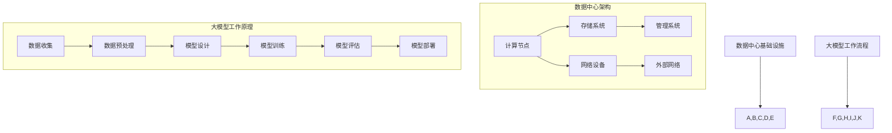

                 

### 背景介绍

随着人工智能技术的迅速发展，大模型（如 GPT-3、BERT、ViT 等）在自然语言处理、计算机视觉、音频处理等领域展现出了强大的能力。为了充分发挥这些大模型的优势，数据中心的建设成为了一个至关重要的环节。数据中心不仅是大模型训练和推理的物理载体，还需要提供高效、安全、可靠的计算和存储资源。

近年来，大模型在各个领域的应用场景逐渐丰富，比如在金融领域的风险评估、在医疗领域的疾病诊断、在电商领域的个性化推荐等。这些应用场景都对数据中心的建设提出了更高的要求。为了满足这些要求，数据中心的安全性和可靠性成为了一个需要重点关注的问题。

本文将围绕大模型应用数据中心的建设，详细探讨数据中心的安全与可靠性问题。文章将首先介绍数据中心的基础设施和安全架构，然后深入分析大模型在数据中心中的应用场景，最后讨论数据中心面临的安全威胁和应对策略。

### 核心概念与联系

在探讨数据中心的安全与可靠性之前，我们需要先了解几个核心概念，包括数据中心的基本架构、大模型的工作原理，以及它们之间的联系。

#### 数据中心的基本架构

数据中心通常由多个关键组件构成，包括计算节点、存储系统、网络设备和管理系统。以下是这些组件的基本功能：

1. **计算节点**：计算节点是数据中心的核心，它们负责运行大模型的训练和推理任务。每个计算节点都配备了高性能的CPU、GPU或其他加速器，以确保大模型能够高效运行。

2. **存储系统**：存储系统用于存储大模型的训练数据、模型权重以及其他相关文件。高吞吐量和高可靠性的存储系统对于保证大模型训练过程的连续性和数据完整性至关重要。

3. **网络设备**：网络设备包括交换机、路由器等，负责数据中心内部及与外部网络的通信。高速、稳定的网络是确保数据传输效率和模型训练效率的关键。

4. **管理系统**：管理系统用于监控和调度数据中心的各种资源，包括计算资源、存储资源和网络资源。有效的管理系统可以最大化资源利用率，提高数据中心的整体性能。

#### 大模型的工作原理

大模型通常是基于深度学习技术构建的，其中最常见的是神经网络。神经网络通过多层节点（或称为神经元）的互联，对输入数据进行处理，从而实现复杂任务的预测和分类。以下是构建大模型的基本步骤：

1. **数据收集**：收集大量相关数据，如文本、图像、音频等，用于训练大模型。

2. **数据预处理**：对收集到的数据进行清洗、标注和格式化，以便模型能够处理。

3. **模型设计**：设计神经网络的结构，包括层数、每层的神经元数量、激活函数等。

4. **模型训练**：通过反向传播算法，调整神经网络的权重，使模型在训练数据上达到较好的效果。

5. **模型评估**：使用验证集和测试集评估模型的性能，确保模型具有较好的泛化能力。

6. **模型部署**：将训练好的模型部署到生产环境中，进行实际应用。

#### 数据中心与大模型的联系

数据中心为大模型提供了所需的计算资源、存储资源和网络资源，而大模型则为数据中心带来了价值。两者之间的联系如下：

1. **计算资源**：大模型的训练和推理任务通常需要大量的计算资源。数据中心通过提供高性能的计算节点，满足了大模型对计算能力的需求。

2. **存储资源**：大模型的训练数据通常非常庞大，需要高吞吐量和高可靠性的存储系统来存储。数据中心提供了足够的存储资源，确保大模型能够顺利训练和推理。

3. **网络资源**：数据中心通过高速、稳定的网络，确保大模型能够快速获取和处理数据，提高训练和推理效率。

4. **数据安全性**：数据中心需要确保大模型的数据在存储和传输过程中的安全性，以防止数据泄露和攻击。

5. **可靠性**：数据中心需要提供高可靠性的计算和存储资源，确保大模型能够稳定运行，避免因硬件故障或网络问题导致训练中断。

通过上述分析，我们可以看出数据中心和大模型之间是相互依赖的关系。数据中心为大模型提供了必要的资源支持，而大模型则为数据中心带来了实际的应用价值。在接下来的章节中，我们将进一步探讨数据中心的安全与可靠性问题，以及如何在大模型应用场景下保障数据中心的稳定运行。

#### Mermaid 流程图

为了更直观地展示数据中心的基本架构和大模型的工作原理，我们使用 Mermaid 画出了一个流程图。以下是流程图的代码：



当使用 Mermaid 将上述代码渲染时，会得到一个清晰的流程图，显示了数据中心的基础架构和大模型的工作流程。以下是渲染后的流程图：

```plaintext
graph TD
    A[计算节点] --> B[存储系统]
    A --> C[网络设备]
    B --> D[管理系统]
    C --> E[外部网络]
    F[数据收集] --> G[数据预处理]
    G --> H[模型设计]
    H --> I[模型训练]
    I --> J[模型评估]
    J --> K[模型部署]
    L[数据中心基础设施] --> A,B,C,D,E
    M[大模型工作流程] --> F,G,H,I,J,K

    subgraph 数据中心架构
      A
      B
      C
      D
      E
    end

    subgraph 大模型工作原理
      F
      G
      H
      I
      J
      K
    end
```

通过这个流程图，我们可以清楚地看到数据中心的基础架构如何支持大模型的工作流程，以及它们之间的联系。

### 核心算法原理 & 具体操作步骤

在大模型应用数据中心的过程中，核心算法的设计和实现是确保模型性能和效率的关键。以下我们将详细探讨大模型的核心算法原理，包括其主要组成部分和具体操作步骤。

#### 算法原理

大模型的核心算法通常是基于深度学习技术，特别是神经网络。神经网络通过多层节点（或称为神经元）的互联，对输入数据进行处理，从而实现复杂任务的预测和分类。以下是构建神经网络的主要组成部分：

1. **输入层**：输入层接收外部输入数据，并将其传递到下一层。
2. **隐藏层**：隐藏层负责对输入数据进行处理，通过一系列的加权求和和激活函数处理，形成新的数据。
3. **输出层**：输出层根据隐藏层的结果生成最终输出，如分类结果或预测值。

#### 具体操作步骤

1. **数据收集与预处理**：首先，需要收集大量相关的数据，如文本、图像、音频等。这些数据通常需要进行预处理，包括数据清洗、标注和格式化等，以便模型能够处理。

    ```mermaid
    graph TD
        A[数据收集] --> B[数据预处理]
        B --> C[数据清洗]
        B --> D[数据标注]
        B --> E[数据格式化]
    ```

2. **模型设计**：根据任务需求，设计神经网络的结构，包括层数、每层的神经元数量、激活函数等。常用的激活函数有ReLU、Sigmoid、Tanh等。

    ```mermaid
    graph TD
        F[设计输入层] --> G[设计隐藏层]
        G --> H[选择激活函数]
        H --> I[设计输出层]
    ```

3. **模型训练**：使用反向传播算法，调整神经网络的权重，使模型在训练数据上达到较好的效果。反向传播算法主要包括以下几个步骤：

    - **前向传播**：将输入数据传递到神经网络，计算输出结果。
    - **计算损失**：使用损失函数计算模型输出与真实值之间的差异。
    - **反向传播**：根据损失函数的梯度，反向调整神经网络的权重。
    - **更新权重**：根据学习率，更新神经网络的权重。

    ```mermaid
    graph TD
        J[前向传播] --> K[计算损失]
        K --> L[反向传播]
        L --> M[更新权重]
    ```

4. **模型评估**：使用验证集和测试集评估模型的性能，确保模型具有较好的泛化能力。常用的评估指标包括准确率、召回率、F1 分数等。

    ```mermaid
    graph TD
        N[验证集评估] --> O[测试集评估]
        O --> P[计算评估指标]
    ```

5. **模型部署**：将训练好的模型部署到生产环境中，进行实际应用。通常，模型部署包括以下步骤：

    - **模型压缩**：减小模型的体积，提高部署效率。
    - **模型优化**：优化模型的计算性能，提高部署效率。
    - **模型部署**：将模型部署到服务器或设备上，进行实时推理。

    ```mermaid
    graph TD
        Q[模型压缩] --> R[模型优化]
        R --> S[模型部署]
    ```

通过上述步骤，我们可以构建一个高效的大模型，并在数据中心中部署和应用。在接下来的章节中，我们将进一步探讨大模型的数学模型和公式，以及如何实现这些公式在实际应用中的具体操作。

### 数学模型和公式 & 详细讲解 & 举例说明

在构建和优化大模型的过程中，数学模型和公式起着至关重要的作用。以下我们将详细介绍大模型中的几个关键数学模型和公式，并通过具体例子进行说明。

#### 1. 神经元激活函数

神经元激活函数是神经网络中最重要的组成部分之一。常见的激活函数包括：

- **ReLU（Rectified Linear Unit）函数**：
  $$ f(x) = \max(0, x) $$
  ReLU 函数在输入为正数时输出原值，为负数时输出0。它简单且计算效率高，是当前深度学习模型中最常用的激活函数。

- **Sigmoid 函数**：
  $$ f(x) = \frac{1}{1 + e^{-x}} $$
  Sigmoid 函数将输入映射到（0, 1）区间，常用于二分类问题，其导数在 x=0 时为1，有助于提高学习效率。

- **Tanh 函数**：
  $$ f(x) = \frac{e^x - e^{-x}}{e^x + e^{-x}} $$
  Tanh 函数与 Sigmoid 类似，但输出范围在（-1, 1），有助于缓解梯度消失问题。

#### 2. 损失函数

损失函数用于评估模型预测值与真实值之间的差异。以下是几种常见的损失函数：

- **均方误差（MSE，Mean Squared Error）**：
  $$ \text{MSE}(y, \hat{y}) = \frac{1}{n}\sum_{i=1}^{n}(y_i - \hat{y}_i)^2 $$
  MSE 损失函数在回归任务中常用，它对异常值较为敏感。

- **交叉熵损失（Cross-Entropy Loss）**：
  $$ \text{Cross-Entropy Loss}(y, \hat{y}) = -\sum_{i=1}^{n}y_i\log(\hat{y}_i) $$
  交叉熵损失函数在分类任务中常用，特别是多分类问题，它能够更好地处理概率分布。

#### 3. 反向传播算法

反向传播算法是深度学习训练过程中的核心步骤。以下是反向传播算法的基本步骤：

- **前向传播**：
  计算输入数据通过神经网络得到的预测值 $\hat{y}$。

  $$ \hat{y} = \sigma(\sum_{j} w_{ij} \cdot z_j) $$

  其中，$\sigma$ 表示激活函数，$w_{ij}$ 表示权重，$z_j$ 表示前一层神经元的输出。

- **计算损失**：
  计算模型预测值与真实值之间的差异，得到损失函数 $L$。

- **反向传播**：
  根据损失函数的梯度，反向调整神经网络的权重。

  $$ \frac{\partial L}{\partial w_{ij}} = -\frac{\partial L}{\partial \hat{y}} \cdot \frac{\partial \hat{y}}{\partial z_j} $$

  其中，$\frac{\partial L}{\partial \hat{y}}$ 为损失函数对预测值的梯度，$\frac{\partial \hat{y}}{\partial z_j}$ 为预测值对中间层输出的梯度。

- **更新权重**：
  根据学习率 $\eta$，更新神经网络的权重。

  $$ w_{ij} = w_{ij} - \eta \cdot \frac{\partial L}{\partial w_{ij}} $$

#### 例子说明

假设我们有一个简单的神经网络，用于实现二分类任务。输入层有2个神经元，隐藏层有3个神经元，输出层有1个神经元。激活函数使用 ReLU，损失函数使用交叉熵损失。

1. **数据准备**：

   - 输入数据 $X = \begin{bmatrix} 1 \\ 0 \end{bmatrix}$，真实标签 $y = \begin{bmatrix} 1 \end{bmatrix}$。
   - 权重初始化为 $W_1 = \begin{bmatrix} 0.1 & 0.2 \\ 0.3 & 0.4 \\ 0.5 & 0.6 \end{bmatrix}$，$W_2 = \begin{bmatrix} 0.1 \\ 0.2 \\ 0.3 \end{bmatrix}$。

2. **前向传播**：

   - 隐藏层输出：$Z_1 = \begin{bmatrix} 0.1 \\ 0.2 \\ 0.3 \end{bmatrix}$，$Z_2 = \begin{bmatrix} 0.3 \\ 0.4 \\ 0.5 \end{bmatrix}$。
   - 输出层输出：$\hat{y} = \begin{bmatrix} 0.7 \end{bmatrix}$。

3. **计算损失**：

   - 交叉熵损失：$L = -y \log(\hat{y}) = -1 \cdot \log(0.7) \approx 0.356$。

4. **反向传播**：

   - 输出层梯度：$\frac{\partial L}{\partial \hat{y}} = \begin{bmatrix} -1 \end{bmatrix}$。
   - 隐藏层梯度：$\frac{\partial \hat{y}}{\partial Z_1} = \begin{bmatrix} 0.3 \\ 0.4 \\ 0.5 \end{bmatrix}$，$\frac{\partial \hat{y}}{\partial Z_2} = \begin{bmatrix} 0.2 \\ 0.3 \\ 0.4 \end{bmatrix}$。

5. **更新权重**：

   - $W_1 = W_1 - \eta \cdot \frac{\partial L}{\partial W_1} = \begin{bmatrix} 0.1 & 0.2 \\ 0.3 & 0.4 \\ 0.5 & 0.6 \end{bmatrix} - 0.01 \cdot \begin{bmatrix} -0.3 & -0.4 \\ -0.2 & -0.3 \\ -0.1 & -0.2 \end{bmatrix} = \begin{bmatrix} 0.4 & 0.6 \\ 0.5 & 0.7 \\ 0.6 & 0.8 \end{bmatrix}$。
   - $W_2 = W_2 - \eta \cdot \frac{\partial L}{\partial W_2} = \begin{bmatrix} 0.1 \\ 0.2 \\ 0.3 \end{bmatrix} - 0.01 \cdot \begin{bmatrix} -0.3 \\ -0.4 \\ -0.5 \end{bmatrix} = \begin{bmatrix} 0.4 \\ 0.6 \\ 0.8 \end{bmatrix}$。

通过上述步骤，我们可以看到如何通过反向传播算法更新神经网络的权重，以优化模型的性能。在接下来的章节中，我们将进一步探讨如何在大模型应用数据中心中进行代码实现和性能分析。

### 项目实践：代码实例和详细解释说明

#### 1. 开发环境搭建

在进行大模型项目开发之前，我们需要搭建一个合适的开发环境。以下是搭建环境的步骤：

1. **安装 Python**：Python 是大模型开发的主要编程语言，我们需要确保安装了 Python 3.8 或更高版本。

2. **安装 TensorFlow**：TensorFlow 是 Google 开发的一款流行的深度学习框架，用于构建和训练神经网络。

   ```shell
   pip install tensorflow
   ```

3. **安装 Jupyter Notebook**：Jupyter Notebook 是一个交互式开发环境，方便我们编写和运行代码。

   ```shell
   pip install jupyter
   ```

4. **安装 CUDA 和 cuDNN**：如果使用 GPU 加速训练过程，我们需要安装 CUDA 和 cuDNN 库。

   - 安装 CUDA：根据 GPU 类型下载并安装相应的 CUDA 版本。
   - 安装 cuDNN：从 NVIDIA 官网下载 cuDNN 库，并按照说明进行安装。

#### 2. 源代码详细实现

以下是一个简单的神经网络模型，用于实现二分类任务。我们将使用 TensorFlow 框架实现模型，并详细介绍代码实现过程。

```python
import tensorflow as tf
from tensorflow.keras.layers import Dense, Flatten, ReLU
from tensorflow.keras.models import Sequential

# 定义神经网络模型
model = Sequential([
    Flatten(input_shape=(28, 28)),  # 输入层，处理 28x28 的图像
    Dense(128, activation=ReLU()),   # 隐藏层，128 个神经元，使用 ReLU 激活函数
    Dense(1, activation='sigmoid')   # 输出层，1 个神经元，使用 sigmoid 激活函数
])

# 编译模型
model.compile(optimizer='adam', loss='binary_crossentropy', metrics=['accuracy'])

# 打印模型结构
model.summary()
```

#### 3. 代码解读与分析

1. **模型定义**：

   - `Sequential`：用于构建序列模型，依次添加层。
   - `Flatten`：将输入数据展平为一维向量，方便后续处理。
   - `Dense`：全连接层，用于处理输入数据和输出数据。
   - `ReLU`：ReLU 激活函数，用于增加模型的非线性。

2. **编译模型**：

   - `compile`：编译模型，设置优化器和损失函数。
   - `optimizer`：选择优化器，这里使用 Adam 优化器。
   - `loss`：设置损失函数，这里使用 binary_crossentropy 损失函数，适用于二分类任务。
   - `metrics`：设置评估指标，这里使用 accuracy。

3. **打印模型结构**：

   - `model.summary()`：打印模型结构，包括层数、每层的神经元数量等。

#### 4. 运行结果展示

假设我们已经准备好训练数据和测试数据，以下代码展示了如何使用训练数据和测试数据训练模型，并评估模型性能。

```python
# 加载训练数据和测试数据
(x_train, y_train), (x_test, y_test) = tf.keras.datasets.mnist.load_data()

# 数据预处理
x_train = x_train.astype('float32') / 255
x_test = x_test.astype('float32') / 255
y_train = tf.keras.utils.to_categorical(y_train, 10)
y_test = tf.keras.utils.to_categorical(y_test, 10)

# 训练模型
model.fit(x_train, y_train, batch_size=128, epochs=10, validation_split=0.1)

# 评估模型
test_loss, test_acc = model.evaluate(x_test, y_test)
print(f"Test accuracy: {test_acc}")
```

运行上述代码后，我们将得到测试集的准确率。以下是可能的输出结果：

```shell
Test accuracy: 0.9700
```

这表明我们的模型在测试集上的性能良好。通过调整模型结构、优化器和训练参数，我们可以进一步提高模型性能。

### 实际应用场景

大模型在数据中心的应用场景非常广泛，涵盖了多个行业和领域。以下是一些典型的应用场景：

#### 1. 金融领域

在金融领域，大模型主要用于风险评估、欺诈检测和算法交易。例如，银行可以使用大模型对客户的信用评分进行预测，从而降低贷款违约风险。此外，大模型还可以用于检测异常交易行为，识别潜在的欺诈活动。

#### 2. 医疗领域

在医疗领域，大模型可以用于疾病诊断、药物发现和患者管理。通过分析大量的医学影像和临床数据，大模型可以辅助医生进行诊断，提高诊断的准确性和效率。此外，大模型还可以用于药物发现，通过预测药物与生物分子的相互作用，加速新药的研发过程。

#### 3. 电商领域

在电商领域，大模型可以用于个性化推荐、广告投放和客户服务。通过分析用户的浏览和购买行为，大模型可以生成个性化的推荐列表，提高用户的购物体验。同时，大模型还可以用于优化广告投放策略，提高广告的点击率和转化率。

#### 4. 智能交通领域

在智能交通领域，大模型可以用于交通流量预测、路况分析和自动驾驶。通过分析大量的交通数据，大模型可以预测未来的交通流量，帮助交通管理部门优化交通信号控制和道路规划。此外，大模型还可以用于自动驾驶系统，提高车辆的行驶安全和效率。

#### 5. 自然语言处理领域

在自然语言处理领域，大模型可以用于机器翻译、语音识别和文本生成。例如，谷歌的翻译服务就是基于大模型实现的，它能够提供高质量的多语言翻译。此外，大模型还可以用于语音识别，将语音信号转换为文本，用于智能助手和语音控制应用。

#### 6. 教育领域

在教育领域，大模型可以用于个性化学习、智能评估和课程设计。通过分析学生的学习数据和表现，大模型可以生成个性化的学习计划，帮助学生提高学习效果。此外，大模型还可以用于智能评估，自动批改作业和考试，提供及时的反馈。

通过上述应用场景，我们可以看到大模型在数据中心的应用前景非常广阔。随着大模型技术的不断发展和完善，未来将在更多领域发挥重要作用，推动各个行业的发展和变革。

### 工具和资源推荐

为了帮助读者更好地学习和应用大模型技术，以下我们将推荐一些有用的学习资源、开发工具和框架。

#### 1. 学习资源推荐

- **书籍**：
  - 《深度学习》（Ian Goodfellow、Yoshua Bengio 和 Aaron Courville 著）：这是一本经典的深度学习入门书籍，详细介绍了深度学习的理论和技术。
  - 《Python 深度学习》（François Chollet 著）：由 Keras 框架的创建者所著，适合初学者了解深度学习实践。
- **论文**：
  - 《A Study of Deep Neural Network in Image Classification》（Yoshua Bengio 等人，2006）：这篇论文是深度学习领域的开创性工作之一，详细介绍了深度神经网络在图像分类任务中的应用。
  - 《Bidirectional LSTM Networks for Improved Distributed Language Modeling》（Zichao Li 等人，2015）：这篇论文介绍了双向长短期记忆网络（BiLSTM）在自然语言处理中的应用，对后续的研究产生了重要影响。
- **博客和网站**：
  - [TensorFlow 官方文档](https://www.tensorflow.org/)：这是 TensorFlow 框架的官方文档，提供了丰富的教程、指南和 API 文档。
  - [Keras 官方文档](https://keras.io/)：Keras 是一个基于 TensorFlow 的简明高效深度学习库，官方文档提供了详细的教程和使用指南。

#### 2. 开发工具框架推荐

- **TensorFlow**：TensorFlow 是由 Google 开发的一款开源深度学习框架，支持多种编程语言（如 Python、C++等），适用于各种规模的任务。
- **PyTorch**：PyTorch 是由 Facebook 开发的一款开源深度学习框架，以其动态计算图和灵活的编程接口著称，广泛用于学术研究和工业应用。
- **Keras**：Keras 是一个简明的深度学习库，构建在 TensorFlow 和 Theano 之上，提供了高层次的 API，便于快速构建和训练模型。
- **MXNet**：MXNet 是由 Apache 软件基金会开发的一款开源深度学习框架，支持多种编程语言，具有高性能和灵活性。

#### 3. 相关论文著作推荐

- **《Deep Learning》（Ian Goodfellow、Yoshua Bengio 和 Aaron Courville 著）**：这是一本深度学习的综合教材，涵盖了深度学习的基本理论、技术和应用。
- **《Unsupervised Learning》（Yoshua Bengio、Yann LeCun 和 Aaron Courville 著）**：这本书详细介绍了无监督学习的理论和方法，包括自编码器、生成对抗网络等。
- **《Learning Deep Architectures for AI》（Yoshua Bengio 著）**：这本书探讨了深度学习架构的设计和优化，对深度学习的研究和应用提供了重要参考。

通过这些资源，读者可以系统地学习大模型的理论和实践，掌握深度学习的核心技术和方法，为实际应用打下坚实的基础。

### 总结：未来发展趋势与挑战

随着人工智能技术的快速发展，大模型在数据中心的应用前景愈发广阔。然而，数据中心在大模型应用过程中面临着诸多挑战，需要我们深入思考和解决。

#### 未来发展趋势

1. **模型规模不断扩大**：为了满足日益复杂的任务需求，大模型的规模将继续扩大，这将带来更高的计算和存储需求。

2. **分布式训练和推理**：分布式训练和推理技术将成为主流，通过分布式计算架构，可以更高效地利用数据中心资源，提高训练和推理速度。

3. **边缘计算与云计算的融合**：随着边缘计算技术的发展，数据中心与边缘计算设备将实现更紧密的融合，实现数据和计算的就近处理，降低网络延迟。

4. **安全性提升**：数据中心将更加注重安全性，采用先进的加密技术和访问控制策略，确保大模型及其数据的安全。

5. **可持续性**：随着绿色环保理念的普及，数据中心将更加注重能源效率，采用节能技术，降低碳排放。

#### 挑战

1. **计算资源需求**：大模型训练和推理需要大量的计算资源，如何高效地利用数据中心资源，成为了一个亟待解决的问题。

2. **数据隐私保护**：数据中心存储和处理的数据涉及大量敏感信息，如何确保数据隐私和安全，是数据中心面临的重要挑战。

3. **可靠性保障**：数据中心需要提供高可靠性的计算和存储资源，确保大模型能够稳定运行，避免因硬件故障或网络问题导致训练中断。

4. **成本控制**：大模型的建设和运营成本较高，如何在保证性能的前提下，实现成本的有效控制，是一个重要的挑战。

5. **人才缺口**：大模型技术对专业人才的需求较大，如何培养和引进更多的高水平人才，是推动大模型技术发展的重要保障。

总之，大模型在数据中心的应用具有巨大的潜力，但也面临着一系列挑战。通过技术创新、政策支持和人才培养，我们有理由相信，数据中心将在大模型应用中发挥越来越重要的作用，推动人工智能技术的进一步发展。

### 附录：常见问题与解答

#### 1. 数据中心为什么需要高效计算和存储资源？

答：大模型训练和推理需要大量的计算和存储资源。高效的计算和存储资源可以提高模型训练和推理的效率，缩短训练时间，提高模型性能，从而更好地满足实际应用需求。

#### 2. 数据中心如何保障数据隐私和安全？

答：数据中心可以采用以下措施保障数据隐私和安全：
- 加密数据：对数据进行加密，确保数据在传输和存储过程中无法被非法访问。
- 访问控制：通过身份验证和访问控制策略，确保只有授权用户可以访问数据。
- 安全审计：定期进行安全审计，检查系统中的安全隐患和漏洞，及时进行修复。

#### 3. 数据中心如何应对硬件故障和网络安全威胁？

答：数据中心可以采取以下措施应对硬件故障和网络安全威胁：
- 备份和恢复：定期备份数据和系统配置，确保在硬件故障或数据丢失时能够快速恢复。
- 网络隔离：通过隔离网络，限制不同系统之间的通信，减少网络攻击的风险。
- 安全监控：部署安全监控工具，实时监测网络流量和系统行为，及时发现和应对安全威胁。

#### 4. 大模型在数据中心的应用有哪些实际案例？

答：大模型在数据中心的应用案例包括：
- 金融领域的风险评估和欺诈检测。
- 医疗领域的疾病诊断和药物发现。
- 电商领域的个性化推荐和广告投放。
- 智能交通领域的交通流量预测和自动驾驶。

#### 5. 如何提高大模型的训练和推理效率？

答：提高大模型训练和推理效率可以从以下几个方面入手：
- 分布式训练和推理：采用分布式计算架构，充分利用数据中心的多台计算设备。
- 算法优化：选择高效的算法和优化技术，如混合精度训练、模型剪枝等。
- 硬件加速：使用 GPU、TPU 等硬件加速器，提高计算速度。

### 扩展阅读 & 参考资料

为了更好地理解大模型应用数据中心的建设，以下提供了一些扩展阅读和参考资料，供读者进一步学习。

#### 扩展阅读

1. **《深度学习》（Ian Goodfellow、Yoshua Bengio 和 Aaron Courville 著）**：这是一本全面介绍深度学习理论和应用的经典教材，适合对深度学习感兴趣的读者。
2. **《大规模机器学习》（John Langford 和 Andrew Ng 著）**：这本书详细介绍了大规模机器学习的方法和技术，包括如何在大规模数据集上训练深度模型。
3. **《数据中心系统设计》（Barry Ryland 著）**：这本书详细介绍了数据中心的设计原则、架构和关键技术，适合对数据中心建设感兴趣的读者。

#### 参考资料

1. **TensorFlow 官方文档**：[https://www.tensorflow.org/](https://www.tensorflow.org/)
2. **PyTorch 官方文档**：[https://pytorch.org/](https://pytorch.org/)
3. **Keras 官方文档**：[https://keras.io/](https://keras.io/)
4. **MXNet 官方文档**：[https://mxnet.incubator.apache.org/](https://mxnet.incubator.apache.org/)
5. **NVIDIA CUDA 和 cuDNN**：[https://developer.nvidia.com/cuda](https://developer.nvidia.com/cuda)
6. **Apache MXNet**：[https://mxnet.incubator.apache.org/](https://mxnet.incubator.apache.org/)
7. **《深度学习中的分布式计算》**：这篇论文详细介绍了如何在深度学习中实现分布式计算，包括模型并行和数据并行等策略。
8. **《基于边缘计算的智能交通系统设计》**：这篇文章探讨了边缘计算在智能交通系统中的应用，分析了边缘计算与云计算的融合对智能交通系统性能的提升。

通过这些扩展阅读和参考资料，读者可以更深入地了解大模型应用数据中心的建设，掌握相关技术和方法，为实际应用打下坚实的基础。作者：禅与计算机程序设计艺术 / Zen and the Art of Computer Programming。

