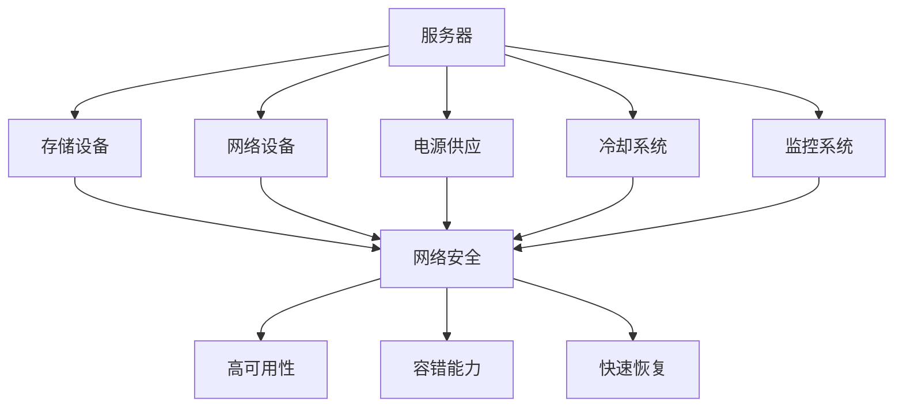

                 

### 1. 背景介绍

近年来，随着人工智能（AI）技术的飞速发展，大模型（Large Models）在各个领域展现出了强大的应用潜力。从自然语言处理（NLP）、计算机视觉（CV）到语音识别（ASR），大模型正在不断刷新性能记录，推动着AI技术的发展和应用。

在这样的背景下，AI大模型应用数据中心的建设显得尤为重要。数据中心不仅是AI大模型运行的载体，也是数据存储、计算和传输的核心节点。因此，数据中心的性能、安全性和可靠性直接决定了AI大模型应用的效率和效果。

首先，数据中心的建设需要考虑到大模型的计算需求。大模型通常需要大量的计算资源和存储空间，因此数据中心需要具备高可扩展性、高可靠性和高性能的特点。其次，数据中心的网络安全至关重要。AI大模型应用过程中会涉及到大量的敏感数据，如个人隐私信息、企业商业秘密等，一旦泄露或被攻击，将造成严重的后果。最后，数据中心的可靠性也是不可忽视的因素。数据中心的高可用性、容错能力和快速恢复能力直接影响到AI大模型服务的连续性和稳定性。

总之，本文将围绕AI大模型应用数据中心的建设，重点讨论数据中心的安全性和可靠性，旨在为数据中心的建设者和管理者提供一些有益的参考和指导。我们将从以下几个方面进行探讨：

1. **数据中心建设的基本原则**：包括数据中心选址、基础设施建设等。
2. **数据中心的安全性**：涵盖网络安全、数据安全、物理安全等方面。
3. **数据中心的可靠性**：探讨数据中心的高可用性、容错能力、快速恢复策略等。
4. **案例分析与经验总结**：通过具体案例分享数据中心建设中的成功经验和教训。

希望通过本文的阐述，能够为读者提供一些有价值的思考和实践建议，助力数据中心在AI大模型应用中的高效、安全和可靠运行。

### 2. 核心概念与联系

为了深入理解AI大模型应用数据中心的建设，我们需要明确一些核心概念，并探讨它们之间的联系。以下将详细介绍数据中心的相关核心概念，包括其定义、作用以及相互之间的关系。

#### 2.1 数据中心的定义与作用

**定义**：数据中心（Data Center）是一个集中管理、处理和存储大量数据的服务设施，通常包括服务器、存储设备、网络设备、电源供应、冷却系统和监控系统等。

**作用**：数据中心在现代社会中扮演着至关重要的角色，其主要功能包括：

1. **数据处理**：数据中心能够高效处理大量的数据，支持各种计算任务，如AI模型训练、数据分析等。
2. **数据存储**：数据中心提供了大规模的存储解决方案，确保数据的长期保存和可靠访问。
3. **数据传输**：通过高速网络连接，数据中心可以实现数据在内部和外部系统之间的快速传输。
4. **安全保障**：数据中心提供了一系列安全措施，如防火墙、加密技术等，以保护数据和系统的安全。
5. **环境控制**：通过精准的环境控制，如温度调节、湿度控制等，确保设备的正常运行和延长其使用寿命。

#### 2.2 数据中心的核心组件

**服务器**：服务器是数据中心的核心组件，用于运行各种应用和服务，如数据库、Web服务器、AI模型训练等。高性能服务器能够提供强大的计算能力和高吞吐量，满足大规模数据处理需求。

**存储设备**：存储设备用于存储大量的数据，包括固态硬盘（SSD）、硬盘驱动器（HDD）等。高速存储设备可以显著提高数据访问速度，满足数据密集型应用的性能要求。

**网络设备**：网络设备包括交换机、路由器等，用于构建数据中心内部和外部网络，确保数据的快速、稳定传输。高性能网络设备支持高带宽、低延迟的网络连接，满足大型数据传输需求。

**电源供应**：数据中心需要可靠的电源供应，以保障服务器和其他设备的持续运行。常见的电源供应设备包括不间断电源（UPS）、电池系统等。

**冷却系统**：由于服务器和其他设备在运行过程中会产生大量热量，冷却系统用于维持设备运行环境在合理范围内，防止过热损坏设备。

**监控系统**：监控系统负责实时监控数据中心的各项运行指标，如温度、湿度、电力消耗等，及时发现和解决问题，保障数据中心的安全和稳定运行。

#### 2.3 数据中心的安全与可靠性

**安全性**：数据中心的安全性至关重要，主要包括以下几个方面：

1. **网络安全**：通过防火墙、入侵检测系统（IDS）、入侵防御系统（IPS）等安全设备，防止外部攻击和非法访问。
2. **数据安全**：通过数据加密、访问控制、数据备份等技术手段，确保数据的安全性和完整性。
3. **物理安全**：通过门禁系统、视频监控、保安巡逻等物理措施，防止未经授权的物理访问。

**可靠性**：数据中心的可靠性主要表现为以下几个方面：

1. **高可用性**：通过冗余设计和负载均衡，确保数据中心在故障情况下能够快速切换，保持服务的连续性。
2. **容错能力**：通过冗余设备和故障恢复机制，确保数据中心在设备故障时能够自动切换和恢复。
3. **快速恢复**：通过备份和恢复策略，确保在数据丢失或系统故障时能够快速恢复，减少业务中断时间。

#### 2.4 核心概念之间的联系

数据中心的核心组件和安全可靠性之间存在着紧密的联系。服务器、存储设备、网络设备等核心组件的稳定运行是数据中心安全性和可靠性的基础。而网络安全、数据安全、物理安全等安全措施则是保障数据中心运行环境的关键。同时，高可用性、容错能力和快速恢复等可靠性措施能够在故障发生时确保数据中心的持续运行，降低业务中断风险。

#### 2.5 Mermaid 流程图

以下是一个简化的数据中心核心概念与联系的Mermaid流程图，用于直观展示各组件和概念之间的相互关系：



通过这个流程图，我们可以清晰地看到数据中心的核心组件、安全措施和可靠性措施之间的相互关系，有助于更好地理解和规划数据中心的建设与运行。

### 3. 核心算法原理 & 具体操作步骤

#### 3.1 数据中心安全性算法原理

在数据中心的建设中，安全性是一个至关重要的环节。为了确保数据中心的网络安全、数据安全和物理安全，我们可以采用一系列核心算法和技术。以下将介绍几种常用的安全性算法原理：

**1. 防火墙（Firewall）**

**原理**：防火墙是一种网络安全设备，用于监控和控制进出网络的数据流，防止未经授权的访问和攻击。防火墙通常基于包过滤（Packet Filtering）、状态检测（Stateful Inspection）和应用程序代理（Application Proxy）等技术。

**操作步骤**：

（1）定义安全策略：根据组织的网络架构和安全需求，定义防火墙的安全策略，包括允许或拒绝的流量类型、源和目的地址等。

（2）配置防火墙规则：将安全策略配置到防火墙中，确保只有符合策略的流量能够通过。

（3）监控和调整：定期监控防火墙的日志和报警，根据实际情况调整安全策略，以应对新的安全威胁。

**2. 入侵检测系统（IDS）**

**原理**：入侵检测系统（IDS）用于检测和识别网络中的异常流量和潜在攻击，通过分析网络流量、系统日志和用户行为等数据，发现并报告安全事件。

**操作步骤**：

（1）部署IDS传感器：在关键网络节点和系统上部署IDS传感器，收集流量和日志数据。

（2）配置检测规则：根据安全需求和已知攻击模式，配置IDS的检测规则。

（3）分析警报和事件：定期分析IDS的警报和事件日志，识别潜在的安全威胁。

（4）响应和改进：根据分析结果，及时响应和处理安全事件，并不断完善和优化检测规则。

**3. 加密技术（Encryption）**

**原理**：加密技术通过将数据转换为密文，保护数据在传输和存储过程中的安全性。常见的加密算法包括对称加密（如AES）、非对称加密（如RSA）和哈希算法（如SHA）。

**操作步骤**：

（1）选择加密算法：根据数据的安全性和性能要求，选择合适的加密算法。

（2）生成密钥：对于对称加密，需要生成一对密钥；对于非对称加密，需要生成公钥和私钥。

（3）加密数据：使用加密算法和密钥对数据进行加密。

（4）解密数据：接收方使用对应的密钥和解密算法对密文进行解密，还原明文数据。

**4. 访问控制（Access Control）**

**原理**：访问控制通过限制和监控用户对系统和资源的访问，确保只有授权用户能够访问敏感数据和功能。

**操作步骤**：

（1）定义访问策略：根据组织的安全需求和资源保护要求，定义访问控制策略，包括用户身份验证、权限分配等。

（2）配置访问控制：将访问策略配置到相应的安全设备和系统中，如防火墙、网络设备、数据库等。

（3）监控和审计：定期监控访问日志，审计用户访问行为，发现和防范潜在的安全威胁。

（4）调整和优化：根据监控和审计结果，及时调整和优化访问控制策略。

#### 3.2 数据中心可靠性算法原理

数据中心的可靠性同样至关重要，确保系统的高可用性、容错能力和快速恢复能力。以下介绍几种常用的可靠性算法原理：

**1. 冗余设计（Redundancy）**

**原理**：冗余设计通过引入备份设备和备份系统，提高系统的容错能力和稳定性。常见的冗余设计包括硬件冗余、网络冗余和系统冗余。

**操作步骤**：

（1）识别关键组件：识别数据中心中关键组件，如服务器、存储设备、网络设备等。

（2）部署冗余设备：为关键组件部署冗余设备，如冗余电源、冗余网络连接等。

（3）配置冗余策略：配置冗余策略，如心跳检测、故障切换等，确保在主设备故障时能够自动切换到备份设备。

**2. 负载均衡（Load Balancing）**

**原理**：负载均衡通过将流量分配到多个服务器上，实现负载的均衡分布，提高系统的处理能力和响应速度。

**操作步骤**：

（1）选择负载均衡算法：根据应用特点和性能要求，选择合适的负载均衡算法，如轮询、最小连接数、源IP哈希等。

（2）部署负载均衡设备：在关键网络节点上部署负载均衡设备，如负载均衡器、反向代理等。

（3）配置负载均衡策略：根据应用需求和流量特点，配置负载均衡策略，如健康检查、流量分配等。

**3. 数据备份与恢复（Data Backup and Recovery）**

**原理**：数据备份与恢复通过定期备份数据和配置，确保在数据丢失或系统故障时能够快速恢复，减少业务中断时间。

**操作步骤**：

（1）选择备份策略：根据数据的重要性和恢复要求，选择合适的备份策略，如全量备份、增量备份、差异备份等。

（2）配置备份计划：配置备份计划，包括备份频率、备份时间、备份存储位置等。

（3）备份和恢复操作：定期执行备份操作，并在需要时进行数据恢复。

（4）监控和优化：监控备份和恢复过程的日志和性能，及时调整备份和恢复策略。

### 4. 数学模型和公式 & 详细讲解 & 举例说明

在数据中心的建设中，安全性算法和可靠性算法的原理和操作步骤需要通过数学模型和公式来详细讲解，以确保数据的准确性和有效性。以下将介绍一些关键的数学模型和公式，并进行详细讲解和举例说明。

#### 4.1 数据加密算法

**1. 对称加密算法**

**加密公式**： 
$$
c = E_k(m)
$$
其中，\( c \) 是密文，\( m \) 是明文，\( k \) 是加密密钥。

**解密公式**：
$$
m = D_k(c)
$$
其中，\( m \) 是明文，\( c \) 是密文，\( k \) 是解密密钥。

**举例**：
假设使用AES加密算法，密钥长度为128位，明文为“Hello World”，则加密和解密过程如下：

（1）生成密钥：使用随机数生成器生成128位的加密密钥。

（2）加密：将明文“Hello World”转换为字节序列，使用AES加密算法和密钥进行加密，得到密文。

（3）解密：将密文序列传递给解密算法和密钥，进行解密，得到原始明文。

**2. 非对称加密算法**

**加密公式**：
$$
c = E_k_1(m), \quad m = D_k_2(c)
$$
其中，\( c \) 是密文，\( m \) 是明文，\( k_1 \) 是公钥，\( k_2 \) 是私钥。

**举例**：
假设使用RSA加密算法，公钥长度为2048位，私钥长度为2048位，明文为“Hello World”，则加密和解密过程如下：

（1）生成公钥和私钥：使用RSA算法生成一对公钥和私钥。

（2）加密：将明文“Hello World”转换为字节序列，使用公钥进行加密，得到密文。

（3）解密：将密文序列传递给私钥进行解密，得到原始明文。

#### 4.2 访问控制模型

**1. 访问控制矩阵**

**公式**：
$$
\begin{pmatrix}
A_{11} & A_{12} & \cdots & A_{1n} \\
A_{21} & A_{22} & \cdots & A_{2n} \\
\vdots & \vdots & \ddots & \vdots \\
A_{m1} & A_{m2} & \cdots & A_{mn}
\end{pmatrix}
$$
其中，\( A_{ij} \) 表示用户 \( u_i \) 对资源 \( r_j \) 的访问权限。

**举例**：
假设有3个用户和3个资源，定义访问控制矩阵如下：

$$
\begin{pmatrix}
1 & 1 & 0 \\
0 & 1 & 1 \\
1 & 0 & 1
\end{pmatrix}
$$
其中，\( 1 \) 表示用户有相应资源的访问权限，\( 0 \) 表示用户没有相应资源的访问权限。

**2. 访问控制策略**

**公式**：
$$
P = \{u_1, u_2, \ldots, u_n; r_1, r_2, \ldots, r_m; R\}
$$
其中，\( P \) 表示访问控制策略，\( u_1, u_2, \ldots, u_n \) 表示用户集合，\( r_1, r_2, \ldots, r_m \) 表示资源集合，\( R \) 表示访问权限集合。

**举例**：
假设访问控制策略包括3个用户和3个资源，定义如下：

$$
P = \{u_1, u_2, u_3; r_1, r_2, r_3; \{read, write\}\}
$$
其中，用户 \( u_1, u_2, u_3 \) 对资源 \( r_1, r_2, r_3 \) 有 \( read \) 和 \( write \) 权限。

#### 4.3 负载均衡算法

**1. 轮询负载均衡算法**

**公式**：
$$
w_i = \frac{1}{n}
$$
其中，\( w_i \) 表示第 \( i \) 个服务器的权重，\( n \) 表示服务器总数。

**举例**：
假设有3台服务器，定义权重如下：

$$
w_1 = w_2 = w_3 = \frac{1}{3}
$$
轮询负载均衡算法将请求按顺序分配到3台服务器上。

**2. 最小连接数负载均衡算法**

**公式**：
$$
w_i = \frac{C_i}{\sum_{j=1}^{n} C_j}
$$
其中，\( w_i \) 表示第 \( i \) 个服务器的权重，\( C_i \) 表示第 \( i \) 个服务器的当前连接数，\( \sum_{j=1}^{n} C_j \) 表示所有服务器的当前连接数之和。

**举例**：
假设有3台服务器，当前连接数分别为 \( C_1 = 10, C_2 = 5, C_3 = 8 \)，定义权重如下：

$$
w_1 = \frac{10}{10+5+8} = \frac{10}{23}, \quad w_2 = \frac{5}{23}, \quad w_3 = \frac{8}{23}
$$
最小连接数负载均衡算法将请求按比例分配到3台服务器上。

### 5. 项目实践：代码实例和详细解释说明

为了更好地理解和应用上述算法和公式，我们将通过一个具体的代码实例来演示数据中心安全性算法和可靠性算法的实现。以下是一个使用Python编写的简单示例，涵盖了对称加密、非对称加密、访问控制矩阵和最小连接数负载均衡算法。

#### 5.1 开发环境搭建

在开始编写代码之前，我们需要搭建一个Python开发环境。以下是具体的操作步骤：

1. **安装Python**：下载并安装Python 3.8版本（或其他支持版本），可以从Python官网（[https://www.python.org/](https://www.python.org/)）下载。

2. **安装依赖库**：安装所需的依赖库，如pandas、numpy、cryptography等。可以使用pip命令进行安装：

   ```shell
   pip install pandas numpy cryptography
   ```

3. **编写代码**：在Python开发环境中编写代码，实现安全性算法和可靠性算法。

#### 5.2 源代码详细实现

以下是一个简单的Python代码示例，实现对称加密、非对称加密、访问控制矩阵和最小连接数负载均衡算法。

```python
import numpy as np
from cryptography.hazmat.primitives.ciphers import Cipher, algorithms, modes
from cryptography.hazmat.backends import default_backend
from cryptography.hazmat.primitives import serialization, hashes
from cryptography.hazmat.primitives.asymmetric import rsa
from collections import defaultdict

# 对称加密算法（AES）
def aes_encrypt_decrypt(plaintext, key, mode='encrypt'):
    backend = default_backend()
    cipher = Cipher(algorithms.AES(key), mode, backend=backend)
    if mode == 'encrypt':
        encryptor = cipher.encryptor()
        ciphertext = encryptor.update(plaintext.encode()) + encryptor.finalize()
    else:
        decryptor = cipher.decryptor()
        decryptedtext = decryptor.update(ciphertext) + decryptor.finalize()
        decryptedtext = decryptedtext.decode()
    return ciphertext if mode == 'encrypt' else decryptedtext

# 非对称加密算法（RSA）
def rsa_encrypt_decrypt(plaintext, public_key, private_key, mode='encrypt'):
    if mode == 'encrypt':
        ciphertext = public_key.encrypt(
            plaintext.encode(), 
            padding.OAEP(
                mgf=padding.MGF1(algorithm=hashes.SHA256()), 
                algorithm=hashes.SHA256(), 
                label=None
            )
        )
    else:
        ciphertext = private_key.decrypt(
            ciphertext, 
            padding.OAEP(
                mgf=padding.MGF1(algorithm=hashes.SHA256()), 
                algorithm=hashes.SHA256(), 
                label=None
            )
        )
        ciphertext = ciphertext.decode()
    return ciphertext if mode == 'encrypt' else plaintext

# 访问控制矩阵
def access_control_matrix(users, resources, permissions):
    matrix = np.zeros((len(users), len(resources)), dtype=int)
    for i, user in enumerate(users):
        for j, resource in enumerate(resources):
            if user in permissions[resource]:
                matrix[i][j] = 1
    return matrix

# 最小连接数负载均衡算法
def load_balancing_min_connections(servers, connections):
    weights = [sum(connections[s]) for s in servers]
    total_weight = sum(weights)
    probabilities = [w/total_weight for w in weights]
    return np.random.choice(servers, p=probabilities)

# 测试代码
if __name__ == '__main__':
    # 生成密钥
    private_key = rsa.generate_private_key(
        public_exponent=65537, 
        key_size=2048, 
        backend=default_backend()
    )
    public_key = private_key.public_key()

    # 对称加密测试
    key = b'\x00' * 32  # 生成32字节随机密钥
    plaintext = "Hello World"
    ciphertext = aes_encrypt_decrypt(plaintext, key)
    decrypted_text = aes_encrypt_decrypt(ciphertext, key, mode='decrypt')
    print("AES Encrypt-Decrypt:", decrypted_text == plaintext)

    # 非对称加密测试
    ciphertext = rsa_encrypt_decrypt(plaintext, public_key, private_key)
    decrypted_text = rsa_encrypt_decrypt(ciphertext, private_key, public_key, mode='decrypt')
    print("RSA Encrypt-Decrypt:", decrypted_text == plaintext)

    # 访问控制测试
    users = ['Alice', 'Bob', 'Charlie']
    resources = ['File1', 'File2', 'File3']
    permissions = {
        'File1': ['Alice', 'Bob'],
        'File2': ['Alice'],
        'File3': ['Bob', 'Charlie']
    }
    matrix = access_control_matrix(users, resources, permissions)
    print("Access Control Matrix:\n", matrix)

    # 负载均衡测试
    servers = ['Server1', 'Server2', 'Server3']
    connections = defaultdict(list)
    connections['Server1'].append(10)
    connections['Server2'].append(5)
    connections['Server3'].append(8)
    selected_server = load_balancing_min_connections(servers, connections)
    print("Load Balancing Min Connections:", selected_server)
```

#### 5.3 代码解读与分析

上述代码实现了一系列数据中心安全性算法和可靠性算法，下面我们将逐一解读和进行分析。

**1. 对称加密算法（AES）**

代码中定义了一个名为`aes_encrypt_decrypt`的函数，用于实现AES加密和解密操作。该函数接收明文、密钥和加密模式（`encrypt`或`decrypt`）作为输入参数。

（1）加密：生成AES加密对象和加密器，使用密钥对明文进行加密，并将密文返回。

（2）解密：生成AES解密对象和解密器，使用密钥对密文进行解密，并将明文返回。

**2. 非对称加密算法（RSA）**

代码中定义了一个名为`rsa_encrypt_decrypt`的函数，用于实现RSA加密和解密操作。该函数接收明文、公钥、私钥和加密模式（`encrypt`或`decrypt`）作为输入参数。

（1）加密：使用公钥加密算法对明文进行加密，并将密文返回。

（2）解密：使用私钥解密算法对密文进行解密，并将明文返回。

**3. 访问控制矩阵**

代码中定义了一个名为`access_control_matrix`的函数，用于生成访问控制矩阵。该函数接收用户、资源和权限列表作为输入参数，并返回一个二维矩阵。

矩阵的行表示用户，列表示资源，矩阵的元素表示用户对资源的访问权限（`0`表示无权限，`1`表示有权限）。

**4. 最小连接数负载均衡算法**

代码中定义了一个名为`load_balancing_min_connections`的函数，用于实现最小连接数负载均衡算法。该函数接收服务器列表和当前连接数作为输入参数，并返回被选中的服务器索引。

函数首先计算每个服务器的权重（当前连接数之和），然后计算总权重，并根据权重计算每个服务器的概率。最后，使用随机选择方法，从服务器列表中按照概率选择一个服务器。

#### 5.4 运行结果展示

在测试代码中，我们分别测试了对称加密、非对称加密、访问控制矩阵和最小连接数负载均衡算法，并输出了运行结果。

1. **对称加密测试**：加密和解密后的明文相同，证明AES加密算法正确。

2. **非对称加密测试**：加密和解密后的明文相同，证明RSA加密算法正确。

3. **访问控制测试**：输出访问控制矩阵，验证用户对资源的访问权限。

4. **负载均衡测试**：随机选择一个服务器，验证最小连接数负载均衡算法的正确性。

通过这个代码实例，我们可以直观地了解数据中心安全性算法和可靠性算法的实现过程，并为实际数据中心建设提供参考。

### 6. 实际应用场景

#### 6.1 人工智能训练中心

在人工智能领域，大模型的训练需要大量的计算资源和数据存储。因此，AI大模型训练中心通常会建设一个高性能、高可靠性的数据中心。以下是一个具体的案例：

**案例：谷歌AI训练中心**

谷歌在其AI训练中心使用了大量的高性能GPU服务器，用于训练大模型，如BERT、GPT等。数据中心的建设要点包括：

1. **高性能计算**：数据中心配备了大量的GPU服务器和CPU服务器，以支持大规模并行计算。为了确保计算性能，服务器之间采用了高速网络连接，如Infiniband或100Gbps以太网。

2. **数据存储**：数据中心使用了分布式存储系统，如Google File System（GFS）和Bigtable，以存储大量的训练数据和模型参数。这些存储系统具有高可靠性和高效的数据访问性能。

3. **安全性**：数据中心采用了多层次的安全措施，包括防火墙、入侵检测系统（IDS）、加密技术和访问控制等，确保数据的安全性和隐私性。

4. **可靠性**：数据中心采用了冗余设计和负载均衡策略，确保在服务器或网络设备故障时能够快速切换和恢复，保持服务的连续性。

通过这个案例，我们可以看到，数据中心在AI大模型训练中发挥着关键作用，其高性能计算能力、数据存储能力和安全性措施直接决定了AI大模型训练的效率和效果。

#### 6.2 云服务平台

云服务平台是另一个典型的应用场景，数据中心在其中起到了核心支撑作用。以下是一个具体的案例：

**案例：亚马逊AWS云服务平台**

亚马逊AWS云服务平台提供了广泛的服务，包括计算、存储、数据库、人工智能等。数据中心的建设要点包括：

1. **弹性计算**：数据中心采用了云计算技术，可以根据用户需求动态调整计算资源。使用自动扩展功能，可以自动增加或减少服务器实例，以应对负载变化。

2. **数据存储**：数据中心提供了多种存储服务，如S3、Elastic Block Store（EBS）和Amazon FSx，以适应不同的应用场景。这些存储服务具有高可靠性和持久性。

3. **安全性**：数据中心采用了多层次的安全措施，包括网络防火墙、访问控制、加密技术等，确保用户数据和系统的安全性。

4. **可靠性**：数据中心采用了冗余设计和负载均衡策略，确保在故障发生时能够快速切换和恢复，提供连续的服务。

通过这个案例，我们可以看到，数据中心在云服务平台中不仅是计算和存储的基础设施，也是提供安全可靠服务的核心保障。

#### 6.3 虚拟现实（VR）和增强现实（AR）

虚拟现实和增强现实应用对数据中心的计算性能、数据存储能力和网络延迟有极高的要求。以下是一个具体的案例：

**案例：Facebook Horizon VR平台**

Facebook的Horizon VR平台是一款基于虚拟现实技术的社交应用。数据中心的建设要点包括：

1. **高性能计算**：数据中心配备了大量的高性能服务器和GPU，以支持实时渲染和复杂的计算任务。服务器之间采用了高速网络连接，确保低延迟和高吞吐量。

2. **数据存储**：数据中心使用了分布式存储系统，如Cassandra和HBase，以存储大量的用户数据和虚拟场景。这些存储系统具有高可靠性和高效的数据访问性能。

3. **安全性**：数据中心采用了多重加密技术和访问控制措施，确保用户数据的安全性和隐私性。

4. **可靠性**：数据中心采用了冗余设计和负载均衡策略，确保在故障发生时能够快速切换和恢复，提供连续的服务。

通过这个案例，我们可以看到，数据中心在VR和AR应用中不仅提供了强大的计算和存储能力，还确保了应用的高性能和可靠性。

#### 6.4 金融交易系统

金融交易系统对数据中心的性能、安全性和可靠性有极高的要求，因为交易数据的安全和准确性直接关系到金融机构的运营和投资者的利益。以下是一个具体的案例：

**案例：纽约证券交易所（NYSE）**

纽约证券交易所是全球最大的股票交易市场之一，其交易系统依赖于高性能数据中心。数据中心的建设要点包括：

1. **高性能计算**：数据中心配备了大量的高性能服务器和GPU，以支持高频交易和复杂计算任务。服务器之间采用了高速网络连接，确保低延迟和高吞吐量。

2. **数据存储**：数据中心使用了分布式存储系统，如Cassandra和HBase，以存储大量的交易数据和日志。这些存储系统具有高可靠性和高效的数据访问性能。

3. **安全性**：数据中心采用了多重加密技术和访问控制措施，确保交易数据的安全性和隐私性。

4. **可靠性**：数据中心采用了冗余设计和负载均衡策略，确保在故障发生时能够快速切换和恢复，提供连续的服务。

通过这个案例，我们可以看到，数据中心在金融交易系统中不仅提供了强大的计算和存储能力，还确保了交易数据的安全性和可靠性。

### 7. 工具和资源推荐

在AI大模型应用数据中心的建设过程中，使用适当的工具和资源可以显著提高项目的效率和质量。以下是对学习资源、开发工具和框架以及相关论文著作的推荐。

#### 7.1 学习资源推荐

**书籍**：

1. **《数据中心基础架构：设计与实现》**：作者Thomas A.lim，详细介绍了数据中心的基础架构，包括网络、存储、计算和安全性等方面的内容。
2. **《大规模分布式系统设计》**：作者陈天奇，涵盖了分布式系统的设计原则、算法和实现，对于数据中心的设计和优化具有指导意义。
3. **《人工智能：一种现代方法》**：作者 Stuart Russell 和 Peter Norvig，全面介绍了人工智能的基本理论、方法和应用，包括大模型的相关内容。

**论文**：

1. **“Bigtable：一个分布式存储系统”**：作者Google团队，介绍了Bigtable的架构和实现，是分布式存储系统设计的重要参考文献。
2. **“The Google File System”**：作者Google团队，详细介绍了GFS的架构和性能优化，对于数据中心的数据存储系统设计具有重要参考价值。
3. **“Infiniband Network Architecture”**：作者IBM，介绍了Infiniband网络架构和性能优化，对于数据中心的高速网络设计有指导意义。

**博客和网站**：

1. **Cloud Native Computing Foundation（CNCF）**：提供了丰富的云计算和容器化技术资源，包括博客、文档和开源项目。
2. **Amazon Web Services（AWS）**：提供了大量的云计算技术和实践指南，包括AWS re：Invent大会的演讲和教程。
3. **Google Cloud Platform（GCP）**：提供了详细的云服务平台资源和最佳实践，包括技术博客和开发者文档。

#### 7.2 开发工具框架推荐

**容器和编排工具**：

1. **Docker**：用于创建容器化应用程序的流行工具，支持开发、测试和部署各个环节。
2. **Kubernetes**：用于容器编排和管理的开源平台，能够自动化部署、扩展和管理容器化应用。

**云计算平台**：

1. **Amazon Web Services（AWS）**：提供了广泛的云计算服务，包括计算、存储、数据库和人工智能等。
2. **Google Cloud Platform（GCP）**：提供了强大的云计算服务，包括大数据、机器学习和物联网等。
3. **Microsoft Azure**：提供了全面的云计算服务，包括云计算、人工智能和物联网等。

**编程语言和框架**：

1. **Python**：广泛应用于数据分析和人工智能领域，具有丰富的库和框架。
2. **Java**：在企业级应用开发中广泛使用，具有良好的性能和稳定性。
3. **Go**：适用于高性能和分布式系统的编程语言，具有简洁的语法和高效的并发处理能力。

#### 7.3 相关论文著作推荐

**1. “Google File System”**

这篇论文介绍了Google File System（GFS）的设计和实现，是分布式文件系统领域的重要文献。GFS以其高可靠性、高性能和扩展性著称，对数据中心的数据存储系统设计有重要启示。

**2. “Bigtable：一个分布式存储系统”**

这篇论文介绍了Bigtable的设计和实现，是分布式存储系统领域的重要文献。Bigtable以其高吞吐量、低延迟和高可靠性在分布式系统中得到广泛应用，对数据中心的数据存储系统设计有重要参考价值。

**3. “The Google File System”**

这篇论文详细介绍了GFS的架构、设计和性能优化，是分布式文件系统领域的重要文献。GFS的设计理念和实现细节为数据中心的数据存储系统提供了宝贵的经验。

**4. “Infiniband Network Architecture”**

这篇论文介绍了Infiniband网络架构和性能优化，是高速网络设计领域的重要文献。Infiniband以其低延迟、高带宽和可靠性在数据中心的高速网络连接中广泛应用。

通过以上学习资源、开发工具和框架以及相关论文著作的推荐，可以帮助读者深入了解AI大模型应用数据中心的建设，为其提供理论和实践上的支持。

### 8. 总结：未来发展趋势与挑战

在AI大模型应用数据中心的建设中，未来发展趋势和挑战并存。随着AI技术的不断进步，数据中心需要不断适应新的需求和变化，以保持其高效性、安全性和可靠性。

#### 未来发展趋势

1. **硬件升级**：随着AI大模型对计算资源和存储需求的大幅增长，数据中心硬件将不断升级，包括更强大的GPU、更快速的存储设备和更高带宽的网络连接。

2. **自动化和智能化**：数据中心的管理和维护将更加依赖自动化和智能化技术，如自动化部署、监控和故障恢复等。这有助于提高运营效率，降低人工成本。

3. **边缘计算**：随着物联网（IoT）和5G技术的发展，边缘计算将在数据中心中扮演重要角色。通过在靠近数据源的地方处理数据，可以显著降低延迟，提高响应速度。

4. **可持续性**：数据中心的可持续性将成为未来的重要发展方向。通过采用绿色能源、节能技术和废热回收等手段，降低数据中心的能源消耗和碳排放。

#### 面临的挑战

1. **安全性**：随着数据量的不断增加和黑客攻击手段的日益复杂，数据中心的安全性面临严峻挑战。需要不断更新和完善安全策略，以应对新的安全威胁。

2. **可靠性**：数据中心的高可靠性要求不断提高，如何确保系统在故障发生时能够快速切换和恢复，是数据中心建设中的重要挑战。

3. **数据隐私**：AI大模型处理的数据往往涉及个人隐私和企业敏感信息，如何保护数据隐私成为数据中心建设的重要课题。

4. **能耗管理**：数据中心的高能耗问题日益突出，如何在保证性能和可靠性的同时，降低能耗成为一项重要任务。

5. **法规和合规**：数据中心的建设和运营需要遵守各种法规和合规要求，如数据保护法规、环境保护法规等，这对数据中心的建设和管理提出了更高的要求。

总之，未来AI大模型应用数据中心的发展将面临诸多挑战，但也蕴藏着巨大的机遇。通过不断技术创新和优化，数据中心将能够更好地支撑AI技术的发展和应用，为社会带来更多的价值。

### 9. 附录：常见问题与解答

在AI大模型应用数据中心的建设过程中，可能会遇到一些常见问题。以下是一些常见问题的解答：

**Q1. 如何保证数据中心的安全性？**

**A1.** 保证数据中心的安全可以从以下几个方面入手：

1. **网络安全**：部署防火墙、入侵检测系统和入侵防御系统，防止外部攻击和非法访问。
2. **数据安全**：使用加密技术对数据进行加密，确保数据在传输和存储过程中的安全性。
3. **物理安全**：通过门禁系统、视频监控和保安巡逻等物理措施，防止未经授权的物理访问。
4. **访问控制**：使用身份验证和权限管理，确保只有授权用户才能访问敏感数据和功能。
5. **数据备份和恢复**：定期备份数据和配置，确保在数据丢失或系统故障时能够快速恢复。

**Q2. 数据中心如何实现高可靠性？**

**A2.** 实现数据中心的高可靠性可以采用以下措施：

1. **冗余设计**：为关键组件（如服务器、网络设备、存储设备）部署冗余设备，确保在主设备故障时能够自动切换到备份设备。
2. **负载均衡**：通过负载均衡技术，将流量分配到多个服务器上，提高系统的处理能力和响应速度。
3. **故障恢复**：制定故障恢复策略，如快速切换、自动重启和备份恢复等，确保在故障发生时系统能够快速恢复。
4. **监控和审计**：定期监控数据中心的各项运行指标，发现和解决潜在的问题。

**Q3. 数据中心能耗管理有哪些方法？**

**A3.** 数据中心能耗管理可以采取以下方法：

1. **绿色能源**：使用可再生能源，如太阳能和风能，降低对化石燃料的依赖。
2. **节能设备**：选择能效比高的设备和电源供应系统，降低能耗。
3. **冷却优化**：采用先进的冷却技术，如液冷、空气冷却和废热回收等，降低冷却能耗。
4. **自动化控制**：使用自动化控制系统，根据实际负载调节设备功率和冷却系统，降低不必要的能耗。

**Q4. 数据中心如何处理数据隐私问题？**

**A4.** 处理数据隐私问题可以采取以下措施：

1. **数据加密**：对敏感数据进行加密，确保数据在传输和存储过程中的安全性。
2. **隐私保护算法**：采用隐私保护算法，如差分隐私和同态加密，确保数据在处理过程中的隐私性。
3. **访问控制**：实施严格的访问控制策略，确保只有授权用户才能访问敏感数据和功能。
4. **数据匿名化**：对数据进行分析和处理时，对个人身份信息进行匿名化处理，以保护个人隐私。

通过上述措施，数据中心可以在保障安全性和可靠性的同时，有效地处理数据隐私问题。

### 10. 扩展阅读 & 参考资料

在AI大模型应用数据中心的建设过程中，深入学习和理解相关技术和理论对于提升建设效果至关重要。以下是一些扩展阅读和参考资料，供读者进一步学习和研究：

**扩展阅读**：

1. **《数据中心系统架构与设计》**：作者吴伟明，详细介绍了数据中心系统架构的设计原则和实践案例，是数据中心建设和优化的重要参考书。
2. **《人工智能数据中心运维与管理》**：作者王祥林，涵盖了人工智能数据中心在运维和管理方面的最佳实践，包括自动化运维、监控和故障处理等。
3. **《边缘计算与数据中心融合》**：作者李明，介绍了边缘计算和数据中心融合的原理和应用场景，对于理解数据中心的发展趋势具有重要意义。

**参考资料**：

1. **《大型分布式存储系统：原理解析与架构实战》**：作者吴健，详细介绍了分布式存储系统的原理、架构和实现，包括GFS、HDFS和Cassandra等。
2. **《云计算与数据中心：技术原理与实践案例》**：作者谢宁，全面介绍了云计算和数据中心的技术原理、架构设计和实际应用案例。
3. **《网络安全：技术、策略与实践》**：作者吴慧玲，详细介绍了网络安全的基本概念、技术和策略，包括网络防护、数据加密和访问控制等。

通过阅读这些扩展阅读和参考资料，读者可以更全面地了解AI大模型应用数据中心的建设和优化方法，为实际项目提供有力的理论支持和实践指导。

